# Opinion Poll by Market for Der Standard, 18–20 December 2017

<a href="#voting-intentions">Voting Intentions</a> | <a href="#seats">Seats</a> | <a href="#coalitions">Coalitions</a> | <a href="#technical-information">Technical Information</a>

## Voting Intentions

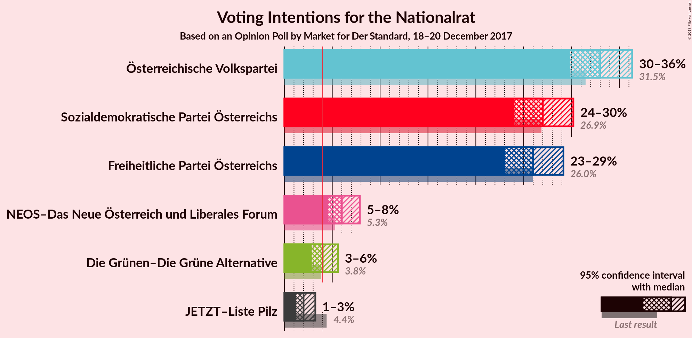

### Confidence Intervals

| Party | Last Result | Poll Result | 80% Confidence Interval | 90% Confidence Interval | 95% Confidence Interval | 99% Confidence Interval |
|:-----:|:-----------:|:-----------:|:-----------------------:|:-----------------------:|:-----------------------:|:-----------------------:|
| Österreichische Volkspartei | 31.5% | 33.0% | 30.9–35.2% |30.3–35.8% |29.8–36.3% |28.8–37.4% |
| Sozialdemokratische Partei Österreichs | 26.9% | 27.0% | 25.1–29.1% |24.5–29.7% |24.0–30.2% |23.1–31.2% |
| Freiheitliche Partei Österreichs | 26.0% | 26.0% | 24.1–28.1% |23.5–28.7% |23.1–29.2% |22.2–30.2% |
| NEOS–Das Neue Österreich und Liberales Forum | 5.3% | 6.0% | 5.0–7.2% |4.8–7.6% |4.6–7.9% |4.1–8.5% |
| Die Grünen–Die Grüne Alternative | 3.8% | 4.0% | 3.2–5.0% |3.0–5.3% |2.9–5.6% |2.5–6.1% |
| JETZT–Liste Pilz | 4.4% | 2.0% | 1.5–2.8% |1.4–3.0% |1.2–3.2% |1.0–3.7% |

*Note:* The poll result column reflects the actual value used in the calculations. Published results may vary slightly, and in addition be rounded to fewer digits.

## Seats

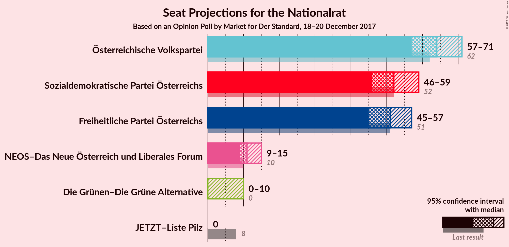

### Confidence Intervals

| Party | Last Result | Median | 80% Confidence Interval | 90% Confidence Interval | 95% Confidence Interval | 99% Confidence Interval |
|:-----:|:-----------:|:------:|:-----------------------:|:-----------------------:|:-----------------------:|:-----------------------:|
| <a href="#österreichische-volkspartei">Österreichische Volkspartei</a> | 62 | 64 | 60–69 |58–70 |57–71 |55–74 |
| <a href="#sozialdemokratische-partei-österreichs">Sozialdemokratische Partei Österreichs</a> | 52 | 52 | 48–57 |47–58 |46–59 |44–61 |
| <a href="#freiheitliche-partei-österreichs">Freiheitliche Partei Österreichs</a> | 51 | 51 | 46–55 |45–56 |45–57 |43–59 |
| <a href="#neos–das-neue-österreich-und-liberales-forum">NEOS–Das Neue Österreich und Liberales Forum</a> | 10 | 11 | 9–14 |9–14 |9–15 |8–16 |
| <a href="#die-grünen–die-grüne-alternative">Die Grünen–Die Grüne Alternative</a> | 0 | 0 | 0–9 |0–10 |0–10 |0–11 |
| <a href="#jetzt–liste-pilz">JETZT–Liste Pilz</a> | 8 | 0 | 0 |0 |0 |0 |

### Österreichische Volkspartei

*For a full overview of the results for this party, see the [Österreichische Volkspartei](party-österreichischevolkspartei.html) page.*

| Number of Seats | Probability | Accumulated | Special Marks |
|:---------------:|:-----------:|:-----------:|:-------------:|
| 53 | 0% | 100% |  |
| 54 | 0.1% | 99.9% |  |
| 55 | 0.4% | 99.8% |  |
| 56 | 0.6% | 99.4% |  |
| 57 | 2% | 98.8% |  |
| 58 | 3% | 97% |  |
| 59 | 3% | 94% |  |
| 60 | 5% | 90% |  |
| 61 | 9% | 85% |  |
| 62 | 9% | 76% | Last Result |
| 63 | 10% | 67% |  |
| 64 | 7% | 57% | Median |
| 65 | 10% | 50% |  |
| 66 | 10% | 40% |  |
| 67 | 12% | 30% |  |
| 68 | 7% | 18% |  |
| 69 | 5% | 12% |  |
| 70 | 4% | 7% |  |
| 71 | 1.2% | 3% |  |
| 72 | 0.6% | 1.4% |  |
| 73 | 0.3% | 0.8% |  |
| 74 | 0.3% | 0.5% |  |
| 75 | 0.1% | 0.2% |  |
| 76 | 0% | 0.1% |  |
| 77 | 0% | 0% |  |

### Sozialdemokratische Partei Österreichs

*For a full overview of the results for this party, see the [Sozialdemokratische Partei Österreichs](party-sozialdemokratischeparteiösterreichs.html) page.*

| Number of Seats | Probability | Accumulated | Special Marks |
|:---------------:|:-----------:|:-----------:|:-------------:|
| 42 | 0% | 100% |  |
| 43 | 0.2% | 99.9% |  |
| 44 | 0.3% | 99.8% |  |
| 45 | 0.9% | 99.5% |  |
| 46 | 2% | 98.6% |  |
| 47 | 4% | 97% |  |
| 48 | 6% | 93% |  |
| 49 | 6% | 87% |  |
| 50 | 10% | 82% |  |
| 51 | 10% | 72% |  |
| 52 | 12% | 62% | Last Result, Median |
| 53 | 14% | 50% |  |
| 54 | 10% | 36% |  |
| 55 | 10% | 26% |  |
| 56 | 6% | 16% |  |
| 57 | 4% | 10% |  |
| 58 | 3% | 6% |  |
| 59 | 0.9% | 3% |  |
| 60 | 0.9% | 2% |  |
| 61 | 0.4% | 0.8% |  |
| 62 | 0.1% | 0.4% |  |
| 63 | 0.2% | 0.2% |  |
| 64 | 0% | 0.1% |  |
| 65 | 0% | 0% |  |

### Freiheitliche Partei Österreichs

*For a full overview of the results for this party, see the [Freiheitliche Partei Österreichs](party-freiheitlicheparteiösterreichs.html) page.*

| Number of Seats | Probability | Accumulated | Special Marks |
|:---------------:|:-----------:|:-----------:|:-------------:|
| 40 | 0% | 100% |  |
| 41 | 0.1% | 99.9% |  |
| 42 | 0.3% | 99.8% |  |
| 43 | 0.6% | 99.5% |  |
| 44 | 1.3% | 99.0% |  |
| 45 | 3% | 98% |  |
| 46 | 6% | 95% |  |
| 47 | 5% | 89% |  |
| 48 | 9% | 84% |  |
| 49 | 11% | 75% |  |
| 50 | 12% | 64% |  |
| 51 | 10% | 51% | Last Result, Median |
| 52 | 13% | 41% |  |
| 53 | 11% | 28% |  |
| 54 | 6% | 18% |  |
| 55 | 4% | 12% |  |
| 56 | 4% | 8% |  |
| 57 | 3% | 5% |  |
| 58 | 0.8% | 1.5% |  |
| 59 | 0.4% | 0.7% |  |
| 60 | 0.1% | 0.3% |  |
| 61 | 0.1% | 0.1% |  |
| 62 | 0% | 0.1% |  |
| 63 | 0% | 0% |  |

### NEOS–Das Neue Österreich und Liberales Forum

*For a full overview of the results for this party, see the [NEOS–Das Neue Österreich und Liberales Forum](party-neos–dasneueösterreichundliberalesforum.html) page.*

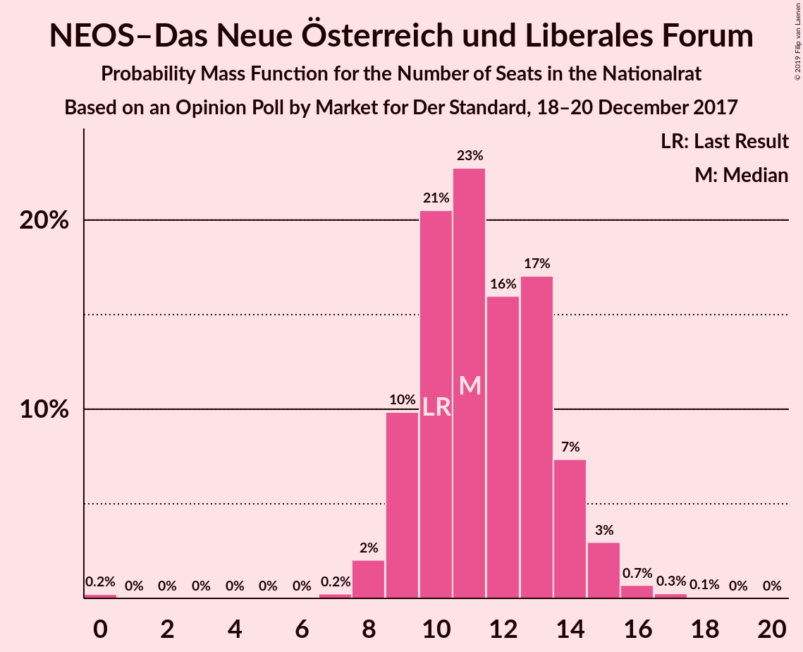

| Number of Seats | Probability | Accumulated | Special Marks |
|:---------------:|:-----------:|:-----------:|:-------------:|
| 0 | 0.2% | 100% |  |
| 1 | 0% | 99.8% |  |
| 2 | 0% | 99.8% |  |
| 3 | 0% | 99.8% |  |
| 4 | 0% | 99.8% |  |
| 5 | 0% | 99.8% |  |
| 6 | 0% | 99.8% |  |
| 7 | 0.2% | 99.8% |  |
| 8 | 2% | 99.5% |  |
| 9 | 10% | 98% |  |
| 10 | 21% | 88% | Last Result |
| 11 | 23% | 67% | Median |
| 12 | 16% | 44% |  |
| 13 | 17% | 28% |  |
| 14 | 7% | 11% |  |
| 15 | 3% | 4% |  |
| 16 | 0.7% | 1.0% |  |
| 17 | 0.3% | 0.3% |  |
| 18 | 0.1% | 0.1% |  |
| 19 | 0% | 0% |  |

### Die Grünen–Die Grüne Alternative

*For a full overview of the results for this party, see the [Die Grünen–Die Grüne Alternative](party-diegrünen–diegrünealternative.html) page.*

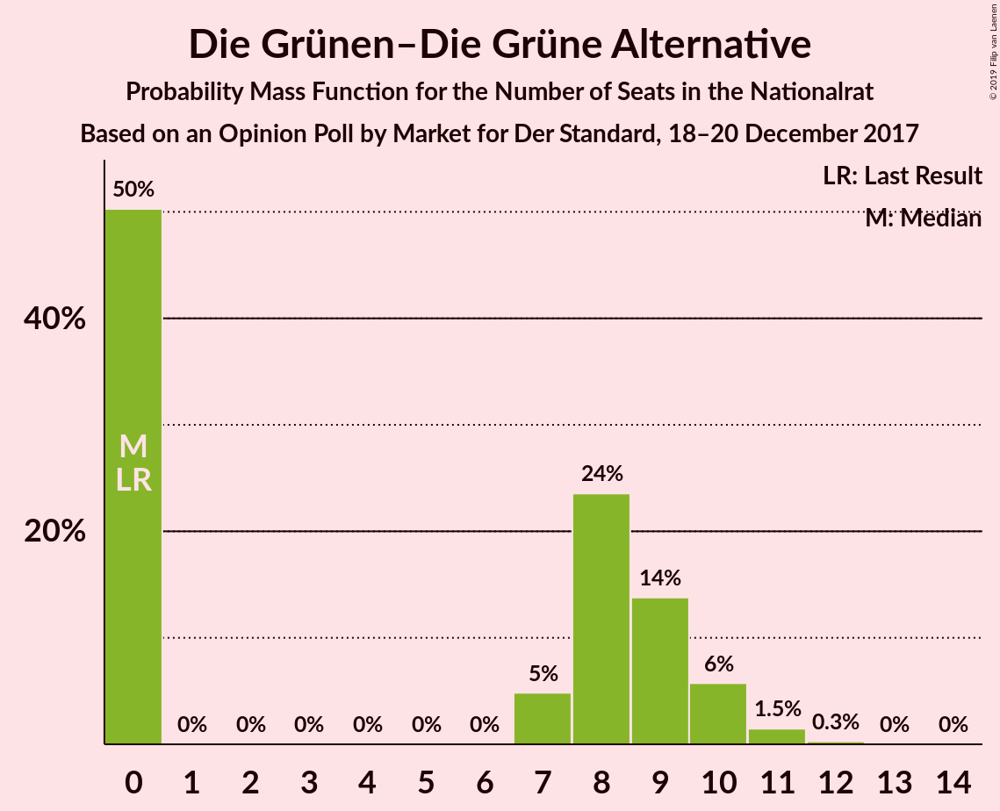

| Number of Seats | Probability | Accumulated | Special Marks |
|:---------------:|:-----------:|:-----------:|:-------------:|
| 0 | 50% | 100% | Last Result, Median |
| 1 | 0% | 50% |  |
| 2 | 0% | 50% |  |
| 3 | 0% | 50% |  |
| 4 | 0% | 50% |  |
| 5 | 0% | 50% |  |
| 6 | 0% | 50% |  |
| 7 | 5% | 50% |  |
| 8 | 24% | 45% |  |
| 9 | 14% | 21% |  |
| 10 | 6% | 8% |  |
| 11 | 1.5% | 2% |  |
| 12 | 0.3% | 0.3% |  |
| 13 | 0% | 0.1% |  |
| 14 | 0% | 0% |  |

### JETZT–Liste Pilz

*For a full overview of the results for this party, see the [JETZT–Liste Pilz](party-jetzt–listepilz.html) page.*

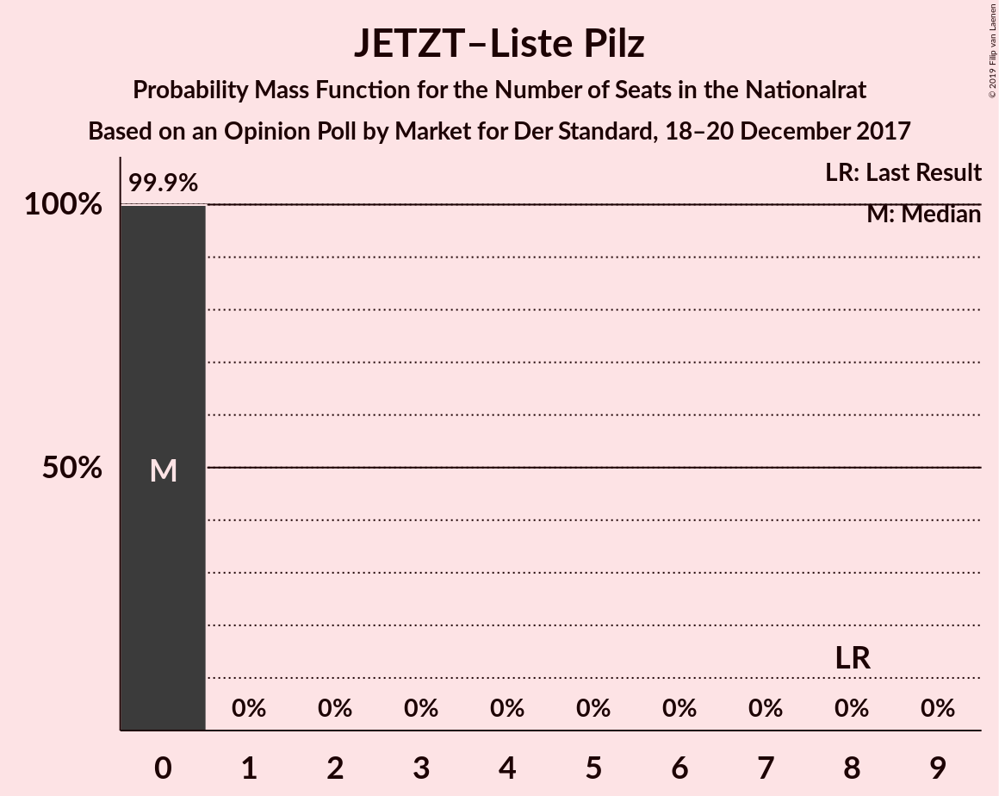

| Number of Seats | Probability | Accumulated | Special Marks |
|:---------------:|:-----------:|:-----------:|:-------------:|
| 0 | 99.9% | 100% | Median |
| 1 | 0% | 0.1% |  |
| 2 | 0% | 0.1% |  |
| 3 | 0% | 0.1% |  |
| 4 | 0% | 0.1% |  |
| 5 | 0% | 0.1% |  |
| 6 | 0% | 0.1% |  |
| 7 | 0% | 0.1% |  |
| 8 | 0% | 0.1% | Last Result |
| 9 | 0% | 0% |  |

## Coalitions

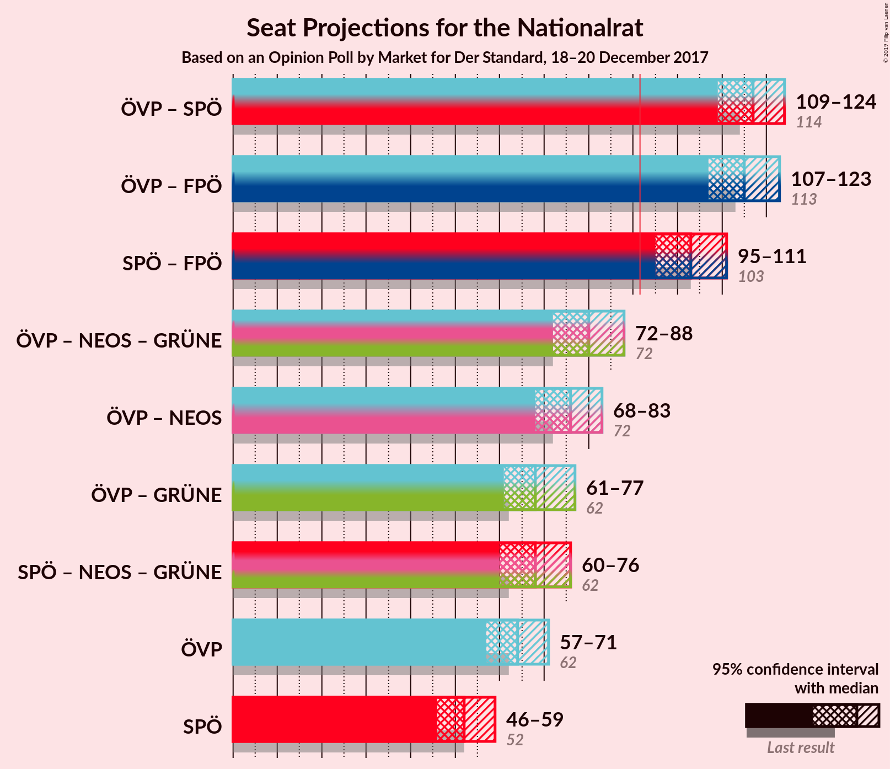

### Confidence Intervals

| Coalition | Last Result | Median | Majority? | 80% Confidence Interval | 90% Confidence Interval | 95% Confidence Interval | 99% Confidence Interval |
|:---------:|:-----------:|:------:|:---------:|:-----------------------:|:-----------------------:|:-----------------------:|:-----------------------:|
| Österreichische Volkspartei – Sozialdemokratische Partei Österreichs | 114 | 117 | 100% | 111–122 | 110–123 | 109–124 | 107–127 |
| Österreichische Volkspartei – Freiheitliche Partei Österreichs | 113 | 115 | 100% | 109–120 | 108–122 | 107–123 | 104–125 |
| Sozialdemokratische Partei Österreichs – Freiheitliche Partei Österreichs | 103 | 103 | 99.9% | 97–108 | 96–110 | 95–111 | 93–113 |
| Österreichische Volkspartei – NEOS–Das Neue Österreich und Liberales Forum – Die Grünen–Die Grüne Alternative | 72 | 80 | 0.1% | 75–86 | 73–87 | 72–88 | 70–90 |
| Österreichische Volkspartei – NEOS–Das Neue Österreich und Liberales Forum | 72 | 76 | 0% | 71–80 | 70–82 | 68–83 | 66–85 |
| Österreichische Volkspartei – Die Grünen–Die Grüne Alternative | 62 | 68 | 0% | 63–74 | 62–76 | 61–77 | 58–79 |
| Sozialdemokratische Partei Österreichs – NEOS–Das Neue Österreich und Liberales Forum – Die Grünen–Die Grüne Alternative | 62 | 68 | 0% | 63–74 | 61–75 | 60–76 | 58–79 |
| Österreichische Volkspartei | 62 | 64 | 0% | 60–69 | 58–70 | 57–71 | 55–74 |
| Sozialdemokratische Partei Österreichs | 52 | 52 | 0% | 48–57 | 47–58 | 46–59 | 44–61 |

### Österreichische Volkspartei – Sozialdemokratische Partei Österreichs

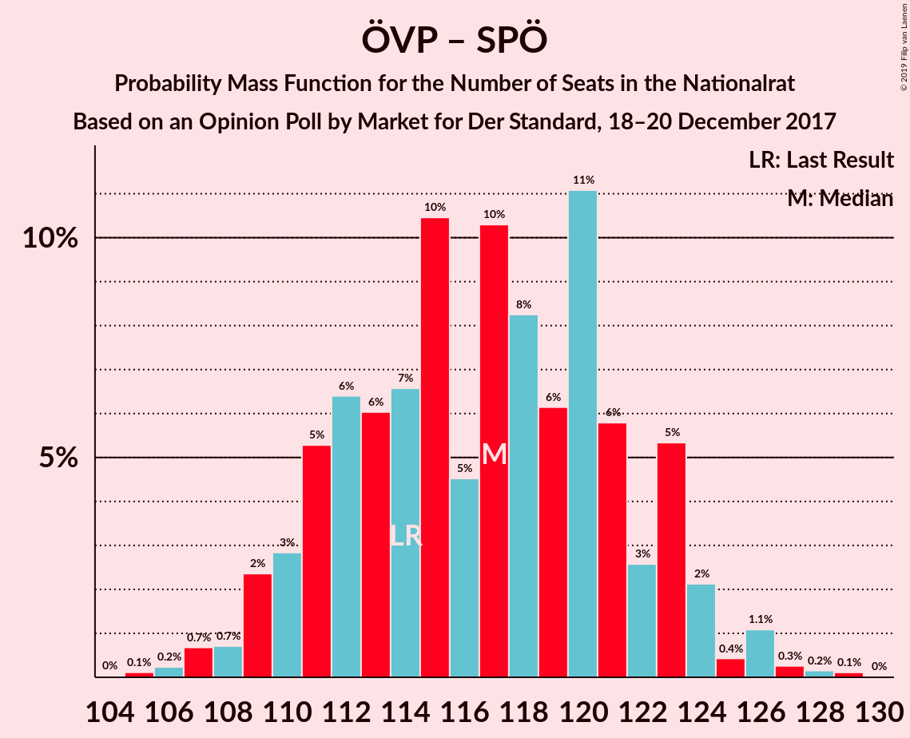

| Number of Seats | Probability | Accumulated | Special Marks |
|:---------------:|:-----------:|:-----------:|:-------------:|
| 104 | 0% | 100% |  |
| 105 | 0.1% | 99.9% |  |
| 106 | 0.2% | 99.8% |  |
| 107 | 0.7% | 99.6% |  |
| 108 | 0.7% | 98.9% |  |
| 109 | 2% | 98% |  |
| 110 | 3% | 96% |  |
| 111 | 5% | 93% |  |
| 112 | 6% | 88% |  |
| 113 | 6% | 81% |  |
| 114 | 7% | 75% | Last Result |
| 115 | 10% | 69% |  |
| 116 | 5% | 58% | Median |
| 117 | 10% | 54% |  |
| 118 | 8% | 43% |  |
| 119 | 6% | 35% |  |
| 120 | 11% | 29% |  |
| 121 | 6% | 18% |  |
| 122 | 3% | 12% |  |
| 123 | 5% | 10% |  |
| 124 | 2% | 4% |  |
| 125 | 0.4% | 2% |  |
| 126 | 1.1% | 2% |  |
| 127 | 0.3% | 0.6% |  |
| 128 | 0.2% | 0.3% |  |
| 129 | 0.1% | 0.2% |  |
| 130 | 0% | 0% |  |

### Österreichische Volkspartei – Freiheitliche Partei Österreichs

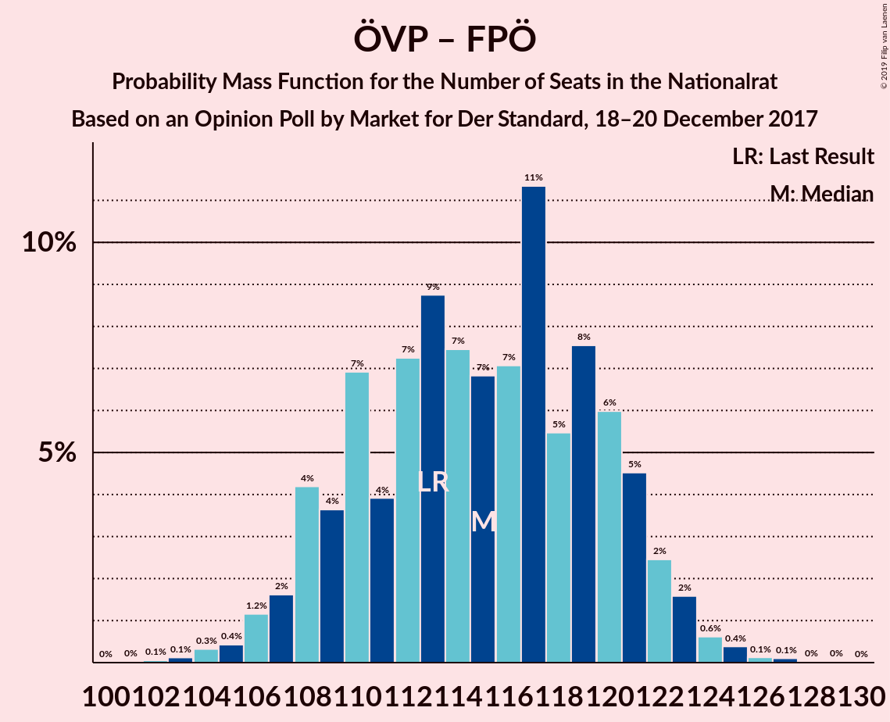

| Number of Seats | Probability | Accumulated | Special Marks |
|:---------------:|:-----------:|:-----------:|:-------------:|
| 102 | 0.1% | 100% |  |
| 103 | 0.1% | 99.9% |  |
| 104 | 0.3% | 99.8% |  |
| 105 | 0.4% | 99.5% |  |
| 106 | 1.2% | 99.0% |  |
| 107 | 2% | 98% |  |
| 108 | 4% | 96% |  |
| 109 | 4% | 92% |  |
| 110 | 7% | 88% |  |
| 111 | 4% | 82% |  |
| 112 | 7% | 78% |  |
| 113 | 9% | 70% | Last Result |
| 114 | 7% | 62% |  |
| 115 | 7% | 54% | Median |
| 116 | 7% | 47% |  |
| 117 | 11% | 40% |  |
| 118 | 5% | 29% |  |
| 119 | 8% | 23% |  |
| 120 | 6% | 16% |  |
| 121 | 5% | 10% |  |
| 122 | 2% | 5% |  |
| 123 | 2% | 3% |  |
| 124 | 0.6% | 1.3% |  |
| 125 | 0.4% | 0.7% |  |
| 126 | 0.1% | 0.3% |  |
| 127 | 0.1% | 0.2% |  |
| 128 | 0% | 0.1% |  |
| 129 | 0% | 0% |  |

### Sozialdemokratische Partei Österreichs – Freiheitliche Partei Österreichs

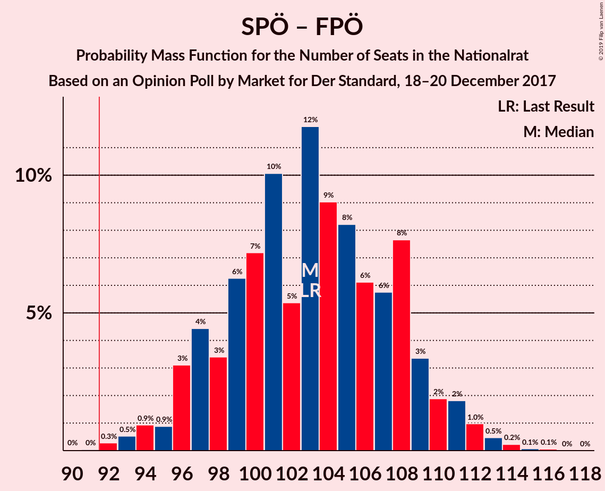

| Number of Seats | Probability | Accumulated | Special Marks |
|:---------------:|:-----------:|:-----------:|:-------------:|
| 90 | 0% | 100% |  |
| 91 | 0% | 99.9% |  |
| 92 | 0.3% | 99.9% | Majority |
| 93 | 0.5% | 99.6% |  |
| 94 | 0.9% | 99.1% |  |
| 95 | 0.9% | 98% |  |
| 96 | 3% | 97% |  |
| 97 | 4% | 94% |  |
| 98 | 3% | 90% |  |
| 99 | 6% | 86% |  |
| 100 | 7% | 80% |  |
| 101 | 10% | 73% |  |
| 102 | 5% | 63% |  |
| 103 | 12% | 57% | Last Result, Median |
| 104 | 9% | 46% |  |
| 105 | 8% | 37% |  |
| 106 | 6% | 28% |  |
| 107 | 6% | 22% |  |
| 108 | 8% | 17% |  |
| 109 | 3% | 9% |  |
| 110 | 2% | 6% |  |
| 111 | 2% | 4% |  |
| 112 | 1.0% | 2% |  |
| 113 | 0.5% | 0.9% |  |
| 114 | 0.2% | 0.4% |  |
| 115 | 0.1% | 0.2% |  |
| 116 | 0.1% | 0.1% |  |
| 117 | 0% | 0% |  |

### Österreichische Volkspartei – NEOS–Das Neue Österreich und Liberales Forum – Die Grünen–Die Grüne Alternative

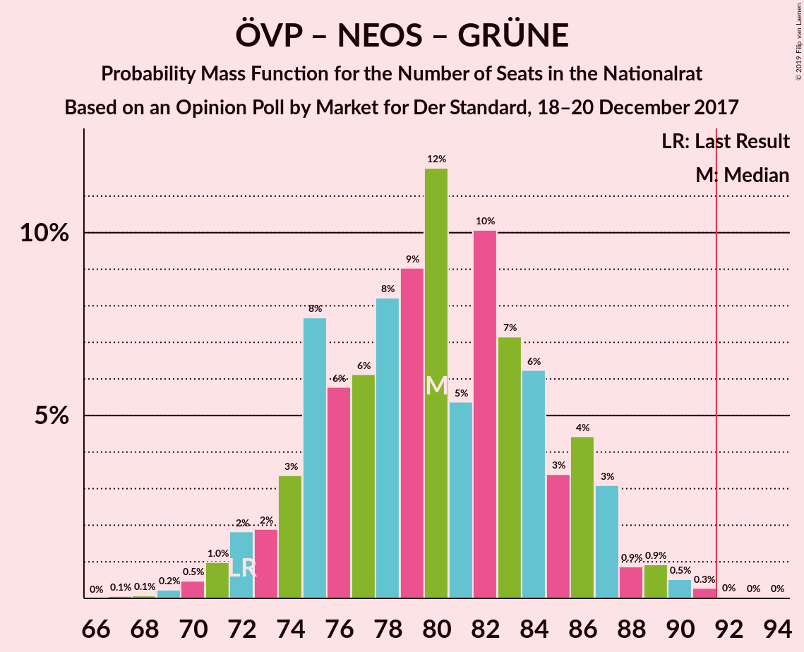

| Number of Seats | Probability | Accumulated | Special Marks |
|:---------------:|:-----------:|:-----------:|:-------------:|
| 67 | 0.1% | 100% |  |
| 68 | 0.1% | 99.9% |  |
| 69 | 0.2% | 99.8% |  |
| 70 | 0.5% | 99.6% |  |
| 71 | 1.0% | 99.1% |  |
| 72 | 2% | 98% | Last Result |
| 73 | 2% | 96% |  |
| 74 | 3% | 94% |  |
| 75 | 8% | 91% | Median |
| 76 | 6% | 83% |  |
| 77 | 6% | 78% |  |
| 78 | 8% | 71% |  |
| 79 | 9% | 63% |  |
| 80 | 12% | 54% |  |
| 81 | 5% | 42% |  |
| 82 | 10% | 37% |  |
| 83 | 7% | 27% |  |
| 84 | 6% | 20% |  |
| 85 | 3% | 14% |  |
| 86 | 4% | 10% |  |
| 87 | 3% | 6% |  |
| 88 | 0.9% | 3% |  |
| 89 | 0.9% | 2% |  |
| 90 | 0.5% | 0.9% |  |
| 91 | 0.3% | 0.4% |  |
| 92 | 0% | 0.1% | Majority |
| 93 | 0% | 0.1% |  |
| 94 | 0% | 0% |  |

### Österreichische Volkspartei – NEOS–Das Neue Österreich und Liberales Forum

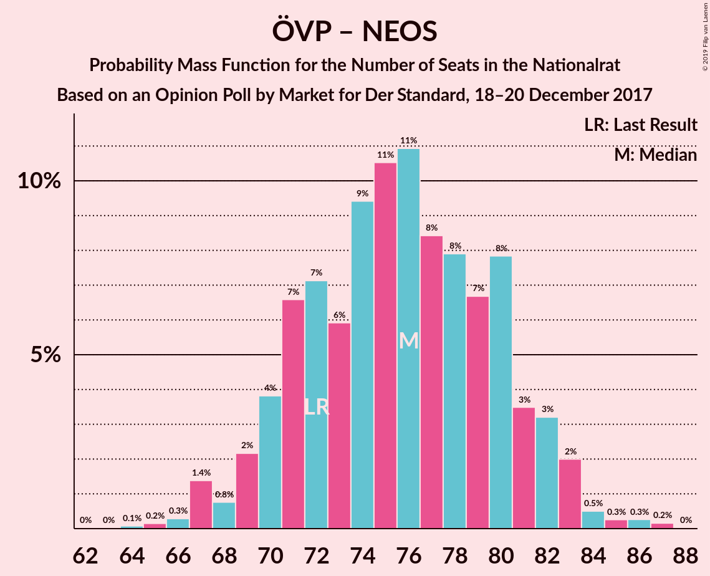

| Number of Seats | Probability | Accumulated | Special Marks |
|:---------------:|:-----------:|:-----------:|:-------------:|
| 63 | 0% | 100% |  |
| 64 | 0.1% | 99.9% |  |
| 65 | 0.2% | 99.9% |  |
| 66 | 0.3% | 99.7% |  |
| 67 | 1.4% | 99.4% |  |
| 68 | 0.8% | 98% |  |
| 69 | 2% | 97% |  |
| 70 | 4% | 95% |  |
| 71 | 7% | 91% |  |
| 72 | 7% | 85% | Last Result |
| 73 | 6% | 78% |  |
| 74 | 9% | 72% |  |
| 75 | 11% | 62% | Median |
| 76 | 11% | 52% |  |
| 77 | 8% | 41% |  |
| 78 | 8% | 32% |  |
| 79 | 7% | 24% |  |
| 80 | 8% | 18% |  |
| 81 | 3% | 10% |  |
| 82 | 3% | 6% |  |
| 83 | 2% | 3% |  |
| 84 | 0.5% | 1.2% |  |
| 85 | 0.3% | 0.7% |  |
| 86 | 0.3% | 0.5% |  |
| 87 | 0.2% | 0.2% |  |
| 88 | 0% | 0% |  |

### Österreichische Volkspartei – Die Grünen–Die Grüne Alternative

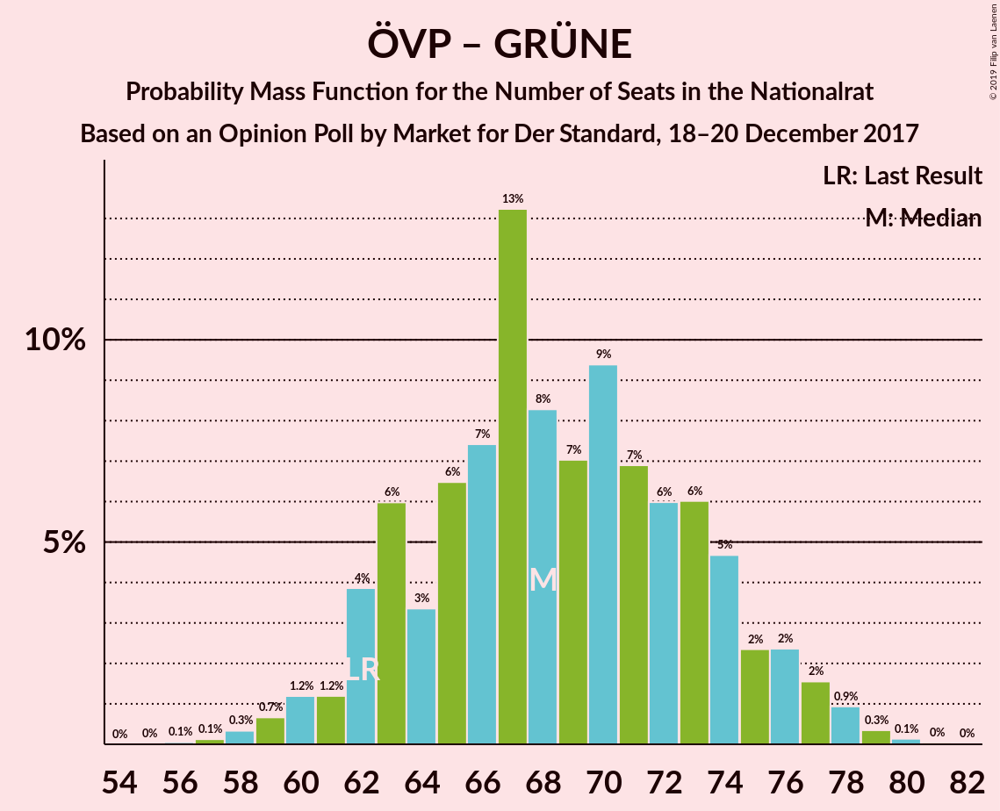

| Number of Seats | Probability | Accumulated | Special Marks |
|:---------------:|:-----------:|:-----------:|:-------------:|
| 56 | 0.1% | 100% |  |
| 57 | 0.1% | 99.9% |  |
| 58 | 0.3% | 99.8% |  |
| 59 | 0.7% | 99.5% |  |
| 60 | 1.2% | 98.8% |  |
| 61 | 1.2% | 98% |  |
| 62 | 4% | 96% | Last Result |
| 63 | 6% | 93% |  |
| 64 | 3% | 87% | Median |
| 65 | 6% | 83% |  |
| 66 | 7% | 77% |  |
| 67 | 13% | 69% |  |
| 68 | 8% | 56% |  |
| 69 | 7% | 48% |  |
| 70 | 9% | 41% |  |
| 71 | 7% | 31% |  |
| 72 | 6% | 24% |  |
| 73 | 6% | 18% |  |
| 74 | 5% | 12% |  |
| 75 | 2% | 8% |  |
| 76 | 2% | 5% |  |
| 77 | 2% | 3% |  |
| 78 | 0.9% | 2% |  |
| 79 | 0.3% | 0.6% |  |
| 80 | 0.1% | 0.2% |  |
| 81 | 0% | 0.1% |  |
| 82 | 0% | 0% |  |

### Sozialdemokratische Partei Österreichs – NEOS–Das Neue Österreich und Liberales Forum – Die Grünen–Die Grüne Alternative

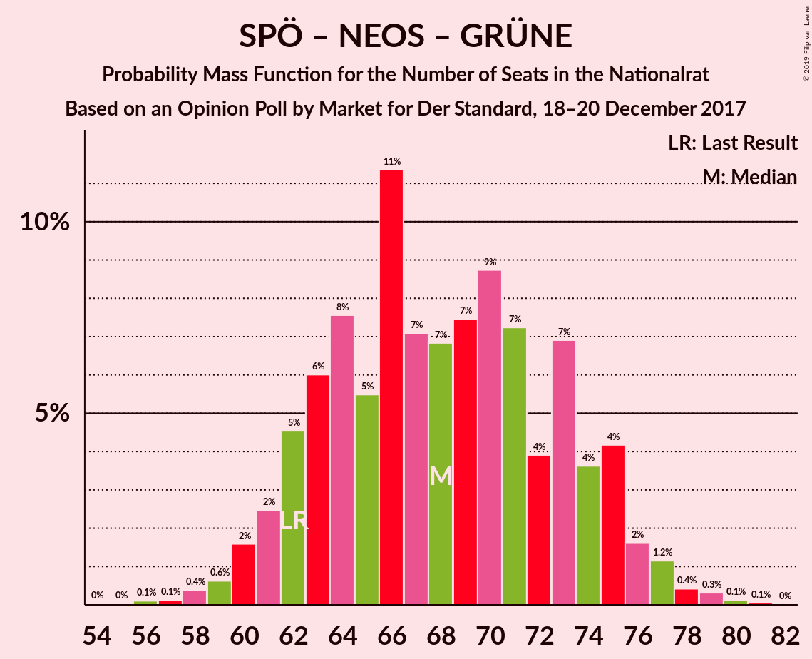

| Number of Seats | Probability | Accumulated | Special Marks |
|:---------------:|:-----------:|:-----------:|:-------------:|
| 55 | 0% | 100% |  |
| 56 | 0.1% | 99.9% |  |
| 57 | 0.1% | 99.8% |  |
| 58 | 0.4% | 99.7% |  |
| 59 | 0.6% | 99.3% |  |
| 60 | 2% | 98.7% |  |
| 61 | 2% | 97% |  |
| 62 | 5% | 95% | Last Result |
| 63 | 6% | 90% | Median |
| 64 | 8% | 84% |  |
| 65 | 5% | 77% |  |
| 66 | 11% | 71% |  |
| 67 | 7% | 60% |  |
| 68 | 7% | 53% |  |
| 69 | 7% | 46% |  |
| 70 | 9% | 38% |  |
| 71 | 7% | 30% |  |
| 72 | 4% | 22% |  |
| 73 | 7% | 18% |  |
| 74 | 4% | 11% |  |
| 75 | 4% | 8% |  |
| 76 | 2% | 4% |  |
| 77 | 1.2% | 2% |  |
| 78 | 0.4% | 0.9% |  |
| 79 | 0.3% | 0.5% |  |
| 80 | 0.1% | 0.2% |  |
| 81 | 0.1% | 0.1% |  |
| 82 | 0% | 0% |  |

### Österreichische Volkspartei

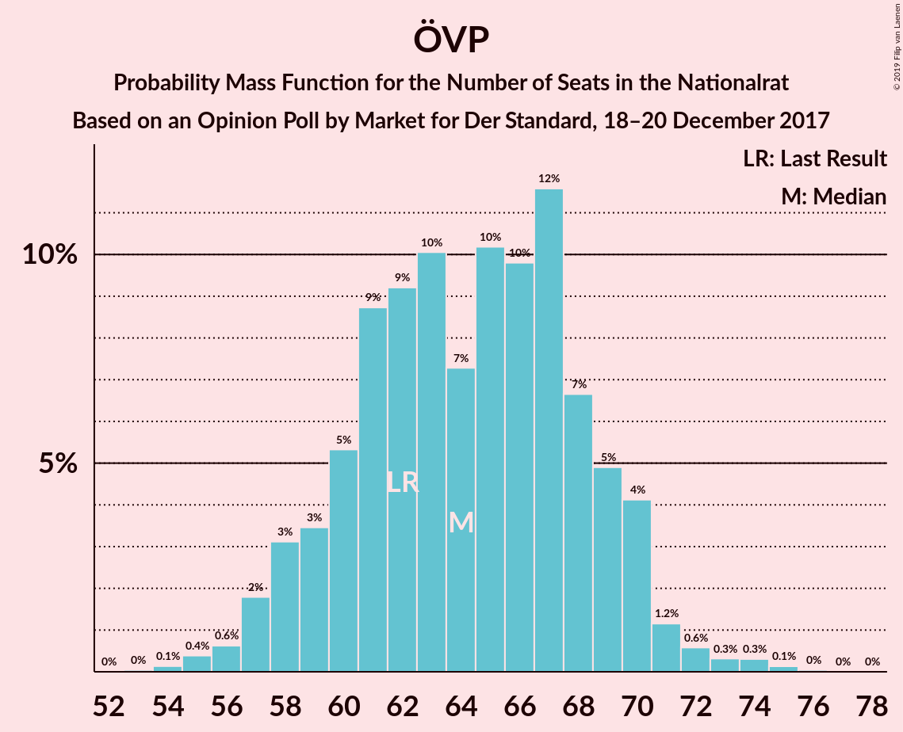

| Number of Seats | Probability | Accumulated | Special Marks |
|:---------------:|:-----------:|:-----------:|:-------------:|
| 53 | 0% | 100% |  |
| 54 | 0.1% | 99.9% |  |
| 55 | 0.4% | 99.8% |  |
| 56 | 0.6% | 99.4% |  |
| 57 | 2% | 98.8% |  |
| 58 | 3% | 97% |  |
| 59 | 3% | 94% |  |
| 60 | 5% | 90% |  |
| 61 | 9% | 85% |  |
| 62 | 9% | 76% | Last Result |
| 63 | 10% | 67% |  |
| 64 | 7% | 57% | Median |
| 65 | 10% | 50% |  |
| 66 | 10% | 40% |  |
| 67 | 12% | 30% |  |
| 68 | 7% | 18% |  |
| 69 | 5% | 12% |  |
| 70 | 4% | 7% |  |
| 71 | 1.2% | 3% |  |
| 72 | 0.6% | 1.4% |  |
| 73 | 0.3% | 0.8% |  |
| 74 | 0.3% | 0.5% |  |
| 75 | 0.1% | 0.2% |  |
| 76 | 0% | 0.1% |  |
| 77 | 0% | 0% |  |

### Sozialdemokratische Partei Österreichs

| Number of Seats | Probability | Accumulated | Special Marks |
|:---------------:|:-----------:|:-----------:|:-------------:|
| 42 | 0% | 100% |  |
| 43 | 0.2% | 99.9% |  |
| 44 | 0.3% | 99.8% |  |
| 45 | 0.9% | 99.5% |  |
| 46 | 2% | 98.6% |  |
| 47 | 4% | 97% |  |
| 48 | 6% | 93% |  |
| 49 | 6% | 87% |  |
| 50 | 10% | 82% |  |
| 51 | 10% | 72% |  |
| 52 | 12% | 62% | Last Result, Median |
| 53 | 14% | 50% |  |
| 54 | 10% | 36% |  |
| 55 | 10% | 26% |  |
| 56 | 6% | 16% |  |
| 57 | 4% | 10% |  |
| 58 | 3% | 6% |  |
| 59 | 0.9% | 3% |  |
| 60 | 0.9% | 2% |  |
| 61 | 0.4% | 0.8% |  |
| 62 | 0.1% | 0.4% |  |
| 63 | 0.2% | 0.2% |  |
| 64 | 0% | 0.1% |  |
| 65 | 0% | 0% |  |

## Technical Information

### Opinion Poll

+ **Polling firm:** Market
+ **Commissioner(s):** Der Standard
+ **Fieldwork period:** 18–20 December 2017

### Calculations

+ **Sample size:** 800
+ **Simulations done:** 131,072
+ **Error estimate:** 0.69%

