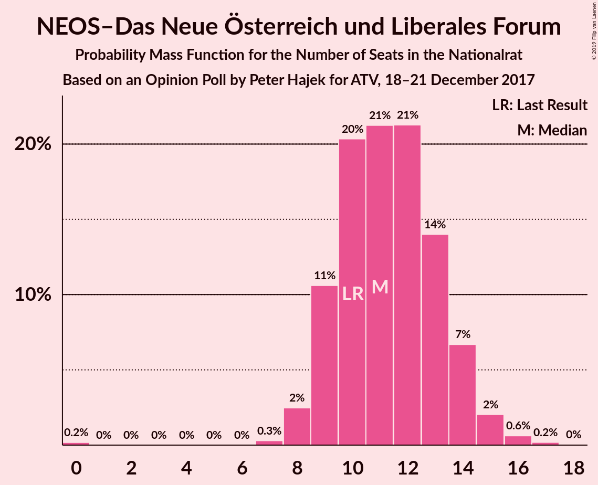
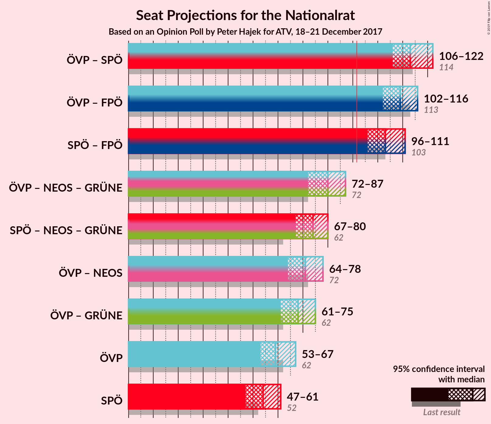
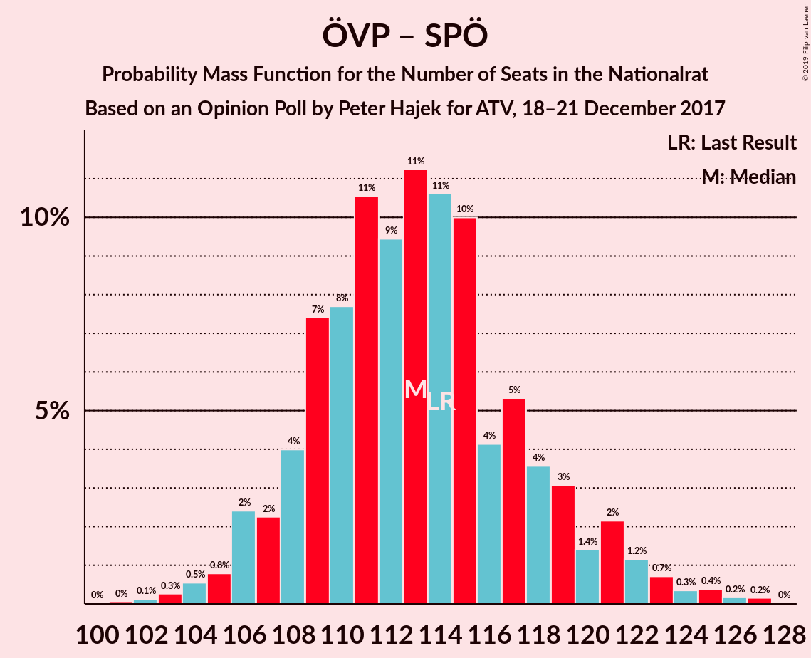
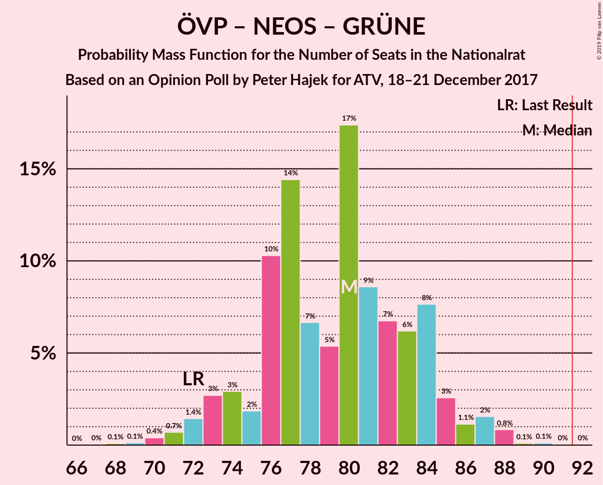

# Opinion Poll by Peter Hajek for ATV, 18–21 December 2017

<a href="#voting-intentions">Voting Intentions</a> | <a href="#seats">Seats</a> | <a href="#coalitions">Coalitions</a> | <a href="#technical-information">Technical Information</a>

## Voting Intentions

### Confidence Intervals

| Party | Last Result | Poll Result | 80% Confidence Interval | 90% Confidence Interval | 95% Confidence Interval | 99% Confidence Interval |
|:-----:|:-----------:|:-----------:|:-----------------------:|:-----------------------:|:-----------------------:|:-----------------------:|
| Österreichische Volkspartei | 31.5% | 31.0% | 28.8–33.3% |28.2–34.0% |27.7–34.5% |26.7–35.7% |
| Sozialdemokratische Partei Österreichs | 26.9% | 28.0% | 25.9–30.3% |25.3–30.9% |24.8–31.4% |23.8–32.5% |
| Freiheitliche Partei Österreichs | 26.0% | 26.0% | 24.0–28.2% |23.4–28.8% |22.9–29.4% |21.9–30.5% |
| NEOS–Das Neue Österreich und Liberales Forum | 5.3% | 6.0% | 5.0–7.3% |4.7–7.7% |4.5–8.0% |4.0–8.7% |
| Die Grünen–Die Grüne Alternative | 3.8% | 5.0% | 4.1–6.2% |3.8–6.6% |3.6–6.9% |3.2–7.5% |
| JETZT–Liste Pilz | 4.4% | 2.0% | 1.5–2.9% |1.3–3.1% |1.2–3.3% |1.0–3.8% |

*Note:* The poll result column reflects the actual value used in the calculations. Published results may vary slightly, and in addition be rounded to fewer digits.

## Seats

### Confidence Intervals

| Party | Last Result | Median | 80% Confidence Interval | 90% Confidence Interval | 95% Confidence Interval | 99% Confidence Interval |
|:-----:|:-----------:|:------:|:-----------------------:|:-----------------------:|:-----------------------:|:-----------------------:|
| <a href="#österreichische-volkspartei">Österreichische Volkspartei</a> | 62 | 59 | 55–64 |54–65 |53–67 |51–69 |
| <a href="#sozialdemokratische-partei-österreichs">Sozialdemokratische Partei Österreichs</a> | 52 | 54 | 50–58 |48–59 |47–61 |45–63 |
| <a href="#freiheitliche-partei-österreichs">Freiheitliche Partei Österreichs</a> | 51 | 50 | 47–53 |45–55 |44–56 |42–56 |
| <a href="#neos–das-neue-österreich-und-liberales-forum">NEOS–Das Neue Österreich und Liberales Forum</a> | 10 | 11 | 9–13 |9–14 |8–15 |8–16 |
| <a href="#die-grünen–die-grüne-alternative">Die Grünen–Die Grüne Alternative</a> | 0 | 9 | 8–11 |0–12 |0–13 |0–13 |
| <a href="#jetzt–liste-pilz">JETZT–Liste Pilz</a> | 8 | 0 | 0 |0 |0 |0 |

### Österreichische Volkspartei

*For a full overview of the results for this party, see the [Österreichische Volkspartei](party-österreichischevolkspartei.html) page.*

| Number of Seats | Probability | Accumulated | Special Marks |
|:---------------:|:-----------:|:-----------:|:-------------:|
| 49 | 0.1% | 100% |  |
| 50 | 0.2% | 99.9% |  |
| 51 | 0.6% | 99.7% |  |
| 52 | 1.1% | 99.1% |  |
| 53 | 2% | 98% |  |
| 54 | 3% | 96% |  |
| 55 | 5% | 93% |  |
| 56 | 10% | 88% |  |
| 57 | 6% | 77% |  |
| 58 | 13% | 71% |  |
| 59 | 10% | 58% | Median |
| 60 | 11% | 48% |  |
| 61 | 12% | 37% |  |
| 62 | 7% | 25% | Last Result |
| 63 | 7% | 19% |  |
| 64 | 4% | 12% |  |
| 65 | 3% | 8% |  |
| 66 | 2% | 5% |  |
| 67 | 1.4% | 3% |  |
| 68 | 0.7% | 1.4% |  |
| 69 | 0.3% | 0.6% |  |
| 70 | 0.2% | 0.3% |  |
| 71 | 0.1% | 0.1% |  |
| 72 | 0% | 0.1% |  |
| 73 | 0% | 0% |  |

### Sozialdemokratische Partei Österreichs

*For a full overview of the results for this party, see the [Sozialdemokratische Partei Österreichs](party-sozialdemokratischeparteiösterreichs.html) page.*

| Number of Seats | Probability | Accumulated | Special Marks |
|:---------------:|:-----------:|:-----------:|:-------------:|
| 43 | 0% | 100% |  |
| 44 | 0.2% | 99.9% |  |
| 45 | 0.3% | 99.8% |  |
| 46 | 0.7% | 99.5% |  |
| 47 | 2% | 98.7% |  |
| 48 | 2% | 97% |  |
| 49 | 4% | 94% |  |
| 50 | 8% | 90% |  |
| 51 | 7% | 82% |  |
| 52 | 11% | 75% | Last Result |
| 53 | 13% | 64% |  |
| 54 | 12% | 51% | Median |
| 55 | 8% | 39% |  |
| 56 | 11% | 30% |  |
| 57 | 6% | 19% |  |
| 58 | 5% | 13% |  |
| 59 | 3% | 8% |  |
| 60 | 2% | 5% |  |
| 61 | 2% | 3% |  |
| 62 | 0.5% | 1.1% |  |
| 63 | 0.4% | 0.6% |  |
| 64 | 0.2% | 0.2% |  |
| 65 | 0% | 0.1% |  |
| 66 | 0% | 0% |  |

### Freiheitliche Partei Österreichs

*For a full overview of the results for this party, see the [Freiheitliche Partei Österreichs](party-freiheitlicheparteiösterreichs.html) page.*

| Number of Seats | Probability | Accumulated | Special Marks |
|:---------------:|:-----------:|:-----------:|:-------------:|
| 41 | 0.1% | 100% |  |
| 42 | 0.5% | 99.8% |  |
| 43 | 0.1% | 99.4% |  |
| 44 | 4% | 99.3% |  |
| 45 | 3% | 96% |  |
| 46 | 2% | 93% |  |
| 47 | 17% | 91% |  |
| 48 | 7% | 75% |  |
| 49 | 7% | 68% |  |
| 50 | 22% | 61% | Median |
| 51 | 11% | 39% | Last Result |
| 52 | 7% | 28% |  |
| 53 | 14% | 22% |  |
| 54 | 2% | 7% |  |
| 55 | 2% | 5% |  |
| 56 | 3% | 4% |  |
| 57 | 0% | 0.4% |  |
| 58 | 0.3% | 0.4% |  |
| 59 | 0.1% | 0.1% |  |
| 60 | 0% | 0% |  |

### NEOS–Das Neue Österreich und Liberales Forum

*For a full overview of the results for this party, see the [NEOS–Das Neue Österreich und Liberales Forum](party-neos–dasneueösterreichundliberalesforum.html) page.*

| Number of Seats | Probability | Accumulated | Special Marks |
|:---------------:|:-----------:|:-----------:|:-------------:|
| 0 | 0.2% | 100% |  |
| 1 | 0% | 99.8% |  |
| 2 | 0% | 99.8% |  |
| 3 | 0% | 99.8% |  |
| 4 | 0% | 99.8% |  |
| 5 | 0% | 99.8% |  |
| 6 | 0% | 99.8% |  |
| 7 | 0.3% | 99.8% |  |
| 8 | 2% | 99.5% |  |
| 9 | 11% | 97% |  |
| 10 | 20% | 86% | Last Result |
| 11 | 21% | 66% | Median |
| 12 | 21% | 45% |  |
| 13 | 14% | 24% |  |
| 14 | 7% | 10% |  |
| 15 | 2% | 3% |  |
| 16 | 0.6% | 0.8% |  |
| 17 | 0.2% | 0.2% |  |
| 18 | 0% | 0% |  |

### Die Grünen–Die Grüne Alternative

*For a full overview of the results for this party, see the [Die Grünen–Die Grüne Alternative](party-diegrünen–diegrünealternative.html) page.*

| Number of Seats | Probability | Accumulated | Special Marks |
|:---------------:|:-----------:|:-----------:|:-------------:|
| 0 | 8% | 100% | Last Result |
| 1 | 0% | 92% |  |
| 2 | 0% | 92% |  |
| 3 | 0% | 92% |  |
| 4 | 0% | 92% |  |
| 5 | 0% | 92% |  |
| 6 | 0% | 92% |  |
| 7 | 2% | 92% |  |
| 8 | 25% | 90% |  |
| 9 | 23% | 65% | Median |
| 10 | 22% | 42% |  |
| 11 | 12% | 20% |  |
| 12 | 6% | 8% |  |
| 13 | 2% | 3% |  |
| 14 | 0.2% | 0.3% |  |
| 15 | 0.1% | 0.1% |  |
| 16 | 0% | 0% |  |

### JETZT–Liste Pilz

*For a full overview of the results for this party, see the [JETZT–Liste Pilz](party-jetzt–listepilz.html) page.*

| Number of Seats | Probability | Accumulated | Special Marks |
|:---------------:|:-----------:|:-----------:|:-------------:|
| 0 | 99.8% | 100% | Median |
| 1 | 0% | 0.2% |  |
| 2 | 0% | 0.2% |  |
| 3 | 0% | 0.2% |  |
| 4 | 0% | 0.2% |  |
| 5 | 0% | 0.2% |  |
| 6 | 0% | 0.2% |  |
| 7 | 0.1% | 0.2% |  |
| 8 | 0.1% | 0.1% | Last Result |
| 9 | 0% | 0% |  |

## Coalitions

### Confidence Intervals

| Coalition | Last Result | Median | Majority? | 80% Confidence Interval | 90% Confidence Interval | 95% Confidence Interval | 99% Confidence Interval |
|:---------:|:-----------:|:------:|:---------:|:-----------------------:|:-----------------------:|:-----------------------:|:-----------------------:|
| Österreichische Volkspartei – Sozialdemokratische Partei Österreichs | 114 | 113 | 100% | 108–118 | 107–121 | 106–122 | 104–125 |
| Österreichische Volkspartei – Freiheitliche Partei Österreichs | 113 | 109 | 100% | 105–114 | 104–115 | 102–116 | 100–118 |
| Sozialdemokratische Partei Österreichs – Freiheitliche Partei Österreichs | 103 | 103 | 100% | 99–108 | 98–110 | 96–111 | 95–113 |
| Österreichische Volkspartei – NEOS–Das Neue Österreich und Liberales Forum – Die Grünen–Die Grüne Alternative | 72 | 80 | 0% | 75–84 | 73–85 | 72–87 | 70–88 |
| Sozialdemokratische Partei Österreichs – NEOS–Das Neue Österreich und Liberales Forum – Die Grünen–Die Grüne Alternative | 62 | 74 | 0% | 69–78 | 68–79 | 67–80 | 64–82 |
| Österreichische Volkspartei – NEOS–Das Neue Österreich und Liberales Forum | 72 | 71 | 0% | 67–76 | 64–77 | 64–78 | 62–81 |
| Österreichische Volkspartei – Die Grünen–Die Grüne Alternative | 62 | 68 | 0% | 64–73 | 62–74 | 61–75 | 58–78 |
| Österreichische Volkspartei | 62 | 59 | 0% | 55–64 | 54–65 | 53–67 | 51–69 |
| Sozialdemokratische Partei Österreichs | 52 | 54 | 0% | 50–58 | 48–59 | 47–61 | 45–63 |

### Österreichische Volkspartei – Sozialdemokratische Partei Österreichs

| Number of Seats | Probability | Accumulated | Special Marks |
|:---------------:|:-----------:|:-----------:|:-------------:|
| 101 | 0% | 100% |  |
| 102 | 0.1% | 99.9% |  |
| 103 | 0.3% | 99.8% |  |
| 104 | 0.5% | 99.5% |  |
| 105 | 0.8% | 99.0% |  |
| 106 | 2% | 98% |  |
| 107 | 2% | 96% |  |
| 108 | 4% | 94% |  |
| 109 | 7% | 90% |  |
| 110 | 8% | 82% |  |
| 111 | 11% | 74% |  |
| 112 | 9% | 64% |  |
| 113 | 11% | 54% | Median |
| 114 | 11% | 43% | Last Result |
| 115 | 10% | 33% |  |
| 116 | 4% | 23% |  |
| 117 | 5% | 18% |  |
| 118 | 4% | 13% |  |
| 119 | 3% | 10% |  |
| 120 | 1.4% | 7% |  |
| 121 | 2% | 5% |  |
| 122 | 1.2% | 3% |  |
| 123 | 0.7% | 2% |  |
| 124 | 0.3% | 1.1% |  |
| 125 | 0.4% | 0.7% |  |
| 126 | 0.2% | 0.4% |  |
| 127 | 0.2% | 0.2% |  |
| 128 | 0% | 0% |  |

### Österreichische Volkspartei – Freiheitliche Partei Österreichs

| Number of Seats | Probability | Accumulated | Special Marks |
|:---------------:|:-----------:|:-----------:|:-------------:|
| 98 | 0% | 100% |  |
| 99 | 0.1% | 99.9% |  |
| 100 | 0.3% | 99.8% |  |
| 101 | 0.5% | 99.5% |  |
| 102 | 2% | 98.9% |  |
| 103 | 2% | 97% |  |
| 104 | 4% | 95% |  |
| 105 | 5% | 91% |  |
| 106 | 10% | 86% |  |
| 107 | 8% | 76% |  |
| 108 | 10% | 68% |  |
| 109 | 13% | 58% | Median |
| 110 | 8% | 46% |  |
| 111 | 9% | 37% |  |
| 112 | 11% | 28% |  |
| 113 | 6% | 18% | Last Result |
| 114 | 5% | 12% |  |
| 115 | 2% | 7% |  |
| 116 | 2% | 4% |  |
| 117 | 0.6% | 2% |  |
| 118 | 0.8% | 1.3% |  |
| 119 | 0.2% | 0.5% |  |
| 120 | 0.2% | 0.3% |  |
| 121 | 0% | 0.1% |  |
| 122 | 0% | 0% |  |

### Sozialdemokratische Partei Österreichs – Freiheitliche Partei Österreichs

| Number of Seats | Probability | Accumulated | Special Marks |
|:---------------:|:-----------:|:-----------:|:-------------:|
| 92 | 0% | 100% | Majority |
| 93 | 0.1% | 99.9% |  |
| 94 | 0.1% | 99.8% |  |
| 95 | 0.9% | 99.7% |  |
| 96 | 2% | 98.8% |  |
| 97 | 1.2% | 97% |  |
| 98 | 3% | 96% |  |
| 99 | 8% | 93% |  |
| 100 | 6% | 86% |  |
| 101 | 7% | 80% |  |
| 102 | 9% | 73% |  |
| 103 | 17% | 64% | Last Result |
| 104 | 5% | 47% | Median |
| 105 | 7% | 41% |  |
| 106 | 14% | 35% |  |
| 107 | 10% | 20% |  |
| 108 | 2% | 10% |  |
| 109 | 3% | 8% |  |
| 110 | 3% | 5% |  |
| 111 | 1.4% | 3% |  |
| 112 | 0.7% | 1.3% |  |
| 113 | 0.4% | 0.6% |  |
| 114 | 0.1% | 0.3% |  |
| 115 | 0.1% | 0.1% |  |
| 116 | 0% | 0.1% |  |
| 117 | 0% | 0% |  |

### Österreichische Volkspartei – NEOS–Das Neue Österreich und Liberales Forum – Die Grünen–Die Grüne Alternative

| Number of Seats | Probability | Accumulated | Special Marks |
|:---------------:|:-----------:|:-----------:|:-------------:|
| 67 | 0% | 100% |  |
| 68 | 0.1% | 99.9% |  |
| 69 | 0.1% | 99.9% |  |
| 70 | 0.4% | 99.7% |  |
| 71 | 0.7% | 99.3% |  |
| 72 | 1.4% | 98.6% | Last Result |
| 73 | 3% | 97% |  |
| 74 | 3% | 94% |  |
| 75 | 2% | 92% |  |
| 76 | 10% | 90% |  |
| 77 | 14% | 79% |  |
| 78 | 7% | 65% |  |
| 79 | 5% | 58% | Median |
| 80 | 17% | 53% |  |
| 81 | 9% | 36% |  |
| 82 | 7% | 27% |  |
| 83 | 6% | 20% |  |
| 84 | 8% | 14% |  |
| 85 | 3% | 6% |  |
| 86 | 1.1% | 4% |  |
| 87 | 2% | 3% |  |
| 88 | 0.8% | 1.1% |  |
| 89 | 0.1% | 0.3% |  |
| 90 | 0.1% | 0.2% |  |
| 91 | 0% | 0.1% |  |
| 92 | 0% | 0% | Majority |

### Sozialdemokratische Partei Österreichs – NEOS–Das Neue Österreich und Liberales Forum – Die Grünen–Die Grüne Alternative

| Number of Seats | Probability | Accumulated | Special Marks |
|:---------------:|:-----------:|:-----------:|:-------------:|
| 62 | 0% | 100% | Last Result |
| 63 | 0.2% | 99.9% |  |
| 64 | 0.2% | 99.7% |  |
| 65 | 0.8% | 99.5% |  |
| 66 | 0.6% | 98.7% |  |
| 67 | 2% | 98% |  |
| 68 | 2% | 96% |  |
| 69 | 5% | 93% |  |
| 70 | 6% | 88% |  |
| 71 | 11% | 82% |  |
| 72 | 9% | 72% |  |
| 73 | 8% | 62% |  |
| 74 | 13% | 54% | Median |
| 75 | 10% | 41% |  |
| 76 | 8% | 31% |  |
| 77 | 10% | 24% |  |
| 78 | 5% | 14% |  |
| 79 | 4% | 9% |  |
| 80 | 2% | 5% |  |
| 81 | 2% | 2% |  |
| 82 | 0.5% | 1.0% |  |
| 83 | 0.3% | 0.5% |  |
| 84 | 0.1% | 0.2% |  |
| 85 | 0% | 0.1% |  |
| 86 | 0% | 0% |  |

### Österreichische Volkspartei – NEOS–Das Neue Österreich und Liberales Forum

| Number of Seats | Probability | Accumulated | Special Marks |
|:---------------:|:-----------:|:-----------:|:-------------:|
| 59 | 0% | 100% |  |
| 60 | 0.2% | 99.9% |  |
| 61 | 0.1% | 99.8% |  |
| 62 | 0.4% | 99.7% |  |
| 63 | 2% | 99.3% |  |
| 64 | 3% | 98% |  |
| 65 | 2% | 95% |  |
| 66 | 2% | 93% |  |
| 67 | 8% | 91% |  |
| 68 | 16% | 83% |  |
| 69 | 11% | 67% |  |
| 70 | 4% | 56% | Median |
| 71 | 5% | 52% |  |
| 72 | 17% | 47% | Last Result |
| 73 | 12% | 30% |  |
| 74 | 6% | 18% |  |
| 75 | 2% | 13% |  |
| 76 | 4% | 11% |  |
| 77 | 4% | 7% |  |
| 78 | 1.0% | 3% |  |
| 79 | 0.4% | 2% |  |
| 80 | 1.1% | 2% |  |
| 81 | 0.5% | 0.7% |  |
| 82 | 0.1% | 0.2% |  |
| 83 | 0% | 0.1% |  |
| 84 | 0.1% | 0.1% |  |
| 85 | 0% | 0% |  |

### Österreichische Volkspartei – Die Grünen–Die Grüne Alternative

| Number of Seats | Probability | Accumulated | Special Marks |
|:---------------:|:-----------:|:-----------:|:-------------:|
| 55 | 0.1% | 100% |  |
| 56 | 0.1% | 99.9% |  |
| 57 | 0.2% | 99.8% |  |
| 58 | 0.3% | 99.6% |  |
| 59 | 0.8% | 99.3% |  |
| 60 | 0.9% | 98.5% |  |
| 61 | 2% | 98% |  |
| 62 | 2% | 96% | Last Result |
| 63 | 4% | 94% |  |
| 64 | 7% | 90% |  |
| 65 | 7% | 84% |  |
| 66 | 12% | 77% |  |
| 67 | 12% | 65% |  |
| 68 | 6% | 54% | Median |
| 69 | 13% | 48% |  |
| 70 | 10% | 34% |  |
| 71 | 6% | 24% |  |
| 72 | 5% | 18% |  |
| 73 | 6% | 13% |  |
| 74 | 3% | 7% |  |
| 75 | 2% | 4% |  |
| 76 | 1.4% | 2% |  |
| 77 | 0.4% | 1.0% |  |
| 78 | 0.3% | 0.5% |  |
| 79 | 0.1% | 0.2% |  |
| 80 | 0.1% | 0.1% |  |
| 81 | 0% | 0% |  |

### Österreichische Volkspartei

| Number of Seats | Probability | Accumulated | Special Marks |
|:---------------:|:-----------:|:-----------:|:-------------:|
| 49 | 0.1% | 100% |  |
| 50 | 0.2% | 99.9% |  |
| 51 | 0.6% | 99.7% |  |
| 52 | 1.1% | 99.1% |  |
| 53 | 2% | 98% |  |
| 54 | 3% | 96% |  |
| 55 | 5% | 93% |  |
| 56 | 10% | 88% |  |
| 57 | 6% | 77% |  |
| 58 | 13% | 71% |  |
| 59 | 10% | 58% | Median |
| 60 | 11% | 48% |  |
| 61 | 12% | 37% |  |
| 62 | 7% | 25% | Last Result |
| 63 | 7% | 19% |  |
| 64 | 4% | 12% |  |
| 65 | 3% | 8% |  |
| 66 | 2% | 5% |  |
| 67 | 1.4% | 3% |  |
| 68 | 0.7% | 1.4% |  |
| 69 | 0.3% | 0.6% |  |
| 70 | 0.2% | 0.3% |  |
| 71 | 0.1% | 0.1% |  |
| 72 | 0% | 0.1% |  |
| 73 | 0% | 0% |  |

### Sozialdemokratische Partei Österreichs

| Number of Seats | Probability | Accumulated | Special Marks |
|:---------------:|:-----------:|:-----------:|:-------------:|
| 43 | 0% | 100% |  |
| 44 | 0.2% | 99.9% |  |
| 45 | 0.3% | 99.8% |  |
| 46 | 0.7% | 99.5% |  |
| 47 | 2% | 98.7% |  |
| 48 | 2% | 97% |  |
| 49 | 4% | 94% |  |
| 50 | 8% | 90% |  |
| 51 | 7% | 82% |  |
| 52 | 11% | 75% | Last Result |
| 53 | 13% | 64% |  |
| 54 | 12% | 51% | Median |
| 55 | 8% | 39% |  |
| 56 | 11% | 30% |  |
| 57 | 6% | 19% |  |
| 58 | 5% | 13% |  |
| 59 | 3% | 8% |  |
| 60 | 2% | 5% |  |
| 61 | 2% | 3% |  |
| 62 | 0.5% | 1.1% |  |
| 63 | 0.4% | 0.6% |  |
| 64 | 0.2% | 0.2% |  |
| 65 | 0% | 0.1% |  |
| 66 | 0% | 0% |  |

## Technical Information

### Opinion Poll

+ **Polling firm:** Peter Hajek
+ **Commissioner(s):** ATV
+ **Fieldwork period:** 18–21 December 2017

### Calculations

+ **Sample size:** 700
+ **Simulations done:** 131,072
+ **Error estimate:** 0.76%

