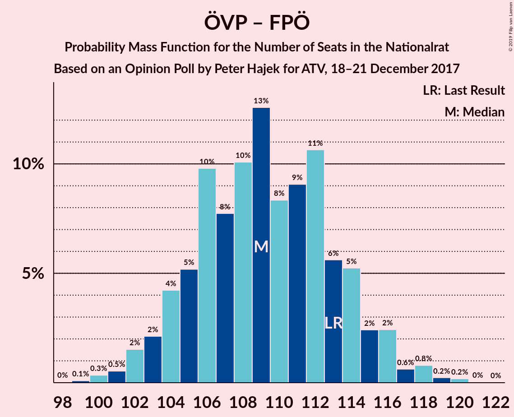
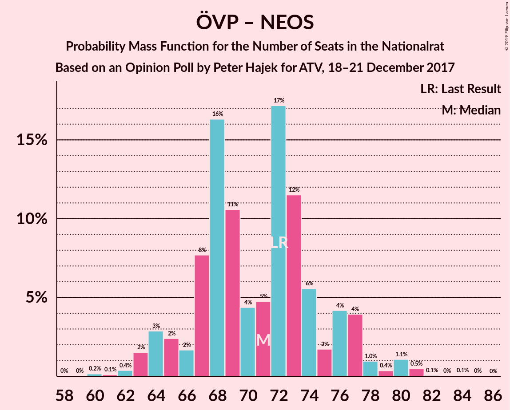
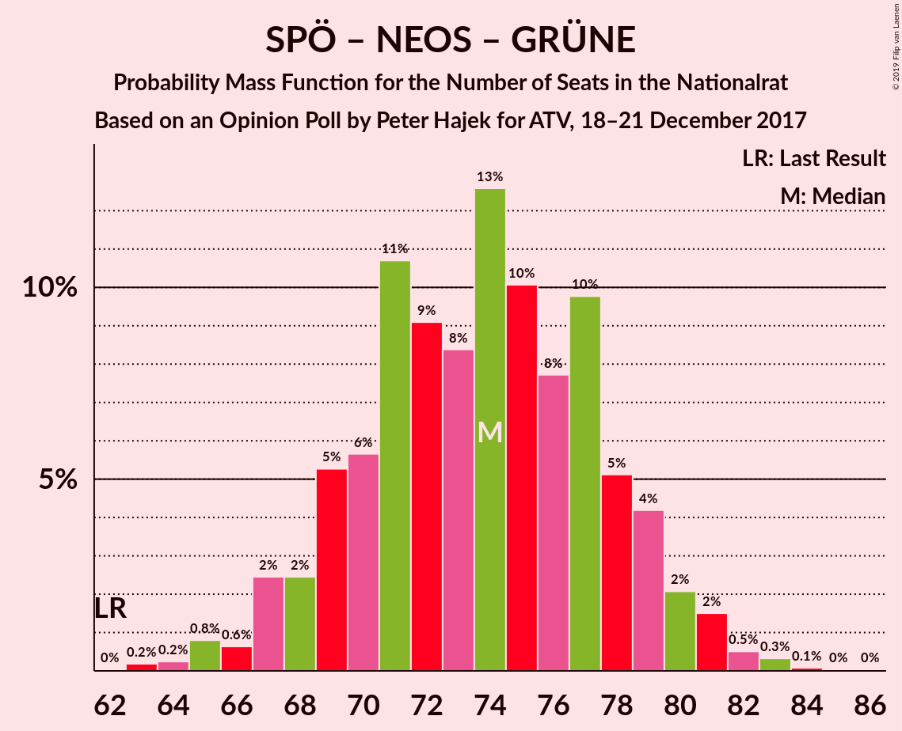
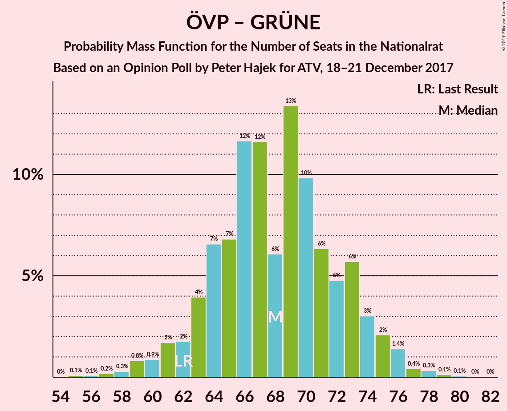

# Opinion Poll by Peter Hajek for ATV, 18–21 December 2017

<a href="#voting-intentions">Voting Intentions</a> | <a href="#seats">Seats</a> | <a href="#coalitions">Coalitions</a> | <a href="#technical-information">Technical Information</a>

## Voting Intentions

### Confidence Intervals

| Party | Last Result | Poll Result | 80% Confidence Interval | 90% Confidence Interval | 95% Confidence Interval | 99% Confidence Interval |
|:-----:|:-----------:|:-----------:|:-----------------------:|:-----------------------:|:-----------------------:|:-----------------------:|
| Österreichische Volkspartei | 31.5% | 31.0% | 28.8–33.3% |28.2–34.0% |27.7–34.5% |26.7–35.7% |
| Sozialdemokratische Partei Österreichs | 26.9% | 28.0% | 25.9–30.3% |25.3–30.9% |24.8–31.4% |23.8–32.5% |
| Freiheitliche Partei Österreichs | 26.0% | 26.0% | 24.0–28.2% |23.4–28.8% |22.9–29.4% |21.9–30.5% |
| NEOS–Das Neue Österreich und Liberales Forum | 5.3% | 6.0% | 5.0–7.3% |4.7–7.7% |4.5–8.0% |4.0–8.7% |
| Die Grünen–Die Grüne Alternative | 3.8% | 5.0% | 4.1–6.2% |3.8–6.6% |3.6–6.9% |3.2–7.5% |
| JETZT–Liste Pilz | 4.4% | 2.0% | 1.5–2.9% |1.3–3.1% |1.2–3.3% |1.0–3.8% |

*Note:* The poll result column reflects the actual value used in the calculations. Published results may vary slightly, and in addition be rounded to fewer digits.

## Seats

### Confidence Intervals

| Party | Last Result | Median | 80% Confidence Interval | 90% Confidence Interval | 95% Confidence Interval | 99% Confidence Interval |
|:-----:|:-----------:|:------:|:-----------------------:|:-----------------------:|:-----------------------:|:-----------------------:|
| <a href="#österreichische-volkspartei">Österreichische Volkspartei</a> | 62 | 57 | 57–65 |57–65 |57–65 |52–65 |
| <a href="#sozialdemokratische-partei-österreichs">Sozialdemokratische Partei Österreichs</a> | 52 | 51 | 51–54 |51–54 |51–55 |49–59 |
| <a href="#freiheitliche-partei-österreichs">Freiheitliche Partei Österreichs</a> | 51 | 56 | 53–56 |53–56 |53–56 |50–56 |
| <a href="#neos–das-neue-österreich-und-liberales-forum">NEOS–Das Neue Österreich und Liberales Forum</a> | 10 | 10 | 10–11 |10–11 |10–11 |8–11 |
| <a href="#die-grünen–die-grüne-alternative">Die Grünen–Die Grüne Alternative</a> | 0 | 9 | 0–9 |0–9 |0–9 |0–10 |
| <a href="#jetzt–liste-pilz">JETZT–Liste Pilz</a> | 8 | 0 | 0 |0 |0 |0–7 |

### Österreichische Volkspartei

*For a full overview of the results for this party, see the [Österreichische Volkspartei](party-österreichischevolkspartei.html) page.*

| Number of Seats | Probability | Accumulated | Special Marks |
|:---------------:|:-----------:|:-----------:|:-------------:|
| 52 | 2% | 100% |  |
| 53 | 0% | 98% |  |
| 54 | 0% | 98% |  |
| 55 | 0.3% | 98% |  |
| 56 | 0% | 98% |  |
| 57 | 67% | 98% | Median |
| 58 | 0.3% | 31% |  |
| 59 | 0% | 30% |  |
| 60 | 0% | 30% |  |
| 61 | 0% | 30% |  |
| 62 | 0.3% | 30% | Last Result |
| 63 | 0.3% | 30% |  |
| 64 | 0% | 30% |  |
| 65 | 30% | 30% |  |
| 66 | 0% | 0% |  |

### Sozialdemokratische Partei Österreichs

*For a full overview of the results for this party, see the [Sozialdemokratische Partei Österreichs](party-sozialdemokratischeparteiösterreichs.html) page.*

| Number of Seats | Probability | Accumulated | Special Marks |
|:---------------:|:-----------:|:-----------:|:-------------:|
| 46 | 0.3% | 100% |  |
| 47 | 0% | 99.7% |  |
| 48 | 0.1% | 99.7% |  |
| 49 | 0.4% | 99.6% |  |
| 50 | 0% | 99.2% |  |
| 51 | 67% | 99.2% | Median |
| 52 | 0.1% | 32% | Last Result |
| 53 | 0% | 32% |  |
| 54 | 28% | 32% |  |
| 55 | 2% | 4% |  |
| 56 | 0.3% | 2% |  |
| 57 | 0% | 2% |  |
| 58 | 0.3% | 2% |  |
| 59 | 1.2% | 1.5% |  |
| 60 | 0.2% | 0.2% |  |
| 61 | 0% | 0% |  |

### Freiheitliche Partei Österreichs

*For a full overview of the results for this party, see the [Freiheitliche Partei Österreichs](party-freiheitlicheparteiösterreichs.html) page.*

| Number of Seats | Probability | Accumulated | Special Marks |
|:---------------:|:-----------:|:-----------:|:-------------:|
| 42 | 0% | 100% |  |
| 43 | 0% | 99.9% |  |
| 44 | 0% | 99.9% |  |
| 45 | 0.1% | 99.9% |  |
| 46 | 0% | 99.8% |  |
| 47 | 0% | 99.8% |  |
| 48 | 0% | 99.8% |  |
| 49 | 0.3% | 99.8% |  |
| 50 | 0.3% | 99.5% |  |
| 51 | 0.1% | 99.2% | Last Result |
| 52 | 0% | 99.2% |  |
| 53 | 30% | 99.2% |  |
| 54 | 2% | 70% |  |
| 55 | 0% | 68% |  |
| 56 | 67% | 68% | Median |
| 57 | 0% | 0.3% |  |
| 58 | 0% | 0.3% |  |
| 59 | 0.3% | 0.3% |  |
| 60 | 0% | 0% |  |

### NEOS–Das Neue Österreich und Liberales Forum

*For a full overview of the results for this party, see the [NEOS–Das Neue Österreich und Liberales Forum](party-neos–dasneueösterreichundliberalesforum.html) page.*

| Number of Seats | Probability | Accumulated | Special Marks |
|:---------------:|:-----------:|:-----------:|:-------------:|
| 7 | 0.2% | 100% |  |
| 8 | 2% | 99.8% |  |
| 9 | 0.1% | 98% |  |
| 10 | 69% | 98% | Last Result, Median |
| 11 | 28% | 28% |  |
| 12 | 0% | 0.2% |  |
| 13 | 0% | 0.2% |  |
| 14 | 0% | 0.2% |  |
| 15 | 0% | 0.2% |  |
| 16 | 0% | 0.2% |  |
| 17 | 0% | 0.1% |  |
| 18 | 0.1% | 0.1% |  |
| 19 | 0% | 0% |  |

### Die Grünen–Die Grüne Alternative

*For a full overview of the results for this party, see the [Die Grünen–Die Grüne Alternative](party-diegrünen–diegrünealternative.html) page.*

| Number of Seats | Probability | Accumulated | Special Marks |
|:---------------:|:-----------:|:-----------:|:-------------:|
| 0 | 30% | 100% | Last Result |
| 1 | 0% | 70% |  |
| 2 | 0% | 70% |  |
| 3 | 0% | 70% |  |
| 4 | 0% | 70% |  |
| 5 | 0% | 70% |  |
| 6 | 0% | 70% |  |
| 7 | 0.3% | 70% |  |
| 8 | 0% | 69% |  |
| 9 | 67% | 69% | Median |
| 10 | 1.4% | 2% |  |
| 11 | 0.1% | 0.5% |  |
| 12 | 0.3% | 0.4% |  |
| 13 | 0.1% | 0.1% |  |
| 14 | 0% | 0% |  |

### JETZT–Liste Pilz

*For a full overview of the results for this party, see the [JETZT–Liste Pilz](party-jetzt–listepilz.html) page.*

| Number of Seats | Probability | Accumulated | Special Marks |
|:---------------:|:-----------:|:-----------:|:-------------:|
| 0 | 99.3% | 100% | Median |
| 1 | 0% | 0.7% |  |
| 2 | 0% | 0.7% |  |
| 3 | 0% | 0.7% |  |
| 4 | 0% | 0.7% |  |
| 5 | 0% | 0.7% |  |
| 6 | 0% | 0.7% |  |
| 7 | 0.4% | 0.7% |  |
| 8 | 0.2% | 0.2% | Last Result |
| 9 | 0% | 0% |  |

## Coalitions

### Confidence Intervals

| Coalition | Last Result | Median | Majority? | 80% Confidence Interval | 90% Confidence Interval | 95% Confidence Interval | 99% Confidence Interval |
|:---------:|:-----------:|:------:|:---------:|:-----------------------:|:-----------------------:|:-----------------------:|:-----------------------:|
| Österreichische Volkspartei – Sozialdemokratische Partei Österreichs | 114 | 108 | 100% | 108–119 | 108–119 | 108–119 | 108–120 |
| Österreichische Volkspartei – Freiheitliche Partei Österreichs | 113 | 113 | 100% | 113–118 | 113–118 | 113–118 | 106–118 |
| Sozialdemokratische Partei Österreichs – Freiheitliche Partei Österreichs | 103 | 107 | 100% | 107 | 107 | 107–108 | 103–113 |
| Österreichische Volkspartei – NEOS–Das Neue Österreich und Liberales Forum – Die Grünen–Die Grüne Alternative | 72 | 76 | 0% | 76 | 76 | 75–76 | 70–76 |
| Österreichische Volkspartei – NEOS–Das Neue Österreich und Liberales Forum | 72 | 67 | 0% | 67–76 | 67–76 | 67–76 | 60–76 |
| Sozialdemokratische Partei Österreichs – NEOS–Das Neue Österreich und Liberales Forum – Die Grünen–Die Grüne Alternative | 62 | 70 | 0% | 65–70 | 65–70 | 65–70 | 62–77 |
| Österreichische Volkspartei – Die Grünen–Die Grüne Alternative | 62 | 66 | 0% | 65–66 | 65–66 | 65–66 | 62–66 |
| Österreichische Volkspartei | 62 | 57 | 0% | 57–65 | 57–65 | 57–65 | 52–65 |
| Sozialdemokratische Partei Österreichs | 52 | 51 | 0% | 51–54 | 51–54 | 51–55 | 49–59 |

### Österreichische Volkspartei – Sozialdemokratische Partei Österreichs

| Number of Seats | Probability | Accumulated | Special Marks |
|:---------------:|:-----------:|:-----------:|:-------------:|
| 103 | 0.1% | 100% |  |
| 104 | 0.3% | 99.9% |  |
| 105 | 0% | 99.6% |  |
| 106 | 0% | 99.6% |  |
| 107 | 0% | 99.6% |  |
| 108 | 67% | 99.6% | Median |
| 109 | 0% | 32% |  |
| 110 | 0% | 32% |  |
| 111 | 2% | 32% |  |
| 112 | 0.5% | 31% |  |
| 113 | 0% | 30% |  |
| 114 | 0.1% | 30% | Last Result |
| 115 | 0% | 30% |  |
| 116 | 0.1% | 30% |  |
| 117 | 0% | 30% |  |
| 118 | 0% | 30% |  |
| 119 | 28% | 30% |  |
| 120 | 2% | 2% |  |
| 121 | 0% | 0.3% |  |
| 122 | 0% | 0.3% |  |
| 123 | 0.3% | 0.3% |  |
| 124 | 0% | 0% |  |

### Österreichische Volkspartei – Freiheitliche Partei Österreichs

| Number of Seats | Probability | Accumulated | Special Marks |
|:---------------:|:-----------:|:-----------:|:-------------:|
| 102 | 0.1% | 100% |  |
| 103 | 0% | 99.9% |  |
| 104 | 0.3% | 99.8% |  |
| 105 | 0% | 99.6% |  |
| 106 | 1.4% | 99.6% |  |
| 107 | 0% | 98% |  |
| 108 | 0.1% | 98% |  |
| 109 | 0.1% | 98% |  |
| 110 | 0% | 98% |  |
| 111 | 0% | 98% |  |
| 112 | 0% | 98% |  |
| 113 | 67% | 98% | Last Result, Median |
| 114 | 0% | 31% |  |
| 115 | 0.3% | 31% |  |
| 116 | 0.2% | 30% |  |
| 117 | 0.5% | 30% |  |
| 118 | 30% | 30% |  |
| 119 | 0% | 0.1% |  |
| 120 | 0% | 0.1% |  |
| 121 | 0% | 0.1% |  |
| 122 | 0% | 0% |  |

### Sozialdemokratische Partei Österreichs – Freiheitliche Partei Österreichs

| Number of Seats | Probability | Accumulated | Special Marks |
|:---------------:|:-----------:|:-----------:|:-------------:|
| 95 | 0% | 100% |  |
| 96 | 0.1% | 99.9% |  |
| 97 | 0% | 99.9% |  |
| 98 | 0% | 99.9% |  |
| 99 | 0% | 99.9% |  |
| 100 | 0% | 99.9% |  |
| 101 | 0% | 99.8% |  |
| 102 | 0.1% | 99.8% |  |
| 103 | 0.5% | 99.7% | Last Result |
| 104 | 0% | 99.2% |  |
| 105 | 0.5% | 99.2% |  |
| 106 | 0% | 98.7% |  |
| 107 | 95% | 98.7% | Median |
| 108 | 2% | 3% |  |
| 109 | 0% | 1.5% |  |
| 110 | 0% | 1.5% |  |
| 111 | 0% | 1.5% |  |
| 112 | 0.1% | 1.5% |  |
| 113 | 1.2% | 1.4% |  |
| 114 | 0.2% | 0.2% |  |
| 115 | 0% | 0% |  |

### Österreichische Volkspartei – NEOS–Das Neue Österreich und Liberales Forum – Die Grünen–Die Grüne Alternative

| Number of Seats | Probability | Accumulated | Special Marks |
|:---------------:|:-----------:|:-----------:|:-------------:|
| 69 | 0.2% | 100% |  |
| 70 | 1.5% | 99.8% |  |
| 71 | 0.1% | 98% |  |
| 72 | 0.1% | 98% | Last Result |
| 73 | 0.5% | 98% |  |
| 74 | 0% | 98% |  |
| 75 | 2% | 98% |  |
| 76 | 95% | 96% | Median |
| 77 | 0% | 0.5% |  |
| 78 | 0.3% | 0.5% |  |
| 79 | 0% | 0.2% |  |
| 80 | 0% | 0.2% |  |
| 81 | 0% | 0.2% |  |
| 82 | 0% | 0.2% |  |
| 83 | 0% | 0.2% |  |
| 84 | 0% | 0.1% |  |
| 85 | 0% | 0.1% |  |
| 86 | 0% | 0.1% |  |
| 87 | 0.1% | 0.1% |  |
| 88 | 0% | 0.1% |  |
| 89 | 0% | 0% |  |

### Österreichische Volkspartei – NEOS–Das Neue Österreich und Liberales Forum

| Number of Seats | Probability | Accumulated | Special Marks |
|:---------------:|:-----------:|:-----------:|:-------------:|
| 59 | 0.2% | 100% |  |
| 60 | 1.3% | 99.8% |  |
| 61 | 0% | 98.5% |  |
| 62 | 0% | 98.5% |  |
| 63 | 0.2% | 98.5% |  |
| 64 | 0.1% | 98% |  |
| 65 | 0% | 98% |  |
| 66 | 0.3% | 98% |  |
| 67 | 67% | 98% | Median |
| 68 | 0% | 31% |  |
| 69 | 0% | 31% |  |
| 70 | 0% | 31% |  |
| 71 | 0% | 31% |  |
| 72 | 0.1% | 31% | Last Result |
| 73 | 0.4% | 31% |  |
| 74 | 0% | 30% |  |
| 75 | 2% | 30% |  |
| 76 | 28% | 28% |  |
| 77 | 0% | 0.1% |  |
| 78 | 0% | 0.1% |  |
| 79 | 0% | 0.1% |  |
| 80 | 0% | 0.1% |  |
| 81 | 0% | 0.1% |  |
| 82 | 0% | 0% |  |

### Sozialdemokratische Partei Österreichs – NEOS–Das Neue Österreich und Liberales Forum – Die Grünen–Die Grüne Alternative

| Number of Seats | Probability | Accumulated | Special Marks |
|:---------------:|:-----------:|:-----------:|:-------------:|
| 59 | 0.2% | 100% |  |
| 60 | 0.2% | 99.7% |  |
| 61 | 0% | 99.5% |  |
| 62 | 0.1% | 99.5% | Last Result |
| 63 | 0% | 99.4% |  |
| 64 | 0% | 99.4% |  |
| 65 | 30% | 99.4% |  |
| 66 | 0.3% | 70% |  |
| 67 | 0% | 70% |  |
| 68 | 0.3% | 70% |  |
| 69 | 0% | 69% |  |
| 70 | 67% | 69% | Median |
| 71 | 0.3% | 2% |  |
| 72 | 0% | 2% |  |
| 73 | 0% | 2% |  |
| 74 | 0% | 2% |  |
| 75 | 0.1% | 2% |  |
| 76 | 0% | 2% |  |
| 77 | 1.4% | 2% |  |
| 78 | 0% | 0.2% |  |
| 79 | 0% | 0.2% |  |
| 80 | 0% | 0.2% |  |
| 81 | 0.1% | 0.1% |  |
| 82 | 0% | 0% |  |

### Österreichische Volkspartei – Die Grünen–Die Grüne Alternative

| Number of Seats | Probability | Accumulated | Special Marks |
|:---------------:|:-----------:|:-----------:|:-------------:|
| 62 | 2% | 100% | Last Result |
| 63 | 0.3% | 98% |  |
| 64 | 0.1% | 98% |  |
| 65 | 30% | 98% |  |
| 66 | 67% | 68% | Median |
| 67 | 0% | 0.4% |  |
| 68 | 0% | 0.4% |  |
| 69 | 0.1% | 0.4% |  |
| 70 | 0.3% | 0.4% |  |
| 71 | 0% | 0% |  |

### Österreichische Volkspartei

| Number of Seats | Probability | Accumulated | Special Marks |
|:---------------:|:-----------:|:-----------:|:-------------:|
| 52 | 2% | 100% |  |
| 53 | 0% | 98% |  |
| 54 | 0% | 98% |  |
| 55 | 0.3% | 98% |  |
| 56 | 0% | 98% |  |
| 57 | 67% | 98% | Median |
| 58 | 0.3% | 31% |  |
| 59 | 0% | 30% |  |
| 60 | 0% | 30% |  |
| 61 | 0% | 30% |  |
| 62 | 0.3% | 30% | Last Result |
| 63 | 0.3% | 30% |  |
| 64 | 0% | 30% |  |
| 65 | 30% | 30% |  |
| 66 | 0% | 0% |  |

### Sozialdemokratische Partei Österreichs

| Number of Seats | Probability | Accumulated | Special Marks |
|:---------------:|:-----------:|:-----------:|:-------------:|
| 46 | 0.3% | 100% |  |
| 47 | 0% | 99.7% |  |
| 48 | 0.1% | 99.7% |  |
| 49 | 0.4% | 99.6% |  |
| 50 | 0% | 99.2% |  |
| 51 | 67% | 99.2% | Median |
| 52 | 0.1% | 32% | Last Result |
| 53 | 0% | 32% |  |
| 54 | 28% | 32% |  |
| 55 | 2% | 4% |  |
| 56 | 0.3% | 2% |  |
| 57 | 0% | 2% |  |
| 58 | 0.3% | 2% |  |
| 59 | 1.2% | 1.5% |  |
| 60 | 0.2% | 0.2% |  |
| 61 | 0% | 0% |  |

## Technical Information

### Opinion Poll

+ **Polling firm:** Peter Hajek
+ **Commissioner(s):** ATV
+ **Fieldwork period:** 18–21 December 2017

### Calculations

+ **Sample size:** 700
+ **Simulations done:** 1,024
+ **Error estimate:** 2.87%

