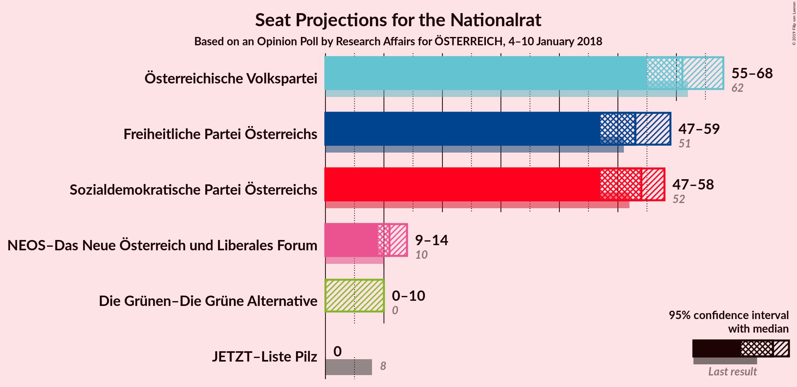
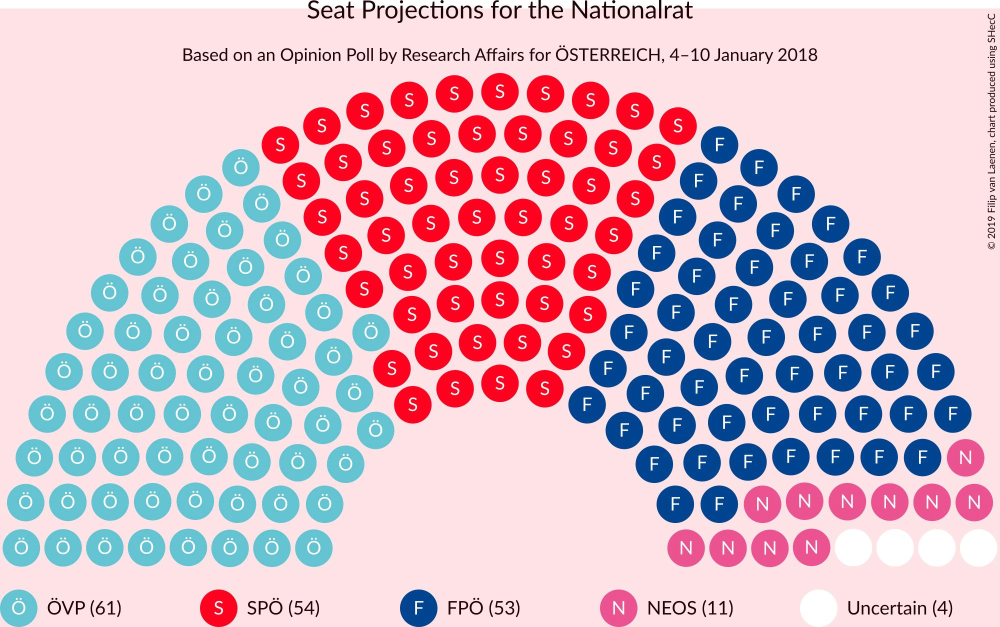
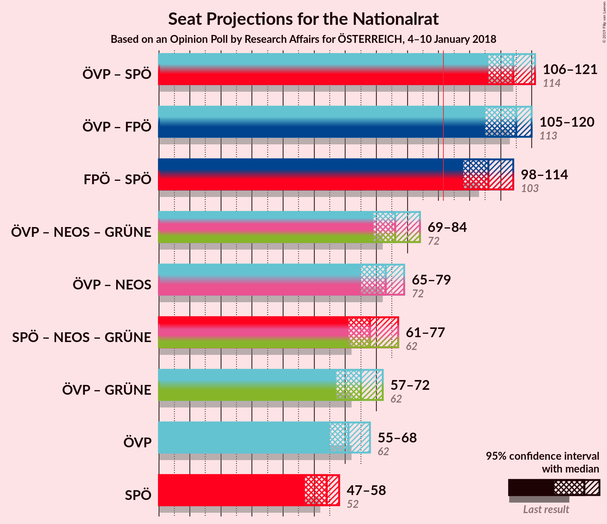
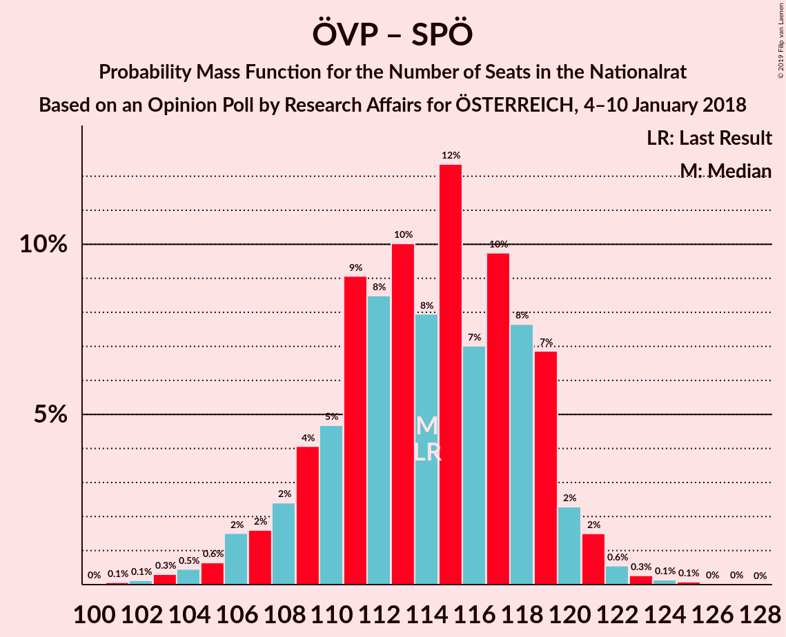
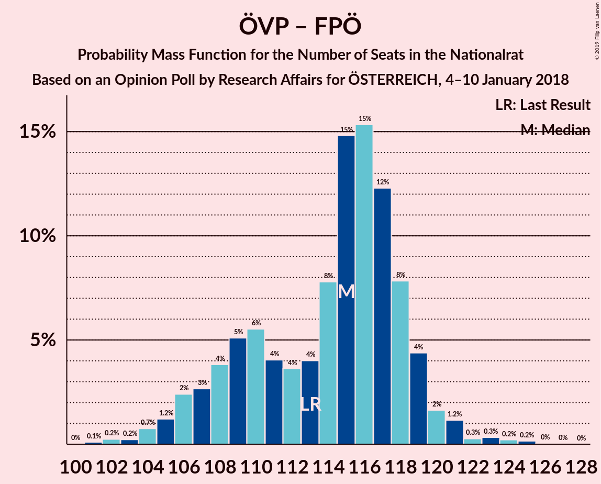
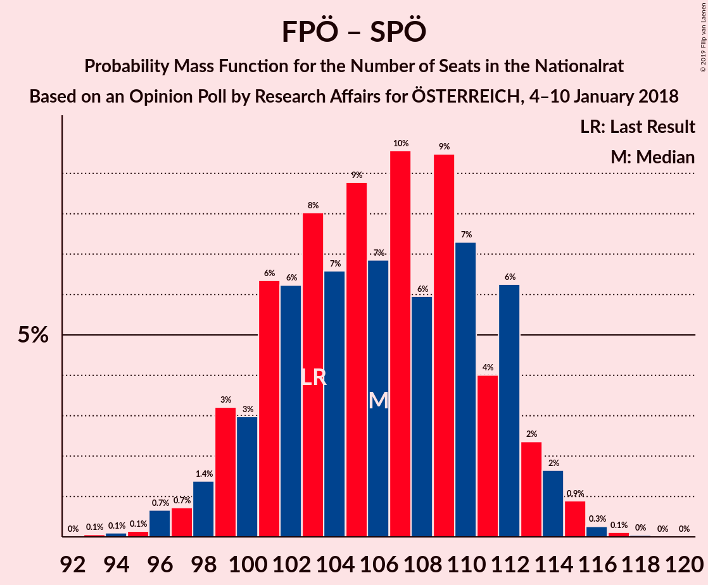

# Opinion Poll by Research Affairs for ÖSTERREICH, 4–10 January 2018

<a href="#voting-intentions">Voting Intentions</a> | <a href="#seats">Seats</a> | <a href="#coalitions">Coalitions</a> | <a href="#technical-information">Technical Information</a>

## Voting Intentions

### Confidence Intervals

| Party | Last Result | Poll Result | 80% Confidence Interval | 90% Confidence Interval | 95% Confidence Interval | 99% Confidence Interval |
|:-----:|:-----------:|:-----------:|:-----------------------:|:-----------------------:|:-----------------------:|:-----------------------:|
| Österreichische Volkspartei | 31.5% | 31.0% | 29.2–32.9% |28.7–33.4% |28.2–33.9% |27.4–34.8% |
| Sozialdemokratische Partei Österreichs | 26.9% | 27.0% | 25.2–28.8% |24.7–29.3% |24.3–29.8% |23.5–30.7% |
| Freiheitliche Partei Österreichs | 26.0% | 27.0% | 25.2–28.8% |24.7–29.3% |24.3–29.8% |23.5–30.7% |
| NEOS–Das Neue Österreich und Liberales Forum | 5.3% | 6.0% | 5.1–7.0% |4.9–7.3% |4.7–7.6% |4.3–8.2% |
| Die Grünen–Die Grüne Alternative | 3.8% | 4.0% | 3.3–4.9% |3.1–5.2% |3.0–5.4% |2.7–5.9% |
| JETZT–Liste Pilz | 4.4% | 2.0% | 1.5–2.7% |1.4–2.8% |1.3–3.0% |1.1–3.4% |

*Note:* The poll result column reflects the actual value used in the calculations. Published results may vary slightly, and in addition be rounded to fewer digits.

## Seats

### Confidence Intervals

| Party | Last Result | Median | 80% Confidence Interval | 90% Confidence Interval | 95% Confidence Interval | 99% Confidence Interval |
|:-----:|:-----------:|:------:|:-----------------------:|:-----------------------:|:-----------------------:|:-----------------------:|
| <a href="#österreichische-volkspartei">Österreichische Volkspartei</a> | 62 | 61 | 57–65 |56–67 |55–68 |53–69 |
| <a href="#sozialdemokratische-partei-österreichs">Sozialdemokratische Partei Österreichs</a> | 52 | 54 | 49–56 |48–57 |47–58 |46–61 |
| <a href="#freiheitliche-partei-österreichs">Freiheitliche Partei Österreichs</a> | 51 | 53 | 49–57 |48–58 |47–59 |45–61 |
| <a href="#neos–das-neue-österreich-und-liberales-forum">NEOS–Das Neue Österreich und Liberales Forum</a> | 10 | 11 | 10–13 |9–14 |9–14 |8–15 |
| <a href="#die-grünen–die-grüne-alternative">Die Grünen–Die Grüne Alternative</a> | 0 | 0 | 0–9 |0–10 |0–10 |0–11 |
| <a href="#jetzt–liste-pilz">JETZT–Liste Pilz</a> | 8 | 0 | 0 |0 |0 |0 |

### Österreichische Volkspartei

*For a full overview of the results for this party, see the [Österreichische Volkspartei](party-österreichischevolkspartei.html) page.*

| Number of Seats | Probability | Accumulated | Special Marks |
|:---------------:|:-----------:|:-----------:|:-------------:|
| 50 | 0% | 100% |  |
| 51 | 0.1% | 99.9% |  |
| 52 | 0.3% | 99.9% |  |
| 53 | 0.7% | 99.6% |  |
| 54 | 1.2% | 98.9% |  |
| 55 | 3% | 98% |  |
| 56 | 3% | 95% |  |
| 57 | 5% | 92% |  |
| 58 | 8% | 87% |  |
| 59 | 11% | 79% |  |
| 60 | 11% | 68% |  |
| 61 | 11% | 57% | Median |
| 62 | 12% | 46% | Last Result |
| 63 | 14% | 33% |  |
| 64 | 8% | 20% |  |
| 65 | 6% | 12% |  |
| 66 | 1.2% | 6% |  |
| 67 | 3% | 5% |  |
| 68 | 2% | 3% |  |
| 69 | 0.7% | 1.0% |  |
| 70 | 0.2% | 0.3% |  |
| 71 | 0.1% | 0.1% |  |
| 72 | 0% | 0% |  |

### Sozialdemokratische Partei Österreichs

*For a full overview of the results for this party, see the [Sozialdemokratische Partei Österreichs](party-sozialdemokratischeparteiösterreichs.html) page.*

| Number of Seats | Probability | Accumulated | Special Marks |
|:---------------:|:-----------:|:-----------:|:-------------:|
| 43 | 0.1% | 100% |  |
| 44 | 0.1% | 99.9% |  |
| 45 | 0.3% | 99.9% |  |
| 46 | 0.6% | 99.6% |  |
| 47 | 2% | 99.0% |  |
| 48 | 4% | 97% |  |
| 49 | 9% | 92% |  |
| 50 | 5% | 84% |  |
| 51 | 8% | 78% |  |
| 52 | 7% | 70% | Last Result |
| 53 | 9% | 64% |  |
| 54 | 20% | 54% | Median |
| 55 | 14% | 34% |  |
| 56 | 13% | 20% |  |
| 57 | 3% | 7% |  |
| 58 | 2% | 3% |  |
| 59 | 0.2% | 1.1% |  |
| 60 | 0.1% | 0.9% |  |
| 61 | 0.4% | 0.7% |  |
| 62 | 0.3% | 0.3% |  |
| 63 | 0% | 0.1% |  |
| 64 | 0% | 0% |  |

### Freiheitliche Partei Österreichs

*For a full overview of the results for this party, see the [Freiheitliche Partei Österreichs](party-freiheitlicheparteiösterreichs.html) page.*

| Number of Seats | Probability | Accumulated | Special Marks |
|:---------------:|:-----------:|:-----------:|:-------------:|
| 43 | 0.1% | 100% |  |
| 44 | 0.2% | 99.9% |  |
| 45 | 0.5% | 99.7% |  |
| 46 | 1.1% | 99.2% |  |
| 47 | 2% | 98% |  |
| 48 | 4% | 96% |  |
| 49 | 6% | 92% |  |
| 50 | 7% | 87% |  |
| 51 | 8% | 79% | Last Result |
| 52 | 14% | 71% |  |
| 53 | 11% | 56% | Median |
| 54 | 11% | 45% |  |
| 55 | 13% | 34% |  |
| 56 | 7% | 21% |  |
| 57 | 7% | 14% |  |
| 58 | 4% | 7% |  |
| 59 | 1.4% | 3% |  |
| 60 | 0.8% | 1.3% |  |
| 61 | 0.3% | 0.5% |  |
| 62 | 0.1% | 0.2% |  |
| 63 | 0.1% | 0.1% |  |
| 64 | 0% | 0% |  |

### NEOS–Das Neue Österreich und Liberales Forum

*For a full overview of the results for this party, see the [NEOS–Das Neue Österreich und Liberales Forum](party-neos–dasneueösterreichundliberalesforum.html) page.*

| Number of Seats | Probability | Accumulated | Special Marks |
|:---------------:|:-----------:|:-----------:|:-------------:|
| 0 | 0.1% | 100% |  |
| 1 | 0% | 99.9% |  |
| 2 | 0% | 99.9% |  |
| 3 | 0% | 99.9% |  |
| 4 | 0% | 99.9% |  |
| 5 | 0% | 99.9% |  |
| 6 | 0% | 99.9% |  |
| 7 | 0% | 99.9% |  |
| 8 | 0.9% | 99.9% |  |
| 9 | 6% | 99.0% |  |
| 10 | 20% | 93% | Last Result |
| 11 | 31% | 73% | Median |
| 12 | 24% | 42% |  |
| 13 | 12% | 18% |  |
| 14 | 4% | 6% |  |
| 15 | 1.3% | 2% |  |
| 16 | 0.4% | 0.5% |  |
| 17 | 0.1% | 0.1% |  |
| 18 | 0% | 0% |  |

### Die Grünen–Die Grüne Alternative

*For a full overview of the results for this party, see the [Die Grünen–Die Grüne Alternative](party-diegrünen–diegrünealternative.html) page.*

| Number of Seats | Probability | Accumulated | Special Marks |
|:---------------:|:-----------:|:-----------:|:-------------:|
| 0 | 54% | 100% | Last Result, Median |
| 1 | 0% | 46% |  |
| 2 | 0% | 46% |  |
| 3 | 0% | 46% |  |
| 4 | 0% | 46% |  |
| 5 | 0% | 46% |  |
| 6 | 0% | 46% |  |
| 7 | 6% | 46% |  |
| 8 | 21% | 40% |  |
| 9 | 14% | 20% |  |
| 10 | 5% | 6% |  |
| 11 | 0.6% | 0.7% |  |
| 12 | 0.1% | 0.1% |  |
| 13 | 0% | 0% |  |

### JETZT–Liste Pilz

*For a full overview of the results for this party, see the [JETZT–Liste Pilz](party-jetzt–listepilz.html) page.*

| Number of Seats | Probability | Accumulated | Special Marks |
|:---------------:|:-----------:|:-----------:|:-------------:|
| 0 | 100% | 100% | Median |
| 1 | 0% | 0% |  |
| 2 | 0% | 0% |  |
| 3 | 0% | 0% |  |
| 4 | 0% | 0% |  |
| 5 | 0% | 0% |  |
| 6 | 0% | 0% |  |
| 7 | 0% | 0% |  |
| 8 | 0% | 0% | Last Result |

## Coalitions

### Confidence Intervals

| Coalition | Last Result | Median | Majority? | 80% Confidence Interval | 90% Confidence Interval | 95% Confidence Interval | 99% Confidence Interval |
|:---------:|:-----------:|:------:|:---------:|:-----------------------:|:-----------------------:|:-----------------------:|:-----------------------:|
| Österreichische Volkspartei – Sozialdemokratische Partei Österreichs | 114 | 114 | 100% | 109–119 | 108–119 | 106–121 | 103–123 |
| Österreichische Volkspartei – Freiheitliche Partei Österreichs | 113 | 115 | 100% | 108–118 | 107–119 | 105–120 | 103–123 |
| Freiheitliche Partei Österreichs – Sozialdemokratische Partei Österreichs | 103 | 106 | 100% | 101–112 | 99–113 | 98–114 | 96–115 |
| Österreichische Volkspartei – NEOS–Das Neue Österreich und Liberales Forum – Die Grünen–Die Grüne Alternative | 72 | 76 | 0% | 71–82 | 70–83 | 69–84 | 67–86 |
| Österreichische Volkspartei – NEOS–Das Neue Österreich und Liberales Forum | 72 | 73 | 0% | 68–77 | 67–78 | 65–79 | 63–81 |
| Sozialdemokratische Partei Österreichs – NEOS–Das Neue Österreich und Liberales Forum – Die Grünen–Die Grüne Alternative | 62 | 68 | 0% | 64–74 | 63–76 | 61–77 | 59–78 |
| Österreichische Volkspartei – Die Grünen–Die Grüne Alternative | 62 | 65 | 0% | 59–71 | 58–72 | 57–72 | 55–75 |
| Österreichische Volkspartei | 62 | 61 | 0% | 57–65 | 56–67 | 55–68 | 53–69 |
| Sozialdemokratische Partei Österreichs | 52 | 54 | 0% | 49–56 | 48–57 | 47–58 | 46–61 |

### Österreichische Volkspartei – Sozialdemokratische Partei Österreichs

| Number of Seats | Probability | Accumulated | Special Marks |
|:---------------:|:-----------:|:-----------:|:-------------:|
| 100 | 0% | 100% |  |
| 101 | 0.1% | 99.9% |  |
| 102 | 0.1% | 99.9% |  |
| 103 | 0.3% | 99.8% |  |
| 104 | 0.5% | 99.4% |  |
| 105 | 0.6% | 99.0% |  |
| 106 | 2% | 98% |  |
| 107 | 2% | 97% |  |
| 108 | 2% | 95% |  |
| 109 | 4% | 93% |  |
| 110 | 5% | 89% |  |
| 111 | 9% | 84% |  |
| 112 | 8% | 75% |  |
| 113 | 10% | 67% |  |
| 114 | 8% | 56% | Last Result |
| 115 | 12% | 49% | Median |
| 116 | 7% | 36% |  |
| 117 | 10% | 29% |  |
| 118 | 8% | 19% |  |
| 119 | 7% | 12% |  |
| 120 | 2% | 5% |  |
| 121 | 2% | 3% |  |
| 122 | 0.6% | 1.1% |  |
| 123 | 0.3% | 0.6% |  |
| 124 | 0.1% | 0.3% |  |
| 125 | 0.1% | 0.2% |  |
| 126 | 0% | 0.1% |  |
| 127 | 0% | 0% |  |

### Österreichische Volkspartei – Freiheitliche Partei Österreichs

| Number of Seats | Probability | Accumulated | Special Marks |
|:---------------:|:-----------:|:-----------:|:-------------:|
| 101 | 0.1% | 100% |  |
| 102 | 0.2% | 99.9% |  |
| 103 | 0.2% | 99.6% |  |
| 104 | 0.7% | 99.4% |  |
| 105 | 1.2% | 98.7% |  |
| 106 | 2% | 97% |  |
| 107 | 3% | 95% |  |
| 108 | 4% | 92% |  |
| 109 | 5% | 89% |  |
| 110 | 6% | 83% |  |
| 111 | 4% | 78% |  |
| 112 | 4% | 74% |  |
| 113 | 4% | 70% | Last Result |
| 114 | 8% | 66% | Median |
| 115 | 15% | 58% |  |
| 116 | 15% | 44% |  |
| 117 | 12% | 28% |  |
| 118 | 8% | 16% |  |
| 119 | 4% | 8% |  |
| 120 | 2% | 4% |  |
| 121 | 1.2% | 2% |  |
| 122 | 0.3% | 1.0% |  |
| 123 | 0.3% | 0.8% |  |
| 124 | 0.2% | 0.4% |  |
| 125 | 0.2% | 0.2% |  |
| 126 | 0% | 0.1% |  |
| 127 | 0% | 0% |  |

### Freiheitliche Partei Österreichs – Sozialdemokratische Partei Österreichs

| Number of Seats | Probability | Accumulated | Special Marks |
|:---------------:|:-----------:|:-----------:|:-------------:|
| 93 | 0.1% | 100% |  |
| 94 | 0.1% | 99.9% |  |
| 95 | 0.1% | 99.8% |  |
| 96 | 0.7% | 99.7% |  |
| 97 | 0.7% | 99.0% |  |
| 98 | 1.4% | 98% |  |
| 99 | 3% | 97% |  |
| 100 | 3% | 94% |  |
| 101 | 6% | 91% |  |
| 102 | 6% | 84% |  |
| 103 | 8% | 78% | Last Result |
| 104 | 7% | 70% |  |
| 105 | 9% | 64% |  |
| 106 | 7% | 55% |  |
| 107 | 10% | 48% | Median |
| 108 | 6% | 38% |  |
| 109 | 9% | 32% |  |
| 110 | 7% | 23% |  |
| 111 | 4% | 16% |  |
| 112 | 6% | 12% |  |
| 113 | 2% | 5% |  |
| 114 | 2% | 3% |  |
| 115 | 0.9% | 1.3% |  |
| 116 | 0.3% | 0.4% |  |
| 117 | 0.1% | 0.2% |  |
| 118 | 0% | 0.1% |  |
| 119 | 0% | 0% |  |

### Österreichische Volkspartei – NEOS–Das Neue Österreich und Liberales Forum – Die Grünen–Die Grüne Alternative

| Number of Seats | Probability | Accumulated | Special Marks |
|:---------------:|:-----------:|:-----------:|:-------------:|
| 64 | 0% | 100% |  |
| 65 | 0.2% | 99.9% |  |
| 66 | 0.2% | 99.8% |  |
| 67 | 0.4% | 99.6% |  |
| 68 | 2% | 99.2% |  |
| 69 | 2% | 98% |  |
| 70 | 4% | 96% |  |
| 71 | 7% | 92% |  |
| 72 | 4% | 85% | Last Result, Median |
| 73 | 8% | 81% |  |
| 74 | 10% | 73% |  |
| 75 | 6% | 63% |  |
| 76 | 10% | 57% |  |
| 77 | 8% | 47% |  |
| 78 | 8% | 39% |  |
| 79 | 7% | 32% |  |
| 80 | 8% | 25% |  |
| 81 | 5% | 18% |  |
| 82 | 6% | 12% |  |
| 83 | 2% | 6% |  |
| 84 | 3% | 4% |  |
| 85 | 0.8% | 1.4% |  |
| 86 | 0.3% | 0.6% |  |
| 87 | 0.1% | 0.2% |  |
| 88 | 0.1% | 0.1% |  |
| 89 | 0% | 0% |  |

### Österreichische Volkspartei – NEOS–Das Neue Österreich und Liberales Forum

| Number of Seats | Probability | Accumulated | Special Marks |
|:---------------:|:-----------:|:-----------:|:-------------:|
| 61 | 0% | 100% |  |
| 62 | 0.1% | 99.9% |  |
| 63 | 0.4% | 99.8% |  |
| 64 | 0.5% | 99.4% |  |
| 65 | 1.4% | 98.9% |  |
| 66 | 2% | 97% |  |
| 67 | 3% | 95% |  |
| 68 | 5% | 92% |  |
| 69 | 8% | 87% |  |
| 70 | 7% | 79% |  |
| 71 | 14% | 72% |  |
| 72 | 8% | 58% | Last Result, Median |
| 73 | 12% | 50% |  |
| 74 | 14% | 38% |  |
| 75 | 6% | 25% |  |
| 76 | 7% | 19% |  |
| 77 | 5% | 11% |  |
| 78 | 2% | 6% |  |
| 79 | 2% | 4% |  |
| 80 | 1.2% | 2% |  |
| 81 | 0.7% | 1.1% |  |
| 82 | 0.3% | 0.4% |  |
| 83 | 0.1% | 0.1% |  |
| 84 | 0% | 0.1% |  |
| 85 | 0% | 0% |  |

### Sozialdemokratische Partei Österreichs – NEOS–Das Neue Österreich und Liberales Forum – Die Grünen–Die Grüne Alternative

| Number of Seats | Probability | Accumulated | Special Marks |
|:---------------:|:-----------:|:-----------:|:-------------:|
| 56 | 0% | 100% |  |
| 57 | 0.1% | 99.9% |  |
| 58 | 0.2% | 99.9% |  |
| 59 | 0.4% | 99.7% |  |
| 60 | 0.7% | 99.3% |  |
| 61 | 1.2% | 98.6% |  |
| 62 | 2% | 97% | Last Result |
| 63 | 3% | 96% |  |
| 64 | 5% | 93% |  |
| 65 | 9% | 88% | Median |
| 66 | 13% | 79% |  |
| 67 | 15% | 66% |  |
| 68 | 15% | 51% |  |
| 69 | 7% | 36% |  |
| 70 | 4% | 29% |  |
| 71 | 3% | 25% |  |
| 72 | 3% | 22% |  |
| 73 | 5% | 19% |  |
| 74 | 5% | 14% |  |
| 75 | 4% | 9% |  |
| 76 | 2% | 5% |  |
| 77 | 2% | 3% |  |
| 78 | 1.0% | 1.2% |  |
| 79 | 0.2% | 0.3% |  |
| 80 | 0% | 0.1% |  |
| 81 | 0% | 0% |  |

### Österreichische Volkspartei – Die Grünen–Die Grüne Alternative

| Number of Seats | Probability | Accumulated | Special Marks |
|:---------------:|:-----------:|:-----------:|:-------------:|
| 53 | 0% | 100% |  |
| 54 | 0.2% | 99.9% |  |
| 55 | 0.3% | 99.8% |  |
| 56 | 0.8% | 99.5% |  |
| 57 | 1.2% | 98.7% |  |
| 58 | 3% | 97% |  |
| 59 | 5% | 94% |  |
| 60 | 7% | 89% |  |
| 61 | 6% | 82% | Median |
| 62 | 9% | 76% | Last Result |
| 63 | 10% | 67% |  |
| 64 | 6% | 58% |  |
| 65 | 8% | 52% |  |
| 66 | 5% | 44% |  |
| 67 | 7% | 39% |  |
| 68 | 7% | 32% |  |
| 69 | 6% | 25% |  |
| 70 | 8% | 19% |  |
| 71 | 6% | 11% |  |
| 72 | 3% | 6% |  |
| 73 | 0.9% | 2% |  |
| 74 | 0.6% | 1.4% |  |
| 75 | 0.6% | 0.8% |  |
| 76 | 0.2% | 0.3% |  |
| 77 | 0.1% | 0.1% |  |
| 78 | 0% | 0% |  |

### Österreichische Volkspartei

| Number of Seats | Probability | Accumulated | Special Marks |
|:---------------:|:-----------:|:-----------:|:-------------:|
| 50 | 0% | 100% |  |
| 51 | 0.1% | 99.9% |  |
| 52 | 0.3% | 99.9% |  |
| 53 | 0.7% | 99.6% |  |
| 54 | 1.2% | 98.9% |  |
| 55 | 3% | 98% |  |
| 56 | 3% | 95% |  |
| 57 | 5% | 92% |  |
| 58 | 8% | 87% |  |
| 59 | 11% | 79% |  |
| 60 | 11% | 68% |  |
| 61 | 11% | 57% | Median |
| 62 | 12% | 46% | Last Result |
| 63 | 14% | 33% |  |
| 64 | 8% | 20% |  |
| 65 | 6% | 12% |  |
| 66 | 1.2% | 6% |  |
| 67 | 3% | 5% |  |
| 68 | 2% | 3% |  |
| 69 | 0.7% | 1.0% |  |
| 70 | 0.2% | 0.3% |  |
| 71 | 0.1% | 0.1% |  |
| 72 | 0% | 0% |  |

### Sozialdemokratische Partei Österreichs

| Number of Seats | Probability | Accumulated | Special Marks |
|:---------------:|:-----------:|:-----------:|:-------------:|
| 43 | 0.1% | 100% |  |
| 44 | 0.1% | 99.9% |  |
| 45 | 0.3% | 99.9% |  |
| 46 | 0.6% | 99.6% |  |
| 47 | 2% | 99.0% |  |
| 48 | 4% | 97% |  |
| 49 | 9% | 92% |  |
| 50 | 5% | 84% |  |
| 51 | 8% | 78% |  |
| 52 | 7% | 70% | Last Result |
| 53 | 9% | 64% |  |
| 54 | 20% | 54% | Median |
| 55 | 14% | 34% |  |
| 56 | 13% | 20% |  |
| 57 | 3% | 7% |  |
| 58 | 2% | 3% |  |
| 59 | 0.2% | 1.1% |  |
| 60 | 0.1% | 0.9% |  |
| 61 | 0.4% | 0.7% |  |
| 62 | 0.3% | 0.3% |  |
| 63 | 0% | 0.1% |  |
| 64 | 0% | 0% |  |

## Technical Information

### Opinion Poll

+ **Polling firm:** Research Affairs
+ **Commissioner(s):** ÖSTERREICH
+ **Fieldwork period:** 4–10 January 2018

### Calculations

+ **Sample size:** 1020
+ **Simulations done:** 131,072
+ **Error estimate:** 1.23%

