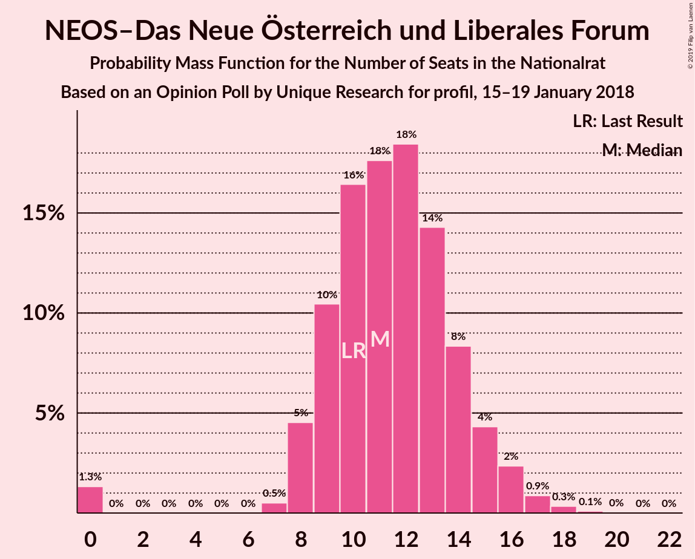
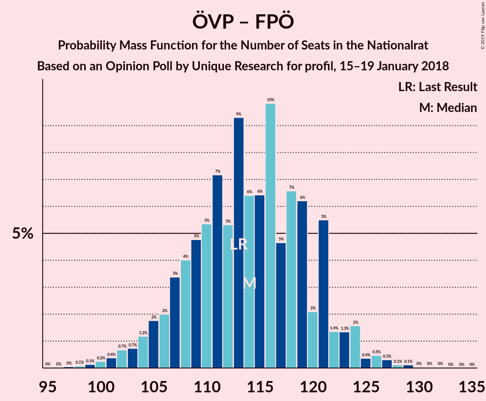
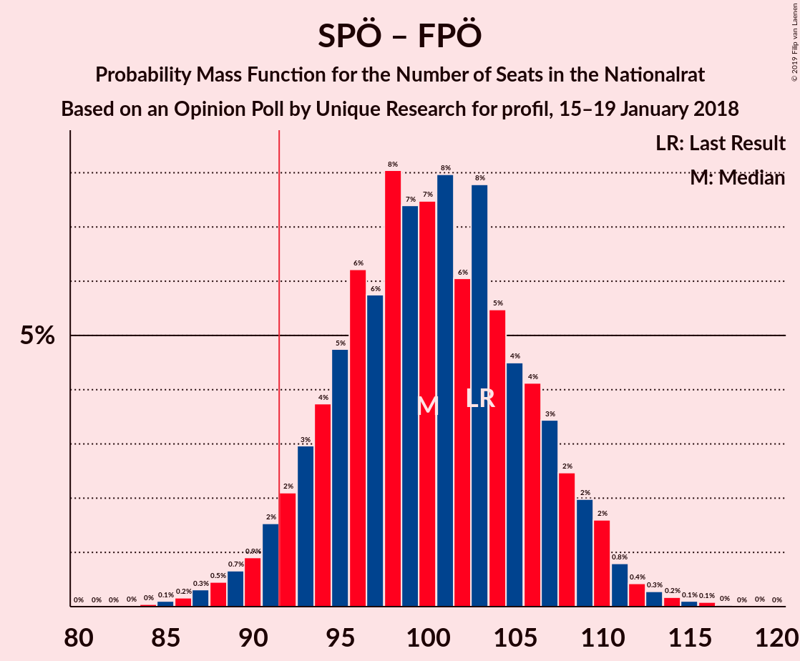
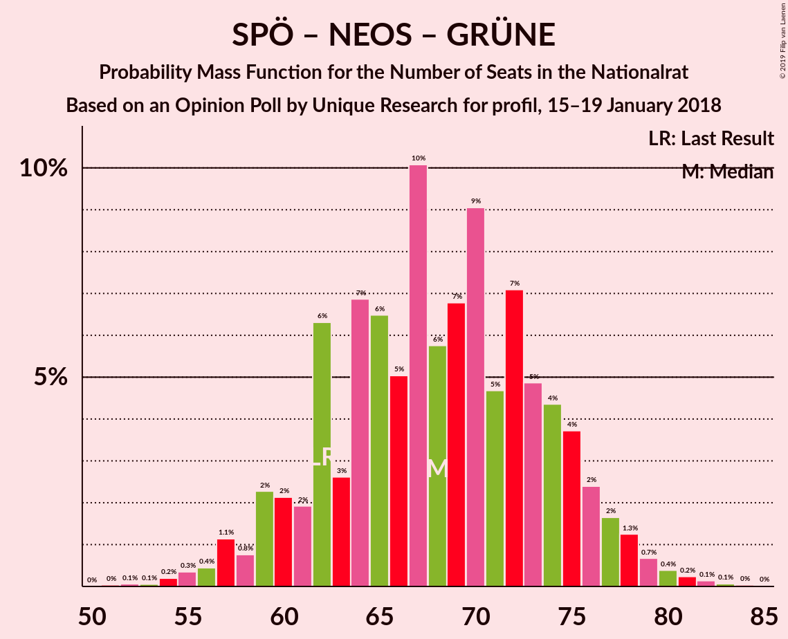

# Opinion Poll by Unique Research for profil, 15–19 January 2018

<a href="#voting-intentions">Voting Intentions</a> | <a href="#seats">Seats</a> | <a href="#coalitions">Coalitions</a> | <a href="#technical-information">Technical Information</a>

## Voting Intentions

### Confidence Intervals

| Party | Last Result | Poll Result | 80% Confidence Interval | 90% Confidence Interval | 95% Confidence Interval | 99% Confidence Interval |
|:-----:|:-----------:|:-----------:|:-----------------------:|:-----------------------:|:-----------------------:|:-----------------------:|
| Österreichische Volkspartei | 31.5% | 34.0% | 31.4–36.8% |30.6–37.6% |30.0–38.3% |28.7–39.6% |
| Sozialdemokratische Partei Österreichs | 26.9% | 27.0% | 24.6–29.7% |23.9–30.4% |23.3–31.1% |22.2–32.4% |
| Freiheitliche Partei Österreichs | 26.0% | 25.0% | 22.6–27.6% |22.0–28.3% |21.4–29.0% |20.3–30.3% |
| NEOS–Das Neue Österreich und Liberales Forum | 5.3% | 6.0% | 4.8–7.6% |4.5–8.0% |4.2–8.4% |3.7–9.3% |
| Die Grünen–Die Grüne Alternative | 3.8% | 4.0% | 3.1–5.4% |2.8–5.8% |2.6–6.1% |2.2–6.8% |
| JETZT–Liste Pilz | 4.4% | 3.0% | 2.2–4.2% |2.0–4.6% |1.8–4.9% |1.5–5.5% |

*Note:* The poll result column reflects the actual value used in the calculations. Published results may vary slightly, and in addition be rounded to fewer digits.

## Seats

### Confidence Intervals

| Party | Last Result | Median | 80% Confidence Interval | 90% Confidence Interval | 95% Confidence Interval | 99% Confidence Interval |
|:-----:|:-----------:|:------:|:-----------------------:|:-----------------------:|:-----------------------:|:-----------------------:|
| <a href="#österreichische-volkspartei">Österreichische Volkspartei</a> | 62 | 66 | 60–72 |58–73 |56–73 |54–77 |
| <a href="#sozialdemokratische-partei-österreichs">Sozialdemokratische Partei Österreichs</a> | 52 | 52 | 47–57 |45–59 |44–60 |42–63 |
| <a href="#freiheitliche-partei-österreichs">Freiheitliche Partei Österreichs</a> | 51 | 47 | 42–55 |41–56 |40–58 |38–60 |
| <a href="#neos–das-neue-österreich-und-liberales-forum">NEOS–Das Neue Österreich und Liberales Forum</a> | 10 | 13 | 8–15 |8–16 |0–16 |0–17 |
| <a href="#die-grünen–die-grüne-alternative">Die Grünen–Die Grüne Alternative</a> | 0 | 7 | 0–10 |0–11 |0–11 |0–13 |
| <a href="#jetzt–liste-pilz">JETZT–Liste Pilz</a> | 8 | 0 | 0–7 |0–8 |0–9 |0–10 |

### Österreichische Volkspartei

*For a full overview of the results for this party, see the [Österreichische Volkspartei](party-österreichischevolkspartei.html) page.*

| Number of Seats | Probability | Accumulated | Special Marks |
|:---------------:|:-----------:|:-----------:|:-------------:|
| 52 | 0.1% | 100% |  |
| 53 | 0.1% | 99.9% |  |
| 54 | 0.4% | 99.8% |  |
| 55 | 0.8% | 99.3% |  |
| 56 | 2% | 98.5% |  |
| 57 | 2% | 97% |  |
| 58 | 2% | 95% |  |
| 59 | 2% | 93% |  |
| 60 | 4% | 91% |  |
| 61 | 3% | 87% |  |
| 62 | 3% | 84% | Last Result |
| 63 | 12% | 80% |  |
| 64 | 10% | 68% |  |
| 65 | 4% | 58% |  |
| 66 | 8% | 54% | Median |
| 67 | 7% | 45% |  |
| 68 | 8% | 39% |  |
| 69 | 8% | 31% |  |
| 70 | 3% | 23% |  |
| 71 | 1.2% | 20% |  |
| 72 | 14% | 19% |  |
| 73 | 3% | 5% |  |
| 74 | 0.6% | 2% |  |
| 75 | 0.2% | 1.2% |  |
| 76 | 0.3% | 1.0% |  |
| 77 | 0.3% | 0.7% |  |
| 78 | 0.2% | 0.4% |  |
| 79 | 0% | 0.2% |  |
| 80 | 0.1% | 0.2% |  |
| 81 | 0.1% | 0.1% |  |
| 82 | 0% | 0% |  |

### Sozialdemokratische Partei Österreichs

*For a full overview of the results for this party, see the [Sozialdemokratische Partei Österreichs](party-sozialdemokratischeparteiösterreichs.html) page.*

| Number of Seats | Probability | Accumulated | Special Marks |
|:---------------:|:-----------:|:-----------:|:-------------:|
| 39 | 0% | 100% |  |
| 40 | 0.1% | 99.9% |  |
| 41 | 0.3% | 99.8% |  |
| 42 | 0.7% | 99.5% |  |
| 43 | 0.7% | 98.8% |  |
| 44 | 2% | 98% |  |
| 45 | 2% | 96% |  |
| 46 | 4% | 94% |  |
| 47 | 7% | 90% |  |
| 48 | 6% | 83% |  |
| 49 | 4% | 77% |  |
| 50 | 8% | 73% |  |
| 51 | 9% | 65% |  |
| 52 | 16% | 56% | Last Result, Median |
| 53 | 8% | 39% |  |
| 54 | 6% | 31% |  |
| 55 | 8% | 26% |  |
| 56 | 5% | 18% |  |
| 57 | 4% | 13% |  |
| 58 | 4% | 9% |  |
| 59 | 2% | 5% |  |
| 60 | 1.5% | 3% |  |
| 61 | 0.7% | 2% |  |
| 62 | 0.4% | 1.1% |  |
| 63 | 0.4% | 0.7% |  |
| 64 | 0.1% | 0.3% |  |
| 65 | 0.1% | 0.2% |  |
| 66 | 0.1% | 0.1% |  |
| 67 | 0% | 0% |  |

### Freiheitliche Partei Österreichs

*For a full overview of the results for this party, see the [Freiheitliche Partei Österreichs](party-freiheitlicheparteiösterreichs.html) page.*

| Number of Seats | Probability | Accumulated | Special Marks |
|:---------------:|:-----------:|:-----------:|:-------------:|
| 36 | 0.1% | 100% |  |
| 37 | 0.3% | 99.9% |  |
| 38 | 0.3% | 99.6% |  |
| 39 | 1.0% | 99.3% |  |
| 40 | 2% | 98% |  |
| 41 | 2% | 96% |  |
| 42 | 4% | 94% |  |
| 43 | 9% | 89% |  |
| 44 | 6% | 81% |  |
| 45 | 7% | 75% |  |
| 46 | 15% | 68% |  |
| 47 | 9% | 54% | Median |
| 48 | 5% | 45% |  |
| 49 | 7% | 40% |  |
| 50 | 4% | 33% |  |
| 51 | 6% | 29% | Last Result |
| 52 | 6% | 23% |  |
| 53 | 3% | 17% |  |
| 54 | 2% | 14% |  |
| 55 | 6% | 12% |  |
| 56 | 2% | 5% |  |
| 57 | 0.8% | 4% |  |
| 58 | 1.5% | 3% |  |
| 59 | 0.9% | 2% |  |
| 60 | 0.2% | 0.6% |  |
| 61 | 0.2% | 0.4% |  |
| 62 | 0.1% | 0.2% |  |
| 63 | 0% | 0% |  |

### NEOS–Das Neue Österreich und Liberales Forum

*For a full overview of the results for this party, see the [NEOS–Das Neue Österreich und Liberales Forum](party-neos–dasneueösterreichundliberalesforum.html) page.*

| Number of Seats | Probability | Accumulated | Special Marks |
|:---------------:|:-----------:|:-----------:|:-------------:|
| 0 | 3% | 100% |  |
| 1 | 0% | 97% |  |
| 2 | 0% | 97% |  |
| 3 | 0% | 97% |  |
| 4 | 0% | 97% |  |
| 5 | 0% | 97% |  |
| 6 | 0% | 97% |  |
| 7 | 0.9% | 97% |  |
| 8 | 9% | 96% |  |
| 9 | 8% | 87% |  |
| 10 | 10% | 79% | Last Result |
| 11 | 7% | 69% |  |
| 12 | 9% | 63% |  |
| 13 | 22% | 54% | Median |
| 14 | 14% | 32% |  |
| 15 | 12% | 18% |  |
| 16 | 5% | 6% |  |
| 17 | 0.8% | 1.3% |  |
| 18 | 0.4% | 0.5% |  |
| 19 | 0% | 0.1% |  |
| 20 | 0% | 0% |  |

### Die Grünen–Die Grüne Alternative

*For a full overview of the results for this party, see the [Die Grünen–Die Grüne Alternative](party-diegrünen–diegrünealternative.html) page.*

| Number of Seats | Probability | Accumulated | Special Marks |
|:---------------:|:-----------:|:-----------:|:-------------:|
| 0 | 48% | 100% | Last Result |
| 1 | 0% | 52% |  |
| 2 | 0% | 52% |  |
| 3 | 0% | 52% |  |
| 4 | 0% | 52% |  |
| 5 | 0% | 52% |  |
| 6 | 0% | 52% |  |
| 7 | 6% | 52% | Median |
| 8 | 19% | 45% |  |
| 9 | 13% | 26% |  |
| 10 | 7% | 13% |  |
| 11 | 3% | 5% |  |
| 12 | 1.4% | 2% |  |
| 13 | 0.4% | 0.5% |  |
| 14 | 0.1% | 0.1% |  |
| 15 | 0% | 0% |  |

### JETZT–Liste Pilz

*For a full overview of the results for this party, see the [JETZT–Liste Pilz](party-jetzt–listepilz.html) page.*

| Number of Seats | Probability | Accumulated | Special Marks |
|:---------------:|:-----------:|:-----------:|:-------------:|
| 0 | 87% | 100% | Median |
| 1 | 0% | 13% |  |
| 2 | 0% | 13% |  |
| 3 | 0% | 13% |  |
| 4 | 0% | 13% |  |
| 5 | 0% | 13% |  |
| 6 | 0% | 13% |  |
| 7 | 4% | 13% |  |
| 8 | 5% | 10% | Last Result |
| 9 | 4% | 5% |  |
| 10 | 0.7% | 0.9% |  |
| 11 | 0.2% | 0.2% |  |
| 12 | 0.1% | 0.1% |  |
| 13 | 0% | 0% |  |

## Coalitions

### Confidence Intervals

| Coalition | Last Result | Median | Majority? | 80% Confidence Interval | 90% Confidence Interval | 95% Confidence Interval | 99% Confidence Interval |
|:---------:|:-----------:|:------:|:---------:|:-----------------------:|:-----------------------:|:-----------------------:|:-----------------------:|
| Österreichische Volkspartei – Sozialdemokratische Partei Österreichs | 114 | 118 | 100% | 111–124 | 109–127 | 107–128 | 104–131 |
| Österreichische Volkspartei – Freiheitliche Partei Österreichs | 113 | 115 | 100% | 107–121 | 106–122 | 104–124 | 100–127 |
| Sozialdemokratische Partei Österreichs – Freiheitliche Partei Österreichs | 103 | 99 | 92% | 92–108 | 91–110 | 89–111 | 86–115 |
| Österreichische Volkspartei – NEOS–Das Neue Österreich und Liberales Forum – Die Grünen–Die Grüne Alternative | 72 | 84 | 5% | 74–90 | 73–91 | 71–92 | 67–95 |
| Österreichische Volkspartei – NEOS–Das Neue Österreich und Liberales Forum | 72 | 77 | 0.2% | 70–85 | 67–85 | 66–86 | 64–89 |
| Österreichische Volkspartei – Die Grünen–Die Grüne Alternative | 62 | 71 | 0% | 63–77 | 62–79 | 60–81 | 57–83 |
| Sozialdemokratische Partei Österreichs – NEOS–Das Neue Österreich und Liberales Forum – Die Grünen–Die Grüne Alternative | 62 | 68 | 0% | 62–75 | 59–77 | 58–78 | 55–80 |
| Österreichische Volkspartei | 62 | 66 | 0% | 60–72 | 58–73 | 56–73 | 54–77 |
| Sozialdemokratische Partei Österreichs | 52 | 52 | 0% | 47–57 | 45–59 | 44–60 | 42–63 |

### Österreichische Volkspartei – Sozialdemokratische Partei Österreichs

| Number of Seats | Probability | Accumulated | Special Marks |
|:---------------:|:-----------:|:-----------:|:-------------:|
| 101 | 0% | 100% |  |
| 102 | 0% | 99.9% |  |
| 103 | 0.1% | 99.9% |  |
| 104 | 0.5% | 99.8% |  |
| 105 | 0.5% | 99.3% |  |
| 106 | 0.3% | 98.8% |  |
| 107 | 2% | 98% |  |
| 108 | 2% | 97% |  |
| 109 | 2% | 95% |  |
| 110 | 2% | 93% |  |
| 111 | 4% | 91% |  |
| 112 | 3% | 87% |  |
| 113 | 6% | 84% |  |
| 114 | 5% | 78% | Last Result |
| 115 | 11% | 73% |  |
| 116 | 5% | 63% |  |
| 117 | 6% | 58% |  |
| 118 | 11% | 52% | Median |
| 119 | 6% | 42% |  |
| 120 | 4% | 35% |  |
| 121 | 7% | 32% |  |
| 122 | 5% | 25% |  |
| 123 | 0.7% | 20% |  |
| 124 | 12% | 20% |  |
| 125 | 0.7% | 8% |  |
| 126 | 1.0% | 7% |  |
| 127 | 4% | 6% |  |
| 128 | 1.1% | 3% |  |
| 129 | 0.4% | 1.5% |  |
| 130 | 0.5% | 1.1% |  |
| 131 | 0.2% | 0.6% |  |
| 132 | 0.2% | 0.4% |  |
| 133 | 0.1% | 0.2% |  |
| 134 | 0% | 0.1% |  |
| 135 | 0% | 0.1% |  |
| 136 | 0% | 0% |  |

### Österreichische Volkspartei – Freiheitliche Partei Österreichs

| Number of Seats | Probability | Accumulated | Special Marks |
|:---------------:|:-----------:|:-----------:|:-------------:|
| 96 | 0.1% | 100% |  |
| 97 | 0.1% | 99.9% |  |
| 98 | 0.1% | 99.8% |  |
| 99 | 0.1% | 99.7% |  |
| 100 | 0.1% | 99.5% |  |
| 101 | 0.3% | 99.4% |  |
| 102 | 0.2% | 99.1% |  |
| 103 | 0.7% | 98.9% |  |
| 104 | 0.7% | 98% |  |
| 105 | 2% | 97% |  |
| 106 | 3% | 96% |  |
| 107 | 6% | 93% |  |
| 108 | 8% | 87% |  |
| 109 | 8% | 78% |  |
| 110 | 5% | 70% |  |
| 111 | 3% | 65% |  |
| 112 | 2% | 62% |  |
| 113 | 5% | 60% | Last Result, Median |
| 114 | 4% | 55% |  |
| 115 | 12% | 52% |  |
| 116 | 4% | 40% |  |
| 117 | 9% | 35% |  |
| 118 | 8% | 27% |  |
| 119 | 6% | 18% |  |
| 120 | 2% | 12% |  |
| 121 | 4% | 10% |  |
| 122 | 2% | 6% |  |
| 123 | 0.4% | 4% |  |
| 124 | 2% | 4% |  |
| 125 | 0.3% | 2% |  |
| 126 | 0.5% | 1.4% |  |
| 127 | 0.6% | 0.9% |  |
| 128 | 0.1% | 0.4% |  |
| 129 | 0.1% | 0.3% |  |
| 130 | 0% | 0.2% |  |
| 131 | 0% | 0.2% |  |
| 132 | 0% | 0.1% |  |
| 133 | 0% | 0.1% |  |
| 134 | 0% | 0.1% |  |
| 135 | 0% | 0% |  |

### Sozialdemokratische Partei Österreichs – Freiheitliche Partei Österreichs

| Number of Seats | Probability | Accumulated | Special Marks |
|:---------------:|:-----------:|:-----------:|:-------------:|
| 84 | 0.1% | 100% |  |
| 85 | 0.2% | 99.9% |  |
| 86 | 0.3% | 99.7% |  |
| 87 | 0.4% | 99.4% |  |
| 88 | 0.9% | 99.0% |  |
| 89 | 1.0% | 98% |  |
| 90 | 2% | 97% |  |
| 91 | 4% | 95% |  |
| 92 | 4% | 92% | Majority |
| 93 | 5% | 87% |  |
| 94 | 4% | 83% |  |
| 95 | 2% | 79% |  |
| 96 | 6% | 76% |  |
| 97 | 7% | 70% |  |
| 98 | 12% | 64% |  |
| 99 | 8% | 51% | Median |
| 100 | 6% | 43% |  |
| 101 | 3% | 37% |  |
| 102 | 3% | 34% |  |
| 103 | 3% | 31% | Last Result |
| 104 | 3% | 28% |  |
| 105 | 4% | 25% |  |
| 106 | 2% | 21% |  |
| 107 | 7% | 19% |  |
| 108 | 3% | 12% |  |
| 109 | 4% | 9% |  |
| 110 | 3% | 5% |  |
| 111 | 1.4% | 3% |  |
| 112 | 0.4% | 1.3% |  |
| 113 | 0.1% | 0.9% |  |
| 114 | 0.3% | 0.9% |  |
| 115 | 0.2% | 0.6% |  |
| 116 | 0.2% | 0.3% |  |
| 117 | 0.1% | 0.1% |  |
| 118 | 0% | 0% |  |

### Österreichische Volkspartei – NEOS–Das Neue Österreich und Liberales Forum – Die Grünen–Die Grüne Alternative

| Number of Seats | Probability | Accumulated | Special Marks |
|:---------------:|:-----------:|:-----------:|:-------------:|
| 64 | 0% | 100% |  |
| 65 | 0.1% | 99.9% |  |
| 66 | 0.3% | 99.9% |  |
| 67 | 0.7% | 99.6% |  |
| 68 | 0.4% | 98.9% |  |
| 69 | 0.7% | 98% |  |
| 70 | 0.1% | 98% |  |
| 71 | 0.5% | 98% |  |
| 72 | 2% | 97% | Last Result |
| 73 | 3% | 95% |  |
| 74 | 5% | 93% |  |
| 75 | 3% | 88% |  |
| 76 | 8% | 85% |  |
| 77 | 3% | 77% |  |
| 78 | 4% | 75% |  |
| 79 | 3% | 70% |  |
| 80 | 3% | 67% |  |
| 81 | 2% | 64% |  |
| 82 | 4% | 62% |  |
| 83 | 6% | 58% |  |
| 84 | 9% | 51% |  |
| 85 | 13% | 42% |  |
| 86 | 6% | 29% | Median |
| 87 | 6% | 23% |  |
| 88 | 2% | 18% |  |
| 89 | 3% | 15% |  |
| 90 | 4% | 12% |  |
| 91 | 3% | 8% |  |
| 92 | 3% | 5% | Majority |
| 93 | 0.9% | 2% |  |
| 94 | 0.7% | 1.2% |  |
| 95 | 0.3% | 0.5% |  |
| 96 | 0.1% | 0.2% |  |
| 97 | 0.1% | 0.1% |  |
| 98 | 0% | 0% |  |

### Österreichische Volkspartei – NEOS–Das Neue Österreich und Liberales Forum

| Number of Seats | Probability | Accumulated | Special Marks |
|:---------------:|:-----------:|:-----------:|:-------------:|
| 60 | 0.1% | 100% |  |
| 61 | 0.1% | 99.9% |  |
| 62 | 0% | 99.8% |  |
| 63 | 0.2% | 99.7% |  |
| 64 | 0.3% | 99.5% |  |
| 65 | 1.1% | 99.3% |  |
| 66 | 3% | 98% |  |
| 67 | 2% | 95% |  |
| 68 | 1.2% | 93% |  |
| 69 | 2% | 92% |  |
| 70 | 0.8% | 90% |  |
| 71 | 2% | 89% |  |
| 72 | 2% | 88% | Last Result |
| 73 | 3% | 85% |  |
| 74 | 5% | 82% |  |
| 75 | 7% | 77% |  |
| 76 | 13% | 70% |  |
| 77 | 9% | 57% |  |
| 78 | 8% | 48% |  |
| 79 | 3% | 40% | Median |
| 80 | 2% | 38% |  |
| 81 | 3% | 36% |  |
| 82 | 5% | 33% |  |
| 83 | 8% | 28% |  |
| 84 | 7% | 20% |  |
| 85 | 8% | 13% |  |
| 86 | 3% | 4% |  |
| 87 | 0.9% | 2% |  |
| 88 | 0.2% | 0.8% |  |
| 89 | 0.2% | 0.6% |  |
| 90 | 0.2% | 0.5% |  |
| 91 | 0.1% | 0.3% |  |
| 92 | 0.1% | 0.2% | Majority |
| 93 | 0% | 0.1% |  |
| 94 | 0% | 0% |  |

### Österreichische Volkspartei – Die Grünen–Die Grüne Alternative

| Number of Seats | Probability | Accumulated | Special Marks |
|:---------------:|:-----------:|:-----------:|:-------------:|
| 54 | 0% | 100% |  |
| 55 | 0.1% | 99.9% |  |
| 56 | 0.2% | 99.8% |  |
| 57 | 0.5% | 99.6% |  |
| 58 | 0.7% | 99.1% |  |
| 59 | 0.8% | 98% |  |
| 60 | 0.6% | 98% |  |
| 61 | 0.5% | 97% |  |
| 62 | 2% | 97% | Last Result |
| 63 | 5% | 94% |  |
| 64 | 3% | 89% |  |
| 65 | 2% | 86% |  |
| 66 | 8% | 84% |  |
| 67 | 7% | 77% |  |
| 68 | 7% | 70% |  |
| 69 | 7% | 63% |  |
| 70 | 3% | 56% |  |
| 71 | 5% | 54% |  |
| 72 | 16% | 48% |  |
| 73 | 9% | 33% | Median |
| 74 | 3% | 23% |  |
| 75 | 2% | 20% |  |
| 76 | 4% | 18% |  |
| 77 | 6% | 15% |  |
| 78 | 3% | 8% |  |
| 79 | 0.8% | 6% |  |
| 80 | 0.7% | 5% |  |
| 81 | 3% | 4% |  |
| 82 | 1.1% | 2% |  |
| 83 | 0.3% | 0.5% |  |
| 84 | 0% | 0.2% |  |
| 85 | 0% | 0.2% |  |
| 86 | 0.1% | 0.1% |  |
| 87 | 0% | 0.1% |  |
| 88 | 0% | 0% |  |

### Sozialdemokratische Partei Österreichs – NEOS–Das Neue Österreich und Liberales Forum – Die Grünen–Die Grüne Alternative

| Number of Seats | Probability | Accumulated | Special Marks |
|:---------------:|:-----------:|:-----------:|:-------------:|
| 49 | 0.1% | 100% |  |
| 50 | 0% | 99.9% |  |
| 51 | 0% | 99.9% |  |
| 52 | 0.1% | 99.9% |  |
| 53 | 0% | 99.7% |  |
| 54 | 0.2% | 99.7% |  |
| 55 | 0.1% | 99.5% |  |
| 56 | 0.6% | 99.4% |  |
| 57 | 0.8% | 98.8% |  |
| 58 | 1.2% | 98% |  |
| 59 | 2% | 97% |  |
| 60 | 1.1% | 94% |  |
| 61 | 3% | 93% |  |
| 62 | 5% | 91% | Last Result |
| 63 | 3% | 86% |  |
| 64 | 7% | 83% |  |
| 65 | 9% | 77% |  |
| 66 | 9% | 68% |  |
| 67 | 6% | 58% |  |
| 68 | 12% | 53% |  |
| 69 | 5% | 41% |  |
| 70 | 5% | 36% |  |
| 71 | 1.0% | 31% |  |
| 72 | 3% | 30% | Median |
| 73 | 5% | 27% |  |
| 74 | 6% | 22% |  |
| 75 | 7% | 16% |  |
| 76 | 4% | 9% |  |
| 77 | 2% | 5% |  |
| 78 | 2% | 3% |  |
| 79 | 0.5% | 2% |  |
| 80 | 0.7% | 1.1% |  |
| 81 | 0.2% | 0.4% |  |
| 82 | 0.2% | 0.3% |  |
| 83 | 0% | 0.1% |  |
| 84 | 0% | 0.1% |  |
| 85 | 0% | 0% |  |

### Österreichische Volkspartei

| Number of Seats | Probability | Accumulated | Special Marks |
|:---------------:|:-----------:|:-----------:|:-------------:|
| 52 | 0.1% | 100% |  |
| 53 | 0.1% | 99.9% |  |
| 54 | 0.4% | 99.8% |  |
| 55 | 0.8% | 99.3% |  |
| 56 | 2% | 98.5% |  |
| 57 | 2% | 97% |  |
| 58 | 2% | 95% |  |
| 59 | 2% | 93% |  |
| 60 | 4% | 91% |  |
| 61 | 3% | 87% |  |
| 62 | 3% | 84% | Last Result |
| 63 | 12% | 80% |  |
| 64 | 10% | 68% |  |
| 65 | 4% | 58% |  |
| 66 | 8% | 54% | Median |
| 67 | 7% | 45% |  |
| 68 | 8% | 39% |  |
| 69 | 8% | 31% |  |
| 70 | 3% | 23% |  |
| 71 | 1.2% | 20% |  |
| 72 | 14% | 19% |  |
| 73 | 3% | 5% |  |
| 74 | 0.6% | 2% |  |
| 75 | 0.2% | 1.2% |  |
| 76 | 0.3% | 1.0% |  |
| 77 | 0.3% | 0.7% |  |
| 78 | 0.2% | 0.4% |  |
| 79 | 0% | 0.2% |  |
| 80 | 0.1% | 0.2% |  |
| 81 | 0.1% | 0.1% |  |
| 82 | 0% | 0% |  |

### Sozialdemokratische Partei Österreichs

| Number of Seats | Probability | Accumulated | Special Marks |
|:---------------:|:-----------:|:-----------:|:-------------:|
| 39 | 0% | 100% |  |
| 40 | 0.1% | 99.9% |  |
| 41 | 0.3% | 99.8% |  |
| 42 | 0.7% | 99.5% |  |
| 43 | 0.7% | 98.8% |  |
| 44 | 2% | 98% |  |
| 45 | 2% | 96% |  |
| 46 | 4% | 94% |  |
| 47 | 7% | 90% |  |
| 48 | 6% | 83% |  |
| 49 | 4% | 77% |  |
| 50 | 8% | 73% |  |
| 51 | 9% | 65% |  |
| 52 | 16% | 56% | Last Result, Median |
| 53 | 8% | 39% |  |
| 54 | 6% | 31% |  |
| 55 | 8% | 26% |  |
| 56 | 5% | 18% |  |
| 57 | 4% | 13% |  |
| 58 | 4% | 9% |  |
| 59 | 2% | 5% |  |
| 60 | 1.5% | 3% |  |
| 61 | 0.7% | 2% |  |
| 62 | 0.4% | 1.1% |  |
| 63 | 0.4% | 0.7% |  |
| 64 | 0.1% | 0.3% |  |
| 65 | 0.1% | 0.2% |  |
| 66 | 0.1% | 0.1% |  |
| 67 | 0% | 0% |  |

## Technical Information

### Opinion Poll

+ **Polling firm:** Unique Research
+ **Commissioner(s):** profil
+ **Fieldwork period:** 15–19 January 2018

### Calculations

+ **Sample size:** 500
+ **Simulations done:** 131,072
+ **Error estimate:** 4.53%

