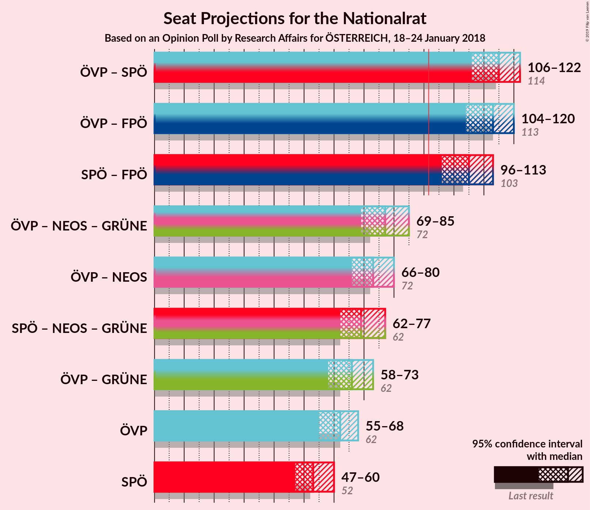
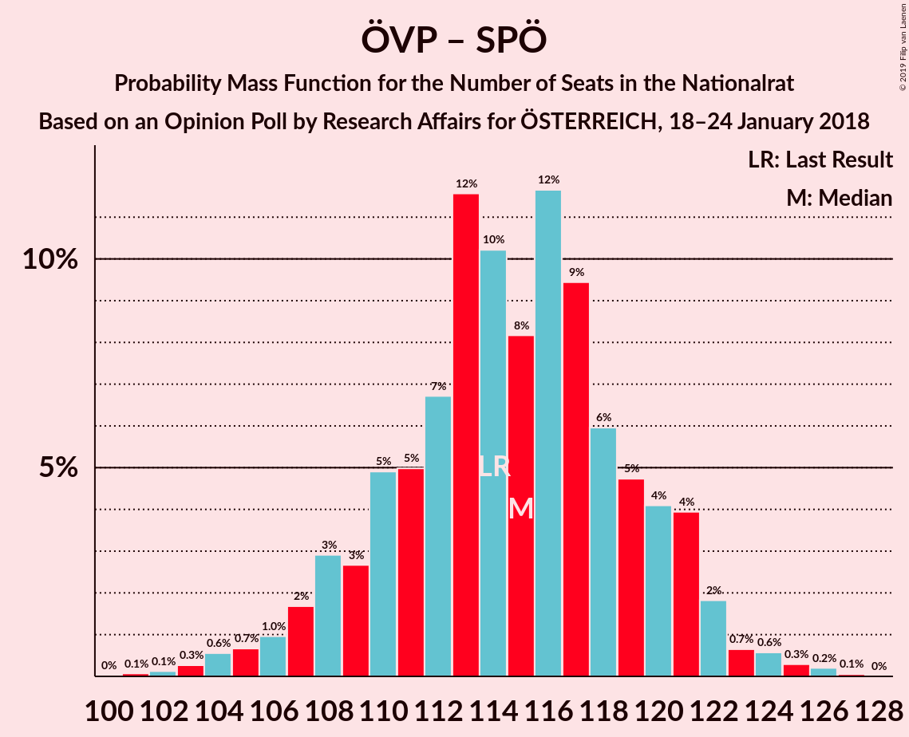
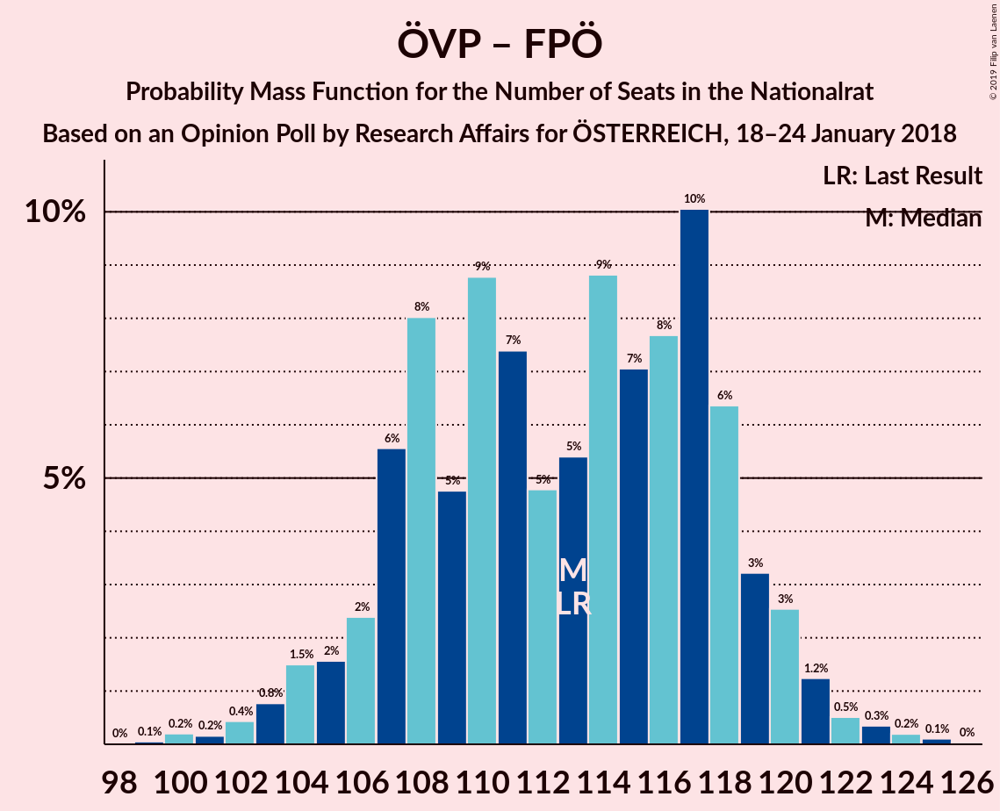
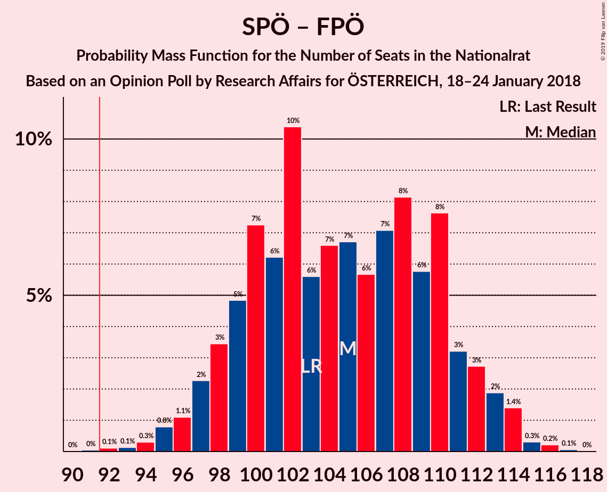
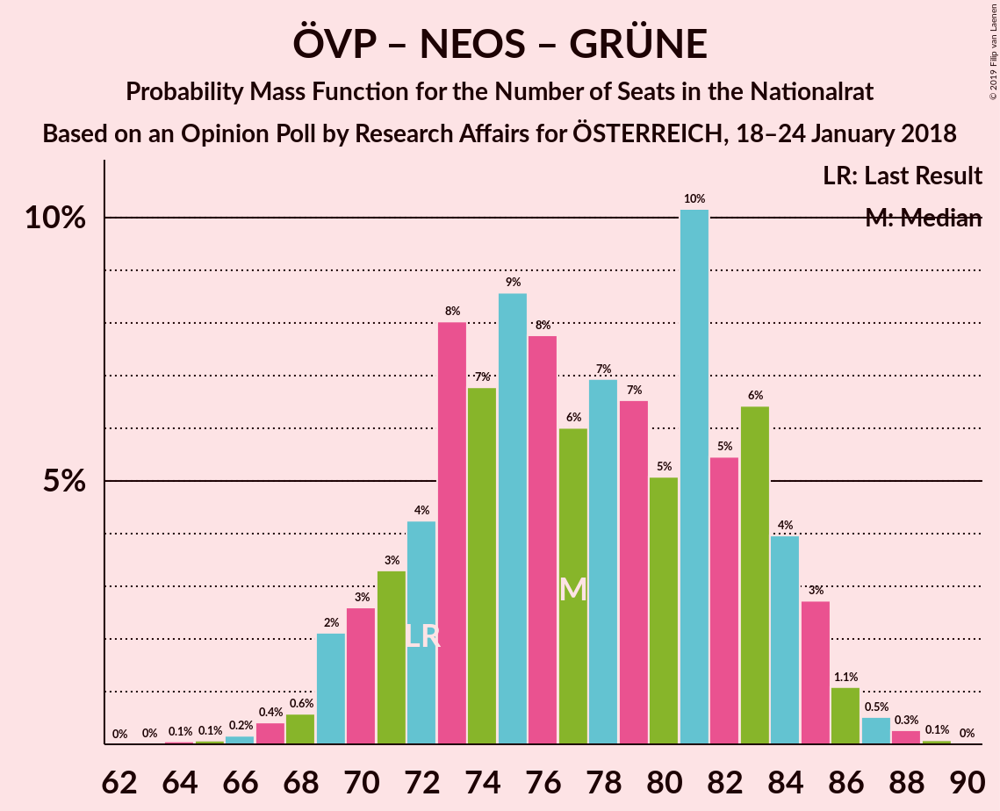
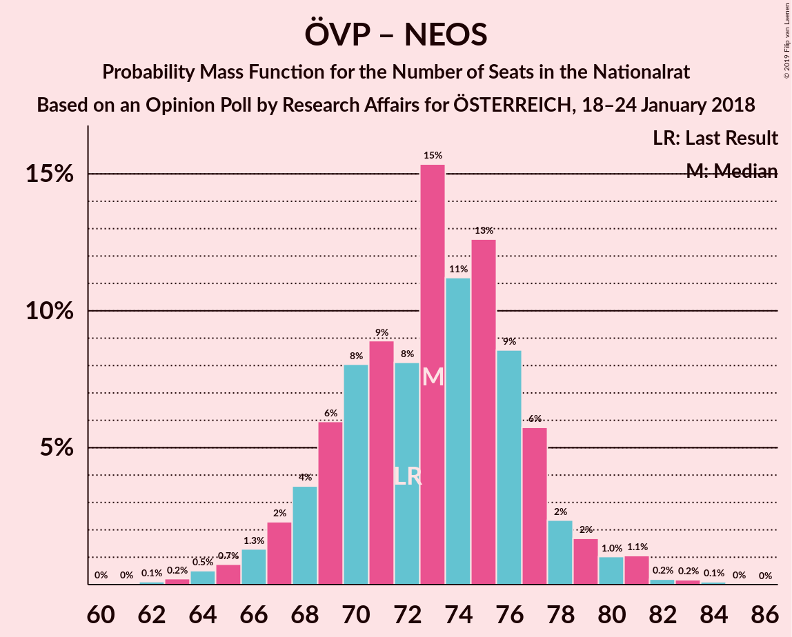
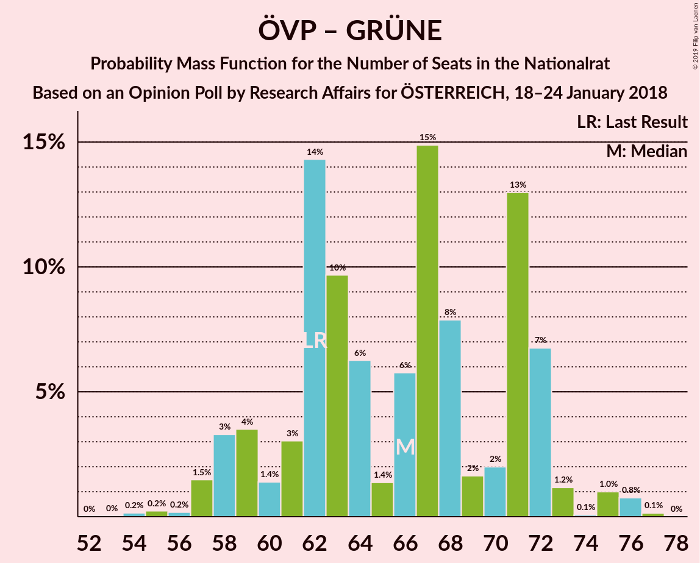

# Opinion Poll by Research Affairs for ÖSTERREICH, 18–24 January 2018

<a href="#voting-intentions">Voting Intentions</a> | <a href="#seats">Seats</a> | <a href="#coalitions">Coalitions</a> | <a href="#technical-information">Technical Information</a>

## Voting Intentions

### Confidence Intervals

| Party | Last Result | Poll Result | 80% Confidence Interval | 90% Confidence Interval | 95% Confidence Interval | 99% Confidence Interval |
|:-----:|:-----------:|:-----------:|:-----------------------:|:-----------------------:|:-----------------------:|:-----------------------:|
| Österreichische Volkspartei | 31.5% | 31.0% | 29.2–32.9% |28.6–33.5% |28.2–33.9% |27.3–34.9% |
| Sozialdemokratische Partei Österreichs | 26.9% | 27.0% | 25.2–28.8% |24.7–29.4% |24.3–29.8% |23.5–30.7% |
| Freiheitliche Partei Österreichs | 26.0% | 26.0% | 24.2–27.8% |23.8–28.3% |23.4–28.8% |22.5–29.7% |
| NEOS–Das Neue Österreich und Liberales Forum | 5.3% | 6.0% | 5.2–7.1% |4.9–7.4% |4.7–7.7% |4.3–8.2% |
| Die Grünen–Die Grüne Alternative | 3.8% | 4.0% | 3.3–4.9% |3.1–5.2% |3.0–5.4% |2.7–5.9% |
| JETZT–Liste Pilz | 4.4% | 3.0% | 2.4–3.8% |2.3–4.1% |2.1–4.3% |1.9–4.7% |

*Note:* The poll result column reflects the actual value used in the calculations. Published results may vary slightly, and in addition be rounded to fewer digits.

## Seats

### Confidence Intervals

| Party | Last Result | Median | 80% Confidence Interval | 90% Confidence Interval | 95% Confidence Interval | 99% Confidence Interval |
|:-----:|:-----------:|:------:|:-----------------------:|:-----------------------:|:-----------------------:|:-----------------------:|
| <a href="#österreichische-volkspartei">Österreichische Volkspartei</a> | 62 | 64 | 60–67 |58–67 |57–67 |55–68 |
| <a href="#sozialdemokratische-partei-österreichs">Sozialdemokratische Partei Österreichs</a> | 52 | 53 | 50–59 |49–59 |49–59 |47–59 |
| <a href="#freiheitliche-partei-österreichs">Freiheitliche Partei Österreichs</a> | 51 | 53 | 48–53 |47–56 |45–56 |42–58 |
| <a href="#neos–das-neue-österreich-und-liberales-forum">NEOS–Das Neue Österreich und Liberales Forum</a> | 10 | 13 | 9–13 |9–14 |9–14 |9–14 |
| <a href="#die-grünen–die-grüne-alternative">Die Grünen–Die Grüne Alternative</a> | 0 | 0 | 0 |0 |0–8 |0–12 |
| <a href="#jetzt–liste-pilz">JETZT–Liste Pilz</a> | 8 | 0 | 0–8 |0–9 |0–9 |0–10 |

### Österreichische Volkspartei

*For a full overview of the results for this party, see the [Österreichische Volkspartei](party-österreichischevolkspartei.html) page.*

| Number of Seats | Probability | Accumulated | Special Marks |
|:---------------:|:-----------:|:-----------:|:-------------:|
| 51 | 0.1% | 100% |  |
| 52 | 0% | 99.9% |  |
| 53 | 0.2% | 99.9% |  |
| 54 | 0% | 99.7% |  |
| 55 | 1.1% | 99.7% |  |
| 56 | 0% | 98.7% |  |
| 57 | 2% | 98.7% |  |
| 58 | 7% | 97% |  |
| 59 | 0% | 90% |  |
| 60 | 7% | 90% |  |
| 61 | 4% | 84% |  |
| 62 | 1.2% | 80% | Last Result |
| 63 | 5% | 79% |  |
| 64 | 57% | 74% | Median |
| 65 | 0.6% | 17% |  |
| 66 | 1.4% | 17% |  |
| 67 | 13% | 16% |  |
| 68 | 2% | 2% |  |
| 69 | 0.4% | 0.4% |  |
| 70 | 0% | 0% |  |

### Sozialdemokratische Partei Österreichs

*For a full overview of the results for this party, see the [Sozialdemokratische Partei Österreichs](party-sozialdemokratischeparteiösterreichs.html) page.*

| Number of Seats | Probability | Accumulated | Special Marks |
|:---------------:|:-----------:|:-----------:|:-------------:|
| 45 | 0% | 100% |  |
| 46 | 0% | 99.9% |  |
| 47 | 0.5% | 99.9% |  |
| 48 | 0% | 99.4% |  |
| 49 | 7% | 99.4% |  |
| 50 | 2% | 92% |  |
| 51 | 3% | 90% |  |
| 52 | 0.3% | 87% | Last Result |
| 53 | 56% | 87% | Median |
| 54 | 7% | 30% |  |
| 55 | 0% | 23% |  |
| 56 | 1.4% | 23% |  |
| 57 | 0% | 22% |  |
| 58 | 1.5% | 22% |  |
| 59 | 20% | 20% |  |
| 60 | 0% | 0% |  |

### Freiheitliche Partei Österreichs

*For a full overview of the results for this party, see the [Freiheitliche Partei Österreichs](party-freiheitlicheparteiösterreichs.html) page.*

| Number of Seats | Probability | Accumulated | Special Marks |
|:---------------:|:-----------:|:-----------:|:-------------:|
| 41 | 0.1% | 100% |  |
| 42 | 0.6% | 99.9% |  |
| 43 | 0% | 99.3% |  |
| 44 | 2% | 99.3% |  |
| 45 | 0.3% | 98% |  |
| 46 | 1.4% | 97% |  |
| 47 | 6% | 96% |  |
| 48 | 15% | 90% |  |
| 49 | 1.1% | 76% |  |
| 50 | 1.3% | 74% |  |
| 51 | 3% | 73% | Last Result |
| 52 | 7% | 70% |  |
| 53 | 55% | 63% | Median |
| 54 | 0.1% | 8% |  |
| 55 | 0.9% | 8% |  |
| 56 | 6% | 7% |  |
| 57 | 0% | 2% |  |
| 58 | 1.5% | 2% |  |
| 59 | 0% | 0.1% |  |
| 60 | 0% | 0.1% |  |
| 61 | 0.1% | 0.1% |  |
| 62 | 0% | 0% |  |

### NEOS–Das Neue Österreich und Liberales Forum

*For a full overview of the results for this party, see the [NEOS–Das Neue Österreich und Liberales Forum](party-neos–dasneueösterreichundliberalesforum.html) page.*

| Number of Seats | Probability | Accumulated | Special Marks |
|:---------------:|:-----------:|:-----------:|:-------------:|
| 9 | 16% | 100% |  |
| 10 | 14% | 84% | Last Result |
| 11 | 1.3% | 70% |  |
| 12 | 3% | 69% |  |
| 13 | 59% | 66% | Median |
| 14 | 7% | 7% |  |
| 15 | 0% | 0% |  |

### Die Grünen–Die Grüne Alternative

*For a full overview of the results for this party, see the [Die Grünen–Die Grüne Alternative](party-diegrünen–diegrünealternative.html) page.*

| Number of Seats | Probability | Accumulated | Special Marks |
|:---------------:|:-----------:|:-----------:|:-------------:|
| 0 | 95% | 100% | Last Result, Median |
| 1 | 0% | 5% |  |
| 2 | 0% | 5% |  |
| 3 | 0% | 5% |  |
| 4 | 0% | 5% |  |
| 5 | 0% | 5% |  |
| 6 | 0% | 5% |  |
| 7 | 0.1% | 5% |  |
| 8 | 2% | 5% |  |
| 9 | 0% | 2% |  |
| 10 | 0.1% | 2% |  |
| 11 | 1.1% | 2% |  |
| 12 | 1.1% | 1.3% |  |
| 13 | 0.1% | 0.1% |  |
| 14 | 0% | 0% |  |

### JETZT–Liste Pilz

*For a full overview of the results for this party, see the [JETZT–Liste Pilz](party-jetzt–listepilz.html) page.*

| Number of Seats | Probability | Accumulated | Special Marks |
|:---------------:|:-----------:|:-----------:|:-------------:|
| 0 | 86% | 100% | Median |
| 1 | 0% | 14% |  |
| 2 | 0% | 14% |  |
| 3 | 0% | 14% |  |
| 4 | 0% | 14% |  |
| 5 | 0% | 14% |  |
| 6 | 0% | 14% |  |
| 7 | 0.1% | 14% |  |
| 8 | 7% | 14% | Last Result |
| 9 | 6% | 7% |  |
| 10 | 1.0% | 1.0% |  |
| 11 | 0% | 0% |  |

## Coalitions

### Confidence Intervals

| Coalition | Last Result | Median | Majority? | 80% Confidence Interval | 90% Confidence Interval | 95% Confidence Interval | 99% Confidence Interval |
|:---------:|:-----------:|:------:|:---------:|:-----------------------:|:-----------------------:|:-----------------------:|:-----------------------:|
| Österreichische Volkspartei – Sozialdemokratische Partei Österreichs | 114 | 117 | 100% | 112–126 | 109–126 | 109–126 | 104–126 |
| Österreichische Volkspartei – Freiheitliche Partei Österreichs | 113 | 117 | 100% | 110–117 | 110–117 | 109–117 | 105–117 |
| Sozialdemokratische Partei Österreichs – Freiheitliche Partei Österreichs | 103 | 106 | 99.7% | 101–107 | 101–115 | 94–115 | 92–116 |
| Österreichische Volkspartei – NEOS–Das Neue Österreich und Liberales Forum – Die Grünen–Die Grüne Alternative | 72 | 77 | 0% | 73–77 | 68–78 | 68–86 | 67–89 |
| Österreichische Volkspartei – NEOS–Das Neue Österreich und Liberales Forum | 72 | 77 | 0% | 71–77 | 68–77 | 67–78 | 67–81 |
| Österreichische Volkspartei – Die Grünen–Die Grüne Alternative | 62 | 64 | 0% | 60–67 | 58–67 | 58–73 | 57–76 |
| Sozialdemokratische Partei Österreichs – NEOS–Das Neue Österreich und Liberales Forum – Die Grünen–Die Grüne Alternative | 62 | 66 | 0% | 63–69 | 63–69 | 63–72 | 63–75 |
| Österreichische Volkspartei | 62 | 64 | 0% | 60–67 | 58–67 | 57–67 | 55–68 |
| Sozialdemokratische Partei Österreichs | 52 | 53 | 0% | 50–59 | 49–59 | 49–59 | 47–59 |

### Österreichische Volkspartei – Sozialdemokratische Partei Österreichs

| Number of Seats | Probability | Accumulated | Special Marks |
|:---------------:|:-----------:|:-----------:|:-------------:|
| 100 | 0.2% | 100% |  |
| 101 | 0% | 99.8% |  |
| 102 | 0% | 99.8% |  |
| 103 | 0% | 99.8% |  |
| 104 | 1.0% | 99.8% |  |
| 105 | 0% | 98.8% |  |
| 106 | 0.1% | 98.8% |  |
| 107 | 0.1% | 98.7% |  |
| 108 | 0.1% | 98.7% |  |
| 109 | 6% | 98.6% |  |
| 110 | 0.1% | 92% |  |
| 111 | 0.1% | 92% |  |
| 112 | 4% | 92% |  |
| 113 | 0% | 88% |  |
| 114 | 1.0% | 88% | Last Result |
| 115 | 2% | 87% |  |
| 116 | 1.3% | 85% |  |
| 117 | 65% | 84% | Median |
| 118 | 2% | 18% |  |
| 119 | 0.8% | 17% |  |
| 120 | 1.2% | 16% |  |
| 121 | 0% | 15% |  |
| 122 | 0% | 15% |  |
| 123 | 0% | 15% |  |
| 124 | 0% | 15% |  |
| 125 | 1.2% | 15% |  |
| 126 | 13% | 13% |  |
| 127 | 0% | 0% |  |

### Österreichische Volkspartei – Freiheitliche Partei Österreichs

| Number of Seats | Probability | Accumulated | Special Marks |
|:---------------:|:-----------:|:-----------:|:-------------:|
| 104 | 0.1% | 100% |  |
| 105 | 0.4% | 99.9% |  |
| 106 | 0% | 99.5% |  |
| 107 | 0.4% | 99.5% |  |
| 108 | 1.2% | 99.0% |  |
| 109 | 1.4% | 98% |  |
| 110 | 8% | 96% |  |
| 111 | 0.4% | 89% |  |
| 112 | 11% | 88% |  |
| 113 | 0% | 77% | Last Result |
| 114 | 7% | 77% |  |
| 115 | 15% | 71% |  |
| 116 | 0.4% | 56% |  |
| 117 | 55% | 55% | Median |
| 118 | 0% | 0% |  |

### Sozialdemokratische Partei Österreichs – Freiheitliche Partei Österreichs

| Number of Seats | Probability | Accumulated | Special Marks |
|:---------------:|:-----------:|:-----------:|:-------------:|
| 89 | 0.2% | 100% |  |
| 90 | 0.1% | 99.8% |  |
| 91 | 0% | 99.7% |  |
| 92 | 0.4% | 99.7% | Majority |
| 93 | 0% | 99.3% |  |
| 94 | 2% | 99.3% |  |
| 95 | 0.1% | 97% |  |
| 96 | 0% | 97% |  |
| 97 | 0.4% | 97% |  |
| 98 | 0% | 97% |  |
| 99 | 0.2% | 97% |  |
| 100 | 0.1% | 97% |  |
| 101 | 12% | 97% |  |
| 102 | 5% | 84% |  |
| 103 | 0% | 80% | Last Result |
| 104 | 2% | 80% |  |
| 105 | 0.4% | 78% |  |
| 106 | 55% | 77% | Median |
| 107 | 15% | 22% |  |
| 108 | 0% | 7% |  |
| 109 | 0% | 7% |  |
| 110 | 0.1% | 7% |  |
| 111 | 0% | 7% |  |
| 112 | 0% | 7% |  |
| 113 | 0.1% | 7% |  |
| 114 | 0.1% | 7% |  |
| 115 | 6% | 7% |  |
| 116 | 1.5% | 1.5% |  |
| 117 | 0% | 0% |  |

### Österreichische Volkspartei – NEOS–Das Neue Österreich und Liberales Forum – Die Grünen–Die Grüne Alternative

| Number of Seats | Probability | Accumulated | Special Marks |
|:---------------:|:-----------:|:-----------:|:-------------:|
| 64 | 0.1% | 100% |  |
| 65 | 0% | 99.9% |  |
| 66 | 0% | 99.9% |  |
| 67 | 2% | 99.9% |  |
| 68 | 6% | 98% |  |
| 69 | 0.1% | 93% |  |
| 70 | 0.4% | 93% |  |
| 71 | 1.0% | 92% |  |
| 72 | 0% | 91% | Last Result |
| 73 | 10% | 91% |  |
| 74 | 6% | 82% |  |
| 75 | 0.1% | 75% |  |
| 76 | 15% | 75% |  |
| 77 | 56% | 61% | Median |
| 78 | 0.4% | 5% |  |
| 79 | 2% | 5% |  |
| 80 | 0% | 3% |  |
| 81 | 0% | 3% |  |
| 82 | 0% | 3% |  |
| 83 | 0% | 3% |  |
| 84 | 0% | 3% |  |
| 85 | 0% | 3% |  |
| 86 | 0.3% | 3% |  |
| 87 | 0% | 2% |  |
| 88 | 0.1% | 2% |  |
| 89 | 2% | 2% |  |
| 90 | 0% | 0.4% |  |
| 91 | 0.4% | 0.4% |  |
| 92 | 0% | 0% | Majority |

### Österreichische Volkspartei – NEOS–Das Neue Österreich und Liberales Forum

| Number of Seats | Probability | Accumulated | Special Marks |
|:---------------:|:-----------:|:-----------:|:-------------:|
| 60 | 0.1% | 100% |  |
| 61 | 0% | 99.9% |  |
| 62 | 0% | 99.9% |  |
| 63 | 0% | 99.9% |  |
| 64 | 0.1% | 99.9% |  |
| 65 | 0% | 99.8% |  |
| 66 | 0.2% | 99.8% |  |
| 67 | 3% | 99.6% |  |
| 68 | 6% | 97% |  |
| 69 | 0.1% | 91% |  |
| 70 | 0.4% | 91% |  |
| 71 | 1.0% | 90% |  |
| 72 | 0% | 89% | Last Result |
| 73 | 10% | 89% |  |
| 74 | 6% | 79% |  |
| 75 | 0.1% | 73% |  |
| 76 | 15% | 73% |  |
| 77 | 55% | 58% | Median |
| 78 | 0.6% | 3% |  |
| 79 | 0.1% | 2% |  |
| 80 | 0% | 2% |  |
| 81 | 2% | 2% |  |
| 82 | 0% | 0.5% |  |
| 83 | 0.4% | 0.4% |  |
| 84 | 0% | 0% |  |

### Österreichische Volkspartei – Die Grünen–Die Grüne Alternative

| Number of Seats | Probability | Accumulated | Special Marks |
|:---------------:|:-----------:|:-----------:|:-------------:|
| 55 | 0.1% | 100% |  |
| 56 | 0% | 99.9% |  |
| 57 | 2% | 99.9% |  |
| 58 | 6% | 98% |  |
| 59 | 0% | 93% |  |
| 60 | 7% | 93% |  |
| 61 | 4% | 86% |  |
| 62 | 1.3% | 82% | Last Result |
| 63 | 5% | 81% |  |
| 64 | 57% | 76% | Median |
| 65 | 0.4% | 20% |  |
| 66 | 2% | 19% |  |
| 67 | 13% | 17% |  |
| 68 | 0% | 4% |  |
| 69 | 0% | 4% |  |
| 70 | 1.1% | 4% |  |
| 71 | 0% | 3% |  |
| 72 | 0% | 3% |  |
| 73 | 0.3% | 3% |  |
| 74 | 0% | 2% |  |
| 75 | 0% | 2% |  |
| 76 | 2% | 2% |  |
| 77 | 0.4% | 0.4% |  |
| 78 | 0% | 0% |  |

### Sozialdemokratische Partei Österreichs – NEOS–Das Neue Österreich und Liberales Forum – Die Grünen–Die Grüne Alternative

| Number of Seats | Probability | Accumulated | Special Marks |
|:---------------:|:-----------:|:-----------:|:-------------:|
| 60 | 0.1% | 100% |  |
| 61 | 0% | 99.9% |  |
| 62 | 0.3% | 99.8% | Last Result |
| 63 | 10% | 99.6% |  |
| 64 | 5% | 89% |  |
| 65 | 3% | 85% |  |
| 66 | 55% | 82% | Median |
| 67 | 0.4% | 27% |  |
| 68 | 15% | 27% |  |
| 69 | 7% | 11% |  |
| 70 | 0% | 5% |  |
| 71 | 2% | 5% |  |
| 72 | 0.4% | 3% |  |
| 73 | 0.9% | 2% |  |
| 74 | 0.1% | 1.3% |  |
| 75 | 1.2% | 1.2% |  |
| 76 | 0% | 0% |  |

### Österreichische Volkspartei

| Number of Seats | Probability | Accumulated | Special Marks |
|:---------------:|:-----------:|:-----------:|:-------------:|
| 51 | 0.1% | 100% |  |
| 52 | 0% | 99.9% |  |
| 53 | 0.2% | 99.9% |  |
| 54 | 0% | 99.7% |  |
| 55 | 1.1% | 99.7% |  |
| 56 | 0% | 98.7% |  |
| 57 | 2% | 98.7% |  |
| 58 | 7% | 97% |  |
| 59 | 0% | 90% |  |
| 60 | 7% | 90% |  |
| 61 | 4% | 84% |  |
| 62 | 1.2% | 80% | Last Result |
| 63 | 5% | 79% |  |
| 64 | 57% | 74% | Median |
| 65 | 0.6% | 17% |  |
| 66 | 1.4% | 17% |  |
| 67 | 13% | 16% |  |
| 68 | 2% | 2% |  |
| 69 | 0.4% | 0.4% |  |
| 70 | 0% | 0% |  |

### Sozialdemokratische Partei Österreichs

| Number of Seats | Probability | Accumulated | Special Marks |
|:---------------:|:-----------:|:-----------:|:-------------:|
| 45 | 0% | 100% |  |
| 46 | 0% | 99.9% |  |
| 47 | 0.5% | 99.9% |  |
| 48 | 0% | 99.4% |  |
| 49 | 7% | 99.4% |  |
| 50 | 2% | 92% |  |
| 51 | 3% | 90% |  |
| 52 | 0.3% | 87% | Last Result |
| 53 | 56% | 87% | Median |
| 54 | 7% | 30% |  |
| 55 | 0% | 23% |  |
| 56 | 1.4% | 23% |  |
| 57 | 0% | 22% |  |
| 58 | 1.5% | 22% |  |
| 59 | 20% | 20% |  |
| 60 | 0% | 0% |  |

## Technical Information

### Opinion Poll

+ **Polling firm:** Research Affairs
+ **Commissioner(s):** ÖSTERREICH
+ **Fieldwork period:** 18–24 January 2018

### Calculations

+ **Sample size:** 997
+ **Simulations done:** 1,024
+ **Error estimate:** 2.64%

