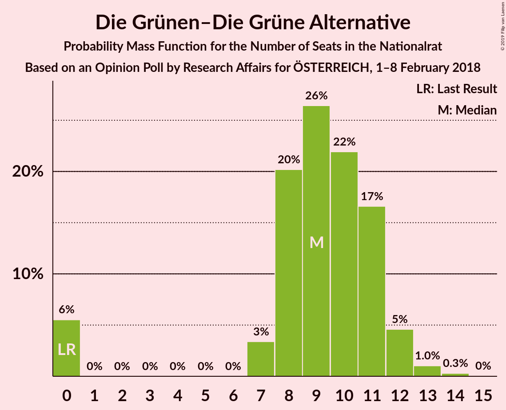
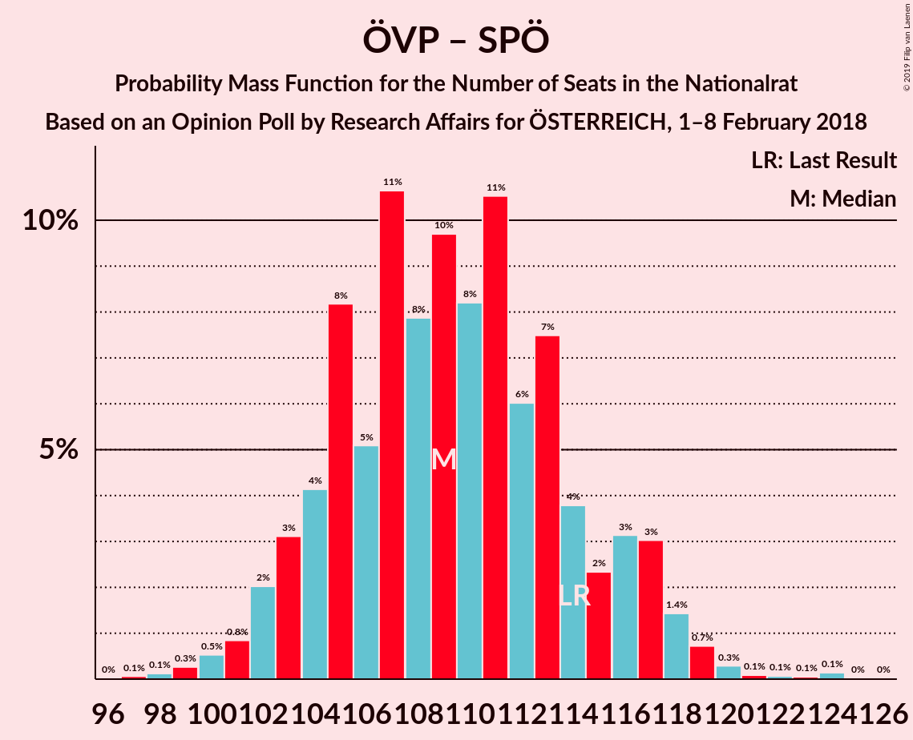
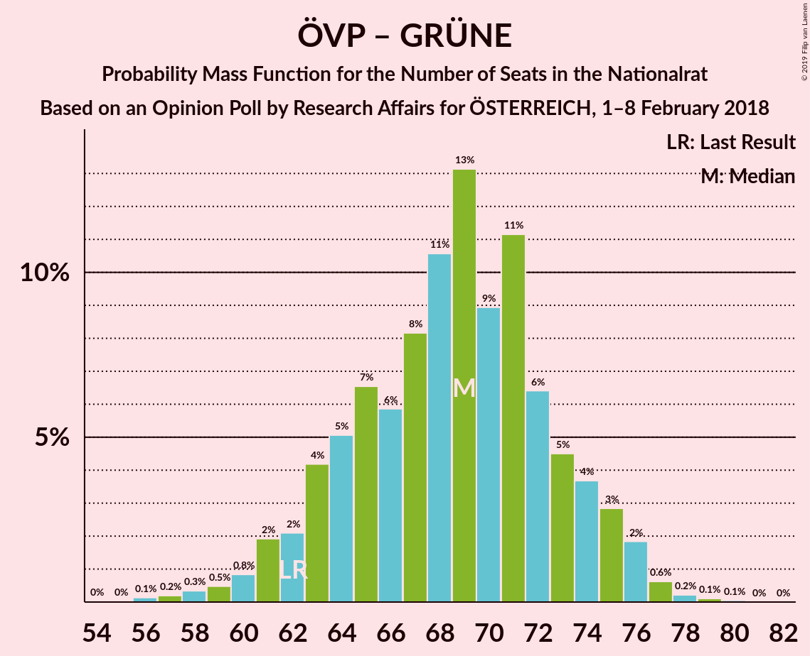
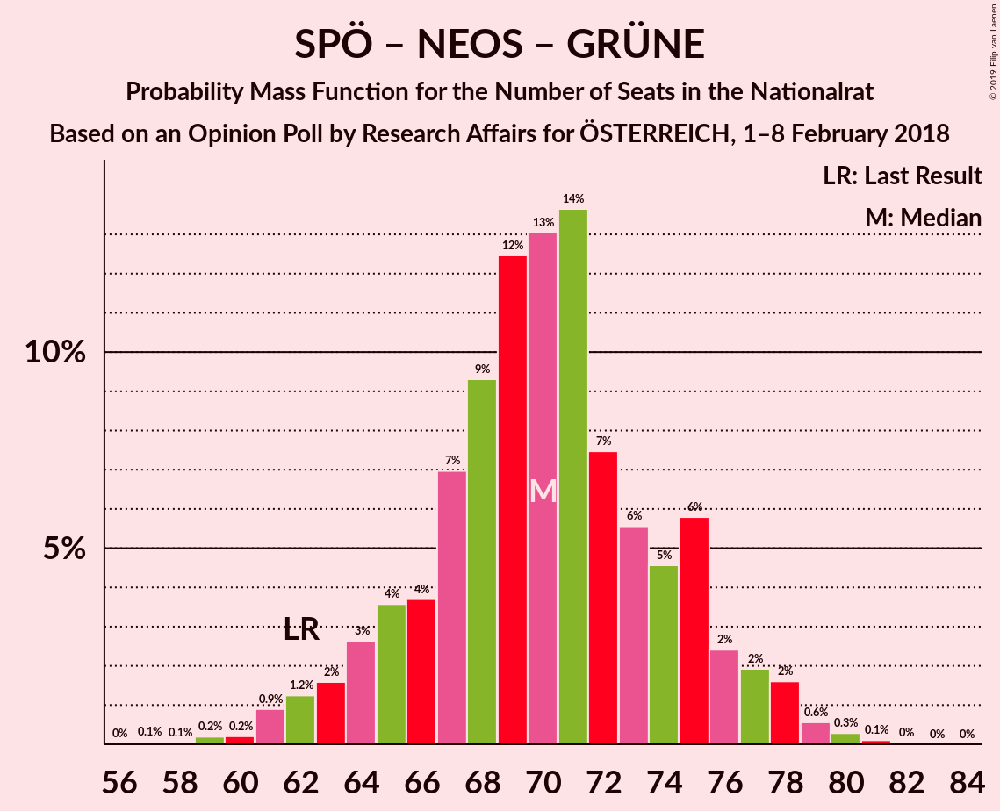

# Opinion Poll by Research Affairs for ÖSTERREICH, 1–8 February 2018

<a href="#voting-intentions">Voting Intentions</a> | <a href="#seats">Seats</a> | <a href="#coalitions">Coalitions</a> | <a href="#technical-information">Technical Information</a>

## Voting Intentions

### Confidence Intervals

| Party | Last Result | Poll Result | 80% Confidence Interval | 90% Confidence Interval | 95% Confidence Interval | 99% Confidence Interval |
|:-----:|:-----------:|:-----------:|:-----------------------:|:-----------------------:|:-----------------------:|:-----------------------:|
| Österreichische Volkspartei | 31.5% | 31.0% | 29.1–32.9% |28.6–33.4% |28.2–33.9% |27.3–34.8% |
| Sozialdemokratische Partei Österreichs | 26.9% | 26.0% | 24.2–27.8% |23.8–28.3% |23.4–28.8% |22.5–29.7% |
| Freiheitliche Partei Österreichs | 26.0% | 25.0% | 23.3–26.8% |22.8–27.3% |22.4–27.8% |21.6–28.6% |
| NEOS–Das Neue Österreich und Liberales Forum | 5.3% | 6.0% | 5.1–7.1% |4.9–7.4% |4.7–7.7% |4.3–8.2% |
| Die Grünen–Die Grüne Alternative | 3.8% | 5.0% | 4.2–6.0% |4.0–6.3% |3.8–6.5% |3.5–7.0% |
| JETZT–Liste Pilz | 4.4% | 3.0% | 2.4–3.8% |2.2–4.1% |2.1–4.3% |1.9–4.7% |

*Note:* The poll result column reflects the actual value used in the calculations. Published results may vary slightly, and in addition be rounded to fewer digits.

## Seats

### Confidence Intervals

| Party | Last Result | Median | 80% Confidence Interval | 90% Confidence Interval | 95% Confidence Interval | 99% Confidence Interval |
|:-----:|:-----------:|:------:|:-----------------------:|:-----------------------:|:-----------------------:|:-----------------------:|
| <a href="#österreichische-volkspartei">Österreichische Volkspartei</a> | 62 | 57 | 57–66 |57–66 |56–66 |52–68 |
| <a href="#sozialdemokratische-partei-österreichs">Sozialdemokratische Partei Österreichs</a> | 52 | 46 | 46–55 |46–55 |46–55 |43–57 |
| <a href="#freiheitliche-partei-österreichs">Freiheitliche Partei Österreichs</a> | 51 | 51 | 49–53 |43–57 |41–57 |41–57 |
| <a href="#neos–das-neue-österreich-und-liberales-forum">NEOS–Das Neue Österreich und Liberales Forum</a> | 10 | 13 | 11–14 |11–14 |10–14 |8–15 |
| <a href="#die-grünen–die-grüne-alternative">Die Grünen–Die Grüne Alternative</a> | 0 | 8 | 0–8 |0–11 |0–12 |0–14 |
| <a href="#jetzt–liste-pilz">JETZT–Liste Pilz</a> | 8 | 0 | 0 |0 |0 |0 |

### Österreichische Volkspartei

*For a full overview of the results for this party, see the [Österreichische Volkspartei](party-österreichischevolkspartei.html) page.*

| Number of Seats | Probability | Accumulated | Special Marks |
|:---------------:|:-----------:|:-----------:|:-------------:|
| 50 | 0.2% | 100% |  |
| 51 | 0% | 99.8% |  |
| 52 | 0.7% | 99.8% |  |
| 53 | 0.4% | 99.2% |  |
| 54 | 0% | 98.8% |  |
| 55 | 0.1% | 98.8% |  |
| 56 | 2% | 98.7% |  |
| 57 | 49% | 97% | Median |
| 58 | 0.1% | 48% |  |
| 59 | 2% | 48% |  |
| 60 | 5% | 45% |  |
| 61 | 0.4% | 41% |  |
| 62 | 2% | 40% | Last Result |
| 63 | 24% | 39% |  |
| 64 | 0.9% | 15% |  |
| 65 | 0% | 14% |  |
| 66 | 12% | 14% |  |
| 67 | 0% | 1.4% |  |
| 68 | 0.9% | 1.4% |  |
| 69 | 0.4% | 0.5% |  |
| 70 | 0% | 0.1% |  |
| 71 | 0% | 0.1% |  |
| 72 | 0% | 0% |  |

### Sozialdemokratische Partei Österreichs

*For a full overview of the results for this party, see the [Sozialdemokratische Partei Österreichs](party-sozialdemokratischeparteiösterreichs.html) page.*

| Number of Seats | Probability | Accumulated | Special Marks |
|:---------------:|:-----------:|:-----------:|:-------------:|
| 39 | 0.1% | 100% |  |
| 40 | 0% | 99.9% |  |
| 41 | 0.3% | 99.9% |  |
| 42 | 0% | 99.6% |  |
| 43 | 0.9% | 99.6% |  |
| 44 | 0% | 98.7% |  |
| 45 | 0.1% | 98.7% |  |
| 46 | 51% | 98.5% | Median |
| 47 | 0.1% | 47% |  |
| 48 | 0.4% | 47% |  |
| 49 | 12% | 47% |  |
| 50 | 0.3% | 35% |  |
| 51 | 0.5% | 35% |  |
| 52 | 3% | 34% | Last Result |
| 53 | 0.5% | 32% |  |
| 54 | 5% | 31% |  |
| 55 | 25% | 26% |  |
| 56 | 0.2% | 1.5% |  |
| 57 | 1.0% | 1.2% |  |
| 58 | 0% | 0.2% |  |
| 59 | 0.1% | 0.2% |  |
| 60 | 0% | 0.1% |  |
| 61 | 0% | 0% |  |

### Freiheitliche Partei Österreichs

*For a full overview of the results for this party, see the [Freiheitliche Partei Österreichs](party-freiheitlicheparteiösterreichs.html) page.*

| Number of Seats | Probability | Accumulated | Special Marks |
|:---------------:|:-----------:|:-----------:|:-------------:|
| 39 | 0.1% | 100% |  |
| 40 | 0% | 99.9% |  |
| 41 | 4% | 99.9% |  |
| 42 | 0.1% | 96% |  |
| 43 | 0.7% | 95% |  |
| 44 | 0.3% | 95% |  |
| 45 | 0.1% | 94% |  |
| 46 | 0.9% | 94% |  |
| 47 | 0.3% | 93% |  |
| 48 | 0.4% | 93% |  |
| 49 | 5% | 93% |  |
| 50 | 2% | 88% |  |
| 51 | 49% | 86% | Last Result, Median |
| 52 | 3% | 37% |  |
| 53 | 24% | 34% |  |
| 54 | 0% | 10% |  |
| 55 | 2% | 10% |  |
| 56 | 0% | 8% |  |
| 57 | 8% | 8% |  |
| 58 | 0% | 0% |  |

### NEOS–Das Neue Österreich und Liberales Forum

*For a full overview of the results for this party, see the [NEOS–Das Neue Österreich und Liberales Forum](party-neos–dasneueösterreichundliberalesforum.html) page.*

| Number of Seats | Probability | Accumulated | Special Marks |
|:---------------:|:-----------:|:-----------:|:-------------:|
| 7 | 0.2% | 100% |  |
| 8 | 0.6% | 99.8% |  |
| 9 | 0.2% | 99.2% |  |
| 10 | 2% | 99.0% | Last Result |
| 11 | 15% | 97% |  |
| 12 | 26% | 82% |  |
| 13 | 46% | 56% | Median |
| 14 | 9% | 10% |  |
| 15 | 2% | 2% |  |
| 16 | 0% | 0% |  |

### Die Grünen–Die Grüne Alternative

*For a full overview of the results for this party, see the [Die Grünen–Die Grüne Alternative](party-diegrünen–diegrünealternative.html) page.*

| Number of Seats | Probability | Accumulated | Special Marks |
|:---------------:|:-----------:|:-----------:|:-------------:|
| 0 | 43% | 100% | Last Result |
| 1 | 0% | 57% |  |
| 2 | 0% | 57% |  |
| 3 | 0% | 57% |  |
| 4 | 0% | 57% |  |
| 5 | 0% | 57% |  |
| 6 | 0% | 57% |  |
| 7 | 2% | 57% |  |
| 8 | 48% | 56% | Median |
| 9 | 0.5% | 8% |  |
| 10 | 0.4% | 8% |  |
| 11 | 4% | 7% |  |
| 12 | 1.0% | 3% |  |
| 13 | 1.2% | 2% |  |
| 14 | 0.6% | 0.6% |  |
| 15 | 0% | 0% |  |

### JETZT–Liste Pilz

*For a full overview of the results for this party, see the [JETZT–Liste Pilz](party-jetzt–listepilz.html) page.*

| Number of Seats | Probability | Accumulated | Special Marks |
|:---------------:|:-----------:|:-----------:|:-------------:|
| 0 | 99.6% | 100% | Median |
| 1 | 0% | 0.4% |  |
| 2 | 0% | 0.4% |  |
| 3 | 0% | 0.4% |  |
| 4 | 0% | 0.4% |  |
| 5 | 0% | 0.4% |  |
| 6 | 0% | 0.4% |  |
| 7 | 0.2% | 0.4% |  |
| 8 | 0.2% | 0.2% | Last Result |
| 9 | 0% | 0.1% |  |
| 10 | 0% | 0% |  |

## Coalitions

### Confidence Intervals

| Coalition | Last Result | Median | Majority? | 80% Confidence Interval | 90% Confidence Interval | 95% Confidence Interval | 99% Confidence Interval |
|:---------:|:-----------:|:------:|:---------:|:-----------------------:|:-----------------------:|:-----------------------:|:-----------------------:|
| Österreichische Volkspartei – Freiheitliche Partei Österreichs | 113 | 108 | 100% | 107–116 | 106–123 | 106–123 | 99–123 |
| Österreichische Volkspartei – Sozialdemokratische Partei Österreichs | 114 | 109 | 100% | 103–118 | 103–118 | 103–118 | 102–123 |
| Sozialdemokratische Partei Österreichs – Freiheitliche Partei Österreichs | 103 | 97 | 95% | 97–108 | 91–108 | 87–108 | 87–108 |
| Österreichische Volkspartei – NEOS–Das Neue Österreich und Liberales Forum – Die Grünen–Die Grüne Alternative | 72 | 78 | 0.6% | 75–82 | 71–88 | 70–88 | 70–92 |
| Österreichische Volkspartei – NEOS–Das Neue Österreich und Liberales Forum | 72 | 70 | 0% | 70–77 | 70–77 | 69–77 | 64–82 |
| Österreichische Volkspartei – Die Grünen–Die Grüne Alternative | 62 | 65 | 0% | 63–68 | 59–77 | 57–77 | 57–78 |
| Sozialdemokratische Partei Österreichs – NEOS–Das Neue Österreich und Liberales Forum – Die Grünen–Die Grüne Alternative | 62 | 67 | 0% | 63–68 | 60–71 | 60–72 | 56–80 |
| Österreichische Volkspartei | 62 | 57 | 0% | 57–66 | 57–66 | 56–66 | 52–68 |
| Sozialdemokratische Partei Österreichs | 52 | 46 | 0% | 46–55 | 46–55 | 46–55 | 43–57 |

### Österreichische Volkspartei – Freiheitliche Partei Österreichs

| Number of Seats | Probability | Accumulated | Special Marks |
|:---------------:|:-----------:|:-----------:|:-------------:|
| 97 | 0.2% | 100% |  |
| 98 | 0.1% | 99.7% |  |
| 99 | 0.2% | 99.6% |  |
| 100 | 0% | 99.4% |  |
| 101 | 0.2% | 99.4% |  |
| 102 | 0.2% | 99.2% |  |
| 103 | 0.8% | 99.0% |  |
| 104 | 0.5% | 98% |  |
| 105 | 0% | 98% |  |
| 106 | 6% | 98% |  |
| 107 | 4% | 92% |  |
| 108 | 44% | 88% | Median |
| 109 | 0.2% | 43% |  |
| 110 | 3% | 43% |  |
| 111 | 1.1% | 40% |  |
| 112 | 4% | 39% |  |
| 113 | 0% | 35% | Last Result |
| 114 | 1.0% | 35% |  |
| 115 | 0.8% | 34% |  |
| 116 | 24% | 34% |  |
| 117 | 2% | 10% |  |
| 118 | 0% | 8% |  |
| 119 | 0% | 8% |  |
| 120 | 0% | 8% |  |
| 121 | 0% | 8% |  |
| 122 | 0% | 8% |  |
| 123 | 8% | 8% |  |
| 124 | 0% | 0% |  |

### Österreichische Volkspartei – Sozialdemokratische Partei Österreichs

| Number of Seats | Probability | Accumulated | Special Marks |
|:---------------:|:-----------:|:-----------:|:-------------:|
| 99 | 0.1% | 100% |  |
| 100 | 0.2% | 99.8% |  |
| 101 | 0.1% | 99.6% |  |
| 102 | 2% | 99.5% |  |
| 103 | 44% | 98% | Median |
| 104 | 0.1% | 53% |  |
| 105 | 0.1% | 53% |  |
| 106 | 0.6% | 53% |  |
| 107 | 0.7% | 52% |  |
| 108 | 2% | 52% |  |
| 109 | 4% | 50% |  |
| 110 | 0.3% | 46% |  |
| 111 | 7% | 46% |  |
| 112 | 4% | 39% |  |
| 113 | 0% | 35% |  |
| 114 | 0% | 35% | Last Result |
| 115 | 8% | 35% |  |
| 116 | 0.2% | 27% |  |
| 117 | 2% | 27% |  |
| 118 | 24% | 25% |  |
| 119 | 0% | 0.9% |  |
| 120 | 0% | 0.9% |  |
| 121 | 0% | 0.9% |  |
| 122 | 0% | 0.9% |  |
| 123 | 0.8% | 0.9% |  |
| 124 | 0% | 0% |  |

### Sozialdemokratische Partei Österreichs – Freiheitliche Partei Österreichs

| Number of Seats | Probability | Accumulated | Special Marks |
|:---------------:|:-----------:|:-----------:|:-------------:|
| 86 | 0.3% | 100% |  |
| 87 | 4% | 99.7% |  |
| 88 | 0% | 96% |  |
| 89 | 0% | 96% |  |
| 90 | 0.7% | 96% |  |
| 91 | 0.4% | 95% |  |
| 92 | 0% | 95% | Majority |
| 93 | 0.1% | 95% |  |
| 94 | 0.9% | 95% |  |
| 95 | 0.2% | 94% |  |
| 96 | 2% | 94% |  |
| 97 | 44% | 92% | Median |
| 98 | 0% | 47% |  |
| 99 | 0.3% | 47% |  |
| 100 | 0% | 47% |  |
| 101 | 6% | 47% |  |
| 102 | 0.1% | 41% |  |
| 103 | 7% | 41% | Last Result |
| 104 | 0% | 34% |  |
| 105 | 0.7% | 34% |  |
| 106 | 8% | 33% |  |
| 107 | 0.1% | 25% |  |
| 108 | 25% | 25% |  |
| 109 | 0% | 0% |  |

### Österreichische Volkspartei – NEOS–Das Neue Österreich und Liberales Forum – Die Grünen–Die Grüne Alternative

| Number of Seats | Probability | Accumulated | Special Marks |
|:---------------:|:-----------:|:-----------:|:-------------:|
| 68 | 0.1% | 100% |  |
| 69 | 0% | 99.9% |  |
| 70 | 3% | 99.9% |  |
| 71 | 5% | 97% |  |
| 72 | 2% | 93% | Last Result |
| 73 | 0.3% | 91% |  |
| 74 | 0.2% | 91% |  |
| 75 | 25% | 91% |  |
| 76 | 2% | 66% |  |
| 77 | 9% | 64% |  |
| 78 | 45% | 56% | Median |
| 79 | 0% | 11% |  |
| 80 | 0% | 11% |  |
| 81 | 0.4% | 11% |  |
| 82 | 4% | 10% |  |
| 83 | 0% | 6% |  |
| 84 | 0.5% | 6% |  |
| 85 | 0.2% | 6% |  |
| 86 | 0.2% | 5% |  |
| 87 | 0% | 5% |  |
| 88 | 4% | 5% |  |
| 89 | 0.8% | 1.4% |  |
| 90 | 0% | 0.7% |  |
| 91 | 0% | 0.7% |  |
| 92 | 0.4% | 0.6% | Majority |
| 93 | 0.2% | 0.2% |  |
| 94 | 0% | 0% |  |

### Österreichische Volkspartei – NEOS–Das Neue Österreich und Liberales Forum

| Number of Seats | Probability | Accumulated | Special Marks |
|:---------------:|:-----------:|:-----------:|:-------------:|
| 60 | 0.1% | 100% |  |
| 61 | 0.4% | 99.9% |  |
| 62 | 0% | 99.5% |  |
| 63 | 0% | 99.5% |  |
| 64 | 1.1% | 99.5% |  |
| 65 | 0% | 98% |  |
| 66 | 0.2% | 98% |  |
| 67 | 0% | 98% |  |
| 68 | 0% | 98% |  |
| 69 | 2% | 98% |  |
| 70 | 47% | 96% | Median |
| 71 | 4% | 50% |  |
| 72 | 2% | 45% | Last Result |
| 73 | 0.1% | 43% |  |
| 74 | 3% | 43% |  |
| 75 | 25% | 40% |  |
| 76 | 0.9% | 15% |  |
| 77 | 12% | 14% |  |
| 78 | 0.1% | 2% |  |
| 79 | 0% | 2% |  |
| 80 | 0% | 2% |  |
| 81 | 0.6% | 1.5% |  |
| 82 | 0.9% | 0.9% |  |
| 83 | 0% | 0% |  |

### Österreichische Volkspartei – Die Grünen–Die Grüne Alternative

| Number of Seats | Probability | Accumulated | Special Marks |
|:---------------:|:-----------:|:-----------:|:-------------:|
| 56 | 0.1% | 100% |  |
| 57 | 4% | 99.9% |  |
| 58 | 0.1% | 95% |  |
| 59 | 2% | 95% |  |
| 60 | 1.0% | 93% |  |
| 61 | 0.1% | 92% |  |
| 62 | 2% | 92% | Last Result |
| 63 | 25% | 90% |  |
| 64 | 0.2% | 65% |  |
| 65 | 44% | 64% | Median |
| 66 | 9% | 20% |  |
| 67 | 0.4% | 11% |  |
| 68 | 4% | 11% |  |
| 69 | 0.4% | 7% |  |
| 70 | 0.3% | 6% |  |
| 71 | 0% | 6% |  |
| 72 | 0% | 6% |  |
| 73 | 0.3% | 6% |  |
| 74 | 0.1% | 6% |  |
| 75 | 0.2% | 5% |  |
| 76 | 0.1% | 5% |  |
| 77 | 4% | 5% |  |
| 78 | 0.2% | 0.7% |  |
| 79 | 0% | 0.4% |  |
| 80 | 0.4% | 0.4% |  |
| 81 | 0% | 0% |  |

### Sozialdemokratische Partei Österreichs – NEOS–Das Neue Österreich und Liberales Forum – Die Grünen–Die Grüne Alternative

| Number of Seats | Probability | Accumulated | Special Marks |
|:---------------:|:-----------:|:-----------:|:-------------:|
| 56 | 2% | 100% |  |
| 57 | 0% | 98% |  |
| 58 | 0% | 98% |  |
| 59 | 0.1% | 98% |  |
| 60 | 8% | 98% |  |
| 61 | 0% | 90% |  |
| 62 | 0% | 90% | Last Result |
| 63 | 2% | 90% |  |
| 64 | 0.3% | 88% |  |
| 65 | 0.5% | 87% |  |
| 66 | 2% | 87% |  |
| 67 | 68% | 85% | Median |
| 68 | 9% | 17% |  |
| 69 | 1.1% | 8% |  |
| 70 | 0.4% | 7% |  |
| 71 | 4% | 7% |  |
| 72 | 1.3% | 3% |  |
| 73 | 0.1% | 2% |  |
| 74 | 0.2% | 2% |  |
| 75 | 0.1% | 1.4% |  |
| 76 | 0.3% | 1.3% |  |
| 77 | 0.2% | 1.1% |  |
| 78 | 0% | 0.8% |  |
| 79 | 0% | 0.8% |  |
| 80 | 0.6% | 0.8% |  |
| 81 | 0% | 0.1% |  |
| 82 | 0.1% | 0.1% |  |
| 83 | 0% | 0% |  |

### Österreichische Volkspartei

| Number of Seats | Probability | Accumulated | Special Marks |
|:---------------:|:-----------:|:-----------:|:-------------:|
| 50 | 0.2% | 100% |  |
| 51 | 0% | 99.8% |  |
| 52 | 0.7% | 99.8% |  |
| 53 | 0.4% | 99.2% |  |
| 54 | 0% | 98.8% |  |
| 55 | 0.1% | 98.8% |  |
| 56 | 2% | 98.7% |  |
| 57 | 49% | 97% | Median |
| 58 | 0.1% | 48% |  |
| 59 | 2% | 48% |  |
| 60 | 5% | 45% |  |
| 61 | 0.4% | 41% |  |
| 62 | 2% | 40% | Last Result |
| 63 | 24% | 39% |  |
| 64 | 0.9% | 15% |  |
| 65 | 0% | 14% |  |
| 66 | 12% | 14% |  |
| 67 | 0% | 1.4% |  |
| 68 | 0.9% | 1.4% |  |
| 69 | 0.4% | 0.5% |  |
| 70 | 0% | 0.1% |  |
| 71 | 0% | 0.1% |  |
| 72 | 0% | 0% |  |

### Sozialdemokratische Partei Österreichs

| Number of Seats | Probability | Accumulated | Special Marks |
|:---------------:|:-----------:|:-----------:|:-------------:|
| 39 | 0.1% | 100% |  |
| 40 | 0% | 99.9% |  |
| 41 | 0.3% | 99.9% |  |
| 42 | 0% | 99.6% |  |
| 43 | 0.9% | 99.6% |  |
| 44 | 0% | 98.7% |  |
| 45 | 0.1% | 98.7% |  |
| 46 | 51% | 98.5% | Median |
| 47 | 0.1% | 47% |  |
| 48 | 0.4% | 47% |  |
| 49 | 12% | 47% |  |
| 50 | 0.3% | 35% |  |
| 51 | 0.5% | 35% |  |
| 52 | 3% | 34% | Last Result |
| 53 | 0.5% | 32% |  |
| 54 | 5% | 31% |  |
| 55 | 25% | 26% |  |
| 56 | 0.2% | 1.5% |  |
| 57 | 1.0% | 1.2% |  |
| 58 | 0% | 0.2% |  |
| 59 | 0.1% | 0.2% |  |
| 60 | 0% | 0.1% |  |
| 61 | 0% | 0% |  |

## Technical Information

### Opinion Poll

+ **Polling firm:** Research Affairs
+ **Commissioner(s):** ÖSTERREICH
+ **Fieldwork period:** 1–8 February 2018

### Calculations

+ **Sample size:** 1001
+ **Simulations done:** 1,024
+ **Error estimate:** 2.45%

