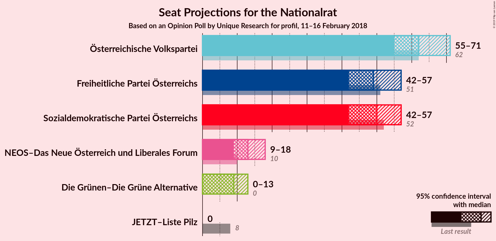
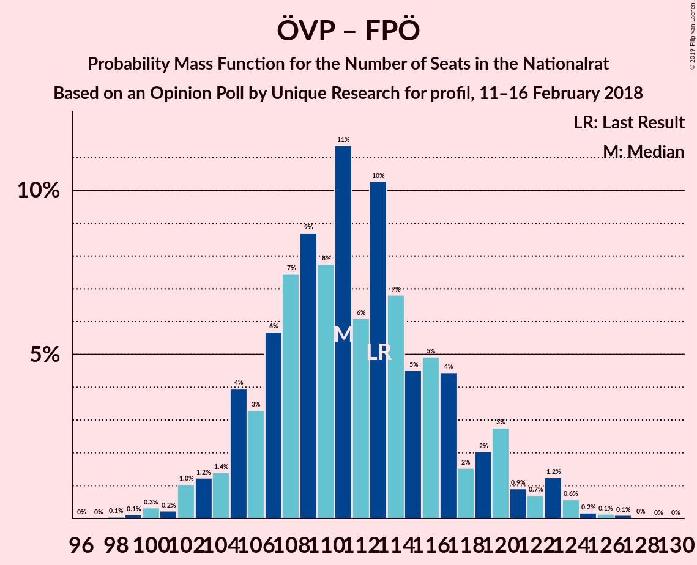
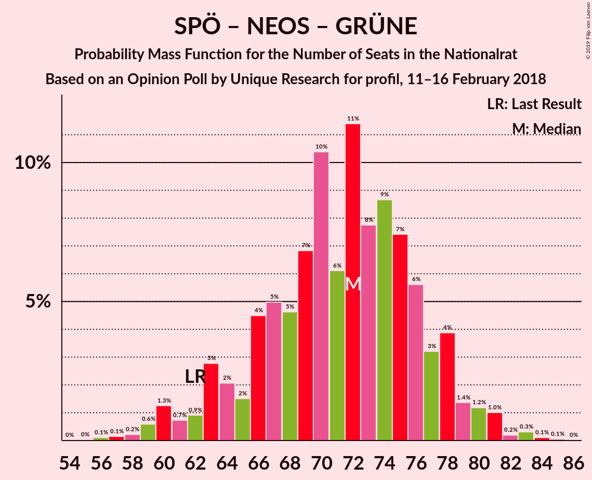
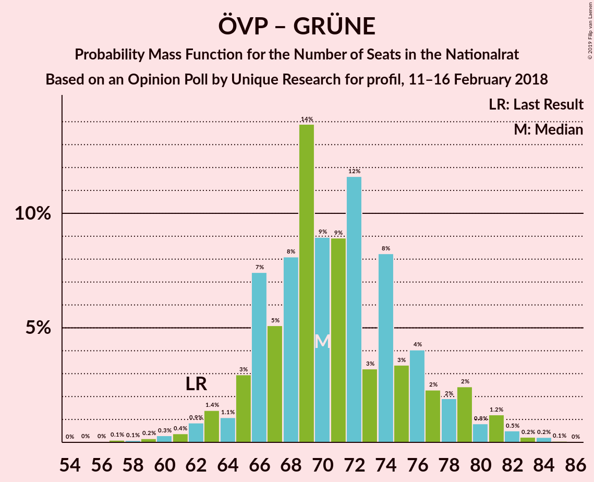

# Opinion Poll by Unique Research for profil, 11–16 February 2018

<a href="#voting-intentions">Voting Intentions</a> | <a href="#seats">Seats</a> | <a href="#coalitions">Coalitions</a> | <a href="#technical-information">Technical Information</a>

## Voting Intentions

### Confidence Intervals

| Party | Last Result | Poll Result | 80% Confidence Interval | 90% Confidence Interval | 95% Confidence Interval | 99% Confidence Interval |
|:-----:|:-----------:|:-----------:|:-----------------------:|:-----------------------:|:-----------------------:|:-----------------------:|
| Österreichische Volkspartei | 31.5% | 33.0% | 30.4–35.8% |29.6–36.6% |29.0–37.3% |27.8–38.6% |
| Sozialdemokratische Partei Österreichs | 26.9% | 26.0% | 23.6–28.6% |22.9–29.4% |22.3–30.0% |21.2–31.3% |
| Freiheitliche Partei Österreichs | 26.0% | 26.0% | 23.6–28.6% |22.9–29.4% |22.3–30.0% |21.2–31.3% |
| NEOS–Das Neue Österreich und Liberales Forum | 5.3% | 7.0% | 5.7–8.7% |5.4–9.2% |5.1–9.6% |4.5–10.5% |
| Die Grünen–Die Grüne Alternative | 3.8% | 5.0% | 3.9–6.5% |3.7–6.9% |3.4–7.3% |3.0–8.1% |
| JETZT–Liste Pilz | 4.4% | 2.0% | 1.4–3.1% |1.2–3.4% |1.1–3.6% |0.9–4.2% |

*Note:* The poll result column reflects the actual value used in the calculations. Published results may vary slightly, and in addition be rounded to fewer digits.

## Seats

### Confidence Intervals

| Party | Last Result | Median | 80% Confidence Interval | 90% Confidence Interval | 95% Confidence Interval | 99% Confidence Interval |
|:-----:|:-----------:|:------:|:-----------------------:|:-----------------------:|:-----------------------:|:-----------------------:|
| <a href="#österreichische-volkspartei">Österreichische Volkspartei</a> | 62 | 58 | 58 |58–59 |58–63 |58–63 |
| <a href="#sozialdemokratische-partei-österreichs">Sozialdemokratische Partei Österreichs</a> | 52 | 51 | 51 |46–51 |46–51 |46–59 |
| <a href="#freiheitliche-partei-österreichs">Freiheitliche Partei Österreichs</a> | 51 | 51 | 51 |50–51 |45–51 |42–51 |
| <a href="#neos–das-neue-österreich-und-liberales-forum">NEOS–Das Neue Österreich und Liberales Forum</a> | 10 | 13 | 13 |13–15 |13–16 |13–18 |
| <a href="#die-grünen–die-grüne-alternative">Die Grünen–Die Grüne Alternative</a> | 0 | 10 | 10 |8–10 |8–10 |8–12 |
| <a href="#jetzt–liste-pilz">JETZT–Liste Pilz</a> | 8 | 0 | 0 |0 |0 |0–8 |

### Österreichische Volkspartei

*For a full overview of the results for this party, see the [Österreichische Volkspartei](party-österreichischevolkspartei.html) page.*

| Number of Seats | Probability | Accumulated | Special Marks |
|:---------------:|:-----------:|:-----------:|:-------------:|
| 56 | 0% | 100% |  |
| 57 | 0% | 99.9% |  |
| 58 | 93% | 99.9% | Median |
| 59 | 3% | 7% |  |
| 60 | 0% | 5% |  |
| 61 | 0.1% | 5% |  |
| 62 | 2% | 5% | Last Result |
| 63 | 3% | 3% |  |
| 64 | 0% | 0.3% |  |
| 65 | 0% | 0.3% |  |
| 66 | 0% | 0.3% |  |
| 67 | 0% | 0.3% |  |
| 68 | 0% | 0.3% |  |
| 69 | 0% | 0.3% |  |
| 70 | 0% | 0.3% |  |
| 71 | 0% | 0.3% |  |
| 72 | 0% | 0.3% |  |
| 73 | 0.2% | 0.3% |  |
| 74 | 0.1% | 0.1% |  |
| 75 | 0% | 0% |  |

### Sozialdemokratische Partei Österreichs

*For a full overview of the results for this party, see the [Sozialdemokratische Partei Österreichs](party-sozialdemokratischeparteiösterreichs.html) page.*

| Number of Seats | Probability | Accumulated | Special Marks |
|:---------------:|:-----------:|:-----------:|:-------------:|
| 41 | 0.1% | 100% |  |
| 42 | 0.2% | 99.9% |  |
| 43 | 0% | 99.7% |  |
| 44 | 0% | 99.7% |  |
| 45 | 0% | 99.7% |  |
| 46 | 5% | 99.7% |  |
| 47 | 1.1% | 95% |  |
| 48 | 0% | 94% |  |
| 49 | 0% | 94% |  |
| 50 | 0% | 94% |  |
| 51 | 93% | 94% | Median |
| 52 | 0% | 1.0% | Last Result |
| 53 | 0% | 1.0% |  |
| 54 | 0% | 1.0% |  |
| 55 | 0% | 1.0% |  |
| 56 | 0% | 0.9% |  |
| 57 | 0% | 0.9% |  |
| 58 | 0% | 0.9% |  |
| 59 | 0.8% | 0.9% |  |
| 60 | 0.1% | 0.1% |  |
| 61 | 0% | 0% |  |

### Freiheitliche Partei Österreichs

*For a full overview of the results for this party, see the [Freiheitliche Partei Österreichs](party-freiheitlicheparteiösterreichs.html) page.*

| Number of Seats | Probability | Accumulated | Special Marks |
|:---------------:|:-----------:|:-----------:|:-------------:|
| 38 | 0.1% | 100% |  |
| 39 | 0% | 99.9% |  |
| 40 | 0% | 99.9% |  |
| 41 | 0% | 99.9% |  |
| 42 | 0.9% | 99.9% |  |
| 43 | 0% | 99.0% |  |
| 44 | 0% | 99.0% |  |
| 45 | 2% | 99.0% |  |
| 46 | 0% | 97% |  |
| 47 | 0% | 97% |  |
| 48 | 2% | 97% |  |
| 49 | 0% | 95% |  |
| 50 | 3% | 95% |  |
| 51 | 93% | 93% | Last Result, Median |
| 52 | 0% | 0.1% |  |
| 53 | 0% | 0.1% |  |
| 54 | 0% | 0.1% |  |
| 55 | 0.1% | 0.1% |  |
| 56 | 0% | 0% |  |

### NEOS–Das Neue Österreich und Liberales Forum

*For a full overview of the results for this party, see the [NEOS–Das Neue Österreich und Liberales Forum](party-neos–dasneueösterreichundliberalesforum.html) page.*

| Number of Seats | Probability | Accumulated | Special Marks |
|:---------------:|:-----------:|:-----------:|:-------------:|
| 9 | 0.2% | 100% |  |
| 10 | 0.1% | 99.8% | Last Result |
| 11 | 0.1% | 99.7% |  |
| 12 | 0.1% | 99.6% |  |
| 13 | 94% | 99.5% | Median |
| 14 | 0.7% | 6% |  |
| 15 | 0.9% | 5% |  |
| 16 | 3% | 4% |  |
| 17 | 0% | 2% |  |
| 18 | 2% | 2% |  |
| 19 | 0% | 0% |  |

### Die Grünen–Die Grüne Alternative

*For a full overview of the results for this party, see the [Die Grünen–Die Grüne Alternative](party-diegrünen–diegrünealternative.html) page.*

| Number of Seats | Probability | Accumulated | Special Marks |
|:---------------:|:-----------:|:-----------:|:-------------:|
| 0 | 0% | 100% | Last Result |
| 1 | 0% | 100% |  |
| 2 | 0% | 100% |  |
| 3 | 0% | 100% |  |
| 4 | 0% | 100% |  |
| 5 | 0% | 100% |  |
| 6 | 0% | 100% |  |
| 7 | 0% | 100% |  |
| 8 | 5% | 100% |  |
| 9 | 0% | 95% |  |
| 10 | 93% | 95% | Median |
| 11 | 0.2% | 2% |  |
| 12 | 2% | 2% |  |
| 13 | 0% | 0.2% |  |
| 14 | 0% | 0.2% |  |
| 15 | 0.1% | 0.1% |  |
| 16 | 0% | 0% |  |

### JETZT–Liste Pilz

*For a full overview of the results for this party, see the [JETZT–Liste Pilz](party-jetzt–listepilz.html) page.*

| Number of Seats | Probability | Accumulated | Special Marks |
|:---------------:|:-----------:|:-----------:|:-------------:|
| 0 | 98% | 100% | Median |
| 1 | 0% | 2% |  |
| 2 | 0% | 2% |  |
| 3 | 0% | 2% |  |
| 4 | 0% | 2% |  |
| 5 | 0% | 2% |  |
| 6 | 0% | 2% |  |
| 7 | 0% | 2% |  |
| 8 | 2% | 2% | Last Result |
| 9 | 0% | 0% |  |

## Coalitions

### Confidence Intervals

| Coalition | Last Result | Median | Majority? | 80% Confidence Interval | 90% Confidence Interval | 95% Confidence Interval | 99% Confidence Interval |
|:---------:|:-----------:|:------:|:---------:|:-----------------------:|:-----------------------:|:-----------------------:|:-----------------------:|
| Österreichische Volkspartei – Freiheitliche Partei Österreichs | 113 | 109 | 100% | 109 | 109 | 107–113 | 101–113 |
| Österreichische Volkspartei – Sozialdemokratische Partei Österreichs | 114 | 109 | 100% | 109 | 109 | 108–109 | 105–118 |
| Freiheitliche Partei Österreichs – Sozialdemokratische Partei Österreichs | 103 | 102 | 98% | 102 | 96–102 | 94–102 | 91–102 |
| Österreichische Volkspartei – NEOS–Das Neue Österreich und Liberales Forum – Die Grünen–Die Grüne Alternative | 72 | 81 | 2% | 81 | 81–82 | 81–87 | 80–92 |
| Österreichische Volkspartei – NEOS–Das Neue Österreich und Liberales Forum | 72 | 71 | 0% | 71 | 71–74 | 71–79 | 71–80 |
| Sozialdemokratische Partei Österreichs – NEOS–Das Neue Österreich und Liberales Forum – Die Grünen–Die Grüne Alternative | 62 | 74 | 0% | 74 | 74 | 70–76 | 68–82 |
| Österreichische Volkspartei – Die Grünen–Die Grüne Alternative | 62 | 68 | 0% | 68 | 68 | 67–71 | 67–74 |
| Österreichische Volkspartei | 62 | 58 | 0% | 58 | 58–59 | 58–63 | 58–63 |
| Sozialdemokratische Partei Österreichs | 52 | 51 | 0% | 51 | 46–51 | 46–51 | 46–59 |

### Österreichische Volkspartei – Freiheitliche Partei Österreichs

| Number of Seats | Probability | Accumulated | Special Marks |
|:---------------:|:-----------:|:-----------:|:-------------:|
| 100 | 0.1% | 100% |  |
| 101 | 0.8% | 99.9% |  |
| 102 | 0% | 99.1% |  |
| 103 | 0% | 99.1% |  |
| 104 | 0% | 99.0% |  |
| 105 | 0% | 99.0% |  |
| 106 | 0% | 99.0% |  |
| 107 | 3% | 99.0% |  |
| 108 | 0% | 96% |  |
| 109 | 93% | 96% | Median |
| 110 | 0.1% | 3% |  |
| 111 | 0% | 3% |  |
| 112 | 0.1% | 3% |  |
| 113 | 3% | 3% | Last Result |
| 114 | 0% | 0.4% |  |
| 115 | 0% | 0.4% |  |
| 116 | 0.1% | 0.3% |  |
| 117 | 0% | 0.2% |  |
| 118 | 0% | 0.2% |  |
| 119 | 0% | 0.2% |  |
| 120 | 0% | 0.2% |  |
| 121 | 0.2% | 0.2% |  |
| 122 | 0% | 0% |  |

### Österreichische Volkspartei – Sozialdemokratische Partei Österreichs

| Number of Seats | Probability | Accumulated | Special Marks |
|:---------------:|:-----------:|:-----------:|:-------------:|
| 102 | 0.1% | 100% |  |
| 103 | 0% | 99.9% |  |
| 104 | 0% | 99.9% |  |
| 105 | 0.7% | 99.9% |  |
| 106 | 1.0% | 99.2% |  |
| 107 | 0% | 98% |  |
| 108 | 2% | 98% |  |
| 109 | 95% | 96% | Median |
| 110 | 0.1% | 1.4% |  |
| 111 | 0% | 1.3% |  |
| 112 | 0% | 1.3% |  |
| 113 | 0% | 1.3% |  |
| 114 | 0% | 1.2% | Last Result |
| 115 | 0.2% | 1.2% |  |
| 116 | 0% | 1.0% |  |
| 117 | 0% | 1.0% |  |
| 118 | 0.9% | 1.0% |  |
| 119 | 0% | 0.1% |  |
| 120 | 0% | 0.1% |  |
| 121 | 0.1% | 0.1% |  |
| 122 | 0% | 0% |  |

### Freiheitliche Partei Österreichs – Sozialdemokratische Partei Österreichs

| Number of Seats | Probability | Accumulated | Special Marks |
|:---------------:|:-----------:|:-----------:|:-------------:|
| 85 | 0.1% | 100% |  |
| 86 | 0% | 99.9% |  |
| 87 | 0% | 99.9% |  |
| 88 | 0% | 99.9% |  |
| 89 | 0% | 99.9% |  |
| 90 | 0.2% | 99.9% |  |
| 91 | 2% | 99.7% |  |
| 92 | 0% | 98% | Majority |
| 93 | 0% | 98% |  |
| 94 | 0.7% | 98% |  |
| 95 | 1.0% | 97% |  |
| 96 | 3% | 96% |  |
| 97 | 0% | 94% |  |
| 98 | 0% | 94% |  |
| 99 | 0% | 94% |  |
| 100 | 0% | 94% |  |
| 101 | 0.8% | 94% |  |
| 102 | 93% | 93% | Median |
| 103 | 0% | 0% | Last Result |

### Österreichische Volkspartei – NEOS–Das Neue Österreich und Liberales Forum – Die Grünen–Die Grüne Alternative

| Number of Seats | Probability | Accumulated | Special Marks |
|:---------------:|:-----------:|:-----------:|:-------------:|
| 72 | 0% | 100% | Last Result |
| 73 | 0% | 100% |  |
| 74 | 0% | 100% |  |
| 75 | 0% | 100% |  |
| 76 | 0% | 100% |  |
| 77 | 0% | 100% |  |
| 78 | 0% | 100% |  |
| 79 | 0% | 100% |  |
| 80 | 1.0% | 100% |  |
| 81 | 93% | 99.0% | Median |
| 82 | 0.8% | 6% |  |
| 83 | 0% | 5% |  |
| 84 | 0% | 5% |  |
| 85 | 0% | 5% |  |
| 86 | 0% | 5% |  |
| 87 | 3% | 5% |  |
| 88 | 0% | 2% |  |
| 89 | 0% | 2% |  |
| 90 | 0% | 2% |  |
| 91 | 0% | 2% |  |
| 92 | 2% | 2% | Majority |
| 93 | 0.2% | 0.3% |  |
| 94 | 0% | 0.1% |  |
| 95 | 0% | 0.1% |  |
| 96 | 0% | 0.1% |  |
| 97 | 0% | 0.1% |  |
| 98 | 0.1% | 0.1% |  |
| 99 | 0% | 0% |  |

### Österreichische Volkspartei – NEOS–Das Neue Österreich und Liberales Forum

| Number of Seats | Probability | Accumulated | Special Marks |
|:---------------:|:-----------:|:-----------:|:-------------:|
| 66 | 0% | 100% |  |
| 67 | 0% | 99.9% |  |
| 68 | 0% | 99.9% |  |
| 69 | 0% | 99.9% |  |
| 70 | 0% | 99.9% |  |
| 71 | 93% | 99.9% | Median |
| 72 | 1.0% | 7% | Last Result |
| 73 | 0.8% | 6% |  |
| 74 | 0.8% | 5% |  |
| 75 | 0% | 5% |  |
| 76 | 0% | 5% |  |
| 77 | 0% | 5% |  |
| 78 | 0% | 5% |  |
| 79 | 3% | 5% |  |
| 80 | 2% | 2% |  |
| 81 | 0% | 0.3% |  |
| 82 | 0.2% | 0.3% |  |
| 83 | 0% | 0.1% |  |
| 84 | 0% | 0.1% |  |
| 85 | 0% | 0.1% |  |
| 86 | 0% | 0.1% |  |
| 87 | 0% | 0.1% |  |
| 88 | 0% | 0.1% |  |
| 89 | 0% | 0.1% |  |
| 90 | 0.1% | 0.1% |  |
| 91 | 0% | 0% |  |

### Sozialdemokratische Partei Österreichs – NEOS–Das Neue Österreich und Liberales Forum – Die Grünen–Die Grüne Alternative

| Number of Seats | Probability | Accumulated | Special Marks |
|:---------------:|:-----------:|:-----------:|:-------------:|
| 62 | 0.2% | 100% | Last Result |
| 63 | 0% | 99.8% |  |
| 64 | 0% | 99.8% |  |
| 65 | 0% | 99.8% |  |
| 66 | 0% | 99.8% |  |
| 67 | 0.1% | 99.8% |  |
| 68 | 2% | 99.7% |  |
| 69 | 0% | 98% |  |
| 70 | 3% | 98% |  |
| 71 | 0.1% | 95% |  |
| 72 | 0% | 95% |  |
| 73 | 0.1% | 95% |  |
| 74 | 93% | 95% | Median |
| 75 | 0% | 3% |  |
| 76 | 2% | 3% |  |
| 77 | 0% | 1.0% |  |
| 78 | 0% | 1.0% |  |
| 79 | 0% | 1.0% |  |
| 80 | 0% | 1.0% |  |
| 81 | 0% | 0.9% |  |
| 82 | 0.8% | 0.9% |  |
| 83 | 0.1% | 0.1% |  |
| 84 | 0% | 0% |  |

### Österreichische Volkspartei – Die Grünen–Die Grüne Alternative

| Number of Seats | Probability | Accumulated | Special Marks |
|:---------------:|:-----------:|:-----------:|:-------------:|
| 62 | 0% | 100% | Last Result |
| 63 | 0% | 100% |  |
| 64 | 0% | 100% |  |
| 65 | 0% | 100% |  |
| 66 | 0.1% | 100% |  |
| 67 | 2% | 99.8% |  |
| 68 | 93% | 97% | Median |
| 69 | 0.1% | 5% |  |
| 70 | 0% | 5% |  |
| 71 | 3% | 5% |  |
| 72 | 0% | 2% |  |
| 73 | 0% | 2% |  |
| 74 | 2% | 2% |  |
| 75 | 0% | 0.4% |  |
| 76 | 0.1% | 0.4% |  |
| 77 | 0% | 0.3% |  |
| 78 | 0% | 0.3% |  |
| 79 | 0% | 0.3% |  |
| 80 | 0% | 0.3% |  |
| 81 | 0% | 0.3% |  |
| 82 | 0.1% | 0.3% |  |
| 83 | 0% | 0.2% |  |
| 84 | 0.2% | 0.2% |  |
| 85 | 0% | 0% |  |

### Österreichische Volkspartei

| Number of Seats | Probability | Accumulated | Special Marks |
|:---------------:|:-----------:|:-----------:|:-------------:|
| 56 | 0% | 100% |  |
| 57 | 0% | 99.9% |  |
| 58 | 93% | 99.9% | Median |
| 59 | 3% | 7% |  |
| 60 | 0% | 5% |  |
| 61 | 0.1% | 5% |  |
| 62 | 2% | 5% | Last Result |
| 63 | 3% | 3% |  |
| 64 | 0% | 0.3% |  |
| 65 | 0% | 0.3% |  |
| 66 | 0% | 0.3% |  |
| 67 | 0% | 0.3% |  |
| 68 | 0% | 0.3% |  |
| 69 | 0% | 0.3% |  |
| 70 | 0% | 0.3% |  |
| 71 | 0% | 0.3% |  |
| 72 | 0% | 0.3% |  |
| 73 | 0.2% | 0.3% |  |
| 74 | 0.1% | 0.1% |  |
| 75 | 0% | 0% |  |

### Sozialdemokratische Partei Österreichs

| Number of Seats | Probability | Accumulated | Special Marks |
|:---------------:|:-----------:|:-----------:|:-------------:|
| 41 | 0.1% | 100% |  |
| 42 | 0.2% | 99.9% |  |
| 43 | 0% | 99.7% |  |
| 44 | 0% | 99.7% |  |
| 45 | 0% | 99.7% |  |
| 46 | 5% | 99.7% |  |
| 47 | 1.1% | 95% |  |
| 48 | 0% | 94% |  |
| 49 | 0% | 94% |  |
| 50 | 0% | 94% |  |
| 51 | 93% | 94% | Median |
| 52 | 0% | 1.0% | Last Result |
| 53 | 0% | 1.0% |  |
| 54 | 0% | 1.0% |  |
| 55 | 0% | 1.0% |  |
| 56 | 0% | 0.9% |  |
| 57 | 0% | 0.9% |  |
| 58 | 0% | 0.9% |  |
| 59 | 0.8% | 0.9% |  |
| 60 | 0.1% | 0.1% |  |
| 61 | 0% | 0% |  |

## Technical Information

### Opinion Poll

+ **Polling firm:** Unique Research
+ **Commissioner(s):** profil
+ **Fieldwork period:** 11–16 February 2018

### Calculations

+ **Sample size:** 500
+ **Simulations done:** 1,024
+ **Error estimate:** 2.68%

