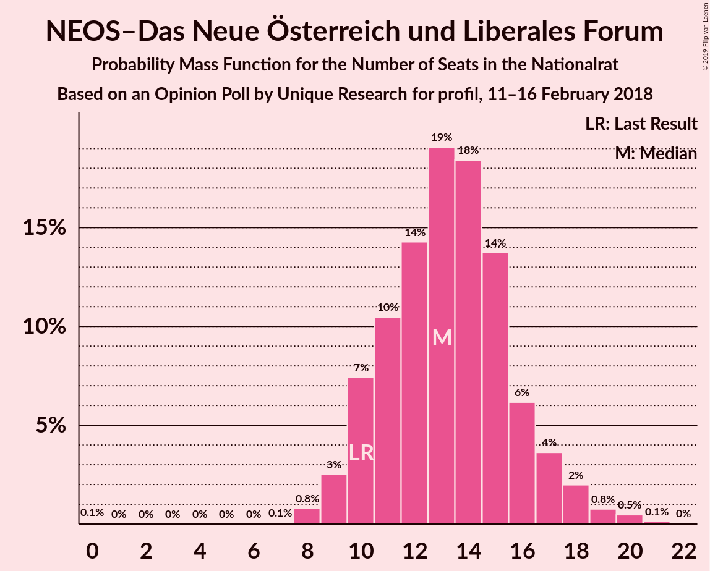
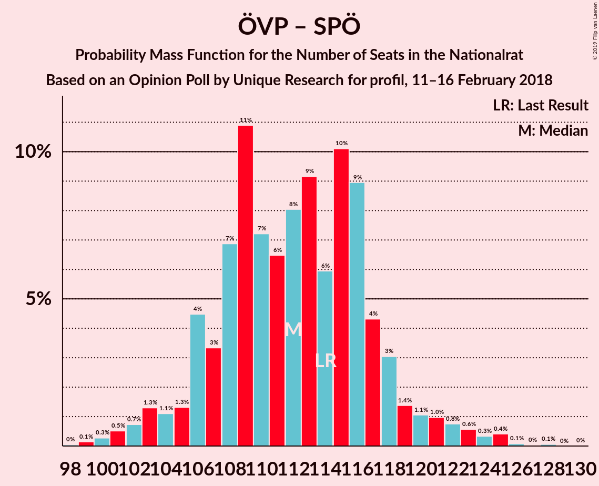
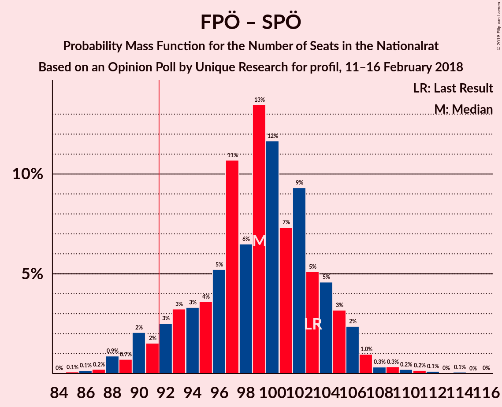
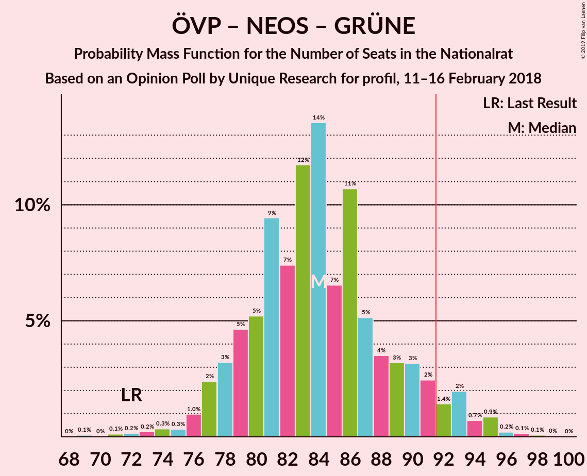
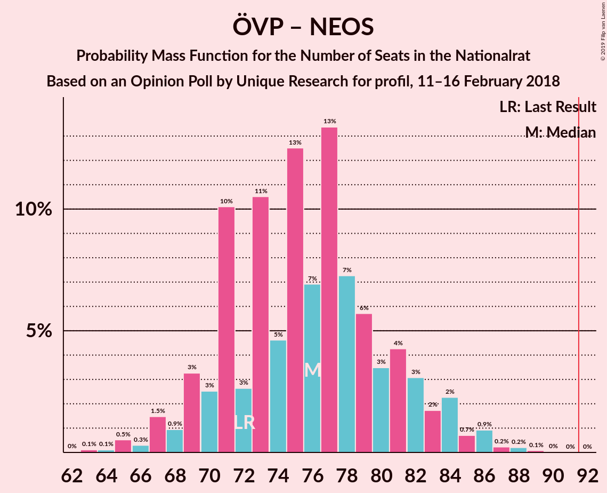

# Opinion Poll by Unique Research for profil, 11–16 February 2018

<a href="#voting-intentions">Voting Intentions</a> | <a href="#seats">Seats</a> | <a href="#coalitions">Coalitions</a> | <a href="#technical-information">Technical Information</a>

## Voting Intentions

### Confidence Intervals

| Party | Last Result | Poll Result | 80% Confidence Interval | 90% Confidence Interval | 95% Confidence Interval | 99% Confidence Interval |
|:-----:|:-----------:|:-----------:|:-----------------------:|:-----------------------:|:-----------------------:|:-----------------------:|
| Österreichische Volkspartei | 31.5% | 33.0% | 30.4–35.8% |29.6–36.6% |29.0–37.3% |27.8–38.6% |
| Sozialdemokratische Partei Österreichs | 26.9% | 26.0% | 23.6–28.6% |22.9–29.4% |22.3–30.0% |21.2–31.3% |
| Freiheitliche Partei Österreichs | 26.0% | 26.0% | 23.6–28.6% |22.9–29.4% |22.3–30.0% |21.2–31.3% |
| NEOS–Das Neue Österreich und Liberales Forum | 5.3% | 7.0% | 5.7–8.7% |5.4–9.2% |5.1–9.6% |4.5–10.5% |
| Die Grünen–Die Grüne Alternative | 3.8% | 5.0% | 3.9–6.5% |3.7–6.9% |3.4–7.3% |3.0–8.1% |
| JETZT–Liste Pilz | 4.4% | 2.0% | 1.4–3.1% |1.2–3.4% |1.1–3.6% |0.9–4.2% |

*Note:* The poll result column reflects the actual value used in the calculations. Published results may vary slightly, and in addition be rounded to fewer digits.

## Seats

### Confidence Intervals

| Party | Last Result | Median | 80% Confidence Interval | 90% Confidence Interval | 95% Confidence Interval | 99% Confidence Interval |
|:-----:|:-----------:|:------:|:-----------------------:|:-----------------------:|:-----------------------:|:-----------------------:|
| <a href="#österreichische-volkspartei">Österreichische Volkspartei</a> | 62 | 62 | 57–68 |56–69 |55–71 |53–73 |
| <a href="#sozialdemokratische-partei-österreichs">Sozialdemokratische Partei Österreichs</a> | 52 | 50 | 45–53 |43–55 |42–57 |40–60 |
| <a href="#freiheitliche-partei-österreichs">Freiheitliche Partei Österreichs</a> | 51 | 49 | 45–55 |44–56 |42–57 |40–60 |
| <a href="#neos–das-neue-österreich-und-liberales-forum">NEOS–Das Neue Österreich und Liberales Forum</a> | 10 | 13 | 10–16 |10–17 |9–18 |8–20 |
| <a href="#die-grünen–die-grüne-alternative">Die Grünen–Die Grüne Alternative</a> | 0 | 9 | 0–12 |0–12 |0–13 |0–15 |
| <a href="#jetzt–liste-pilz">JETZT–Liste Pilz</a> | 8 | 0 | 0 |0 |0 |0–7 |

### Österreichische Volkspartei

*For a full overview of the results for this party, see the [Österreichische Volkspartei](party-österreichischevolkspartei.html) page.*

| Number of Seats | Probability | Accumulated | Special Marks |
|:---------------:|:-----------:|:-----------:|:-------------:|
| 50 | 0% | 100% |  |
| 51 | 0.1% | 99.9% |  |
| 52 | 0.2% | 99.8% |  |
| 53 | 0.5% | 99.6% |  |
| 54 | 0.7% | 99.1% |  |
| 55 | 2% | 98% |  |
| 56 | 3% | 96% |  |
| 57 | 4% | 93% |  |
| 58 | 7% | 90% |  |
| 59 | 6% | 83% |  |
| 60 | 10% | 77% |  |
| 61 | 10% | 67% |  |
| 62 | 10% | 57% | Last Result, Median |
| 63 | 7% | 46% |  |
| 64 | 8% | 39% |  |
| 65 | 10% | 31% |  |
| 66 | 5% | 21% |  |
| 67 | 5% | 16% |  |
| 68 | 4% | 11% |  |
| 69 | 2% | 7% |  |
| 70 | 2% | 5% |  |
| 71 | 1.3% | 3% |  |
| 72 | 0.8% | 2% |  |
| 73 | 0.3% | 0.8% |  |
| 74 | 0.3% | 0.5% |  |
| 75 | 0.1% | 0.2% |  |
| 76 | 0.1% | 0.1% |  |
| 77 | 0% | 0.1% |  |
| 78 | 0% | 0% |  |

### Sozialdemokratische Partei Österreichs

*For a full overview of the results for this party, see the [Sozialdemokratische Partei Österreichs](party-sozialdemokratischeparteiösterreichs.html) page.*

| Number of Seats | Probability | Accumulated | Special Marks |
|:---------------:|:-----------:|:-----------:|:-------------:|
| 37 | 0% | 100% |  |
| 38 | 0.1% | 99.9% |  |
| 39 | 0.2% | 99.9% |  |
| 40 | 0.5% | 99.6% |  |
| 41 | 1.0% | 99.2% |  |
| 42 | 2% | 98% |  |
| 43 | 2% | 96% |  |
| 44 | 4% | 95% |  |
| 45 | 2% | 91% |  |
| 46 | 6% | 89% |  |
| 47 | 9% | 82% |  |
| 48 | 6% | 73% |  |
| 49 | 10% | 67% |  |
| 50 | 15% | 57% | Median |
| 51 | 16% | 42% |  |
| 52 | 6% | 26% | Last Result |
| 53 | 10% | 20% |  |
| 54 | 1.5% | 10% |  |
| 55 | 5% | 9% |  |
| 56 | 0.7% | 4% |  |
| 57 | 1.4% | 3% |  |
| 58 | 1.0% | 2% |  |
| 59 | 0.2% | 0.9% |  |
| 60 | 0.4% | 0.6% |  |
| 61 | 0.1% | 0.2% |  |
| 62 | 0.1% | 0.2% |  |
| 63 | 0% | 0.1% |  |
| 64 | 0% | 0% |  |

### Freiheitliche Partei Österreichs

*For a full overview of the results for this party, see the [Freiheitliche Partei Österreichs](party-freiheitlicheparteiösterreichs.html) page.*

| Number of Seats | Probability | Accumulated | Special Marks |
|:---------------:|:-----------:|:-----------:|:-------------:|
| 38 | 0.1% | 100% |  |
| 39 | 0.3% | 99.9% |  |
| 40 | 0.6% | 99.6% |  |
| 41 | 0.6% | 99.0% |  |
| 42 | 1.2% | 98% |  |
| 43 | 2% | 97% |  |
| 44 | 2% | 95% |  |
| 45 | 7% | 93% |  |
| 46 | 12% | 86% |  |
| 47 | 8% | 74% |  |
| 48 | 11% | 66% |  |
| 49 | 15% | 55% | Median |
| 50 | 3% | 40% |  |
| 51 | 11% | 37% | Last Result |
| 52 | 8% | 27% |  |
| 53 | 3% | 18% |  |
| 54 | 5% | 15% |  |
| 55 | 5% | 10% |  |
| 56 | 1.1% | 5% |  |
| 57 | 2% | 4% |  |
| 58 | 1.4% | 2% |  |
| 59 | 0.2% | 1.0% |  |
| 60 | 0.5% | 0.8% |  |
| 61 | 0.2% | 0.3% |  |
| 62 | 0% | 0.1% |  |
| 63 | 0% | 0% |  |

### NEOS–Das Neue Österreich und Liberales Forum

*For a full overview of the results for this party, see the [NEOS–Das Neue Österreich und Liberales Forum](party-neos–dasneueösterreichundliberalesforum.html) page.*

| Number of Seats | Probability | Accumulated | Special Marks |
|:---------------:|:-----------:|:-----------:|:-------------:|
| 0 | 0.1% | 100% |  |
| 1 | 0% | 99.9% |  |
| 2 | 0% | 99.9% |  |
| 3 | 0% | 99.9% |  |
| 4 | 0% | 99.9% |  |
| 5 | 0% | 99.9% |  |
| 6 | 0% | 99.9% |  |
| 7 | 0.1% | 99.9% |  |
| 8 | 0.8% | 99.9% |  |
| 9 | 3% | 99.1% |  |
| 10 | 7% | 97% | Last Result |
| 11 | 10% | 89% |  |
| 12 | 14% | 79% |  |
| 13 | 19% | 64% | Median |
| 14 | 18% | 45% |  |
| 15 | 14% | 27% |  |
| 16 | 6% | 13% |  |
| 17 | 4% | 7% |  |
| 18 | 2% | 3% |  |
| 19 | 0.8% | 1.4% |  |
| 20 | 0.5% | 0.6% |  |
| 21 | 0.1% | 0.2% |  |
| 22 | 0% | 0% |  |

### Die Grünen–Die Grüne Alternative

*For a full overview of the results for this party, see the [Die Grünen–Die Grüne Alternative](party-diegrünen–diegrünealternative.html) page.*

| Number of Seats | Probability | Accumulated | Special Marks |
|:---------------:|:-----------:|:-----------:|:-------------:|
| 0 | 12% | 100% | Last Result |
| 1 | 0% | 88% |  |
| 2 | 0% | 88% |  |
| 3 | 0% | 88% |  |
| 4 | 0% | 88% |  |
| 5 | 0% | 88% |  |
| 6 | 0% | 88% |  |
| 7 | 7% | 88% |  |
| 8 | 22% | 81% |  |
| 9 | 22% | 59% | Median |
| 10 | 15% | 37% |  |
| 11 | 10% | 22% |  |
| 12 | 7% | 12% |  |
| 13 | 3% | 5% |  |
| 14 | 0.8% | 2% |  |
| 15 | 0.5% | 0.8% |  |
| 16 | 0.2% | 0.3% |  |
| 17 | 0% | 0.1% |  |
| 18 | 0% | 0% |  |

### JETZT–Liste Pilz

*For a full overview of the results for this party, see the [JETZT–Liste Pilz](party-jetzt–listepilz.html) page.*

| Number of Seats | Probability | Accumulated | Special Marks |
|:---------------:|:-----------:|:-----------:|:-------------:|
| 0 | 99.2% | 100% | Median |
| 1 | 0% | 0.8% |  |
| 2 | 0% | 0.8% |  |
| 3 | 0% | 0.8% |  |
| 4 | 0% | 0.8% |  |
| 5 | 0% | 0.8% |  |
| 6 | 0% | 0.8% |  |
| 7 | 0.4% | 0.8% |  |
| 8 | 0.4% | 0.5% | Last Result |
| 9 | 0.1% | 0.1% |  |
| 10 | 0% | 0% |  |

## Coalitions

### Confidence Intervals

| Coalition | Last Result | Median | Majority? | 80% Confidence Interval | 90% Confidence Interval | 95% Confidence Interval | 99% Confidence Interval |
|:---------:|:-----------:|:------:|:---------:|:-----------------------:|:-----------------------:|:-----------------------:|:-----------------------:|
| Österreichische Volkspartei – Freiheitliche Partei Österreichs | 113 | 111 | 100% | 106–118 | 105–120 | 103–122 | 100–124 |
| Österreichische Volkspartei – Sozialdemokratische Partei Österreichs | 114 | 112 | 100% | 107–117 | 105–119 | 103–121 | 100–125 |
| Freiheitliche Partei Österreichs – Sozialdemokratische Partei Österreichs | 103 | 99 | 94% | 93–104 | 91–105 | 90–106 | 88–110 |
| Österreichische Volkspartei – NEOS–Das Neue Österreich und Liberales Forum – Die Grünen–Die Grüne Alternative | 72 | 84 | 5% | 79–90 | 78–92 | 77–93 | 73–95 |
| Österreichische Volkspartei – NEOS–Das Neue Österreich und Liberales Forum | 72 | 76 | 0% | 71–81 | 69–83 | 67–84 | 65–87 |
| Österreichische Volkspartei – Die Grünen–Die Grüne Alternative | 62 | 70 | 0% | 66–76 | 65–79 | 63–80 | 60–83 |
| Sozialdemokratische Partei Österreichs – NEOS–Das Neue Österreich und Liberales Forum – Die Grünen–Die Grüne Alternative | 62 | 72 | 0% | 65–77 | 63–78 | 61–80 | 58–83 |
| Österreichische Volkspartei | 62 | 62 | 0% | 57–68 | 56–69 | 55–71 | 53–73 |
| Sozialdemokratische Partei Österreichs | 52 | 50 | 0% | 45–53 | 43–55 | 42–57 | 40–60 |

### Österreichische Volkspartei – Freiheitliche Partei Österreichs

| Number of Seats | Probability | Accumulated | Special Marks |
|:---------------:|:-----------:|:-----------:|:-------------:|
| 98 | 0.1% | 100% |  |
| 99 | 0.1% | 99.9% |  |
| 100 | 0.3% | 99.8% |  |
| 101 | 0.2% | 99.4% |  |
| 102 | 1.0% | 99.2% |  |
| 103 | 1.2% | 98% |  |
| 104 | 1.4% | 97% |  |
| 105 | 4% | 96% |  |
| 106 | 3% | 92% |  |
| 107 | 6% | 88% |  |
| 108 | 7% | 83% |  |
| 109 | 9% | 75% |  |
| 110 | 8% | 66% |  |
| 111 | 11% | 59% | Median |
| 112 | 6% | 47% |  |
| 113 | 10% | 41% | Last Result |
| 114 | 7% | 31% |  |
| 115 | 5% | 24% |  |
| 116 | 5% | 20% |  |
| 117 | 4% | 15% |  |
| 118 | 2% | 10% |  |
| 119 | 2% | 9% |  |
| 120 | 3% | 7% |  |
| 121 | 0.9% | 4% |  |
| 122 | 0.7% | 3% |  |
| 123 | 1.2% | 2% |  |
| 124 | 0.6% | 1.0% |  |
| 125 | 0.2% | 0.5% |  |
| 126 | 0.1% | 0.3% |  |
| 127 | 0.1% | 0.2% |  |
| 128 | 0% | 0.1% |  |
| 129 | 0% | 0% |  |

### Österreichische Volkspartei – Sozialdemokratische Partei Österreichs

| Number of Seats | Probability | Accumulated | Special Marks |
|:---------------:|:-----------:|:-----------:|:-------------:|
| 98 | 0% | 100% |  |
| 99 | 0.1% | 99.9% |  |
| 100 | 0.3% | 99.8% |  |
| 101 | 0.5% | 99.5% |  |
| 102 | 0.7% | 99.0% |  |
| 103 | 1.3% | 98% |  |
| 104 | 1.1% | 97% |  |
| 105 | 1.3% | 96% |  |
| 106 | 4% | 95% |  |
| 107 | 3% | 90% |  |
| 108 | 7% | 87% |  |
| 109 | 11% | 80% |  |
| 110 | 7% | 69% |  |
| 111 | 6% | 62% |  |
| 112 | 8% | 55% | Median |
| 113 | 9% | 47% |  |
| 114 | 6% | 38% | Last Result |
| 115 | 10% | 32% |  |
| 116 | 9% | 22% |  |
| 117 | 4% | 13% |  |
| 118 | 3% | 9% |  |
| 119 | 1.4% | 6% |  |
| 120 | 1.1% | 4% |  |
| 121 | 1.0% | 3% |  |
| 122 | 0.8% | 2% |  |
| 123 | 0.6% | 2% |  |
| 124 | 0.3% | 0.9% |  |
| 125 | 0.4% | 0.6% |  |
| 126 | 0.1% | 0.2% |  |
| 127 | 0% | 0.1% |  |
| 128 | 0.1% | 0.1% |  |
| 129 | 0% | 0% |  |

### Freiheitliche Partei Österreichs – Sozialdemokratische Partei Österreichs

| Number of Seats | Probability | Accumulated | Special Marks |
|:---------------:|:-----------:|:-----------:|:-------------:|
| 84 | 0% | 100% |  |
| 85 | 0.1% | 99.9% |  |
| 86 | 0.1% | 99.9% |  |
| 87 | 0.2% | 99.7% |  |
| 88 | 0.9% | 99.5% |  |
| 89 | 0.7% | 98.6% |  |
| 90 | 2% | 98% |  |
| 91 | 2% | 96% |  |
| 92 | 3% | 94% | Majority |
| 93 | 3% | 92% |  |
| 94 | 3% | 89% |  |
| 95 | 4% | 85% |  |
| 96 | 5% | 82% |  |
| 97 | 11% | 76% |  |
| 98 | 6% | 66% |  |
| 99 | 13% | 59% | Median |
| 100 | 12% | 46% |  |
| 101 | 7% | 34% |  |
| 102 | 9% | 27% |  |
| 103 | 5% | 17% | Last Result |
| 104 | 5% | 12% |  |
| 105 | 3% | 8% |  |
| 106 | 2% | 5% |  |
| 107 | 1.0% | 2% |  |
| 108 | 0.3% | 1.3% |  |
| 109 | 0.3% | 1.0% |  |
| 110 | 0.2% | 0.6% |  |
| 111 | 0.2% | 0.4% |  |
| 112 | 0.1% | 0.3% |  |
| 113 | 0% | 0.2% |  |
| 114 | 0.1% | 0.1% |  |
| 115 | 0% | 0.1% |  |
| 116 | 0% | 0% |  |

### Österreichische Volkspartei – NEOS–Das Neue Österreich und Liberales Forum – Die Grünen–Die Grüne Alternative

| Number of Seats | Probability | Accumulated | Special Marks |
|:---------------:|:-----------:|:-----------:|:-------------:|
| 68 | 0% | 100% |  |
| 69 | 0.1% | 99.9% |  |
| 70 | 0% | 99.9% |  |
| 71 | 0.1% | 99.8% |  |
| 72 | 0.2% | 99.7% | Last Result |
| 73 | 0.2% | 99.6% |  |
| 74 | 0.3% | 99.3% |  |
| 75 | 0.3% | 99.0% |  |
| 76 | 1.0% | 98.7% |  |
| 77 | 2% | 98% |  |
| 78 | 3% | 95% |  |
| 79 | 5% | 92% |  |
| 80 | 5% | 87% |  |
| 81 | 9% | 82% |  |
| 82 | 7% | 73% |  |
| 83 | 12% | 65% |  |
| 84 | 14% | 54% | Median |
| 85 | 7% | 40% |  |
| 86 | 11% | 34% |  |
| 87 | 5% | 23% |  |
| 88 | 4% | 18% |  |
| 89 | 3% | 14% |  |
| 90 | 3% | 11% |  |
| 91 | 2% | 8% |  |
| 92 | 1.4% | 5% | Majority |
| 93 | 2% | 4% |  |
| 94 | 0.7% | 2% |  |
| 95 | 0.9% | 1.3% |  |
| 96 | 0.2% | 0.5% |  |
| 97 | 0.1% | 0.3% |  |
| 98 | 0.1% | 0.1% |  |
| 99 | 0% | 0.1% |  |
| 100 | 0% | 0% |  |

### Österreichische Volkspartei – NEOS–Das Neue Österreich und Liberales Forum

| Number of Seats | Probability | Accumulated | Special Marks |
|:---------------:|:-----------:|:-----------:|:-------------:|
| 62 | 0% | 100% |  |
| 63 | 0.1% | 99.9% |  |
| 64 | 0.1% | 99.8% |  |
| 65 | 0.5% | 99.7% |  |
| 66 | 0.3% | 99.2% |  |
| 67 | 1.5% | 98.9% |  |
| 68 | 0.9% | 97% |  |
| 69 | 3% | 96% |  |
| 70 | 3% | 93% |  |
| 71 | 10% | 91% |  |
| 72 | 3% | 81% | Last Result |
| 73 | 11% | 78% |  |
| 74 | 5% | 67% |  |
| 75 | 13% | 63% | Median |
| 76 | 7% | 50% |  |
| 77 | 13% | 43% |  |
| 78 | 7% | 30% |  |
| 79 | 6% | 23% |  |
| 80 | 3% | 17% |  |
| 81 | 4% | 14% |  |
| 82 | 3% | 9% |  |
| 83 | 2% | 6% |  |
| 84 | 2% | 4% |  |
| 85 | 0.7% | 2% |  |
| 86 | 0.9% | 2% |  |
| 87 | 0.2% | 0.6% |  |
| 88 | 0.2% | 0.4% |  |
| 89 | 0.1% | 0.2% |  |
| 90 | 0% | 0.1% |  |
| 91 | 0% | 0% |  |

### Österreichische Volkspartei – Die Grünen–Die Grüne Alternative

| Number of Seats | Probability | Accumulated | Special Marks |
|:---------------:|:-----------:|:-----------:|:-------------:|
| 55 | 0% | 100% |  |
| 56 | 0% | 99.9% |  |
| 57 | 0.1% | 99.9% |  |
| 58 | 0.1% | 99.8% |  |
| 59 | 0.2% | 99.7% |  |
| 60 | 0.3% | 99.5% |  |
| 61 | 0.4% | 99.2% |  |
| 62 | 0.9% | 98.9% | Last Result |
| 63 | 1.4% | 98% |  |
| 64 | 1.1% | 97% |  |
| 65 | 3% | 96% |  |
| 66 | 7% | 93% |  |
| 67 | 5% | 85% |  |
| 68 | 8% | 80% |  |
| 69 | 14% | 72% |  |
| 70 | 9% | 58% |  |
| 71 | 9% | 49% | Median |
| 72 | 12% | 40% |  |
| 73 | 3% | 29% |  |
| 74 | 8% | 25% |  |
| 75 | 3% | 17% |  |
| 76 | 4% | 14% |  |
| 77 | 2% | 10% |  |
| 78 | 2% | 7% |  |
| 79 | 2% | 5% |  |
| 80 | 0.8% | 3% |  |
| 81 | 1.2% | 2% |  |
| 82 | 0.5% | 1.0% |  |
| 83 | 0.2% | 0.5% |  |
| 84 | 0.2% | 0.3% |  |
| 85 | 0.1% | 0.1% |  |
| 86 | 0% | 0% |  |

### Sozialdemokratische Partei Österreichs – NEOS–Das Neue Österreich und Liberales Forum – Die Grünen–Die Grüne Alternative

| Number of Seats | Probability | Accumulated | Special Marks |
|:---------------:|:-----------:|:-----------:|:-------------:|
| 55 | 0% | 100% |  |
| 56 | 0.1% | 99.9% |  |
| 57 | 0.1% | 99.8% |  |
| 58 | 0.2% | 99.7% |  |
| 59 | 0.6% | 99.5% |  |
| 60 | 1.3% | 98.9% |  |
| 61 | 0.7% | 98% |  |
| 62 | 0.9% | 97% | Last Result |
| 63 | 3% | 96% |  |
| 64 | 2% | 93% |  |
| 65 | 2% | 91% |  |
| 66 | 4% | 90% |  |
| 67 | 5% | 85% |  |
| 68 | 5% | 80% |  |
| 69 | 7% | 76% |  |
| 70 | 10% | 69% |  |
| 71 | 6% | 58% |  |
| 72 | 11% | 52% | Median |
| 73 | 8% | 41% |  |
| 74 | 9% | 33% |  |
| 75 | 7% | 24% |  |
| 76 | 6% | 17% |  |
| 77 | 3% | 11% |  |
| 78 | 4% | 8% |  |
| 79 | 1.4% | 4% |  |
| 80 | 1.2% | 3% |  |
| 81 | 1.0% | 2% |  |
| 82 | 0.2% | 0.7% |  |
| 83 | 0.3% | 0.5% |  |
| 84 | 0.1% | 0.2% |  |
| 85 | 0.1% | 0.1% |  |
| 86 | 0% | 0% |  |

### Österreichische Volkspartei

| Number of Seats | Probability | Accumulated | Special Marks |
|:---------------:|:-----------:|:-----------:|:-------------:|
| 50 | 0% | 100% |  |
| 51 | 0.1% | 99.9% |  |
| 52 | 0.2% | 99.8% |  |
| 53 | 0.5% | 99.6% |  |
| 54 | 0.7% | 99.1% |  |
| 55 | 2% | 98% |  |
| 56 | 3% | 96% |  |
| 57 | 4% | 93% |  |
| 58 | 7% | 90% |  |
| 59 | 6% | 83% |  |
| 60 | 10% | 77% |  |
| 61 | 10% | 67% |  |
| 62 | 10% | 57% | Last Result, Median |
| 63 | 7% | 46% |  |
| 64 | 8% | 39% |  |
| 65 | 10% | 31% |  |
| 66 | 5% | 21% |  |
| 67 | 5% | 16% |  |
| 68 | 4% | 11% |  |
| 69 | 2% | 7% |  |
| 70 | 2% | 5% |  |
| 71 | 1.3% | 3% |  |
| 72 | 0.8% | 2% |  |
| 73 | 0.3% | 0.8% |  |
| 74 | 0.3% | 0.5% |  |
| 75 | 0.1% | 0.2% |  |
| 76 | 0.1% | 0.1% |  |
| 77 | 0% | 0.1% |  |
| 78 | 0% | 0% |  |

### Sozialdemokratische Partei Österreichs

| Number of Seats | Probability | Accumulated | Special Marks |
|:---------------:|:-----------:|:-----------:|:-------------:|
| 37 | 0% | 100% |  |
| 38 | 0.1% | 99.9% |  |
| 39 | 0.2% | 99.9% |  |
| 40 | 0.5% | 99.6% |  |
| 41 | 1.0% | 99.2% |  |
| 42 | 2% | 98% |  |
| 43 | 2% | 96% |  |
| 44 | 4% | 95% |  |
| 45 | 2% | 91% |  |
| 46 | 6% | 89% |  |
| 47 | 9% | 82% |  |
| 48 | 6% | 73% |  |
| 49 | 10% | 67% |  |
| 50 | 15% | 57% | Median |
| 51 | 16% | 42% |  |
| 52 | 6% | 26% | Last Result |
| 53 | 10% | 20% |  |
| 54 | 1.5% | 10% |  |
| 55 | 5% | 9% |  |
| 56 | 0.7% | 4% |  |
| 57 | 1.4% | 3% |  |
| 58 | 1.0% | 2% |  |
| 59 | 0.2% | 0.9% |  |
| 60 | 0.4% | 0.6% |  |
| 61 | 0.1% | 0.2% |  |
| 62 | 0.1% | 0.2% |  |
| 63 | 0% | 0.1% |  |
| 64 | 0% | 0% |  |

## Technical Information

### Opinion Poll

+ **Polling firm:** Unique Research
+ **Commissioner(s):** profil
+ **Fieldwork period:** 11–16 February 2018

### Calculations

+ **Sample size:** 500
+ **Simulations done:** 131,072
+ **Error estimate:** 1.39%

