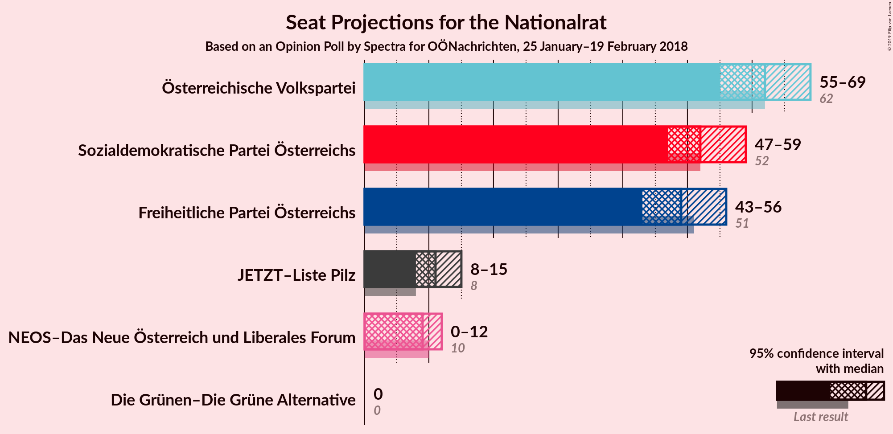
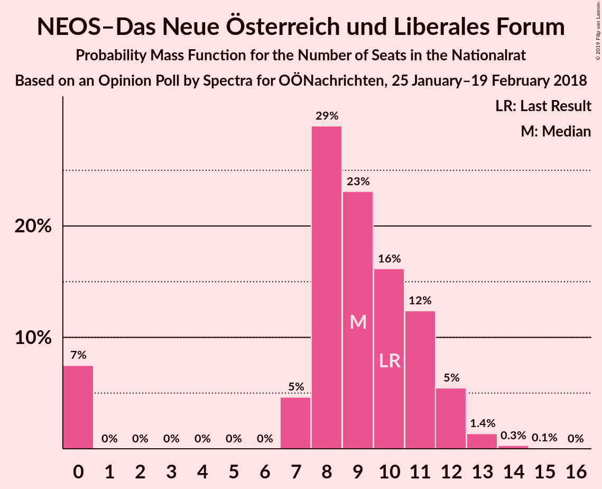
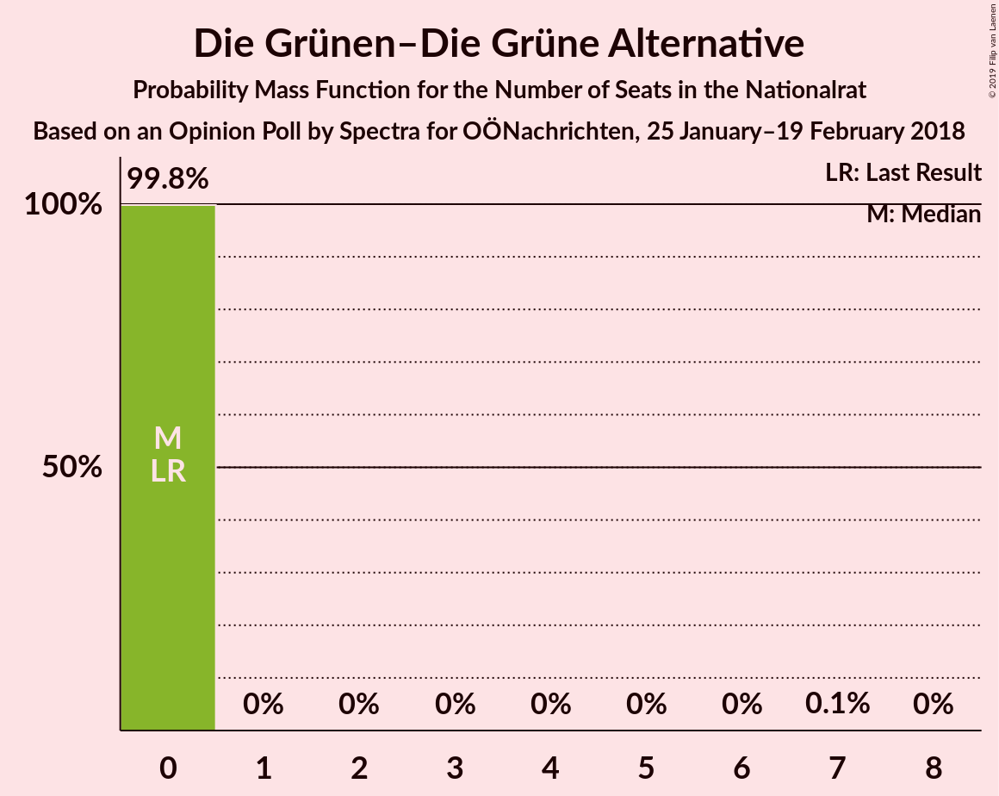
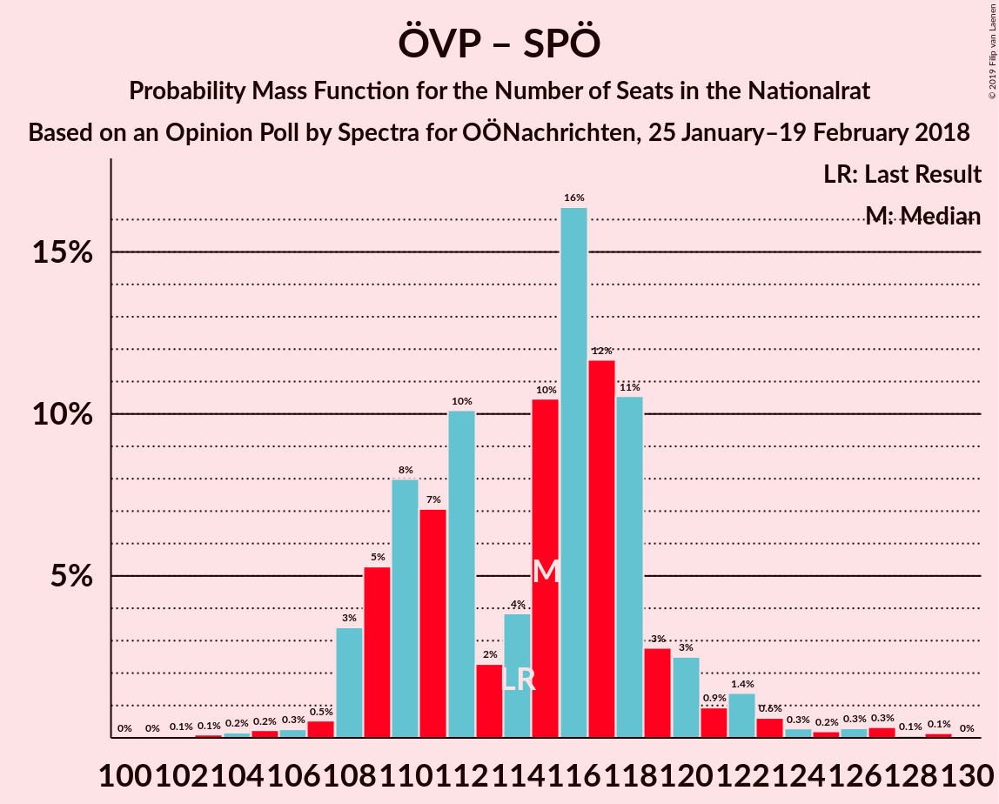
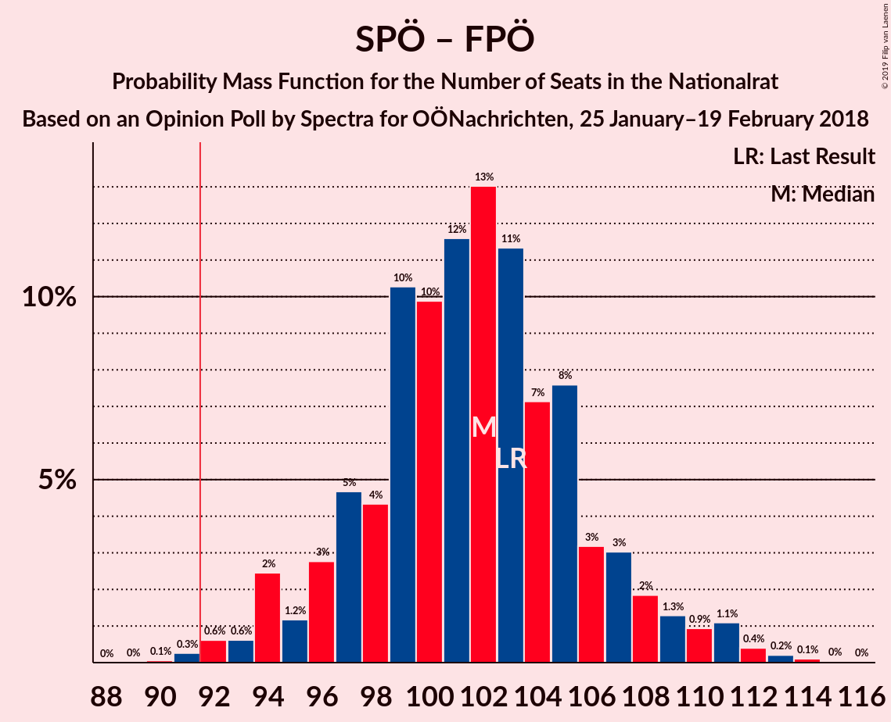
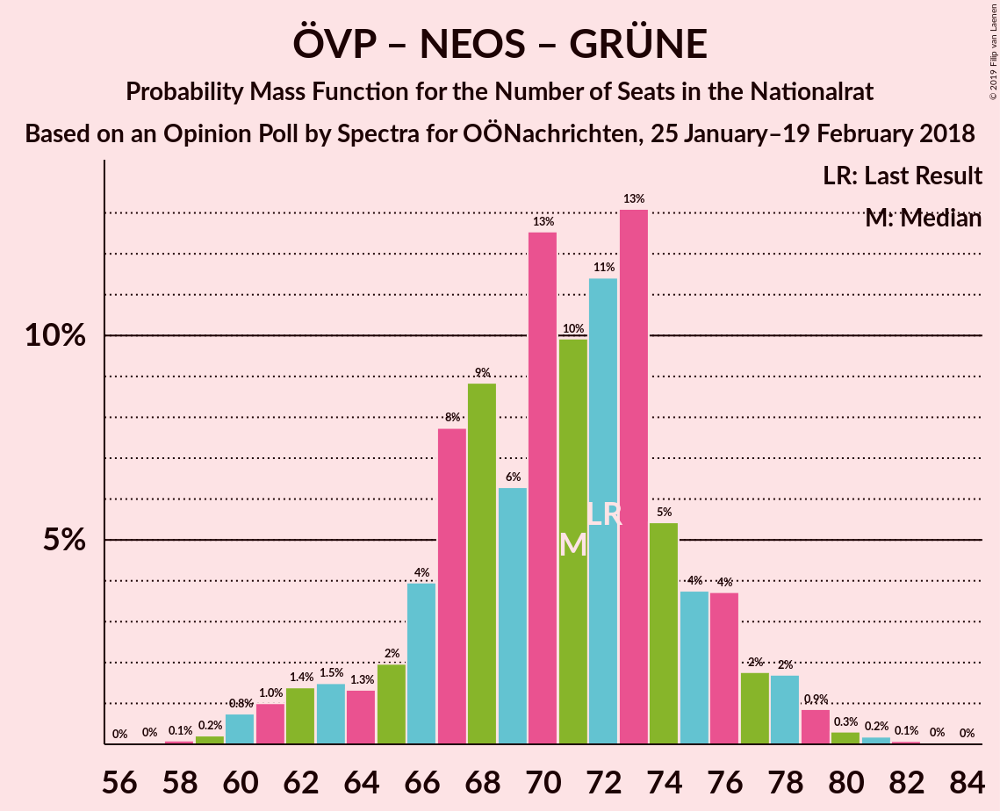

# Opinion Poll by Spectra for OÖNachrichten, 25 January–19 February 2018

<a href="#voting-intentions">Voting Intentions</a> | <a href="#seats">Seats</a> | <a href="#coalitions">Coalitions</a> | <a href="#technical-information">Technical Information</a>

## Voting Intentions

### Confidence Intervals

| Party | Last Result | Poll Result | 80% Confidence Interval | 90% Confidence Interval | 95% Confidence Interval | 99% Confidence Interval |
|:-----:|:-----------:|:-----------:|:-----------------------:|:-----------------------:|:-----------------------:|:-----------------------:|
| Österreichische Volkspartei | 31.5% | 32.9% | 30.7–35.2% |30.0–35.8% |29.5–36.4% |28.5–37.5% |
| Sozialdemokratische Partei Österreichs | 26.9% | 27.9% | 25.8–30.2% |25.3–30.8% |24.7–31.4% |23.8–32.4% |
| Freiheitliche Partei Österreichs | 26.0% | 26.0% | 23.9–28.2% |23.4–28.8% |22.9–29.3% |21.9–30.4% |
| JETZT–Liste Pilz | 4.4% | 5.9% | 4.9–7.2% |4.6–7.6% |4.4–7.9% |4.0–8.6% |
| NEOS–Das Neue Österreich und Liberales Forum | 5.3% | 4.9% | 4.0–6.1% |3.8–6.5% |3.6–6.8% |3.2–7.4% |
| Die Grünen–Die Grüne Alternative | 3.8% | 2.0% | 1.4–2.8% |1.3–3.1% |1.2–3.3% |1.0–3.7% |

*Note:* The poll result column reflects the actual value used in the calculations. Published results may vary slightly, and in addition be rounded to fewer digits.

## Seats

### Confidence Intervals

| Party | Last Result | Median | 80% Confidence Interval | 90% Confidence Interval | 95% Confidence Interval | 99% Confidence Interval |
|:-----:|:-----------:|:------:|:-----------------------:|:-----------------------:|:-----------------------:|:-----------------------:|
| <a href="#österreichische-volkspartei">Österreichische Volkspartei</a> | 62 | 62 | 57–66 |57–67 |55–69 |54–72 |
| <a href="#sozialdemokratische-partei-österreichs">Sozialdemokratische Partei Österreichs</a> | 52 | 52 | 48–56 |47–58 |47–59 |44–62 |
| <a href="#freiheitliche-partei-österreichs">Freiheitliche Partei Österreichs</a> | 51 | 49 | 45–54 |44–54 |43–56 |41–58 |
| <a href="#jetzt–liste-pilz">JETZT–Liste Pilz</a> | 8 | 11 | 9–13 |8–14 |8–15 |0–16 |
| <a href="#neos–das-neue-österreich-und-liberales-forum">NEOS–Das Neue Österreich und Liberales Forum</a> | 10 | 9 | 7–11 |0–12 |0–12 |0–13 |
| <a href="#die-grünen–die-grüne-alternative">Die Grünen–Die Grüne Alternative</a> | 0 | 0 | 0 |0 |0 |0 |

### Österreichische Volkspartei

*For a full overview of the results for this party, see the [Österreichische Volkspartei](party-österreichischevolkspartei.html) page.*

| Number of Seats | Probability | Accumulated | Special Marks |
|:---------------:|:-----------:|:-----------:|:-------------:|
| 51 | 0% | 100% |  |
| 52 | 0.1% | 99.9% |  |
| 53 | 0.3% | 99.8% |  |
| 54 | 0.7% | 99.6% |  |
| 55 | 1.5% | 98.8% |  |
| 56 | 2% | 97% |  |
| 57 | 5% | 95% |  |
| 58 | 9% | 90% |  |
| 59 | 7% | 81% |  |
| 60 | 7% | 74% |  |
| 61 | 8% | 67% |  |
| 62 | 16% | 59% | Last Result, Median |
| 63 | 8% | 43% |  |
| 64 | 13% | 34% |  |
| 65 | 8% | 21% |  |
| 66 | 4% | 13% |  |
| 67 | 4% | 9% |  |
| 68 | 2% | 4% |  |
| 69 | 1.0% | 3% |  |
| 70 | 0.7% | 2% |  |
| 71 | 0.5% | 1.2% |  |
| 72 | 0.4% | 0.7% |  |
| 73 | 0.2% | 0.3% |  |
| 74 | 0.1% | 0.1% |  |
| 75 | 0% | 0% |  |

### Sozialdemokratische Partei Österreichs

*For a full overview of the results for this party, see the [Sozialdemokratische Partei Österreichs](party-sozialdemokratischeparteiösterreichs.html) page.*

| Number of Seats | Probability | Accumulated | Special Marks |
|:---------------:|:-----------:|:-----------:|:-------------:|
| 43 | 0.2% | 100% |  |
| 44 | 0.3% | 99.8% |  |
| 45 | 0.7% | 99.4% |  |
| 46 | 1.2% | 98.7% |  |
| 47 | 3% | 98% |  |
| 48 | 4% | 94% |  |
| 49 | 7% | 90% |  |
| 50 | 10% | 83% |  |
| 51 | 8% | 73% |  |
| 52 | 16% | 65% | Last Result, Median |
| 53 | 7% | 49% |  |
| 54 | 13% | 42% |  |
| 55 | 10% | 29% |  |
| 56 | 9% | 19% |  |
| 57 | 4% | 10% |  |
| 58 | 2% | 6% |  |
| 59 | 2% | 4% |  |
| 60 | 0.8% | 2% |  |
| 61 | 0.4% | 1.0% |  |
| 62 | 0.3% | 0.6% |  |
| 63 | 0.1% | 0.2% |  |
| 64 | 0.1% | 0.1% |  |
| 65 | 0% | 0% |  |

### Freiheitliche Partei Österreichs

*For a full overview of the results for this party, see the [Freiheitliche Partei Österreichs](party-freiheitlicheparteiösterreichs.html) page.*

| Number of Seats | Probability | Accumulated | Special Marks |
|:---------------:|:-----------:|:-----------:|:-------------:|
| 39 | 0.1% | 100% |  |
| 40 | 0.1% | 99.9% |  |
| 41 | 0.5% | 99.8% |  |
| 42 | 0.9% | 99.3% |  |
| 43 | 2% | 98% |  |
| 44 | 4% | 96% |  |
| 45 | 5% | 92% |  |
| 46 | 12% | 87% |  |
| 47 | 12% | 76% |  |
| 48 | 10% | 64% |  |
| 49 | 12% | 55% | Median |
| 50 | 12% | 42% |  |
| 51 | 10% | 30% | Last Result |
| 52 | 6% | 21% |  |
| 53 | 5% | 15% |  |
| 54 | 6% | 10% |  |
| 55 | 2% | 5% |  |
| 56 | 1.3% | 3% |  |
| 57 | 0.6% | 1.2% |  |
| 58 | 0.4% | 0.6% |  |
| 59 | 0.2% | 0.2% |  |
| 60 | 0.1% | 0.1% |  |
| 61 | 0% | 0% |  |

### JETZT–Liste Pilz

*For a full overview of the results for this party, see the [JETZT–Liste Pilz](party-jetzt–listepilz.html) page.*

| Number of Seats | Probability | Accumulated | Special Marks |
|:---------------:|:-----------:|:-----------:|:-------------:|
| 0 | 0.6% | 100% |  |
| 1 | 0% | 99.4% |  |
| 2 | 0% | 99.4% |  |
| 3 | 0% | 99.4% |  |
| 4 | 0% | 99.4% |  |
| 5 | 0% | 99.4% |  |
| 6 | 0% | 99.4% |  |
| 7 | 0.6% | 99.4% |  |
| 8 | 5% | 98.8% | Last Result |
| 9 | 14% | 94% |  |
| 10 | 22% | 80% |  |
| 11 | 25% | 57% | Median |
| 12 | 13% | 32% |  |
| 13 | 12% | 20% |  |
| 14 | 5% | 8% |  |
| 15 | 2% | 3% |  |
| 16 | 0.7% | 0.8% |  |
| 17 | 0.1% | 0.2% |  |
| 18 | 0% | 0% |  |

### NEOS–Das Neue Österreich und Liberales Forum

*For a full overview of the results for this party, see the [NEOS–Das Neue Österreich und Liberales Forum](party-neos–dasneueösterreichundliberalesforum.html) page.*

| Number of Seats | Probability | Accumulated | Special Marks |
|:---------------:|:-----------:|:-----------:|:-------------:|
| 0 | 7% | 100% |  |
| 1 | 0% | 93% |  |
| 2 | 0% | 93% |  |
| 3 | 0% | 93% |  |
| 4 | 0% | 93% |  |
| 5 | 0% | 93% |  |
| 6 | 0% | 93% |  |
| 7 | 5% | 93% |  |
| 8 | 29% | 88% |  |
| 9 | 23% | 59% | Median |
| 10 | 16% | 36% | Last Result |
| 11 | 12% | 20% |  |
| 12 | 5% | 7% |  |
| 13 | 1.4% | 2% |  |
| 14 | 0.3% | 0.4% |  |
| 15 | 0.1% | 0.1% |  |
| 16 | 0% | 0% |  |

### Die Grünen–Die Grüne Alternative

*For a full overview of the results for this party, see the [Die Grünen–Die Grüne Alternative](party-diegrünen–diegrünealternative.html) page.*

| Number of Seats | Probability | Accumulated | Special Marks |
|:---------------:|:-----------:|:-----------:|:-------------:|
| 0 | 99.8% | 100% | Last Result, Median |
| 1 | 0% | 0.2% |  |
| 2 | 0% | 0.2% |  |
| 3 | 0% | 0.2% |  |
| 4 | 0% | 0.2% |  |
| 5 | 0% | 0.2% |  |
| 6 | 0% | 0.2% |  |
| 7 | 0.1% | 0.2% |  |
| 8 | 0% | 0% |  |

## Coalitions

### Confidence Intervals

| Coalition | Last Result | Median | Majority? | 80% Confidence Interval | 90% Confidence Interval | 95% Confidence Interval | 99% Confidence Interval |
|:---------:|:-----------:|:------:|:---------:|:-----------------------:|:-----------------------:|:-----------------------:|:-----------------------:|
| Österreichische Volkspartei – Sozialdemokratische Partei Österreichs | 114 | 115 | 100% | 109–118 | 109–120 | 108–122 | 105–127 |
| Österreichische Volkspartei – Freiheitliche Partei Österreichs | 113 | 110 | 100% | 106–115 | 105–118 | 104–119 | 102–122 |
| Sozialdemokratische Partei Österreichs – Freiheitliche Partei Österreichs | 103 | 102 | 99.6% | 97–106 | 95–108 | 94–110 | 92–112 |
| Österreichische Volkspartei – NEOS–Das Neue Österreich und Liberales Forum – Die Grünen–Die Grüne Alternative | 72 | 71 | 0% | 66–75 | 63–76 | 62–78 | 60–80 |
| Österreichische Volkspartei – NEOS–Das Neue Österreich und Liberales Forum | 72 | 71 | 0% | 66–75 | 63–76 | 62–78 | 60–80 |
| Österreichische Volkspartei – Die Grünen–Die Grüne Alternative | 62 | 62 | 0% | 58–66 | 57–67 | 55–69 | 54–72 |
| Österreichische Volkspartei | 62 | 62 | 0% | 57–66 | 57–67 | 55–69 | 54–72 |
| Sozialdemokratische Partei Österreichs – NEOS–Das Neue Österreich und Liberales Forum – Die Grünen–Die Grüne Alternative | 62 | 62 | 0% | 57–65 | 55–67 | 52–68 | 50–70 |
| Sozialdemokratische Partei Österreichs | 52 | 52 | 0% | 48–56 | 47–58 | 47–59 | 44–62 |

### Österreichische Volkspartei – Sozialdemokratische Partei Österreichs

| Number of Seats | Probability | Accumulated | Special Marks |
|:---------------:|:-----------:|:-----------:|:-------------:|
| 102 | 0.1% | 100% |  |
| 103 | 0.1% | 99.9% |  |
| 104 | 0.2% | 99.8% |  |
| 105 | 0.2% | 99.7% |  |
| 106 | 0.3% | 99.4% |  |
| 107 | 0.5% | 99.2% |  |
| 108 | 3% | 98.6% |  |
| 109 | 5% | 95% |  |
| 110 | 8% | 90% |  |
| 111 | 7% | 82% |  |
| 112 | 10% | 75% |  |
| 113 | 2% | 65% |  |
| 114 | 4% | 62% | Last Result, Median |
| 115 | 10% | 59% |  |
| 116 | 16% | 48% |  |
| 117 | 12% | 32% |  |
| 118 | 11% | 20% |  |
| 119 | 3% | 10% |  |
| 120 | 3% | 7% |  |
| 121 | 0.9% | 4% |  |
| 122 | 1.4% | 3% |  |
| 123 | 0.6% | 2% |  |
| 124 | 0.3% | 1.4% |  |
| 125 | 0.2% | 1.1% |  |
| 126 | 0.3% | 0.9% |  |
| 127 | 0.3% | 0.6% |  |
| 128 | 0.1% | 0.2% |  |
| 129 | 0.1% | 0.2% |  |
| 130 | 0% | 0% |  |

### Österreichische Volkspartei – Freiheitliche Partei Österreichs

| Number of Seats | Probability | Accumulated | Special Marks |
|:---------------:|:-----------:|:-----------:|:-------------:|
| 99 | 0.1% | 100% |  |
| 100 | 0.2% | 99.9% |  |
| 101 | 0.2% | 99.7% |  |
| 102 | 0.6% | 99.5% |  |
| 103 | 0.8% | 98.9% |  |
| 104 | 2% | 98% |  |
| 105 | 4% | 96% |  |
| 106 | 3% | 92% |  |
| 107 | 4% | 89% |  |
| 108 | 11% | 85% |  |
| 109 | 18% | 74% |  |
| 110 | 7% | 56% |  |
| 111 | 6% | 49% | Median |
| 112 | 7% | 43% |  |
| 113 | 10% | 37% | Last Result |
| 114 | 11% | 26% |  |
| 115 | 6% | 15% |  |
| 116 | 3% | 9% |  |
| 117 | 0.9% | 6% |  |
| 118 | 2% | 5% |  |
| 119 | 2% | 3% |  |
| 120 | 0.5% | 1.5% |  |
| 121 | 0.2% | 1.0% |  |
| 122 | 0.3% | 0.7% |  |
| 123 | 0.2% | 0.5% |  |
| 124 | 0.2% | 0.2% |  |
| 125 | 0% | 0.1% |  |
| 126 | 0% | 0% |  |

### Sozialdemokratische Partei Österreichs – Freiheitliche Partei Österreichs

| Number of Seats | Probability | Accumulated | Special Marks |
|:---------------:|:-----------:|:-----------:|:-------------:|
| 90 | 0.1% | 100% |  |
| 91 | 0.3% | 99.9% |  |
| 92 | 0.6% | 99.6% | Majority |
| 93 | 0.6% | 99.0% |  |
| 94 | 2% | 98% |  |
| 95 | 1.2% | 96% |  |
| 96 | 3% | 95% |  |
| 97 | 5% | 92% |  |
| 98 | 4% | 87% |  |
| 99 | 10% | 83% |  |
| 100 | 10% | 73% |  |
| 101 | 12% | 63% | Median |
| 102 | 13% | 51% |  |
| 103 | 11% | 38% | Last Result |
| 104 | 7% | 27% |  |
| 105 | 8% | 20% |  |
| 106 | 3% | 12% |  |
| 107 | 3% | 9% |  |
| 108 | 2% | 6% |  |
| 109 | 1.3% | 4% |  |
| 110 | 0.9% | 3% |  |
| 111 | 1.1% | 2% |  |
| 112 | 0.4% | 0.8% |  |
| 113 | 0.2% | 0.4% |  |
| 114 | 0.1% | 0.2% |  |
| 115 | 0% | 0.1% |  |
| 116 | 0% | 0% |  |

### Österreichische Volkspartei – NEOS–Das Neue Österreich und Liberales Forum – Die Grünen–Die Grüne Alternative

| Number of Seats | Probability | Accumulated | Special Marks |
|:---------------:|:-----------:|:-----------:|:-------------:|
| 57 | 0% | 100% |  |
| 58 | 0.1% | 99.9% |  |
| 59 | 0.2% | 99.8% |  |
| 60 | 0.8% | 99.6% |  |
| 61 | 1.0% | 98.9% |  |
| 62 | 1.4% | 98% |  |
| 63 | 1.5% | 96% |  |
| 64 | 1.3% | 95% |  |
| 65 | 2% | 94% |  |
| 66 | 4% | 92% |  |
| 67 | 8% | 88% |  |
| 68 | 9% | 80% |  |
| 69 | 6% | 71% |  |
| 70 | 13% | 65% |  |
| 71 | 10% | 52% | Median |
| 72 | 11% | 42% | Last Result |
| 73 | 13% | 31% |  |
| 74 | 5% | 18% |  |
| 75 | 4% | 12% |  |
| 76 | 4% | 9% |  |
| 77 | 2% | 5% |  |
| 78 | 2% | 3% |  |
| 79 | 0.9% | 2% |  |
| 80 | 0.3% | 0.6% |  |
| 81 | 0.2% | 0.3% |  |
| 82 | 0.1% | 0.1% |  |
| 83 | 0% | 0.1% |  |
| 84 | 0% | 0% |  |

### Österreichische Volkspartei – NEOS–Das Neue Österreich und Liberales Forum

| Number of Seats | Probability | Accumulated | Special Marks |
|:---------------:|:-----------:|:-----------:|:-------------:|
| 57 | 0% | 100% |  |
| 58 | 0.1% | 99.9% |  |
| 59 | 0.2% | 99.8% |  |
| 60 | 0.8% | 99.6% |  |
| 61 | 1.0% | 98.8% |  |
| 62 | 1.4% | 98% |  |
| 63 | 1.5% | 96% |  |
| 64 | 1.3% | 95% |  |
| 65 | 2% | 94% |  |
| 66 | 4% | 92% |  |
| 67 | 8% | 88% |  |
| 68 | 9% | 80% |  |
| 69 | 6% | 71% |  |
| 70 | 13% | 65% |  |
| 71 | 10% | 52% | Median |
| 72 | 11% | 42% | Last Result |
| 73 | 13% | 31% |  |
| 74 | 5% | 18% |  |
| 75 | 4% | 12% |  |
| 76 | 4% | 9% |  |
| 77 | 2% | 5% |  |
| 78 | 2% | 3% |  |
| 79 | 0.9% | 1.5% |  |
| 80 | 0.3% | 0.6% |  |
| 81 | 0.2% | 0.3% |  |
| 82 | 0.1% | 0.1% |  |
| 83 | 0% | 0.1% |  |
| 84 | 0% | 0% |  |

### Österreichische Volkspartei – Die Grünen–Die Grüne Alternative

| Number of Seats | Probability | Accumulated | Special Marks |
|:---------------:|:-----------:|:-----------:|:-------------:|
| 51 | 0% | 100% |  |
| 52 | 0.1% | 99.9% |  |
| 53 | 0.3% | 99.8% |  |
| 54 | 0.7% | 99.6% |  |
| 55 | 1.5% | 98.8% |  |
| 56 | 2% | 97% |  |
| 57 | 5% | 95% |  |
| 58 | 9% | 90% |  |
| 59 | 7% | 81% |  |
| 60 | 7% | 74% |  |
| 61 | 8% | 67% |  |
| 62 | 16% | 59% | Last Result, Median |
| 63 | 8% | 43% |  |
| 64 | 13% | 34% |  |
| 65 | 8% | 21% |  |
| 66 | 4% | 13% |  |
| 67 | 4% | 9% |  |
| 68 | 2% | 5% |  |
| 69 | 1.0% | 3% |  |
| 70 | 0.7% | 2% |  |
| 71 | 0.5% | 1.2% |  |
| 72 | 0.4% | 0.7% |  |
| 73 | 0.2% | 0.3% |  |
| 74 | 0.1% | 0.1% |  |
| 75 | 0% | 0% |  |

### Österreichische Volkspartei

| Number of Seats | Probability | Accumulated | Special Marks |
|:---------------:|:-----------:|:-----------:|:-------------:|
| 51 | 0% | 100% |  |
| 52 | 0.1% | 99.9% |  |
| 53 | 0.3% | 99.8% |  |
| 54 | 0.7% | 99.6% |  |
| 55 | 1.5% | 98.8% |  |
| 56 | 2% | 97% |  |
| 57 | 5% | 95% |  |
| 58 | 9% | 90% |  |
| 59 | 7% | 81% |  |
| 60 | 7% | 74% |  |
| 61 | 8% | 67% |  |
| 62 | 16% | 59% | Last Result, Median |
| 63 | 8% | 43% |  |
| 64 | 13% | 34% |  |
| 65 | 8% | 21% |  |
| 66 | 4% | 13% |  |
| 67 | 4% | 9% |  |
| 68 | 2% | 4% |  |
| 69 | 1.0% | 3% |  |
| 70 | 0.7% | 2% |  |
| 71 | 0.5% | 1.2% |  |
| 72 | 0.4% | 0.7% |  |
| 73 | 0.2% | 0.3% |  |
| 74 | 0.1% | 0.1% |  |
| 75 | 0% | 0% |  |

### Sozialdemokratische Partei Österreichs – NEOS–Das Neue Österreich und Liberales Forum – Die Grünen–Die Grüne Alternative

| Number of Seats | Probability | Accumulated | Special Marks |
|:---------------:|:-----------:|:-----------:|:-------------:|
| 47 | 0.2% | 100% |  |
| 48 | 0.2% | 99.8% |  |
| 49 | 0.1% | 99.6% |  |
| 50 | 0.2% | 99.5% |  |
| 51 | 0.7% | 99.3% |  |
| 52 | 1.2% | 98.6% |  |
| 53 | 0.8% | 97% |  |
| 54 | 1.3% | 97% |  |
| 55 | 2% | 95% |  |
| 56 | 2% | 93% |  |
| 57 | 4% | 91% |  |
| 58 | 11% | 87% |  |
| 59 | 6% | 76% |  |
| 60 | 13% | 70% |  |
| 61 | 8% | 58% | Median |
| 62 | 10% | 50% | Last Result |
| 63 | 10% | 40% |  |
| 64 | 11% | 30% |  |
| 65 | 9% | 19% |  |
| 66 | 4% | 9% |  |
| 67 | 2% | 6% |  |
| 68 | 2% | 4% |  |
| 69 | 1.2% | 2% |  |
| 70 | 0.6% | 1.0% |  |
| 71 | 0.3% | 0.5% |  |
| 72 | 0.1% | 0.2% |  |
| 73 | 0% | 0.1% |  |
| 74 | 0% | 0% |  |

### Sozialdemokratische Partei Österreichs

| Number of Seats | Probability | Accumulated | Special Marks |
|:---------------:|:-----------:|:-----------:|:-------------:|
| 43 | 0.2% | 100% |  |
| 44 | 0.3% | 99.8% |  |
| 45 | 0.7% | 99.4% |  |
| 46 | 1.2% | 98.7% |  |
| 47 | 3% | 98% |  |
| 48 | 4% | 94% |  |
| 49 | 7% | 90% |  |
| 50 | 10% | 83% |  |
| 51 | 8% | 73% |  |
| 52 | 16% | 65% | Last Result, Median |
| 53 | 7% | 49% |  |
| 54 | 13% | 42% |  |
| 55 | 10% | 29% |  |
| 56 | 9% | 19% |  |
| 57 | 4% | 10% |  |
| 58 | 2% | 6% |  |
| 59 | 2% | 4% |  |
| 60 | 0.8% | 2% |  |
| 61 | 0.4% | 1.0% |  |
| 62 | 0.3% | 0.6% |  |
| 63 | 0.1% | 0.2% |  |
| 64 | 0.1% | 0.1% |  |
| 65 | 0% | 0% |  |

## Technical Information

### Opinion Poll

+ **Polling firm:** Spectra
+ **Commissioner(s):** OÖNachrichten
+ **Fieldwork period:** 25 January–19 February 2018

### Calculations

+ **Sample size:** 709
+ **Simulations done:** 131,072
+ **Error estimate:** 0.64%

