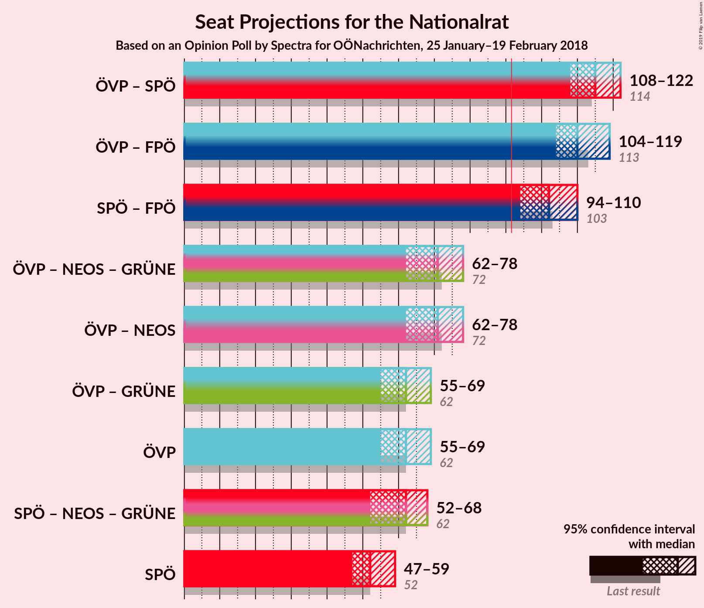
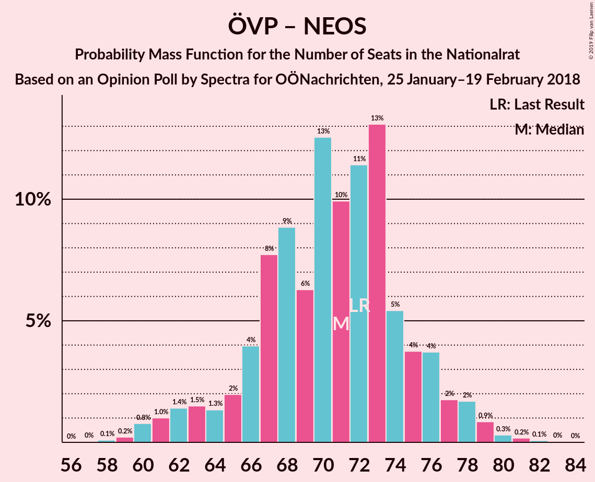
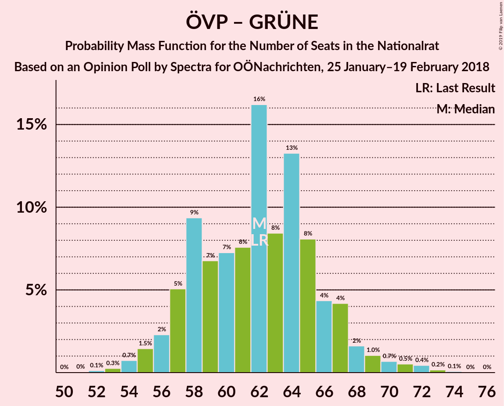
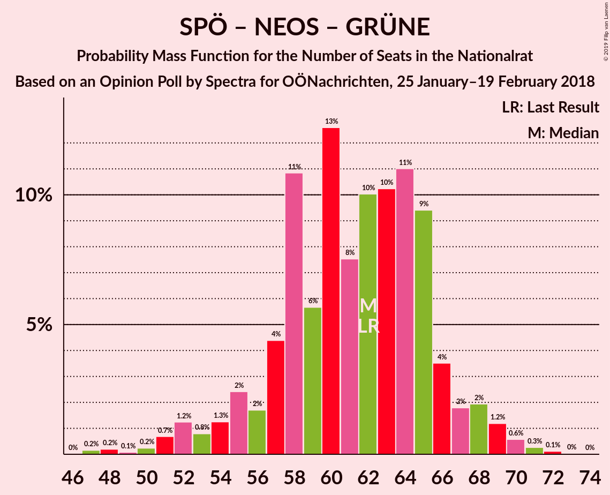

# Opinion Poll by Spectra for OÖNachrichten, 25 January–19 February 2018

<a href="#voting-intentions">Voting Intentions</a> | <a href="#seats">Seats</a> | <a href="#coalitions">Coalitions</a> | <a href="#technical-information">Technical Information</a>

## Voting Intentions

### Confidence Intervals

| Party | Last Result | Poll Result | 80% Confidence Interval | 90% Confidence Interval | 95% Confidence Interval | 99% Confidence Interval |
|:-----:|:-----------:|:-----------:|:-----------------------:|:-----------------------:|:-----------------------:|:-----------------------:|
| Österreichische Volkspartei | 31.5% | 32.9% | 30.7–35.2% |30.0–35.8% |29.5–36.4% |28.5–37.5% |
| Sozialdemokratische Partei Österreichs | 26.9% | 27.9% | 25.8–30.2% |25.3–30.8% |24.7–31.4% |23.8–32.4% |
| Freiheitliche Partei Österreichs | 26.0% | 26.0% | 23.9–28.2% |23.4–28.8% |22.9–29.3% |21.9–30.4% |
| JETZT–Liste Pilz | 4.4% | 5.9% | 4.9–7.2% |4.6–7.6% |4.4–7.9% |4.0–8.6% |
| NEOS–Das Neue Österreich und Liberales Forum | 5.3% | 4.9% | 4.0–6.1% |3.8–6.5% |3.6–6.8% |3.2–7.4% |
| Die Grünen–Die Grüne Alternative | 3.8% | 2.0% | 1.4–2.8% |1.3–3.1% |1.2–3.3% |1.0–3.7% |

*Note:* The poll result column reflects the actual value used in the calculations. Published results may vary slightly, and in addition be rounded to fewer digits.

## Seats

### Confidence Intervals

| Party | Last Result | Median | 80% Confidence Interval | 90% Confidence Interval | 95% Confidence Interval | 99% Confidence Interval |
|:-----:|:-----------:|:------:|:-----------------------:|:-----------------------:|:-----------------------:|:-----------------------:|
| <a href="#österreichische-volkspartei">Österreichische Volkspartei</a> | 62 | 64 | 59–67 |55–69 |53–69 |52–74 |
| <a href="#sozialdemokratische-partei-österreichs">Sozialdemokratische Partei Österreichs</a> | 52 | 52 | 47–54 |47–54 |47–55 |47–55 |
| <a href="#freiheitliche-partei-österreichs">Freiheitliche Partei Österreichs</a> | 51 | 46 | 44–53 |44–55 |44–57 |40–57 |
| <a href="#jetzt–liste-pilz">JETZT–Liste Pilz</a> | 8 | 12 | 10–15 |10–15 |10–15 |10–15 |
| <a href="#neos–das-neue-österreich-und-liberales-forum">NEOS–Das Neue Österreich und Liberales Forum</a> | 10 | 9 | 8–11 |8–11 |0–11 |0–11 |
| <a href="#die-grünen–die-grüne-alternative">Die Grünen–Die Grüne Alternative</a> | 0 | 0 | 0 |0 |0 |0 |

### Österreichische Volkspartei

*For a full overview of the results for this party, see the [Österreichische Volkspartei](party-österreichischevolkspartei.html) page.*

| Number of Seats | Probability | Accumulated | Special Marks |
|:---------------:|:-----------:|:-----------:|:-------------:|
| 50 | 0.1% | 100% |  |
| 51 | 0% | 99.9% |  |
| 52 | 2% | 99.9% |  |
| 53 | 3% | 98% |  |
| 54 | 0% | 95% |  |
| 55 | 4% | 95% |  |
| 56 | 0% | 91% |  |
| 57 | 0% | 91% |  |
| 58 | 0.1% | 91% |  |
| 59 | 11% | 91% |  |
| 60 | 24% | 80% |  |
| 61 | 0% | 56% |  |
| 62 | 0% | 56% | Last Result |
| 63 | 0% | 56% |  |
| 64 | 40% | 56% | Median |
| 65 | 0% | 17% |  |
| 66 | 0% | 17% |  |
| 67 | 10% | 17% |  |
| 68 | 0.1% | 6% |  |
| 69 | 4% | 6% |  |
| 70 | 0% | 2% |  |
| 71 | 0% | 2% |  |
| 72 | 1.2% | 2% |  |
| 73 | 0% | 0.9% |  |
| 74 | 0.7% | 0.9% |  |
| 75 | 0.1% | 0.2% |  |
| 76 | 0% | 0.1% |  |
| 77 | 0.1% | 0.1% |  |
| 78 | 0% | 0% |  |

### Sozialdemokratische Partei Österreichs

*For a full overview of the results for this party, see the [Sozialdemokratische Partei Österreichs](party-sozialdemokratischeparteiösterreichs.html) page.*

| Number of Seats | Probability | Accumulated | Special Marks |
|:---------------:|:-----------:|:-----------:|:-------------:|
| 42 | 0.1% | 100% |  |
| 43 | 0% | 99.9% |  |
| 44 | 0% | 99.9% |  |
| 45 | 0% | 99.9% |  |
| 46 | 0% | 99.9% |  |
| 47 | 11% | 99.9% |  |
| 48 | 0.1% | 89% |  |
| 49 | 4% | 89% |  |
| 50 | 4% | 85% |  |
| 51 | 1.2% | 80% |  |
| 52 | 40% | 79% | Last Result, Median |
| 53 | 0.1% | 40% |  |
| 54 | 35% | 40% |  |
| 55 | 5% | 5% |  |
| 56 | 0% | 0.2% |  |
| 57 | 0% | 0.2% |  |
| 58 | 0% | 0.2% |  |
| 59 | 0.1% | 0.2% |  |
| 60 | 0% | 0% |  |

### Freiheitliche Partei Österreichs

*For a full overview of the results for this party, see the [Freiheitliche Partei Österreichs](party-freiheitlicheparteiösterreichs.html) page.*

| Number of Seats | Probability | Accumulated | Special Marks |
|:---------------:|:-----------:|:-----------:|:-------------:|
| 39 | 0.1% | 100% |  |
| 40 | 1.2% | 99.9% |  |
| 41 | 0% | 98.7% |  |
| 42 | 0.1% | 98.7% |  |
| 43 | 0.1% | 98.6% |  |
| 44 | 11% | 98.5% |  |
| 45 | 0% | 87% |  |
| 46 | 64% | 87% | Median |
| 47 | 0% | 24% |  |
| 48 | 0.1% | 24% |  |
| 49 | 0% | 23% |  |
| 50 | 12% | 23% |  |
| 51 | 0.3% | 12% | Last Result |
| 52 | 0% | 11% |  |
| 53 | 3% | 11% |  |
| 54 | 0.1% | 8% |  |
| 55 | 4% | 8% |  |
| 56 | 0% | 4% |  |
| 57 | 4% | 4% |  |
| 58 | 0% | 0% |  |

### JETZT–Liste Pilz

*For a full overview of the results for this party, see the [JETZT–Liste Pilz](party-jetzt–listepilz.html) page.*

| Number of Seats | Probability | Accumulated | Special Marks |
|:---------------:|:-----------:|:-----------:|:-------------:|
| 8 | 0% | 100% | Last Result |
| 9 | 0.1% | 100% |  |
| 10 | 15% | 99.9% |  |
| 11 | 0% | 85% |  |
| 12 | 41% | 85% | Median |
| 13 | 4% | 44% |  |
| 14 | 3% | 40% |  |
| 15 | 37% | 37% |  |
| 16 | 0.2% | 0.2% |  |
| 17 | 0% | 0% |  |

### NEOS–Das Neue Österreich und Liberales Forum

*For a full overview of the results for this party, see the [NEOS–Das Neue Österreich und Liberales Forum](party-neos–dasneueösterreichundliberalesforum.html) page.*

| Number of Seats | Probability | Accumulated | Special Marks |
|:---------------:|:-----------:|:-----------:|:-------------:|
| 0 | 4% | 100% |  |
| 1 | 0% | 96% |  |
| 2 | 0% | 96% |  |
| 3 | 0% | 96% |  |
| 4 | 0% | 96% |  |
| 5 | 0% | 96% |  |
| 6 | 0% | 96% |  |
| 7 | 0.1% | 96% |  |
| 8 | 33% | 96% |  |
| 9 | 50% | 62% | Median |
| 10 | 0% | 12% | Last Result |
| 11 | 12% | 12% |  |
| 12 | 0% | 0% |  |

### Die Grünen–Die Grüne Alternative

*For a full overview of the results for this party, see the [Die Grünen–Die Grüne Alternative](party-diegrünen–diegrünealternative.html) page.*

| Number of Seats | Probability | Accumulated | Special Marks |
|:---------------:|:-----------:|:-----------:|:-------------:|
| 0 | 100% | 100% | Last Result, Median |

## Coalitions

### Confidence Intervals

| Coalition | Last Result | Median | Majority? | 80% Confidence Interval | 90% Confidence Interval | 95% Confidence Interval | 99% Confidence Interval |
|:---------:|:-----------:|:------:|:---------:|:-----------------------:|:-----------------------:|:-----------------------:|:-----------------------:|
| Österreichische Volkspartei – Freiheitliche Partei Österreichs | 113 | 110 | 100% | 103–117 | 103–118 | 103–124 | 102–124 |
| Österreichische Volkspartei – Sozialdemokratische Partei Österreichs | 114 | 114 | 100% | 113–116 | 107–118 | 105–118 | 105–123 |
| Sozialdemokratische Partei Österreichs – Freiheitliche Partei Österreichs | 103 | 98 | 98% | 97–104 | 97–107 | 97–108 | 91–108 |
| Österreichische Volkspartei – NEOS–Das Neue Österreich und Liberales Forum – Die Grünen–Die Grüne Alternative | 72 | 73 | 0% | 68–76 | 63–76 | 61–76 | 61–82 |
| Österreichische Volkspartei – NEOS–Das Neue Österreich und Liberales Forum | 72 | 73 | 0% | 68–76 | 63–76 | 61–76 | 61–82 |
| Österreichische Volkspartei – Die Grünen–Die Grüne Alternative | 62 | 64 | 0% | 59–67 | 55–69 | 53–69 | 52–74 |
| Österreichische Volkspartei | 62 | 64 | 0% | 59–67 | 55–69 | 53–69 | 52–74 |
| Sozialdemokratische Partei Österreichs – NEOS–Das Neue Österreich und Liberales Forum – Die Grünen–Die Grüne Alternative | 62 | 61 | 0% | 56–65 | 55–65 | 49–65 | 49–66 |
| Sozialdemokratische Partei Österreichs | 52 | 52 | 0% | 47–54 | 47–54 | 47–55 | 47–55 |

### Österreichische Volkspartei – Freiheitliche Partei Österreichs

| Number of Seats | Probability | Accumulated | Special Marks |
|:---------------:|:-----------:|:-----------:|:-------------:|
| 99 | 0% | 100% |  |
| 100 | 0.1% | 99.9% |  |
| 101 | 0% | 99.8% |  |
| 102 | 2% | 99.8% |  |
| 103 | 11% | 98% |  |
| 104 | 0% | 87% |  |
| 105 | 0% | 87% |  |
| 106 | 27% | 87% |  |
| 107 | 0.1% | 60% |  |
| 108 | 0% | 60% |  |
| 109 | 0% | 60% |  |
| 110 | 40% | 60% | Median |
| 111 | 0% | 21% |  |
| 112 | 5% | 21% |  |
| 113 | 0% | 15% | Last Result |
| 114 | 0% | 15% |  |
| 115 | 0% | 15% |  |
| 116 | 0% | 15% |  |
| 117 | 10% | 15% |  |
| 118 | 1.0% | 5% |  |
| 119 | 0% | 4% |  |
| 120 | 0% | 4% |  |
| 121 | 0% | 4% |  |
| 122 | 0% | 4% |  |
| 123 | 0.1% | 4% |  |
| 124 | 4% | 4% |  |
| 125 | 0.1% | 0.1% |  |
| 126 | 0% | 0% |  |

### Österreichische Volkspartei – Sozialdemokratische Partei Österreichs

| Number of Seats | Probability | Accumulated | Special Marks |
|:---------------:|:-----------:|:-----------:|:-------------:|
| 105 | 4% | 100% |  |
| 106 | 0% | 96% |  |
| 107 | 2% | 96% |  |
| 108 | 3% | 94% |  |
| 109 | 0% | 91% |  |
| 110 | 0% | 91% |  |
| 111 | 0.1% | 91% |  |
| 112 | 0% | 91% |  |
| 113 | 11% | 91% |  |
| 114 | 34% | 80% | Last Result |
| 115 | 0.1% | 46% |  |
| 116 | 40% | 46% | Median |
| 117 | 0.1% | 6% |  |
| 118 | 4% | 6% |  |
| 119 | 0% | 2% |  |
| 120 | 0% | 2% |  |
| 121 | 0.7% | 2% |  |
| 122 | 0.1% | 1.4% |  |
| 123 | 1.2% | 1.4% |  |
| 124 | 0% | 0.2% |  |
| 125 | 0.1% | 0.2% |  |
| 126 | 0% | 0.1% |  |
| 127 | 0% | 0.1% |  |
| 128 | 0.1% | 0.1% |  |
| 129 | 0% | 0% |  |

### Sozialdemokratische Partei Österreichs – Freiheitliche Partei Österreichs

| Number of Seats | Probability | Accumulated | Special Marks |
|:---------------:|:-----------:|:-----------:|:-------------:|
| 91 | 2% | 100% |  |
| 92 | 0% | 98% | Majority |
| 93 | 0.1% | 98% |  |
| 94 | 0% | 98% |  |
| 95 | 0% | 98% |  |
| 96 | 0.2% | 98% |  |
| 97 | 10% | 98% |  |
| 98 | 50% | 88% | Median |
| 99 | 0% | 37% |  |
| 100 | 24% | 37% |  |
| 101 | 0.2% | 13% |  |
| 102 | 0% | 13% |  |
| 103 | 0% | 13% | Last Result |
| 104 | 4% | 13% |  |
| 105 | 2% | 9% |  |
| 106 | 0% | 7% |  |
| 107 | 4% | 7% |  |
| 108 | 3% | 3% |  |
| 109 | 0% | 0.1% |  |
| 110 | 0% | 0% |  |

### Österreichische Volkspartei – NEOS–Das Neue Österreich und Liberales Forum – Die Grünen–Die Grüne Alternative

| Number of Seats | Probability | Accumulated | Special Marks |
|:---------------:|:-----------:|:-----------:|:-------------:|
| 58 | 0% | 100% |  |
| 59 | 0% | 99.9% |  |
| 60 | 0% | 99.9% |  |
| 61 | 3% | 99.9% |  |
| 62 | 0% | 97% |  |
| 63 | 6% | 97% |  |
| 64 | 0% | 91% |  |
| 65 | 0% | 91% |  |
| 66 | 0.1% | 91% |  |
| 67 | 0% | 91% |  |
| 68 | 24% | 91% |  |
| 69 | 4% | 67% |  |
| 70 | 11% | 63% |  |
| 71 | 0% | 52% |  |
| 72 | 0% | 52% | Last Result |
| 73 | 40% | 52% | Median |
| 74 | 0% | 13% |  |
| 75 | 0.4% | 13% |  |
| 76 | 10% | 12% |  |
| 77 | 0.1% | 2% |  |
| 78 | 0.1% | 2% |  |
| 79 | 0% | 2% |  |
| 80 | 1.2% | 2% |  |
| 81 | 0% | 0.7% |  |
| 82 | 0.7% | 0.7% |  |
| 83 | 0% | 0% |  |

### Österreichische Volkspartei – NEOS–Das Neue Österreich und Liberales Forum

| Number of Seats | Probability | Accumulated | Special Marks |
|:---------------:|:-----------:|:-----------:|:-------------:|
| 58 | 0% | 100% |  |
| 59 | 0% | 99.9% |  |
| 60 | 0% | 99.9% |  |
| 61 | 3% | 99.9% |  |
| 62 | 0% | 97% |  |
| 63 | 6% | 97% |  |
| 64 | 0% | 91% |  |
| 65 | 0% | 91% |  |
| 66 | 0.1% | 91% |  |
| 67 | 0% | 91% |  |
| 68 | 24% | 91% |  |
| 69 | 4% | 67% |  |
| 70 | 11% | 63% |  |
| 71 | 0% | 52% |  |
| 72 | 0% | 52% | Last Result |
| 73 | 40% | 52% | Median |
| 74 | 0% | 13% |  |
| 75 | 0.4% | 13% |  |
| 76 | 10% | 12% |  |
| 77 | 0.1% | 2% |  |
| 78 | 0.1% | 2% |  |
| 79 | 0% | 2% |  |
| 80 | 1.2% | 2% |  |
| 81 | 0% | 0.7% |  |
| 82 | 0.7% | 0.7% |  |
| 83 | 0% | 0% |  |

### Österreichische Volkspartei – Die Grünen–Die Grüne Alternative

| Number of Seats | Probability | Accumulated | Special Marks |
|:---------------:|:-----------:|:-----------:|:-------------:|
| 50 | 0.1% | 100% |  |
| 51 | 0% | 99.9% |  |
| 52 | 2% | 99.9% |  |
| 53 | 3% | 98% |  |
| 54 | 0% | 95% |  |
| 55 | 4% | 95% |  |
| 56 | 0% | 91% |  |
| 57 | 0% | 91% |  |
| 58 | 0.1% | 91% |  |
| 59 | 11% | 91% |  |
| 60 | 24% | 80% |  |
| 61 | 0% | 56% |  |
| 62 | 0% | 56% | Last Result |
| 63 | 0% | 56% |  |
| 64 | 40% | 56% | Median |
| 65 | 0% | 17% |  |
| 66 | 0% | 17% |  |
| 67 | 10% | 17% |  |
| 68 | 0.1% | 6% |  |
| 69 | 4% | 6% |  |
| 70 | 0% | 2% |  |
| 71 | 0% | 2% |  |
| 72 | 1.2% | 2% |  |
| 73 | 0% | 0.9% |  |
| 74 | 0.7% | 0.9% |  |
| 75 | 0.1% | 0.2% |  |
| 76 | 0% | 0.1% |  |
| 77 | 0.1% | 0.1% |  |
| 78 | 0% | 0% |  |

### Österreichische Volkspartei

| Number of Seats | Probability | Accumulated | Special Marks |
|:---------------:|:-----------:|:-----------:|:-------------:|
| 50 | 0.1% | 100% |  |
| 51 | 0% | 99.9% |  |
| 52 | 2% | 99.9% |  |
| 53 | 3% | 98% |  |
| 54 | 0% | 95% |  |
| 55 | 4% | 95% |  |
| 56 | 0% | 91% |  |
| 57 | 0% | 91% |  |
| 58 | 0.1% | 91% |  |
| 59 | 11% | 91% |  |
| 60 | 24% | 80% |  |
| 61 | 0% | 56% |  |
| 62 | 0% | 56% | Last Result |
| 63 | 0% | 56% |  |
| 64 | 40% | 56% | Median |
| 65 | 0% | 17% |  |
| 66 | 0% | 17% |  |
| 67 | 10% | 17% |  |
| 68 | 0.1% | 6% |  |
| 69 | 4% | 6% |  |
| 70 | 0% | 2% |  |
| 71 | 0% | 2% |  |
| 72 | 1.2% | 2% |  |
| 73 | 0% | 0.9% |  |
| 74 | 0.7% | 0.9% |  |
| 75 | 0.1% | 0.2% |  |
| 76 | 0% | 0.1% |  |
| 77 | 0.1% | 0.1% |  |
| 78 | 0% | 0% |  |

### Sozialdemokratische Partei Österreichs – NEOS–Das Neue Österreich und Liberales Forum – Die Grünen–Die Grüne Alternative

| Number of Seats | Probability | Accumulated | Special Marks |
|:---------------:|:-----------:|:-----------:|:-------------:|
| 48 | 0.1% | 100% |  |
| 49 | 4% | 99.9% |  |
| 50 | 0% | 96% |  |
| 51 | 0.1% | 96% |  |
| 52 | 0% | 96% |  |
| 53 | 0.1% | 96% |  |
| 54 | 0% | 96% |  |
| 55 | 0.9% | 96% |  |
| 56 | 10% | 95% |  |
| 57 | 0% | 85% |  |
| 58 | 4% | 85% |  |
| 59 | 1.2% | 80% |  |
| 60 | 0% | 79% |  |
| 61 | 40% | 79% | Median |
| 62 | 24% | 40% | Last Result |
| 63 | 3% | 16% |  |
| 64 | 0% | 13% |  |
| 65 | 11% | 13% |  |
| 66 | 2% | 2% |  |
| 67 | 0.1% | 0.2% |  |
| 68 | 0% | 0.1% |  |
| 69 | 0% | 0% |  |

### Sozialdemokratische Partei Österreichs

| Number of Seats | Probability | Accumulated | Special Marks |
|:---------------:|:-----------:|:-----------:|:-------------:|
| 42 | 0.1% | 100% |  |
| 43 | 0% | 99.9% |  |
| 44 | 0% | 99.9% |  |
| 45 | 0% | 99.9% |  |
| 46 | 0% | 99.9% |  |
| 47 | 11% | 99.9% |  |
| 48 | 0.1% | 89% |  |
| 49 | 4% | 89% |  |
| 50 | 4% | 85% |  |
| 51 | 1.2% | 80% |  |
| 52 | 40% | 79% | Last Result, Median |
| 53 | 0.1% | 40% |  |
| 54 | 35% | 40% |  |
| 55 | 5% | 5% |  |
| 56 | 0% | 0.2% |  |
| 57 | 0% | 0.2% |  |
| 58 | 0% | 0.2% |  |
| 59 | 0.1% | 0.2% |  |
| 60 | 0% | 0% |  |

## Technical Information

### Opinion Poll

+ **Polling firm:** Spectra
+ **Commissioner(s):** OÖNachrichten
+ **Fieldwork period:** 25 January–19 February 2018

### Calculations

+ **Sample size:** 709
+ **Simulations done:** 1,024
+ **Error estimate:** 3.03%

