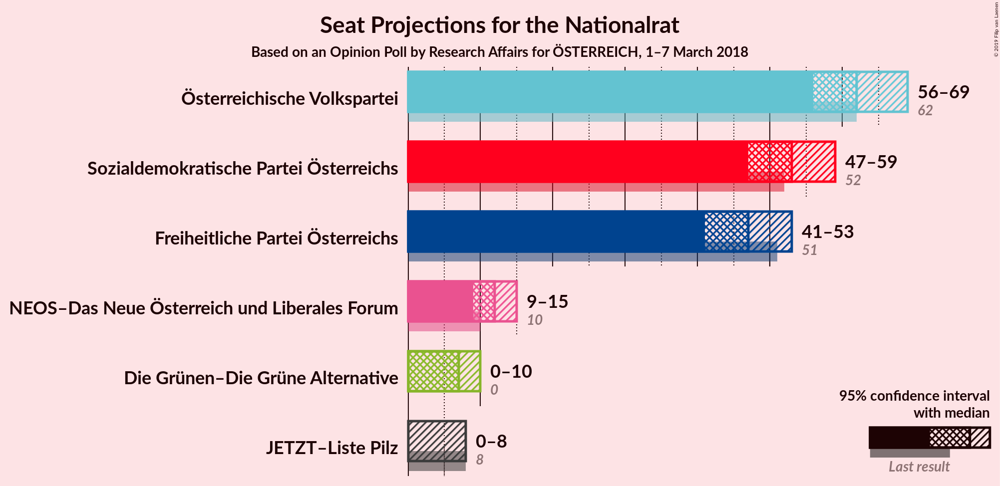
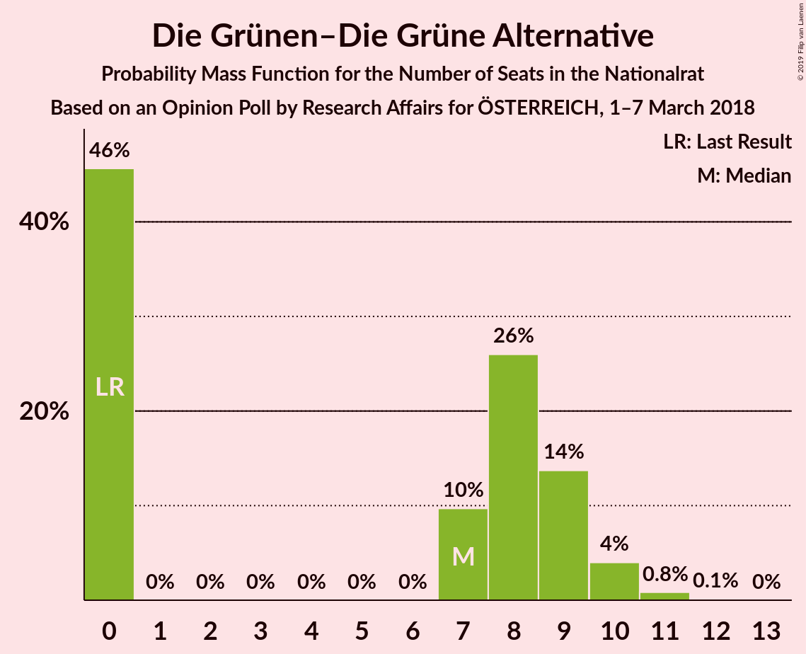
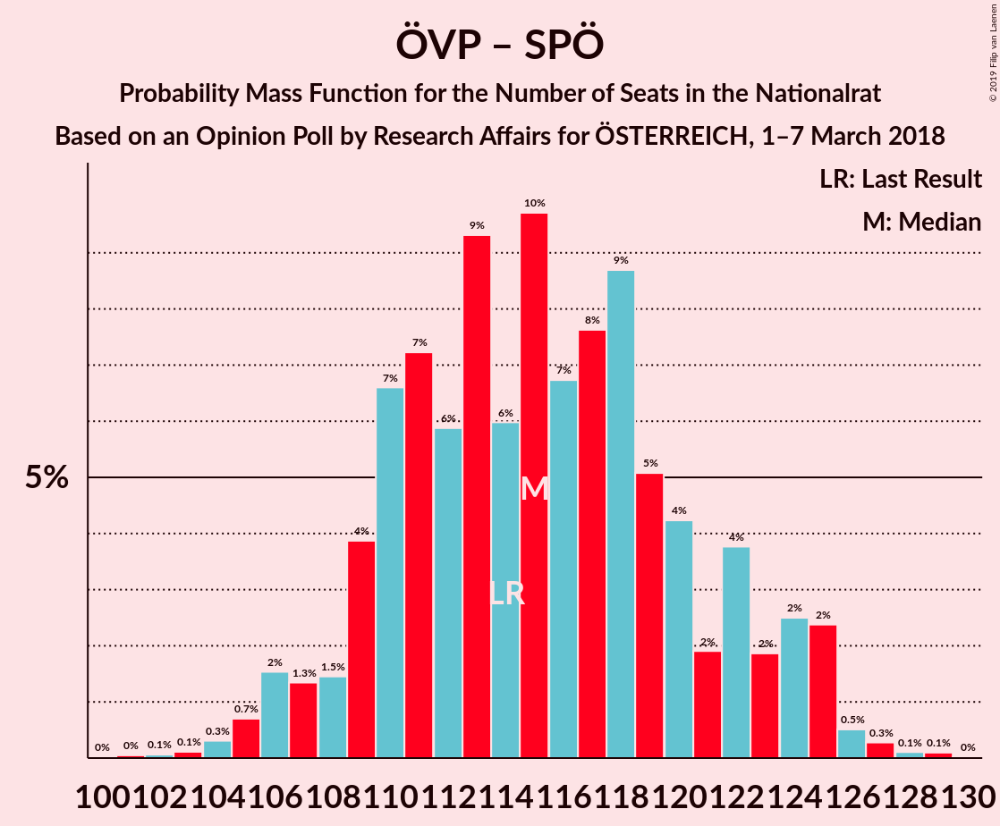
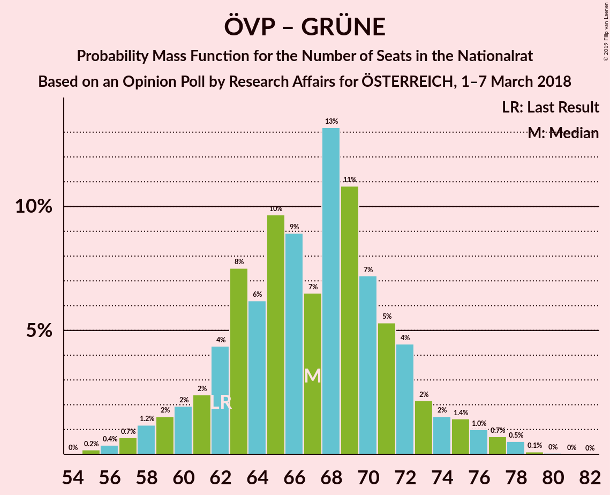

# Opinion Poll by Research Affairs for ÖSTERREICH, 1–7 March 2018

<a href="#voting-intentions">Voting Intentions</a> | <a href="#seats">Seats</a> | <a href="#coalitions">Coalitions</a> | <a href="#technical-information">Technical Information</a>

## Voting Intentions

### Confidence Intervals

| Party | Last Result | Poll Result | 80% Confidence Interval | 90% Confidence Interval | 95% Confidence Interval | 99% Confidence Interval |
|:-----:|:-----------:|:-----------:|:-----------------------:|:-----------------------:|:-----------------------:|:-----------------------:|
| Österreichische Volkspartei | 31.5% | 32.0% | 30.2–33.9% |29.6–34.4% |29.2–34.9% |28.3–35.8% |
| Sozialdemokratische Partei Österreichs | 26.9% | 27.0% | 25.3–28.8% |24.8–29.3% |24.4–29.8% |23.6–30.7% |
| Freiheitliche Partei Österreichs | 26.0% | 24.0% | 22.4–25.8% |21.9–26.3% |21.6–26.7% |20.8–27.6% |
| NEOS–Das Neue Österreich und Liberales Forum | 5.3% | 6.0% | 5.2–7.1% |4.9–7.4% |4.7–7.6% |4.3–8.2% |
| Die Grünen–Die Grüne Alternative | 3.8% | 4.0% | 3.3–4.9% |3.1–5.2% |3.0–5.4% |2.7–5.8% |
| JETZT–Liste Pilz | 4.4% | 3.0% | 2.4–3.7% |2.2–4.0% |2.1–4.2% |1.8–4.6% |

*Note:* The poll result column reflects the actual value used in the calculations. Published results may vary slightly, and in addition be rounded to fewer digits.

## Seats

### Confidence Intervals

| Party | Last Result | Median | 80% Confidence Interval | 90% Confidence Interval | 95% Confidence Interval | 99% Confidence Interval |
|:-----:|:-----------:|:------:|:-----------------------:|:-----------------------:|:-----------------------:|:-----------------------:|
| <a href="#österreichische-volkspartei">Österreichische Volkspartei</a> | 62 | 63 | 59–67 |58–67 |58–68 |54–70 |
| <a href="#sozialdemokratische-partei-österreichs">Sozialdemokratische Partei Österreichs</a> | 52 | 51 | 49–55 |49–56 |48–56 |42–66 |
| <a href="#freiheitliche-partei-österreichs">Freiheitliche Partei Österreichs</a> | 51 | 49 | 42–54 |42–54 |42–54 |42–54 |
| <a href="#neos–das-neue-österreich-und-liberales-forum">NEOS–Das Neue Österreich und Liberales Forum</a> | 10 | 14 | 10–15 |10–15 |10–15 |0–16 |
| <a href="#die-grünen–die-grüne-alternative">Die Grünen–Die Grüne Alternative</a> | 0 | 0 | 0–9 |0–10 |0–10 |0–10 |
| <a href="#jetzt–liste-pilz">JETZT–Liste Pilz</a> | 8 | 0 | 0 |0 |0–8 |0–9 |

### Österreichische Volkspartei

*For a full overview of the results for this party, see the [Österreichische Volkspartei](party-österreichischevolkspartei.html) page.*

| Number of Seats | Probability | Accumulated | Special Marks |
|:---------------:|:-----------:|:-----------:|:-------------:|
| 51 | 0.4% | 100% |  |
| 52 | 0% | 99.6% |  |
| 53 | 0% | 99.6% |  |
| 54 | 0.2% | 99.5% |  |
| 55 | 0.1% | 99.4% |  |
| 56 | 0.3% | 99.3% |  |
| 57 | 0.2% | 99.0% |  |
| 58 | 8% | 98.8% |  |
| 59 | 9% | 91% |  |
| 60 | 14% | 82% |  |
| 61 | 0.3% | 68% |  |
| 62 | 17% | 68% | Last Result |
| 63 | 24% | 51% | Median |
| 64 | 8% | 28% |  |
| 65 | 0% | 20% |  |
| 66 | 2% | 20% |  |
| 67 | 15% | 18% |  |
| 68 | 1.0% | 3% |  |
| 69 | 0% | 2% |  |
| 70 | 2% | 2% |  |
| 71 | 0.4% | 0.5% |  |
| 72 | 0% | 0.1% |  |
| 73 | 0% | 0.1% |  |
| 74 | 0.1% | 0.1% |  |
| 75 | 0% | 0% |  |

### Sozialdemokratische Partei Österreichs

*For a full overview of the results for this party, see the [Sozialdemokratische Partei Österreichs](party-sozialdemokratischeparteiösterreichs.html) page.*

| Number of Seats | Probability | Accumulated | Special Marks |
|:---------------:|:-----------:|:-----------:|:-------------:|
| 42 | 0.8% | 100% |  |
| 43 | 0% | 99.2% |  |
| 44 | 0% | 99.1% |  |
| 45 | 1.0% | 99.1% |  |
| 46 | 0% | 98% |  |
| 47 | 0.1% | 98% |  |
| 48 | 1.3% | 98% |  |
| 49 | 28% | 97% |  |
| 50 | 0.7% | 69% |  |
| 51 | 40% | 68% | Median |
| 52 | 0% | 28% | Last Result |
| 53 | 16% | 28% |  |
| 54 | 1.2% | 12% |  |
| 55 | 4% | 11% |  |
| 56 | 5% | 7% |  |
| 57 | 0.5% | 2% |  |
| 58 | 0.2% | 2% |  |
| 59 | 0.4% | 1.4% |  |
| 60 | 0.2% | 1.1% |  |
| 61 | 0.1% | 0.9% |  |
| 62 | 0.3% | 0.8% |  |
| 63 | 0% | 0.6% |  |
| 64 | 0% | 0.6% |  |
| 65 | 0% | 0.6% |  |
| 66 | 0.6% | 0.6% |  |
| 67 | 0% | 0% |  |

### Freiheitliche Partei Österreichs

*For a full overview of the results for this party, see the [Freiheitliche Partei Österreichs](party-freiheitlicheparteiösterreichs.html) page.*

| Number of Seats | Probability | Accumulated | Special Marks |
|:---------------:|:-----------:|:-----------:|:-------------:|
| 41 | 0.1% | 100% |  |
| 42 | 14% | 99.9% |  |
| 43 | 4% | 86% |  |
| 44 | 0.8% | 83% |  |
| 45 | 16% | 82% |  |
| 46 | 2% | 66% |  |
| 47 | 1.2% | 64% |  |
| 48 | 0.5% | 63% |  |
| 49 | 23% | 62% | Median |
| 50 | 0.1% | 39% |  |
| 51 | 14% | 39% | Last Result |
| 52 | 1.2% | 25% |  |
| 53 | 0.4% | 24% |  |
| 54 | 23% | 24% |  |
| 55 | 0% | 0.2% |  |
| 56 | 0% | 0.2% |  |
| 57 | 0.1% | 0.2% |  |
| 58 | 0% | 0.1% |  |
| 59 | 0% | 0.1% |  |
| 60 | 0.1% | 0.1% |  |
| 61 | 0% | 0% |  |

### NEOS–Das Neue Österreich und Liberales Forum

*For a full overview of the results for this party, see the [NEOS–Das Neue Österreich und Liberales Forum](party-neos–dasneueösterreichundliberalesforum.html) page.*

| Number of Seats | Probability | Accumulated | Special Marks |
|:---------------:|:-----------:|:-----------:|:-------------:|
| 0 | 0.7% | 100% |  |
| 1 | 0% | 99.3% |  |
| 2 | 0% | 99.3% |  |
| 3 | 0% | 99.3% |  |
| 4 | 0% | 99.3% |  |
| 5 | 0% | 99.3% |  |
| 6 | 0% | 99.3% |  |
| 7 | 0% | 99.3% |  |
| 8 | 0.4% | 99.3% |  |
| 9 | 1.1% | 98.9% |  |
| 10 | 21% | 98% | Last Result |
| 11 | 12% | 77% |  |
| 12 | 2% | 65% |  |
| 13 | 8% | 63% |  |
| 14 | 29% | 54% | Median |
| 15 | 24% | 25% |  |
| 16 | 1.2% | 1.4% |  |
| 17 | 0.2% | 0.2% |  |
| 18 | 0% | 0% |  |

### Die Grünen–Die Grüne Alternative

*For a full overview of the results for this party, see the [Die Grünen–Die Grüne Alternative](party-diegrünen–diegrünealternative.html) page.*

| Number of Seats | Probability | Accumulated | Special Marks |
|:---------------:|:-----------:|:-----------:|:-------------:|
| 0 | 67% | 100% | Last Result, Median |
| 1 | 0% | 33% |  |
| 2 | 0% | 33% |  |
| 3 | 0% | 33% |  |
| 4 | 0% | 33% |  |
| 5 | 0% | 33% |  |
| 6 | 0% | 33% |  |
| 7 | 0% | 33% |  |
| 8 | 0.1% | 33% |  |
| 9 | 27% | 33% |  |
| 10 | 6% | 6% |  |
| 11 | 0% | 0.1% |  |
| 12 | 0% | 0.1% |  |
| 13 | 0% | 0% |  |

### JETZT–Liste Pilz

*For a full overview of the results for this party, see the [JETZT–Liste Pilz](party-jetzt–listepilz.html) page.*

| Number of Seats | Probability | Accumulated | Special Marks |
|:---------------:|:-----------:|:-----------:|:-------------:|
| 0 | 95% | 100% | Median |
| 1 | 0% | 5% |  |
| 2 | 0% | 5% |  |
| 3 | 0% | 5% |  |
| 4 | 0% | 5% |  |
| 5 | 0% | 5% |  |
| 6 | 0% | 5% |  |
| 7 | 0.5% | 5% |  |
| 8 | 3% | 4% | Last Result |
| 9 | 0.7% | 0.7% |  |
| 10 | 0% | 0% |  |

## Coalitions

### Confidence Intervals

| Coalition | Last Result | Median | Majority? | 80% Confidence Interval | 90% Confidence Interval | 95% Confidence Interval | 99% Confidence Interval |
|:---------:|:-----------:|:------:|:---------:|:-----------------------:|:-----------------------:|:-----------------------:|:-----------------------:|
| Österreichische Volkspartei – Sozialdemokratische Partei Österreichs | 114 | 114 | 100% | 109–116 | 109–117 | 109–121 | 104–128 |
| Österreichische Volkspartei – Freiheitliche Partei Österreichs | 113 | 113 | 100% | 101–117 | 100–117 | 100–117 | 99–121 |
| Sozialdemokratische Partei Österreichs – Freiheitliche Partei Österreichs | 103 | 98 | 99.1% | 94–105 | 93–105 | 93–106 | 89–112 |
| Österreichische Volkspartei – NEOS–Das Neue Österreich und Liberales Forum – Die Grünen–Die Grüne Alternative | 72 | 78 | 0% | 74–85 | 71–85 | 69–85 | 68–89 |
| Österreichische Volkspartei – NEOS–Das Neue Österreich und Liberales Forum | 72 | 76 | 0% | 69–78 | 68–78 | 68–80 | 65–86 |
| Sozialdemokratische Partei Österreichs – NEOS–Das Neue Österreich und Liberales Forum – Die Grünen–Die Grüne Alternative | 62 | 66 | 0% | 59–76 | 59–76 | 59–76 | 58–76 |
| Österreichische Volkspartei – Die Grünen–Die Grüne Alternative | 62 | 66 | 0% | 60–71 | 60–71 | 58–71 | 58–77 |
| Österreichische Volkspartei | 62 | 63 | 0% | 59–67 | 58–67 | 58–68 | 54–70 |
| Sozialdemokratische Partei Österreichs | 52 | 51 | 0% | 49–55 | 49–56 | 48–56 | 42–66 |

### Österreichische Volkspartei – Sozialdemokratische Partei Österreichs

| Number of Seats | Probability | Accumulated | Special Marks |
|:---------------:|:-----------:|:-----------:|:-------------:|
| 99 | 0.4% | 100% |  |
| 100 | 0% | 99.6% |  |
| 101 | 0% | 99.6% |  |
| 102 | 0% | 99.6% |  |
| 103 | 0% | 99.6% |  |
| 104 | 0.2% | 99.6% |  |
| 105 | 0% | 99.4% |  |
| 106 | 0.9% | 99.4% |  |
| 107 | 0.1% | 98% |  |
| 108 | 0.1% | 98% |  |
| 109 | 13% | 98% |  |
| 110 | 9% | 85% |  |
| 111 | 0.3% | 77% |  |
| 112 | 0.3% | 76% |  |
| 113 | 4% | 76% |  |
| 114 | 29% | 72% | Last Result, Median |
| 115 | 23% | 43% |  |
| 116 | 15% | 20% |  |
| 117 | 0.2% | 5% |  |
| 118 | 0.5% | 5% |  |
| 119 | 0.1% | 4% |  |
| 120 | 1.1% | 4% |  |
| 121 | 2% | 3% |  |
| 122 | 0% | 1.4% |  |
| 123 | 0.3% | 1.4% |  |
| 124 | 0% | 1.1% |  |
| 125 | 0% | 1.1% |  |
| 126 | 0% | 1.0% |  |
| 127 | 0% | 1.0% |  |
| 128 | 0.6% | 1.0% |  |
| 129 | 0% | 0.5% |  |
| 130 | 0.4% | 0.5% |  |
| 131 | 0.1% | 0.1% |  |
| 132 | 0% | 0% |  |

### Österreichische Volkspartei – Freiheitliche Partei Österreichs

| Number of Seats | Probability | Accumulated | Special Marks |
|:---------------:|:-----------:|:-----------:|:-------------:|
| 98 | 0.3% | 100% |  |
| 99 | 0.4% | 99.7% |  |
| 100 | 5% | 99.3% |  |
| 101 | 11% | 94% |  |
| 102 | 0.1% | 83% |  |
| 103 | 0.3% | 83% |  |
| 104 | 0.3% | 82% |  |
| 105 | 0.3% | 82% |  |
| 106 | 0.2% | 82% |  |
| 107 | 17% | 82% |  |
| 108 | 0.6% | 65% |  |
| 109 | 0.1% | 64% |  |
| 110 | 0.1% | 64% |  |
| 111 | 14% | 64% |  |
| 112 | 0.2% | 50% | Median |
| 113 | 7% | 50% | Last Result |
| 114 | 0.1% | 43% |  |
| 115 | 0.7% | 43% |  |
| 116 | 16% | 42% |  |
| 117 | 25% | 27% |  |
| 118 | 1.4% | 2% |  |
| 119 | 0% | 0.9% |  |
| 120 | 0.1% | 0.9% |  |
| 121 | 0.4% | 0.8% |  |
| 122 | 0% | 0.4% |  |
| 123 | 0% | 0.4% |  |
| 124 | 0.4% | 0.4% |  |
| 125 | 0% | 0% |  |

### Sozialdemokratische Partei Österreichs – Freiheitliche Partei Österreichs

| Number of Seats | Probability | Accumulated | Special Marks |
|:---------------:|:-----------:|:-----------:|:-------------:|
| 89 | 0.8% | 100% |  |
| 90 | 0% | 99.1% |  |
| 91 | 0% | 99.1% |  |
| 92 | 0.3% | 99.1% | Majority |
| 93 | 8% | 98.8% |  |
| 94 | 1.0% | 91% |  |
| 95 | 0% | 90% |  |
| 96 | 0.5% | 90% |  |
| 97 | 2% | 89% |  |
| 98 | 39% | 87% |  |
| 99 | 0.3% | 48% |  |
| 100 | 20% | 47% | Median |
| 101 | 0.3% | 27% |  |
| 102 | 0.7% | 27% |  |
| 103 | 0.1% | 27% | Last Result |
| 104 | 0% | 27% |  |
| 105 | 24% | 26% |  |
| 106 | 1.4% | 3% |  |
| 107 | 0.3% | 2% |  |
| 108 | 0% | 1.3% |  |
| 109 | 0.3% | 1.3% |  |
| 110 | 0% | 1.0% |  |
| 111 | 0% | 1.0% |  |
| 112 | 0.9% | 1.0% |  |
| 113 | 0.1% | 0.1% |  |
| 114 | 0% | 0% |  |

### Österreichische Volkspartei – NEOS–Das Neue Österreich und Liberales Forum – Die Grünen–Die Grüne Alternative

| Number of Seats | Probability | Accumulated | Special Marks |
|:---------------:|:-----------:|:-----------:|:-------------:|
| 65 | 0.1% | 100% |  |
| 66 | 0% | 99.9% |  |
| 67 | 0.3% | 99.9% |  |
| 68 | 0.3% | 99.6% |  |
| 69 | 3% | 99.3% |  |
| 70 | 0.2% | 96% |  |
| 71 | 0.9% | 96% |  |
| 72 | 0.5% | 95% | Last Result |
| 73 | 0.4% | 94% |  |
| 74 | 13% | 94% |  |
| 75 | 7% | 81% |  |
| 76 | 1.2% | 74% |  |
| 77 | 16% | 73% | Median |
| 78 | 28% | 57% |  |
| 79 | 0.1% | 29% |  |
| 80 | 0% | 28% |  |
| 81 | 9% | 28% |  |
| 82 | 0% | 19% |  |
| 83 | 0.1% | 19% |  |
| 84 | 0% | 19% |  |
| 85 | 17% | 19% |  |
| 86 | 1.1% | 2% |  |
| 87 | 0% | 1.1% |  |
| 88 | 0% | 1.0% |  |
| 89 | 1.0% | 1.0% |  |
| 90 | 0% | 0% |  |

### Österreichische Volkspartei – NEOS–Das Neue Österreich und Liberales Forum

| Number of Seats | Probability | Accumulated | Special Marks |
|:---------------:|:-----------:|:-----------:|:-------------:|
| 62 | 0.4% | 100% |  |
| 63 | 0% | 99.6% |  |
| 64 | 0% | 99.6% |  |
| 65 | 0.2% | 99.6% |  |
| 66 | 0.4% | 99.4% |  |
| 67 | 0.3% | 99.0% |  |
| 68 | 5% | 98.7% |  |
| 69 | 3% | 93% |  |
| 70 | 0.2% | 90% |  |
| 71 | 1.2% | 90% |  |
| 72 | 8% | 89% | Last Result |
| 73 | 0.4% | 80% |  |
| 74 | 13% | 80% |  |
| 75 | 7% | 67% |  |
| 76 | 18% | 60% |  |
| 77 | 16% | 42% | Median |
| 78 | 23% | 26% |  |
| 79 | 0% | 3% |  |
| 80 | 1.0% | 3% |  |
| 81 | 0.6% | 2% |  |
| 82 | 0% | 1.2% |  |
| 83 | 0.1% | 1.2% |  |
| 84 | 0% | 1.2% |  |
| 85 | 0% | 1.2% |  |
| 86 | 1.1% | 1.2% |  |
| 87 | 0% | 0% |  |

### Sozialdemokratische Partei Österreichs – NEOS–Das Neue Österreich und Liberales Forum – Die Grünen–Die Grüne Alternative

| Number of Seats | Probability | Accumulated | Special Marks |
|:---------------:|:-----------:|:-----------:|:-------------:|
| 56 | 0.3% | 100% |  |
| 57 | 0.1% | 99.7% |  |
| 58 | 0.7% | 99.6% |  |
| 59 | 15% | 98.9% |  |
| 60 | 0.2% | 84% |  |
| 61 | 0.1% | 84% |  |
| 62 | 7% | 84% | Last Result |
| 63 | 14% | 77% |  |
| 64 | 0.2% | 63% |  |
| 65 | 1.2% | 63% | Median |
| 66 | 28% | 61% |  |
| 67 | 2% | 34% |  |
| 68 | 0% | 32% |  |
| 69 | 0.7% | 32% |  |
| 70 | 0% | 31% |  |
| 71 | 0.4% | 31% |  |
| 72 | 0.1% | 31% |  |
| 73 | 8% | 31% |  |
| 74 | 0% | 22% |  |
| 75 | 0.8% | 22% |  |
| 76 | 21% | 21% |  |
| 77 | 0.2% | 0.4% |  |
| 78 | 0% | 0.3% |  |
| 79 | 0.2% | 0.2% |  |
| 80 | 0% | 0% |  |

### Österreichische Volkspartei – Die Grünen–Die Grüne Alternative

| Number of Seats | Probability | Accumulated | Special Marks |
|:---------------:|:-----------:|:-----------:|:-------------:|
| 54 | 0% | 100% |  |
| 55 | 0.1% | 99.9% |  |
| 56 | 0% | 99.8% |  |
| 57 | 0.2% | 99.8% |  |
| 58 | 3% | 99.7% |  |
| 59 | 0.4% | 96% |  |
| 60 | 13% | 96% |  |
| 61 | 0.7% | 83% |  |
| 62 | 0.6% | 82% | Last Result |
| 63 | 24% | 82% | Median |
| 64 | 7% | 58% |  |
| 65 | 0% | 51% |  |
| 66 | 2% | 51% |  |
| 67 | 15% | 49% |  |
| 68 | 13% | 34% |  |
| 69 | 0.3% | 21% |  |
| 70 | 2% | 20% |  |
| 71 | 17% | 19% |  |
| 72 | 0% | 2% |  |
| 73 | 0.9% | 2% |  |
| 74 | 0.1% | 1.2% |  |
| 75 | 0% | 1.1% |  |
| 76 | 0.1% | 1.1% |  |
| 77 | 1.0% | 1.0% |  |
| 78 | 0% | 0% |  |

### Österreichische Volkspartei

| Number of Seats | Probability | Accumulated | Special Marks |
|:---------------:|:-----------:|:-----------:|:-------------:|
| 51 | 0.4% | 100% |  |
| 52 | 0% | 99.6% |  |
| 53 | 0% | 99.6% |  |
| 54 | 0.2% | 99.5% |  |
| 55 | 0.1% | 99.4% |  |
| 56 | 0.3% | 99.3% |  |
| 57 | 0.2% | 99.0% |  |
| 58 | 8% | 98.8% |  |
| 59 | 9% | 91% |  |
| 60 | 14% | 82% |  |
| 61 | 0.3% | 68% |  |
| 62 | 17% | 68% | Last Result |
| 63 | 24% | 51% | Median |
| 64 | 8% | 28% |  |
| 65 | 0% | 20% |  |
| 66 | 2% | 20% |  |
| 67 | 15% | 18% |  |
| 68 | 1.0% | 3% |  |
| 69 | 0% | 2% |  |
| 70 | 2% | 2% |  |
| 71 | 0.4% | 0.5% |  |
| 72 | 0% | 0.1% |  |
| 73 | 0% | 0.1% |  |
| 74 | 0.1% | 0.1% |  |
| 75 | 0% | 0% |  |

### Sozialdemokratische Partei Österreichs

| Number of Seats | Probability | Accumulated | Special Marks |
|:---------------:|:-----------:|:-----------:|:-------------:|
| 42 | 0.8% | 100% |  |
| 43 | 0% | 99.2% |  |
| 44 | 0% | 99.1% |  |
| 45 | 1.0% | 99.1% |  |
| 46 | 0% | 98% |  |
| 47 | 0.1% | 98% |  |
| 48 | 1.3% | 98% |  |
| 49 | 28% | 97% |  |
| 50 | 0.7% | 69% |  |
| 51 | 40% | 68% | Median |
| 52 | 0% | 28% | Last Result |
| 53 | 16% | 28% |  |
| 54 | 1.2% | 12% |  |
| 55 | 4% | 11% |  |
| 56 | 5% | 7% |  |
| 57 | 0.5% | 2% |  |
| 58 | 0.2% | 2% |  |
| 59 | 0.4% | 1.4% |  |
| 60 | 0.2% | 1.1% |  |
| 61 | 0.1% | 0.9% |  |
| 62 | 0.3% | 0.8% |  |
| 63 | 0% | 0.6% |  |
| 64 | 0% | 0.6% |  |
| 65 | 0% | 0.6% |  |
| 66 | 0.6% | 0.6% |  |
| 67 | 0% | 0% |  |

## Technical Information

### Opinion Poll

+ **Polling firm:** Research Affairs
+ **Commissioner(s):** ÖSTERREICH
+ **Fieldwork period:** 1–7 March 2018

### Calculations

+ **Sample size:** 1048
+ **Simulations done:** 1,024
+ **Error estimate:** 3.83%

