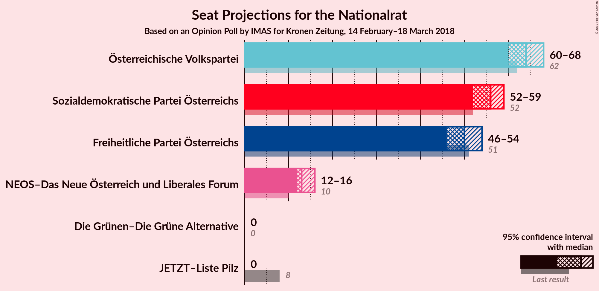
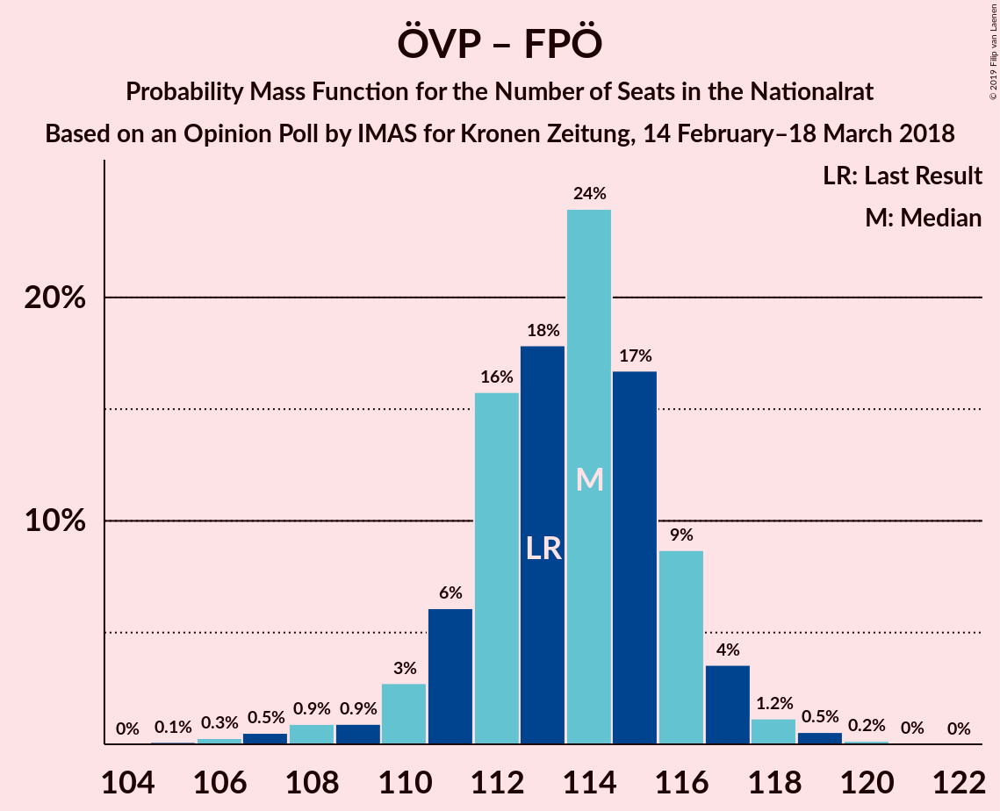
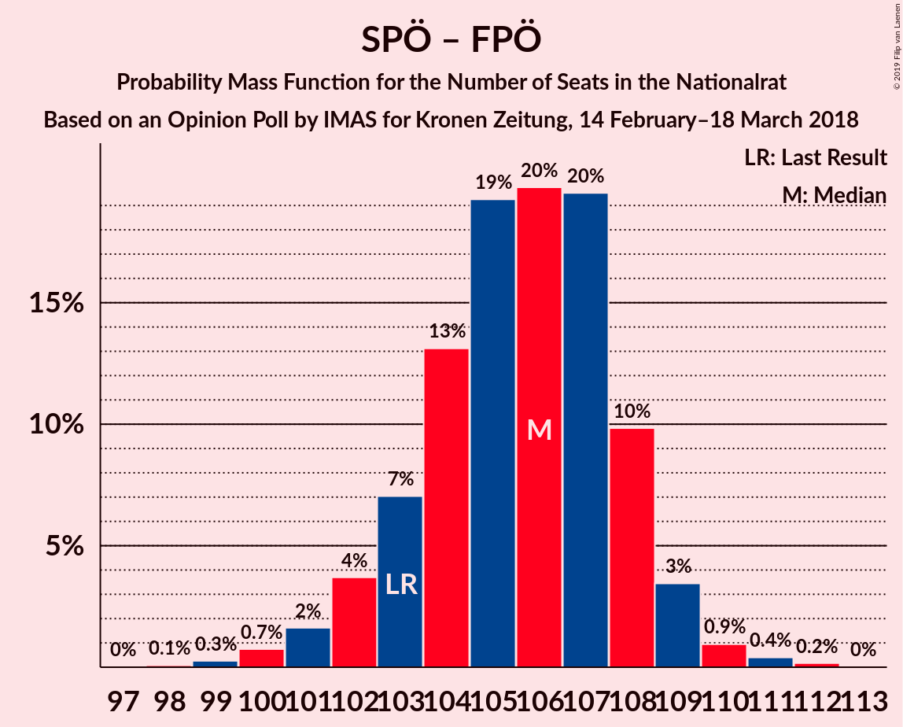
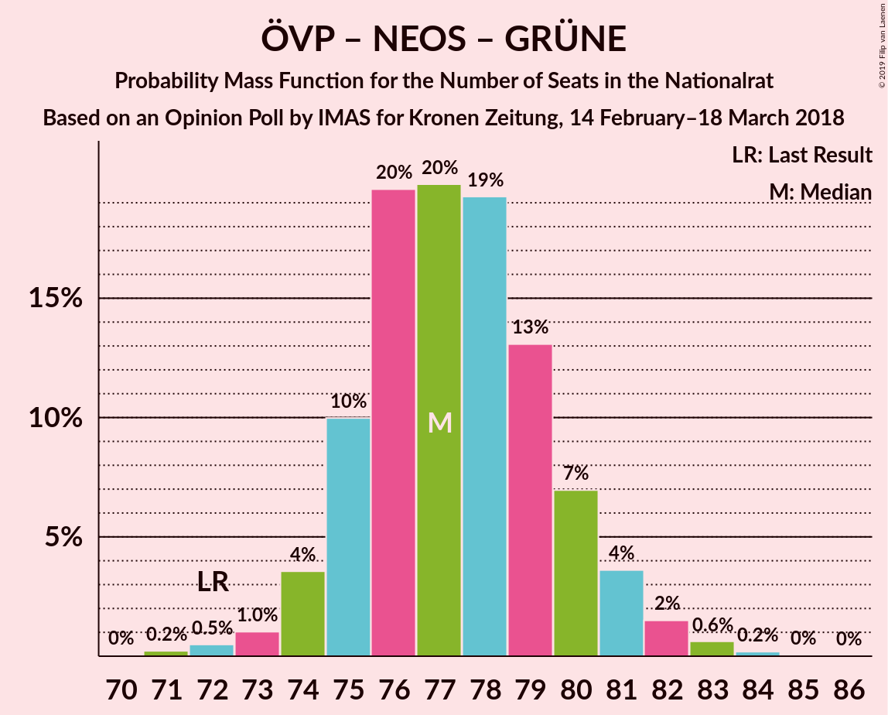
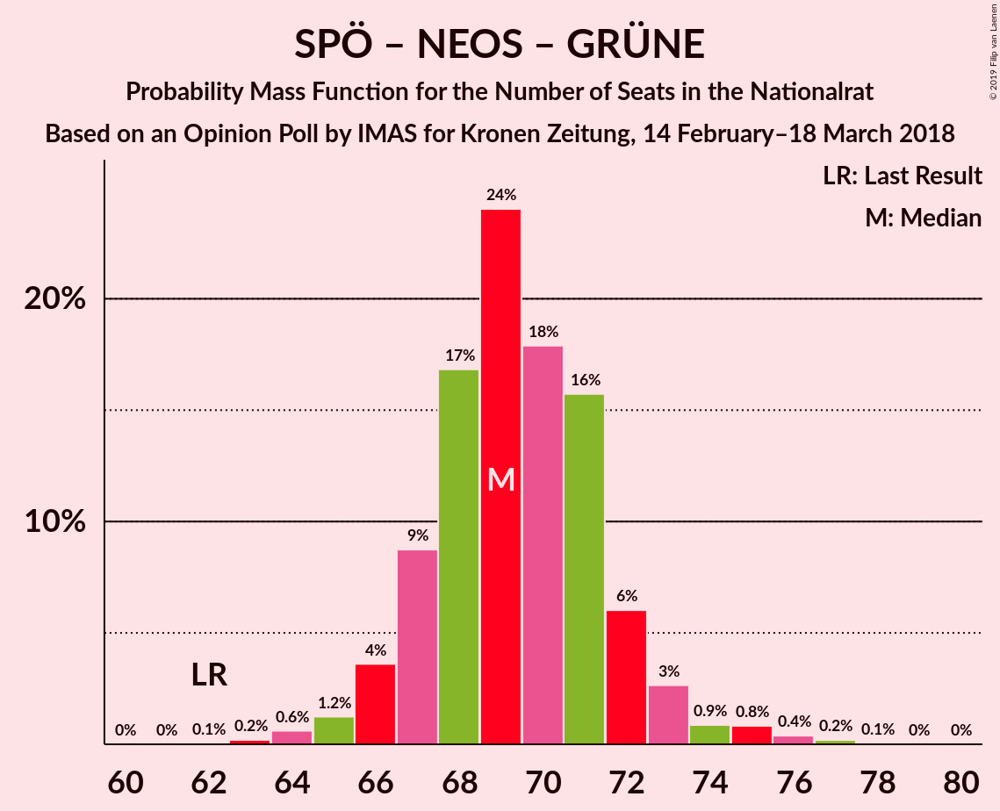
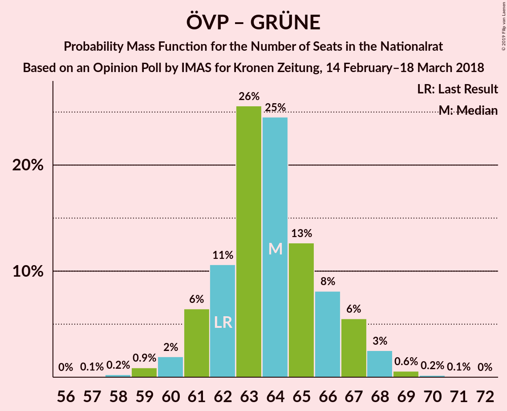

# Opinion Poll by IMAS for Kronen Zeitung, 14 February–18 March 2018

<a href="#voting-intentions">Voting Intentions</a> | <a href="#seats">Seats</a> | <a href="#coalitions">Coalitions</a> | <a href="#technical-information">Technical Information</a>

## Voting Intentions

### Confidence Intervals

| Party | Last Result | Poll Result | 80% Confidence Interval | 90% Confidence Interval | 95% Confidence Interval | 99% Confidence Interval |
|:-----:|:-----------:|:-----------:|:-----------------------:|:-----------------------:|:-----------------------:|:-----------------------:|
| Österreichische Volkspartei | 31.5% | 32.0% | 30.7–33.3% |30.3–33.7% |30.0–34.0% |29.4–34.7% |
| Sozialdemokratische Partei Österreichs | 26.9% | 28.0% | 26.7–29.3% |26.4–29.6% |26.1–30.0% |25.5–30.6% |
| Freiheitliche Partei Österreichs | 26.0% | 25.0% | 23.8–26.2% |23.5–26.6% |23.2–26.9% |22.6–27.5% |
| NEOS–Das Neue Österreich und Liberales Forum | 5.3% | 7.0% | 6.3–7.8% |6.1–8.0% |6.0–8.2% |5.7–8.6% |
| Die Grünen–Die Grüne Alternative | 3.8% | 3.0% | 2.6–3.5% |2.4–3.7% |2.3–3.8% |2.1–4.1% |
| JETZT–Liste Pilz | 4.4% | 2.0% | 1.6–2.4% |1.5–2.6% |1.5–2.7% |1.3–2.9% |

*Note:* The poll result column reflects the actual value used in the calculations. Published results may vary slightly, and in addition be rounded to fewer digits.

## Seats

### Confidence Intervals

| Party | Last Result | Median | 80% Confidence Interval | 90% Confidence Interval | 95% Confidence Interval | 99% Confidence Interval |
|:-----:|:-----------:|:------:|:-----------------------:|:-----------------------:|:-----------------------:|:-----------------------:|
| <a href="#österreichische-volkspartei">Österreichische Volkspartei</a> | 62 | 64 | 64 |64 |59–64 |59–69 |
| <a href="#sozialdemokratische-partei-österreichs">Sozialdemokratische Partei Österreichs</a> | 52 | 57 | 57 |55–57 |55–58 |50–58 |
| <a href="#freiheitliche-partei-österreichs">Freiheitliche Partei Österreichs</a> | 51 | 48 | 48 |48–53 |48–53 |46–53 |
| <a href="#neos–das-neue-österreich-und-liberales-forum">NEOS–Das Neue Österreich und Liberales Forum</a> | 10 | 14 | 14 |13–14 |11–14 |11–15 |
| <a href="#die-grünen–die-grüne-alternative">Die Grünen–Die Grüne Alternative</a> | 0 | 0 | 0 |0 |0 |0 |
| <a href="#jetzt–liste-pilz">JETZT–Liste Pilz</a> | 8 | 0 | 0 |0 |0 |0 |

### Österreichische Volkspartei

*For a full overview of the results for this party, see the [Österreichische Volkspartei](party-österreichischevolkspartei.html) page.*

| Number of Seats | Probability | Accumulated | Special Marks |
|:---------------:|:-----------:|:-----------:|:-------------:|
| 59 | 4% | 100% |  |
| 60 | 0% | 96% |  |
| 61 | 0.6% | 96% |  |
| 62 | 0% | 95% | Last Result |
| 63 | 0% | 95% |  |
| 64 | 94% | 95% | Median |
| 65 | 0% | 1.0% |  |
| 66 | 0.2% | 1.0% |  |
| 67 | 0% | 0.8% |  |
| 68 | 0.1% | 0.8% |  |
| 69 | 0.7% | 0.7% |  |
| 70 | 0% | 0% |  |

### Sozialdemokratische Partei Österreichs

*For a full overview of the results for this party, see the [Sozialdemokratische Partei Österreichs](party-sozialdemokratischeparteiösterreichs.html) page.*

| Number of Seats | Probability | Accumulated | Special Marks |
|:---------------:|:-----------:|:-----------:|:-------------:|
| 50 | 0.6% | 100% |  |
| 51 | 0.9% | 99.4% |  |
| 52 | 0% | 98% | Last Result |
| 53 | 0.1% | 98% |  |
| 54 | 0.2% | 98% |  |
| 55 | 4% | 98% |  |
| 56 | 0.1% | 94% |  |
| 57 | 90% | 94% | Median |
| 58 | 4% | 4% |  |
| 59 | 0% | 0.2% |  |
| 60 | 0.1% | 0.2% |  |
| 61 | 0% | 0.1% |  |
| 62 | 0.1% | 0.1% |  |
| 63 | 0% | 0% |  |

### Freiheitliche Partei Österreichs

*For a full overview of the results for this party, see the [Freiheitliche Partei Österreichs](party-freiheitlicheparteiösterreichs.html) page.*

| Number of Seats | Probability | Accumulated | Special Marks |
|:---------------:|:-----------:|:-----------:|:-------------:|
| 44 | 0% | 100% |  |
| 45 | 0% | 99.9% |  |
| 46 | 0.5% | 99.9% |  |
| 47 | 0.1% | 99.4% |  |
| 48 | 90% | 99.3% | Median |
| 49 | 0.6% | 9% |  |
| 50 | 0% | 9% |  |
| 51 | 0% | 9% | Last Result |
| 52 | 0% | 9% |  |
| 53 | 9% | 9% |  |
| 54 | 0% | 0% |  |

### NEOS–Das Neue Österreich und Liberales Forum

*For a full overview of the results for this party, see the [NEOS–Das Neue Österreich und Liberales Forum](party-neos–dasneueösterreichundliberalesforum.html) page.*

| Number of Seats | Probability | Accumulated | Special Marks |
|:---------------:|:-----------:|:-----------:|:-------------:|
| 10 | 0% | 100% | Last Result |
| 11 | 3% | 100% |  |
| 12 | 0.2% | 97% |  |
| 13 | 5% | 96% |  |
| 14 | 90% | 91% | Median |
| 15 | 1.4% | 2% |  |
| 16 | 0.2% | 0.3% |  |
| 17 | 0.1% | 0.1% |  |
| 18 | 0% | 0% |  |

### Die Grünen–Die Grüne Alternative

*For a full overview of the results for this party, see the [Die Grünen–Die Grüne Alternative](party-diegrünen–diegrünealternative.html) page.*

| Number of Seats | Probability | Accumulated | Special Marks |
|:---------------:|:-----------:|:-----------:|:-------------:|
| 0 | 100% | 100% | Last Result, Median |

### JETZT–Liste Pilz

*For a full overview of the results for this party, see the [JETZT–Liste Pilz](party-jetzt–listepilz.html) page.*

| Number of Seats | Probability | Accumulated | Special Marks |
|:---------------:|:-----------:|:-----------:|:-------------:|
| 0 | 100% | 100% | Median |
| 1 | 0% | 0% |  |
| 2 | 0% | 0% |  |
| 3 | 0% | 0% |  |
| 4 | 0% | 0% |  |
| 5 | 0% | 0% |  |
| 6 | 0% | 0% |  |
| 7 | 0% | 0% |  |
| 8 | 0% | 0% | Last Result |

## Coalitions

### Confidence Intervals

| Coalition | Last Result | Median | Majority? | 80% Confidence Interval | 90% Confidence Interval | 95% Confidence Interval | 99% Confidence Interval |
|:---------:|:-----------:|:------:|:---------:|:-----------------------:|:-----------------------:|:-----------------------:|:-----------------------:|
| Österreichische Volkspartei – Sozialdemokratische Partei Österreichs | 114 | 121 | 100% | 121 | 117–121 | 117–121 | 115–121 |
| Österreichische Volkspartei – Freiheitliche Partei Österreichs | 113 | 112 | 100% | 112 | 112–117 | 112–117 | 107–117 |
| Sozialdemokratische Partei Österreichs – Freiheitliche Partei Österreichs | 103 | 105 | 100% | 105 | 105–108 | 104–111 | 99–111 |
| Österreichische Volkspartei – NEOS–Das Neue Österreich und Liberales Forum – Die Grünen–Die Grüne Alternative | 72 | 78 | 0% | 78 | 75–78 | 72–78 | 72–84 |
| Österreichische Volkspartei – NEOS–Das Neue Österreich und Liberales Forum | 72 | 78 | 0% | 78 | 75–78 | 72–78 | 72–84 |
| Sozialdemokratische Partei Österreichs – NEOS–Das Neue Österreich und Liberales Forum – Die Grünen–Die Grüne Alternative | 62 | 71 | 0% | 71 | 66–71 | 66–71 | 66–71 |
| Österreichische Volkspartei – Die Grünen–Die Grüne Alternative | 62 | 64 | 0% | 64 | 64 | 59–64 | 59–69 |
| Österreichische Volkspartei | 62 | 64 | 0% | 64 | 64 | 59–64 | 59–69 |
| Sozialdemokratische Partei Österreichs | 52 | 57 | 0% | 57 | 55–57 | 55–58 | 50–58 |

### Österreichische Volkspartei – Sozialdemokratische Partei Österreichs

| Number of Seats | Probability | Accumulated | Special Marks |
|:---------------:|:-----------:|:-----------:|:-------------:|
| 113 | 0% | 100% |  |
| 114 | 0% | 99.9% | Last Result |
| 115 | 0.9% | 99.9% |  |
| 116 | 0.5% | 99.0% |  |
| 117 | 4% | 98% |  |
| 118 | 0.1% | 94% |  |
| 119 | 4% | 94% |  |
| 120 | 0% | 90% |  |
| 121 | 90% | 90% | Median |
| 122 | 0% | 0.4% |  |
| 123 | 0.3% | 0.4% |  |
| 124 | 0% | 0.1% |  |
| 125 | 0% | 0.1% |  |
| 126 | 0% | 0% |  |

### Österreichische Volkspartei – Freiheitliche Partei Österreichs

| Number of Seats | Probability | Accumulated | Special Marks |
|:---------------:|:-----------:|:-----------:|:-------------:|
| 107 | 0.6% | 100% |  |
| 108 | 0.1% | 99.4% |  |
| 109 | 0% | 99.3% |  |
| 110 | 0.1% | 99.3% |  |
| 111 | 0% | 99.2% |  |
| 112 | 94% | 99.2% | Median |
| 113 | 0.1% | 5% | Last Result |
| 114 | 0.2% | 5% |  |
| 115 | 0% | 5% |  |
| 116 | 0% | 5% |  |
| 117 | 5% | 5% |  |
| 118 | 0.4% | 0.4% |  |
| 119 | 0% | 0% |  |

### Sozialdemokratische Partei Österreichs – Freiheitliche Partei Österreichs

| Number of Seats | Probability | Accumulated | Special Marks |
|:---------------:|:-----------:|:-----------:|:-------------:|
| 99 | 0.6% | 100% |  |
| 100 | 0% | 99.4% |  |
| 101 | 0.5% | 99.4% |  |
| 102 | 0.3% | 98.9% |  |
| 103 | 0.2% | 98.6% | Last Result |
| 104 | 1.0% | 98% |  |
| 105 | 90% | 97% | Median |
| 106 | 0% | 8% |  |
| 107 | 0% | 8% |  |
| 108 | 4% | 8% |  |
| 109 | 0.1% | 4% |  |
| 110 | 0% | 4% |  |
| 111 | 4% | 4% |  |
| 112 | 0% | 0% |  |

### Österreichische Volkspartei – NEOS–Das Neue Österreich und Liberales Forum – Die Grünen–Die Grüne Alternative

| Number of Seats | Probability | Accumulated | Special Marks |
|:---------------:|:-----------:|:-----------:|:-------------:|
| 72 | 4% | 100% | Last Result |
| 73 | 0% | 96% |  |
| 74 | 0.6% | 96% |  |
| 75 | 4% | 95% |  |
| 76 | 0% | 92% |  |
| 77 | 0% | 92% |  |
| 78 | 90% | 92% | Median |
| 79 | 1.0% | 2% |  |
| 80 | 0.2% | 1.1% |  |
| 81 | 0.3% | 0.9% |  |
| 82 | 0% | 0.6% |  |
| 83 | 0% | 0.6% |  |
| 84 | 0.6% | 0.6% |  |
| 85 | 0% | 0% |  |

### Österreichische Volkspartei – NEOS–Das Neue Österreich und Liberales Forum

| Number of Seats | Probability | Accumulated | Special Marks |
|:---------------:|:-----------:|:-----------:|:-------------:|
| 72 | 4% | 100% | Last Result |
| 73 | 0% | 96% |  |
| 74 | 0.6% | 96% |  |
| 75 | 4% | 95% |  |
| 76 | 0% | 92% |  |
| 77 | 0% | 92% |  |
| 78 | 90% | 92% | Median |
| 79 | 1.0% | 2% |  |
| 80 | 0.2% | 1.1% |  |
| 81 | 0.3% | 0.9% |  |
| 82 | 0% | 0.6% |  |
| 83 | 0% | 0.6% |  |
| 84 | 0.6% | 0.6% |  |
| 85 | 0% | 0% |  |

### Sozialdemokratische Partei Österreichs – NEOS–Das Neue Österreich und Liberales Forum – Die Grünen–Die Grüne Alternative

| Number of Seats | Probability | Accumulated | Special Marks |
|:---------------:|:-----------:|:-----------:|:-------------:|
| 62 | 0% | 100% | Last Result |
| 63 | 0% | 100% |  |
| 64 | 0% | 100% |  |
| 65 | 0.4% | 100% |  |
| 66 | 5% | 99.5% |  |
| 67 | 0% | 95% |  |
| 68 | 0.5% | 95% |  |
| 69 | 0.2% | 94% |  |
| 70 | 0.1% | 94% |  |
| 71 | 94% | 94% | Median |
| 72 | 0% | 0.3% |  |
| 73 | 0.1% | 0.3% |  |
| 74 | 0% | 0.2% |  |
| 75 | 0.1% | 0.2% |  |
| 76 | 0.1% | 0.1% |  |
| 77 | 0% | 0% |  |

### Österreichische Volkspartei – Die Grünen–Die Grüne Alternative

| Number of Seats | Probability | Accumulated | Special Marks |
|:---------------:|:-----------:|:-----------:|:-------------:|
| 59 | 4% | 100% |  |
| 60 | 0% | 96% |  |
| 61 | 0.6% | 96% |  |
| 62 | 0% | 95% | Last Result |
| 63 | 0% | 95% |  |
| 64 | 94% | 95% | Median |
| 65 | 0% | 1.1% |  |
| 66 | 0.2% | 1.1% |  |
| 67 | 0% | 0.9% |  |
| 68 | 0.1% | 0.9% |  |
| 69 | 0.7% | 0.7% |  |
| 70 | 0% | 0% |  |

### Österreichische Volkspartei

| Number of Seats | Probability | Accumulated | Special Marks |
|:---------------:|:-----------:|:-----------:|:-------------:|
| 59 | 4% | 100% |  |
| 60 | 0% | 96% |  |
| 61 | 0.6% | 96% |  |
| 62 | 0% | 95% | Last Result |
| 63 | 0% | 95% |  |
| 64 | 94% | 95% | Median |
| 65 | 0% | 1.0% |  |
| 66 | 0.2% | 1.0% |  |
| 67 | 0% | 0.8% |  |
| 68 | 0.1% | 0.8% |  |
| 69 | 0.7% | 0.7% |  |
| 70 | 0% | 0% |  |

### Sozialdemokratische Partei Österreichs

| Number of Seats | Probability | Accumulated | Special Marks |
|:---------------:|:-----------:|:-----------:|:-------------:|
| 50 | 0.6% | 100% |  |
| 51 | 0.9% | 99.4% |  |
| 52 | 0% | 98% | Last Result |
| 53 | 0.1% | 98% |  |
| 54 | 0.2% | 98% |  |
| 55 | 4% | 98% |  |
| 56 | 0.1% | 94% |  |
| 57 | 90% | 94% | Median |
| 58 | 4% | 4% |  |
| 59 | 0% | 0.2% |  |
| 60 | 0.1% | 0.2% |  |
| 61 | 0% | 0.1% |  |
| 62 | 0.1% | 0.1% |  |
| 63 | 0% | 0% |  |

## Technical Information

### Opinion Poll

+ **Polling firm:** IMAS
+ **Commissioner(s):** Kronen Zeitung
+ **Fieldwork period:** 14 February–18 March 2018

### Calculations

+ **Sample size:** 2073
+ **Simulations done:** 1,024
+ **Error estimate:** 2.38%

