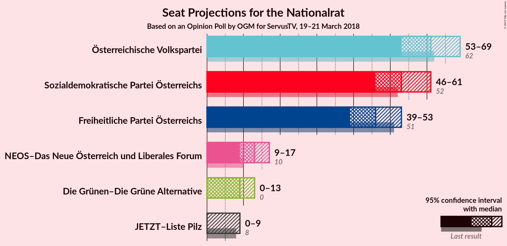
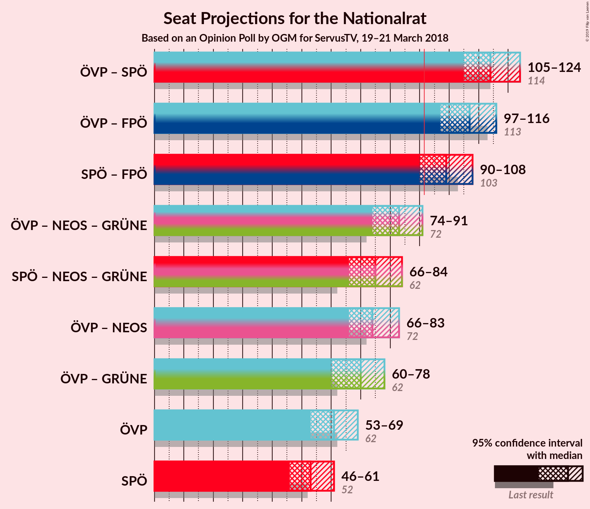
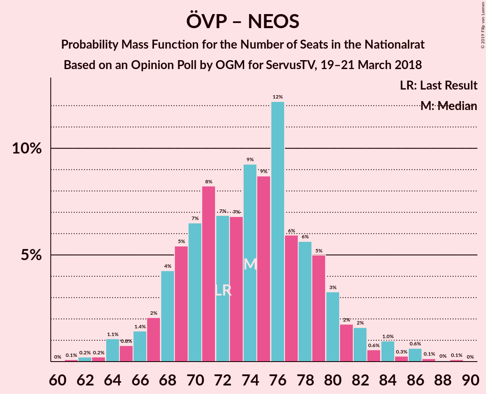
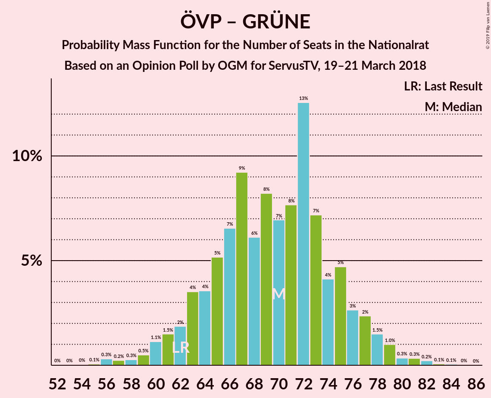

# Opinion Poll by OGM for ServusTV, 19–21 March 2018

<a href="#voting-intentions">Voting Intentions</a> | <a href="#seats">Seats</a> | <a href="#coalitions">Coalitions</a> | <a href="#technical-information">Technical Information</a>

## Voting Intentions

### Confidence Intervals

| Party | Last Result | Poll Result | 80% Confidence Interval | 90% Confidence Interval | 95% Confidence Interval | 99% Confidence Interval |
|:-----:|:-----------:|:-----------:|:-----------------------:|:-----------------------:|:-----------------------:|:-----------------------:|
| Österreichische Volkspartei | 31.5% | 32.0% | 29.4–34.7% |28.7–35.5% |28.1–36.1% |26.9–37.4% |
| Sozialdemokratische Partei Österreichs | 26.9% | 27.9% | 25.5–30.6% |24.8–31.3% |24.2–32.0% |23.1–33.2% |
| Freiheitliche Partei Österreichs | 26.0% | 24.1% | 21.8–26.6% |21.2–27.3% |20.6–28.0% |19.5–29.2% |
| NEOS–Das Neue Österreich und Liberales Forum | 5.3% | 6.9% | 5.7–8.6% |5.3–9.1% |5.0–9.5% |4.5–10.3% |
| Die Grünen–Die Grüne Alternative | 3.8% | 5.0% | 4.0–6.5% |3.7–6.9% |3.4–7.3% |3.0–8.0% |
| JETZT–Liste Pilz | 4.4% | 3.1% | 2.3–4.3% |2.1–4.6% |1.9–5.0% |1.6–5.6% |

*Note:* The poll result column reflects the actual value used in the calculations. Published results may vary slightly, and in addition be rounded to fewer digits.

## Seats

### Confidence Intervals

| Party | Last Result | Median | 80% Confidence Interval | 90% Confidence Interval | 95% Confidence Interval | 99% Confidence Interval |
|:-----:|:-----------:|:------:|:-----------------------:|:-----------------------:|:-----------------------:|:-----------------------:|
| <a href="#österreichische-volkspartei">Österreichische Volkspartei</a> | 62 | 61 | 56–66 |54–67 |53–69 |51–73 |
| <a href="#sozialdemokratische-partei-österreichs">Sozialdemokratische Partei Österreichs</a> | 52 | 53 | 48–58 |47–59 |46–61 |43–63 |
| <a href="#freiheitliche-partei-österreichs">Freiheitliche Partei Österreichs</a> | 51 | 46 | 41–51 |40–52 |39–53 |37–56 |
| <a href="#neos–das-neue-österreich-und-liberales-forum">NEOS–Das Neue Österreich und Liberales Forum</a> | 10 | 13 | 10–16 |10–17 |9–17 |8–19 |
| <a href="#die-grünen–die-grüne-alternative">Die Grünen–Die Grüne Alternative</a> | 0 | 9 | 0–12 |0–13 |0–13 |0–15 |
| <a href="#jetzt–liste-pilz">JETZT–Liste Pilz</a> | 8 | 0 | 0–7 |0–8 |0–9 |0–10 |

### Österreichische Volkspartei

*For a full overview of the results for this party, see the [Österreichische Volkspartei](party-österreichischevolkspartei.html) page.*

| Number of Seats | Probability | Accumulated | Special Marks |
|:---------------:|:-----------:|:-----------:|:-------------:|
| 48 | 0% | 100% |  |
| 49 | 0.1% | 99.9% |  |
| 50 | 0.3% | 99.8% |  |
| 51 | 0.5% | 99.6% |  |
| 52 | 0.7% | 99.1% |  |
| 53 | 2% | 98% |  |
| 54 | 2% | 97% |  |
| 55 | 3% | 94% |  |
| 56 | 5% | 91% |  |
| 57 | 7% | 87% |  |
| 58 | 9% | 79% |  |
| 59 | 9% | 70% |  |
| 60 | 6% | 61% |  |
| 61 | 10% | 56% | Median |
| 62 | 14% | 46% | Last Result |
| 63 | 6% | 32% |  |
| 64 | 6% | 25% |  |
| 65 | 6% | 20% |  |
| 66 | 6% | 13% |  |
| 67 | 3% | 8% |  |
| 68 | 2% | 5% |  |
| 69 | 0.9% | 3% |  |
| 70 | 0.8% | 2% |  |
| 71 | 0.3% | 1.3% |  |
| 72 | 0.4% | 1.0% |  |
| 73 | 0.4% | 0.6% |  |
| 74 | 0.1% | 0.2% |  |
| 75 | 0% | 0.1% |  |
| 76 | 0% | 0% |  |

### Sozialdemokratische Partei Österreichs

*For a full overview of the results for this party, see the [Sozialdemokratische Partei Österreichs](party-sozialdemokratischeparteiösterreichs.html) page.*

| Number of Seats | Probability | Accumulated | Special Marks |
|:---------------:|:-----------:|:-----------:|:-------------:|
| 41 | 0.1% | 100% |  |
| 42 | 0.1% | 99.9% |  |
| 43 | 0.3% | 99.8% |  |
| 44 | 0.5% | 99.5% |  |
| 45 | 1.2% | 99.0% |  |
| 46 | 2% | 98% |  |
| 47 | 3% | 95% |  |
| 48 | 4% | 92% |  |
| 49 | 7% | 89% |  |
| 50 | 8% | 81% |  |
| 51 | 8% | 73% |  |
| 52 | 9% | 65% | Last Result |
| 53 | 11% | 57% | Median |
| 54 | 11% | 45% |  |
| 55 | 9% | 34% |  |
| 56 | 6% | 25% |  |
| 57 | 5% | 19% |  |
| 58 | 5% | 14% |  |
| 59 | 5% | 10% |  |
| 60 | 2% | 5% |  |
| 61 | 1.3% | 3% |  |
| 62 | 1.0% | 2% |  |
| 63 | 0.5% | 1.0% |  |
| 64 | 0.2% | 0.5% |  |
| 65 | 0.1% | 0.3% |  |
| 66 | 0.1% | 0.2% |  |
| 67 | 0% | 0.1% |  |
| 68 | 0% | 0% |  |

### Freiheitliche Partei Österreichs

*For a full overview of the results for this party, see the [Freiheitliche Partei Österreichs](party-freiheitlicheparteiösterreichs.html) page.*

| Number of Seats | Probability | Accumulated | Special Marks |
|:---------------:|:-----------:|:-----------:|:-------------:|
| 35 | 0.1% | 100% |  |
| 36 | 0.3% | 99.9% |  |
| 37 | 0.5% | 99.6% |  |
| 38 | 1.2% | 99.1% |  |
| 39 | 2% | 98% |  |
| 40 | 2% | 95% |  |
| 41 | 5% | 93% |  |
| 42 | 7% | 88% |  |
| 43 | 6% | 81% |  |
| 44 | 10% | 74% |  |
| 45 | 11% | 64% |  |
| 46 | 10% | 53% | Median |
| 47 | 12% | 43% |  |
| 48 | 7% | 31% |  |
| 49 | 8% | 24% |  |
| 50 | 5% | 15% |  |
| 51 | 3% | 10% | Last Result |
| 52 | 3% | 7% |  |
| 53 | 2% | 4% |  |
| 54 | 0.9% | 2% |  |
| 55 | 0.6% | 1.3% |  |
| 56 | 0.3% | 0.7% |  |
| 57 | 0.3% | 0.5% |  |
| 58 | 0.1% | 0.2% |  |
| 59 | 0% | 0.1% |  |
| 60 | 0% | 0% |  |

### NEOS–Das Neue Österreich und Liberales Forum

*For a full overview of the results for this party, see the [NEOS–Das Neue Österreich und Liberales Forum](party-neos–dasneueösterreichundliberalesforum.html) page.*

| Number of Seats | Probability | Accumulated | Special Marks |
|:---------------:|:-----------:|:-----------:|:-------------:|
| 0 | 0.1% | 100% |  |
| 1 | 0% | 99.9% |  |
| 2 | 0% | 99.9% |  |
| 3 | 0% | 99.9% |  |
| 4 | 0% | 99.9% |  |
| 5 | 0% | 99.9% |  |
| 6 | 0% | 99.9% |  |
| 7 | 0.1% | 99.9% |  |
| 8 | 0.6% | 99.8% |  |
| 9 | 4% | 99.3% |  |
| 10 | 6% | 96% | Last Result |
| 11 | 14% | 90% |  |
| 12 | 19% | 76% |  |
| 13 | 15% | 57% | Median |
| 14 | 20% | 43% |  |
| 15 | 9% | 23% |  |
| 16 | 7% | 14% |  |
| 17 | 5% | 7% |  |
| 18 | 1.1% | 2% |  |
| 19 | 0.8% | 1.2% |  |
| 20 | 0.3% | 0.4% |  |
| 21 | 0.1% | 0.1% |  |
| 22 | 0% | 0% |  |

### Die Grünen–Die Grüne Alternative

*For a full overview of the results for this party, see the [Die Grünen–Die Grüne Alternative](party-diegrünen–diegrünealternative.html) page.*

| Number of Seats | Probability | Accumulated | Special Marks |
|:---------------:|:-----------:|:-----------:|:-------------:|
| 0 | 10% | 100% | Last Result |
| 1 | 0% | 90% |  |
| 2 | 0% | 90% |  |
| 3 | 0% | 90% |  |
| 4 | 0% | 90% |  |
| 5 | 0% | 90% |  |
| 6 | 0% | 90% |  |
| 7 | 8% | 90% |  |
| 8 | 16% | 82% |  |
| 9 | 20% | 66% | Median |
| 10 | 22% | 47% |  |
| 11 | 13% | 25% |  |
| 12 | 6% | 11% |  |
| 13 | 3% | 5% |  |
| 14 | 2% | 2% |  |
| 15 | 0.6% | 0.7% |  |
| 16 | 0.1% | 0.2% |  |
| 17 | 0.1% | 0.1% |  |
| 18 | 0% | 0% |  |

### JETZT–Liste Pilz

*For a full overview of the results for this party, see the [JETZT–Liste Pilz](party-jetzt–listepilz.html) page.*

| Number of Seats | Probability | Accumulated | Special Marks |
|:---------------:|:-----------:|:-----------:|:-------------:|
| 0 | 81% | 100% | Median |
| 1 | 0% | 19% |  |
| 2 | 0% | 19% |  |
| 3 | 0% | 19% |  |
| 4 | 0% | 19% |  |
| 5 | 0% | 19% |  |
| 6 | 0% | 19% |  |
| 7 | 10% | 19% |  |
| 8 | 5% | 9% | Last Result |
| 9 | 3% | 4% |  |
| 10 | 0.4% | 0.8% |  |
| 11 | 0.3% | 0.3% |  |
| 12 | 0% | 0% |  |

## Coalitions

### Confidence Intervals

| Coalition | Last Result | Median | Majority? | 80% Confidence Interval | 90% Confidence Interval | 95% Confidence Interval | 99% Confidence Interval |
|:---------:|:-----------:|:------:|:---------:|:-----------------------:|:-----------------------:|:-----------------------:|:-----------------------:|
| Österreichische Volkspartei – Sozialdemokratische Partei Österreichs | 114 | 114 | 100% | 108–120 | 106–122 | 105–124 | 102–127 |
| Österreichische Volkspartei – Freiheitliche Partei Österreichs | 113 | 107 | 100% | 101–112 | 99–114 | 97–116 | 94–119 |
| Sozialdemokratische Partei Österreichs – Freiheitliche Partei Österreichs | 103 | 99 | 94% | 93–106 | 91–106 | 90–108 | 87–112 |
| Österreichische Volkspartei – NEOS–Das Neue Österreich und Liberales Forum – Die Grünen–Die Grüne Alternative | 72 | 83 | 2% | 77–88 | 75–90 | 74–91 | 70–94 |
| Sozialdemokratische Partei Österreichs – NEOS–Das Neue Österreich und Liberales Forum – Die Grünen–Die Grüne Alternative | 62 | 75 | 0% | 69–80 | 67–82 | 66–84 | 62–86 |
| Österreichische Volkspartei – NEOS–Das Neue Österreich und Liberales Forum | 72 | 74 | 0% | 68–79 | 67–81 | 66–83 | 63–86 |
| Österreichische Volkspartei – Die Grünen–Die Grüne Alternative | 62 | 70 | 0% | 64–75 | 62–77 | 60–78 | 57–81 |
| Österreichische Volkspartei | 62 | 61 | 0% | 56–66 | 54–67 | 53–69 | 51–73 |
| Sozialdemokratische Partei Österreichs | 52 | 53 | 0% | 48–58 | 47–59 | 46–61 | 43–63 |

### Österreichische Volkspartei – Sozialdemokratische Partei Österreichs

| Number of Seats | Probability | Accumulated | Special Marks |
|:---------------:|:-----------:|:-----------:|:-------------:|
| 99 | 0% | 100% |  |
| 100 | 0.1% | 99.9% |  |
| 101 | 0.2% | 99.8% |  |
| 102 | 0.3% | 99.7% |  |
| 103 | 0.6% | 99.4% |  |
| 104 | 1.0% | 98.8% |  |
| 105 | 1.5% | 98% |  |
| 106 | 2% | 96% |  |
| 107 | 2% | 95% |  |
| 108 | 5% | 92% |  |
| 109 | 5% | 87% |  |
| 110 | 5% | 82% |  |
| 111 | 6% | 77% |  |
| 112 | 8% | 71% |  |
| 113 | 11% | 63% |  |
| 114 | 5% | 52% | Last Result, Median |
| 115 | 11% | 46% |  |
| 116 | 8% | 36% |  |
| 117 | 6% | 28% |  |
| 118 | 5% | 22% |  |
| 119 | 6% | 17% |  |
| 120 | 3% | 12% |  |
| 121 | 3% | 9% |  |
| 122 | 1.1% | 6% |  |
| 123 | 1.3% | 5% |  |
| 124 | 2% | 3% |  |
| 125 | 0.5% | 1.5% |  |
| 126 | 0.3% | 1.0% |  |
| 127 | 0.3% | 0.7% |  |
| 128 | 0.2% | 0.4% |  |
| 129 | 0.1% | 0.2% |  |
| 130 | 0% | 0.1% |  |
| 131 | 0% | 0% |  |

### Österreichische Volkspartei – Freiheitliche Partei Österreichs

| Number of Seats | Probability | Accumulated | Special Marks |
|:---------------:|:-----------:|:-----------:|:-------------:|
| 92 | 0.1% | 100% | Majority |
| 93 | 0.2% | 99.9% |  |
| 94 | 0.2% | 99.7% |  |
| 95 | 0.6% | 99.5% |  |
| 96 | 0.6% | 98.9% |  |
| 97 | 1.1% | 98% |  |
| 98 | 1.1% | 97% |  |
| 99 | 3% | 96% |  |
| 100 | 3% | 93% |  |
| 101 | 3% | 90% |  |
| 102 | 4% | 87% |  |
| 103 | 5% | 84% |  |
| 104 | 7% | 78% |  |
| 105 | 10% | 71% |  |
| 106 | 10% | 61% |  |
| 107 | 11% | 51% | Median |
| 108 | 5% | 40% |  |
| 109 | 7% | 36% |  |
| 110 | 9% | 28% |  |
| 111 | 5% | 19% |  |
| 112 | 5% | 14% |  |
| 113 | 3% | 10% | Last Result |
| 114 | 1.4% | 6% |  |
| 115 | 2% | 5% |  |
| 116 | 1.1% | 3% |  |
| 117 | 1.4% | 2% |  |
| 118 | 0.1% | 1.0% |  |
| 119 | 0.5% | 0.8% |  |
| 120 | 0% | 0.3% |  |
| 121 | 0.2% | 0.3% |  |
| 122 | 0.1% | 0.1% |  |
| 123 | 0% | 0.1% |  |
| 124 | 0% | 0.1% |  |
| 125 | 0% | 0% |  |

### Sozialdemokratische Partei Österreichs – Freiheitliche Partei Österreichs

| Number of Seats | Probability | Accumulated | Special Marks |
|:---------------:|:-----------:|:-----------:|:-------------:|
| 84 | 0% | 100% |  |
| 85 | 0.1% | 99.9% |  |
| 86 | 0.1% | 99.8% |  |
| 87 | 0.4% | 99.7% |  |
| 88 | 0.6% | 99.3% |  |
| 89 | 0.6% | 98.7% |  |
| 90 | 1.2% | 98% |  |
| 91 | 3% | 97% |  |
| 92 | 3% | 94% | Majority |
| 93 | 4% | 91% |  |
| 94 | 3% | 87% |  |
| 95 | 6% | 84% |  |
| 96 | 7% | 78% |  |
| 97 | 13% | 71% |  |
| 98 | 8% | 58% |  |
| 99 | 7% | 51% | Median |
| 100 | 8% | 44% |  |
| 101 | 7% | 35% |  |
| 102 | 4% | 28% |  |
| 103 | 7% | 25% | Last Result |
| 104 | 5% | 17% |  |
| 105 | 2% | 12% |  |
| 106 | 5% | 10% |  |
| 107 | 2% | 5% |  |
| 108 | 0.9% | 3% |  |
| 109 | 0.8% | 2% |  |
| 110 | 0.3% | 1.1% |  |
| 111 | 0.3% | 0.8% |  |
| 112 | 0.2% | 0.5% |  |
| 113 | 0.2% | 0.4% |  |
| 114 | 0.1% | 0.2% |  |
| 115 | 0% | 0.1% |  |
| 116 | 0% | 0.1% |  |
| 117 | 0% | 0% |  |

### Österreichische Volkspartei – NEOS–Das Neue Österreich und Liberales Forum – Die Grünen–Die Grüne Alternative

| Number of Seats | Probability | Accumulated | Special Marks |
|:---------------:|:-----------:|:-----------:|:-------------:|
| 66 | 0% | 100% |  |
| 67 | 0.1% | 99.9% |  |
| 68 | 0% | 99.8% |  |
| 69 | 0.1% | 99.8% |  |
| 70 | 0.3% | 99.6% |  |
| 71 | 0.2% | 99.4% |  |
| 72 | 0.4% | 99.2% | Last Result |
| 73 | 0.6% | 98.8% |  |
| 74 | 1.3% | 98% |  |
| 75 | 3% | 97% |  |
| 76 | 3% | 94% |  |
| 77 | 6% | 91% |  |
| 78 | 4% | 85% |  |
| 79 | 7% | 81% |  |
| 80 | 8% | 74% |  |
| 81 | 5% | 66% |  |
| 82 | 8% | 61% |  |
| 83 | 9% | 53% | Median |
| 84 | 7% | 45% |  |
| 85 | 8% | 37% |  |
| 86 | 11% | 30% |  |
| 87 | 6% | 19% |  |
| 88 | 5% | 13% |  |
| 89 | 2% | 8% |  |
| 90 | 2% | 6% |  |
| 91 | 2% | 4% |  |
| 92 | 1.0% | 2% | Majority |
| 93 | 0.6% | 1.4% |  |
| 94 | 0.4% | 0.7% |  |
| 95 | 0.2% | 0.4% |  |
| 96 | 0.1% | 0.2% |  |
| 97 | 0% | 0.1% |  |
| 98 | 0% | 0% |  |

### Sozialdemokratische Partei Österreichs – NEOS–Das Neue Österreich und Liberales Forum – Die Grünen–Die Grüne Alternative

| Number of Seats | Probability | Accumulated | Special Marks |
|:---------------:|:-----------:|:-----------:|:-------------:|
| 59 | 0.1% | 100% |  |
| 60 | 0% | 99.9% |  |
| 61 | 0.3% | 99.9% |  |
| 62 | 0.2% | 99.6% | Last Result |
| 63 | 0.2% | 99.4% |  |
| 64 | 0.6% | 99.2% |  |
| 65 | 0.5% | 98.6% |  |
| 66 | 3% | 98% |  |
| 67 | 2% | 95% |  |
| 68 | 3% | 94% |  |
| 69 | 2% | 91% |  |
| 70 | 4% | 89% |  |
| 71 | 7% | 85% |  |
| 72 | 8% | 78% |  |
| 73 | 9% | 70% |  |
| 74 | 8% | 61% |  |
| 75 | 4% | 54% | Median |
| 76 | 11% | 49% |  |
| 77 | 11% | 38% |  |
| 78 | 9% | 27% |  |
| 79 | 5% | 19% |  |
| 80 | 4% | 14% |  |
| 81 | 2% | 9% |  |
| 82 | 3% | 7% |  |
| 83 | 2% | 4% |  |
| 84 | 1.4% | 3% |  |
| 85 | 0.4% | 1.2% |  |
| 86 | 0.3% | 0.7% |  |
| 87 | 0.2% | 0.4% |  |
| 88 | 0.1% | 0.2% |  |
| 89 | 0.1% | 0.1% |  |
| 90 | 0% | 0% |  |

### Österreichische Volkspartei – NEOS–Das Neue Österreich und Liberales Forum

| Number of Seats | Probability | Accumulated | Special Marks |
|:---------------:|:-----------:|:-----------:|:-------------:|
| 60 | 0% | 100% |  |
| 61 | 0.1% | 99.9% |  |
| 62 | 0.2% | 99.9% |  |
| 63 | 0.2% | 99.6% |  |
| 64 | 1.1% | 99.4% |  |
| 65 | 0.8% | 98% |  |
| 66 | 1.4% | 98% |  |
| 67 | 2% | 96% |  |
| 68 | 4% | 94% |  |
| 69 | 5% | 90% |  |
| 70 | 7% | 84% |  |
| 71 | 8% | 78% |  |
| 72 | 7% | 70% | Last Result |
| 73 | 7% | 63% |  |
| 74 | 9% | 56% | Median |
| 75 | 9% | 47% |  |
| 76 | 12% | 38% |  |
| 77 | 6% | 26% |  |
| 78 | 6% | 20% |  |
| 79 | 5% | 14% |  |
| 80 | 3% | 9% |  |
| 81 | 2% | 6% |  |
| 82 | 2% | 4% |  |
| 83 | 0.6% | 3% |  |
| 84 | 1.0% | 2% |  |
| 85 | 0.3% | 1.2% |  |
| 86 | 0.6% | 0.9% |  |
| 87 | 0.1% | 0.3% |  |
| 88 | 0% | 0.2% |  |
| 89 | 0.1% | 0.1% |  |
| 90 | 0% | 0% |  |

### Österreichische Volkspartei – Die Grünen–Die Grüne Alternative

| Number of Seats | Probability | Accumulated | Special Marks |
|:---------------:|:-----------:|:-----------:|:-------------:|
| 53 | 0% | 100% |  |
| 54 | 0% | 99.9% |  |
| 55 | 0.1% | 99.9% |  |
| 56 | 0.3% | 99.8% |  |
| 57 | 0.2% | 99.5% |  |
| 58 | 0.3% | 99.3% |  |
| 59 | 0.5% | 99.0% |  |
| 60 | 1.1% | 98.5% |  |
| 61 | 1.5% | 97% |  |
| 62 | 2% | 96% | Last Result |
| 63 | 4% | 94% |  |
| 64 | 4% | 91% |  |
| 65 | 5% | 87% |  |
| 66 | 7% | 82% |  |
| 67 | 9% | 75% |  |
| 68 | 6% | 66% |  |
| 69 | 8% | 60% |  |
| 70 | 7% | 52% | Median |
| 71 | 8% | 45% |  |
| 72 | 13% | 37% |  |
| 73 | 7% | 25% |  |
| 74 | 4% | 17% |  |
| 75 | 5% | 13% |  |
| 76 | 3% | 9% |  |
| 77 | 2% | 6% |  |
| 78 | 1.5% | 4% |  |
| 79 | 1.0% | 2% |  |
| 80 | 0.3% | 1.0% |  |
| 81 | 0.3% | 0.7% |  |
| 82 | 0.2% | 0.4% |  |
| 83 | 0.1% | 0.1% |  |
| 84 | 0.1% | 0.1% |  |
| 85 | 0% | 0% |  |

### Österreichische Volkspartei

| Number of Seats | Probability | Accumulated | Special Marks |
|:---------------:|:-----------:|:-----------:|:-------------:|
| 48 | 0% | 100% |  |
| 49 | 0.1% | 99.9% |  |
| 50 | 0.3% | 99.8% |  |
| 51 | 0.5% | 99.6% |  |
| 52 | 0.7% | 99.1% |  |
| 53 | 2% | 98% |  |
| 54 | 2% | 97% |  |
| 55 | 3% | 94% |  |
| 56 | 5% | 91% |  |
| 57 | 7% | 87% |  |
| 58 | 9% | 79% |  |
| 59 | 9% | 70% |  |
| 60 | 6% | 61% |  |
| 61 | 10% | 56% | Median |
| 62 | 14% | 46% | Last Result |
| 63 | 6% | 32% |  |
| 64 | 6% | 25% |  |
| 65 | 6% | 20% |  |
| 66 | 6% | 13% |  |
| 67 | 3% | 8% |  |
| 68 | 2% | 5% |  |
| 69 | 0.9% | 3% |  |
| 70 | 0.8% | 2% |  |
| 71 | 0.3% | 1.3% |  |
| 72 | 0.4% | 1.0% |  |
| 73 | 0.4% | 0.6% |  |
| 74 | 0.1% | 0.2% |  |
| 75 | 0% | 0.1% |  |
| 76 | 0% | 0% |  |

### Sozialdemokratische Partei Österreichs

| Number of Seats | Probability | Accumulated | Special Marks |
|:---------------:|:-----------:|:-----------:|:-------------:|
| 41 | 0.1% | 100% |  |
| 42 | 0.1% | 99.9% |  |
| 43 | 0.3% | 99.8% |  |
| 44 | 0.5% | 99.5% |  |
| 45 | 1.2% | 99.0% |  |
| 46 | 2% | 98% |  |
| 47 | 3% | 95% |  |
| 48 | 4% | 92% |  |
| 49 | 7% | 89% |  |
| 50 | 8% | 81% |  |
| 51 | 8% | 73% |  |
| 52 | 9% | 65% | Last Result |
| 53 | 11% | 57% | Median |
| 54 | 11% | 45% |  |
| 55 | 9% | 34% |  |
| 56 | 6% | 25% |  |
| 57 | 5% | 19% |  |
| 58 | 5% | 14% |  |
| 59 | 5% | 10% |  |
| 60 | 2% | 5% |  |
| 61 | 1.3% | 3% |  |
| 62 | 1.0% | 2% |  |
| 63 | 0.5% | 1.0% |  |
| 64 | 0.2% | 0.5% |  |
| 65 | 0.1% | 0.3% |  |
| 66 | 0.1% | 0.2% |  |
| 67 | 0% | 0.1% |  |
| 68 | 0% | 0% |  |

## Technical Information

### Opinion Poll

+ **Polling firm:** OGM
+ **Commissioner(s):** ServusTV
+ **Fieldwork period:** 19–21 March 2018

### Calculations

+ **Sample size:** 519
+ **Simulations done:** 131,072
+ **Error estimate:** 2.65%

