# Opinion Poll by Research Affairs for ÖSTERREICH, 14–21 March 2018

<a href="#voting-intentions">Voting Intentions</a> | <a href="#seats">Seats</a> | <a href="#coalitions">Coalitions</a> | <a href="#technical-information">Technical Information</a>

## Voting Intentions

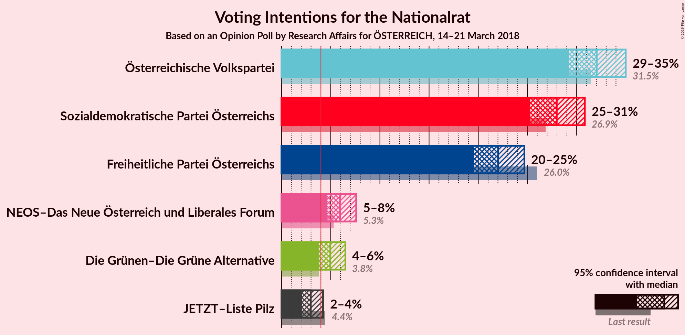

### Confidence Intervals

| Party | Last Result | Poll Result | 80% Confidence Interval | 90% Confidence Interval | 95% Confidence Interval | 99% Confidence Interval |
|:-----:|:-----------:|:-----------:|:-----------------------:|:-----------------------:|:-----------------------:|:-----------------------:|
| Österreichische Volkspartei | 31.5% | 32.0% | 30.2–34.0% |29.7–34.5% |29.2–35.0% |28.4–35.9% |
| Sozialdemokratische Partei Österreichs | 26.9% | 28.0% | 26.2–29.8% |25.7–30.4% |25.3–30.8% |24.5–31.7% |
| Freiheitliche Partei Österreichs | 26.0% | 22.0% | 20.4–23.8% |20.0–24.3% |19.6–24.7% |18.8–25.5% |
| NEOS–Das Neue Österreich und Liberales Forum | 5.3% | 6.0% | 5.1–7.0% |4.8–7.3% |4.6–7.6% |4.3–8.1% |
| Die Grünen–Die Grüne Alternative | 3.8% | 5.0% | 4.2–6.0% |4.0–6.2% |3.8–6.5% |3.4–7.0% |
| JETZT–Liste Pilz | 4.4% | 3.0% | 2.4–3.8% |2.2–4.0% |2.1–4.2% |1.8–4.6% |

*Note:* The poll result column reflects the actual value used in the calculations. Published results may vary slightly, and in addition be rounded to fewer digits.

## Seats

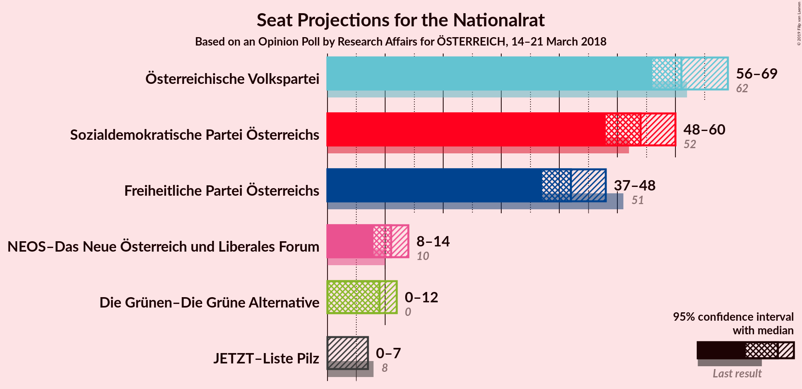

### Confidence Intervals

| Party | Last Result | Median | 80% Confidence Interval | 90% Confidence Interval | 95% Confidence Interval | 99% Confidence Interval |
|:-----:|:-----------:|:------:|:-----------------------:|:-----------------------:|:-----------------------:|:-----------------------:|
| <a href="#österreichische-volkspartei">Österreichische Volkspartei</a> | 62 | 61 | 58–66 |57–67 |56–69 |54–71 |
| <a href="#sozialdemokratische-partei-österreichs">Sozialdemokratische Partei Österreichs</a> | 52 | 54 | 50–58 |49–59 |48–60 |46–62 |
| <a href="#freiheitliche-partei-österreichs">Freiheitliche Partei Österreichs</a> | 51 | 42 | 39–46 |38–47 |37–48 |36–50 |
| <a href="#neos–das-neue-österreich-und-liberales-forum">NEOS–Das Neue Österreich und Liberales Forum</a> | 10 | 11 | 9–13 |9–14 |8–14 |8–15 |
| <a href="#die-grünen–die-grüne-alternative">Die Grünen–Die Grüne Alternative</a> | 0 | 9 | 8–11 |0–12 |0–12 |0–13 |
| <a href="#jetzt–liste-pilz">JETZT–Liste Pilz</a> | 8 | 0 | 0 |0–7 |0–7 |0–8 |

### Österreichische Volkspartei

*For a full overview of the results for this party, see the [Österreichische Volkspartei](party-österreichischevolkspartei.html) page.*

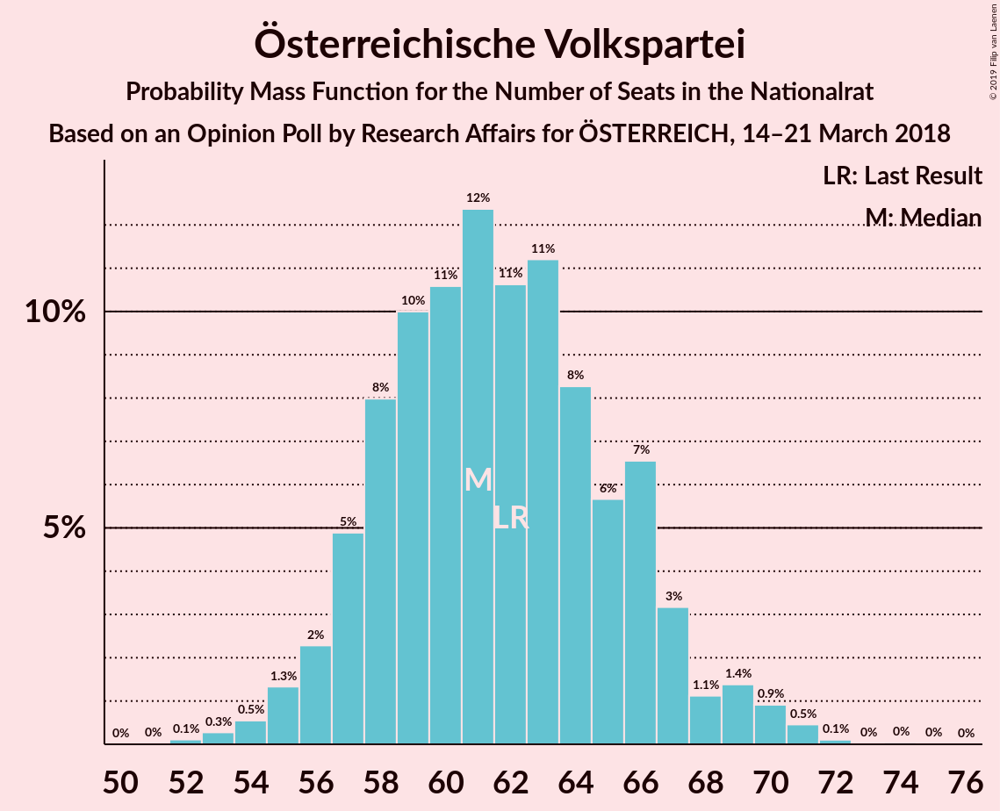

| Number of Seats | Probability | Accumulated | Special Marks |
|:---------------:|:-----------:|:-----------:|:-------------:|
| 52 | 0.1% | 100% |  |
| 53 | 0.3% | 99.8% |  |
| 54 | 0.5% | 99.6% |  |
| 55 | 1.3% | 99.0% |  |
| 56 | 2% | 98% |  |
| 57 | 5% | 95% |  |
| 58 | 8% | 91% |  |
| 59 | 10% | 83% |  |
| 60 | 11% | 73% |  |
| 61 | 12% | 62% | Median |
| 62 | 11% | 50% | Last Result |
| 63 | 11% | 39% |  |
| 64 | 8% | 28% |  |
| 65 | 6% | 19% |  |
| 66 | 7% | 14% |  |
| 67 | 3% | 7% |  |
| 68 | 1.1% | 4% |  |
| 69 | 1.4% | 3% |  |
| 70 | 0.9% | 2% |  |
| 71 | 0.5% | 0.7% |  |
| 72 | 0.1% | 0.2% |  |
| 73 | 0% | 0.1% |  |
| 74 | 0% | 0.1% |  |
| 75 | 0% | 0% |  |

### Sozialdemokratische Partei Österreichs

*For a full overview of the results for this party, see the [Sozialdemokratische Partei Österreichs](party-sozialdemokratischeparteiösterreichs.html) page.*

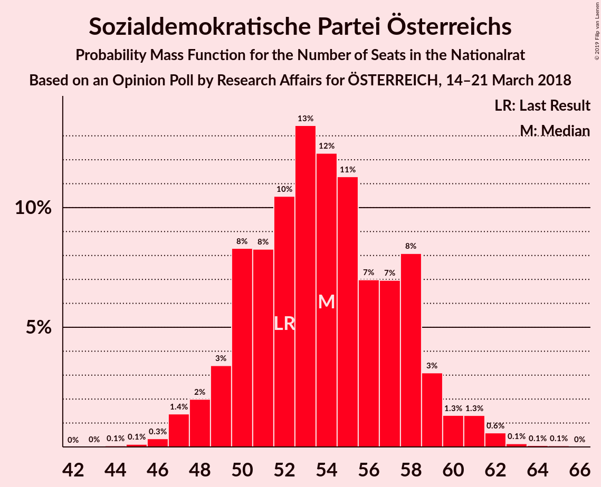

| Number of Seats | Probability | Accumulated | Special Marks |
|:---------------:|:-----------:|:-----------:|:-------------:|
| 44 | 0.1% | 100% |  |
| 45 | 0.1% | 99.9% |  |
| 46 | 0.3% | 99.8% |  |
| 47 | 1.4% | 99.5% |  |
| 48 | 2% | 98% |  |
| 49 | 3% | 96% |  |
| 50 | 8% | 93% |  |
| 51 | 8% | 84% |  |
| 52 | 10% | 76% | Last Result |
| 53 | 13% | 66% |  |
| 54 | 12% | 52% | Median |
| 55 | 11% | 40% |  |
| 56 | 7% | 29% |  |
| 57 | 7% | 22% |  |
| 58 | 8% | 15% |  |
| 59 | 3% | 7% |  |
| 60 | 1.3% | 4% |  |
| 61 | 1.3% | 2% |  |
| 62 | 0.6% | 0.9% |  |
| 63 | 0.1% | 0.3% |  |
| 64 | 0.1% | 0.1% |  |
| 65 | 0.1% | 0.1% |  |
| 66 | 0% | 0% |  |

### Freiheitliche Partei Österreichs

*For a full overview of the results for this party, see the [Freiheitliche Partei Österreichs](party-freiheitlicheparteiösterreichs.html) page.*

| Number of Seats | Probability | Accumulated | Special Marks |
|:---------------:|:-----------:|:-----------:|:-------------:|
| 34 | 0.1% | 100% |  |
| 35 | 0.3% | 99.9% |  |
| 36 | 1.1% | 99.6% |  |
| 37 | 3% | 98.5% |  |
| 38 | 4% | 96% |  |
| 39 | 7% | 92% |  |
| 40 | 12% | 85% |  |
| 41 | 12% | 73% |  |
| 42 | 14% | 60% | Median |
| 43 | 15% | 47% |  |
| 44 | 12% | 32% |  |
| 45 | 7% | 20% |  |
| 46 | 4% | 12% |  |
| 47 | 5% | 8% |  |
| 48 | 2% | 4% |  |
| 49 | 0.9% | 2% |  |
| 50 | 0.4% | 0.6% |  |
| 51 | 0.1% | 0.2% | Last Result |
| 52 | 0.1% | 0.1% |  |
| 53 | 0% | 0% |  |

### NEOS–Das Neue Österreich und Liberales Forum

*For a full overview of the results for this party, see the [NEOS–Das Neue Österreich und Liberales Forum](party-neos–dasneueösterreichundliberalesforum.html) page.*

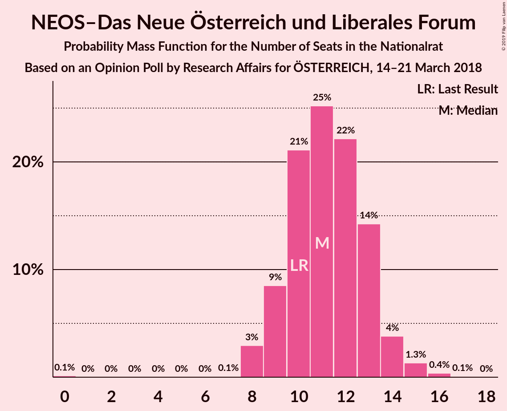

| Number of Seats | Probability | Accumulated | Special Marks |
|:---------------:|:-----------:|:-----------:|:-------------:|
| 0 | 0.1% | 100% |  |
| 1 | 0% | 99.9% |  |
| 2 | 0% | 99.9% |  |
| 3 | 0% | 99.9% |  |
| 4 | 0% | 99.9% |  |
| 5 | 0% | 99.9% |  |
| 6 | 0% | 99.9% |  |
| 7 | 0.1% | 99.9% |  |
| 8 | 3% | 99.8% |  |
| 9 | 9% | 97% |  |
| 10 | 21% | 88% | Last Result |
| 11 | 25% | 67% | Median |
| 12 | 22% | 42% |  |
| 13 | 14% | 20% |  |
| 14 | 4% | 6% |  |
| 15 | 1.3% | 2% |  |
| 16 | 0.4% | 0.5% |  |
| 17 | 0.1% | 0.1% |  |
| 18 | 0% | 0% |  |

### Die Grünen–Die Grüne Alternative

*For a full overview of the results for this party, see the [Die Grünen–Die Grüne Alternative](party-diegrünen–diegrünealternative.html) page.*

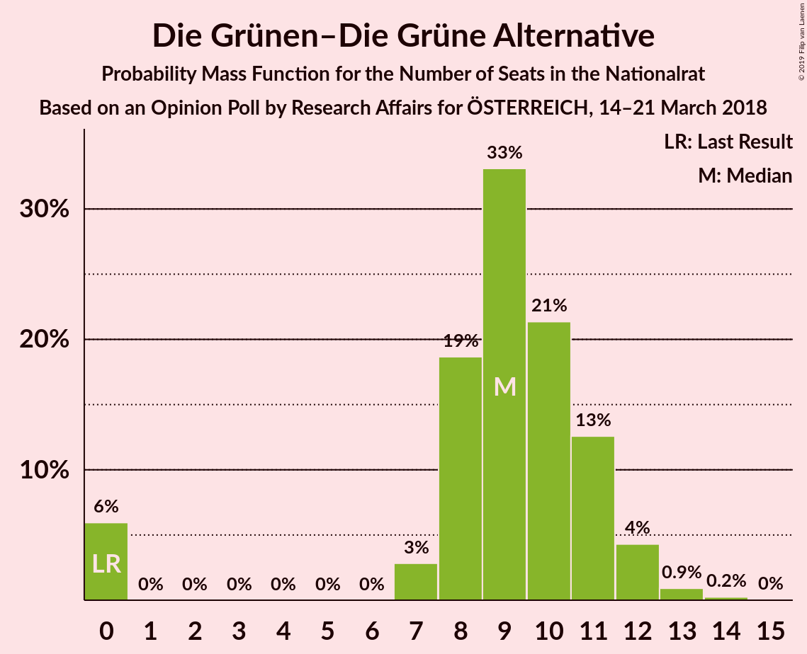

| Number of Seats | Probability | Accumulated | Special Marks |
|:---------------:|:-----------:|:-----------:|:-------------:|
| 0 | 6% | 100% | Last Result |
| 1 | 0% | 94% |  |
| 2 | 0% | 94% |  |
| 3 | 0% | 94% |  |
| 4 | 0% | 94% |  |
| 5 | 0% | 94% |  |
| 6 | 0% | 94% |  |
| 7 | 3% | 94% |  |
| 8 | 19% | 91% |  |
| 9 | 33% | 73% | Median |
| 10 | 21% | 39% |  |
| 11 | 13% | 18% |  |
| 12 | 4% | 5% |  |
| 13 | 0.9% | 1.2% |  |
| 14 | 0.2% | 0.3% |  |
| 15 | 0% | 0% |  |

### JETZT–Liste Pilz

*For a full overview of the results for this party, see the [JETZT–Liste Pilz](party-jetzt–listepilz.html) page.*

| Number of Seats | Probability | Accumulated | Special Marks |
|:---------------:|:-----------:|:-----------:|:-------------:|
| 0 | 95% | 100% | Median |
| 1 | 0% | 5% |  |
| 2 | 0% | 5% |  |
| 3 | 0% | 5% |  |
| 4 | 0% | 5% |  |
| 5 | 0% | 5% |  |
| 6 | 0% | 5% |  |
| 7 | 3% | 5% |  |
| 8 | 2% | 2% | Last Result |
| 9 | 0.3% | 0.3% |  |
| 10 | 0% | 0% |  |

## Coalitions

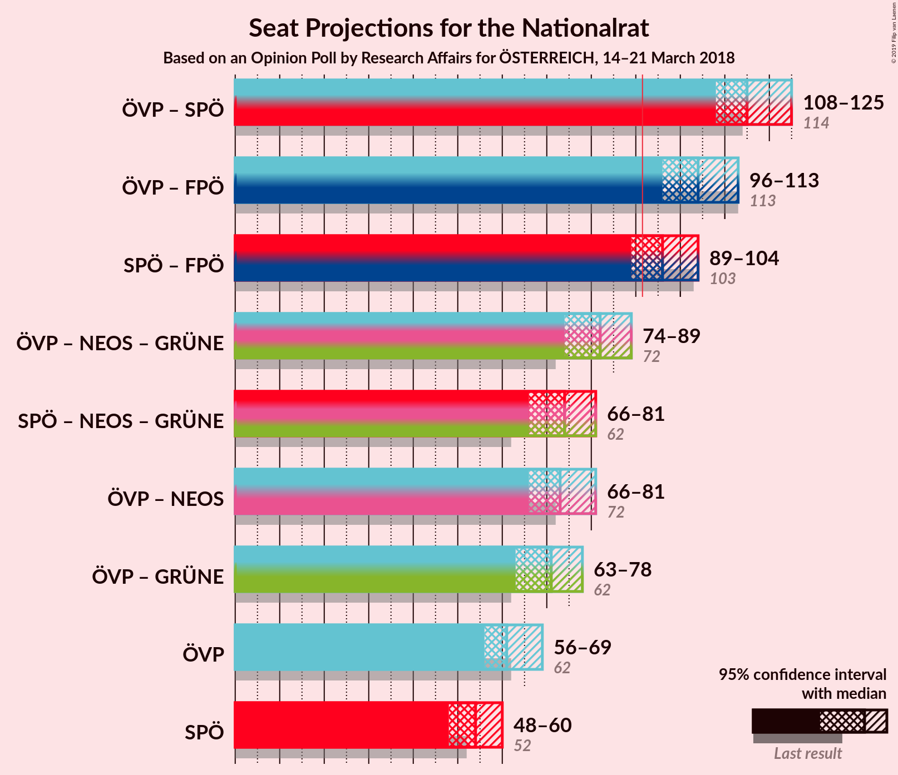

### Confidence Intervals

| Coalition | Last Result | Median | Majority? | 80% Confidence Interval | 90% Confidence Interval | 95% Confidence Interval | 99% Confidence Interval |
|:---------:|:-----------:|:------:|:---------:|:-----------------------:|:-----------------------:|:-----------------------:|:-----------------------:|
| Österreichische Volkspartei – Sozialdemokratische Partei Österreichs | 114 | 115 | 100% | 110–121 | 109–123 | 108–125 | 105–128 |
| Österreichische Volkspartei – Freiheitliche Partei Österreichs | 113 | 104 | 100% | 99–109 | 98–111 | 96–113 | 94–115 |
| Sozialdemokratische Partei Österreichs – Freiheitliche Partei Österreichs | 103 | 96 | 88% | 91–102 | 90–103 | 89–104 | 87–107 |
| Österreichische Volkspartei – NEOS–Das Neue Österreich und Liberales Forum – Die Grünen–Die Grüne Alternative | 72 | 82 | 0.4% | 77–87 | 76–88 | 74–89 | 71–91 |
| Sozialdemokratische Partei Österreichs – NEOS–Das Neue Österreich und Liberales Forum – Die Grünen–Die Grüne Alternative | 62 | 74 | 0% | 69–78 | 68–80 | 66–81 | 64–83 |
| Österreichische Volkspartei – NEOS–Das Neue Österreich und Liberales Forum | 72 | 73 | 0% | 68–78 | 67–79 | 66–81 | 64–83 |
| Österreichische Volkspartei – Die Grünen–Die Grüne Alternative | 62 | 71 | 0% | 66–75 | 65–76 | 63–78 | 60–79 |
| Österreichische Volkspartei | 62 | 61 | 0% | 58–66 | 57–67 | 56–69 | 54–71 |
| Sozialdemokratische Partei Österreichs | 52 | 54 | 0% | 50–58 | 49–59 | 48–60 | 46–62 |

### Österreichische Volkspartei – Sozialdemokratische Partei Österreichs

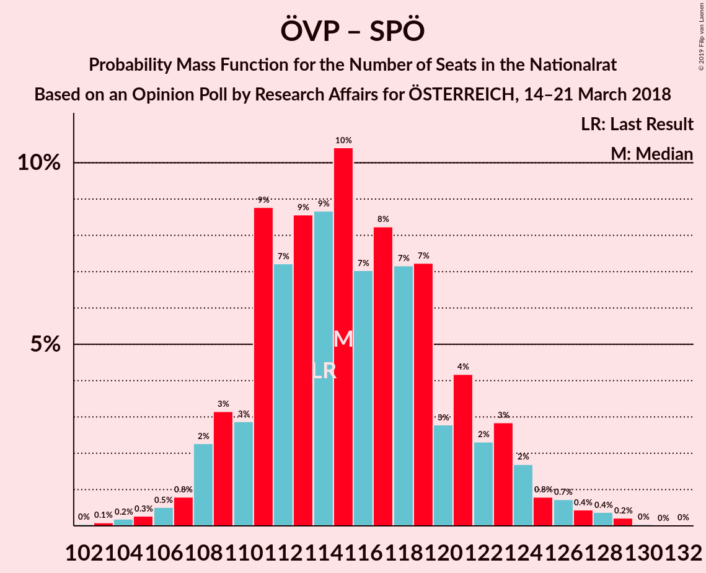

| Number of Seats | Probability | Accumulated | Special Marks |
|:---------------:|:-----------:|:-----------:|:-------------:|
| 102 | 0% | 100% |  |
| 103 | 0.1% | 99.9% |  |
| 104 | 0.2% | 99.9% |  |
| 105 | 0.3% | 99.7% |  |
| 106 | 0.5% | 99.4% |  |
| 107 | 0.8% | 98.9% |  |
| 108 | 2% | 98% |  |
| 109 | 3% | 96% |  |
| 110 | 3% | 93% |  |
| 111 | 9% | 90% |  |
| 112 | 7% | 81% |  |
| 113 | 9% | 74% |  |
| 114 | 9% | 65% | Last Result |
| 115 | 10% | 57% | Median |
| 116 | 7% | 46% |  |
| 117 | 8% | 39% |  |
| 118 | 7% | 31% |  |
| 119 | 7% | 24% |  |
| 120 | 3% | 16% |  |
| 121 | 4% | 14% |  |
| 122 | 2% | 9% |  |
| 123 | 3% | 7% |  |
| 124 | 2% | 4% |  |
| 125 | 0.8% | 3% |  |
| 126 | 0.7% | 2% |  |
| 127 | 0.4% | 1.1% |  |
| 128 | 0.4% | 0.7% |  |
| 129 | 0.2% | 0.3% |  |
| 130 | 0% | 0.1% |  |
| 131 | 0% | 0% |  |

### Österreichische Volkspartei – Freiheitliche Partei Österreichs

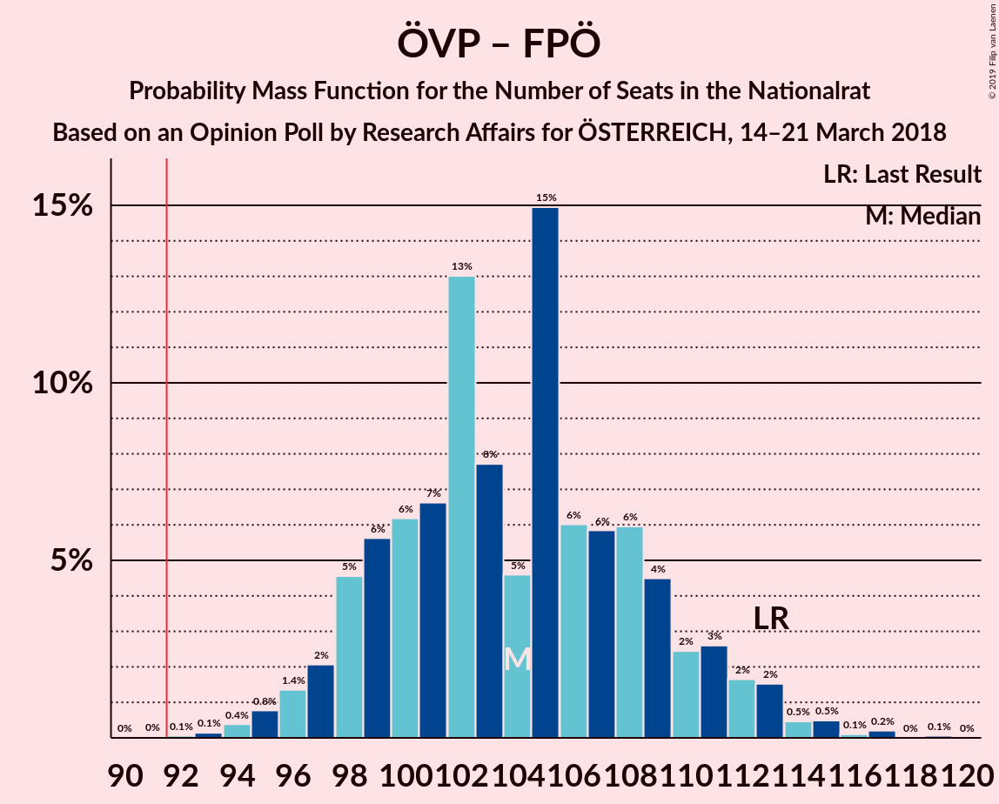

| Number of Seats | Probability | Accumulated | Special Marks |
|:---------------:|:-----------:|:-----------:|:-------------:|
| 92 | 0.1% | 100% | Majority |
| 93 | 0.1% | 99.9% |  |
| 94 | 0.4% | 99.7% |  |
| 95 | 0.8% | 99.4% |  |
| 96 | 1.4% | 98.6% |  |
| 97 | 2% | 97% |  |
| 98 | 5% | 95% |  |
| 99 | 6% | 91% |  |
| 100 | 6% | 85% |  |
| 101 | 7% | 79% |  |
| 102 | 13% | 72% |  |
| 103 | 8% | 59% | Median |
| 104 | 5% | 51% |  |
| 105 | 15% | 47% |  |
| 106 | 6% | 32% |  |
| 107 | 6% | 26% |  |
| 108 | 6% | 20% |  |
| 109 | 4% | 14% |  |
| 110 | 2% | 10% |  |
| 111 | 3% | 7% |  |
| 112 | 2% | 5% |  |
| 113 | 2% | 3% | Last Result |
| 114 | 0.5% | 1.3% |  |
| 115 | 0.5% | 0.9% |  |
| 116 | 0.1% | 0.4% |  |
| 117 | 0.2% | 0.3% |  |
| 118 | 0% | 0.1% |  |
| 119 | 0.1% | 0.1% |  |
| 120 | 0% | 0% |  |

### Sozialdemokratische Partei Österreichs – Freiheitliche Partei Österreichs

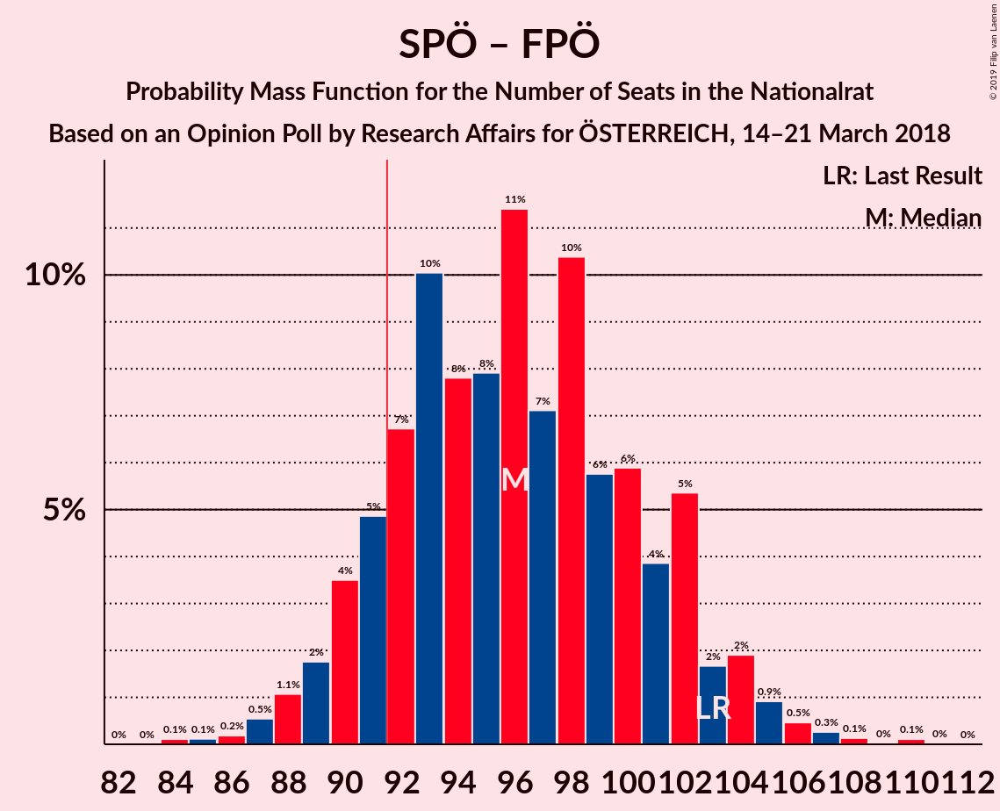

| Number of Seats | Probability | Accumulated | Special Marks |
|:---------------:|:-----------:|:-----------:|:-------------:|
| 84 | 0.1% | 100% |  |
| 85 | 0.1% | 99.9% |  |
| 86 | 0.2% | 99.8% |  |
| 87 | 0.5% | 99.6% |  |
| 88 | 1.1% | 99.0% |  |
| 89 | 2% | 98% |  |
| 90 | 4% | 96% |  |
| 91 | 5% | 93% |  |
| 92 | 7% | 88% | Majority |
| 93 | 10% | 81% |  |
| 94 | 8% | 71% |  |
| 95 | 8% | 63% |  |
| 96 | 11% | 55% | Median |
| 97 | 7% | 44% |  |
| 98 | 10% | 37% |  |
| 99 | 6% | 26% |  |
| 100 | 6% | 21% |  |
| 101 | 4% | 15% |  |
| 102 | 5% | 11% |  |
| 103 | 2% | 6% | Last Result |
| 104 | 2% | 4% |  |
| 105 | 0.9% | 2% |  |
| 106 | 0.5% | 1.0% |  |
| 107 | 0.3% | 0.6% |  |
| 108 | 0.1% | 0.3% |  |
| 109 | 0% | 0.2% |  |
| 110 | 0.1% | 0.1% |  |
| 111 | 0% | 0% |  |

### Österreichische Volkspartei – NEOS–Das Neue Österreich und Liberales Forum – Die Grünen–Die Grüne Alternative

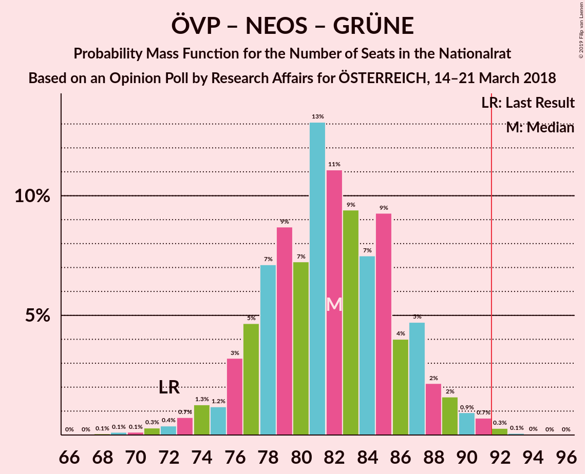

| Number of Seats | Probability | Accumulated | Special Marks |
|:---------------:|:-----------:|:-----------:|:-------------:|
| 68 | 0.1% | 100% |  |
| 69 | 0.1% | 99.9% |  |
| 70 | 0.1% | 99.8% |  |
| 71 | 0.3% | 99.7% |  |
| 72 | 0.4% | 99.4% | Last Result |
| 73 | 0.7% | 99.0% |  |
| 74 | 1.3% | 98% |  |
| 75 | 1.2% | 97% |  |
| 76 | 3% | 96% |  |
| 77 | 5% | 93% |  |
| 78 | 7% | 88% |  |
| 79 | 9% | 81% |  |
| 80 | 7% | 72% |  |
| 81 | 13% | 65% | Median |
| 82 | 11% | 52% |  |
| 83 | 9% | 41% |  |
| 84 | 7% | 31% |  |
| 85 | 9% | 24% |  |
| 86 | 4% | 15% |  |
| 87 | 5% | 11% |  |
| 88 | 2% | 6% |  |
| 89 | 2% | 4% |  |
| 90 | 0.9% | 2% |  |
| 91 | 0.7% | 1.1% |  |
| 92 | 0.3% | 0.4% | Majority |
| 93 | 0.1% | 0.1% |  |
| 94 | 0% | 0.1% |  |
| 95 | 0% | 0% |  |

### Sozialdemokratische Partei Österreichs – NEOS–Das Neue Österreich und Liberales Forum – Die Grünen–Die Grüne Alternative

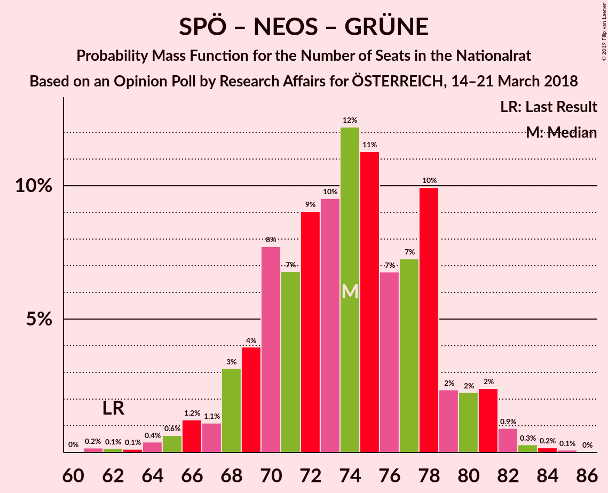

| Number of Seats | Probability | Accumulated | Special Marks |
|:---------------:|:-----------:|:-----------:|:-------------:|
| 60 | 0% | 100% |  |
| 61 | 0.2% | 99.9% |  |
| 62 | 0.1% | 99.8% | Last Result |
| 63 | 0.1% | 99.6% |  |
| 64 | 0.4% | 99.5% |  |
| 65 | 0.6% | 99.1% |  |
| 66 | 1.2% | 98% |  |
| 67 | 1.1% | 97% |  |
| 68 | 3% | 96% |  |
| 69 | 4% | 93% |  |
| 70 | 8% | 89% |  |
| 71 | 7% | 81% |  |
| 72 | 9% | 75% |  |
| 73 | 10% | 65% |  |
| 74 | 12% | 56% | Median |
| 75 | 11% | 44% |  |
| 76 | 7% | 32% |  |
| 77 | 7% | 26% |  |
| 78 | 10% | 18% |  |
| 79 | 2% | 9% |  |
| 80 | 2% | 6% |  |
| 81 | 2% | 4% |  |
| 82 | 0.9% | 2% |  |
| 83 | 0.3% | 0.6% |  |
| 84 | 0.2% | 0.3% |  |
| 85 | 0.1% | 0.1% |  |
| 86 | 0% | 0% |  |

### Österreichische Volkspartei – NEOS–Das Neue Österreich und Liberales Forum

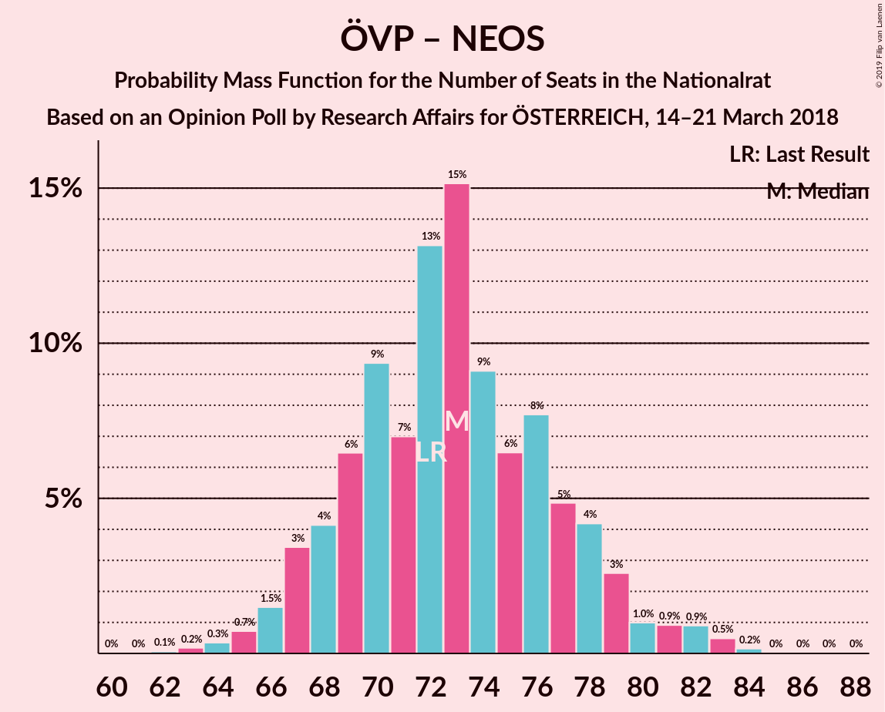

| Number of Seats | Probability | Accumulated | Special Marks |
|:---------------:|:-----------:|:-----------:|:-------------:|
| 62 | 0.1% | 100% |  |
| 63 | 0.2% | 99.9% |  |
| 64 | 0.3% | 99.7% |  |
| 65 | 0.7% | 99.4% |  |
| 66 | 1.5% | 98.6% |  |
| 67 | 3% | 97% |  |
| 68 | 4% | 94% |  |
| 69 | 6% | 90% |  |
| 70 | 9% | 83% |  |
| 71 | 7% | 74% |  |
| 72 | 13% | 67% | Last Result, Median |
| 73 | 15% | 54% |  |
| 74 | 9% | 38% |  |
| 75 | 6% | 29% |  |
| 76 | 8% | 23% |  |
| 77 | 5% | 15% |  |
| 78 | 4% | 10% |  |
| 79 | 3% | 6% |  |
| 80 | 1.0% | 4% |  |
| 81 | 0.9% | 3% |  |
| 82 | 0.9% | 2% |  |
| 83 | 0.5% | 0.7% |  |
| 84 | 0.2% | 0.2% |  |
| 85 | 0% | 0.1% |  |
| 86 | 0% | 0.1% |  |
| 87 | 0% | 0% |  |

### Österreichische Volkspartei – Die Grünen–Die Grüne Alternative

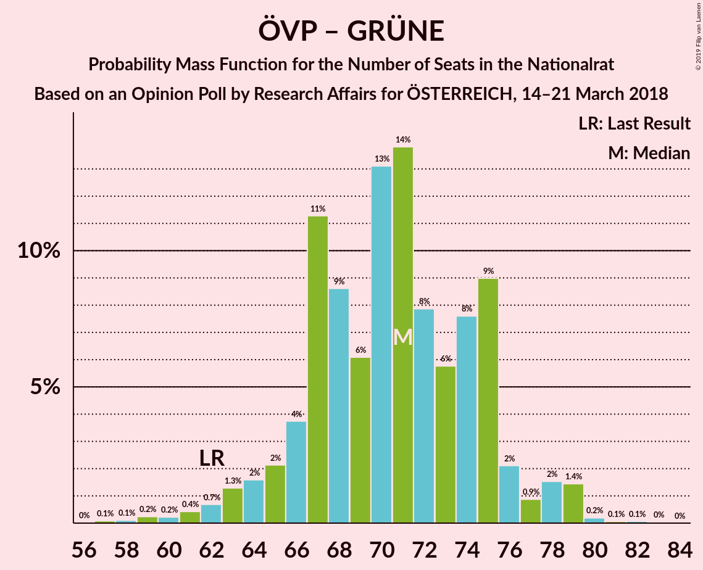

| Number of Seats | Probability | Accumulated | Special Marks |
|:---------------:|:-----------:|:-----------:|:-------------:|
| 57 | 0.1% | 100% |  |
| 58 | 0.1% | 99.9% |  |
| 59 | 0.2% | 99.8% |  |
| 60 | 0.2% | 99.5% |  |
| 61 | 0.4% | 99.3% |  |
| 62 | 0.7% | 98.9% | Last Result |
| 63 | 1.3% | 98% |  |
| 64 | 2% | 97% |  |
| 65 | 2% | 95% |  |
| 66 | 4% | 93% |  |
| 67 | 11% | 89% |  |
| 68 | 9% | 78% |  |
| 69 | 6% | 70% |  |
| 70 | 13% | 63% | Median |
| 71 | 14% | 50% |  |
| 72 | 8% | 37% |  |
| 73 | 6% | 29% |  |
| 74 | 8% | 23% |  |
| 75 | 9% | 15% |  |
| 76 | 2% | 6% |  |
| 77 | 0.9% | 4% |  |
| 78 | 2% | 3% |  |
| 79 | 1.4% | 2% |  |
| 80 | 0.2% | 0.4% |  |
| 81 | 0.1% | 0.2% |  |
| 82 | 0.1% | 0.1% |  |
| 83 | 0% | 0% |  |

### Österreichische Volkspartei

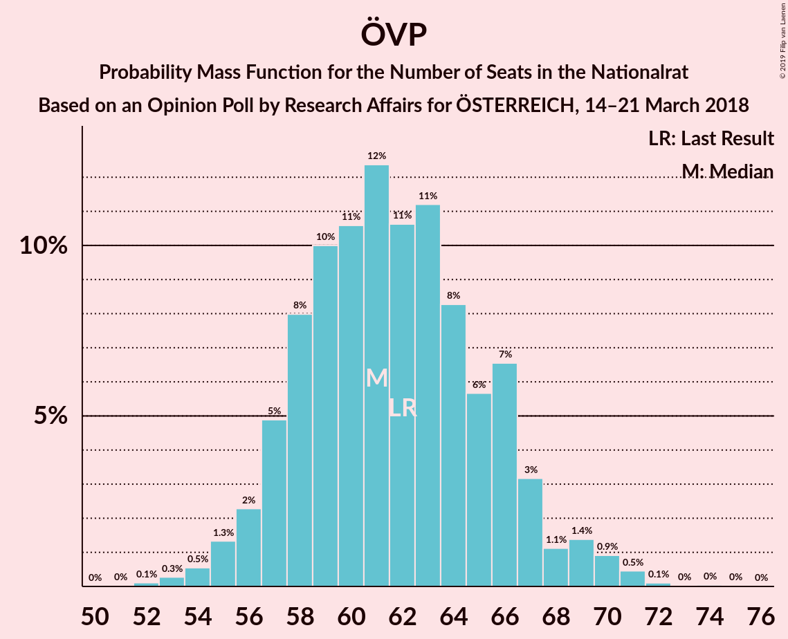

| Number of Seats | Probability | Accumulated | Special Marks |
|:---------------:|:-----------:|:-----------:|:-------------:|
| 52 | 0.1% | 100% |  |
| 53 | 0.3% | 99.8% |  |
| 54 | 0.5% | 99.6% |  |
| 55 | 1.3% | 99.0% |  |
| 56 | 2% | 98% |  |
| 57 | 5% | 95% |  |
| 58 | 8% | 91% |  |
| 59 | 10% | 83% |  |
| 60 | 11% | 73% |  |
| 61 | 12% | 62% | Median |
| 62 | 11% | 50% | Last Result |
| 63 | 11% | 39% |  |
| 64 | 8% | 28% |  |
| 65 | 6% | 19% |  |
| 66 | 7% | 14% |  |
| 67 | 3% | 7% |  |
| 68 | 1.1% | 4% |  |
| 69 | 1.4% | 3% |  |
| 70 | 0.9% | 2% |  |
| 71 | 0.5% | 0.7% |  |
| 72 | 0.1% | 0.2% |  |
| 73 | 0% | 0.1% |  |
| 74 | 0% | 0.1% |  |
| 75 | 0% | 0% |  |

### Sozialdemokratische Partei Österreichs

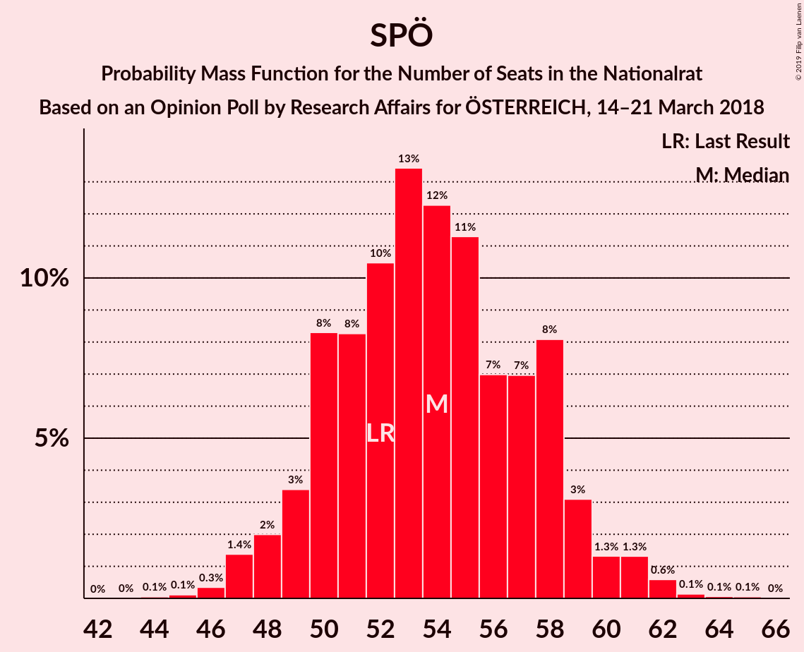

| Number of Seats | Probability | Accumulated | Special Marks |
|:---------------:|:-----------:|:-----------:|:-------------:|
| 44 | 0.1% | 100% |  |
| 45 | 0.1% | 99.9% |  |
| 46 | 0.3% | 99.8% |  |
| 47 | 1.4% | 99.5% |  |
| 48 | 2% | 98% |  |
| 49 | 3% | 96% |  |
| 50 | 8% | 93% |  |
| 51 | 8% | 84% |  |
| 52 | 10% | 76% | Last Result |
| 53 | 13% | 66% |  |
| 54 | 12% | 52% | Median |
| 55 | 11% | 40% |  |
| 56 | 7% | 29% |  |
| 57 | 7% | 22% |  |
| 58 | 8% | 15% |  |
| 59 | 3% | 7% |  |
| 60 | 1.3% | 4% |  |
| 61 | 1.3% | 2% |  |
| 62 | 0.6% | 0.9% |  |
| 63 | 0.1% | 0.3% |  |
| 64 | 0.1% | 0.1% |  |
| 65 | 0.1% | 0.1% |  |
| 66 | 0% | 0% |  |

## Technical Information

### Opinion Poll

+ **Polling firm:** Research Affairs
+ **Commissioner(s):** ÖSTERREICH
+ **Fieldwork period:** 14–21 March 2018

### Calculations

+ **Sample size:** 1008
+ **Simulations done:** 131,072
+ **Error estimate:** 1.63%

