# Opinion Poll by Unique Research for Heute, 19–22 March 2018

<a href="#voting-intentions">Voting Intentions</a> | <a href="#seats">Seats</a> | <a href="#coalitions">Coalitions</a> | <a href="#technical-information">Technical Information</a>

## Voting Intentions

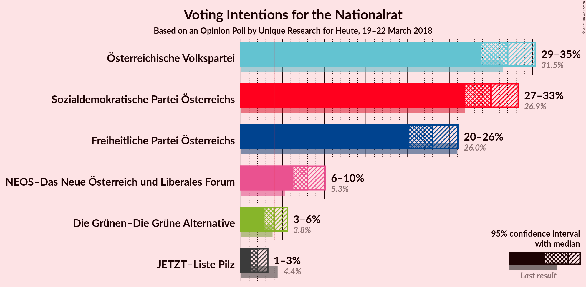

### Confidence Intervals

| Party | Last Result | Poll Result | 80% Confidence Interval | 90% Confidence Interval | 95% Confidence Interval | 99% Confidence Interval |
|:-----:|:-----------:|:-----------:|:-----------------------:|:-----------------------:|:-----------------------:|:-----------------------:|
| Österreichische Volkspartei | 31.5% | 32.0% | 29.9–34.2% |29.4–34.8% |28.9–35.3% |27.9–36.4% |
| Sozialdemokratische Partei Österreichs | 26.9% | 30.0% | 28.0–32.1% |27.4–32.8% |26.9–33.3% |26.0–34.3% |
| Freiheitliche Partei Österreichs | 26.0% | 23.0% | 21.2–25.0% |20.7–25.6% |20.2–26.0% |19.4–27.0% |
| NEOS–Das Neue Österreich und Liberales Forum | 5.3% | 8.0% | 6.9–9.4% |6.6–9.8% |6.3–10.1% |5.8–10.8% |
| Die Grünen–Die Grüne Alternative | 3.8% | 4.0% | 3.2–5.0% |3.0–5.3% |2.9–5.6% |2.5–6.1% |
| JETZT–Liste Pilz | 4.4% | 2.0% | 1.5–2.8% |1.4–3.0% |1.2–3.2% |1.0–3.7% |

*Note:* The poll result column reflects the actual value used in the calculations. Published results may vary slightly, and in addition be rounded to fewer digits.

## Seats

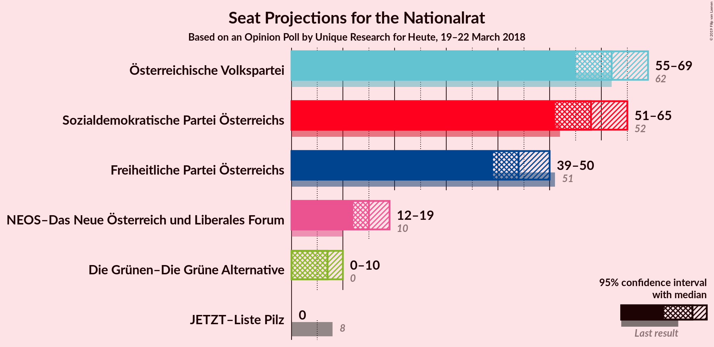

### Confidence Intervals

| Party | Last Result | Median | 80% Confidence Interval | 90% Confidence Interval | 95% Confidence Interval | 99% Confidence Interval |
|:-----:|:-----------:|:------:|:-----------------------:|:-----------------------:|:-----------------------:|:-----------------------:|
| <a href="#österreichische-volkspartei">Österreichische Volkspartei</a> | 62 | 62 | 57–66 |56–67 |55–69 |53–71 |
| <a href="#sozialdemokratische-partei-österreichs">Sozialdemokratische Partei Österreichs</a> | 52 | 58 | 53–62 |52–63 |51–65 |49–67 |
| <a href="#freiheitliche-partei-österreichs">Freiheitliche Partei Österreichs</a> | 51 | 44 | 40–48 |39–49 |39–50 |37–52 |
| <a href="#neos–das-neue-österreich-und-liberales-forum">NEOS–Das Neue Österreich und Liberales Forum</a> | 10 | 15 | 13–17 |12–18 |12–19 |11–20 |
| <a href="#die-grünen–die-grüne-alternative">Die Grünen–Die Grüne Alternative</a> | 0 | 7 | 0–9 |0–10 |0–10 |0–11 |
| <a href="#jetzt–liste-pilz">JETZT–Liste Pilz</a> | 8 | 0 | 0 |0 |0 |0 |

### Österreichische Volkspartei

*For a full overview of the results for this party, see the [Österreichische Volkspartei](party-österreichischevolkspartei.html) page.*

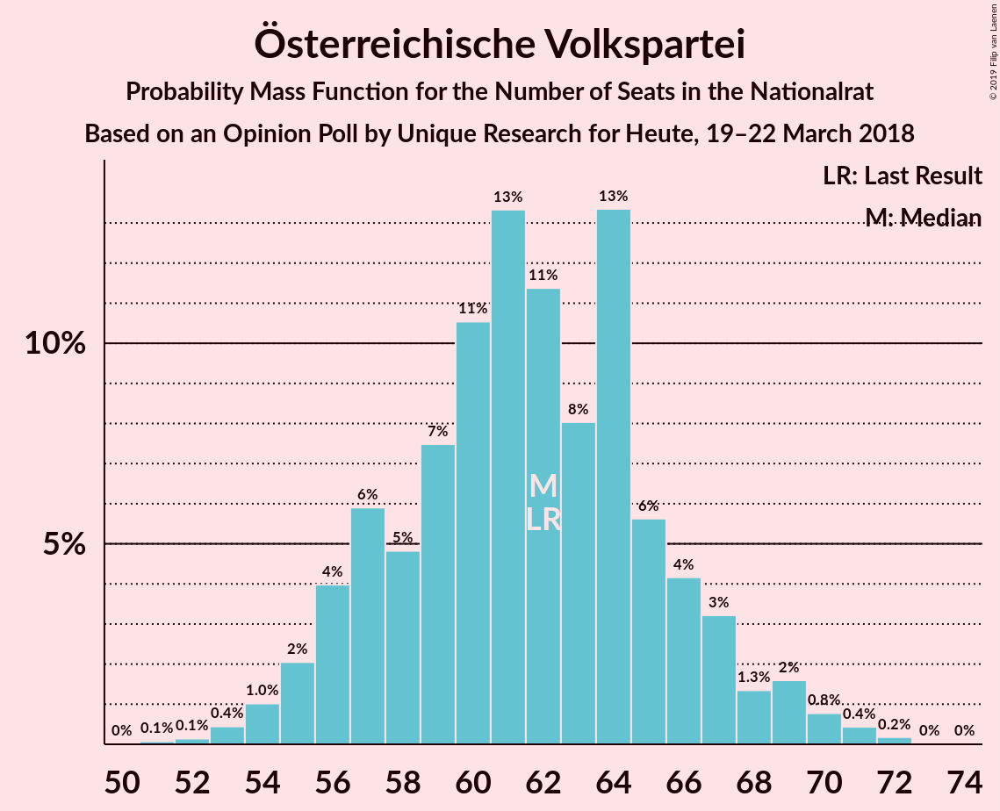

| Number of Seats | Probability | Accumulated | Special Marks |
|:---------------:|:-----------:|:-----------:|:-------------:|
| 51 | 0.1% | 100% |  |
| 52 | 0.1% | 99.9% |  |
| 53 | 0.4% | 99.8% |  |
| 54 | 1.0% | 99.3% |  |
| 55 | 2% | 98% |  |
| 56 | 4% | 96% |  |
| 57 | 6% | 92% |  |
| 58 | 5% | 86% |  |
| 59 | 7% | 82% |  |
| 60 | 11% | 74% |  |
| 61 | 13% | 64% |  |
| 62 | 11% | 50% | Last Result, Median |
| 63 | 8% | 39% |  |
| 64 | 13% | 31% |  |
| 65 | 6% | 17% |  |
| 66 | 4% | 12% |  |
| 67 | 3% | 8% |  |
| 68 | 1.3% | 4% |  |
| 69 | 2% | 3% |  |
| 70 | 0.8% | 1.5% |  |
| 71 | 0.4% | 0.7% |  |
| 72 | 0.2% | 0.2% |  |
| 73 | 0% | 0.1% |  |
| 74 | 0% | 0% |  |

### Sozialdemokratische Partei Österreichs

*For a full overview of the results for this party, see the [Sozialdemokratische Partei Österreichs](party-sozialdemokratischeparteiösterreichs.html) page.*

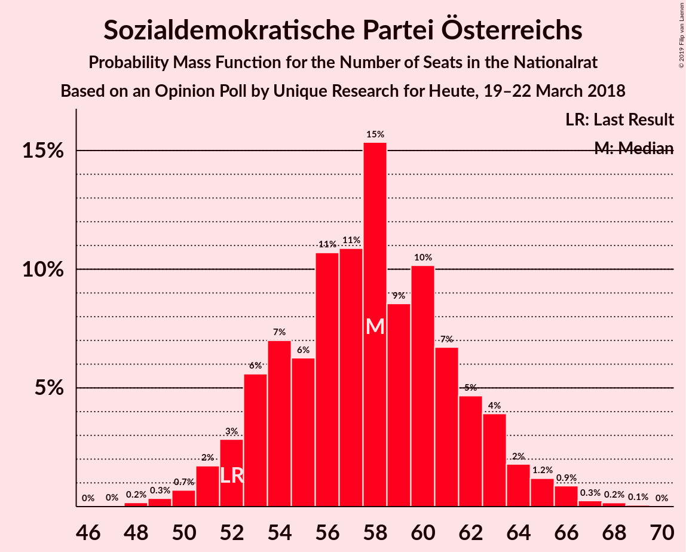

| Number of Seats | Probability | Accumulated | Special Marks |
|:---------------:|:-----------:|:-----------:|:-------------:|
| 47 | 0% | 100% |  |
| 48 | 0.2% | 99.9% |  |
| 49 | 0.3% | 99.8% |  |
| 50 | 0.7% | 99.4% |  |
| 51 | 2% | 98.7% |  |
| 52 | 3% | 97% | Last Result |
| 53 | 6% | 94% |  |
| 54 | 7% | 89% |  |
| 55 | 6% | 82% |  |
| 56 | 11% | 75% |  |
| 57 | 11% | 65% |  |
| 58 | 15% | 54% | Median |
| 59 | 9% | 38% |  |
| 60 | 10% | 30% |  |
| 61 | 7% | 20% |  |
| 62 | 5% | 13% |  |
| 63 | 4% | 8% |  |
| 64 | 2% | 4% |  |
| 65 | 1.2% | 3% |  |
| 66 | 0.9% | 1.4% |  |
| 67 | 0.3% | 0.5% |  |
| 68 | 0.2% | 0.3% |  |
| 69 | 0.1% | 0.1% |  |
| 70 | 0% | 0% |  |

### Freiheitliche Partei Österreichs

*For a full overview of the results for this party, see the [Freiheitliche Partei Österreichs](party-freiheitlicheparteiösterreichs.html) page.*

| Number of Seats | Probability | Accumulated | Special Marks |
|:---------------:|:-----------:|:-----------:|:-------------:|
| 35 | 0.1% | 100% |  |
| 36 | 0.3% | 99.9% |  |
| 37 | 0.7% | 99.6% |  |
| 38 | 1.2% | 98.9% |  |
| 39 | 5% | 98% |  |
| 40 | 5% | 93% |  |
| 41 | 7% | 88% |  |
| 42 | 10% | 81% |  |
| 43 | 12% | 70% |  |
| 44 | 17% | 59% | Median |
| 45 | 9% | 42% |  |
| 46 | 9% | 33% |  |
| 47 | 8% | 24% |  |
| 48 | 7% | 16% |  |
| 49 | 4% | 9% |  |
| 50 | 3% | 5% |  |
| 51 | 0.9% | 2% | Last Result |
| 52 | 0.5% | 0.9% |  |
| 53 | 0.2% | 0.4% |  |
| 54 | 0.1% | 0.2% |  |
| 55 | 0% | 0% |  |

### NEOS–Das Neue Österreich und Liberales Forum

*For a full overview of the results for this party, see the [NEOS–Das Neue Österreich und Liberales Forum](party-neos–dasneueösterreichundliberalesforum.html) page.*

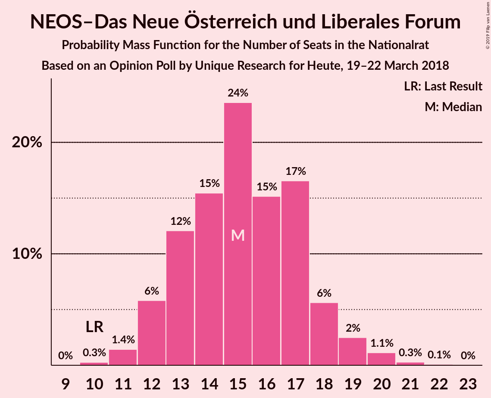

| Number of Seats | Probability | Accumulated | Special Marks |
|:---------------:|:-----------:|:-----------:|:-------------:|
| 10 | 0.3% | 100% | Last Result |
| 11 | 1.4% | 99.7% |  |
| 12 | 6% | 98% |  |
| 13 | 12% | 92% |  |
| 14 | 15% | 80% |  |
| 15 | 24% | 65% | Median |
| 16 | 15% | 41% |  |
| 17 | 17% | 26% |  |
| 18 | 6% | 10% |  |
| 19 | 2% | 4% |  |
| 20 | 1.1% | 2% |  |
| 21 | 0.3% | 0.4% |  |
| 22 | 0.1% | 0.1% |  |
| 23 | 0% | 0% |  |

### Die Grünen–Die Grüne Alternative

*For a full overview of the results for this party, see the [Die Grünen–Die Grüne Alternative](party-diegrünen–diegrünealternative.html) page.*

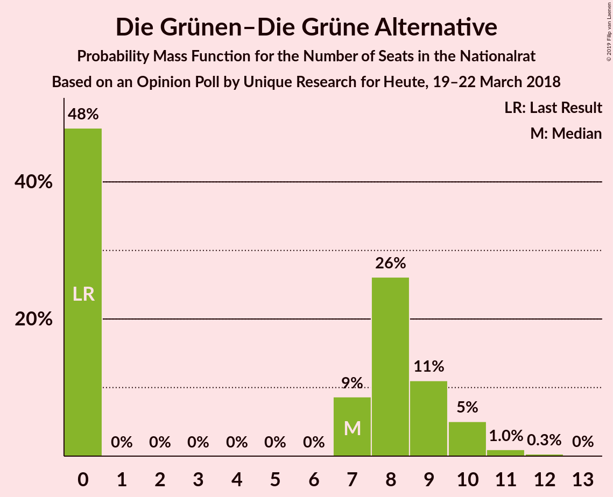

| Number of Seats | Probability | Accumulated | Special Marks |
|:---------------:|:-----------:|:-----------:|:-------------:|
| 0 | 48% | 100% | Last Result |
| 1 | 0% | 52% |  |
| 2 | 0% | 52% |  |
| 3 | 0% | 52% |  |
| 4 | 0% | 52% |  |
| 5 | 0% | 52% |  |
| 6 | 0% | 52% |  |
| 7 | 9% | 52% | Median |
| 8 | 26% | 43% |  |
| 9 | 11% | 17% |  |
| 10 | 5% | 6% |  |
| 11 | 1.0% | 1.3% |  |
| 12 | 0.3% | 0.4% |  |
| 13 | 0% | 0% |  |

### JETZT–Liste Pilz

*For a full overview of the results for this party, see the [JETZT–Liste Pilz](party-jetzt–listepilz.html) page.*

| Number of Seats | Probability | Accumulated | Special Marks |
|:---------------:|:-----------:|:-----------:|:-------------:|
| 0 | 99.9% | 100% | Median |
| 1 | 0% | 0.1% |  |
| 2 | 0% | 0.1% |  |
| 3 | 0% | 0.1% |  |
| 4 | 0% | 0.1% |  |
| 5 | 0% | 0.1% |  |
| 6 | 0% | 0.1% |  |
| 7 | 0.1% | 0.1% |  |
| 8 | 0% | 0% | Last Result |

## Coalitions

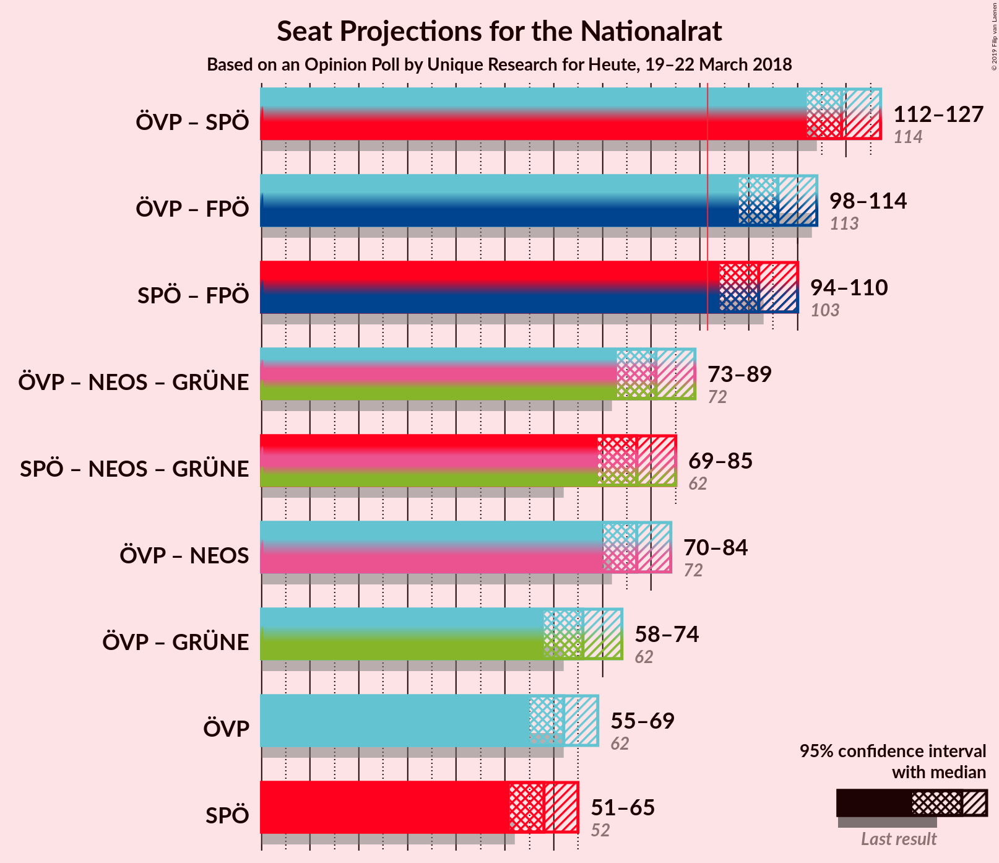

### Confidence Intervals

| Coalition | Last Result | Median | Majority? | 80% Confidence Interval | 90% Confidence Interval | 95% Confidence Interval | 99% Confidence Interval |
|:---------:|:-----------:|:------:|:---------:|:-----------------------:|:-----------------------:|:-----------------------:|:-----------------------:|
| Österreichische Volkspartei – Sozialdemokratische Partei Österreichs | 114 | 119 | 100% | 114–125 | 112–127 | 112–127 | 109–129 |
| Österreichische Volkspartei – Freiheitliche Partei Österreichs | 113 | 106 | 100% | 101–111 | 99–113 | 98–114 | 96–116 |
| Sozialdemokratische Partei Österreichs – Freiheitliche Partei Österreichs | 103 | 102 | 99.6% | 97–108 | 95–108 | 94–110 | 92–112 |
| Österreichische Volkspartei – NEOS–Das Neue Österreich und Liberales Forum – Die Grünen–Die Grüne Alternative | 72 | 81 | 0.4% | 75–86 | 75–88 | 73–89 | 71–91 |
| Sozialdemokratische Partei Österreichs – NEOS–Das Neue Österreich und Liberales Forum – Die Grünen–Die Grüne Alternative | 62 | 77 | 0% | 72–82 | 70–84 | 69–85 | 67–87 |
| Österreichische Volkspartei – NEOS–Das Neue Österreich und Liberales Forum | 72 | 77 | 0% | 72–81 | 70–83 | 70–84 | 67–86 |
| Österreichische Volkspartei – Die Grünen–Die Grüne Alternative | 62 | 66 | 0% | 60–71 | 59–73 | 58–74 | 56–76 |
| Österreichische Volkspartei | 62 | 62 | 0% | 57–66 | 56–67 | 55–69 | 53–71 |
| Sozialdemokratische Partei Österreichs | 52 | 58 | 0% | 53–62 | 52–63 | 51–65 | 49–67 |

### Österreichische Volkspartei – Sozialdemokratische Partei Österreichs

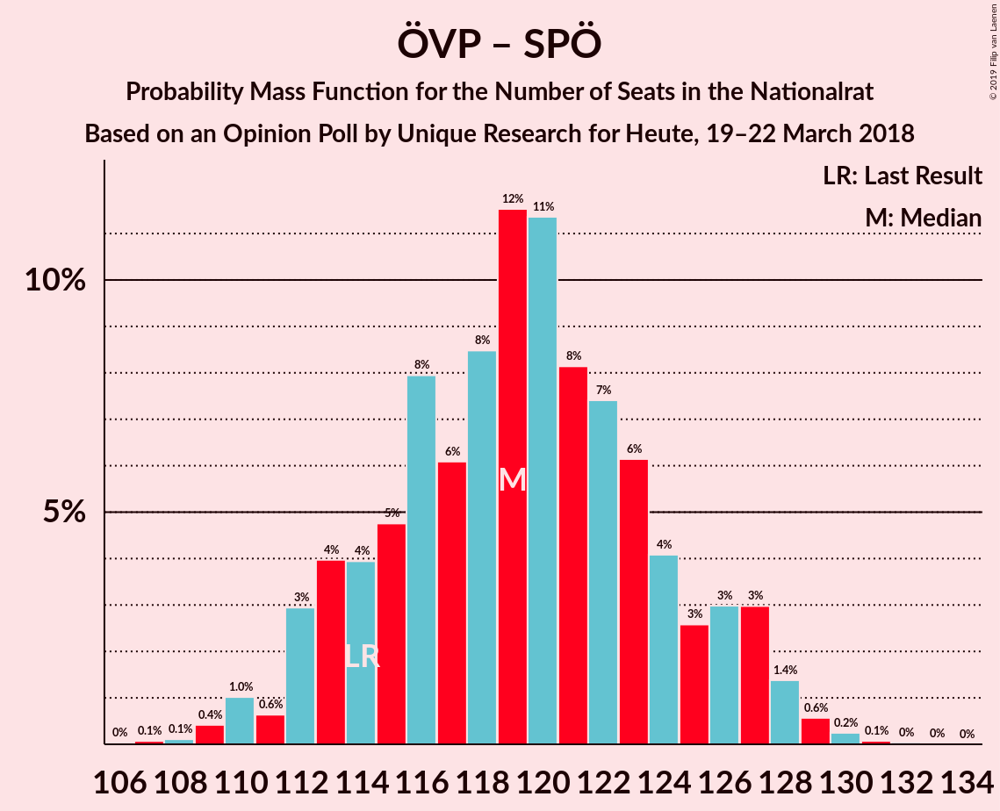

| Number of Seats | Probability | Accumulated | Special Marks |
|:---------------:|:-----------:|:-----------:|:-------------:|
| 106 | 0% | 100% |  |
| 107 | 0.1% | 99.9% |  |
| 108 | 0.1% | 99.9% |  |
| 109 | 0.4% | 99.8% |  |
| 110 | 1.0% | 99.3% |  |
| 111 | 0.6% | 98% |  |
| 112 | 3% | 98% |  |
| 113 | 4% | 95% |  |
| 114 | 4% | 91% | Last Result |
| 115 | 5% | 87% |  |
| 116 | 8% | 82% |  |
| 117 | 6% | 74% |  |
| 118 | 8% | 68% |  |
| 119 | 12% | 60% |  |
| 120 | 11% | 48% | Median |
| 121 | 8% | 37% |  |
| 122 | 7% | 29% |  |
| 123 | 6% | 21% |  |
| 124 | 4% | 15% |  |
| 125 | 3% | 11% |  |
| 126 | 3% | 8% |  |
| 127 | 3% | 5% |  |
| 128 | 1.4% | 2% |  |
| 129 | 0.6% | 1.0% |  |
| 130 | 0.2% | 0.4% |  |
| 131 | 0.1% | 0.1% |  |
| 132 | 0% | 0.1% |  |
| 133 | 0% | 0% |  |

### Österreichische Volkspartei – Freiheitliche Partei Österreichs

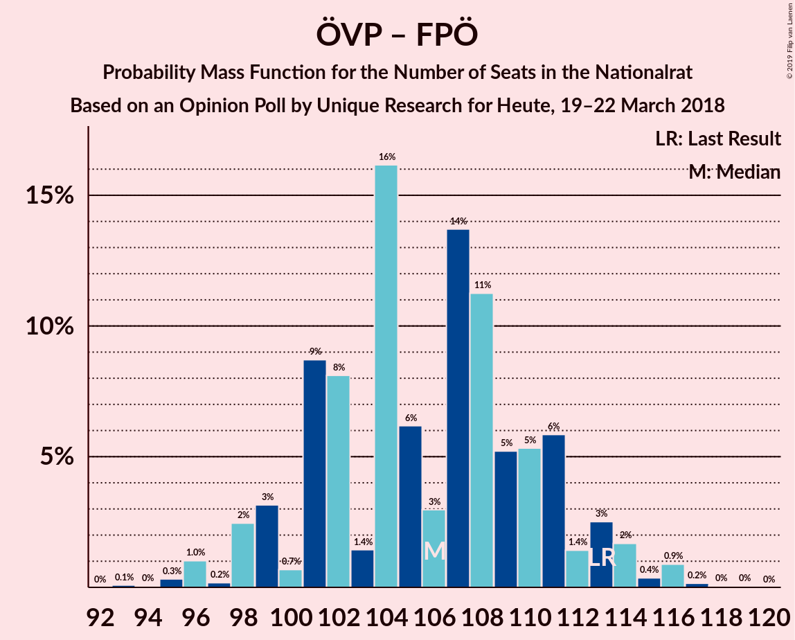

| Number of Seats | Probability | Accumulated | Special Marks |
|:---------------:|:-----------:|:-----------:|:-------------:|
| 93 | 0.1% | 100% |  |
| 94 | 0% | 99.9% |  |
| 95 | 0.3% | 99.9% |  |
| 96 | 1.0% | 99.5% |  |
| 97 | 0.2% | 98.5% |  |
| 98 | 2% | 98% |  |
| 99 | 3% | 96% |  |
| 100 | 0.7% | 93% |  |
| 101 | 9% | 92% |  |
| 102 | 8% | 83% |  |
| 103 | 1.4% | 75% |  |
| 104 | 16% | 74% |  |
| 105 | 6% | 58% |  |
| 106 | 3% | 51% | Median |
| 107 | 14% | 48% |  |
| 108 | 11% | 35% |  |
| 109 | 5% | 24% |  |
| 110 | 5% | 18% |  |
| 111 | 6% | 13% |  |
| 112 | 1.4% | 7% |  |
| 113 | 3% | 6% | Last Result |
| 114 | 2% | 3% |  |
| 115 | 0.4% | 2% |  |
| 116 | 0.9% | 1.1% |  |
| 117 | 0.2% | 0.3% |  |
| 118 | 0% | 0.1% |  |
| 119 | 0% | 0% |  |

### Sozialdemokratische Partei Österreichs – Freiheitliche Partei Österreichs

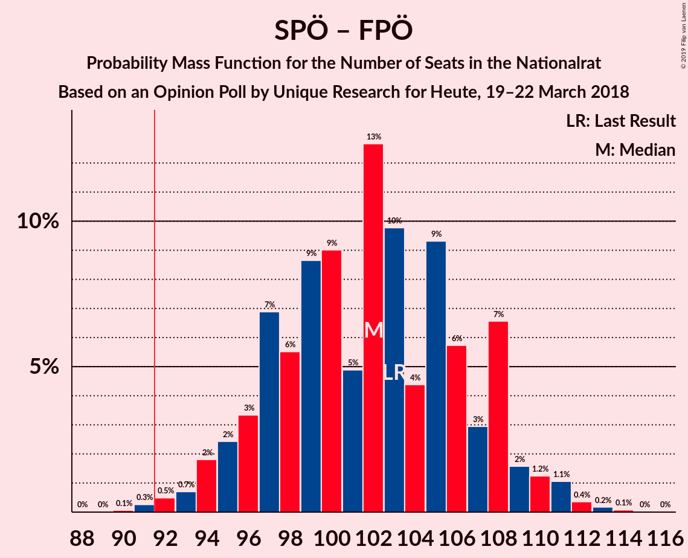

| Number of Seats | Probability | Accumulated | Special Marks |
|:---------------:|:-----------:|:-----------:|:-------------:|
| 90 | 0.1% | 100% |  |
| 91 | 0.3% | 99.9% |  |
| 92 | 0.5% | 99.6% | Majority |
| 93 | 0.7% | 99.1% |  |
| 94 | 2% | 98% |  |
| 95 | 2% | 97% |  |
| 96 | 3% | 94% |  |
| 97 | 7% | 91% |  |
| 98 | 6% | 84% |  |
| 99 | 9% | 78% |  |
| 100 | 9% | 70% |  |
| 101 | 5% | 61% |  |
| 102 | 13% | 56% | Median |
| 103 | 10% | 43% | Last Result |
| 104 | 4% | 33% |  |
| 105 | 9% | 29% |  |
| 106 | 6% | 20% |  |
| 107 | 3% | 14% |  |
| 108 | 7% | 11% |  |
| 109 | 2% | 5% |  |
| 110 | 1.2% | 3% |  |
| 111 | 1.1% | 2% |  |
| 112 | 0.4% | 0.6% |  |
| 113 | 0.2% | 0.3% |  |
| 114 | 0.1% | 0.1% |  |
| 115 | 0% | 0% |  |

### Österreichische Volkspartei – NEOS–Das Neue Österreich und Liberales Forum – Die Grünen–Die Grüne Alternative

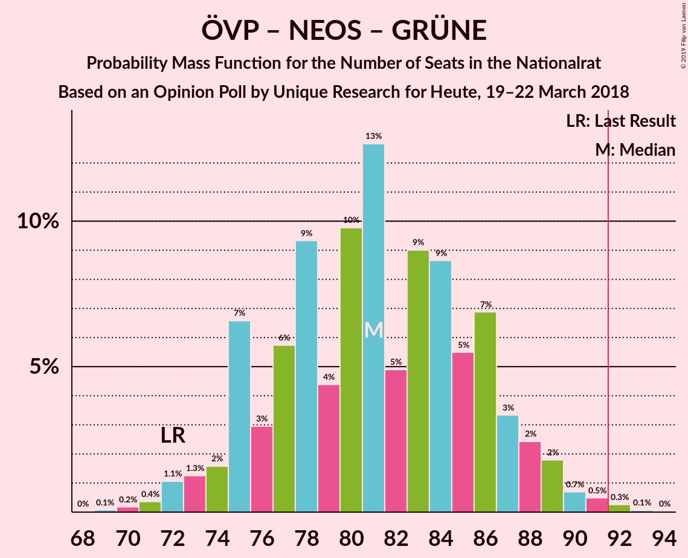

| Number of Seats | Probability | Accumulated | Special Marks |
|:---------------:|:-----------:|:-----------:|:-------------:|
| 69 | 0.1% | 100% |  |
| 70 | 0.2% | 99.9% |  |
| 71 | 0.4% | 99.7% |  |
| 72 | 1.1% | 99.3% | Last Result |
| 73 | 1.3% | 98% |  |
| 74 | 2% | 97% |  |
| 75 | 7% | 95% |  |
| 76 | 3% | 89% |  |
| 77 | 6% | 86% |  |
| 78 | 9% | 80% |  |
| 79 | 4% | 71% |  |
| 80 | 10% | 66% |  |
| 81 | 13% | 57% |  |
| 82 | 5% | 44% |  |
| 83 | 9% | 39% |  |
| 84 | 9% | 30% | Median |
| 85 | 5% | 21% |  |
| 86 | 7% | 16% |  |
| 87 | 3% | 9% |  |
| 88 | 2% | 6% |  |
| 89 | 2% | 3% |  |
| 90 | 0.7% | 2% |  |
| 91 | 0.5% | 0.9% |  |
| 92 | 0.3% | 0.4% | Majority |
| 93 | 0.1% | 0.1% |  |
| 94 | 0% | 0% |  |

### Sozialdemokratische Partei Österreichs – NEOS–Das Neue Österreich und Liberales Forum – Die Grünen–Die Grüne Alternative

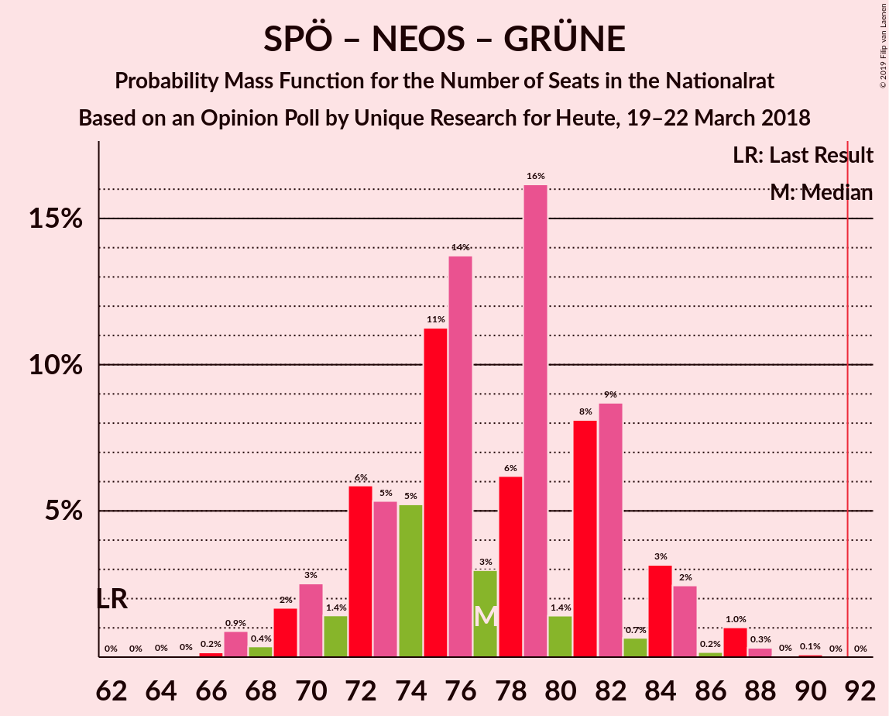

| Number of Seats | Probability | Accumulated | Special Marks |
|:---------------:|:-----------:|:-----------:|:-------------:|
| 62 | 0% | 100% | Last Result |
| 63 | 0% | 100% |  |
| 64 | 0% | 100% |  |
| 65 | 0% | 100% |  |
| 66 | 0.2% | 99.9% |  |
| 67 | 0.9% | 99.7% |  |
| 68 | 0.4% | 98.9% |  |
| 69 | 2% | 98% |  |
| 70 | 3% | 97% |  |
| 71 | 1.4% | 94% |  |
| 72 | 6% | 93% |  |
| 73 | 5% | 87% |  |
| 74 | 5% | 82% |  |
| 75 | 11% | 76% |  |
| 76 | 14% | 65% |  |
| 77 | 3% | 51% |  |
| 78 | 6% | 48% |  |
| 79 | 16% | 42% |  |
| 80 | 1.4% | 26% | Median |
| 81 | 8% | 25% |  |
| 82 | 9% | 17% |  |
| 83 | 0.7% | 8% |  |
| 84 | 3% | 7% |  |
| 85 | 2% | 4% |  |
| 86 | 0.2% | 2% |  |
| 87 | 1.0% | 1.5% |  |
| 88 | 0.3% | 0.5% |  |
| 89 | 0% | 0.1% |  |
| 90 | 0.1% | 0.1% |  |
| 91 | 0% | 0% |  |

### Österreichische Volkspartei – NEOS–Das Neue Österreich und Liberales Forum

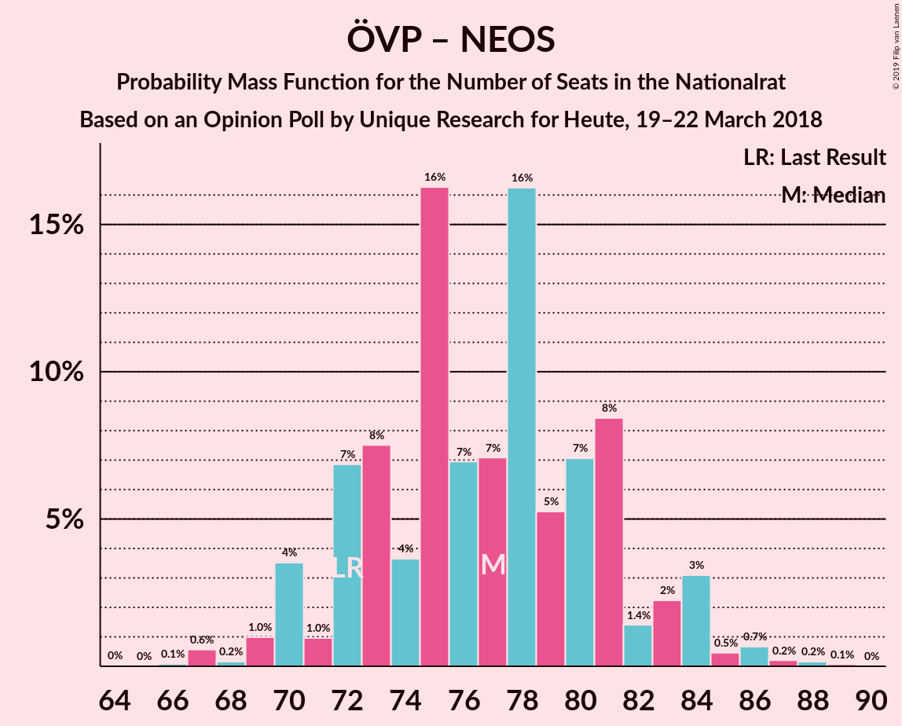

| Number of Seats | Probability | Accumulated | Special Marks |
|:---------------:|:-----------:|:-----------:|:-------------:|
| 65 | 0% | 100% |  |
| 66 | 0.1% | 99.9% |  |
| 67 | 0.6% | 99.9% |  |
| 68 | 0.2% | 99.3% |  |
| 69 | 1.0% | 99.1% |  |
| 70 | 4% | 98% |  |
| 71 | 1.0% | 95% |  |
| 72 | 7% | 94% | Last Result |
| 73 | 8% | 87% |  |
| 74 | 4% | 79% |  |
| 75 | 16% | 76% |  |
| 76 | 7% | 59% |  |
| 77 | 7% | 52% | Median |
| 78 | 16% | 45% |  |
| 79 | 5% | 29% |  |
| 80 | 7% | 24% |  |
| 81 | 8% | 17% |  |
| 82 | 1.4% | 8% |  |
| 83 | 2% | 7% |  |
| 84 | 3% | 5% |  |
| 85 | 0.5% | 2% |  |
| 86 | 0.7% | 1.1% |  |
| 87 | 0.2% | 0.5% |  |
| 88 | 0.2% | 0.3% |  |
| 89 | 0.1% | 0.1% |  |
| 90 | 0% | 0% |  |

### Österreichische Volkspartei – Die Grünen–Die Grüne Alternative

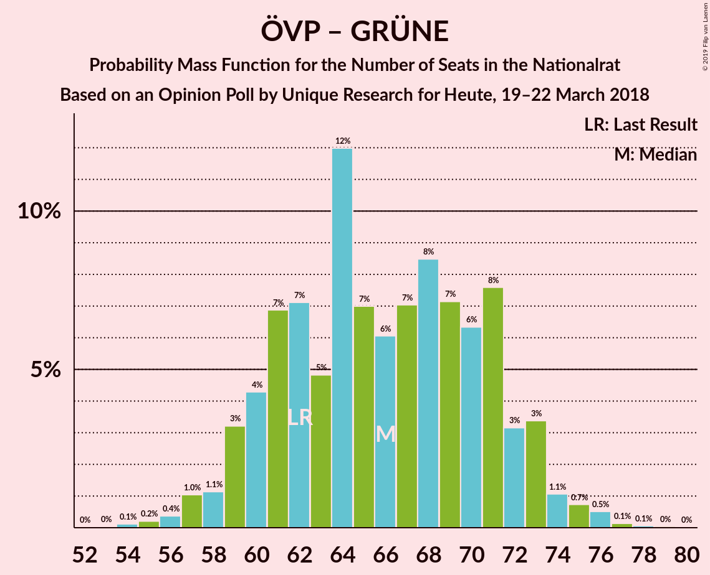

| Number of Seats | Probability | Accumulated | Special Marks |
|:---------------:|:-----------:|:-----------:|:-------------:|
| 53 | 0% | 100% |  |
| 54 | 0.1% | 99.9% |  |
| 55 | 0.2% | 99.8% |  |
| 56 | 0.4% | 99.6% |  |
| 57 | 1.0% | 99.2% |  |
| 58 | 1.1% | 98% |  |
| 59 | 3% | 97% |  |
| 60 | 4% | 94% |  |
| 61 | 7% | 90% |  |
| 62 | 7% | 83% | Last Result |
| 63 | 5% | 76% |  |
| 64 | 12% | 71% |  |
| 65 | 7% | 59% |  |
| 66 | 6% | 52% |  |
| 67 | 7% | 46% |  |
| 68 | 8% | 39% |  |
| 69 | 7% | 30% | Median |
| 70 | 6% | 23% |  |
| 71 | 8% | 17% |  |
| 72 | 3% | 9% |  |
| 73 | 3% | 6% |  |
| 74 | 1.1% | 3% |  |
| 75 | 0.7% | 2% |  |
| 76 | 0.5% | 0.8% |  |
| 77 | 0.1% | 0.3% |  |
| 78 | 0.1% | 0.1% |  |
| 79 | 0% | 0.1% |  |
| 80 | 0% | 0% |  |

### Österreichische Volkspartei

| Number of Seats | Probability | Accumulated | Special Marks |
|:---------------:|:-----------:|:-----------:|:-------------:|
| 51 | 0.1% | 100% |  |
| 52 | 0.1% | 99.9% |  |
| 53 | 0.4% | 99.8% |  |
| 54 | 1.0% | 99.3% |  |
| 55 | 2% | 98% |  |
| 56 | 4% | 96% |  |
| 57 | 6% | 92% |  |
| 58 | 5% | 86% |  |
| 59 | 7% | 82% |  |
| 60 | 11% | 74% |  |
| 61 | 13% | 64% |  |
| 62 | 11% | 50% | Last Result, Median |
| 63 | 8% | 39% |  |
| 64 | 13% | 31% |  |
| 65 | 6% | 17% |  |
| 66 | 4% | 12% |  |
| 67 | 3% | 8% |  |
| 68 | 1.3% | 4% |  |
| 69 | 2% | 3% |  |
| 70 | 0.8% | 1.5% |  |
| 71 | 0.4% | 0.7% |  |
| 72 | 0.2% | 0.2% |  |
| 73 | 0% | 0.1% |  |
| 74 | 0% | 0% |  |

### Sozialdemokratische Partei Österreichs

| Number of Seats | Probability | Accumulated | Special Marks |
|:---------------:|:-----------:|:-----------:|:-------------:|
| 47 | 0% | 100% |  |
| 48 | 0.2% | 99.9% |  |
| 49 | 0.3% | 99.8% |  |
| 50 | 0.7% | 99.4% |  |
| 51 | 2% | 98.7% |  |
| 52 | 3% | 97% | Last Result |
| 53 | 6% | 94% |  |
| 54 | 7% | 89% |  |
| 55 | 6% | 82% |  |
| 56 | 11% | 75% |  |
| 57 | 11% | 65% |  |
| 58 | 15% | 54% | Median |
| 59 | 9% | 38% |  |
| 60 | 10% | 30% |  |
| 61 | 7% | 20% |  |
| 62 | 5% | 13% |  |
| 63 | 4% | 8% |  |
| 64 | 2% | 4% |  |
| 65 | 1.2% | 3% |  |
| 66 | 0.9% | 1.4% |  |
| 67 | 0.3% | 0.5% |  |
| 68 | 0.2% | 0.3% |  |
| 69 | 0.1% | 0.1% |  |
| 70 | 0% | 0% |  |

## Technical Information

### Opinion Poll

+ **Polling firm:** Unique Research
+ **Commissioner(s):** Heute
+ **Fieldwork period:** 19–22 March 2018

### Calculations

+ **Sample size:** 800
+ **Simulations done:** 131,072
+ **Error estimate:** 1.40%

