# Opinion Poll by Spectra for OÖNachrichten, 6–26 March 2018

<a href="#voting-intentions">Voting Intentions</a> | <a href="#seats">Seats</a> | <a href="#coalitions">Coalitions</a> | <a href="#technical-information">Technical Information</a>

## Voting Intentions

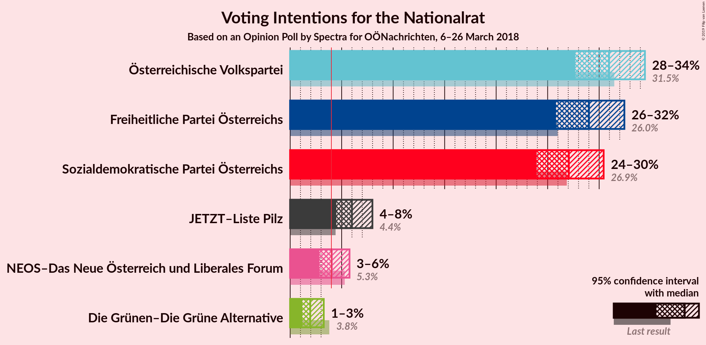

### Confidence Intervals

| Party | Last Result | Poll Result | 80% Confidence Interval | 90% Confidence Interval | 95% Confidence Interval | 99% Confidence Interval |
|:-----:|:-----------:|:-----------:|:-----------------------:|:-----------------------:|:-----------------------:|:-----------------------:|
| Österreichische Volkspartei | 31.5% | 31.0% | 28.8–33.2% |28.2–33.9% |27.7–34.4% |26.7–35.6% |
| Freiheitliche Partei Österreichs | 26.0% | 29.0% | 26.9–31.3% |26.3–31.9% |25.8–32.4% |24.8–33.5% |
| Sozialdemokratische Partei Österreichs | 26.9% | 27.1% | 25.0–29.3% |24.4–29.9% |23.9–30.4% |23.0–31.5% |
| JETZT–Liste Pilz | 4.4% | 6.0% | 5.0–7.3% |4.7–7.7% |4.5–8.0% |4.0–8.7% |
| NEOS–Das Neue Österreich und Liberales Forum | 5.3% | 4.0% | 3.2–5.2% |3.0–5.5% |2.8–5.8% |2.5–6.3% |
| Die Grünen–Die Grüne Alternative | 3.8% | 2.0% | 1.4–2.8% |1.3–3.0% |1.2–3.3% |1.0–3.7% |

*Note:* The poll result column reflects the actual value used in the calculations. Published results may vary slightly, and in addition be rounded to fewer digits.

## Seats

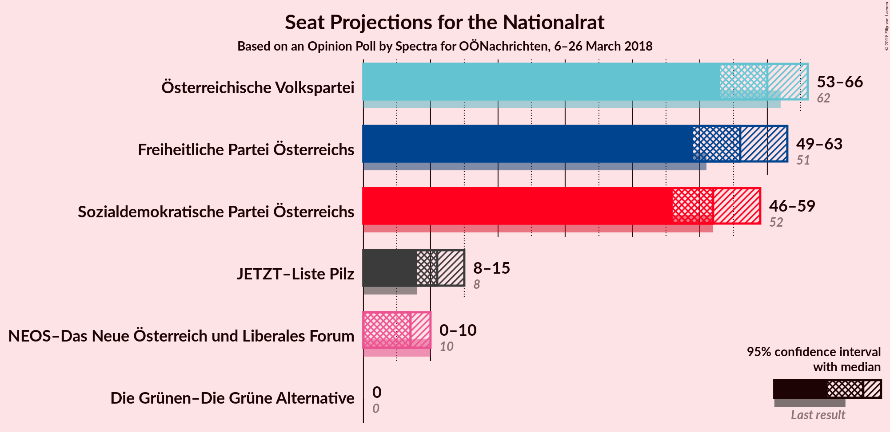

### Confidence Intervals

| Party | Last Result | Median | 80% Confidence Interval | 90% Confidence Interval | 95% Confidence Interval | 99% Confidence Interval |
|:-----:|:-----------:|:------:|:-----------------------:|:-----------------------:|:-----------------------:|:-----------------------:|
| <a href="#österreichische-volkspartei">Österreichische Volkspartei</a> | 62 | 60 | 55–64 |54–66 |53–66 |51–69 |
| <a href="#freiheitliche-partei-österreichs">Freiheitliche Partei Österreichs</a> | 51 | 56 | 51–60 |50–61 |49–63 |47–65 |
| <a href="#sozialdemokratische-partei-österreichs">Sozialdemokratische Partei Österreichs</a> | 52 | 52 | 48–56 |47–58 |46–59 |44–61 |
| <a href="#jetzt–liste-pilz">JETZT–Liste Pilz</a> | 8 | 11 | 9–14 |9–15 |8–15 |7–16 |
| <a href="#neos–das-neue-österreich-und-liberales-forum">NEOS–Das Neue Österreich und Liberales Forum</a> | 10 | 7 | 0–9 |0–10 |0–10 |0–12 |
| <a href="#die-grünen–die-grüne-alternative">Die Grünen–Die Grüne Alternative</a> | 0 | 0 | 0 |0 |0 |0 |

### Österreichische Volkspartei

*For a full overview of the results for this party, see the [Österreichische Volkspartei](party-österreichischevolkspartei.html) page.*

| Number of Seats | Probability | Accumulated | Special Marks |
|:---------------:|:-----------:|:-----------:|:-------------:|
| 49 | 0.1% | 100% |  |
| 50 | 0.3% | 99.9% |  |
| 51 | 0.5% | 99.6% |  |
| 52 | 1.1% | 99.1% |  |
| 53 | 2% | 98% |  |
| 54 | 4% | 96% |  |
| 55 | 5% | 93% |  |
| 56 | 6% | 87% |  |
| 57 | 7% | 81% |  |
| 58 | 12% | 74% |  |
| 59 | 10% | 62% |  |
| 60 | 11% | 53% | Median |
| 61 | 9% | 41% |  |
| 62 | 13% | 33% | Last Result |
| 63 | 7% | 20% |  |
| 64 | 3% | 13% |  |
| 65 | 4% | 10% |  |
| 66 | 3% | 6% |  |
| 67 | 1.1% | 2% |  |
| 68 | 0.4% | 1.0% |  |
| 69 | 0.4% | 0.7% |  |
| 70 | 0.2% | 0.3% |  |
| 71 | 0% | 0.1% |  |
| 72 | 0% | 0% |  |

### Freiheitliche Partei Österreichs

*For a full overview of the results for this party, see the [Freiheitliche Partei Österreichs](party-freiheitlicheparteiösterreichs.html) page.*

| Number of Seats | Probability | Accumulated | Special Marks |
|:---------------:|:-----------:|:-----------:|:-------------:|
| 45 | 0.1% | 100% |  |
| 46 | 0.1% | 99.9% |  |
| 47 | 0.6% | 99.8% |  |
| 48 | 0.7% | 99.2% |  |
| 49 | 2% | 98% |  |
| 50 | 3% | 96% |  |
| 51 | 7% | 93% | Last Result |
| 52 | 6% | 86% |  |
| 53 | 7% | 81% |  |
| 54 | 7% | 74% |  |
| 55 | 15% | 67% |  |
| 56 | 15% | 51% | Median |
| 57 | 13% | 36% |  |
| 58 | 5% | 24% |  |
| 59 | 8% | 19% |  |
| 60 | 3% | 11% |  |
| 61 | 4% | 8% |  |
| 62 | 2% | 4% |  |
| 63 | 1.4% | 3% |  |
| 64 | 0.6% | 1.2% |  |
| 65 | 0.3% | 0.6% |  |
| 66 | 0.1% | 0.3% |  |
| 67 | 0.1% | 0.2% |  |
| 68 | 0% | 0.1% |  |
| 69 | 0% | 0% |  |

### Sozialdemokratische Partei Österreichs

*For a full overview of the results for this party, see the [Sozialdemokratische Partei Österreichs](party-sozialdemokratischeparteiösterreichs.html) page.*

| Number of Seats | Probability | Accumulated | Special Marks |
|:---------------:|:-----------:|:-----------:|:-------------:|
| 42 | 0.2% | 100% |  |
| 43 | 0.2% | 99.8% |  |
| 44 | 0.6% | 99.6% |  |
| 45 | 1.2% | 99.0% |  |
| 46 | 3% | 98% |  |
| 47 | 4% | 95% |  |
| 48 | 6% | 91% |  |
| 49 | 6% | 85% |  |
| 50 | 11% | 80% |  |
| 51 | 9% | 69% |  |
| 52 | 16% | 59% | Last Result, Median |
| 53 | 10% | 43% |  |
| 54 | 10% | 33% |  |
| 55 | 5% | 22% |  |
| 56 | 9% | 18% |  |
| 57 | 2% | 8% |  |
| 58 | 3% | 6% |  |
| 59 | 1.2% | 3% |  |
| 60 | 0.6% | 1.5% |  |
| 61 | 0.4% | 0.9% |  |
| 62 | 0.3% | 0.4% |  |
| 63 | 0.1% | 0.1% |  |
| 64 | 0% | 0% |  |

### JETZT–Liste Pilz

*For a full overview of the results for this party, see the [JETZT–Liste Pilz](party-jetzt–listepilz.html) page.*

| Number of Seats | Probability | Accumulated | Special Marks |
|:---------------:|:-----------:|:-----------:|:-------------:|
| 0 | 0.5% | 100% |  |
| 1 | 0% | 99.5% |  |
| 2 | 0% | 99.5% |  |
| 3 | 0% | 99.5% |  |
| 4 | 0% | 99.5% |  |
| 5 | 0% | 99.5% |  |
| 6 | 0% | 99.5% |  |
| 7 | 0.4% | 99.5% |  |
| 8 | 2% | 99.1% | Last Result |
| 9 | 7% | 97% |  |
| 10 | 20% | 89% |  |
| 11 | 28% | 69% | Median |
| 12 | 24% | 41% |  |
| 13 | 6% | 18% |  |
| 14 | 5% | 11% |  |
| 15 | 5% | 6% |  |
| 16 | 1.0% | 1.3% |  |
| 17 | 0.3% | 0.4% |  |
| 18 | 0% | 0.1% |  |
| 19 | 0% | 0% |  |

### NEOS–Das Neue Österreich und Liberales Forum

*For a full overview of the results for this party, see the [NEOS–Das Neue Österreich und Liberales Forum](party-neos–dasneueösterreichundliberalesforum.html) page.*

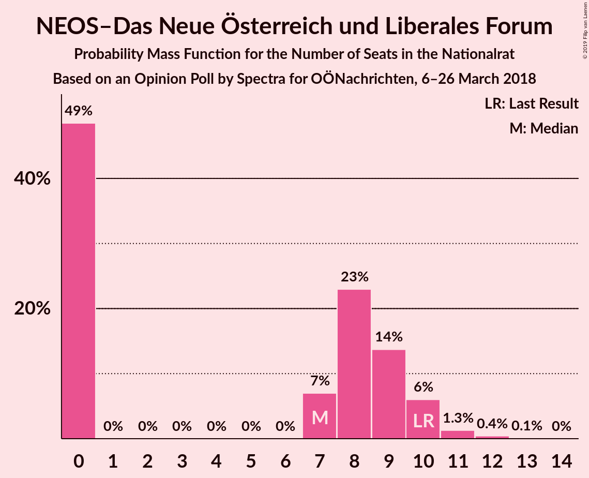

| Number of Seats | Probability | Accumulated | Special Marks |
|:---------------:|:-----------:|:-----------:|:-------------:|
| 0 | 49% | 100% |  |
| 1 | 0% | 51% |  |
| 2 | 0% | 51% |  |
| 3 | 0% | 51% |  |
| 4 | 0% | 51% |  |
| 5 | 0% | 51% |  |
| 6 | 0% | 51% |  |
| 7 | 7% | 51% | Median |
| 8 | 23% | 45% |  |
| 9 | 14% | 22% |  |
| 10 | 6% | 8% | Last Result |
| 11 | 1.3% | 2% |  |
| 12 | 0.4% | 0.5% |  |
| 13 | 0.1% | 0.1% |  |
| 14 | 0% | 0% |  |

### Die Grünen–Die Grüne Alternative

*For a full overview of the results for this party, see the [Die Grünen–Die Grüne Alternative](party-diegrünen–diegrünealternative.html) page.*

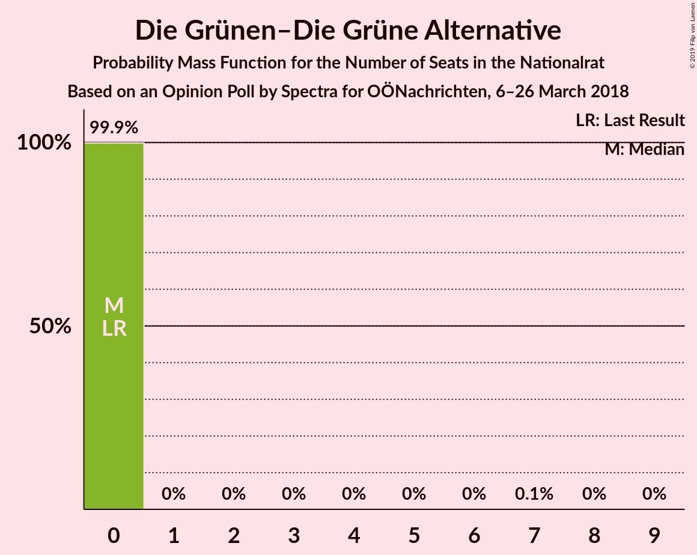

| Number of Seats | Probability | Accumulated | Special Marks |
|:---------------:|:-----------:|:-----------:|:-------------:|
| 0 | 99.9% | 100% | Last Result, Median |
| 1 | 0% | 0.1% |  |
| 2 | 0% | 0.1% |  |
| 3 | 0% | 0.1% |  |
| 4 | 0% | 0.1% |  |
| 5 | 0% | 0.1% |  |
| 6 | 0% | 0.1% |  |
| 7 | 0.1% | 0.1% |  |
| 8 | 0% | 0.1% |  |
| 9 | 0% | 0% |  |

## Coalitions

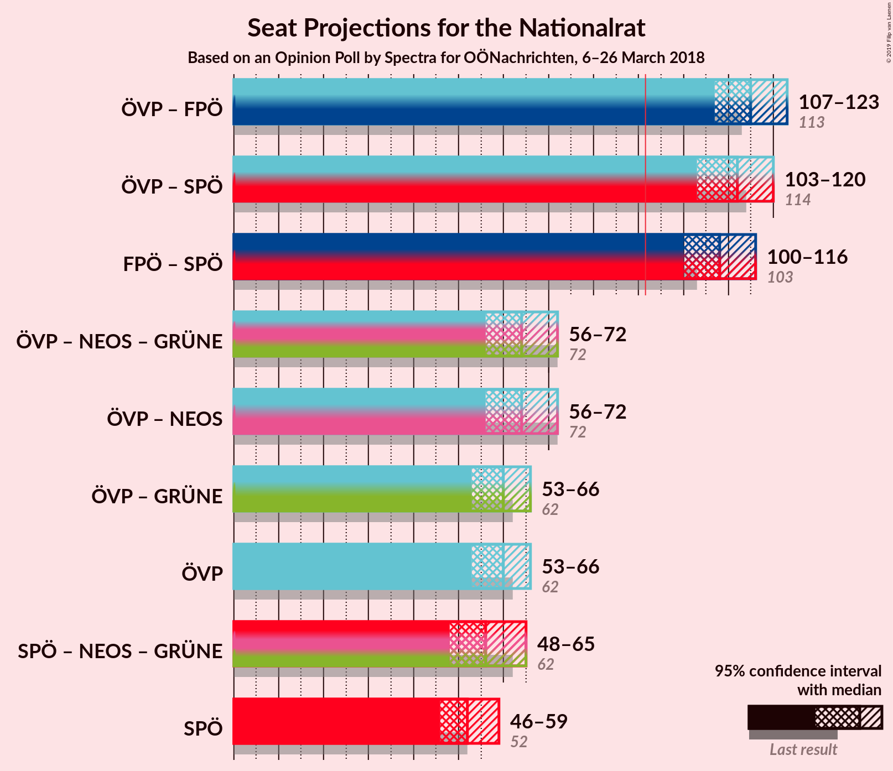

### Confidence Intervals

| Coalition | Last Result | Median | Majority? | 80% Confidence Interval | 90% Confidence Interval | 95% Confidence Interval | 99% Confidence Interval |
|:---------:|:-----------:|:------:|:---------:|:-----------------------:|:-----------------------:|:-----------------------:|:-----------------------:|
| Österreichische Volkspartei – Freiheitliche Partei Österreichs | 113 | 115 | 100% | 110–121 | 108–122 | 107–123 | 105–126 |
| Österreichische Volkspartei – Sozialdemokratische Partei Österreichs | 114 | 112 | 100% | 106–117 | 105–118 | 103–120 | 101–122 |
| Freiheitliche Partei Österreichs – Sozialdemokratische Partei Österreichs | 103 | 108 | 100% | 102–113 | 100–115 | 100–116 | 97–119 |
| Österreichische Volkspartei – NEOS–Das Neue Österreich und Liberales Forum – Die Grünen–Die Grüne Alternative | 72 | 64 | 0% | 58–70 | 57–71 | 56–72 | 54–75 |
| Österreichische Volkspartei – NEOS–Das Neue Österreich und Liberales Forum | 72 | 64 | 0% | 58–70 | 57–71 | 56–72 | 54–75 |
| Österreichische Volkspartei – Die Grünen–Die Grüne Alternative | 62 | 60 | 0% | 55–64 | 54–66 | 53–66 | 51–69 |
| Österreichische Volkspartei | 62 | 60 | 0% | 55–64 | 54–66 | 53–66 | 51–69 |
| Sozialdemokratische Partei Österreichs – NEOS–Das Neue Österreich und Liberales Forum – Die Grünen–Die Grüne Alternative | 62 | 56 | 0% | 51–62 | 50–63 | 48–65 | 46–67 |
| Sozialdemokratische Partei Österreichs | 52 | 52 | 0% | 48–56 | 47–58 | 46–59 | 44–61 |

### Österreichische Volkspartei – Freiheitliche Partei Österreichs

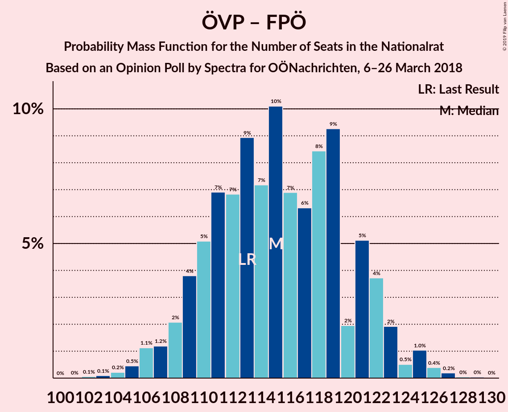

| Number of Seats | Probability | Accumulated | Special Marks |
|:---------------:|:-----------:|:-----------:|:-------------:|
| 102 | 0.1% | 100% |  |
| 103 | 0.1% | 99.9% |  |
| 104 | 0.2% | 99.8% |  |
| 105 | 0.5% | 99.6% |  |
| 106 | 1.1% | 99.1% |  |
| 107 | 1.2% | 98% |  |
| 108 | 2% | 97% |  |
| 109 | 4% | 95% |  |
| 110 | 5% | 91% |  |
| 111 | 7% | 86% |  |
| 112 | 7% | 79% |  |
| 113 | 9% | 72% | Last Result |
| 114 | 7% | 63% |  |
| 115 | 10% | 56% |  |
| 116 | 7% | 46% | Median |
| 117 | 6% | 39% |  |
| 118 | 8% | 33% |  |
| 119 | 9% | 24% |  |
| 120 | 2% | 15% |  |
| 121 | 5% | 13% |  |
| 122 | 4% | 8% |  |
| 123 | 2% | 4% |  |
| 124 | 0.5% | 2% |  |
| 125 | 1.0% | 2% |  |
| 126 | 0.4% | 0.7% |  |
| 127 | 0.2% | 0.3% |  |
| 128 | 0% | 0.1% |  |
| 129 | 0% | 0.1% |  |
| 130 | 0% | 0% |  |

### Österreichische Volkspartei – Sozialdemokratische Partei Österreichs

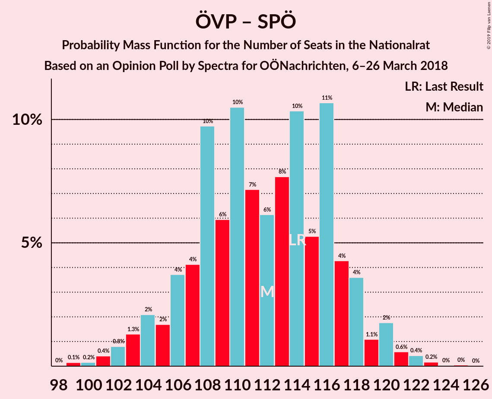

| Number of Seats | Probability | Accumulated | Special Marks |
|:---------------:|:-----------:|:-----------:|:-------------:|
| 98 | 0% | 100% |  |
| 99 | 0.1% | 99.9% |  |
| 100 | 0.2% | 99.8% |  |
| 101 | 0.4% | 99.6% |  |
| 102 | 0.8% | 99.2% |  |
| 103 | 1.3% | 98% |  |
| 104 | 2% | 97% |  |
| 105 | 2% | 95% |  |
| 106 | 4% | 93% |  |
| 107 | 4% | 90% |  |
| 108 | 10% | 85% |  |
| 109 | 6% | 76% |  |
| 110 | 10% | 70% |  |
| 111 | 7% | 59% |  |
| 112 | 6% | 52% | Median |
| 113 | 8% | 46% |  |
| 114 | 10% | 38% | Last Result |
| 115 | 5% | 28% |  |
| 116 | 11% | 23% |  |
| 117 | 4% | 12% |  |
| 118 | 4% | 8% |  |
| 119 | 1.1% | 4% |  |
| 120 | 2% | 3% |  |
| 121 | 0.6% | 1.3% |  |
| 122 | 0.4% | 0.7% |  |
| 123 | 0.2% | 0.3% |  |
| 124 | 0% | 0.1% |  |
| 125 | 0% | 0.1% |  |
| 126 | 0% | 0% |  |

### Freiheitliche Partei Österreichs – Sozialdemokratische Partei Österreichs

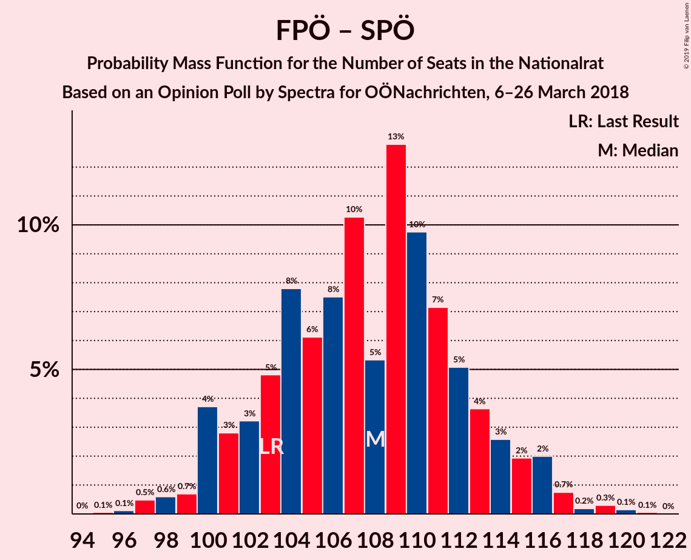

| Number of Seats | Probability | Accumulated | Special Marks |
|:---------------:|:-----------:|:-----------:|:-------------:|
| 94 | 0% | 100% |  |
| 95 | 0.1% | 99.9% |  |
| 96 | 0.1% | 99.9% |  |
| 97 | 0.5% | 99.8% |  |
| 98 | 0.6% | 99.3% |  |
| 99 | 0.7% | 98.7% |  |
| 100 | 4% | 98% |  |
| 101 | 3% | 94% |  |
| 102 | 3% | 91% |  |
| 103 | 5% | 88% | Last Result |
| 104 | 8% | 83% |  |
| 105 | 6% | 76% |  |
| 106 | 8% | 70% |  |
| 107 | 10% | 62% |  |
| 108 | 5% | 52% | Median |
| 109 | 13% | 46% |  |
| 110 | 10% | 34% |  |
| 111 | 7% | 24% |  |
| 112 | 5% | 17% |  |
| 113 | 4% | 12% |  |
| 114 | 3% | 8% |  |
| 115 | 2% | 5% |  |
| 116 | 2% | 3% |  |
| 117 | 0.7% | 1.5% |  |
| 118 | 0.2% | 0.7% |  |
| 119 | 0.3% | 0.5% |  |
| 120 | 0.1% | 0.2% |  |
| 121 | 0.1% | 0.1% |  |
| 122 | 0% | 0% |  |

### Österreichische Volkspartei – NEOS–Das Neue Österreich und Liberales Forum – Die Grünen–Die Grüne Alternative

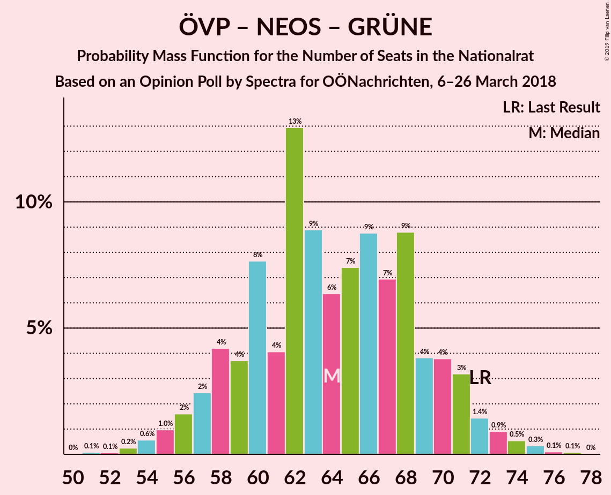

| Number of Seats | Probability | Accumulated | Special Marks |
|:---------------:|:-----------:|:-----------:|:-------------:|
| 51 | 0.1% | 100% |  |
| 52 | 0.1% | 99.9% |  |
| 53 | 0.2% | 99.8% |  |
| 54 | 0.6% | 99.6% |  |
| 55 | 1.0% | 99.0% |  |
| 56 | 2% | 98% |  |
| 57 | 2% | 96% |  |
| 58 | 4% | 94% |  |
| 59 | 4% | 90% |  |
| 60 | 8% | 86% |  |
| 61 | 4% | 78% |  |
| 62 | 13% | 74% |  |
| 63 | 9% | 61% |  |
| 64 | 6% | 53% |  |
| 65 | 7% | 46% |  |
| 66 | 9% | 39% |  |
| 67 | 7% | 30% | Median |
| 68 | 9% | 23% |  |
| 69 | 4% | 14% |  |
| 70 | 4% | 10% |  |
| 71 | 3% | 7% |  |
| 72 | 1.4% | 3% | Last Result |
| 73 | 0.9% | 2% |  |
| 74 | 0.5% | 1.1% |  |
| 75 | 0.3% | 0.6% |  |
| 76 | 0.1% | 0.2% |  |
| 77 | 0.1% | 0.1% |  |
| 78 | 0% | 0% |  |

### Österreichische Volkspartei – NEOS–Das Neue Österreich und Liberales Forum

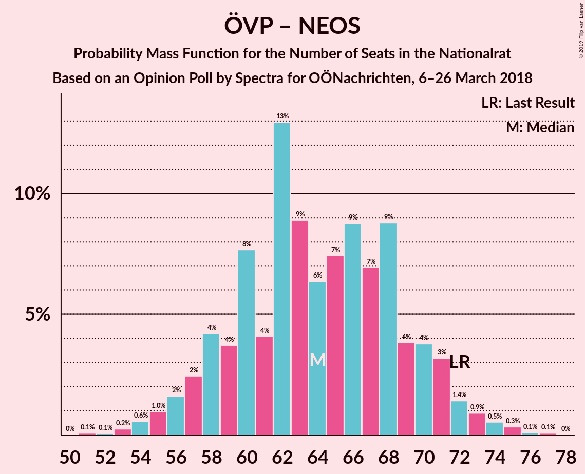

| Number of Seats | Probability | Accumulated | Special Marks |
|:---------------:|:-----------:|:-----------:|:-------------:|
| 51 | 0.1% | 100% |  |
| 52 | 0.1% | 99.9% |  |
| 53 | 0.2% | 99.8% |  |
| 54 | 0.6% | 99.6% |  |
| 55 | 1.0% | 99.0% |  |
| 56 | 2% | 98% |  |
| 57 | 2% | 96% |  |
| 58 | 4% | 94% |  |
| 59 | 4% | 90% |  |
| 60 | 8% | 86% |  |
| 61 | 4% | 78% |  |
| 62 | 13% | 74% |  |
| 63 | 9% | 61% |  |
| 64 | 6% | 52% |  |
| 65 | 7% | 46% |  |
| 66 | 9% | 39% |  |
| 67 | 7% | 30% | Median |
| 68 | 9% | 23% |  |
| 69 | 4% | 14% |  |
| 70 | 4% | 10% |  |
| 71 | 3% | 7% |  |
| 72 | 1.4% | 3% | Last Result |
| 73 | 0.9% | 2% |  |
| 74 | 0.5% | 1.1% |  |
| 75 | 0.3% | 0.5% |  |
| 76 | 0.1% | 0.2% |  |
| 77 | 0.1% | 0.1% |  |
| 78 | 0% | 0% |  |

### Österreichische Volkspartei – Die Grünen–Die Grüne Alternative

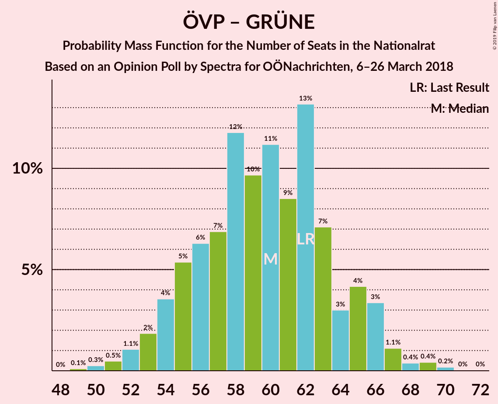

| Number of Seats | Probability | Accumulated | Special Marks |
|:---------------:|:-----------:|:-----------:|:-------------:|
| 49 | 0.1% | 100% |  |
| 50 | 0.3% | 99.9% |  |
| 51 | 0.5% | 99.6% |  |
| 52 | 1.1% | 99.1% |  |
| 53 | 2% | 98% |  |
| 54 | 4% | 96% |  |
| 55 | 5% | 93% |  |
| 56 | 6% | 87% |  |
| 57 | 7% | 81% |  |
| 58 | 12% | 74% |  |
| 59 | 10% | 62% |  |
| 60 | 11% | 53% | Median |
| 61 | 9% | 42% |  |
| 62 | 13% | 33% | Last Result |
| 63 | 7% | 20% |  |
| 64 | 3% | 13% |  |
| 65 | 4% | 10% |  |
| 66 | 3% | 6% |  |
| 67 | 1.1% | 2% |  |
| 68 | 0.4% | 1.1% |  |
| 69 | 0.4% | 0.7% |  |
| 70 | 0.2% | 0.3% |  |
| 71 | 0% | 0.1% |  |
| 72 | 0% | 0% |  |

### Österreichische Volkspartei

| Number of Seats | Probability | Accumulated | Special Marks |
|:---------------:|:-----------:|:-----------:|:-------------:|
| 49 | 0.1% | 100% |  |
| 50 | 0.3% | 99.9% |  |
| 51 | 0.5% | 99.6% |  |
| 52 | 1.1% | 99.1% |  |
| 53 | 2% | 98% |  |
| 54 | 4% | 96% |  |
| 55 | 5% | 93% |  |
| 56 | 6% | 87% |  |
| 57 | 7% | 81% |  |
| 58 | 12% | 74% |  |
| 59 | 10% | 62% |  |
| 60 | 11% | 53% | Median |
| 61 | 9% | 41% |  |
| 62 | 13% | 33% | Last Result |
| 63 | 7% | 20% |  |
| 64 | 3% | 13% |  |
| 65 | 4% | 10% |  |
| 66 | 3% | 6% |  |
| 67 | 1.1% | 2% |  |
| 68 | 0.4% | 1.0% |  |
| 69 | 0.4% | 0.7% |  |
| 70 | 0.2% | 0.3% |  |
| 71 | 0% | 0.1% |  |
| 72 | 0% | 0% |  |

### Sozialdemokratische Partei Österreichs – NEOS–Das Neue Österreich und Liberales Forum – Die Grünen–Die Grüne Alternative

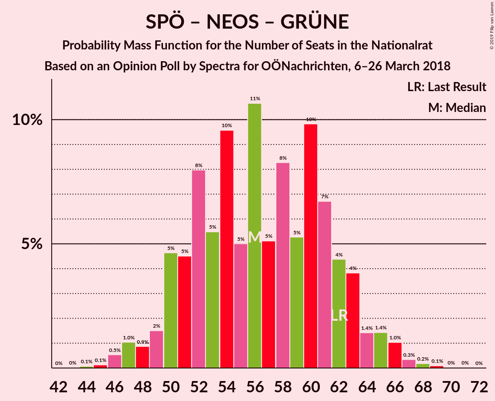

| Number of Seats | Probability | Accumulated | Special Marks |
|:---------------:|:-----------:|:-----------:|:-------------:|
| 44 | 0.1% | 100% |  |
| 45 | 0.1% | 99.9% |  |
| 46 | 0.5% | 99.8% |  |
| 47 | 1.0% | 99.2% |  |
| 48 | 0.9% | 98% |  |
| 49 | 2% | 97% |  |
| 50 | 5% | 96% |  |
| 51 | 5% | 91% |  |
| 52 | 8% | 87% |  |
| 53 | 5% | 79% |  |
| 54 | 10% | 73% |  |
| 55 | 5% | 64% |  |
| 56 | 11% | 59% |  |
| 57 | 5% | 48% |  |
| 58 | 8% | 43% |  |
| 59 | 5% | 35% | Median |
| 60 | 10% | 29% |  |
| 61 | 7% | 19% |  |
| 62 | 4% | 13% | Last Result |
| 63 | 4% | 8% |  |
| 64 | 1.4% | 5% |  |
| 65 | 1.4% | 3% |  |
| 66 | 1.0% | 2% |  |
| 67 | 0.3% | 0.7% |  |
| 68 | 0.2% | 0.3% |  |
| 69 | 0.1% | 0.1% |  |
| 70 | 0% | 0.1% |  |
| 71 | 0% | 0% |  |

### Sozialdemokratische Partei Österreichs

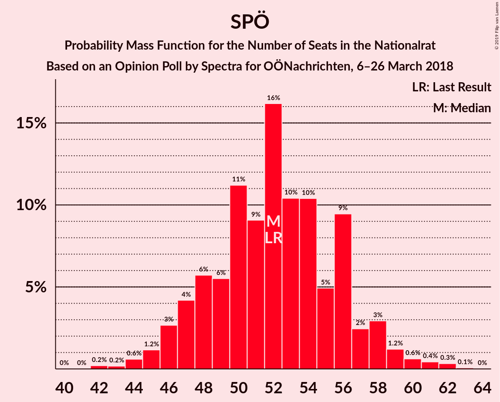

| Number of Seats | Probability | Accumulated | Special Marks |
|:---------------:|:-----------:|:-----------:|:-------------:|
| 42 | 0.2% | 100% |  |
| 43 | 0.2% | 99.8% |  |
| 44 | 0.6% | 99.6% |  |
| 45 | 1.2% | 99.0% |  |
| 46 | 3% | 98% |  |
| 47 | 4% | 95% |  |
| 48 | 6% | 91% |  |
| 49 | 6% | 85% |  |
| 50 | 11% | 80% |  |
| 51 | 9% | 69% |  |
| 52 | 16% | 59% | Last Result, Median |
| 53 | 10% | 43% |  |
| 54 | 10% | 33% |  |
| 55 | 5% | 22% |  |
| 56 | 9% | 18% |  |
| 57 | 2% | 8% |  |
| 58 | 3% | 6% |  |
| 59 | 1.2% | 3% |  |
| 60 | 0.6% | 1.5% |  |
| 61 | 0.4% | 0.9% |  |
| 62 | 0.3% | 0.4% |  |
| 63 | 0.1% | 0.1% |  |
| 64 | 0% | 0% |  |

## Technical Information

### Opinion Poll

+ **Polling firm:** Spectra
+ **Commissioner(s):** OÖNachrichten
+ **Fieldwork period:** 6–26 March 2018

### Calculations

+ **Sample size:** 717
+ **Simulations done:** 131,072
+ **Error estimate:** 1.20%

