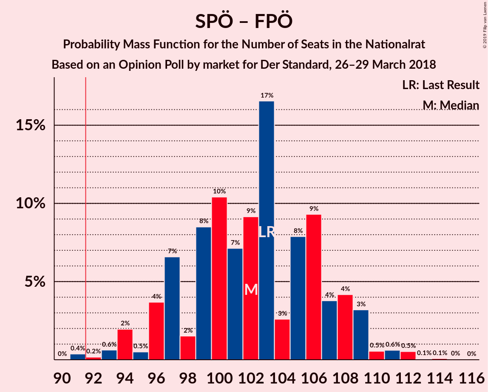
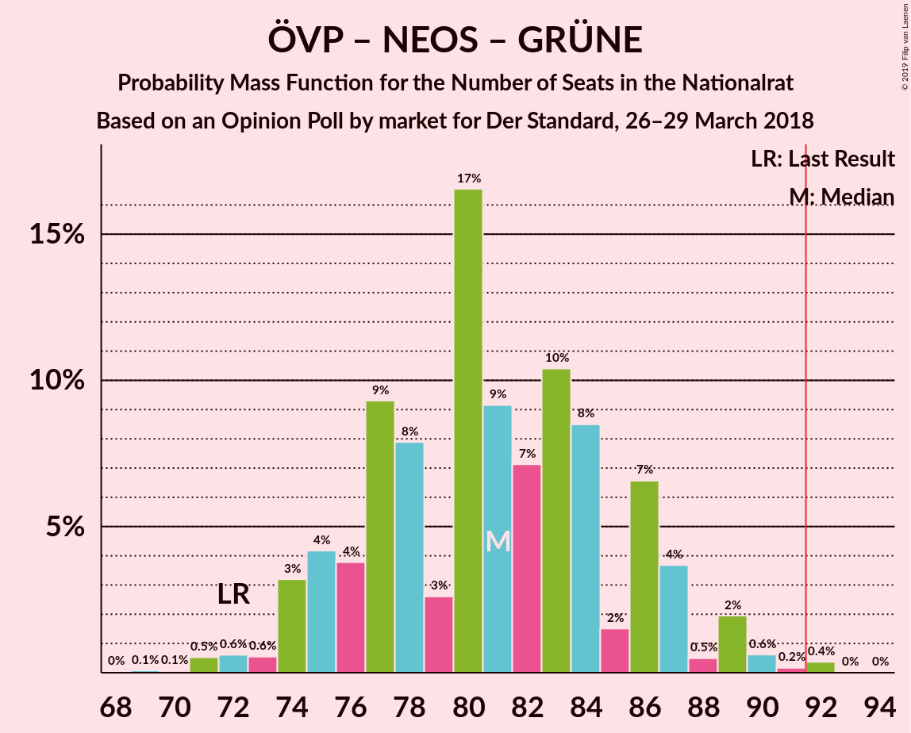
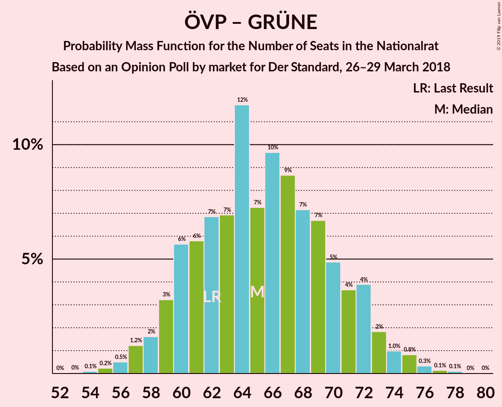

# Opinion Poll by market for Der Standard, 26–29 March 2018

<a href="#voting-intentions">Voting Intentions</a> | <a href="#seats">Seats</a> | <a href="#coalitions">Coalitions</a> | <a href="#technical-information">Technical Information</a>

## Voting Intentions

### Confidence Intervals

| Party | Last Result | Poll Result | 80% Confidence Interval | 90% Confidence Interval | 95% Confidence Interval | 99% Confidence Interval |
|:-----:|:-----------:|:-----------:|:-----------------------:|:-----------------------:|:-----------------------:|:-----------------------:|
| Österreichische Volkspartei | 31.5% | 32.1% | 30.0–34.2% |29.4–34.8% |28.9–35.4% |28.0–36.4% |
| Sozialdemokratische Partei Österreichs | 26.9% | 28.0% | 26.0–30.1% |25.5–30.7% |25.0–31.2% |24.1–32.2% |
| Freiheitliche Partei Österreichs | 26.0% | 25.0% | 23.2–27.1% |22.6–27.6% |22.2–28.1% |21.3–29.1% |
| NEOS–Das Neue Österreich und Liberales Forum | 5.3% | 8.0% | 6.9–9.4% |6.6–9.8% |6.3–10.1% |5.8–10.8% |
| Die Grünen–Die Grüne Alternative | 3.8% | 3.9% | 3.2–5.0% |3.0–5.3% |2.8–5.5% |2.5–6.1% |
| JETZT–Liste Pilz | 4.4% | 2.0% | 1.5–2.8% |1.3–3.0% |1.2–3.2% |1.0–3.6% |

*Note:* The poll result column reflects the actual value used in the calculations. Published results may vary slightly, and in addition be rounded to fewer digits.

## Seats

### Confidence Intervals

| Party | Last Result | Median | 80% Confidence Interval | 90% Confidence Interval | 95% Confidence Interval | 99% Confidence Interval |
|:-----:|:-----------:|:------:|:-----------------------:|:-----------------------:|:-----------------------:|:-----------------------:|
| <a href="#österreichische-volkspartei">Österreichische Volkspartei</a> | 62 | 62 | 60–65 |60–67 |57–74 |51–74 |
| <a href="#sozialdemokratische-partei-österreichs">Sozialdemokratische Partei Österreichs</a> | 52 | 51 | 47–54 |45–63 |45–63 |44–64 |
| <a href="#freiheitliche-partei-österreichs">Freiheitliche Partei Österreichs</a> | 51 | 51 | 41–56 |41–56 |41–56 |41–61 |
| <a href="#neos–das-neue-österreich-und-liberales-forum">NEOS–Das Neue Österreich und Liberales Forum</a> | 10 | 11 | 11–16 |11–16 |11–17 |11–18 |
| <a href="#die-grünen–die-grüne-alternative">Die Grünen–Die Grüne Alternative</a> | 0 | 8 | 0–9 |0–10 |0–10 |0–12 |
| <a href="#jetzt–liste-pilz">JETZT–Liste Pilz</a> | 8 | 0 | 0 |0 |0 |0 |

### Österreichische Volkspartei

*For a full overview of the results for this party, see the [Österreichische Volkspartei](party-österreichischevolkspartei.html) page.*

| Number of Seats | Probability | Accumulated | Special Marks |
|:---------------:|:-----------:|:-----------:|:-------------:|
| 49 | 0.2% | 100% |  |
| 50 | 0% | 99.8% |  |
| 51 | 0.5% | 99.8% |  |
| 52 | 0.5% | 99.2% |  |
| 53 | 0.2% | 98.8% |  |
| 54 | 0.1% | 98.5% |  |
| 55 | 0.3% | 98% |  |
| 56 | 0% | 98% |  |
| 57 | 1.1% | 98% |  |
| 58 | 0.5% | 97% |  |
| 59 | 0.3% | 97% |  |
| 60 | 37% | 96% |  |
| 61 | 0.3% | 59% |  |
| 62 | 30% | 59% | Last Result, Median |
| 63 | 17% | 29% |  |
| 64 | 0.7% | 11% |  |
| 65 | 2% | 10% |  |
| 66 | 0.1% | 9% |  |
| 67 | 4% | 9% |  |
| 68 | 0.6% | 5% |  |
| 69 | 0.6% | 4% |  |
| 70 | 0% | 4% |  |
| 71 | 0.9% | 4% |  |
| 72 | 0% | 3% |  |
| 73 | 0% | 3% |  |
| 74 | 3% | 3% |  |
| 75 | 0% | 0% |  |

### Sozialdemokratische Partei Österreichs

*For a full overview of the results for this party, see the [Sozialdemokratische Partei Österreichs](party-sozialdemokratischeparteiösterreichs.html) page.*

| Number of Seats | Probability | Accumulated | Special Marks |
|:---------------:|:-----------:|:-----------:|:-------------:|
| 44 | 1.1% | 100% |  |
| 45 | 6% | 98.9% |  |
| 46 | 3% | 93% |  |
| 47 | 7% | 90% |  |
| 48 | 2% | 83% |  |
| 49 | 26% | 81% |  |
| 50 | 0.7% | 55% |  |
| 51 | 24% | 54% | Median |
| 52 | 1.4% | 31% | Last Result |
| 53 | 6% | 29% |  |
| 54 | 18% | 24% |  |
| 55 | 0% | 6% |  |
| 56 | 0.5% | 6% |  |
| 57 | 0% | 5% |  |
| 58 | 0% | 5% |  |
| 59 | 0% | 5% |  |
| 60 | 0% | 5% |  |
| 61 | 0% | 5% |  |
| 62 | 0.1% | 5% |  |
| 63 | 4% | 5% |  |
| 64 | 0.5% | 0.9% |  |
| 65 | 0.2% | 0.5% |  |
| 66 | 0.2% | 0.2% |  |
| 67 | 0% | 0% |  |

### Freiheitliche Partei Österreichs

*For a full overview of the results for this party, see the [Freiheitliche Partei Österreichs](party-freiheitlicheparteiösterreichs.html) page.*

| Number of Seats | Probability | Accumulated | Special Marks |
|:---------------:|:-----------:|:-----------:|:-------------:|
| 37 | 0.1% | 100% |  |
| 38 | 0% | 99.9% |  |
| 39 | 0.3% | 99.8% |  |
| 40 | 0% | 99.6% |  |
| 41 | 17% | 99.6% |  |
| 42 | 0.4% | 82% |  |
| 43 | 0.9% | 82% |  |
| 44 | 4% | 81% |  |
| 45 | 6% | 77% |  |
| 46 | 0% | 71% |  |
| 47 | 5% | 71% |  |
| 48 | 3% | 65% |  |
| 49 | 0.2% | 62% |  |
| 50 | 3% | 62% |  |
| 51 | 25% | 59% | Last Result, Median |
| 52 | 0.9% | 35% |  |
| 53 | 5% | 34% |  |
| 54 | 0.6% | 29% |  |
| 55 | 0.3% | 28% |  |
| 56 | 26% | 28% |  |
| 57 | 0% | 2% |  |
| 58 | 1.2% | 2% |  |
| 59 | 0% | 0.7% |  |
| 60 | 0% | 0.6% |  |
| 61 | 0.6% | 0.6% |  |
| 62 | 0% | 0% |  |

### NEOS–Das Neue Österreich und Liberales Forum

*For a full overview of the results for this party, see the [NEOS–Das Neue Österreich und Liberales Forum](party-neos–dasneueösterreichundliberalesforum.html) page.*

| Number of Seats | Probability | Accumulated | Special Marks |
|:---------------:|:-----------:|:-----------:|:-------------:|
| 9 | 0.2% | 100% |  |
| 10 | 0% | 99.8% | Last Result |
| 11 | 51% | 99.8% | Median |
| 12 | 5% | 49% |  |
| 13 | 0.1% | 44% |  |
| 14 | 9% | 44% |  |
| 15 | 0.1% | 35% |  |
| 16 | 32% | 35% |  |
| 17 | 0.7% | 3% |  |
| 18 | 2% | 2% |  |
| 19 | 0% | 0.3% |  |
| 20 | 0.2% | 0.3% |  |
| 21 | 0% | 0% |  |

### Die Grünen–Die Grüne Alternative

*For a full overview of the results for this party, see the [Die Grünen–Die Grüne Alternative](party-diegrünen–diegrünealternative.html) page.*

| Number of Seats | Probability | Accumulated | Special Marks |
|:---------------:|:-----------:|:-----------:|:-------------:|
| 0 | 10% | 100% | Last Result |
| 1 | 0% | 90% |  |
| 2 | 0% | 90% |  |
| 3 | 0% | 90% |  |
| 4 | 0% | 90% |  |
| 5 | 0% | 90% |  |
| 6 | 0% | 90% |  |
| 7 | 26% | 90% |  |
| 8 | 27% | 64% | Median |
| 9 | 30% | 37% |  |
| 10 | 5% | 7% |  |
| 11 | 1.4% | 2% |  |
| 12 | 0.9% | 1.0% |  |
| 13 | 0% | 0.1% |  |
| 14 | 0% | 0% |  |

### JETZT–Liste Pilz

*For a full overview of the results for this party, see the [JETZT–Liste Pilz](party-jetzt–listepilz.html) page.*

| Number of Seats | Probability | Accumulated | Special Marks |
|:---------------:|:-----------:|:-----------:|:-------------:|
| 0 | 99.9% | 100% | Median |
| 1 | 0% | 0.1% |  |
| 2 | 0% | 0.1% |  |
| 3 | 0% | 0.1% |  |
| 4 | 0% | 0.1% |  |
| 5 | 0% | 0.1% |  |
| 6 | 0% | 0.1% |  |
| 7 | 0.1% | 0.1% |  |
| 8 | 0% | 0% | Last Result |

## Coalitions

### Confidence Intervals

| Coalition | Last Result | Median | Majority? | 80% Confidence Interval | 90% Confidence Interval | 95% Confidence Interval | 99% Confidence Interval |
|:---------:|:-----------:|:------:|:---------:|:-----------------------:|:-----------------------:|:-----------------------:|:-----------------------:|
| Österreichische Volkspartei – Sozialdemokratische Partei Österreichs | 114 | 113 | 100% | 108–117 | 105–121 | 105–125 | 101–125 |
| Österreichische Volkspartei – Freiheitliche Partei Österreichs | 113 | 113 | 100% | 104–116 | 104–118 | 104–122 | 100–123 |
| Sozialdemokratische Partei Österreichs – Freiheitliche Partei Österreichs | 103 | 102 | 99.1% | 95–105 | 94–107 | 94–107 | 91–115 |
| Österreichische Volkspartei – NEOS–Das Neue Österreich und Liberales Forum – Die Grünen–Die Grüne Alternative | 72 | 81 | 0.7% | 78–88 | 76–89 | 76–89 | 68–92 |
| Österreichische Volkspartei – NEOS–Das Neue Österreich und Liberales Forum | 72 | 73 | 0% | 71–79 | 71–81 | 71–88 | 68–88 |
| Sozialdemokratische Partei Österreichs – NEOS–Das Neue Österreich und Liberales Forum – Die Grünen–Die Grüne Alternative | 62 | 70 | 0% | 67–79 | 65–79 | 61–79 | 60–83 |
| Österreichische Volkspartei – Die Grünen–Die Grüne Alternative | 62 | 70 | 0% | 67–72 | 62–74 | 62–77 | 53–80 |
| Österreichische Volkspartei | 62 | 62 | 0% | 60–65 | 60–67 | 57–74 | 51–74 |
| Sozialdemokratische Partei Österreichs | 52 | 51 | 0% | 47–54 | 45–63 | 45–63 | 44–64 |

### Österreichische Volkspartei – Sozialdemokratische Partei Österreichs

| Number of Seats | Probability | Accumulated | Special Marks |
|:---------------:|:-----------:|:-----------:|:-------------:|
| 101 | 1.1% | 100% |  |
| 102 | 0.5% | 98.9% |  |
| 103 | 0% | 98% |  |
| 104 | 0% | 98% |  |
| 105 | 5% | 98% |  |
| 106 | 0.8% | 93% |  |
| 107 | 0.1% | 92% |  |
| 108 | 2% | 92% |  |
| 109 | 26% | 90% |  |
| 110 | 1.1% | 64% |  |
| 111 | 0.2% | 63% |  |
| 112 | 0.7% | 63% |  |
| 113 | 29% | 62% | Median |
| 114 | 4% | 33% | Last Result |
| 115 | 1.2% | 29% |  |
| 116 | 0% | 28% |  |
| 117 | 20% | 28% |  |
| 118 | 0% | 8% |  |
| 119 | 0.2% | 8% |  |
| 120 | 0.1% | 7% |  |
| 121 | 3% | 7% |  |
| 122 | 0.1% | 4% |  |
| 123 | 0% | 4% |  |
| 124 | 0% | 4% |  |
| 125 | 4% | 4% |  |
| 126 | 0% | 0.2% |  |
| 127 | 0% | 0.2% |  |
| 128 | 0% | 0.2% |  |
| 129 | 0% | 0.2% |  |
| 130 | 0.2% | 0.2% |  |
| 131 | 0% | 0% |  |

### Österreichische Volkspartei – Freiheitliche Partei Österreichs

| Number of Seats | Probability | Accumulated | Special Marks |
|:---------------:|:-----------:|:-----------:|:-------------:|
| 98 | 0.1% | 100% |  |
| 99 | 0% | 99.9% |  |
| 100 | 0.7% | 99.9% |  |
| 101 | 0.3% | 99.2% |  |
| 102 | 0.8% | 98.9% |  |
| 103 | 0% | 98% |  |
| 104 | 18% | 98% |  |
| 105 | 5% | 80% |  |
| 106 | 4% | 75% |  |
| 107 | 0.1% | 71% |  |
| 108 | 0% | 71% |  |
| 109 | 1.0% | 71% |  |
| 110 | 0.4% | 70% |  |
| 111 | 0.3% | 69% |  |
| 112 | 4% | 69% |  |
| 113 | 29% | 65% | Last Result, Median |
| 114 | 4% | 36% |  |
| 115 | 1.1% | 32% |  |
| 116 | 26% | 31% |  |
| 117 | 0.1% | 5% |  |
| 118 | 0.5% | 5% |  |
| 119 | 0% | 5% |  |
| 120 | 0.2% | 5% |  |
| 121 | 0.7% | 4% |  |
| 122 | 3% | 4% |  |
| 123 | 0.9% | 0.9% |  |
| 124 | 0% | 0% |  |

### Sozialdemokratische Partei Österreichs – Freiheitliche Partei Österreichs

| Number of Seats | Probability | Accumulated | Special Marks |
|:---------------:|:-----------:|:-----------:|:-------------:|
| 89 | 0.1% | 100% |  |
| 90 | 0.1% | 99.8% |  |
| 91 | 0.6% | 99.7% |  |
| 92 | 0.2% | 99.1% | Majority |
| 93 | 0.9% | 98.9% |  |
| 94 | 4% | 98% |  |
| 95 | 20% | 94% |  |
| 96 | 2% | 74% |  |
| 97 | 0.6% | 72% |  |
| 98 | 11% | 71% |  |
| 99 | 2% | 60% |  |
| 100 | 0.1% | 58% |  |
| 101 | 0% | 58% |  |
| 102 | 26% | 58% | Median |
| 103 | 0.1% | 32% | Last Result |
| 104 | 0.2% | 32% |  |
| 105 | 26% | 32% |  |
| 106 | 0.2% | 6% |  |
| 107 | 4% | 6% |  |
| 108 | 0% | 2% |  |
| 109 | 0.1% | 2% |  |
| 110 | 0.1% | 1.5% |  |
| 111 | 0.6% | 1.4% |  |
| 112 | 0% | 0.7% |  |
| 113 | 0.2% | 0.7% |  |
| 114 | 0% | 0.5% |  |
| 115 | 0.5% | 0.5% |  |
| 116 | 0% | 0% |  |

### Österreichische Volkspartei – NEOS–Das Neue Österreich und Liberales Forum – Die Grünen–Die Grüne Alternative

| Number of Seats | Probability | Accumulated | Special Marks |
|:---------------:|:-----------:|:-----------:|:-------------:|
| 68 | 0.5% | 100% |  |
| 69 | 0% | 99.5% |  |
| 70 | 0.2% | 99.5% |  |
| 71 | 0% | 99.3% |  |
| 72 | 0.6% | 99.3% | Last Result |
| 73 | 0.1% | 98.6% |  |
| 74 | 0.1% | 98.5% |  |
| 75 | 0% | 98% |  |
| 76 | 4% | 98% |  |
| 77 | 0.2% | 94% |  |
| 78 | 26% | 94% |  |
| 79 | 0.2% | 68% |  |
| 80 | 0.1% | 68% |  |
| 81 | 26% | 68% | Median |
| 82 | 0% | 42% |  |
| 83 | 0.1% | 42% |  |
| 84 | 2% | 42% |  |
| 85 | 11% | 40% |  |
| 86 | 0.7% | 29% |  |
| 87 | 2% | 28% |  |
| 88 | 20% | 26% |  |
| 89 | 4% | 6% |  |
| 90 | 0.9% | 2% |  |
| 91 | 0.2% | 1.0% |  |
| 92 | 0.6% | 0.7% | Majority |
| 93 | 0% | 0.1% |  |
| 94 | 0.1% | 0.1% |  |
| 95 | 0% | 0% |  |

### Österreichische Volkspartei – NEOS–Das Neue Österreich und Liberales Forum

| Number of Seats | Probability | Accumulated | Special Marks |
|:---------------:|:-----------:|:-----------:|:-------------:|
| 65 | 0.1% | 100% |  |
| 66 | 0% | 99.9% |  |
| 67 | 0.4% | 99.9% |  |
| 68 | 0.5% | 99.6% |  |
| 69 | 0.4% | 99.1% |  |
| 70 | 0.7% | 98.7% |  |
| 71 | 26% | 98% |  |
| 72 | 1.0% | 72% | Last Result |
| 73 | 25% | 71% | Median |
| 74 | 0.1% | 46% |  |
| 75 | 0% | 46% |  |
| 76 | 16% | 46% |  |
| 77 | 0.1% | 30% |  |
| 78 | 2% | 30% |  |
| 79 | 21% | 28% |  |
| 80 | 0.8% | 6% |  |
| 81 | 0.9% | 5% |  |
| 82 | 0% | 5% |  |
| 83 | 0% | 5% |  |
| 84 | 0.1% | 5% |  |
| 85 | 0.9% | 4% |  |
| 86 | 0.6% | 4% |  |
| 87 | 0.1% | 3% |  |
| 88 | 3% | 3% |  |
| 89 | 0% | 0% |  |

### Sozialdemokratische Partei Österreichs – NEOS–Das Neue Österreich und Liberales Forum – Die Grünen–Die Grüne Alternative

| Number of Seats | Probability | Accumulated | Special Marks |
|:---------------:|:-----------:|:-----------:|:-------------:|
| 60 | 0.9% | 100% |  |
| 61 | 3% | 99.1% |  |
| 62 | 0.7% | 96% | Last Result |
| 63 | 0.2% | 96% |  |
| 64 | 0.1% | 95% |  |
| 65 | 0.5% | 95% |  |
| 66 | 0.1% | 95% |  |
| 67 | 26% | 95% |  |
| 68 | 1.1% | 69% |  |
| 69 | 4% | 68% |  |
| 70 | 29% | 64% | Median |
| 71 | 4% | 35% |  |
| 72 | 0.3% | 31% |  |
| 73 | 0.4% | 31% |  |
| 74 | 1.0% | 30% |  |
| 75 | 0% | 29% |  |
| 76 | 0.1% | 29% |  |
| 77 | 4% | 29% |  |
| 78 | 5% | 25% |  |
| 79 | 18% | 20% |  |
| 80 | 0% | 2% |  |
| 81 | 0.8% | 2% |  |
| 82 | 0.3% | 1.1% |  |
| 83 | 0.7% | 0.8% |  |
| 84 | 0% | 0.1% |  |
| 85 | 0.1% | 0.1% |  |
| 86 | 0% | 0% |  |

### Österreichische Volkspartei – Die Grünen–Die Grüne Alternative

| Number of Seats | Probability | Accumulated | Special Marks |
|:---------------:|:-----------:|:-----------:|:-------------:|
| 51 | 0.5% | 100% |  |
| 52 | 0% | 99.5% |  |
| 53 | 0.2% | 99.5% |  |
| 54 | 0% | 99.3% |  |
| 55 | 0% | 99.3% |  |
| 56 | 0% | 99.3% |  |
| 57 | 0% | 99.3% |  |
| 58 | 0% | 99.3% |  |
| 59 | 0.2% | 99.3% |  |
| 60 | 0.7% | 99.1% |  |
| 61 | 0% | 98% |  |
| 62 | 4% | 98% | Last Result |
| 63 | 0.5% | 94% |  |
| 64 | 0% | 94% |  |
| 65 | 1.4% | 94% |  |
| 66 | 0.2% | 92% |  |
| 67 | 26% | 92% |  |
| 68 | 1.0% | 66% |  |
| 69 | 10% | 65% |  |
| 70 | 24% | 55% | Median |
| 71 | 4% | 30% |  |
| 72 | 17% | 27% |  |
| 73 | 1.2% | 9% |  |
| 74 | 4% | 8% |  |
| 75 | 0.1% | 5% |  |
| 76 | 0.1% | 4% |  |
| 77 | 4% | 4% |  |
| 78 | 0% | 0.7% |  |
| 79 | 0% | 0.7% |  |
| 80 | 0.6% | 0.7% |  |
| 81 | 0.1% | 0.1% |  |
| 82 | 0% | 0% |  |

### Österreichische Volkspartei

| Number of Seats | Probability | Accumulated | Special Marks |
|:---------------:|:-----------:|:-----------:|:-------------:|
| 49 | 0.2% | 100% |  |
| 50 | 0% | 99.8% |  |
| 51 | 0.5% | 99.8% |  |
| 52 | 0.5% | 99.2% |  |
| 53 | 0.2% | 98.8% |  |
| 54 | 0.1% | 98.5% |  |
| 55 | 0.3% | 98% |  |
| 56 | 0% | 98% |  |
| 57 | 1.1% | 98% |  |
| 58 | 0.5% | 97% |  |
| 59 | 0.3% | 97% |  |
| 60 | 37% | 96% |  |
| 61 | 0.3% | 59% |  |
| 62 | 30% | 59% | Last Result, Median |
| 63 | 17% | 29% |  |
| 64 | 0.7% | 11% |  |
| 65 | 2% | 10% |  |
| 66 | 0.1% | 9% |  |
| 67 | 4% | 9% |  |
| 68 | 0.6% | 5% |  |
| 69 | 0.6% | 4% |  |
| 70 | 0% | 4% |  |
| 71 | 0.9% | 4% |  |
| 72 | 0% | 3% |  |
| 73 | 0% | 3% |  |
| 74 | 3% | 3% |  |
| 75 | 0% | 0% |  |

### Sozialdemokratische Partei Österreichs

| Number of Seats | Probability | Accumulated | Special Marks |
|:---------------:|:-----------:|:-----------:|:-------------:|
| 44 | 1.1% | 100% |  |
| 45 | 6% | 98.9% |  |
| 46 | 3% | 93% |  |
| 47 | 7% | 90% |  |
| 48 | 2% | 83% |  |
| 49 | 26% | 81% |  |
| 50 | 0.7% | 55% |  |
| 51 | 24% | 54% | Median |
| 52 | 1.4% | 31% | Last Result |
| 53 | 6% | 29% |  |
| 54 | 18% | 24% |  |
| 55 | 0% | 6% |  |
| 56 | 0.5% | 6% |  |
| 57 | 0% | 5% |  |
| 58 | 0% | 5% |  |
| 59 | 0% | 5% |  |
| 60 | 0% | 5% |  |
| 61 | 0% | 5% |  |
| 62 | 0.1% | 5% |  |
| 63 | 4% | 5% |  |
| 64 | 0.5% | 0.9% |  |
| 65 | 0.2% | 0.5% |  |
| 66 | 0.2% | 0.2% |  |
| 67 | 0% | 0% |  |

## Technical Information

### Opinion Poll

+ **Polling firm:** market
+ **Commissioner(s):** Der Standard
+ **Fieldwork period:** 26–29 March 2018

### Calculations

+ **Sample size:** 811
+ **Simulations done:** 1,024
+ **Error estimate:** 2.45%

