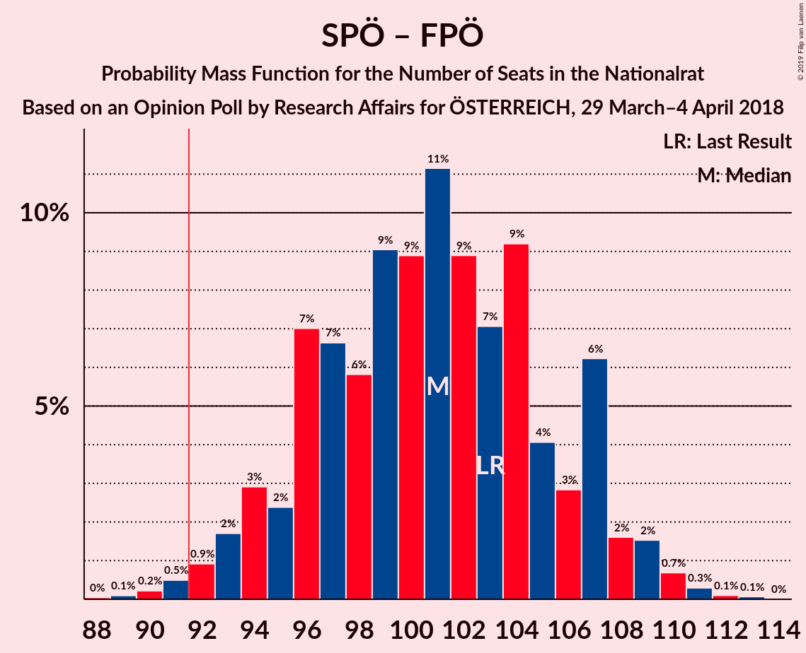

# Opinion Poll by Research Affairs for ÖSTERREICH, 29 March–4 April 2018

<a href="#voting-intentions">Voting Intentions</a> | <a href="#seats">Seats</a> | <a href="#coalitions">Coalitions</a> | <a href="#technical-information">Technical Information</a>

## Voting Intentions

### Confidence Intervals

| Party | Last Result | Poll Result | 80% Confidence Interval | 90% Confidence Interval | 95% Confidence Interval | 99% Confidence Interval |
|:-----:|:-----------:|:-----------:|:-----------------------:|:-----------------------:|:-----------------------:|:-----------------------:|
| Österreichische Volkspartei | 31.5% | 32.0% | 30.2–34.0% |29.7–34.5% |29.2–35.0% |28.4–35.9% |
| Sozialdemokratische Partei Österreichs | 26.9% | 28.0% | 26.2–29.8% |25.7–30.4% |25.3–30.8% |24.5–31.7% |
| Freiheitliche Partei Österreichs | 26.0% | 23.0% | 21.4–24.8% |20.9–25.3% |20.5–25.7% |19.8–26.6% |
| NEOS–Das Neue Österreich und Liberales Forum | 5.3% | 7.0% | 6.1–8.2% |5.8–8.5% |5.6–8.8% |5.2–9.4% |
| Die Grünen–Die Grüne Alternative | 3.8% | 4.0% | 3.3–4.9% |3.1–5.1% |2.9–5.4% |2.6–5.8% |
| JETZT–Liste Pilz | 4.4% | 3.0% | 2.4–3.8% |2.2–4.0% |2.1–4.2% |1.8–4.6% |

*Note:* The poll result column reflects the actual value used in the calculations. Published results may vary slightly, and in addition be rounded to fewer digits.

## Seats

### Confidence Intervals

| Party | Last Result | Median | 80% Confidence Interval | 90% Confidence Interval | 95% Confidence Interval | 99% Confidence Interval |
|:-----:|:-----------:|:------:|:-----------------------:|:-----------------------:|:-----------------------:|:-----------------------:|
| <a href="#österreichische-volkspartei">Österreichische Volkspartei</a> | 62 | 63 | 59–68 |58–69 |57–70 |55–72 |
| <a href="#sozialdemokratische-partei-österreichs">Sozialdemokratische Partei Österreichs</a> | 52 | 55 | 51–59 |50–61 |49–62 |48–64 |
| <a href="#freiheitliche-partei-österreichs">Freiheitliche Partei Österreichs</a> | 51 | 45 | 42–49 |41–50 |40–51 |39–53 |
| <a href="#neos–das-neue-österreich-und-liberales-forum">NEOS–Das Neue Österreich und Liberales Forum</a> | 10 | 14 | 12–16 |11–17 |11–17 |10–18 |
| <a href="#die-grünen–die-grüne-alternative">Die Grünen–Die Grüne Alternative</a> | 0 | 7 | 0–9 |0–9 |0–10 |0–11 |
| <a href="#jetzt–liste-pilz">JETZT–Liste Pilz</a> | 8 | 0 | 0 |0 |0–8 |0–9 |

### Österreichische Volkspartei

*For a full overview of the results for this party, see the [Österreichische Volkspartei](party-österreichischevolkspartei.html) page.*

| Number of Seats | Probability | Accumulated | Special Marks |
|:---------------:|:-----------:|:-----------:|:-------------:|
| 53 | 0.1% | 100% |  |
| 54 | 0.3% | 99.9% |  |
| 55 | 0.3% | 99.7% |  |
| 56 | 0.9% | 99.3% |  |
| 57 | 1.3% | 98% |  |
| 58 | 4% | 97% |  |
| 59 | 4% | 93% |  |
| 60 | 8% | 89% |  |
| 61 | 9% | 81% |  |
| 62 | 13% | 72% | Last Result |
| 63 | 11% | 59% | Median |
| 64 | 11% | 48% |  |
| 65 | 11% | 37% |  |
| 66 | 8% | 26% |  |
| 67 | 8% | 18% |  |
| 68 | 4% | 10% |  |
| 69 | 3% | 6% |  |
| 70 | 2% | 3% |  |
| 71 | 0.8% | 2% |  |
| 72 | 0.3% | 0.8% |  |
| 73 | 0.4% | 0.5% |  |
| 74 | 0.1% | 0.1% |  |
| 75 | 0% | 0% |  |

### Sozialdemokratische Partei Österreichs

*For a full overview of the results for this party, see the [Sozialdemokratische Partei Österreichs](party-sozialdemokratischeparteiösterreichs.html) page.*

| Number of Seats | Probability | Accumulated | Special Marks |
|:---------------:|:-----------:|:-----------:|:-------------:|
| 46 | 0.1% | 100% |  |
| 47 | 0.3% | 99.8% |  |
| 48 | 0.9% | 99.5% |  |
| 49 | 1.4% | 98.6% |  |
| 50 | 4% | 97% |  |
| 51 | 4% | 93% |  |
| 52 | 6% | 89% | Last Result |
| 53 | 11% | 83% |  |
| 54 | 10% | 72% |  |
| 55 | 14% | 61% | Median |
| 56 | 13% | 47% |  |
| 57 | 10% | 34% |  |
| 58 | 8% | 24% |  |
| 59 | 6% | 16% |  |
| 60 | 4% | 10% |  |
| 61 | 3% | 6% |  |
| 62 | 2% | 3% |  |
| 63 | 0.7% | 1.3% |  |
| 64 | 0.3% | 0.6% |  |
| 65 | 0.2% | 0.3% |  |
| 66 | 0.1% | 0.1% |  |
| 67 | 0% | 0% |  |

### Freiheitliche Partei Österreichs

*For a full overview of the results for this party, see the [Freiheitliche Partei Österreichs](party-freiheitlicheparteiösterreichs.html) page.*

| Number of Seats | Probability | Accumulated | Special Marks |
|:---------------:|:-----------:|:-----------:|:-------------:|
| 37 | 0.2% | 100% |  |
| 38 | 0.3% | 99.8% |  |
| 39 | 0.9% | 99.5% |  |
| 40 | 3% | 98.6% |  |
| 41 | 5% | 96% |  |
| 42 | 8% | 91% |  |
| 43 | 8% | 83% |  |
| 44 | 9% | 75% |  |
| 45 | 17% | 66% | Median |
| 46 | 16% | 49% |  |
| 47 | 9% | 33% |  |
| 48 | 7% | 25% |  |
| 49 | 9% | 17% |  |
| 50 | 6% | 9% |  |
| 51 | 1.4% | 3% | Last Result |
| 52 | 0.7% | 2% |  |
| 53 | 0.6% | 1.0% |  |
| 54 | 0.3% | 0.4% |  |
| 55 | 0.1% | 0.1% |  |
| 56 | 0% | 0% |  |

### NEOS–Das Neue Österreich und Liberales Forum

*For a full overview of the results for this party, see the [NEOS–Das Neue Österreich und Liberales Forum](party-neos–dasneueösterreichundliberalesforum.html) page.*

| Number of Seats | Probability | Accumulated | Special Marks |
|:---------------:|:-----------:|:-----------:|:-------------:|
| 9 | 0.2% | 100% |  |
| 10 | 2% | 99.8% | Last Result |
| 11 | 6% | 98% |  |
| 12 | 17% | 92% |  |
| 13 | 19% | 74% |  |
| 14 | 24% | 55% | Median |
| 15 | 18% | 31% |  |
| 16 | 8% | 13% |  |
| 17 | 4% | 5% |  |
| 18 | 1.1% | 1.4% |  |
| 19 | 0.3% | 0.3% |  |
| 20 | 0.1% | 0.1% |  |
| 21 | 0% | 0% |  |

### Die Grünen–Die Grüne Alternative

*For a full overview of the results for this party, see the [Die Grünen–Die Grüne Alternative](party-diegrünen–diegrünealternative.html) page.*

| Number of Seats | Probability | Accumulated | Special Marks |
|:---------------:|:-----------:|:-----------:|:-------------:|
| 0 | 48% | 100% | Last Result |
| 1 | 0% | 52% |  |
| 2 | 0% | 52% |  |
| 3 | 0% | 52% |  |
| 4 | 0% | 52% |  |
| 5 | 0% | 52% |  |
| 6 | 0% | 52% |  |
| 7 | 5% | 52% | Median |
| 8 | 28% | 47% |  |
| 9 | 14% | 19% |  |
| 10 | 3% | 5% |  |
| 11 | 1.0% | 1.2% |  |
| 12 | 0.1% | 0.2% |  |
| 13 | 0% | 0% |  |

### JETZT–Liste Pilz

*For a full overview of the results for this party, see the [JETZT–Liste Pilz](party-jetzt–listepilz.html) page.*

| Number of Seats | Probability | Accumulated | Special Marks |
|:---------------:|:-----------:|:-----------:|:-------------:|
| 0 | 96% | 100% | Median |
| 1 | 0% | 4% |  |
| 2 | 0% | 4% |  |
| 3 | 0% | 4% |  |
| 4 | 0% | 4% |  |
| 5 | 0% | 4% |  |
| 6 | 0% | 4% |  |
| 7 | 1.4% | 4% |  |
| 8 | 2% | 3% | Last Result |
| 9 | 0.6% | 0.6% |  |
| 10 | 0% | 0.1% |  |
| 11 | 0% | 0% |  |

## Coalitions

### Confidence Intervals

| Coalition | Last Result | Median | Majority? | 80% Confidence Interval | 90% Confidence Interval | 95% Confidence Interval | 99% Confidence Interval |
|:---------:|:-----------:|:------:|:---------:|:-----------------------:|:-----------------------:|:-----------------------:|:-----------------------:|
| Österreichische Volkspartei – Sozialdemokratische Partei Österreichs | 114 | 119 | 100% | 114–124 | 112–126 | 111–126 | 108–129 |
| Österreichische Volkspartei – Freiheitliche Partei Österreichs | 113 | 109 | 100% | 104–114 | 102–115 | 101–117 | 99–119 |
| Sozialdemokratische Partei Österreichs – Freiheitliche Partei Österreichs | 103 | 101 | 99.1% | 96–107 | 94–107 | 93–109 | 91–110 |
| Österreichische Volkspartei – NEOS–Das Neue Österreich und Liberales Forum – Die Grünen–Die Grüne Alternative | 72 | 82 | 0.3% | 76–87 | 75–87 | 74–89 | 71–91 |
| Österreichische Volkspartei – NEOS–Das Neue Österreich und Liberales Forum | 72 | 77 | 0% | 73–82 | 72–83 | 70–84 | 68–86 |
| Sozialdemokratische Partei Österreichs – NEOS–Das Neue Österreich und Liberales Forum – Die Grünen–Die Grüne Alternative | 62 | 73 | 0% | 68–79 | 67–80 | 65–81 | 63–83 |
| Österreichische Volkspartei – Die Grünen–Die Grüne Alternative | 62 | 68 | 0% | 62–73 | 61–74 | 60–75 | 58–77 |
| Österreichische Volkspartei | 62 | 63 | 0% | 59–68 | 58–69 | 57–70 | 55–72 |
| Sozialdemokratische Partei Österreichs | 52 | 55 | 0% | 51–59 | 50–61 | 49–62 | 48–64 |

### Österreichische Volkspartei – Sozialdemokratische Partei Österreichs

| Number of Seats | Probability | Accumulated | Special Marks |
|:---------------:|:-----------:|:-----------:|:-------------:|
| 105 | 0% | 100% |  |
| 106 | 0.2% | 99.9% |  |
| 107 | 0.2% | 99.8% |  |
| 108 | 0.4% | 99.6% |  |
| 109 | 0.4% | 99.2% |  |
| 110 | 1.3% | 98.8% |  |
| 111 | 2% | 98% |  |
| 112 | 4% | 96% |  |
| 113 | 2% | 92% |  |
| 114 | 5% | 90% | Last Result |
| 115 | 10% | 85% |  |
| 116 | 7% | 76% |  |
| 117 | 7% | 69% |  |
| 118 | 10% | 62% | Median |
| 119 | 7% | 52% |  |
| 120 | 11% | 45% |  |
| 121 | 8% | 34% |  |
| 122 | 6% | 26% |  |
| 123 | 5% | 20% |  |
| 124 | 6% | 15% |  |
| 125 | 3% | 9% |  |
| 126 | 3% | 5% |  |
| 127 | 0.9% | 2% |  |
| 128 | 0.7% | 1.4% |  |
| 129 | 0.6% | 0.7% |  |
| 130 | 0.1% | 0.2% |  |
| 131 | 0% | 0.1% |  |
| 132 | 0% | 0% |  |

### Österreichische Volkspartei – Freiheitliche Partei Österreichs

| Number of Seats | Probability | Accumulated | Special Marks |
|:---------------:|:-----------:|:-----------:|:-------------:|
| 95 | 0% | 100% |  |
| 96 | 0.1% | 99.9% |  |
| 97 | 0.1% | 99.9% |  |
| 98 | 0.2% | 99.8% |  |
| 99 | 0.5% | 99.5% |  |
| 100 | 1.0% | 99.0% |  |
| 101 | 2% | 98% |  |
| 102 | 2% | 96% |  |
| 103 | 4% | 94% |  |
| 104 | 5% | 90% |  |
| 105 | 6% | 85% |  |
| 106 | 7% | 79% |  |
| 107 | 10% | 72% |  |
| 108 | 9% | 62% | Median |
| 109 | 8% | 53% |  |
| 110 | 10% | 45% |  |
| 111 | 8% | 35% |  |
| 112 | 6% | 27% |  |
| 113 | 7% | 21% | Last Result |
| 114 | 6% | 15% |  |
| 115 | 4% | 9% |  |
| 116 | 2% | 4% |  |
| 117 | 1.0% | 3% |  |
| 118 | 0.9% | 2% |  |
| 119 | 0.6% | 0.7% |  |
| 120 | 0.1% | 0.2% |  |
| 121 | 0% | 0.1% |  |
| 122 | 0% | 0% |  |

### Sozialdemokratische Partei Österreichs – Freiheitliche Partei Österreichs

| Number of Seats | Probability | Accumulated | Special Marks |
|:---------------:|:-----------:|:-----------:|:-------------:|
| 88 | 0% | 100% |  |
| 89 | 0.1% | 99.9% |  |
| 90 | 0.2% | 99.8% |  |
| 91 | 0.5% | 99.6% |  |
| 92 | 0.9% | 99.1% | Majority |
| 93 | 2% | 98% |  |
| 94 | 3% | 96% |  |
| 95 | 2% | 94% |  |
| 96 | 7% | 91% |  |
| 97 | 7% | 84% |  |
| 98 | 6% | 78% |  |
| 99 | 9% | 72% |  |
| 100 | 9% | 63% | Median |
| 101 | 11% | 54% |  |
| 102 | 9% | 43% |  |
| 103 | 7% | 34% | Last Result |
| 104 | 9% | 27% |  |
| 105 | 4% | 17% |  |
| 106 | 3% | 13% |  |
| 107 | 6% | 11% |  |
| 108 | 2% | 4% |  |
| 109 | 2% | 3% |  |
| 110 | 0.7% | 1.2% |  |
| 111 | 0.3% | 0.5% |  |
| 112 | 0.1% | 0.2% |  |
| 113 | 0.1% | 0.1% |  |
| 114 | 0% | 0% |  |

### Österreichische Volkspartei – NEOS–Das Neue Österreich und Liberales Forum – Die Grünen–Die Grüne Alternative

| Number of Seats | Probability | Accumulated | Special Marks |
|:---------------:|:-----------:|:-----------:|:-------------:|
| 68 | 0% | 100% |  |
| 69 | 0.1% | 99.9% |  |
| 70 | 0.2% | 99.9% |  |
| 71 | 0.4% | 99.7% |  |
| 72 | 0.5% | 99.4% | Last Result |
| 73 | 1.0% | 98.9% |  |
| 74 | 2% | 98% |  |
| 75 | 2% | 96% |  |
| 76 | 7% | 93% |  |
| 77 | 3% | 86% |  |
| 78 | 5% | 83% |  |
| 79 | 10% | 78% |  |
| 80 | 7% | 68% |  |
| 81 | 10% | 61% |  |
| 82 | 11% | 51% |  |
| 83 | 9% | 40% |  |
| 84 | 8% | 31% | Median |
| 85 | 5% | 22% |  |
| 86 | 6% | 17% |  |
| 87 | 6% | 11% |  |
| 88 | 1.5% | 5% |  |
| 89 | 2% | 3% |  |
| 90 | 1.0% | 2% |  |
| 91 | 0.4% | 0.7% |  |
| 92 | 0.2% | 0.3% | Majority |
| 93 | 0.1% | 0.1% |  |
| 94 | 0% | 0% |  |

### Österreichische Volkspartei – NEOS–Das Neue Österreich und Liberales Forum

| Number of Seats | Probability | Accumulated | Special Marks |
|:---------------:|:-----------:|:-----------:|:-------------:|
| 66 | 0.1% | 100% |  |
| 67 | 0.2% | 99.9% |  |
| 68 | 0.4% | 99.7% |  |
| 69 | 0.9% | 99.3% |  |
| 70 | 1.3% | 98% |  |
| 71 | 2% | 97% |  |
| 72 | 4% | 95% | Last Result |
| 73 | 5% | 91% |  |
| 74 | 11% | 86% |  |
| 75 | 8% | 75% |  |
| 76 | 13% | 67% |  |
| 77 | 8% | 54% | Median |
| 78 | 7% | 46% |  |
| 79 | 14% | 39% |  |
| 80 | 7% | 25% |  |
| 81 | 7% | 18% |  |
| 82 | 4% | 10% |  |
| 83 | 3% | 7% |  |
| 84 | 2% | 3% |  |
| 85 | 0.9% | 2% |  |
| 86 | 0.3% | 0.8% |  |
| 87 | 0.3% | 0.5% |  |
| 88 | 0.1% | 0.2% |  |
| 89 | 0% | 0.1% |  |
| 90 | 0% | 0% |  |

### Sozialdemokratische Partei Österreichs – NEOS–Das Neue Österreich und Liberales Forum – Die Grünen–Die Grüne Alternative

| Number of Seats | Probability | Accumulated | Special Marks |
|:---------------:|:-----------:|:-----------:|:-------------:|
| 61 | 0.1% | 100% |  |
| 62 | 0.2% | 99.9% | Last Result |
| 63 | 0.4% | 99.7% |  |
| 64 | 0.8% | 99.4% |  |
| 65 | 1.2% | 98.5% |  |
| 66 | 2% | 97% |  |
| 67 | 2% | 96% |  |
| 68 | 5% | 93% |  |
| 69 | 7% | 89% |  |
| 70 | 7% | 81% |  |
| 71 | 6% | 74% |  |
| 72 | 9% | 68% |  |
| 73 | 10% | 59% |  |
| 74 | 7% | 49% |  |
| 75 | 10% | 42% |  |
| 76 | 11% | 32% | Median |
| 77 | 6% | 22% |  |
| 78 | 5% | 16% |  |
| 79 | 5% | 10% |  |
| 80 | 3% | 6% |  |
| 81 | 1.4% | 3% |  |
| 82 | 0.8% | 2% |  |
| 83 | 0.5% | 0.7% |  |
| 84 | 0.2% | 0.3% |  |
| 85 | 0% | 0.1% |  |
| 86 | 0% | 0% |  |

### Österreichische Volkspartei – Die Grünen–Die Grüne Alternative

| Number of Seats | Probability | Accumulated | Special Marks |
|:---------------:|:-----------:|:-----------:|:-------------:|
| 55 | 0% | 100% |  |
| 56 | 0.1% | 99.9% |  |
| 57 | 0.3% | 99.9% |  |
| 58 | 0.6% | 99.6% |  |
| 59 | 1.0% | 99.0% |  |
| 60 | 2% | 98% |  |
| 61 | 3% | 96% |  |
| 62 | 4% | 93% | Last Result |
| 63 | 6% | 89% |  |
| 64 | 5% | 83% |  |
| 65 | 9% | 78% |  |
| 66 | 6% | 69% |  |
| 67 | 9% | 63% |  |
| 68 | 8% | 53% |  |
| 69 | 8% | 45% |  |
| 70 | 11% | 37% | Median |
| 71 | 6% | 26% |  |
| 72 | 8% | 20% |  |
| 73 | 3% | 12% |  |
| 74 | 5% | 9% |  |
| 75 | 2% | 4% |  |
| 76 | 0.8% | 2% |  |
| 77 | 0.7% | 1.1% |  |
| 78 | 0.3% | 0.4% |  |
| 79 | 0.1% | 0.1% |  |
| 80 | 0% | 0.1% |  |
| 81 | 0% | 0% |  |

### Österreichische Volkspartei

| Number of Seats | Probability | Accumulated | Special Marks |
|:---------------:|:-----------:|:-----------:|:-------------:|
| 53 | 0.1% | 100% |  |
| 54 | 0.3% | 99.9% |  |
| 55 | 0.3% | 99.7% |  |
| 56 | 0.9% | 99.3% |  |
| 57 | 1.3% | 98% |  |
| 58 | 4% | 97% |  |
| 59 | 4% | 93% |  |
| 60 | 8% | 89% |  |
| 61 | 9% | 81% |  |
| 62 | 13% | 72% | Last Result |
| 63 | 11% | 59% | Median |
| 64 | 11% | 48% |  |
| 65 | 11% | 37% |  |
| 66 | 8% | 26% |  |
| 67 | 8% | 18% |  |
| 68 | 4% | 10% |  |
| 69 | 3% | 6% |  |
| 70 | 2% | 3% |  |
| 71 | 0.8% | 2% |  |
| 72 | 0.3% | 0.8% |  |
| 73 | 0.4% | 0.5% |  |
| 74 | 0.1% | 0.1% |  |
| 75 | 0% | 0% |  |

### Sozialdemokratische Partei Österreichs

| Number of Seats | Probability | Accumulated | Special Marks |
|:---------------:|:-----------:|:-----------:|:-------------:|
| 46 | 0.1% | 100% |  |
| 47 | 0.3% | 99.8% |  |
| 48 | 0.9% | 99.5% |  |
| 49 | 1.4% | 98.6% |  |
| 50 | 4% | 97% |  |
| 51 | 4% | 93% |  |
| 52 | 6% | 89% | Last Result |
| 53 | 11% | 83% |  |
| 54 | 10% | 72% |  |
| 55 | 14% | 61% | Median |
| 56 | 13% | 47% |  |
| 57 | 10% | 34% |  |
| 58 | 8% | 24% |  |
| 59 | 6% | 16% |  |
| 60 | 4% | 10% |  |
| 61 | 3% | 6% |  |
| 62 | 2% | 3% |  |
| 63 | 0.7% | 1.3% |  |
| 64 | 0.3% | 0.6% |  |
| 65 | 0.2% | 0.3% |  |
| 66 | 0.1% | 0.1% |  |
| 67 | 0% | 0% |  |

## Technical Information

### Opinion Poll

+ **Polling firm:** Research Affairs
+ **Commissioner(s):** ÖSTERREICH
+ **Fieldwork period:** 29 March–4 April 2018

### Calculations

+ **Sample size:** 1008
+ **Simulations done:** 131,072
+ **Error estimate:** 1.07%

