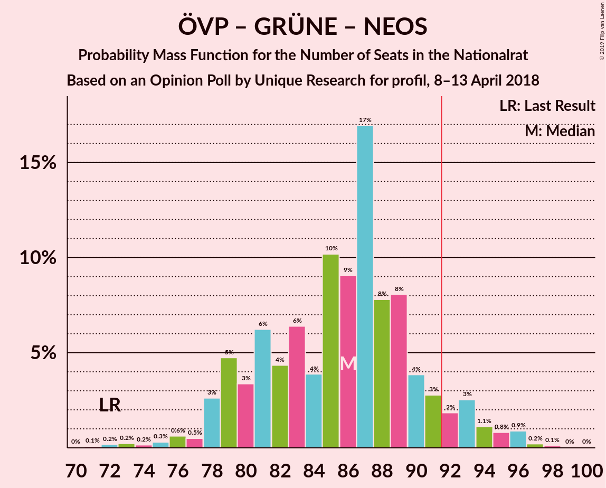

# Opinion Poll by Unique Research for profil, 8–13 April 2018

<a href="#voting-intentions">Voting Intentions</a> | <a href="#seats">Seats</a> | <a href="#coalitions">Coalitions</a> | <a href="#technical-information">Technical Information</a>

## Voting Intentions

### Confidence Intervals

| Party | Last Result | Poll Result | 80% Confidence Interval | 90% Confidence Interval | 95% Confidence Interval | 99% Confidence Interval |
|:-----:|:-----------:|:-----------:|:-----------------------:|:-----------------------:|:-----------------------:|:-----------------------:|
| Österreichische Volkspartei | 31.5% | 33.0% | 30.4–35.8% |29.6–36.6% |29.0–37.3% |27.8–38.6% |
| Sozialdemokratische Partei Österreichs | 26.9% | 27.0% | 24.6–29.7% |23.9–30.4% |23.3–31.1% |22.2–32.4% |
| Freiheitliche Partei Österreichs | 26.0% | 24.0% | 21.7–26.6% |21.0–27.3% |20.5–27.9% |19.4–29.2% |
| NEOS–Das Neue Österreich und Liberales Forum | 5.3% | 6.0% | 4.8–7.6% |4.5–8.0% |4.2–8.4% |3.7–9.3% |
| Die Grünen–Die Grüne Alternative | 3.8% | 6.0% | 4.8–7.6% |4.5–8.0% |4.2–8.4% |3.7–9.3% |
| JETZT–Liste Pilz | 4.4% | 2.0% | 1.4–3.1% |1.2–3.4% |1.1–3.6% |0.9–4.2% |

*Note:* The poll result column reflects the actual value used in the calculations. Published results may vary slightly, and in addition be rounded to fewer digits.

## Seats

### Confidence Intervals

| Party | Last Result | Median | 80% Confidence Interval | 90% Confidence Interval | 95% Confidence Interval | 99% Confidence Interval |
|:-----:|:-----------:|:------:|:-----------------------:|:-----------------------:|:-----------------------:|:-----------------------:|
| <a href="#österreichische-volkspartei">Österreichische Volkspartei</a> | 62 | 64 | 58–68 |56–70 |56–72 |53–74 |
| <a href="#sozialdemokratische-partei-österreichs">Sozialdemokratische Partei Österreichs</a> | 52 | 51 | 47–56 |45–58 |45–59 |42–62 |
| <a href="#freiheitliche-partei-österreichs">Freiheitliche Partei Österreichs</a> | 51 | 46 | 41–50 |40–52 |39–53 |37–56 |
| <a href="#neos–das-neue-österreich-und-liberales-forum">NEOS–Das Neue Österreich und Liberales Forum</a> | 10 | 11 | 9–14 |8–15 |8–16 |0–17 |
| <a href="#die-grünen–die-grüne-alternative">Die Grünen–Die Grüne Alternative</a> | 0 | 11 | 9–14 |8–15 |8–16 |0–17 |
| <a href="#jetzt–liste-pilz">JETZT–Liste Pilz</a> | 8 | 0 | 0 |0 |0 |0–7 |

### Österreichische Volkspartei

*For a full overview of the results for this party, see the [Österreichische Volkspartei](party-österreichischevolkspartei.html) page.*

| Number of Seats | Probability | Accumulated | Special Marks |
|:---------------:|:-----------:|:-----------:|:-------------:|
| 50 | 0.1% | 100% |  |
| 51 | 0.1% | 99.9% |  |
| 52 | 0.1% | 99.8% |  |
| 53 | 0.3% | 99.7% |  |
| 54 | 0.7% | 99.4% |  |
| 55 | 1.1% | 98.7% |  |
| 56 | 3% | 98% |  |
| 57 | 4% | 94% |  |
| 58 | 6% | 90% |  |
| 59 | 8% | 85% |  |
| 60 | 4% | 77% |  |
| 61 | 4% | 73% |  |
| 62 | 9% | 69% | Last Result |
| 63 | 7% | 61% |  |
| 64 | 17% | 54% | Median |
| 65 | 9% | 37% |  |
| 66 | 12% | 28% |  |
| 67 | 6% | 16% |  |
| 68 | 2% | 10% |  |
| 69 | 2% | 8% |  |
| 70 | 2% | 7% |  |
| 71 | 2% | 5% |  |
| 72 | 2% | 3% |  |
| 73 | 0.6% | 1.1% |  |
| 74 | 0.3% | 0.5% |  |
| 75 | 0.1% | 0.2% |  |
| 76 | 0% | 0.1% |  |
| 77 | 0% | 0.1% |  |
| 78 | 0% | 0% |  |

### Sozialdemokratische Partei Österreichs

*For a full overview of the results for this party, see the [Sozialdemokratische Partei Österreichs](party-sozialdemokratischeparteiösterreichs.html) page.*

| Number of Seats | Probability | Accumulated | Special Marks |
|:---------------:|:-----------:|:-----------:|:-------------:|
| 39 | 0% | 100% |  |
| 40 | 0.1% | 99.9% |  |
| 41 | 0.2% | 99.9% |  |
| 42 | 0.3% | 99.7% |  |
| 43 | 0.8% | 99.4% |  |
| 44 | 1.0% | 98.6% |  |
| 45 | 3% | 98% |  |
| 46 | 3% | 94% |  |
| 47 | 5% | 91% |  |
| 48 | 7% | 86% |  |
| 49 | 9% | 79% |  |
| 50 | 10% | 70% |  |
| 51 | 12% | 60% | Median |
| 52 | 10% | 48% | Last Result |
| 53 | 9% | 38% |  |
| 54 | 7% | 29% |  |
| 55 | 5% | 22% |  |
| 56 | 7% | 16% |  |
| 57 | 3% | 9% |  |
| 58 | 3% | 6% |  |
| 59 | 1.2% | 3% |  |
| 60 | 0.9% | 2% |  |
| 61 | 0.8% | 1.3% |  |
| 62 | 0.3% | 0.5% |  |
| 63 | 0.1% | 0.2% |  |
| 64 | 0.1% | 0.1% |  |
| 65 | 0% | 0.1% |  |
| 66 | 0% | 0% |  |

### Freiheitliche Partei Österreichs

*For a full overview of the results for this party, see the [Freiheitliche Partei Österreichs](party-freiheitlicheparteiösterreichs.html) page.*

| Number of Seats | Probability | Accumulated | Special Marks |
|:---------------:|:-----------:|:-----------:|:-------------:|
| 34 | 0% | 100% |  |
| 35 | 0.1% | 99.9% |  |
| 36 | 0.2% | 99.8% |  |
| 37 | 0.5% | 99.6% |  |
| 38 | 1.1% | 99.1% |  |
| 39 | 2% | 98% |  |
| 40 | 4% | 96% |  |
| 41 | 5% | 92% |  |
| 42 | 7% | 88% |  |
| 43 | 8% | 80% |  |
| 44 | 9% | 73% |  |
| 45 | 9% | 64% |  |
| 46 | 14% | 55% | Median |
| 47 | 11% | 41% |  |
| 48 | 8% | 30% |  |
| 49 | 6% | 22% |  |
| 50 | 6% | 15% |  |
| 51 | 4% | 10% | Last Result |
| 52 | 2% | 6% |  |
| 53 | 0.9% | 3% |  |
| 54 | 1.2% | 2% |  |
| 55 | 0.5% | 1.1% |  |
| 56 | 0.3% | 0.6% |  |
| 57 | 0.1% | 0.3% |  |
| 58 | 0.1% | 0.1% |  |
| 59 | 0% | 0.1% |  |
| 60 | 0% | 0% |  |

### NEOS–Das Neue Österreich und Liberales Forum

*For a full overview of the results for this party, see the [NEOS–Das Neue Österreich und Liberales Forum](party-neos–dasneueösterreichundliberalesforum.html) page.*

| Number of Seats | Probability | Accumulated | Special Marks |
|:---------------:|:-----------:|:-----------:|:-------------:|
| 0 | 1.2% | 100% |  |
| 1 | 0% | 98.8% |  |
| 2 | 0% | 98.8% |  |
| 3 | 0% | 98.8% |  |
| 4 | 0% | 98.8% |  |
| 5 | 0% | 98.8% |  |
| 6 | 0% | 98.8% |  |
| 7 | 0.9% | 98.8% |  |
| 8 | 6% | 98% |  |
| 9 | 10% | 92% |  |
| 10 | 17% | 82% | Last Result |
| 11 | 19% | 65% | Median |
| 12 | 19% | 46% |  |
| 13 | 11% | 27% |  |
| 14 | 9% | 16% |  |
| 15 | 5% | 7% |  |
| 16 | 2% | 3% |  |
| 17 | 0.7% | 1.1% |  |
| 18 | 0.2% | 0.3% |  |
| 19 | 0.1% | 0.1% |  |
| 20 | 0% | 0% |  |

### Die Grünen–Die Grüne Alternative

*For a full overview of the results for this party, see the [Die Grünen–Die Grüne Alternative](party-diegrünen–diegrünealternative.html) page.*

| Number of Seats | Probability | Accumulated | Special Marks |
|:---------------:|:-----------:|:-----------:|:-------------:|
| 0 | 2% | 100% | Last Result |
| 1 | 0% | 98% |  |
| 2 | 0% | 98% |  |
| 3 | 0% | 98% |  |
| 4 | 0% | 98% |  |
| 5 | 0% | 98% |  |
| 6 | 0% | 98% |  |
| 7 | 0.7% | 98% |  |
| 8 | 5% | 98% |  |
| 9 | 10% | 93% |  |
| 10 | 18% | 83% |  |
| 11 | 22% | 64% | Median |
| 12 | 15% | 42% |  |
| 13 | 14% | 27% |  |
| 14 | 6% | 13% |  |
| 15 | 3% | 6% |  |
| 16 | 2% | 3% |  |
| 17 | 0.8% | 1.2% |  |
| 18 | 0.3% | 0.4% |  |
| 19 | 0.1% | 0.1% |  |
| 20 | 0% | 0% |  |

### JETZT–Liste Pilz

*For a full overview of the results for this party, see the [JETZT–Liste Pilz](party-jetzt–listepilz.html) page.*

| Number of Seats | Probability | Accumulated | Special Marks |
|:---------------:|:-----------:|:-----------:|:-------------:|
| 0 | 99.2% | 100% | Median |
| 1 | 0% | 0.8% |  |
| 2 | 0% | 0.8% |  |
| 3 | 0% | 0.8% |  |
| 4 | 0% | 0.8% |  |
| 5 | 0% | 0.8% |  |
| 6 | 0% | 0.8% |  |
| 7 | 0.3% | 0.8% |  |
| 8 | 0.4% | 0.5% | Last Result |
| 9 | 0.1% | 0.1% |  |
| 10 | 0% | 0% |  |

## Coalitions

### Confidence Intervals

| Coalition | Last Result | Median | Majority? | 80% Confidence Interval | 90% Confidence Interval | 95% Confidence Interval | 99% Confidence Interval |
|:---------:|:-----------:|:------:|:---------:|:-----------------------:|:-----------------------:|:-----------------------:|:-----------------------:|
| Österreichische Volkspartei – Sozialdemokratische Partei Österreichs | 114 | 115 | 100% | 109–120 | 108–122 | 106–123 | 104–126 |
| Österreichische Volkspartei – Freiheitliche Partei Österreichs | 113 | 109 | 100% | 103–115 | 102–116 | 100–117 | 98–121 |
| Sozialdemokratische Partei Österreichs – Freiheitliche Partei Österreichs | 103 | 97 | 92% | 92–103 | 90–104 | 89–105 | 87–110 |
| Österreichische Volkspartei – Die Grünen–Die Grüne Alternative – NEOS–Das Neue Österreich und Liberales Forum | 72 | 86 | 8% | 80–91 | 79–93 | 78–94 | 73–96 |
| Österreichische Volkspartei – Die Grünen–Die Grüne Alternative | 62 | 75 | 0% | 68–78 | 68–82 | 67–83 | 63–84 |
| Österreichische Volkspartei – NEOS–Das Neue Österreich und Liberales Forum | 72 | 75 | 0% | 69–80 | 67–81 | 66–83 | 63–85 |
| Sozialdemokratische Partei Österreichs – Die Grünen–Die Grüne Alternative – NEOS–Das Neue Österreich und Liberales Forum | 62 | 74 | 0% | 68–80 | 67–81 | 66–82 | 62–85 |
| Österreichische Volkspartei | 62 | 64 | 0% | 58–68 | 56–70 | 56–72 | 53–74 |
| Sozialdemokratische Partei Österreichs | 52 | 51 | 0% | 47–56 | 45–58 | 45–59 | 42–62 |

### Österreichische Volkspartei – Sozialdemokratische Partei Österreichs

| Number of Seats | Probability | Accumulated | Special Marks |
|:---------------:|:-----------:|:-----------:|:-------------:|
| 100 | 0% | 100% |  |
| 101 | 0.1% | 99.9% |  |
| 102 | 0.1% | 99.9% |  |
| 103 | 0.3% | 99.8% |  |
| 104 | 0.6% | 99.5% |  |
| 105 | 0.7% | 98.9% |  |
| 106 | 1.1% | 98% |  |
| 107 | 2% | 97% |  |
| 108 | 3% | 95% |  |
| 109 | 4% | 93% |  |
| 110 | 6% | 89% |  |
| 111 | 6% | 82% |  |
| 112 | 6% | 77% |  |
| 113 | 9% | 71% |  |
| 114 | 9% | 61% | Last Result |
| 115 | 12% | 52% | Median |
| 116 | 11% | 40% |  |
| 117 | 4% | 30% |  |
| 118 | 7% | 25% |  |
| 119 | 3% | 18% |  |
| 120 | 6% | 15% |  |
| 121 | 3% | 9% |  |
| 122 | 2% | 5% |  |
| 123 | 0.9% | 3% |  |
| 124 | 0.8% | 2% |  |
| 125 | 0.7% | 1.5% |  |
| 126 | 0.4% | 0.7% |  |
| 127 | 0.1% | 0.4% |  |
| 128 | 0.1% | 0.3% |  |
| 129 | 0.1% | 0.2% |  |
| 130 | 0% | 0.1% |  |
| 131 | 0% | 0.1% |  |
| 132 | 0% | 0% |  |

### Österreichische Volkspartei – Freiheitliche Partei Österreichs

| Number of Seats | Probability | Accumulated | Special Marks |
|:---------------:|:-----------:|:-----------:|:-------------:|
| 95 | 0.1% | 100% |  |
| 96 | 0.1% | 99.9% |  |
| 97 | 0.2% | 99.8% |  |
| 98 | 0.4% | 99.6% |  |
| 99 | 0.8% | 99.2% |  |
| 100 | 1.0% | 98% |  |
| 101 | 2% | 97% |  |
| 102 | 3% | 96% |  |
| 103 | 4% | 93% |  |
| 104 | 5% | 89% |  |
| 105 | 6% | 84% |  |
| 106 | 9% | 78% |  |
| 107 | 5% | 69% |  |
| 108 | 8% | 64% |  |
| 109 | 12% | 56% |  |
| 110 | 8% | 44% | Median |
| 111 | 7% | 35% |  |
| 112 | 8% | 28% |  |
| 113 | 7% | 20% | Last Result |
| 114 | 3% | 14% |  |
| 115 | 5% | 11% |  |
| 116 | 3% | 6% |  |
| 117 | 1.1% | 3% |  |
| 118 | 0.8% | 2% |  |
| 119 | 0.6% | 1.3% |  |
| 120 | 0.2% | 0.7% |  |
| 121 | 0.2% | 0.6% |  |
| 122 | 0.1% | 0.4% |  |
| 123 | 0.1% | 0.3% |  |
| 124 | 0.1% | 0.1% |  |
| 125 | 0.1% | 0.1% |  |
| 126 | 0% | 0% |  |

### Sozialdemokratische Partei Österreichs – Freiheitliche Partei Österreichs

| Number of Seats | Probability | Accumulated | Special Marks |
|:---------------:|:-----------:|:-----------:|:-------------:|
| 83 | 0% | 100% |  |
| 84 | 0.1% | 99.9% |  |
| 85 | 0.1% | 99.9% |  |
| 86 | 0.2% | 99.7% |  |
| 87 | 0.9% | 99.5% |  |
| 88 | 0.9% | 98.6% |  |
| 89 | 1.2% | 98% |  |
| 90 | 3% | 97% |  |
| 91 | 2% | 94% |  |
| 92 | 3% | 92% | Majority |
| 93 | 4% | 89% |  |
| 94 | 8% | 85% |  |
| 95 | 8% | 77% |  |
| 96 | 17% | 69% |  |
| 97 | 9% | 52% | Median |
| 98 | 10% | 43% |  |
| 99 | 4% | 33% |  |
| 100 | 6% | 29% |  |
| 101 | 4% | 23% |  |
| 102 | 6% | 18% |  |
| 103 | 3% | 12% | Last Result |
| 104 | 5% | 9% |  |
| 105 | 2% | 4% |  |
| 106 | 0.4% | 2% |  |
| 107 | 0.6% | 1.5% |  |
| 108 | 0.3% | 0.9% |  |
| 109 | 0.1% | 0.7% |  |
| 110 | 0.2% | 0.5% |  |
| 111 | 0.2% | 0.3% |  |
| 112 | 0.1% | 0.1% |  |
| 113 | 0% | 0.1% |  |
| 114 | 0% | 0% |  |

### Österreichische Volkspartei – Die Grünen–Die Grüne Alternative – NEOS–Das Neue Österreich und Liberales Forum

| Number of Seats | Probability | Accumulated | Special Marks |
|:---------------:|:-----------:|:-----------:|:-------------:|
| 70 | 0% | 100% |  |
| 71 | 0.1% | 99.9% |  |
| 72 | 0.2% | 99.9% | Last Result |
| 73 | 0.2% | 99.7% |  |
| 74 | 0.2% | 99.4% |  |
| 75 | 0.3% | 99.3% |  |
| 76 | 0.6% | 99.0% |  |
| 77 | 0.5% | 98% |  |
| 78 | 3% | 98% |  |
| 79 | 5% | 95% |  |
| 80 | 3% | 91% |  |
| 81 | 6% | 87% |  |
| 82 | 4% | 81% |  |
| 83 | 6% | 77% |  |
| 84 | 4% | 70% |  |
| 85 | 10% | 66% |  |
| 86 | 9% | 56% | Median |
| 87 | 17% | 47% |  |
| 88 | 8% | 30% |  |
| 89 | 8% | 22% |  |
| 90 | 4% | 14% |  |
| 91 | 3% | 10% |  |
| 92 | 2% | 8% | Majority |
| 93 | 3% | 6% |  |
| 94 | 1.1% | 3% |  |
| 95 | 0.8% | 2% |  |
| 96 | 0.9% | 1.3% |  |
| 97 | 0.2% | 0.4% |  |
| 98 | 0.1% | 0.2% |  |
| 99 | 0% | 0.1% |  |
| 100 | 0% | 0% |  |

### Österreichische Volkspartei – Die Grünen–Die Grüne Alternative

| Number of Seats | Probability | Accumulated | Special Marks |
|:---------------:|:-----------:|:-----------:|:-------------:|
| 60 | 0% | 100% |  |
| 61 | 0.1% | 99.9% |  |
| 62 | 0.2% | 99.8% | Last Result |
| 63 | 0.3% | 99.6% |  |
| 64 | 0.5% | 99.3% |  |
| 65 | 0.2% | 98.8% |  |
| 66 | 0.2% | 98.6% |  |
| 67 | 3% | 98% |  |
| 68 | 6% | 96% |  |
| 69 | 11% | 90% |  |
| 70 | 5% | 78% |  |
| 71 | 1.2% | 73% |  |
| 72 | 0.5% | 72% |  |
| 73 | 0.6% | 72% |  |
| 74 | 5% | 71% |  |
| 75 | 21% | 66% | Median |
| 76 | 20% | 45% |  |
| 77 | 14% | 25% |  |
| 78 | 2% | 11% |  |
| 79 | 0.6% | 9% |  |
| 80 | 0.3% | 9% |  |
| 81 | 1.2% | 8% |  |
| 82 | 3% | 7% |  |
| 83 | 3% | 4% |  |
| 84 | 1.2% | 2% |  |
| 85 | 0.2% | 0.4% |  |
| 86 | 0.1% | 0.2% |  |
| 87 | 0.1% | 0.2% |  |
| 88 | 0% | 0.1% |  |
| 89 | 0% | 0.1% |  |
| 90 | 0% | 0% |  |

### Österreichische Volkspartei – NEOS–Das Neue Österreich und Liberales Forum

| Number of Seats | Probability | Accumulated | Special Marks |
|:---------------:|:-----------:|:-----------:|:-------------:|
| 59 | 0% | 100% |  |
| 60 | 0.1% | 99.9% |  |
| 61 | 0.1% | 99.8% |  |
| 62 | 0.1% | 99.7% |  |
| 63 | 0.1% | 99.6% |  |
| 64 | 0.3% | 99.4% |  |
| 65 | 0.9% | 99.1% |  |
| 66 | 2% | 98% |  |
| 67 | 2% | 96% |  |
| 68 | 2% | 94% |  |
| 69 | 4% | 92% |  |
| 70 | 5% | 88% |  |
| 71 | 5% | 83% |  |
| 72 | 12% | 78% | Last Result |
| 73 | 6% | 65% |  |
| 74 | 7% | 59% |  |
| 75 | 6% | 52% | Median |
| 76 | 16% | 46% |  |
| 77 | 10% | 30% |  |
| 78 | 6% | 19% |  |
| 79 | 3% | 13% |  |
| 80 | 3% | 10% |  |
| 81 | 3% | 7% |  |
| 82 | 2% | 5% |  |
| 83 | 1.3% | 3% |  |
| 84 | 0.9% | 2% |  |
| 85 | 0.6% | 0.9% |  |
| 86 | 0.2% | 0.4% |  |
| 87 | 0.1% | 0.2% |  |
| 88 | 0% | 0.1% |  |
| 89 | 0% | 0.1% |  |
| 90 | 0% | 0% |  |

### Sozialdemokratische Partei Österreichs – Die Grünen–Die Grüne Alternative – NEOS–Das Neue Österreich und Liberales Forum

| Number of Seats | Probability | Accumulated | Special Marks |
|:---------------:|:-----------:|:-----------:|:-------------:|
| 58 | 0.1% | 100% |  |
| 59 | 0.1% | 99.9% |  |
| 60 | 0.2% | 99.9% |  |
| 61 | 0.1% | 99.7% |  |
| 62 | 0.2% | 99.6% | Last Result |
| 63 | 0.2% | 99.4% |  |
| 64 | 0.6% | 99.2% |  |
| 65 | 0.9% | 98.6% |  |
| 66 | 1.2% | 98% |  |
| 67 | 3% | 96% |  |
| 68 | 5% | 94% |  |
| 69 | 3% | 89% |  |
| 70 | 7% | 86% |  |
| 71 | 8% | 79% |  |
| 72 | 7% | 71% |  |
| 73 | 8% | 64% | Median |
| 74 | 12% | 55% |  |
| 75 | 8% | 43% |  |
| 76 | 5% | 35% |  |
| 77 | 9% | 30% |  |
| 78 | 6% | 22% |  |
| 79 | 5% | 15% |  |
| 80 | 4% | 11% |  |
| 81 | 3% | 7% |  |
| 82 | 2% | 4% |  |
| 83 | 0.8% | 2% |  |
| 84 | 0.7% | 1.4% |  |
| 85 | 0.4% | 0.7% |  |
| 86 | 0.2% | 0.3% |  |
| 87 | 0.1% | 0.2% |  |
| 88 | 0% | 0.1% |  |
| 89 | 0% | 0% |  |

### Österreichische Volkspartei

| Number of Seats | Probability | Accumulated | Special Marks |
|:---------------:|:-----------:|:-----------:|:-------------:|
| 50 | 0.1% | 100% |  |
| 51 | 0.1% | 99.9% |  |
| 52 | 0.1% | 99.8% |  |
| 53 | 0.3% | 99.7% |  |
| 54 | 0.7% | 99.4% |  |
| 55 | 1.1% | 98.7% |  |
| 56 | 3% | 98% |  |
| 57 | 4% | 94% |  |
| 58 | 6% | 90% |  |
| 59 | 8% | 85% |  |
| 60 | 4% | 77% |  |
| 61 | 4% | 73% |  |
| 62 | 9% | 69% | Last Result |
| 63 | 7% | 61% |  |
| 64 | 17% | 54% | Median |
| 65 | 9% | 37% |  |
| 66 | 12% | 28% |  |
| 67 | 6% | 16% |  |
| 68 | 2% | 10% |  |
| 69 | 2% | 8% |  |
| 70 | 2% | 7% |  |
| 71 | 2% | 5% |  |
| 72 | 2% | 3% |  |
| 73 | 0.6% | 1.1% |  |
| 74 | 0.3% | 0.5% |  |
| 75 | 0.1% | 0.2% |  |
| 76 | 0% | 0.1% |  |
| 77 | 0% | 0.1% |  |
| 78 | 0% | 0% |  |

### Sozialdemokratische Partei Österreichs

| Number of Seats | Probability | Accumulated | Special Marks |
|:---------------:|:-----------:|:-----------:|:-------------:|
| 39 | 0% | 100% |  |
| 40 | 0.1% | 99.9% |  |
| 41 | 0.2% | 99.9% |  |
| 42 | 0.3% | 99.7% |  |
| 43 | 0.8% | 99.4% |  |
| 44 | 1.0% | 98.6% |  |
| 45 | 3% | 98% |  |
| 46 | 3% | 94% |  |
| 47 | 5% | 91% |  |
| 48 | 7% | 86% |  |
| 49 | 9% | 79% |  |
| 50 | 10% | 70% |  |
| 51 | 12% | 60% | Median |
| 52 | 10% | 48% | Last Result |
| 53 | 9% | 38% |  |
| 54 | 7% | 29% |  |
| 55 | 5% | 22% |  |
| 56 | 7% | 16% |  |
| 57 | 3% | 9% |  |
| 58 | 3% | 6% |  |
| 59 | 1.2% | 3% |  |
| 60 | 0.9% | 2% |  |
| 61 | 0.8% | 1.3% |  |
| 62 | 0.3% | 0.5% |  |
| 63 | 0.1% | 0.2% |  |
| 64 | 0.1% | 0.1% |  |
| 65 | 0% | 0.1% |  |
| 66 | 0% | 0% |  |

## Technical Information

### Opinion Poll

+ **Polling firm:** Unique Research
+ **Commissioner(s):** profil
+ **Fieldwork period:** 8–13 April 2018

### Calculations

+ **Sample size:** 500
+ **Simulations done:** 131,072
+ **Error estimate:** 1.01%

