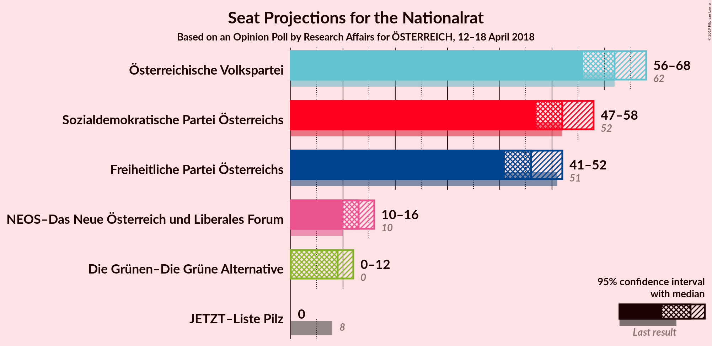
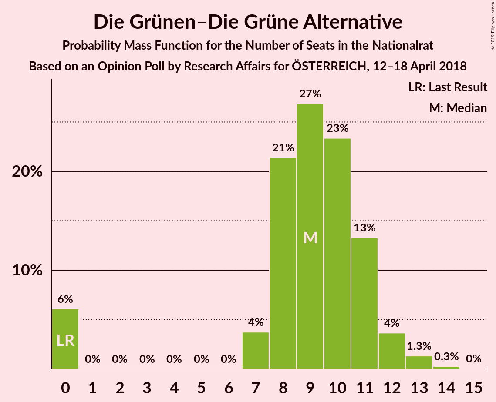
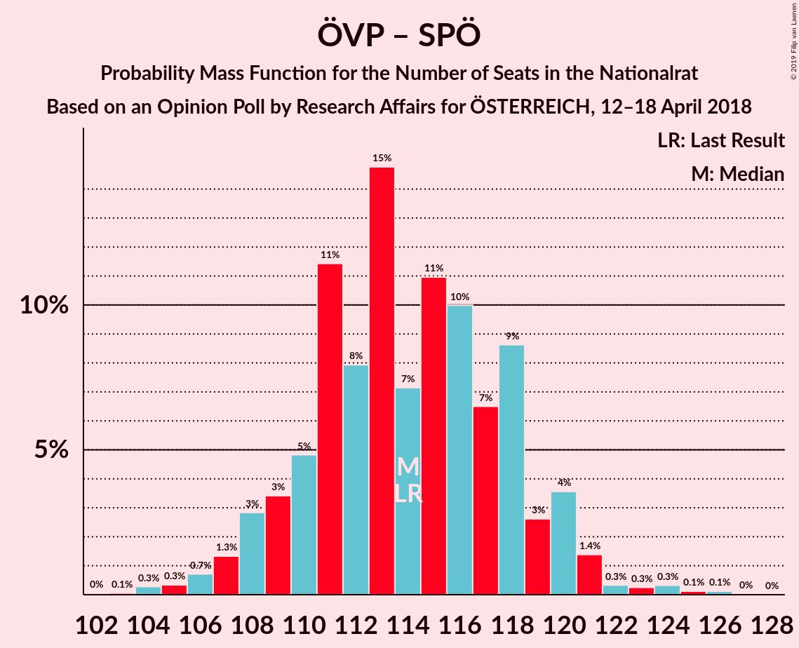

# Opinion Poll by Research Affairs for ÖSTERREICH, 12–18 April 2018

<a href="#voting-intentions">Voting Intentions</a> | <a href="#seats">Seats</a> | <a href="#coalitions">Coalitions</a> | <a href="#technical-information">Technical Information</a>

## Voting Intentions

### Confidence Intervals

| Party | Last Result | Poll Result | 80% Confidence Interval | 90% Confidence Interval | 95% Confidence Interval | 99% Confidence Interval |
|:-----:|:-----------:|:-----------:|:-----------------------:|:-----------------------:|:-----------------------:|:-----------------------:|
| Österreichische Volkspartei | 31.5% | 32.0% | 30.1–33.9% |29.6–34.5% |29.2–34.9% |28.3–35.9% |
| Sozialdemokratische Partei Österreichs | 26.9% | 27.0% | 25.2–28.9% |24.8–29.4% |24.3–29.8% |23.5–30.7% |
| Freiheitliche Partei Österreichs | 26.0% | 24.0% | 22.3–25.8% |21.9–26.3% |21.5–26.7% |20.7–27.6% |
| NEOS–Das Neue Österreich und Liberales Forum | 5.3% | 7.0% | 6.0–8.1% |5.8–8.4% |5.5–8.7% |5.1–9.3% |
| Die Grünen–Die Grüne Alternative | 3.8% | 5.0% | 4.2–6.0% |4.0–6.3% |3.8–6.5% |3.4–7.0% |
| JETZT–Liste Pilz | 4.4% | 2.0% | 1.5–2.7% |1.4–2.9% |1.3–3.1% |1.1–3.4% |

*Note:* The poll result column reflects the actual value used in the calculations. Published results may vary slightly, and in addition be rounded to fewer digits.

## Seats

### Confidence Intervals

| Party | Last Result | Median | 80% Confidence Interval | 90% Confidence Interval | 95% Confidence Interval | 99% Confidence Interval |
|:-----:|:-----------:|:------:|:-----------------------:|:-----------------------:|:-----------------------:|:-----------------------:|
| <a href="#österreichische-volkspartei">Österreichische Volkspartei</a> | 62 | 66 | 54–66 |54–66 |54–66 |52–69 |
| <a href="#sozialdemokratische-partei-österreichs">Sozialdemokratische Partei Österreichs</a> | 52 | 51 | 51–57 |51–57 |51–57 |48–58 |
| <a href="#freiheitliche-partei-österreichs">Freiheitliche Partei Österreichs</a> | 51 | 49 | 43–51 |43–51 |42–51 |38–53 |
| <a href="#neos–das-neue-österreich-und-liberales-forum">NEOS–Das Neue Österreich und Liberales Forum</a> | 10 | 14 | 13–15 |13–15 |10–16 |9–18 |
| <a href="#die-grünen–die-grüne-alternative">Die Grünen–Die Grüne Alternative</a> | 0 | 9 | 0–10 |0–10 |0–10 |0–11 |
| <a href="#jetzt–liste-pilz">JETZT–Liste Pilz</a> | 8 | 0 | 0 |0 |0 |0 |

### Österreichische Volkspartei

*For a full overview of the results for this party, see the [Österreichische Volkspartei](party-österreichischevolkspartei.html) page.*

| Number of Seats | Probability | Accumulated | Special Marks |
|:---------------:|:-----------:|:-----------:|:-------------:|
| 52 | 1.0% | 100% |  |
| 53 | 0.1% | 99.0% |  |
| 54 | 12% | 98.9% |  |
| 55 | 10% | 87% |  |
| 56 | 0% | 77% |  |
| 57 | 0% | 77% |  |
| 58 | 0.5% | 77% |  |
| 59 | 0.1% | 76% |  |
| 60 | 0.3% | 76% |  |
| 61 | 0.5% | 76% |  |
| 62 | 0.1% | 75% | Last Result |
| 63 | 7% | 75% |  |
| 64 | 0.1% | 68% |  |
| 65 | 1.3% | 68% |  |
| 66 | 65% | 66% | Median |
| 67 | 0% | 1.4% |  |
| 68 | 0.4% | 1.4% |  |
| 69 | 1.0% | 1.0% |  |
| 70 | 0% | 0% |  |

### Sozialdemokratische Partei Österreichs

*For a full overview of the results for this party, see the [Sozialdemokratische Partei Österreichs](party-sozialdemokratischeparteiösterreichs.html) page.*

| Number of Seats | Probability | Accumulated | Special Marks |
|:---------------:|:-----------:|:-----------:|:-------------:|
| 44 | 0% | 100% |  |
| 45 | 0.2% | 99.9% |  |
| 46 | 0% | 99.8% |  |
| 47 | 0.1% | 99.8% |  |
| 48 | 0.7% | 99.7% |  |
| 49 | 0.3% | 99.0% |  |
| 50 | 0.1% | 98.7% |  |
| 51 | 63% | 98.6% | Median |
| 52 | 8% | 36% | Last Result |
| 53 | 0.5% | 27% |  |
| 54 | 0.1% | 27% |  |
| 55 | 0.9% | 27% |  |
| 56 | 11% | 26% |  |
| 57 | 15% | 15% |  |
| 58 | 0% | 0.5% |  |
| 59 | 0.2% | 0.5% |  |
| 60 | 0.2% | 0.3% |  |
| 61 | 0% | 0% |  |

### Freiheitliche Partei Österreichs

*For a full overview of the results for this party, see the [Freiheitliche Partei Österreichs](party-freiheitlicheparteiösterreichs.html) page.*

| Number of Seats | Probability | Accumulated | Special Marks |
|:---------------:|:-----------:|:-----------:|:-------------:|
| 38 | 1.1% | 100% |  |
| 39 | 0.1% | 98.9% |  |
| 40 | 0.5% | 98.9% |  |
| 41 | 0.8% | 98% |  |
| 42 | 0.1% | 98% |  |
| 43 | 38% | 97% |  |
| 44 | 7% | 60% |  |
| 45 | 0% | 52% |  |
| 46 | 0.2% | 52% |  |
| 47 | 0.9% | 52% |  |
| 48 | 0% | 51% |  |
| 49 | 22% | 51% | Median |
| 50 | 0% | 29% |  |
| 51 | 28% | 29% | Last Result |
| 52 | 0.1% | 0.7% |  |
| 53 | 0.2% | 0.6% |  |
| 54 | 0.4% | 0.5% |  |
| 55 | 0% | 0% |  |

### NEOS–Das Neue Österreich und Liberales Forum

*For a full overview of the results for this party, see the [NEOS–Das Neue Österreich und Liberales Forum](party-neos–dasneueösterreichundliberalesforum.html) page.*

| Number of Seats | Probability | Accumulated | Special Marks |
|:---------------:|:-----------:|:-----------:|:-------------:|
| 7 | 0.1% | 100% |  |
| 8 | 0% | 99.9% |  |
| 9 | 2% | 99.9% |  |
| 10 | 1.3% | 98% | Last Result |
| 11 | 0.1% | 97% |  |
| 12 | 0.9% | 97% |  |
| 13 | 36% | 96% |  |
| 14 | 22% | 60% | Median |
| 15 | 35% | 38% |  |
| 16 | 1.2% | 3% |  |
| 17 | 0.7% | 2% |  |
| 18 | 0.4% | 0.8% |  |
| 19 | 0% | 0.4% |  |
| 20 | 0.4% | 0.4% |  |
| 21 | 0% | 0% |  |

### Die Grünen–Die Grüne Alternative

*For a full overview of the results for this party, see the [Die Grünen–Die Grüne Alternative](party-diegrünen–diegrünealternative.html) page.*

| Number of Seats | Probability | Accumulated | Special Marks |
|:---------------:|:-----------:|:-----------:|:-------------:|
| 0 | 29% | 100% | Last Result |
| 1 | 0% | 71% |  |
| 2 | 0% | 71% |  |
| 3 | 0% | 71% |  |
| 4 | 0% | 71% |  |
| 5 | 0% | 71% |  |
| 6 | 0% | 71% |  |
| 7 | 0.5% | 71% |  |
| 8 | 5% | 71% |  |
| 9 | 30% | 65% | Median |
| 10 | 35% | 36% |  |
| 11 | 0.3% | 0.7% |  |
| 12 | 0.2% | 0.4% |  |
| 13 | 0.2% | 0.2% |  |
| 14 | 0% | 0% |  |

### JETZT–Liste Pilz

*For a full overview of the results for this party, see the [JETZT–Liste Pilz](party-jetzt–listepilz.html) page.*

| Number of Seats | Probability | Accumulated | Special Marks |
|:---------------:|:-----------:|:-----------:|:-------------:|
| 0 | 100% | 100% | Median |
| 1 | 0% | 0% |  |
| 2 | 0% | 0% |  |
| 3 | 0% | 0% |  |
| 4 | 0% | 0% |  |
| 5 | 0% | 0% |  |
| 6 | 0% | 0% |  |
| 7 | 0% | 0% |  |
| 8 | 0% | 0% | Last Result |

## Coalitions

### Confidence Intervals

| Coalition | Last Result | Median | Majority? | 80% Confidence Interval | 90% Confidence Interval | 95% Confidence Interval | 99% Confidence Interval |
|:---------:|:-----------:|:------:|:---------:|:-----------------------:|:-----------------------:|:-----------------------:|:-----------------------:|
| Österreichische Volkspartei – Sozialdemokratische Partei Österreichs | 114 | 117 | 100% | 111–117 | 111–119 | 111–122 | 107–123 |
| Österreichische Volkspartei – Freiheitliche Partei Österreichs | 113 | 109 | 100% | 103–117 | 103–117 | 103–117 | 99–117 |
| Sozialdemokratische Partei Österreichs – Freiheitliche Partei Österreichs | 103 | 102 | 98.6% | 94–106 | 94–106 | 94–106 | 90–106 |
| Österreichische Volkspartei – NEOS–Das Neue Österreich und Liberales Forum – Die Grünen–Die Grüne Alternative | 72 | 81 | 1.0% | 77–89 | 77–89 | 77–89 | 73–93 |
| Österreichische Volkspartei – NEOS–Das Neue Österreich und Liberales Forum | 72 | 79 | 0% | 68–81 | 68–81 | 68–81 | 65–85 |
| Sozialdemokratische Partei Österreichs – NEOS–Das Neue Österreich und Liberales Forum – Die Grünen–Die Grüne Alternative | 62 | 74 | 0% | 66–80 | 66–80 | 66–80 | 66–81 |
| Österreichische Volkspartei – Die Grünen–Die Grüne Alternative | 62 | 66 | 0% | 63–76 | 63–76 | 63–76 | 60–77 |
| Österreichische Volkspartei | 62 | 66 | 0% | 54–66 | 54–66 | 54–66 | 52–69 |
| Sozialdemokratische Partei Österreichs | 52 | 51 | 0% | 51–57 | 51–57 | 51–57 | 48–58 |

### Österreichische Volkspartei – Sozialdemokratische Partei Österreichs

| Number of Seats | Probability | Accumulated | Special Marks |
|:---------------:|:-----------:|:-----------:|:-------------:|
| 105 | 0.3% | 100% |  |
| 106 | 0% | 99.7% |  |
| 107 | 0.9% | 99.7% |  |
| 108 | 0% | 98.7% |  |
| 109 | 0.6% | 98.7% |  |
| 110 | 0.4% | 98% |  |
| 111 | 22% | 98% |  |
| 112 | 0.4% | 75% |  |
| 113 | 0.1% | 75% |  |
| 114 | 0.1% | 75% | Last Result |
| 115 | 7% | 75% |  |
| 116 | 0% | 68% |  |
| 117 | 63% | 68% | Median |
| 118 | 0.1% | 5% |  |
| 119 | 0.5% | 5% |  |
| 120 | 0.2% | 4% |  |
| 121 | 1.0% | 4% |  |
| 122 | 1.3% | 3% |  |
| 123 | 2% | 2% |  |
| 124 | 0.4% | 0.5% |  |
| 125 | 0% | 0% |  |

### Österreichische Volkspartei – Freiheitliche Partei Österreichs

| Number of Seats | Probability | Accumulated | Special Marks |
|:---------------:|:-----------:|:-----------:|:-------------:|
| 97 | 0.2% | 100% |  |
| 98 | 0% | 99.7% |  |
| 99 | 0.8% | 99.7% |  |
| 100 | 0% | 98.9% |  |
| 101 | 0.1% | 98.9% |  |
| 102 | 0.4% | 98.8% |  |
| 103 | 12% | 98% |  |
| 104 | 11% | 86% |  |
| 105 | 0.2% | 76% |  |
| 106 | 0.7% | 76% |  |
| 107 | 8% | 75% |  |
| 108 | 1.3% | 67% |  |
| 109 | 37% | 66% |  |
| 110 | 0.1% | 29% |  |
| 111 | 0% | 29% |  |
| 112 | 0.2% | 29% |  |
| 113 | 0% | 29% | Last Result |
| 114 | 0.1% | 29% |  |
| 115 | 0.4% | 29% | Median |
| 116 | 0% | 28% |  |
| 117 | 28% | 28% |  |
| 118 | 0% | 0% |  |

### Sozialdemokratische Partei Österreichs – Freiheitliche Partei Österreichs

| Number of Seats | Probability | Accumulated | Special Marks |
|:---------------:|:-----------:|:-----------:|:-------------:|
| 90 | 1.4% | 100% |  |
| 91 | 0% | 98.6% |  |
| 92 | 0.2% | 98.6% | Majority |
| 93 | 0.5% | 98% |  |
| 94 | 35% | 98% |  |
| 95 | 0.1% | 63% |  |
| 96 | 7% | 63% |  |
| 97 | 0.6% | 56% |  |
| 98 | 0.1% | 55% |  |
| 99 | 0.1% | 55% |  |
| 100 | 3% | 55% | Median |
| 101 | 0% | 52% |  |
| 102 | 29% | 52% |  |
| 103 | 0.2% | 23% | Last Result |
| 104 | 0% | 23% |  |
| 105 | 10% | 23% |  |
| 106 | 12% | 12% |  |
| 107 | 0% | 0.2% |  |
| 108 | 0.1% | 0.2% |  |
| 109 | 0% | 0% |  |

### Österreichische Volkspartei – NEOS–Das Neue Österreich und Liberales Forum – Die Grünen–Die Grüne Alternative

| Number of Seats | Probability | Accumulated | Special Marks |
|:---------------:|:-----------:|:-----------:|:-------------:|
| 72 | 0% | 100% | Last Result |
| 73 | 0.8% | 100% |  |
| 74 | 0% | 99.2% |  |
| 75 | 0.1% | 99.2% |  |
| 76 | 0% | 99.0% |  |
| 77 | 12% | 99.0% |  |
| 78 | 10% | 87% |  |
| 79 | 0% | 76% |  |
| 80 | 0.3% | 76% |  |
| 81 | 29% | 76% |  |
| 82 | 0.2% | 48% |  |
| 83 | 3% | 47% |  |
| 84 | 0.3% | 44% |  |
| 85 | 0.1% | 44% |  |
| 86 | 0.4% | 44% |  |
| 87 | 7% | 44% |  |
| 88 | 0% | 37% |  |
| 89 | 35% | 37% | Median |
| 90 | 0.5% | 2% |  |
| 91 | 0% | 1.0% |  |
| 92 | 0% | 1.0% | Majority |
| 93 | 1.0% | 1.0% |  |
| 94 | 0% | 0% |  |

### Österreichische Volkspartei – NEOS–Das Neue Österreich und Liberales Forum

| Number of Seats | Probability | Accumulated | Special Marks |
|:---------------:|:-----------:|:-----------:|:-------------:|
| 64 | 0.1% | 100% |  |
| 65 | 0.9% | 99.9% |  |
| 66 | 0% | 99.0% |  |
| 67 | 0% | 99.0% |  |
| 68 | 12% | 99.0% |  |
| 69 | 10% | 87% |  |
| 70 | 0.1% | 77% |  |
| 71 | 0% | 77% |  |
| 72 | 0.1% | 77% | Last Result |
| 73 | 0.7% | 76% |  |
| 74 | 0.1% | 76% |  |
| 75 | 3% | 76% |  |
| 76 | 0.2% | 73% |  |
| 77 | 0.4% | 72% |  |
| 78 | 7% | 72% |  |
| 79 | 35% | 65% |  |
| 80 | 0% | 30% | Median |
| 81 | 28% | 30% |  |
| 82 | 0% | 2% |  |
| 83 | 0.5% | 2% |  |
| 84 | 0% | 1.4% |  |
| 85 | 1.0% | 1.4% |  |
| 86 | 0.4% | 0.4% |  |
| 87 | 0% | 0% |  |

### Sozialdemokratische Partei Österreichs – NEOS–Das Neue Österreich und Liberales Forum – Die Grünen–Die Grüne Alternative

| Number of Seats | Probability | Accumulated | Special Marks |
|:---------------:|:-----------:|:-----------:|:-------------:|
| 62 | 0.2% | 100% | Last Result |
| 63 | 0% | 99.8% |  |
| 64 | 0% | 99.8% |  |
| 65 | 0% | 99.8% |  |
| 66 | 28% | 99.8% |  |
| 67 | 0% | 72% |  |
| 68 | 0.4% | 72% |  |
| 69 | 0.1% | 71% |  |
| 70 | 0.4% | 71% |  |
| 71 | 0.1% | 71% |  |
| 72 | 0% | 71% |  |
| 73 | 0.2% | 71% |  |
| 74 | 37% | 70% | Median |
| 75 | 1.3% | 33% |  |
| 76 | 8% | 32% |  |
| 77 | 0.7% | 24% |  |
| 78 | 0.2% | 23% |  |
| 79 | 10% | 23% |  |
| 80 | 12% | 13% |  |
| 81 | 0.4% | 0.7% |  |
| 82 | 0% | 0.2% |  |
| 83 | 0% | 0.2% |  |
| 84 | 0% | 0.2% |  |
| 85 | 0% | 0.2% |  |
| 86 | 0.2% | 0.2% |  |
| 87 | 0% | 0% |  |

### Österreichische Volkspartei – Die Grünen–Die Grüne Alternative

| Number of Seats | Probability | Accumulated | Special Marks |
|:---------------:|:-----------:|:-----------:|:-------------:|
| 60 | 1.0% | 100% |  |
| 61 | 0% | 99.0% |  |
| 62 | 0% | 99.0% | Last Result |
| 63 | 12% | 98.9% |  |
| 64 | 10% | 87% |  |
| 65 | 0.2% | 76% |  |
| 66 | 28% | 76% |  |
| 67 | 0.4% | 48% |  |
| 68 | 0.5% | 48% |  |
| 69 | 0.4% | 47% |  |
| 70 | 0.1% | 47% |  |
| 71 | 0.1% | 47% |  |
| 72 | 7% | 47% |  |
| 73 | 2% | 40% |  |
| 74 | 2% | 38% |  |
| 75 | 0.1% | 36% | Median |
| 76 | 35% | 36% |  |
| 77 | 1.0% | 1.0% |  |
| 78 | 0% | 0% |  |

### Österreichische Volkspartei

| Number of Seats | Probability | Accumulated | Special Marks |
|:---------------:|:-----------:|:-----------:|:-------------:|
| 52 | 1.0% | 100% |  |
| 53 | 0.1% | 99.0% |  |
| 54 | 12% | 98.9% |  |
| 55 | 10% | 87% |  |
| 56 | 0% | 77% |  |
| 57 | 0% | 77% |  |
| 58 | 0.5% | 77% |  |
| 59 | 0.1% | 76% |  |
| 60 | 0.3% | 76% |  |
| 61 | 0.5% | 76% |  |
| 62 | 0.1% | 75% | Last Result |
| 63 | 7% | 75% |  |
| 64 | 0.1% | 68% |  |
| 65 | 1.3% | 68% |  |
| 66 | 65% | 66% | Median |
| 67 | 0% | 1.4% |  |
| 68 | 0.4% | 1.4% |  |
| 69 | 1.0% | 1.0% |  |
| 70 | 0% | 0% |  |

### Sozialdemokratische Partei Österreichs

| Number of Seats | Probability | Accumulated | Special Marks |
|:---------------:|:-----------:|:-----------:|:-------------:|
| 44 | 0% | 100% |  |
| 45 | 0.2% | 99.9% |  |
| 46 | 0% | 99.8% |  |
| 47 | 0.1% | 99.8% |  |
| 48 | 0.7% | 99.7% |  |
| 49 | 0.3% | 99.0% |  |
| 50 | 0.1% | 98.7% |  |
| 51 | 63% | 98.6% | Median |
| 52 | 8% | 36% | Last Result |
| 53 | 0.5% | 27% |  |
| 54 | 0.1% | 27% |  |
| 55 | 0.9% | 27% |  |
| 56 | 11% | 26% |  |
| 57 | 15% | 15% |  |
| 58 | 0% | 0.5% |  |
| 59 | 0.2% | 0.5% |  |
| 60 | 0.2% | 0.3% |  |
| 61 | 0% | 0% |  |

## Technical Information

### Opinion Poll

+ **Polling firm:** Research Affairs
+ **Commissioner(s):** ÖSTERREICH
+ **Fieldwork period:** 12–18 April 2018

### Calculations

+ **Sample size:** 1004
+ **Simulations done:** 1,024
+ **Error estimate:** 3.17%

