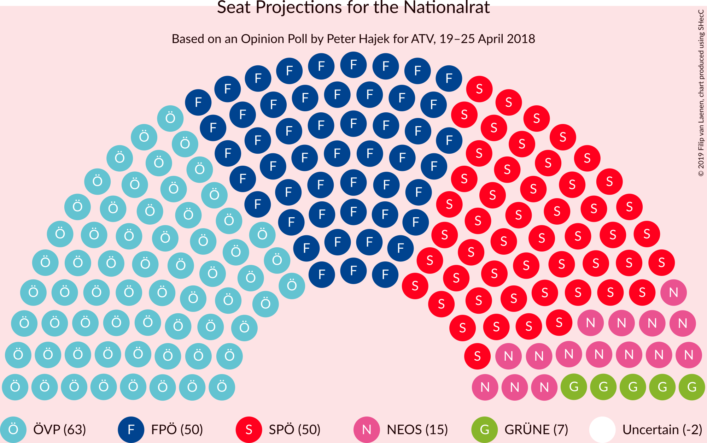
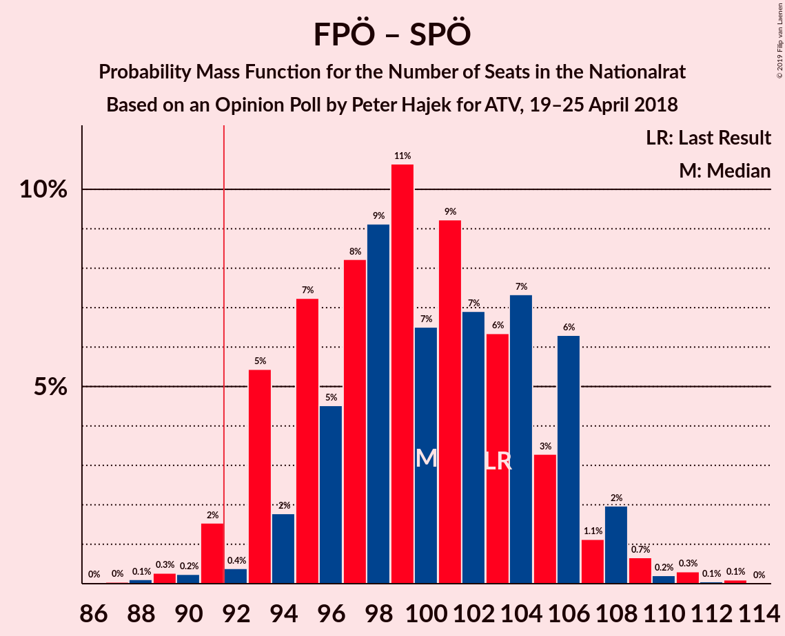
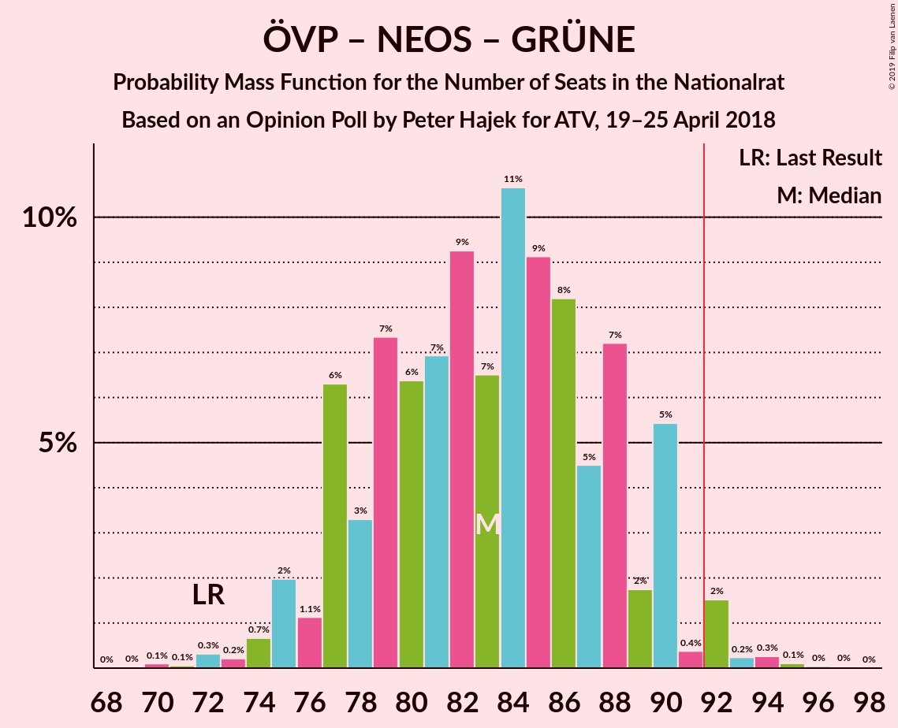
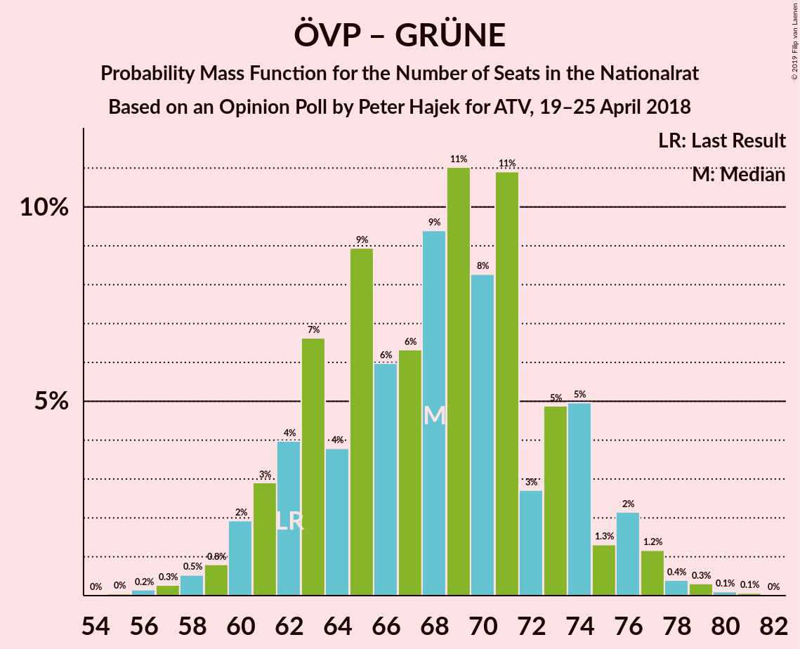

# Opinion Poll by Peter Hajek for ATV, 19–25 April 2018

<a href="#voting-intentions">Voting Intentions</a> | <a href="#seats">Seats</a> | <a href="#coalitions">Coalitions</a> | <a href="#technical-information">Technical Information</a>

## Voting Intentions

### Confidence Intervals

| Party | Last Result | Poll Result | 80% Confidence Interval | 90% Confidence Interval | 95% Confidence Interval | 99% Confidence Interval |
|:-----:|:-----------:|:-----------:|:-----------------------:|:-----------------------:|:-----------------------:|:-----------------------:|
| Österreichische Volkspartei | 31.5% | 33.0% | 30.8–35.3% |30.1–36.0% |29.6–36.6% |28.6–37.7% |
| Sozialdemokratische Partei Österreichs | 26.9% | 26.0% | 24.0–28.2% |23.4–28.8% |22.9–29.4% |21.9–30.5% |
| Freiheitliche Partei Österreichs | 26.0% | 26.0% | 24.0–28.2% |23.4–28.8% |22.9–29.4% |21.9–30.5% |
| NEOS–Das Neue Österreich und Liberales Forum | 5.3% | 8.0% | 6.8–9.5% |6.5–9.9% |6.2–10.3% |5.7–11.0% |
| Die Grünen–Die Grüne Alternative | 3.8% | 4.0% | 3.2–5.1% |3.0–5.4% |2.8–5.7% |2.4–6.3% |
| JETZT–Liste Pilz | 4.4% | 2.0% | 1.5–2.9% |1.3–3.1% |1.2–3.3% |1.0–3.8% |

*Note:* The poll result column reflects the actual value used in the calculations. Published results may vary slightly, and in addition be rounded to fewer digits.

## Seats

### Confidence Intervals

| Party | Last Result | Median | 80% Confidence Interval | 90% Confidence Interval | 95% Confidence Interval | 99% Confidence Interval |
|:-----:|:-----------:|:------:|:-----------------------:|:-----------------------:|:-----------------------:|:-----------------------:|
| <a href="#österreichische-volkspartei">Österreichische Volkspartei</a> | 62 | 63 | 58–69 |57–70 |56–71 |54–74 |
| <a href="#sozialdemokratische-partei-österreichs">Sozialdemokratische Partei Österreichs</a> | 52 | 50 | 46–54 |45–56 |44–57 |42–59 |
| <a href="#freiheitliche-partei-österreichs">Freiheitliche Partei Österreichs</a> | 51 | 50 | 45–54 |44–55 |44–56 |42–59 |
| <a href="#neos–das-neue-österreich-und-liberales-forum">NEOS–Das Neue Österreich und Liberales Forum</a> | 10 | 15 | 13–18 |12–19 |11–19 |11–21 |
| <a href="#die-grünen–die-grüne-alternative">Die Grünen–Die Grüne Alternative</a> | 0 | 7 | 0–9 |0–10 |0–10 |0–11 |
| <a href="#jetzt–liste-pilz">JETZT–Liste Pilz</a> | 8 | 0 | 0 |0 |0 |0 |

### Österreichische Volkspartei

*For a full overview of the results for this party, see the [Österreichische Volkspartei](party-österreichischevolkspartei.html) page.*

| Number of Seats | Probability | Accumulated | Special Marks |
|:---------------:|:-----------:|:-----------:|:-------------:|
| 52 | 0.1% | 100% |  |
| 53 | 0.2% | 99.9% |  |
| 54 | 0.4% | 99.7% |  |
| 55 | 0.9% | 99.3% |  |
| 56 | 2% | 98% |  |
| 57 | 2% | 97% |  |
| 58 | 5% | 95% |  |
| 59 | 4% | 90% |  |
| 60 | 9% | 85% |  |
| 61 | 9% | 76% |  |
| 62 | 12% | 68% | Last Result |
| 63 | 11% | 56% | Median |
| 64 | 8% | 44% |  |
| 65 | 11% | 36% |  |
| 66 | 5% | 25% |  |
| 67 | 4% | 20% |  |
| 68 | 5% | 16% |  |
| 69 | 4% | 10% |  |
| 70 | 3% | 7% |  |
| 71 | 2% | 4% |  |
| 72 | 0.9% | 2% |  |
| 73 | 0.7% | 1.2% |  |
| 74 | 0.4% | 0.5% |  |
| 75 | 0.1% | 0.2% |  |
| 76 | 0% | 0.1% |  |
| 77 | 0% | 0% |  |

### Sozialdemokratische Partei Österreichs

*For a full overview of the results for this party, see the [Sozialdemokratische Partei Österreichs](party-sozialdemokratischeparteiösterreichs.html) page.*

| Number of Seats | Probability | Accumulated | Special Marks |
|:---------------:|:-----------:|:-----------:|:-------------:|
| 39 | 0% | 100% |  |
| 40 | 0.1% | 99.9% |  |
| 41 | 0.2% | 99.8% |  |
| 42 | 0.7% | 99.6% |  |
| 43 | 1.4% | 98.9% |  |
| 44 | 2% | 98% |  |
| 45 | 4% | 95% |  |
| 46 | 7% | 91% |  |
| 47 | 8% | 85% |  |
| 48 | 8% | 77% |  |
| 49 | 16% | 69% |  |
| 50 | 13% | 53% | Median |
| 51 | 8% | 40% |  |
| 52 | 10% | 32% | Last Result |
| 53 | 7% | 22% |  |
| 54 | 6% | 15% |  |
| 55 | 4% | 10% |  |
| 56 | 3% | 6% |  |
| 57 | 1.4% | 3% |  |
| 58 | 1.0% | 2% |  |
| 59 | 0.3% | 0.7% |  |
| 60 | 0.2% | 0.4% |  |
| 61 | 0.1% | 0.2% |  |
| 62 | 0% | 0.1% |  |
| 63 | 0% | 0% |  |

### Freiheitliche Partei Österreichs

*For a full overview of the results for this party, see the [Freiheitliche Partei Österreichs](party-freiheitlicheparteiösterreichs.html) page.*

| Number of Seats | Probability | Accumulated | Special Marks |
|:---------------:|:-----------:|:-----------:|:-------------:|
| 40 | 0.1% | 100% |  |
| 41 | 0.3% | 99.9% |  |
| 42 | 0.5% | 99.5% |  |
| 43 | 1.3% | 99.0% |  |
| 44 | 3% | 98% |  |
| 45 | 5% | 95% |  |
| 46 | 6% | 90% |  |
| 47 | 7% | 84% |  |
| 48 | 10% | 77% |  |
| 49 | 14% | 67% |  |
| 50 | 11% | 53% | Median |
| 51 | 13% | 42% | Last Result |
| 52 | 10% | 29% |  |
| 53 | 5% | 19% |  |
| 54 | 6% | 15% |  |
| 55 | 5% | 9% |  |
| 56 | 2% | 4% |  |
| 57 | 0.8% | 2% |  |
| 58 | 0.6% | 1.3% |  |
| 59 | 0.4% | 0.6% |  |
| 60 | 0.1% | 0.2% |  |
| 61 | 0.1% | 0.1% |  |
| 62 | 0% | 0% |  |

### NEOS–Das Neue Österreich und Liberales Forum

*For a full overview of the results for this party, see the [NEOS–Das Neue Österreich und Liberales Forum](party-neos–dasneueösterreichundliberalesforum.html) page.*

| Number of Seats | Probability | Accumulated | Special Marks |
|:---------------:|:-----------:|:-----------:|:-------------:|
| 9 | 0.1% | 100% |  |
| 10 | 0.4% | 99.9% | Last Result |
| 11 | 2% | 99.5% |  |
| 12 | 5% | 97% |  |
| 13 | 11% | 92% |  |
| 14 | 23% | 81% |  |
| 15 | 19% | 59% | Median |
| 16 | 13% | 40% |  |
| 17 | 15% | 26% |  |
| 18 | 5% | 12% |  |
| 19 | 4% | 6% |  |
| 20 | 2% | 2% |  |
| 21 | 0.4% | 0.7% |  |
| 22 | 0.2% | 0.2% |  |
| 23 | 0% | 0.1% |  |
| 24 | 0% | 0% |  |

### Die Grünen–Die Grüne Alternative

*For a full overview of the results for this party, see the [Die Grünen–Die Grüne Alternative](party-diegrünen–diegrünealternative.html) page.*

| Number of Seats | Probability | Accumulated | Special Marks |
|:---------------:|:-----------:|:-----------:|:-------------:|
| 0 | 44% | 100% | Last Result |
| 1 | 0% | 56% |  |
| 2 | 0% | 56% |  |
| 3 | 0% | 56% |  |
| 4 | 0% | 56% |  |
| 5 | 0% | 56% |  |
| 6 | 0% | 56% |  |
| 7 | 10% | 56% | Median |
| 8 | 22% | 46% |  |
| 9 | 18% | 24% |  |
| 10 | 4% | 6% |  |
| 11 | 2% | 2% |  |
| 12 | 0.3% | 0.4% |  |
| 13 | 0.1% | 0.1% |  |
| 14 | 0% | 0% |  |

### JETZT–Liste Pilz

*For a full overview of the results for this party, see the [JETZT–Liste Pilz](party-jetzt–listepilz.html) page.*

| Number of Seats | Probability | Accumulated | Special Marks |
|:---------------:|:-----------:|:-----------:|:-------------:|
| 0 | 99.8% | 100% | Median |
| 1 | 0% | 0.2% |  |
| 2 | 0% | 0.2% |  |
| 3 | 0% | 0.2% |  |
| 4 | 0% | 0.2% |  |
| 5 | 0% | 0.2% |  |
| 6 | 0% | 0.2% |  |
| 7 | 0.1% | 0.2% |  |
| 8 | 0.1% | 0.1% | Last Result |
| 9 | 0% | 0% |  |

## Coalitions

### Confidence Intervals

| Coalition | Last Result | Median | Majority? | 80% Confidence Interval | 90% Confidence Interval | 95% Confidence Interval | 99% Confidence Interval |
|:---------:|:-----------:|:------:|:---------:|:-----------------------:|:-----------------------:|:-----------------------:|:-----------------------:|
| Österreichische Volkspartei – Freiheitliche Partei Österreichs | 113 | 113 | 100% | 108–119 | 106–121 | 105–122 | 103–124 |
| Österreichische Volkspartei – Sozialdemokratische Partei Österreichs | 114 | 113 | 100% | 108–120 | 106–121 | 105–122 | 103–124 |
| Freiheitliche Partei Österreichs – Sozialdemokratische Partei Österreichs | 103 | 100 | 98% | 95–106 | 93–106 | 92–108 | 90–110 |
| Österreichische Volkspartei – NEOS–Das Neue Österreich und Liberales Forum – Die Grünen–Die Grüne Alternative | 72 | 83 | 2% | 77–88 | 77–90 | 75–91 | 72–93 |
| Österreichische Volkspartei – NEOS–Das Neue Österreich und Liberales Forum | 72 | 78 | 0% | 74–84 | 72–86 | 71–87 | 69–90 |
| Sozialdemokratische Partei Österreichs – NEOS–Das Neue Österreich und Liberales Forum – Die Grünen–Die Grüne Alternative | 62 | 70 | 0% | 64–75 | 62–77 | 61–78 | 59–80 |
| Österreichische Volkspartei – Die Grünen–Die Grüne Alternative | 62 | 68 | 0% | 62–74 | 61–75 | 60–76 | 57–79 |
| Österreichische Volkspartei | 62 | 63 | 0% | 58–69 | 57–70 | 56–71 | 54–74 |
| Sozialdemokratische Partei Österreichs | 52 | 50 | 0% | 46–54 | 45–56 | 44–57 | 42–59 |

### Österreichische Volkspartei – Freiheitliche Partei Österreichs

| Number of Seats | Probability | Accumulated | Special Marks |
|:---------------:|:-----------:|:-----------:|:-------------:|
| 100 | 0.1% | 100% |  |
| 101 | 0.1% | 99.9% |  |
| 102 | 0.2% | 99.8% |  |
| 103 | 0.5% | 99.6% |  |
| 104 | 0.4% | 99.1% |  |
| 105 | 1.4% | 98.7% |  |
| 106 | 3% | 97% |  |
| 107 | 2% | 94% |  |
| 108 | 4% | 92% |  |
| 109 | 6% | 87% |  |
| 110 | 8% | 81% |  |
| 111 | 9% | 73% |  |
| 112 | 13% | 64% |  |
| 113 | 7% | 51% | Last Result, Median |
| 114 | 9% | 44% |  |
| 115 | 6% | 34% |  |
| 116 | 7% | 28% |  |
| 117 | 3% | 21% |  |
| 118 | 6% | 18% |  |
| 119 | 4% | 12% |  |
| 120 | 3% | 8% |  |
| 121 | 1.4% | 5% |  |
| 122 | 2% | 4% |  |
| 123 | 1.1% | 2% |  |
| 124 | 0.3% | 0.8% |  |
| 125 | 0.3% | 0.5% |  |
| 126 | 0.1% | 0.2% |  |
| 127 | 0% | 0.1% |  |
| 128 | 0% | 0% |  |

### Österreichische Volkspartei – Sozialdemokratische Partei Österreichs

| Number of Seats | Probability | Accumulated | Special Marks |
|:---------------:|:-----------:|:-----------:|:-------------:|
| 101 | 0.2% | 100% |  |
| 102 | 0.1% | 99.8% |  |
| 103 | 0.8% | 99.7% |  |
| 104 | 0.7% | 98.9% |  |
| 105 | 1.2% | 98% |  |
| 106 | 3% | 97% |  |
| 107 | 4% | 94% |  |
| 108 | 7% | 90% |  |
| 109 | 2% | 83% |  |
| 110 | 12% | 81% |  |
| 111 | 8% | 69% |  |
| 112 | 6% | 61% |  |
| 113 | 10% | 55% | Median |
| 114 | 6% | 45% | Last Result |
| 115 | 5% | 39% |  |
| 116 | 8% | 33% |  |
| 117 | 5% | 25% |  |
| 118 | 6% | 20% |  |
| 119 | 4% | 14% |  |
| 120 | 4% | 10% |  |
| 121 | 3% | 6% |  |
| 122 | 1.3% | 3% |  |
| 123 | 0.6% | 2% |  |
| 124 | 0.7% | 1.0% |  |
| 125 | 0.1% | 0.3% |  |
| 126 | 0.1% | 0.2% |  |
| 127 | 0% | 0% |  |

### Freiheitliche Partei Österreichs – Sozialdemokratische Partei Österreichs

| Number of Seats | Probability | Accumulated | Special Marks |
|:---------------:|:-----------:|:-----------:|:-------------:|
| 87 | 0% | 100% |  |
| 88 | 0.1% | 99.9% |  |
| 89 | 0.3% | 99.8% |  |
| 90 | 0.2% | 99.5% |  |
| 91 | 2% | 99.3% |  |
| 92 | 0.4% | 98% | Majority |
| 93 | 5% | 97% |  |
| 94 | 2% | 92% |  |
| 95 | 7% | 90% |  |
| 96 | 5% | 83% |  |
| 97 | 8% | 78% |  |
| 98 | 9% | 70% |  |
| 99 | 11% | 61% |  |
| 100 | 7% | 50% | Median |
| 101 | 9% | 44% |  |
| 102 | 7% | 35% |  |
| 103 | 6% | 28% | Last Result |
| 104 | 7% | 21% |  |
| 105 | 3% | 14% |  |
| 106 | 6% | 11% |  |
| 107 | 1.1% | 4% |  |
| 108 | 2% | 3% |  |
| 109 | 0.7% | 1.4% |  |
| 110 | 0.2% | 0.7% |  |
| 111 | 0.3% | 0.5% |  |
| 112 | 0.1% | 0.2% |  |
| 113 | 0.1% | 0.1% |  |
| 114 | 0% | 0% |  |

### Österreichische Volkspartei – NEOS–Das Neue Österreich und Liberales Forum – Die Grünen–Die Grüne Alternative

| Number of Seats | Probability | Accumulated | Special Marks |
|:---------------:|:-----------:|:-----------:|:-------------:|
| 70 | 0.1% | 100% |  |
| 71 | 0.1% | 99.9% |  |
| 72 | 0.3% | 99.8% | Last Result |
| 73 | 0.2% | 99.5% |  |
| 74 | 0.7% | 99.3% |  |
| 75 | 2% | 98.6% |  |
| 76 | 1.1% | 97% |  |
| 77 | 6% | 96% |  |
| 78 | 3% | 89% |  |
| 79 | 7% | 86% |  |
| 80 | 6% | 79% |  |
| 81 | 7% | 72% |  |
| 82 | 9% | 65% |  |
| 83 | 7% | 56% |  |
| 84 | 11% | 49% |  |
| 85 | 9% | 39% | Median |
| 86 | 8% | 30% |  |
| 87 | 5% | 21% |  |
| 88 | 7% | 17% |  |
| 89 | 2% | 10% |  |
| 90 | 5% | 8% |  |
| 91 | 0.4% | 3% |  |
| 92 | 2% | 2% | Majority |
| 93 | 0.2% | 0.7% |  |
| 94 | 0.3% | 0.5% |  |
| 95 | 0.1% | 0.2% |  |
| 96 | 0% | 0.1% |  |
| 97 | 0% | 0% |  |

### Österreichische Volkspartei – NEOS–Das Neue Österreich und Liberales Forum

| Number of Seats | Probability | Accumulated | Special Marks |
|:---------------:|:-----------:|:-----------:|:-------------:|
| 66 | 0.1% | 100% |  |
| 67 | 0.1% | 99.9% |  |
| 68 | 0.3% | 99.9% |  |
| 69 | 0.7% | 99.6% |  |
| 70 | 0.8% | 98.9% |  |
| 71 | 2% | 98% |  |
| 72 | 3% | 96% | Last Result |
| 73 | 3% | 93% |  |
| 74 | 8% | 90% |  |
| 75 | 6% | 82% |  |
| 76 | 8% | 76% |  |
| 77 | 14% | 68% |  |
| 78 | 6% | 54% | Median |
| 79 | 11% | 48% |  |
| 80 | 7% | 37% |  |
| 81 | 8% | 30% |  |
| 82 | 5% | 22% |  |
| 83 | 4% | 17% |  |
| 84 | 3% | 13% |  |
| 85 | 4% | 10% |  |
| 86 | 2% | 6% |  |
| 87 | 1.2% | 3% |  |
| 88 | 1.3% | 2% |  |
| 89 | 0.2% | 0.8% |  |
| 90 | 0.5% | 0.6% |  |
| 91 | 0% | 0.1% |  |
| 92 | 0% | 0% | Majority |

### Sozialdemokratische Partei Österreichs – NEOS–Das Neue Österreich und Liberales Forum – Die Grünen–Die Grüne Alternative

| Number of Seats | Probability | Accumulated | Special Marks |
|:---------------:|:-----------:|:-----------:|:-------------:|
| 56 | 0% | 100% |  |
| 57 | 0.1% | 99.9% |  |
| 58 | 0.3% | 99.8% |  |
| 59 | 0.3% | 99.5% |  |
| 60 | 1.1% | 99.2% |  |
| 61 | 2% | 98% |  |
| 62 | 1.4% | 96% | Last Result |
| 63 | 3% | 95% |  |
| 64 | 4% | 92% |  |
| 65 | 6% | 88% |  |
| 66 | 3% | 82% |  |
| 67 | 7% | 79% |  |
| 68 | 6% | 72% |  |
| 69 | 9% | 65% |  |
| 70 | 7% | 56% |  |
| 71 | 13% | 49% |  |
| 72 | 9% | 36% | Median |
| 73 | 8% | 27% |  |
| 74 | 6% | 19% |  |
| 75 | 4% | 13% |  |
| 76 | 2% | 8% |  |
| 77 | 3% | 6% |  |
| 78 | 1.4% | 3% |  |
| 79 | 0.4% | 1.2% |  |
| 80 | 0.5% | 0.9% |  |
| 81 | 0.2% | 0.4% |  |
| 82 | 0.1% | 0.2% |  |
| 83 | 0.1% | 0.1% |  |
| 84 | 0% | 0% |  |

### Österreichische Volkspartei – Die Grünen–Die Grüne Alternative

| Number of Seats | Probability | Accumulated | Special Marks |
|:---------------:|:-----------:|:-----------:|:-------------:|
| 55 | 0% | 100% |  |
| 56 | 0.2% | 99.9% |  |
| 57 | 0.3% | 99.8% |  |
| 58 | 0.5% | 99.5% |  |
| 59 | 0.8% | 99.0% |  |
| 60 | 2% | 98% |  |
| 61 | 3% | 96% |  |
| 62 | 4% | 93% | Last Result |
| 63 | 7% | 89% |  |
| 64 | 4% | 83% |  |
| 65 | 9% | 79% |  |
| 66 | 6% | 70% |  |
| 67 | 6% | 64% |  |
| 68 | 9% | 58% |  |
| 69 | 11% | 48% |  |
| 70 | 8% | 37% | Median |
| 71 | 11% | 29% |  |
| 72 | 3% | 18% |  |
| 73 | 5% | 15% |  |
| 74 | 5% | 10% |  |
| 75 | 1.3% | 6% |  |
| 76 | 2% | 4% |  |
| 77 | 1.2% | 2% |  |
| 78 | 0.4% | 0.9% |  |
| 79 | 0.3% | 0.5% |  |
| 80 | 0.1% | 0.2% |  |
| 81 | 0.1% | 0.1% |  |
| 82 | 0% | 0% |  |

### Österreichische Volkspartei

| Number of Seats | Probability | Accumulated | Special Marks |
|:---------------:|:-----------:|:-----------:|:-------------:|
| 52 | 0.1% | 100% |  |
| 53 | 0.2% | 99.9% |  |
| 54 | 0.4% | 99.7% |  |
| 55 | 0.9% | 99.3% |  |
| 56 | 2% | 98% |  |
| 57 | 2% | 97% |  |
| 58 | 5% | 95% |  |
| 59 | 4% | 90% |  |
| 60 | 9% | 85% |  |
| 61 | 9% | 76% |  |
| 62 | 12% | 68% | Last Result |
| 63 | 11% | 56% | Median |
| 64 | 8% | 44% |  |
| 65 | 11% | 36% |  |
| 66 | 5% | 25% |  |
| 67 | 4% | 20% |  |
| 68 | 5% | 16% |  |
| 69 | 4% | 10% |  |
| 70 | 3% | 7% |  |
| 71 | 2% | 4% |  |
| 72 | 0.9% | 2% |  |
| 73 | 0.7% | 1.2% |  |
| 74 | 0.4% | 0.5% |  |
| 75 | 0.1% | 0.2% |  |
| 76 | 0% | 0.1% |  |
| 77 | 0% | 0% |  |

### Sozialdemokratische Partei Österreichs

| Number of Seats | Probability | Accumulated | Special Marks |
|:---------------:|:-----------:|:-----------:|:-------------:|
| 39 | 0% | 100% |  |
| 40 | 0.1% | 99.9% |  |
| 41 | 0.2% | 99.8% |  |
| 42 | 0.7% | 99.6% |  |
| 43 | 1.4% | 98.9% |  |
| 44 | 2% | 98% |  |
| 45 | 4% | 95% |  |
| 46 | 7% | 91% |  |
| 47 | 8% | 85% |  |
| 48 | 8% | 77% |  |
| 49 | 16% | 69% |  |
| 50 | 13% | 53% | Median |
| 51 | 8% | 40% |  |
| 52 | 10% | 32% | Last Result |
| 53 | 7% | 22% |  |
| 54 | 6% | 15% |  |
| 55 | 4% | 10% |  |
| 56 | 3% | 6% |  |
| 57 | 1.4% | 3% |  |
| 58 | 1.0% | 2% |  |
| 59 | 0.3% | 0.7% |  |
| 60 | 0.2% | 0.4% |  |
| 61 | 0.1% | 0.2% |  |
| 62 | 0% | 0.1% |  |
| 63 | 0% | 0% |  |

## Technical Information

### Opinion Poll

+ **Polling firm:** Peter Hajek
+ **Commissioner(s):** ATV
+ **Fieldwork period:** 19–25 April 2018

### Calculations

+ **Sample size:** 700
+ **Simulations done:** 131,072
+ **Error estimate:** 0.87%

