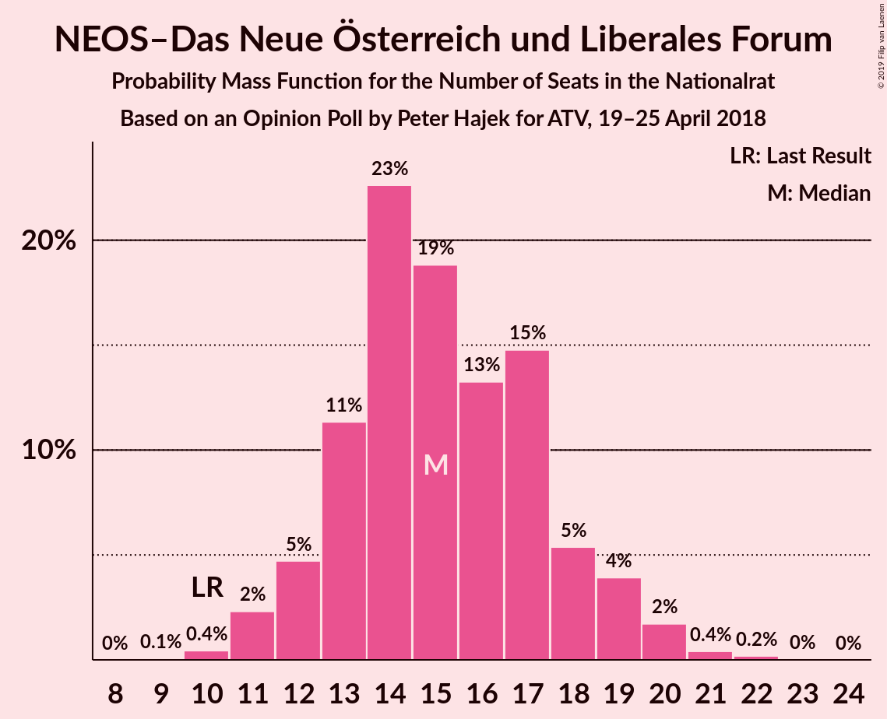
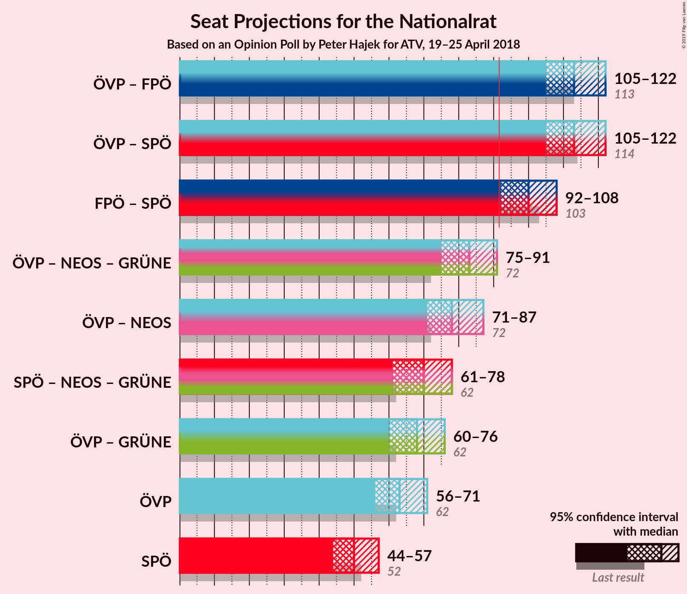
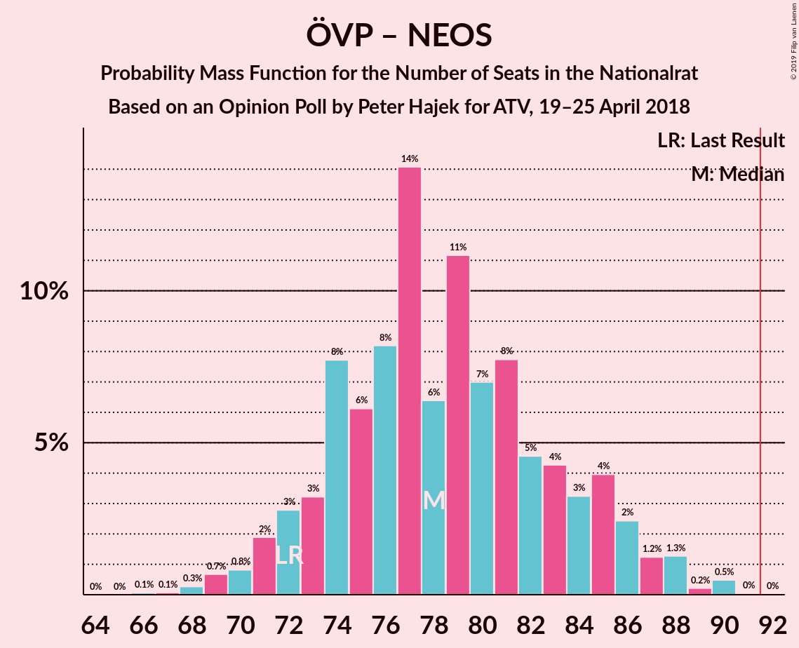

# Opinion Poll by Peter Hajek for ATV, 19–25 April 2018

<a href="#voting-intentions">Voting Intentions</a> | <a href="#seats">Seats</a> | <a href="#coalitions">Coalitions</a> | <a href="#technical-information">Technical Information</a>

## Voting Intentions

### Confidence Intervals

| Party | Last Result | Poll Result | 80% Confidence Interval | 90% Confidence Interval | 95% Confidence Interval | 99% Confidence Interval |
|:-----:|:-----------:|:-----------:|:-----------------------:|:-----------------------:|:-----------------------:|:-----------------------:|
| Österreichische Volkspartei | 31.5% | 33.0% | 30.8–35.3% |30.1–36.0% |29.6–36.6% |28.6–37.7% |
| Sozialdemokratische Partei Österreichs | 26.9% | 26.0% | 24.0–28.2% |23.4–28.8% |22.9–29.4% |21.9–30.5% |
| Freiheitliche Partei Österreichs | 26.0% | 26.0% | 24.0–28.2% |23.4–28.8% |22.9–29.4% |21.9–30.5% |
| NEOS–Das Neue Österreich und Liberales Forum | 5.3% | 8.0% | 6.8–9.5% |6.5–9.9% |6.2–10.3% |5.7–11.0% |
| Die Grünen–Die Grüne Alternative | 3.8% | 4.0% | 3.2–5.1% |3.0–5.4% |2.8–5.7% |2.4–6.3% |
| JETZT–Liste Pilz | 4.4% | 2.0% | 1.5–2.9% |1.3–3.1% |1.2–3.3% |1.0–3.8% |

*Note:* The poll result column reflects the actual value used in the calculations. Published results may vary slightly, and in addition be rounded to fewer digits.

## Seats

### Confidence Intervals

| Party | Last Result | Median | 80% Confidence Interval | 90% Confidence Interval | 95% Confidence Interval | 99% Confidence Interval |
|:-----:|:-----------:|:------:|:-----------------------:|:-----------------------:|:-----------------------:|:-----------------------:|
| <a href="#österreichische-volkspartei">Österreichische Volkspartei</a> | 62 | 68 | 67–71 |66–71 |59–71 |59–71 |
| <a href="#sozialdemokratische-partei-österreichs">Sozialdemokratische Partei Österreichs</a> | 52 | 51 | 47–51 |42–51 |42–56 |42–58 |
| <a href="#freiheitliche-partei-österreichs">Freiheitliche Partei Österreichs</a> | 51 | 51 | 47–51 |46–52 |43–52 |41–52 |
| <a href="#neos–das-neue-österreich-und-liberales-forum">NEOS–Das Neue Österreich und Liberales Forum</a> | 10 | 13 | 13–16 |13–17 |13–19 |10–19 |
| <a href="#die-grünen–die-grüne-alternative">Die Grünen–Die Grüne Alternative</a> | 0 | 0 | 0–8 |0–8 |0–9 |0–11 |
| <a href="#jetzt–liste-pilz">JETZT–Liste Pilz</a> | 8 | 0 | 0 |0 |0 |0 |

### Österreichische Volkspartei

*For a full overview of the results for this party, see the [Österreichische Volkspartei](party-österreichischevolkspartei.html) page.*

| Number of Seats | Probability | Accumulated | Special Marks |
|:---------------:|:-----------:|:-----------:|:-------------:|
| 59 | 2% | 100% |  |
| 60 | 0.1% | 97% |  |
| 61 | 0.6% | 97% |  |
| 62 | 0.2% | 97% | Last Result |
| 63 | 0% | 97% |  |
| 64 | 1.5% | 97% |  |
| 65 | 0.1% | 95% |  |
| 66 | 5% | 95% |  |
| 67 | 0.9% | 90% |  |
| 68 | 79% | 89% | Median |
| 69 | 0% | 10% |  |
| 70 | 0% | 10% |  |
| 71 | 10% | 10% |  |
| 72 | 0% | 0% |  |

### Sozialdemokratische Partei Österreichs

*For a full overview of the results for this party, see the [Sozialdemokratische Partei Österreichs](party-sozialdemokratischeparteiösterreichs.html) page.*

| Number of Seats | Probability | Accumulated | Special Marks |
|:---------------:|:-----------:|:-----------:|:-------------:|
| 42 | 6% | 100% |  |
| 43 | 0% | 94% |  |
| 44 | 0.1% | 94% |  |
| 45 | 0% | 94% |  |
| 46 | 1.2% | 94% |  |
| 47 | 4% | 93% |  |
| 48 | 5% | 89% |  |
| 49 | 0% | 84% |  |
| 50 | 0% | 84% |  |
| 51 | 80% | 84% | Median |
| 52 | 0.2% | 4% | Last Result |
| 53 | 0% | 3% |  |
| 54 | 0.6% | 3% |  |
| 55 | 0.3% | 3% |  |
| 56 | 0% | 3% |  |
| 57 | 0% | 2% |  |
| 58 | 2% | 2% |  |
| 59 | 0% | 0% |  |

### Freiheitliche Partei Österreichs

*For a full overview of the results for this party, see the [Freiheitliche Partei Österreichs](party-freiheitlicheparteiösterreichs.html) page.*

| Number of Seats | Probability | Accumulated | Special Marks |
|:---------------:|:-----------:|:-----------:|:-------------:|
| 41 | 1.5% | 100% |  |
| 42 | 0% | 98.5% |  |
| 43 | 3% | 98.5% |  |
| 44 | 0% | 96% |  |
| 45 | 0% | 96% |  |
| 46 | 5% | 96% |  |
| 47 | 6% | 91% |  |
| 48 | 0% | 85% |  |
| 49 | 0% | 85% |  |
| 50 | 0% | 85% |  |
| 51 | 79% | 85% | Last Result, Median |
| 52 | 6% | 6% |  |
| 53 | 0% | 0.2% |  |
| 54 | 0% | 0.2% |  |
| 55 | 0% | 0.2% |  |
| 56 | 0% | 0.2% |  |
| 57 | 0.2% | 0.2% |  |
| 58 | 0% | 0.1% |  |
| 59 | 0.1% | 0.1% |  |
| 60 | 0% | 0% |  |

### NEOS–Das Neue Österreich und Liberales Forum

*For a full overview of the results for this party, see the [NEOS–Das Neue Österreich und Liberales Forum](party-neos–dasneueösterreichundliberalesforum.html) page.*

| Number of Seats | Probability | Accumulated | Special Marks |
|:---------------:|:-----------:|:-----------:|:-------------:|
| 9 | 0.3% | 100% |  |
| 10 | 1.2% | 99.7% | Last Result |
| 11 | 0.3% | 98.5% |  |
| 12 | 0.2% | 98% |  |
| 13 | 79% | 98% | Median |
| 14 | 3% | 19% |  |
| 15 | 6% | 17% |  |
| 16 | 2% | 11% |  |
| 17 | 5% | 9% |  |
| 18 | 0% | 4% |  |
| 19 | 4% | 4% |  |
| 20 | 0% | 0% |  |

### Die Grünen–Die Grüne Alternative

*For a full overview of the results for this party, see the [Die Grünen–Die Grüne Alternative](party-diegrünen–diegrünealternative.html) page.*

| Number of Seats | Probability | Accumulated | Special Marks |
|:---------------:|:-----------:|:-----------:|:-------------:|
| 0 | 88% | 100% | Last Result, Median |
| 1 | 0% | 12% |  |
| 2 | 0% | 12% |  |
| 3 | 0% | 12% |  |
| 4 | 0% | 12% |  |
| 5 | 0% | 12% |  |
| 6 | 0% | 12% |  |
| 7 | 0% | 12% |  |
| 8 | 7% | 12% |  |
| 9 | 3% | 5% |  |
| 10 | 0% | 2% |  |
| 11 | 2% | 2% |  |
| 12 | 0% | 0% |  |

### JETZT–Liste Pilz

*For a full overview of the results for this party, see the [JETZT–Liste Pilz](party-jetzt–listepilz.html) page.*

| Number of Seats | Probability | Accumulated | Special Marks |
|:---------------:|:-----------:|:-----------:|:-------------:|
| 0 | 100% | 100% | Median |
| 1 | 0% | 0% |  |
| 2 | 0% | 0% |  |
| 3 | 0% | 0% |  |
| 4 | 0% | 0% |  |
| 5 | 0% | 0% |  |
| 6 | 0% | 0% |  |
| 7 | 0% | 0% |  |
| 8 | 0% | 0% | Last Result |

## Coalitions

### Confidence Intervals

| Coalition | Last Result | Median | Majority? | 80% Confidence Interval | 90% Confidence Interval | 95% Confidence Interval | 99% Confidence Interval |
|:---------:|:-----------:|:------:|:---------:|:-----------------------:|:-----------------------:|:-----------------------:|:-----------------------:|
| Österreichische Volkspartei – Sozialdemokratische Partei Österreichs | 114 | 119 | 100% | 114–119 | 113–119 | 113–119 | 113–119 |
| Österreichische Volkspartei – Freiheitliche Partei Österreichs | 113 | 119 | 100% | 118–119 | 117–119 | 103–119 | 102–119 |
| Freiheitliche Partei Österreichs – Sozialdemokratische Partei Österreichs | 103 | 102 | 94% | 93–102 | 89–102 | 89–102 | 89–102 |
| Österreichische Volkspartei – NEOS–Das Neue Österreich und Liberales Forum – Die Grünen–Die Grüne Alternative | 72 | 81 | 6% | 81–90 | 81–94 | 81–94 | 81–94 |
| Österreichische Volkspartei – NEOS–Das Neue Österreich und Liberales Forum | 72 | 81 | 0% | 81–86 | 80–86 | 73–90 | 72–90 |
| Sozialdemokratische Partei Österreichs – NEOS–Das Neue Österreich und Liberales Forum – Die Grünen–Die Grüne Alternative | 62 | 64 | 0% | 64–65 | 64–66 | 64–80 | 64–81 |
| Österreichische Volkspartei – Die Grünen–Die Grüne Alternative | 62 | 68 | 0% | 68–71 | 66–79 | 66–79 | 66–79 |
| Österreichische Volkspartei | 62 | 68 | 0% | 67–71 | 66–71 | 59–71 | 59–71 |
| Sozialdemokratische Partei Österreichs | 52 | 51 | 0% | 47–51 | 42–51 | 42–56 | 42–58 |

### Österreichische Volkspartei – Sozialdemokratische Partei Österreichs

| Number of Seats | Probability | Accumulated | Special Marks |
|:---------------:|:-----------:|:-----------:|:-------------:|
| 104 | 0.1% | 100% |  |
| 105 | 0% | 99.9% |  |
| 106 | 0% | 99.9% |  |
| 107 | 0% | 99.9% |  |
| 108 | 0% | 99.9% |  |
| 109 | 0% | 99.9% |  |
| 110 | 0% | 99.9% |  |
| 111 | 0% | 99.9% |  |
| 112 | 0% | 99.9% |  |
| 113 | 7% | 99.9% |  |
| 114 | 5% | 93% | Last Result |
| 115 | 2% | 88% |  |
| 116 | 0.3% | 86% |  |
| 117 | 2% | 86% |  |
| 118 | 4% | 83% |  |
| 119 | 79% | 79% | Median |
| 120 | 0.2% | 0.2% |  |
| 121 | 0% | 0% |  |

### Österreichische Volkspartei – Freiheitliche Partei Österreichs

| Number of Seats | Probability | Accumulated | Special Marks |
|:---------------:|:-----------:|:-----------:|:-------------:|
| 102 | 2% | 100% |  |
| 103 | 0% | 98% |  |
| 104 | 0% | 97% |  |
| 105 | 1.5% | 97% |  |
| 106 | 0% | 96% |  |
| 107 | 0.6% | 96% |  |
| 108 | 0% | 95% |  |
| 109 | 0% | 95% |  |
| 110 | 0% | 95% |  |
| 111 | 0% | 95% |  |
| 112 | 0.1% | 95% |  |
| 113 | 0.2% | 95% | Last Result |
| 114 | 0% | 95% |  |
| 115 | 0% | 95% |  |
| 116 | 0% | 95% |  |
| 117 | 4% | 95% |  |
| 118 | 11% | 91% |  |
| 119 | 80% | 80% | Median |
| 120 | 0.3% | 0.3% |  |
| 121 | 0% | 0% |  |

### Freiheitliche Partei Österreichs – Sozialdemokratische Partei Österreichs

| Number of Seats | Probability | Accumulated | Special Marks |
|:---------------:|:-----------:|:-----------:|:-------------:|
| 89 | 6% | 100% |  |
| 90 | 0% | 94% |  |
| 91 | 0% | 94% |  |
| 92 | 1.5% | 94% | Majority |
| 93 | 4% | 93% |  |
| 94 | 0% | 88% |  |
| 95 | 0% | 88% |  |
| 96 | 0% | 88% |  |
| 97 | 0% | 88% |  |
| 98 | 1.2% | 88% |  |
| 99 | 0% | 87% |  |
| 100 | 5% | 87% |  |
| 101 | 3% | 82% |  |
| 102 | 79% | 79% | Median |
| 103 | 0.1% | 0.2% | Last Result |
| 104 | 0% | 0.2% |  |
| 105 | 0% | 0.2% |  |
| 106 | 0% | 0.2% |  |
| 107 | 0% | 0.2% |  |
| 108 | 0% | 0.2% |  |
| 109 | 0.2% | 0.2% |  |
| 110 | 0% | 0% |  |

### Österreichische Volkspartei – NEOS–Das Neue Österreich und Liberales Forum – Die Grünen–Die Grüne Alternative

| Number of Seats | Probability | Accumulated | Special Marks |
|:---------------:|:-----------:|:-----------:|:-------------:|
| 72 | 0% | 100% | Last Result |
| 73 | 0% | 100% |  |
| 74 | 0.2% | 100% |  |
| 75 | 0% | 99.8% |  |
| 76 | 0% | 99.8% |  |
| 77 | 0% | 99.8% |  |
| 78 | 0% | 99.8% |  |
| 79 | 0% | 99.8% |  |
| 80 | 0.1% | 99.8% |  |
| 81 | 79% | 99.8% | Median |
| 82 | 3% | 21% |  |
| 83 | 5% | 18% |  |
| 84 | 0% | 13% |  |
| 85 | 1.2% | 13% |  |
| 86 | 0% | 12% |  |
| 87 | 0% | 12% |  |
| 88 | 0% | 12% |  |
| 89 | 0% | 12% |  |
| 90 | 4% | 12% |  |
| 91 | 1.5% | 7% |  |
| 92 | 0% | 6% | Majority |
| 93 | 0% | 6% |  |
| 94 | 6% | 6% |  |
| 95 | 0% | 0% |  |

### Österreichische Volkspartei – NEOS–Das Neue Österreich und Liberales Forum

| Number of Seats | Probability | Accumulated | Special Marks |
|:---------------:|:-----------:|:-----------:|:-------------:|
| 71 | 0.3% | 100% |  |
| 72 | 0.3% | 99.7% | Last Result |
| 73 | 2% | 99.4% |  |
| 74 | 0.2% | 97% |  |
| 75 | 0% | 97% |  |
| 76 | 0% | 97% |  |
| 77 | 1.2% | 97% |  |
| 78 | 0% | 96% |  |
| 79 | 0% | 96% |  |
| 80 | 1.5% | 96% |  |
| 81 | 79% | 94% | Median |
| 82 | 0.3% | 15% |  |
| 83 | 5% | 15% |  |
| 84 | 0% | 10% |  |
| 85 | 0% | 10% |  |
| 86 | 6% | 10% |  |
| 87 | 0% | 4% |  |
| 88 | 0% | 4% |  |
| 89 | 0% | 4% |  |
| 90 | 4% | 4% |  |
| 91 | 0% | 0% |  |

### Sozialdemokratische Partei Österreichs – NEOS–Das Neue Österreich und Liberales Forum – Die Grünen–Die Grüne Alternative

| Number of Seats | Probability | Accumulated | Special Marks |
|:---------------:|:-----------:|:-----------:|:-------------:|
| 62 | 0% | 100% | Last Result |
| 63 | 0.3% | 100% |  |
| 64 | 80% | 99.7% | Median |
| 65 | 11% | 20% |  |
| 66 | 4% | 9% |  |
| 67 | 0% | 5% |  |
| 68 | 0% | 5% |  |
| 69 | 0% | 5% |  |
| 70 | 0.2% | 5% |  |
| 71 | 0.1% | 5% |  |
| 72 | 0% | 5% |  |
| 73 | 0% | 5% |  |
| 74 | 0% | 5% |  |
| 75 | 0% | 5% |  |
| 76 | 0.6% | 5% |  |
| 77 | 0% | 4% |  |
| 78 | 1.5% | 4% |  |
| 79 | 0% | 3% |  |
| 80 | 0% | 3% |  |
| 81 | 2% | 2% |  |
| 82 | 0% | 0% |  |

### Österreichische Volkspartei – Die Grünen–Die Grüne Alternative

| Number of Seats | Probability | Accumulated | Special Marks |
|:---------------:|:-----------:|:-----------:|:-------------:|
| 62 | 0.2% | 100% | Last Result |
| 63 | 0% | 99.8% |  |
| 64 | 0% | 99.8% |  |
| 65 | 0.1% | 99.8% |  |
| 66 | 5% | 99.7% |  |
| 67 | 0% | 95% |  |
| 68 | 82% | 95% | Median |
| 69 | 0% | 13% |  |
| 70 | 0% | 13% |  |
| 71 | 4% | 13% |  |
| 72 | 0.6% | 9% |  |
| 73 | 0% | 9% |  |
| 74 | 0% | 9% |  |
| 75 | 2% | 9% |  |
| 76 | 0.3% | 6% |  |
| 77 | 0% | 6% |  |
| 78 | 0% | 6% |  |
| 79 | 6% | 6% |  |
| 80 | 0% | 0% |  |

### Österreichische Volkspartei

| Number of Seats | Probability | Accumulated | Special Marks |
|:---------------:|:-----------:|:-----------:|:-------------:|
| 59 | 2% | 100% |  |
| 60 | 0.1% | 97% |  |
| 61 | 0.6% | 97% |  |
| 62 | 0.2% | 97% | Last Result |
| 63 | 0% | 97% |  |
| 64 | 1.5% | 97% |  |
| 65 | 0.1% | 95% |  |
| 66 | 5% | 95% |  |
| 67 | 0.9% | 90% |  |
| 68 | 79% | 89% | Median |
| 69 | 0% | 10% |  |
| 70 | 0% | 10% |  |
| 71 | 10% | 10% |  |
| 72 | 0% | 0% |  |

### Sozialdemokratische Partei Österreichs

| Number of Seats | Probability | Accumulated | Special Marks |
|:---------------:|:-----------:|:-----------:|:-------------:|
| 42 | 6% | 100% |  |
| 43 | 0% | 94% |  |
| 44 | 0.1% | 94% |  |
| 45 | 0% | 94% |  |
| 46 | 1.2% | 94% |  |
| 47 | 4% | 93% |  |
| 48 | 5% | 89% |  |
| 49 | 0% | 84% |  |
| 50 | 0% | 84% |  |
| 51 | 80% | 84% | Median |
| 52 | 0.2% | 4% | Last Result |
| 53 | 0% | 3% |  |
| 54 | 0.6% | 3% |  |
| 55 | 0.3% | 3% |  |
| 56 | 0% | 3% |  |
| 57 | 0% | 2% |  |
| 58 | 2% | 2% |  |
| 59 | 0% | 0% |  |

## Technical Information

### Opinion Poll

+ **Polling firm:** Peter Hajek
+ **Commissioner(s):** ATV
+ **Fieldwork period:** 19–25 April 2018

### Calculations

+ **Sample size:** 700
+ **Simulations done:** 1,024
+ **Error estimate:** 2.30%

