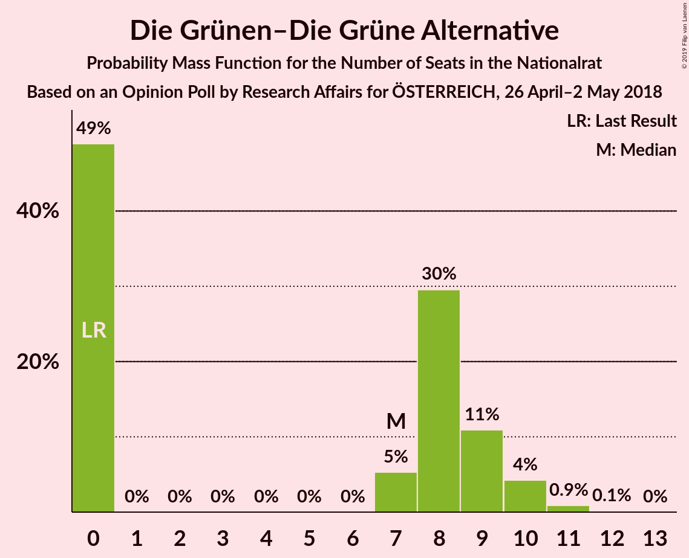
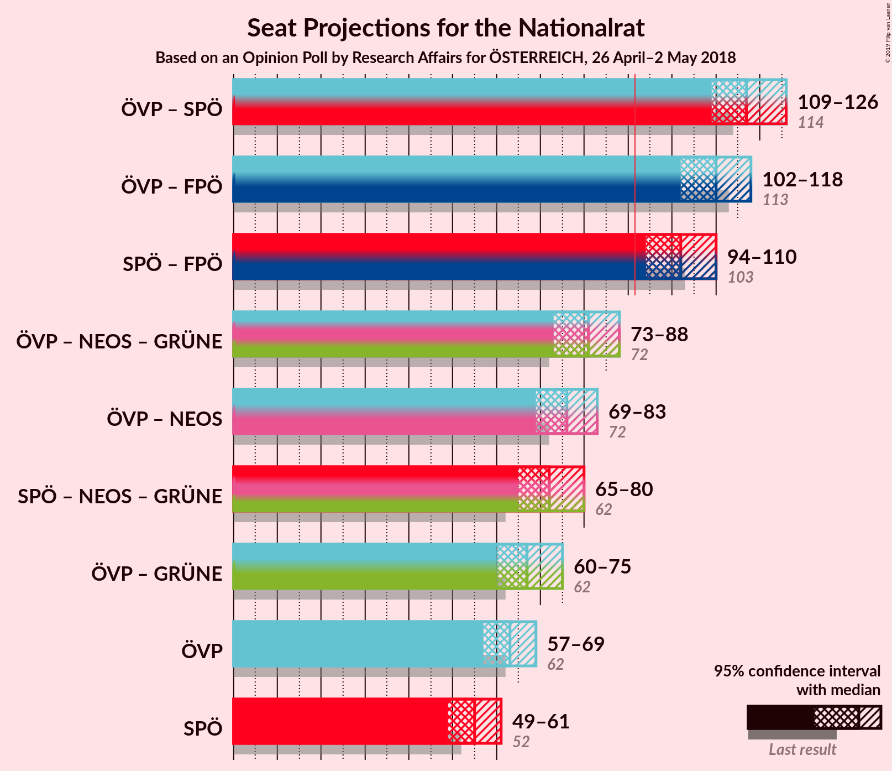
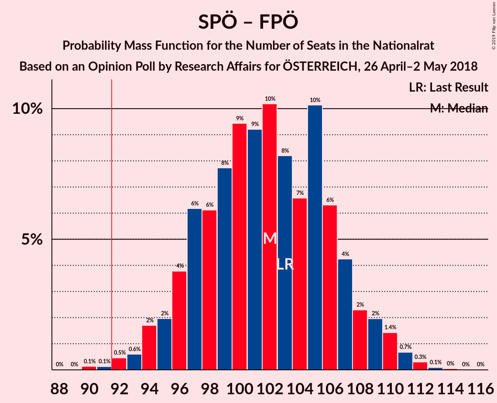
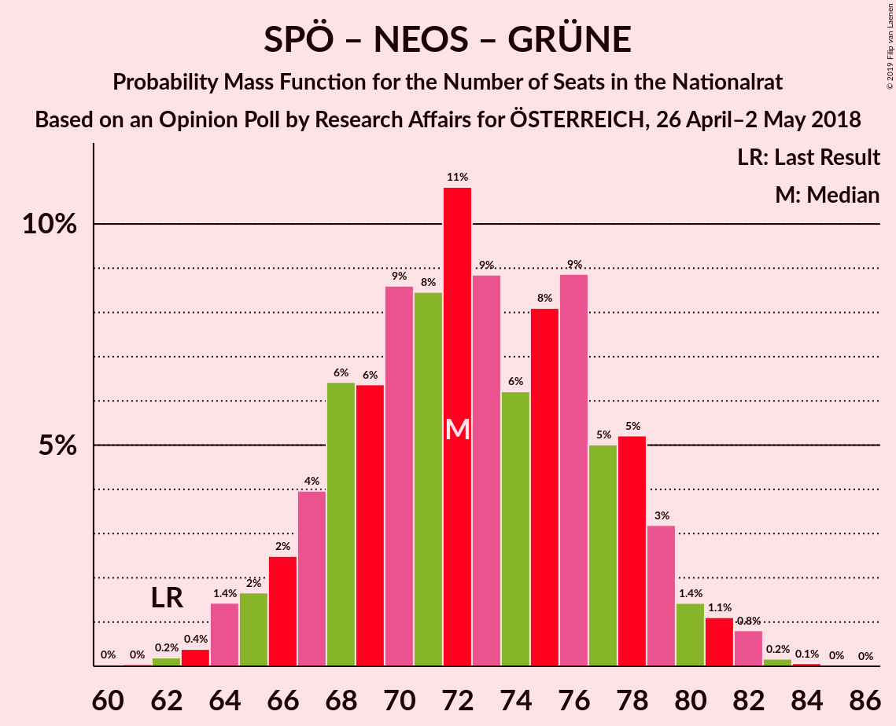

# Opinion Poll by Research Affairs for ÖSTERREICH, 26 April–2 May 2018

<a href="#voting-intentions">Voting Intentions</a> | <a href="#seats">Seats</a> | <a href="#coalitions">Coalitions</a> | <a href="#technical-information">Technical Information</a>

## Voting Intentions

### Confidence Intervals

| Party | Last Result | Poll Result | 80% Confidence Interval | 90% Confidence Interval | 95% Confidence Interval | 99% Confidence Interval |
|:-----:|:-----------:|:-----------:|:-----------------------:|:-----------------------:|:-----------------------:|:-----------------------:|
| Österreichische Volkspartei | 31.5% | 32.0% | 30.2–34.0% |29.7–34.5% |29.2–35.0% |28.3–35.9% |
| Sozialdemokratische Partei Österreichs | 26.9% | 28.0% | 26.2–29.8% |25.7–30.4% |25.3–30.8% |24.4–31.7% |
| Freiheitliche Partei Österreichs | 26.0% | 24.0% | 22.3–25.8% |21.8–26.3% |21.4–26.7% |20.7–27.6% |
| NEOS–Das Neue Österreich und Liberales Forum | 5.3% | 7.0% | 6.0–8.1% |5.8–8.4% |5.5–8.7% |5.1–9.3% |
| Die Grünen–Die Grüne Alternative | 3.8% | 4.0% | 3.3–4.9% |3.1–5.2% |2.9–5.4% |2.6–5.9% |
| JETZT–Liste Pilz | 4.4% | 2.0% | 1.5–2.7% |1.4–2.9% |1.3–3.1% |1.1–3.4% |

*Note:* The poll result column reflects the actual value used in the calculations. Published results may vary slightly, and in addition be rounded to fewer digits.

## Seats

### Confidence Intervals

| Party | Last Result | Median | 80% Confidence Interval | 90% Confidence Interval | 95% Confidence Interval | 99% Confidence Interval |
|:-----:|:-----------:|:------:|:-----------------------:|:-----------------------:|:-----------------------:|:-----------------------:|
| <a href="#österreichische-volkspartei">Österreichische Volkspartei</a> | 62 | 68 | 63–68 |63–69 |63–70 |57–70 |
| <a href="#sozialdemokratische-partei-österreichs">Sozialdemokratische Partei Österreichs</a> | 52 | 59 | 56–59 |56–59 |55–60 |52–60 |
| <a href="#freiheitliche-partei-österreichs">Freiheitliche Partei Österreichs</a> | 51 | 43 | 43–46 |41–46 |41–46 |40–49 |
| <a href="#neos–das-neue-österreich-und-liberales-forum">NEOS–Das Neue Österreich und Liberales Forum</a> | 10 | 13 | 13 |12–16 |12–16 |10–16 |
| <a href="#die-grünen–die-grüne-alternative">Die Grünen–Die Grüne Alternative</a> | 0 | 0 | 0 |0 |0 |0–10 |
| <a href="#jetzt–liste-pilz">JETZT–Liste Pilz</a> | 8 | 0 | 0 |0 |0 |0 |

### Österreichische Volkspartei

*For a full overview of the results for this party, see the [Österreichische Volkspartei](party-österreichischevolkspartei.html) page.*

| Number of Seats | Probability | Accumulated | Special Marks |
|:---------------:|:-----------:|:-----------:|:-------------:|
| 54 | 0.2% | 100% |  |
| 55 | 0.1% | 99.8% |  |
| 56 | 0.1% | 99.7% |  |
| 57 | 0.2% | 99.6% |  |
| 58 | 1.3% | 99.4% |  |
| 59 | 0% | 98% |  |
| 60 | 0.2% | 98% |  |
| 61 | 0% | 98% |  |
| 62 | 0% | 98% | Last Result |
| 63 | 8% | 98% |  |
| 64 | 1.5% | 90% |  |
| 65 | 0.1% | 88% |  |
| 66 | 23% | 88% |  |
| 67 | 0.5% | 65% |  |
| 68 | 60% | 65% | Median |
| 69 | 0% | 5% |  |
| 70 | 5% | 5% |  |
| 71 | 0% | 0.1% |  |
| 72 | 0.1% | 0.1% |  |
| 73 | 0% | 0% |  |

### Sozialdemokratische Partei Österreichs

*For a full overview of the results for this party, see the [Sozialdemokratische Partei Österreichs](party-sozialdemokratischeparteiösterreichs.html) page.*

| Number of Seats | Probability | Accumulated | Special Marks |
|:---------------:|:-----------:|:-----------:|:-------------:|
| 49 | 0.2% | 100% |  |
| 50 | 0% | 99.8% |  |
| 51 | 0% | 99.8% |  |
| 52 | 0.3% | 99.7% | Last Result |
| 53 | 0.8% | 99.4% |  |
| 54 | 0% | 98.6% |  |
| 55 | 2% | 98.6% |  |
| 56 | 13% | 97% |  |
| 57 | 0.1% | 83% |  |
| 58 | 23% | 83% |  |
| 59 | 58% | 61% | Median |
| 60 | 2% | 3% |  |
| 61 | 0.2% | 0.2% |  |
| 62 | 0% | 0.1% |  |
| 63 | 0% | 0% |  |

### Freiheitliche Partei Österreichs

*For a full overview of the results for this party, see the [Freiheitliche Partei Österreichs](party-freiheitlicheparteiösterreichs.html) page.*

| Number of Seats | Probability | Accumulated | Special Marks |
|:---------------:|:-----------:|:-----------:|:-------------:|
| 38 | 0.1% | 100% |  |
| 39 | 0.1% | 99.9% |  |
| 40 | 0.4% | 99.8% |  |
| 41 | 6% | 99.4% |  |
| 42 | 0.1% | 93% |  |
| 43 | 58% | 93% | Median |
| 44 | 2% | 35% |  |
| 45 | 8% | 33% |  |
| 46 | 23% | 25% |  |
| 47 | 0.2% | 2% |  |
| 48 | 0.2% | 2% |  |
| 49 | 1.2% | 2% |  |
| 50 | 0.1% | 0.4% |  |
| 51 | 0% | 0.3% | Last Result |
| 52 | 0% | 0.3% |  |
| 53 | 0% | 0.3% |  |
| 54 | 0% | 0.3% |  |
| 55 | 0.3% | 0.3% |  |
| 56 | 0% | 0% |  |

### NEOS–Das Neue Österreich und Liberales Forum

*For a full overview of the results for this party, see the [NEOS–Das Neue Österreich und Liberales Forum](party-neos–dasneueösterreichundliberalesforum.html) page.*

| Number of Seats | Probability | Accumulated | Special Marks |
|:---------------:|:-----------:|:-----------:|:-------------:|
| 10 | 1.2% | 100% | Last Result |
| 11 | 0.2% | 98.8% |  |
| 12 | 8% | 98.5% |  |
| 13 | 81% | 90% | Median |
| 14 | 1.4% | 10% |  |
| 15 | 1.0% | 8% |  |
| 16 | 7% | 7% |  |
| 17 | 0.1% | 0.1% |  |
| 18 | 0% | 0% |  |

### Die Grünen–Die Grüne Alternative

*For a full overview of the results for this party, see the [Die Grünen–Die Grüne Alternative](party-diegrünen–diegrünealternative.html) page.*

| Number of Seats | Probability | Accumulated | Special Marks |
|:---------------:|:-----------:|:-----------:|:-------------:|
| 0 | 98% | 100% | Last Result, Median |
| 1 | 0% | 2% |  |
| 2 | 0% | 2% |  |
| 3 | 0% | 2% |  |
| 4 | 0% | 2% |  |
| 5 | 0% | 2% |  |
| 6 | 0% | 2% |  |
| 7 | 0.2% | 2% |  |
| 8 | 0.5% | 2% |  |
| 9 | 0% | 2% |  |
| 10 | 2% | 2% |  |
| 11 | 0.1% | 0.1% |  |
| 12 | 0% | 0% |  |

### JETZT–Liste Pilz

*For a full overview of the results for this party, see the [JETZT–Liste Pilz](party-jetzt–listepilz.html) page.*

| Number of Seats | Probability | Accumulated | Special Marks |
|:---------------:|:-----------:|:-----------:|:-------------:|
| 0 | 99.8% | 100% | Median |
| 1 | 0% | 0.2% |  |
| 2 | 0% | 0.2% |  |
| 3 | 0% | 0.2% |  |
| 4 | 0% | 0.2% |  |
| 5 | 0% | 0.2% |  |
| 6 | 0% | 0.2% |  |
| 7 | 0.2% | 0.2% |  |
| 8 | 0% | 0% | Last Result |

## Coalitions

### Confidence Intervals

| Coalition | Last Result | Median | Majority? | 80% Confidence Interval | 90% Confidence Interval | 95% Confidence Interval | 99% Confidence Interval |
|:---------:|:-----------:|:------:|:---------:|:-----------------------:|:-----------------------:|:-----------------------:|:-----------------------:|
| Österreichische Volkspartei – Sozialdemokratische Partei Österreichs | 114 | 127 | 100% | 119–127 | 119–127 | 118–127 | 112–127 |
| Österreichische Volkspartei – Freiheitliche Partei Österreichs | 113 | 111 | 100% | 108–112 | 108–112 | 107–112 | 99–113 |
| Sozialdemokratische Partei Österreichs – Freiheitliche Partei Österreichs | 103 | 102 | 100% | 101–104 | 97–104 | 97–104 | 94–109 |
| Österreichische Volkspartei – NEOS–Das Neue Österreich und Liberales Forum – Die Grünen–Die Grüne Alternative | 72 | 81 | 0% | 78–81 | 75–86 | 75–86 | 74–86 |
| Österreichische Volkspartei – NEOS–Das Neue Österreich und Liberales Forum | 72 | 81 | 0% | 75–81 | 75–84 | 74–86 | 72–86 |
| Sozialdemokratische Partei Österreichs – NEOS–Das Neue Österreich und Liberales Forum – Die Grünen–Die Grüne Alternative | 62 | 72 | 0% | 70–72 | 68–72 | 68–72 | 68–84 |
| Österreichische Volkspartei – Die Grünen–Die Grüne Alternative | 62 | 68 | 0% | 64–68 | 63–70 | 63–70 | 63–70 |
| Österreichische Volkspartei | 62 | 68 | 0% | 63–68 | 63–69 | 63–70 | 57–70 |
| Sozialdemokratische Partei Österreichs | 52 | 59 | 0% | 56–59 | 56–59 | 55–60 | 52–60 |

### Österreichische Volkspartei – Sozialdemokratische Partei Österreichs

| Number of Seats | Probability | Accumulated | Special Marks |
|:---------------:|:-----------:|:-----------:|:-------------:|
| 106 | 0.2% | 100% |  |
| 107 | 0% | 99.8% |  |
| 108 | 0.1% | 99.8% |  |
| 109 | 0% | 99.7% |  |
| 110 | 0% | 99.6% |  |
| 111 | 0% | 99.6% |  |
| 112 | 0.2% | 99.6% |  |
| 113 | 0% | 99.4% |  |
| 114 | 0% | 99.4% | Last Result |
| 115 | 0.2% | 99.4% |  |
| 116 | 0.3% | 99.2% |  |
| 117 | 0.1% | 98.8% |  |
| 118 | 1.3% | 98.7% |  |
| 119 | 8% | 97% |  |
| 120 | 0.7% | 89% |  |
| 121 | 0% | 89% |  |
| 122 | 0.1% | 89% |  |
| 123 | 2% | 89% |  |
| 124 | 24% | 87% |  |
| 125 | 0% | 63% |  |
| 126 | 5% | 63% |  |
| 127 | 58% | 58% | Median |
| 128 | 0% | 0.1% |  |
| 129 | 0.1% | 0.1% |  |
| 130 | 0% | 0% |  |

### Österreichische Volkspartei – Freiheitliche Partei Österreichs

| Number of Seats | Probability | Accumulated | Special Marks |
|:---------------:|:-----------:|:-----------:|:-------------:|
| 98 | 0% | 100% |  |
| 99 | 1.3% | 99.9% |  |
| 100 | 0.1% | 98.7% |  |
| 101 | 0.2% | 98.6% |  |
| 102 | 0% | 98% |  |
| 103 | 0% | 98% |  |
| 104 | 0% | 98% |  |
| 105 | 0.5% | 98% |  |
| 106 | 0.1% | 98% |  |
| 107 | 0.8% | 98% |  |
| 108 | 8% | 97% |  |
| 109 | 0% | 89% |  |
| 110 | 0.2% | 89% |  |
| 111 | 63% | 89% | Median |
| 112 | 25% | 26% |  |
| 113 | 1.2% | 1.4% | Last Result |
| 114 | 0% | 0.2% |  |
| 115 | 0.2% | 0.2% |  |
| 116 | 0% | 0% |  |

### Sozialdemokratische Partei Österreichs – Freiheitliche Partei Österreichs

| Number of Seats | Probability | Accumulated | Special Marks |
|:---------------:|:-----------:|:-----------:|:-------------:|
| 92 | 0% | 100% | Majority |
| 93 | 0.4% | 99.9% |  |
| 94 | 0% | 99.5% |  |
| 95 | 0.1% | 99.5% |  |
| 96 | 0.1% | 99.4% |  |
| 97 | 6% | 99.3% |  |
| 98 | 0% | 94% |  |
| 99 | 2% | 94% |  |
| 100 | 0% | 92% |  |
| 101 | 9% | 92% |  |
| 102 | 58% | 82% | Median |
| 103 | 0% | 24% | Last Result |
| 104 | 23% | 24% |  |
| 105 | 0% | 2% |  |
| 106 | 0% | 2% |  |
| 107 | 0.2% | 2% |  |
| 108 | 0.2% | 1.4% |  |
| 109 | 1.2% | 1.2% |  |
| 110 | 0% | 0% |  |

### Österreichische Volkspartei – NEOS–Das Neue Österreich und Liberales Forum – Die Grünen–Die Grüne Alternative

| Number of Seats | Probability | Accumulated | Special Marks |
|:---------------:|:-----------:|:-----------:|:-------------:|
| 72 | 0% | 100% | Last Result |
| 73 | 0% | 99.9% |  |
| 74 | 1.3% | 99.9% |  |
| 75 | 8% | 98.7% |  |
| 76 | 0.5% | 91% |  |
| 77 | 0% | 90% |  |
| 78 | 0.1% | 90% |  |
| 79 | 23% | 90% |  |
| 80 | 0.1% | 67% |  |
| 81 | 58% | 67% | Median |
| 82 | 2% | 9% |  |
| 83 | 0% | 7% |  |
| 84 | 2% | 7% |  |
| 85 | 0% | 5% |  |
| 86 | 5% | 5% |  |
| 87 | 0% | 0.2% |  |
| 88 | 0.1% | 0.1% |  |
| 89 | 0% | 0% |  |

### Österreichische Volkspartei – NEOS–Das Neue Österreich und Liberales Forum

| Number of Seats | Probability | Accumulated | Special Marks |
|:---------------:|:-----------:|:-----------:|:-------------:|
| 65 | 0.2% | 100% |  |
| 66 | 0% | 99.8% |  |
| 67 | 0.2% | 99.8% |  |
| 68 | 0% | 99.6% |  |
| 69 | 0% | 99.6% |  |
| 70 | 0% | 99.6% |  |
| 71 | 0% | 99.6% |  |
| 72 | 1.5% | 99.6% | Last Result |
| 73 | 0% | 98% |  |
| 74 | 1.2% | 98% |  |
| 75 | 8% | 97% |  |
| 76 | 0.5% | 89% |  |
| 77 | 0% | 88% |  |
| 78 | 0.3% | 88% |  |
| 79 | 23% | 88% |  |
| 80 | 0% | 65% |  |
| 81 | 58% | 65% | Median |
| 82 | 0.4% | 7% |  |
| 83 | 0% | 7% |  |
| 84 | 2% | 7% |  |
| 85 | 0% | 5% |  |
| 86 | 5% | 5% |  |
| 87 | 0% | 0.1% |  |
| 88 | 0.1% | 0.1% |  |
| 89 | 0% | 0% |  |

### Sozialdemokratische Partei Österreichs – NEOS–Das Neue Österreich und Liberales Forum – Die Grünen–Die Grüne Alternative

| Number of Seats | Probability | Accumulated | Special Marks |
|:---------------:|:-----------:|:-----------:|:-------------:|
| 62 | 0% | 100% | Last Result |
| 63 | 0% | 100% |  |
| 64 | 0% | 100% |  |
| 65 | 0% | 100% |  |
| 66 | 0% | 100% |  |
| 67 | 0.1% | 100% |  |
| 68 | 9% | 99.9% |  |
| 69 | 0% | 91% |  |
| 70 | 1.3% | 91% |  |
| 71 | 25% | 90% |  |
| 72 | 63% | 65% | Median |
| 73 | 0.1% | 2% |  |
| 74 | 0% | 2% |  |
| 75 | 0% | 2% |  |
| 76 | 0.4% | 2% |  |
| 77 | 0% | 2% |  |
| 78 | 0% | 2% |  |
| 79 | 0% | 2% |  |
| 80 | 0% | 2% |  |
| 81 | 0% | 2% |  |
| 82 | 0.2% | 2% |  |
| 83 | 0.1% | 1.4% |  |
| 84 | 1.3% | 1.3% |  |
| 85 | 0% | 0% |  |

### Österreichische Volkspartei – Die Grünen–Die Grüne Alternative

| Number of Seats | Probability | Accumulated | Special Marks |
|:---------------:|:-----------:|:-----------:|:-------------:|
| 60 | 0.2% | 100% |  |
| 61 | 0% | 99.7% |  |
| 62 | 0% | 99.7% | Last Result |
| 63 | 8% | 99.7% |  |
| 64 | 2% | 92% |  |
| 65 | 0.1% | 90% |  |
| 66 | 23% | 90% |  |
| 67 | 0.5% | 67% |  |
| 68 | 61% | 67% | Median |
| 69 | 0% | 5% |  |
| 70 | 5% | 5% |  |
| 71 | 0.4% | 0.5% |  |
| 72 | 0.1% | 0.1% |  |
| 73 | 0% | 0% |  |

### Österreichische Volkspartei

| Number of Seats | Probability | Accumulated | Special Marks |
|:---------------:|:-----------:|:-----------:|:-------------:|
| 54 | 0.2% | 100% |  |
| 55 | 0.1% | 99.8% |  |
| 56 | 0.1% | 99.7% |  |
| 57 | 0.2% | 99.6% |  |
| 58 | 1.3% | 99.4% |  |
| 59 | 0% | 98% |  |
| 60 | 0.2% | 98% |  |
| 61 | 0% | 98% |  |
| 62 | 0% | 98% | Last Result |
| 63 | 8% | 98% |  |
| 64 | 1.5% | 90% |  |
| 65 | 0.1% | 88% |  |
| 66 | 23% | 88% |  |
| 67 | 0.5% | 65% |  |
| 68 | 60% | 65% | Median |
| 69 | 0% | 5% |  |
| 70 | 5% | 5% |  |
| 71 | 0% | 0.1% |  |
| 72 | 0.1% | 0.1% |  |
| 73 | 0% | 0% |  |

### Sozialdemokratische Partei Österreichs

| Number of Seats | Probability | Accumulated | Special Marks |
|:---------------:|:-----------:|:-----------:|:-------------:|
| 49 | 0.2% | 100% |  |
| 50 | 0% | 99.8% |  |
| 51 | 0% | 99.8% |  |
| 52 | 0.3% | 99.7% | Last Result |
| 53 | 0.8% | 99.4% |  |
| 54 | 0% | 98.6% |  |
| 55 | 2% | 98.6% |  |
| 56 | 13% | 97% |  |
| 57 | 0.1% | 83% |  |
| 58 | 23% | 83% |  |
| 59 | 58% | 61% | Median |
| 60 | 2% | 3% |  |
| 61 | 0.2% | 0.2% |  |
| 62 | 0% | 0.1% |  |
| 63 | 0% | 0% |  |

## Technical Information

### Opinion Poll

+ **Polling firm:** Research Affairs
+ **Commissioner(s):** ÖSTERREICH
+ **Fieldwork period:** 26 April–2 May 2018

### Calculations

+ **Sample size:** 1005
+ **Simulations done:** 1,024
+ **Error estimate:** 1.97%

