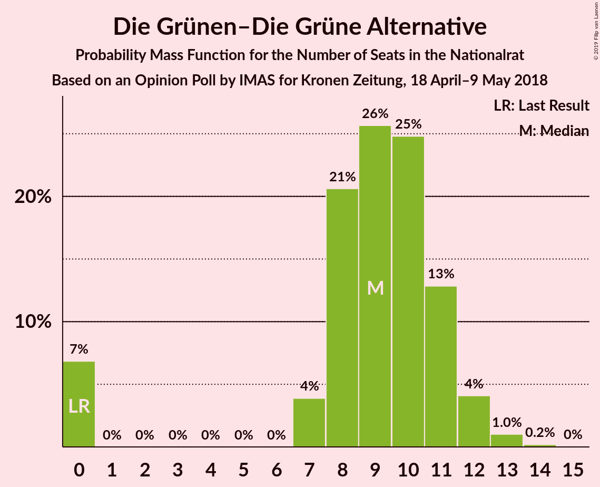
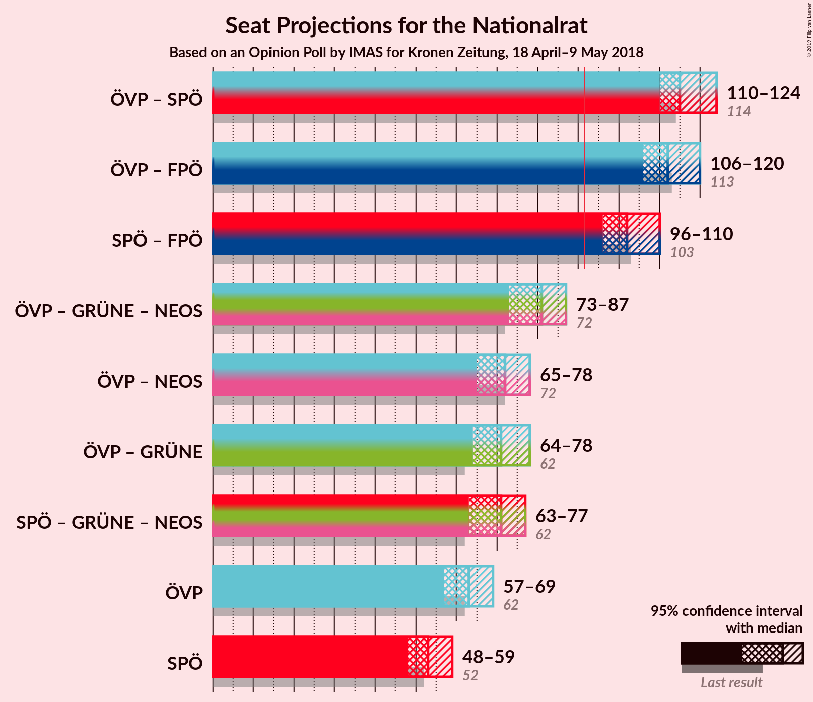
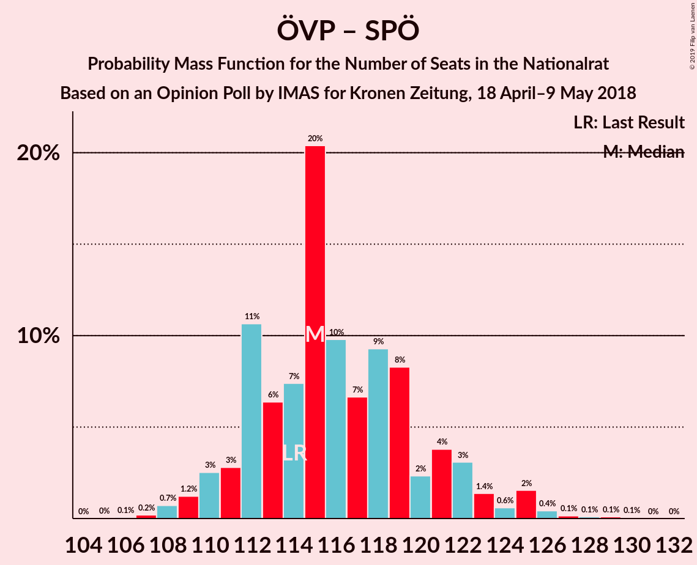
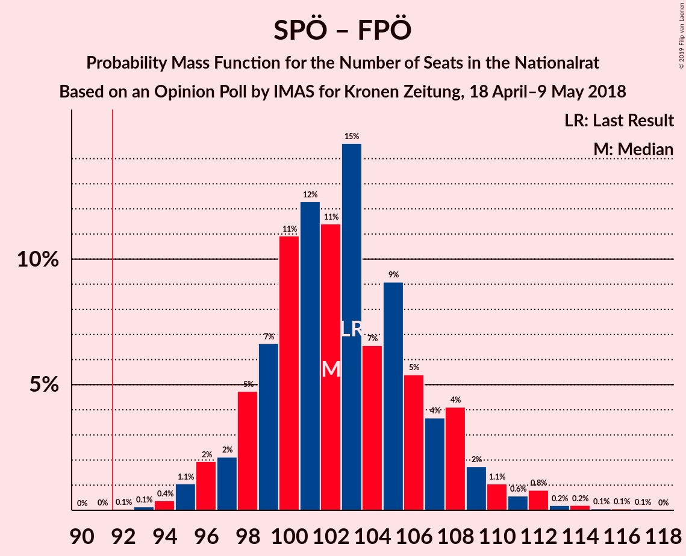
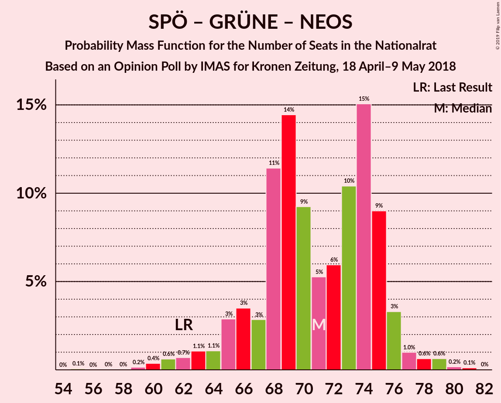

# Opinion Poll by IMAS for Kronen Zeitung, 18 April–9 May 2018

<a href="#voting-intentions">Voting Intentions</a> | <a href="#seats">Seats</a> | <a href="#coalitions">Coalitions</a> | <a href="#technical-information">Technical Information</a>

## Voting Intentions

### Confidence Intervals

| Party | Last Result | Poll Result | 80% Confidence Interval | 90% Confidence Interval | 95% Confidence Interval | 99% Confidence Interval |
|:-----:|:-----------:|:-----------:|:-----------------------:|:-----------------------:|:-----------------------:|:-----------------------:|
| Österreichische Volkspartei | 31.5% | 32.7% | 30.8–34.6% |30.3–35.2% |29.8–35.6% |29.0–36.6% |
| Sozialdemokratische Partei Österreichs | 26.9% | 27.7% | 25.9–29.6% |25.5–30.1% |25.0–30.6% |24.2–31.5% |
| Freiheitliche Partei Österreichs | 26.0% | 25.7% | 24.0–27.6% |23.5–28.1% |23.1–28.5% |22.3–29.4% |
| NEOS–Das Neue Österreich und Liberales Forum | 5.3% | 5.0% | 4.2–6.0% |4.0–6.2% |3.8–6.5% |3.4–7.0% |
| Die Grünen–Die Grüne Alternative | 3.8% | 5.0% | 4.2–6.0% |4.0–6.2% |3.8–6.5% |3.4–7.0% |
| JETZT–Liste Pilz | 4.4% | 2.0% | 1.5–2.7% |1.4–2.9% |1.3–3.0% |1.1–3.4% |

*Note:* The poll result column reflects the actual value used in the calculations. Published results may vary slightly, and in addition be rounded to fewer digits.

## Seats

### Confidence Intervals

| Party | Last Result | Median | 80% Confidence Interval | 90% Confidence Interval | 95% Confidence Interval | 99% Confidence Interval |
|:-----:|:-----------:|:------:|:-----------------------:|:-----------------------:|:-----------------------:|:-----------------------:|
| <a href="#österreichische-volkspartei">Österreichische Volkspartei</a> | 62 | 65 | N/A |N/A |N/A |N/A |
| <a href="#sozialdemokratische-partei-österreichs">Sozialdemokratische Partei Österreichs</a> | 52 | 55 | N/A |N/A |N/A |N/A |
| <a href="#freiheitliche-partei-österreichs">Freiheitliche Partei Österreichs</a> | 51 | 48 | N/A |N/A |N/A |N/A |
| <a href="#neos–das-neue-österreich-und-liberales-forum">NEOS–Das Neue Österreich und Liberales Forum</a> | 10 | 8 | N/A |N/A |N/A |N/A |
| <a href="#die-grünen–die-grüne-alternative">Die Grünen–Die Grüne Alternative</a> | 0 | 7 | N/A |N/A |N/A |N/A |
| <a href="#jetzt–liste-pilz">JETZT–Liste Pilz</a> | 8 | 0 | N/A |N/A |N/A |N/A |

### Österreichische Volkspartei

*For a full overview of the results for this party, see the [Österreichische Volkspartei](party-österreichischevolkspartei.html) page.*

| Number of Seats | Probability | Accumulated | Special Marks |
|:---------------:|:-----------:|:-----------:|:-------------:|
| 56 | 7% | 100% |  |
| 57 | 0% | 93% |  |
| 58 | 0.2% | 93% |  |
| 59 | 0% | 92% |  |
| 60 | 5% | 92% |  |
| 61 | 27% | 88% |  |
| 62 | 0% | 61% | Last Result |
| 63 | 1.2% | 61% |  |
| 64 | 0.4% | 59% |  |
| 65 | 53% | 59% | Median |
| 66 | 0.9% | 6% |  |
| 67 | 0% | 5% |  |
| 68 | 4% | 5% |  |
| 69 | 0.1% | 1.1% |  |
| 70 | 0% | 0.9% |  |
| 71 | 0% | 0.9% |  |
| 72 | 0% | 0.9% |  |
| 73 | 0.9% | 0.9% |  |
| 74 | 0% | 0% |  |

### Sozialdemokratische Partei Österreichs

*For a full overview of the results for this party, see the [Sozialdemokratische Partei Österreichs](party-sozialdemokratischeparteiösterreichs.html) page.*

| Number of Seats | Probability | Accumulated | Special Marks |
|:---------------:|:-----------:|:-----------:|:-------------:|
| 44 | 0.1% | 100% |  |
| 45 | 0% | 99.9% |  |
| 46 | 0% | 99.9% |  |
| 47 | 4% | 99.9% |  |
| 48 | 0% | 96% |  |
| 49 | 0.8% | 96% |  |
| 50 | 0% | 95% |  |
| 51 | 0.1% | 95% |  |
| 52 | 0.5% | 95% | Last Result |
| 53 | 0% | 94% |  |
| 54 | 0% | 94% |  |
| 55 | 53% | 94% | Median |
| 56 | 33% | 41% |  |
| 57 | 7% | 9% |  |
| 58 | 0% | 2% |  |
| 59 | 0% | 2% |  |
| 60 | 1.5% | 2% |  |
| 61 | 0.3% | 0.5% |  |
| 62 | 0% | 0.2% |  |
| 63 | 0% | 0.1% |  |
| 64 | 0.1% | 0.1% |  |
| 65 | 0% | 0% |  |

### Freiheitliche Partei Österreichs

*For a full overview of the results for this party, see the [Freiheitliche Partei Österreichs](party-freiheitlicheparteiösterreichs.html) page.*

| Number of Seats | Probability | Accumulated | Special Marks |
|:---------------:|:-----------:|:-----------:|:-------------:|
| 42 | 0.3% | 100% |  |
| 43 | 0% | 99.7% |  |
| 44 | 0.1% | 99.7% |  |
| 45 | 0.8% | 99.5% |  |
| 46 | 28% | 98.7% |  |
| 47 | 5% | 71% |  |
| 48 | 53% | 66% | Median |
| 49 | 0.1% | 13% |  |
| 50 | 5% | 13% |  |
| 51 | 6% | 8% | Last Result |
| 52 | 0% | 2% |  |
| 53 | 0% | 2% |  |
| 54 | 0.4% | 2% |  |
| 55 | 0.5% | 1.3% |  |
| 56 | 0% | 0.8% |  |
| 57 | 0.8% | 0.8% |  |
| 58 | 0% | 0% |  |

### NEOS–Das Neue Österreich und Liberales Forum

*For a full overview of the results for this party, see the [NEOS–Das Neue Österreich und Liberales Forum](party-neos–dasneueösterreichundliberalesforum.html) page.*

| Number of Seats | Probability | Accumulated | Special Marks |
|:---------------:|:-----------:|:-----------:|:-------------:|
| 0 | 1.2% | 100% |  |
| 1 | 0% | 98.8% |  |
| 2 | 0% | 98.8% |  |
| 3 | 0% | 98.8% |  |
| 4 | 0% | 98.8% |  |
| 5 | 0% | 98.8% |  |
| 6 | 0% | 98.8% |  |
| 7 | 1.5% | 98.8% |  |
| 8 | 53% | 97% | Median |
| 9 | 0.6% | 44% |  |
| 10 | 4% | 44% | Last Result |
| 11 | 39% | 39% |  |
| 12 | 0.3% | 0.3% |  |
| 13 | 0% | 0.1% |  |
| 14 | 0% | 0.1% |  |
| 15 | 0% | 0% |  |

### Die Grünen–Die Grüne Alternative

*For a full overview of the results for this party, see the [Die Grünen–Die Grüne Alternative](party-diegrünen–diegrünealternative.html) page.*

| Number of Seats | Probability | Accumulated | Special Marks |
|:---------------:|:-----------:|:-----------:|:-------------:|
| 0 | 2% | 100% | Last Result |
| 1 | 0% | 98% |  |
| 2 | 0% | 98% |  |
| 3 | 0% | 98% |  |
| 4 | 0% | 98% |  |
| 5 | 0% | 98% |  |
| 6 | 0% | 98% |  |
| 7 | 53% | 98% | Median |
| 8 | 10% | 45% |  |
| 9 | 33% | 35% |  |
| 10 | 2% | 3% |  |
| 11 | 0.7% | 1.3% |  |
| 12 | 0.6% | 0.6% |  |
| 13 | 0% | 0% |  |

### JETZT–Liste Pilz

*For a full overview of the results for this party, see the [JETZT–Liste Pilz](party-jetzt–listepilz.html) page.*

| Number of Seats | Probability | Accumulated | Special Marks |
|:---------------:|:-----------:|:-----------:|:-------------:|
| 0 | 100% | 100% | Median |
| 1 | 0% | 0% |  |
| 2 | 0% | 0% |  |
| 3 | 0% | 0% |  |
| 4 | 0% | 0% |  |
| 5 | 0% | 0% |  |
| 6 | 0% | 0% |  |
| 7 | 0% | 0% |  |
| 8 | 0% | 0% | Last Result |

## Coalitions

### Confidence Intervals

| Coalition | Last Result | Median | Majority? | 80% Confidence Interval | 90% Confidence Interval | 95% Confidence Interval | 99% Confidence Interval |
|:---------:|:-----------:|:------:|:---------:|:-----------------------:|:-----------------------:|:-----------------------:|:-----------------------:|
| Österreichische Volkspartei – Sozialdemokratische Partei Österreichs | 114 | 120 | 100% | 115–120 | 113–120 | 113–120 | 110–129 |
| Österreichische Volkspartei – Freiheitliche Partei Österreichs | 113 | 113 | 100% | 107–113 | 107–118 | 107–118 | 106–123 |
| Sozialdemokratische Partei Österreichs – Freiheitliche Partei Österreichs | 103 | 103 | 100% | 102–103 | 101–108 | 97–108 | 97–110 |
| Österreichische Volkspartei – Die Grünen–Die Grüne Alternative – NEOS–Das Neue Österreich und Liberales Forum | 72 | 80 | 0% | 80–81 | 75–82 | 75–86 | 73–86 |
| Österreichische Volkspartei – NEOS–Das Neue Österreich und Liberales Forum | 72 | 73 | 0% | 71–73 | 67–76 | 67–78 | 63–78 |
| Sozialdemokratische Partei Österreichs – Die Grünen–Die Grüne Alternative – NEOS–Das Neue Österreich und Liberales Forum | 62 | 70 | 0% | 70–76 | 65–76 | 65–76 | 60–77 |
| Österreichische Volkspartei – Die Grünen–Die Grüne Alternative | 62 | 72 | 0% | 69–72 | 64–75 | 64–76 | 64–82 |
| Österreichische Volkspartei | 62 | 65 | 0% | 60–65 | 56–68 | 56–68 | 56–73 |
| Sozialdemokratische Partei Österreichs | 52 | 55 | 0% | 55–56 | 49–57 | 47–57 | 47–61 |

### Österreichische Volkspartei – Sozialdemokratische Partei Österreichs

| Number of Seats | Probability | Accumulated | Special Marks |
|:---------------:|:-----------:|:-----------:|:-------------:|
| 107 | 0% | 100% |  |
| 108 | 0% | 99.9% |  |
| 109 | 0% | 99.9% |  |
| 110 | 0.7% | 99.9% |  |
| 111 | 0% | 99.3% |  |
| 112 | 0% | 99.3% |  |
| 113 | 6% | 99.3% |  |
| 114 | 0% | 93% | Last Result |
| 115 | 4% | 93% |  |
| 116 | 6% | 89% |  |
| 117 | 27% | 83% |  |
| 118 | 0% | 55% |  |
| 119 | 0% | 55% |  |
| 120 | 53% | 55% | Median |
| 121 | 0% | 2% |  |
| 122 | 0.1% | 2% |  |
| 123 | 0% | 2% |  |
| 124 | 0.3% | 2% |  |
| 125 | 0.5% | 1.3% |  |
| 126 | 0% | 0.9% |  |
| 127 | 0% | 0.8% |  |
| 128 | 0% | 0.8% |  |
| 129 | 0.8% | 0.8% |  |
| 130 | 0% | 0% |  |

### Österreichische Volkspartei – Freiheitliche Partei Österreichs

| Number of Seats | Probability | Accumulated | Special Marks |
|:---------------:|:-----------:|:-----------:|:-------------:|
| 102 | 0.1% | 100% |  |
| 103 | 0% | 99.9% |  |
| 104 | 0% | 99.9% |  |
| 105 | 0% | 99.9% |  |
| 106 | 1.5% | 99.9% |  |
| 107 | 38% | 98% |  |
| 108 | 0% | 61% |  |
| 109 | 0% | 61% |  |
| 110 | 0.8% | 61% |  |
| 111 | 0.1% | 60% |  |
| 112 | 0.1% | 60% |  |
| 113 | 53% | 59% | Last Result, Median |
| 114 | 0% | 7% |  |
| 115 | 0.1% | 7% |  |
| 116 | 0% | 7% |  |
| 117 | 0.3% | 7% |  |
| 118 | 5% | 6% |  |
| 119 | 0.1% | 0.9% |  |
| 120 | 0% | 0.8% |  |
| 121 | 0% | 0.8% |  |
| 122 | 0% | 0.8% |  |
| 123 | 0.8% | 0.8% |  |
| 124 | 0% | 0% |  |

### Sozialdemokratische Partei Österreichs – Freiheitliche Partei Österreichs

| Number of Seats | Probability | Accumulated | Special Marks |
|:---------------:|:-----------:|:-----------:|:-------------:|
| 93 | 0.2% | 100% |  |
| 94 | 0% | 99.7% |  |
| 95 | 0% | 99.7% |  |
| 96 | 0% | 99.7% |  |
| 97 | 4% | 99.7% |  |
| 98 | 0.5% | 96% |  |
| 99 | 0% | 95% |  |
| 100 | 0% | 95% |  |
| 101 | 0.8% | 95% |  |
| 102 | 28% | 95% |  |
| 103 | 57% | 67% | Last Result, Median |
| 104 | 0.1% | 9% |  |
| 105 | 0% | 9% |  |
| 106 | 0.8% | 9% |  |
| 107 | 0.4% | 9% |  |
| 108 | 6% | 8% |  |
| 109 | 0% | 2% |  |
| 110 | 1.5% | 2% |  |
| 111 | 0.3% | 0.4% |  |
| 112 | 0% | 0.1% |  |
| 113 | 0% | 0.1% |  |
| 114 | 0% | 0% |  |

### Österreichische Volkspartei – Die Grünen–Die Grüne Alternative – NEOS–Das Neue Österreich und Liberales Forum

| Number of Seats | Probability | Accumulated | Special Marks |
|:---------------:|:-----------:|:-----------:|:-------------:|
| 70 | 0% | 100% |  |
| 71 | 0% | 99.9% |  |
| 72 | 0.3% | 99.9% | Last Result |
| 73 | 1.5% | 99.6% |  |
| 74 | 0% | 98% |  |
| 75 | 6% | 98% |  |
| 76 | 0.4% | 92% |  |
| 77 | 0.8% | 91% |  |
| 78 | 0% | 91% |  |
| 79 | 0.1% | 91% |  |
| 80 | 57% | 91% | Median |
| 81 | 28% | 33% |  |
| 82 | 0.8% | 5% |  |
| 83 | 0% | 5% |  |
| 84 | 0% | 5% |  |
| 85 | 0.5% | 5% |  |
| 86 | 4% | 4% |  |
| 87 | 0% | 0.3% |  |
| 88 | 0% | 0.3% |  |
| 89 | 0% | 0.3% |  |
| 90 | 0.2% | 0.3% |  |
| 91 | 0% | 0% |  |

### Österreichische Volkspartei – NEOS–Das Neue Österreich und Liberales Forum

| Number of Seats | Probability | Accumulated | Special Marks |
|:---------------:|:-----------:|:-----------:|:-------------:|
| 63 | 2% | 100% |  |
| 64 | 0% | 98% |  |
| 65 | 0% | 98% |  |
| 66 | 0% | 98% |  |
| 67 | 6% | 98% |  |
| 68 | 0% | 92% |  |
| 69 | 0% | 92% |  |
| 70 | 0% | 92% |  |
| 71 | 5% | 92% |  |
| 72 | 28% | 88% | Last Result |
| 73 | 54% | 60% | Median |
| 74 | 1.0% | 6% |  |
| 75 | 0.2% | 5% |  |
| 76 | 0.4% | 5% |  |
| 77 | 0.8% | 5% |  |
| 78 | 4% | 4% |  |
| 79 | 0.1% | 0.2% |  |
| 80 | 0% | 0.1% |  |
| 81 | 0% | 0.1% |  |
| 82 | 0% | 0.1% |  |
| 83 | 0% | 0.1% |  |
| 84 | 0% | 0.1% |  |
| 85 | 0.1% | 0.1% |  |
| 86 | 0% | 0% |  |

### Sozialdemokratische Partei Österreichs – Die Grünen–Die Grüne Alternative – NEOS–Das Neue Österreich und Liberales Forum

| Number of Seats | Probability | Accumulated | Special Marks |
|:---------------:|:-----------:|:-----------:|:-------------:|
| 60 | 0.8% | 100% |  |
| 61 | 0% | 99.2% |  |
| 62 | 0% | 99.2% | Last Result |
| 63 | 0% | 99.2% |  |
| 64 | 0.1% | 99.2% |  |
| 65 | 5% | 99.1% |  |
| 66 | 0.3% | 94% |  |
| 67 | 0% | 93% |  |
| 68 | 0.1% | 93% |  |
| 69 | 0% | 93% |  |
| 70 | 53% | 93% | Median |
| 71 | 0.1% | 41% |  |
| 72 | 0.1% | 40% |  |
| 73 | 0.8% | 40% |  |
| 74 | 0% | 39% |  |
| 75 | 0% | 39% |  |
| 76 | 38% | 39% |  |
| 77 | 1.5% | 2% |  |
| 78 | 0% | 0.1% |  |
| 79 | 0% | 0.1% |  |
| 80 | 0% | 0.1% |  |
| 81 | 0.1% | 0.1% |  |
| 82 | 0% | 0% |  |

### Österreichische Volkspartei – Die Grünen–Die Grüne Alternative

| Number of Seats | Probability | Accumulated | Special Marks |
|:---------------:|:-----------:|:-----------:|:-------------:|
| 62 | 0% | 100% | Last Result |
| 63 | 0.3% | 100% |  |
| 64 | 6% | 99.6% |  |
| 65 | 0% | 94% |  |
| 66 | 2% | 94% |  |
| 67 | 0.1% | 91% |  |
| 68 | 0.4% | 91% |  |
| 69 | 5% | 91% |  |
| 70 | 28% | 86% |  |
| 71 | 0% | 59% |  |
| 72 | 53% | 59% | Median |
| 73 | 0.1% | 6% |  |
| 74 | 0% | 6% |  |
| 75 | 0.8% | 6% |  |
| 76 | 4% | 5% |  |
| 77 | 0% | 1.1% |  |
| 78 | 0.1% | 1.1% |  |
| 79 | 0% | 1.0% |  |
| 80 | 0% | 1.0% |  |
| 81 | 0.1% | 1.0% |  |
| 82 | 0.8% | 0.8% |  |
| 83 | 0% | 0% |  |

### Österreichische Volkspartei

| Number of Seats | Probability | Accumulated | Special Marks |
|:---------------:|:-----------:|:-----------:|:-------------:|
| 56 | 7% | 100% |  |
| 57 | 0% | 93% |  |
| 58 | 0.2% | 93% |  |
| 59 | 0% | 92% |  |
| 60 | 5% | 92% |  |
| 61 | 27% | 88% |  |
| 62 | 0% | 61% | Last Result |
| 63 | 1.2% | 61% |  |
| 64 | 0.4% | 59% |  |
| 65 | 53% | 59% | Median |
| 66 | 0.9% | 6% |  |
| 67 | 0% | 5% |  |
| 68 | 4% | 5% |  |
| 69 | 0.1% | 1.1% |  |
| 70 | 0% | 0.9% |  |
| 71 | 0% | 0.9% |  |
| 72 | 0% | 0.9% |  |
| 73 | 0.9% | 0.9% |  |
| 74 | 0% | 0% |  |

### Sozialdemokratische Partei Österreichs

| Number of Seats | Probability | Accumulated | Special Marks |
|:---------------:|:-----------:|:-----------:|:-------------:|
| 44 | 0.1% | 100% |  |
| 45 | 0% | 99.9% |  |
| 46 | 0% | 99.9% |  |
| 47 | 4% | 99.9% |  |
| 48 | 0% | 96% |  |
| 49 | 0.8% | 96% |  |
| 50 | 0% | 95% |  |
| 51 | 0.1% | 95% |  |
| 52 | 0.5% | 95% | Last Result |
| 53 | 0% | 94% |  |
| 54 | 0% | 94% |  |
| 55 | 53% | 94% | Median |
| 56 | 33% | 41% |  |
| 57 | 7% | 9% |  |
| 58 | 0% | 2% |  |
| 59 | 0% | 2% |  |
| 60 | 1.5% | 2% |  |
| 61 | 0.3% | 0.5% |  |
| 62 | 0% | 0.2% |  |
| 63 | 0% | 0.1% |  |
| 64 | 0.1% | 0.1% |  |
| 65 | 0% | 0% |  |

## Technical Information

### Opinion Poll

+ **Polling firm:** IMAS
+ **Commissioner(s):** Kronen Zeitung
+ **Fieldwork period:** 18 April–9 May 2018

### Calculations

+ **Sample size:** 1007
+ **Simulations done:** 1,024
+ **Error estimate:** 1.86%

