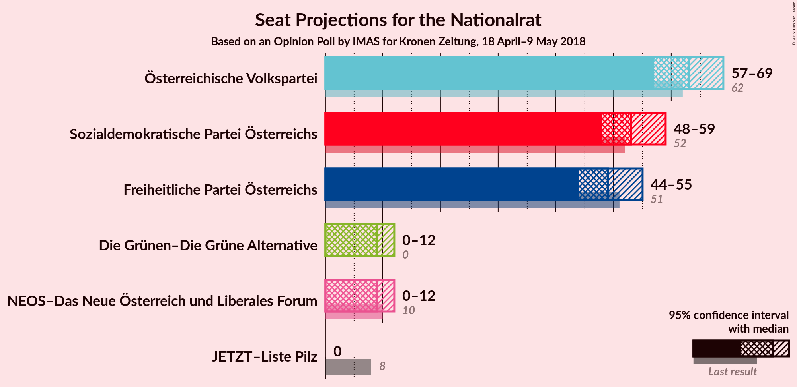
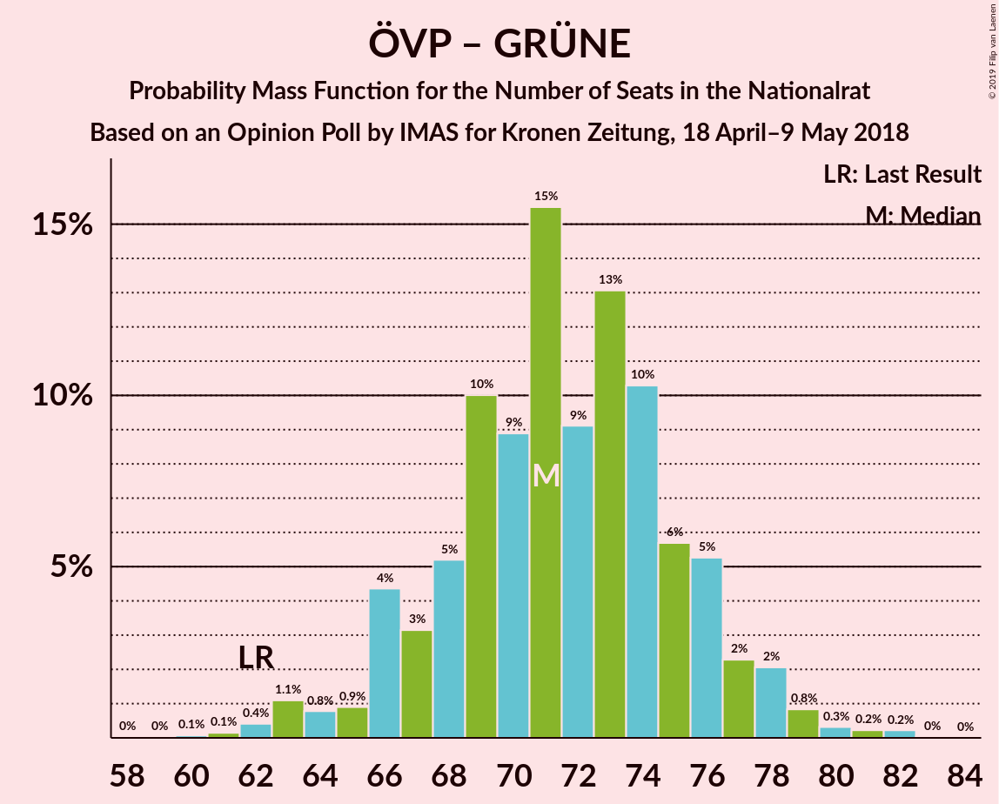

# Opinion Poll by IMAS for Kronen Zeitung, 18 April–9 May 2018

<a href="#voting-intentions">Voting Intentions</a> | <a href="#seats">Seats</a> | <a href="#coalitions">Coalitions</a> | <a href="#technical-information">Technical Information</a>

## Voting Intentions

### Confidence Intervals

| Party | Last Result | Poll Result | 80% Confidence Interval | 90% Confidence Interval | 95% Confidence Interval | 99% Confidence Interval |
|:-----:|:-----------:|:-----------:|:-----------------------:|:-----------------------:|:-----------------------:|:-----------------------:|
| Österreichische Volkspartei | 31.5% | 32.7% | 30.8–34.6% |30.3–35.2% |29.8–35.6% |29.0–36.6% |
| Sozialdemokratische Partei Österreichs | 26.9% | 27.7% | 25.9–29.6% |25.5–30.1% |25.0–30.6% |24.2–31.5% |
| Freiheitliche Partei Österreichs | 26.0% | 25.7% | 24.0–27.6% |23.5–28.1% |23.1–28.5% |22.3–29.4% |
| NEOS–Das Neue Österreich und Liberales Forum | 5.3% | 5.0% | 4.2–6.0% |4.0–6.2% |3.8–6.5% |3.4–7.0% |
| Die Grünen–Die Grüne Alternative | 3.8% | 5.0% | 4.2–6.0% |4.0–6.2% |3.8–6.5% |3.4–7.0% |
| JETZT–Liste Pilz | 4.4% | 2.0% | 1.5–2.7% |1.4–2.9% |1.3–3.0% |1.1–3.4% |

*Note:* The poll result column reflects the actual value used in the calculations. Published results may vary slightly, and in addition be rounded to fewer digits.

## Seats

### Confidence Intervals

| Party | Last Result | Median | 80% Confidence Interval | 90% Confidence Interval | 95% Confidence Interval | 99% Confidence Interval |
|:-----:|:-----------:|:------:|:-----------------------:|:-----------------------:|:-----------------------:|:-----------------------:|
| <a href="#österreichische-volkspartei">Österreichische Volkspartei</a> | 62 | 63 | 59–67 |58–68 |57–69 |55–71 |
| <a href="#sozialdemokratische-partei-österreichs">Sozialdemokratische Partei Österreichs</a> | 52 | 53 | 50–57 |48–58 |48–59 |46–61 |
| <a href="#freiheitliche-partei-österreichs">Freiheitliche Partei Österreichs</a> | 51 | 49 | 46–53 |45–54 |44–55 |42–57 |
| <a href="#neos–das-neue-österreich-und-liberales-forum">NEOS–Das Neue Österreich und Liberales Forum</a> | 10 | 9 | 8–11 |0–12 |0–12 |0–13 |
| <a href="#die-grünen–die-grüne-alternative">Die Grünen–Die Grüne Alternative</a> | 0 | 9 | 7–11 |0–12 |0–12 |0–13 |
| <a href="#jetzt–liste-pilz">JETZT–Liste Pilz</a> | 8 | 0 | 0 |0 |0 |0 |

### Österreichische Volkspartei

*For a full overview of the results for this party, see the [Österreichische Volkspartei](party-österreichischevolkspartei.html) page.*

| Number of Seats | Probability | Accumulated | Special Marks |
|:---------------:|:-----------:|:-----------:|:-------------:|
| 53 | 0% | 100% |  |
| 54 | 0.1% | 99.9% |  |
| 55 | 0.4% | 99.8% |  |
| 56 | 0.9% | 99.5% |  |
| 57 | 2% | 98.5% |  |
| 58 | 3% | 96% |  |
| 59 | 8% | 93% |  |
| 60 | 7% | 85% |  |
| 61 | 13% | 78% |  |
| 62 | 14% | 65% | Last Result |
| 63 | 10% | 50% | Median |
| 64 | 12% | 40% |  |
| 65 | 9% | 27% |  |
| 66 | 8% | 18% |  |
| 67 | 5% | 11% |  |
| 68 | 3% | 6% |  |
| 69 | 2% | 3% |  |
| 70 | 0.7% | 2% |  |
| 71 | 0.6% | 0.9% |  |
| 72 | 0.1% | 0.3% |  |
| 73 | 0.1% | 0.2% |  |
| 74 | 0.1% | 0.1% |  |
| 75 | 0% | 0% |  |

### Sozialdemokratische Partei Österreichs

*For a full overview of the results for this party, see the [Sozialdemokratische Partei Österreichs](party-sozialdemokratischeparteiösterreichs.html) page.*

| Number of Seats | Probability | Accumulated | Special Marks |
|:---------------:|:-----------:|:-----------:|:-------------:|
| 44 | 0% | 100% |  |
| 45 | 0.2% | 99.9% |  |
| 46 | 0.4% | 99.8% |  |
| 47 | 1.0% | 99.4% |  |
| 48 | 4% | 98% |  |
| 49 | 4% | 95% |  |
| 50 | 11% | 91% |  |
| 51 | 10% | 80% |  |
| 52 | 11% | 70% | Last Result |
| 53 | 15% | 59% | Median |
| 54 | 10% | 44% |  |
| 55 | 12% | 34% |  |
| 56 | 10% | 22% |  |
| 57 | 5% | 12% |  |
| 58 | 4% | 7% |  |
| 59 | 1.4% | 3% |  |
| 60 | 0.7% | 2% |  |
| 61 | 0.5% | 0.8% |  |
| 62 | 0.2% | 0.3% |  |
| 63 | 0.1% | 0.2% |  |
| 64 | 0% | 0% |  |

### Freiheitliche Partei Österreichs

*For a full overview of the results for this party, see the [Freiheitliche Partei Österreichs](party-freiheitlicheparteiösterreichs.html) page.*

| Number of Seats | Probability | Accumulated | Special Marks |
|:---------------:|:-----------:|:-----------:|:-------------:|
| 41 | 0.1% | 100% |  |
| 42 | 0.4% | 99.9% |  |
| 43 | 0.9% | 99.4% |  |
| 44 | 2% | 98.5% |  |
| 45 | 5% | 97% |  |
| 46 | 6% | 91% |  |
| 47 | 9% | 85% |  |
| 48 | 17% | 76% |  |
| 49 | 12% | 59% | Median |
| 50 | 11% | 46% |  |
| 51 | 14% | 35% | Last Result |
| 52 | 8% | 22% |  |
| 53 | 7% | 14% |  |
| 54 | 4% | 7% |  |
| 55 | 2% | 4% |  |
| 56 | 1.0% | 2% |  |
| 57 | 0.4% | 0.7% |  |
| 58 | 0.2% | 0.3% |  |
| 59 | 0.1% | 0.1% |  |
| 60 | 0% | 0% |  |

### NEOS–Das Neue Österreich und Liberales Forum

*For a full overview of the results for this party, see the [NEOS–Das Neue Österreich und Liberales Forum](party-neos–dasneueösterreichundliberalesforum.html) page.*

| Number of Seats | Probability | Accumulated | Special Marks |
|:---------------:|:-----------:|:-----------:|:-------------:|
| 0 | 5% | 100% |  |
| 1 | 0% | 95% |  |
| 2 | 0% | 95% |  |
| 3 | 0% | 95% |  |
| 4 | 0% | 95% |  |
| 5 | 0% | 95% |  |
| 6 | 0% | 95% |  |
| 7 | 3% | 95% |  |
| 8 | 19% | 92% |  |
| 9 | 31% | 73% | Median |
| 10 | 24% | 42% | Last Result |
| 11 | 12% | 18% |  |
| 12 | 4% | 5% |  |
| 13 | 0.9% | 1.1% |  |
| 14 | 0.2% | 0.2% |  |
| 15 | 0% | 0% |  |

### Die Grünen–Die Grüne Alternative

*For a full overview of the results for this party, see the [Die Grünen–Die Grüne Alternative](party-diegrünen–diegrünealternative.html) page.*

| Number of Seats | Probability | Accumulated | Special Marks |
|:---------------:|:-----------:|:-----------:|:-------------:|
| 0 | 7% | 100% | Last Result |
| 1 | 0% | 93% |  |
| 2 | 0% | 93% |  |
| 3 | 0% | 93% |  |
| 4 | 0% | 93% |  |
| 5 | 0% | 93% |  |
| 6 | 0% | 93% |  |
| 7 | 4% | 93% |  |
| 8 | 21% | 89% |  |
| 9 | 26% | 69% | Median |
| 10 | 25% | 43% |  |
| 11 | 13% | 18% |  |
| 12 | 4% | 5% |  |
| 13 | 1.0% | 1.2% |  |
| 14 | 0.2% | 0.2% |  |
| 15 | 0% | 0% |  |

### JETZT–Liste Pilz

*For a full overview of the results for this party, see the [JETZT–Liste Pilz](party-jetzt–listepilz.html) page.*

| Number of Seats | Probability | Accumulated | Special Marks |
|:---------------:|:-----------:|:-----------:|:-------------:|
| 0 | 100% | 100% | Median |
| 1 | 0% | 0% |  |
| 2 | 0% | 0% |  |
| 3 | 0% | 0% |  |
| 4 | 0% | 0% |  |
| 5 | 0% | 0% |  |
| 6 | 0% | 0% |  |
| 7 | 0% | 0% |  |
| 8 | 0% | 0% | Last Result |

## Coalitions

### Confidence Intervals

| Coalition | Last Result | Median | Majority? | 80% Confidence Interval | 90% Confidence Interval | 95% Confidence Interval | 99% Confidence Interval |
|:---------:|:-----------:|:------:|:---------:|:-----------------------:|:-----------------------:|:-----------------------:|:-----------------------:|
| Österreichische Volkspartei – Sozialdemokratische Partei Österreichs | 114 | 115 | 100% | 112–121 | 111–122 | 110–124 | 108–126 |
| Österreichische Volkspartei – Freiheitliche Partei Österreichs | 113 | 112 | 100% | 108–117 | 107–118 | 106–120 | 104–123 |
| Sozialdemokratische Partei Österreichs – Freiheitliche Partei Österreichs | 103 | 102 | 100% | 98–107 | 97–108 | 96–110 | 94–113 |
| Österreichische Volkspartei – Die Grünen–Die Grüne Alternative – NEOS–Das Neue Österreich und Liberales Forum | 72 | 81 | 0% | 76–85 | 75–86 | 73–87 | 70–89 |
| Österreichische Volkspartei – NEOS–Das Neue Österreich und Liberales Forum | 72 | 72 | 0% | 68–76 | 66–77 | 65–78 | 61–80 |
| Österreichische Volkspartei – Die Grünen–Die Grüne Alternative | 62 | 71 | 0% | 67–76 | 66–77 | 64–78 | 62–81 |
| Sozialdemokratische Partei Österreichs – Die Grünen–Die Grüne Alternative – NEOS–Das Neue Österreich und Liberales Forum | 62 | 71 | 0% | 66–75 | 65–76 | 63–77 | 60–79 |
| Österreichische Volkspartei | 62 | 63 | 0% | 59–67 | 58–68 | 57–69 | 55–71 |
| Sozialdemokratische Partei Österreichs | 52 | 53 | 0% | 50–57 | 48–58 | 48–59 | 46–61 |

### Österreichische Volkspartei – Sozialdemokratische Partei Österreichs

| Number of Seats | Probability | Accumulated | Special Marks |
|:---------------:|:-----------:|:-----------:|:-------------:|
| 106 | 0.1% | 100% |  |
| 107 | 0.2% | 99.9% |  |
| 108 | 0.7% | 99.7% |  |
| 109 | 1.2% | 99.0% |  |
| 110 | 3% | 98% |  |
| 111 | 3% | 95% |  |
| 112 | 11% | 92% |  |
| 113 | 6% | 82% |  |
| 114 | 7% | 75% | Last Result |
| 115 | 20% | 68% |  |
| 116 | 10% | 48% | Median |
| 117 | 7% | 38% |  |
| 118 | 9% | 31% |  |
| 119 | 8% | 22% |  |
| 120 | 2% | 14% |  |
| 121 | 4% | 11% |  |
| 122 | 3% | 7% |  |
| 123 | 1.4% | 4% |  |
| 124 | 0.6% | 3% |  |
| 125 | 2% | 2% |  |
| 126 | 0.4% | 0.9% |  |
| 127 | 0.1% | 0.5% |  |
| 128 | 0.1% | 0.3% |  |
| 129 | 0.1% | 0.2% |  |
| 130 | 0.1% | 0.1% |  |
| 131 | 0% | 0% |  |

### Österreichische Volkspartei – Freiheitliche Partei Österreichs

| Number of Seats | Probability | Accumulated | Special Marks |
|:---------------:|:-----------:|:-----------:|:-------------:|
| 102 | 0.1% | 100% |  |
| 103 | 0.2% | 99.9% |  |
| 104 | 0.6% | 99.7% |  |
| 105 | 0.6% | 99.0% |  |
| 106 | 1.0% | 98% |  |
| 107 | 3% | 97% |  |
| 108 | 9% | 94% |  |
| 109 | 15% | 85% |  |
| 110 | 10% | 70% |  |
| 111 | 6% | 60% |  |
| 112 | 5% | 54% | Median |
| 113 | 9% | 48% | Last Result |
| 114 | 14% | 39% |  |
| 115 | 11% | 25% |  |
| 116 | 3% | 13% |  |
| 117 | 3% | 10% |  |
| 118 | 3% | 7% |  |
| 119 | 1.1% | 4% |  |
| 120 | 1.1% | 3% |  |
| 121 | 0.7% | 2% |  |
| 122 | 0.6% | 1.3% |  |
| 123 | 0.4% | 0.6% |  |
| 124 | 0.2% | 0.3% |  |
| 125 | 0% | 0.1% |  |
| 126 | 0% | 0.1% |  |
| 127 | 0% | 0.1% |  |
| 128 | 0.1% | 0.1% |  |
| 129 | 0% | 0% |  |

### Sozialdemokratische Partei Österreichs – Freiheitliche Partei Österreichs

| Number of Seats | Probability | Accumulated | Special Marks |
|:---------------:|:-----------:|:-----------:|:-------------:|
| 92 | 0.1% | 100% | Majority |
| 93 | 0.1% | 99.9% |  |
| 94 | 0.4% | 99.8% |  |
| 95 | 1.1% | 99.4% |  |
| 96 | 2% | 98% |  |
| 97 | 2% | 96% |  |
| 98 | 5% | 94% |  |
| 99 | 7% | 90% |  |
| 100 | 11% | 83% |  |
| 101 | 12% | 72% |  |
| 102 | 11% | 60% | Median |
| 103 | 15% | 48% | Last Result |
| 104 | 7% | 34% |  |
| 105 | 9% | 27% |  |
| 106 | 5% | 18% |  |
| 107 | 4% | 13% |  |
| 108 | 4% | 9% |  |
| 109 | 2% | 5% |  |
| 110 | 1.1% | 3% |  |
| 111 | 0.6% | 2% |  |
| 112 | 0.8% | 1.4% |  |
| 113 | 0.2% | 0.6% |  |
| 114 | 0.2% | 0.4% |  |
| 115 | 0.1% | 0.2% |  |
| 116 | 0.1% | 0.2% |  |
| 117 | 0.1% | 0.1% |  |
| 118 | 0% | 0% |  |

### Österreichische Volkspartei – Die Grünen–Die Grüne Alternative – NEOS–Das Neue Österreich und Liberales Forum

| Number of Seats | Probability | Accumulated | Special Marks |
|:---------------:|:-----------:|:-----------:|:-------------:|
| 66 | 0.1% | 100% |  |
| 67 | 0.1% | 99.9% |  |
| 68 | 0.1% | 99.8% |  |
| 69 | 0.2% | 99.8% |  |
| 70 | 0.2% | 99.6% |  |
| 71 | 0.8% | 99.4% |  |
| 72 | 0.6% | 98.6% | Last Result |
| 73 | 1.1% | 98% |  |
| 74 | 2% | 97% |  |
| 75 | 4% | 95% |  |
| 76 | 4% | 91% |  |
| 77 | 5% | 87% |  |
| 78 | 9% | 82% |  |
| 79 | 7% | 73% |  |
| 80 | 15% | 66% |  |
| 81 | 11% | 52% | Median |
| 82 | 12% | 40% |  |
| 83 | 11% | 28% |  |
| 84 | 7% | 17% |  |
| 85 | 5% | 10% |  |
| 86 | 2% | 6% |  |
| 87 | 2% | 4% |  |
| 88 | 1.1% | 2% |  |
| 89 | 0.4% | 0.6% |  |
| 90 | 0.1% | 0.2% |  |
| 91 | 0.1% | 0.1% |  |
| 92 | 0% | 0% | Majority |

### Österreichische Volkspartei – NEOS–Das Neue Österreich und Liberales Forum

| Number of Seats | Probability | Accumulated | Special Marks |
|:---------------:|:-----------:|:-----------:|:-------------:|
| 59 | 0% | 100% |  |
| 60 | 0.1% | 99.9% |  |
| 61 | 0.4% | 99.8% |  |
| 62 | 0.2% | 99.3% |  |
| 63 | 0.4% | 99.1% |  |
| 64 | 0.9% | 98.7% |  |
| 65 | 1.3% | 98% |  |
| 66 | 3% | 97% |  |
| 67 | 3% | 94% |  |
| 68 | 6% | 91% |  |
| 69 | 8% | 85% |  |
| 70 | 11% | 77% |  |
| 71 | 15% | 66% |  |
| 72 | 9% | 51% | Last Result, Median |
| 73 | 12% | 41% |  |
| 74 | 10% | 29% |  |
| 75 | 8% | 19% |  |
| 76 | 4% | 11% |  |
| 77 | 4% | 7% |  |
| 78 | 1.1% | 3% |  |
| 79 | 1.2% | 2% |  |
| 80 | 0.5% | 0.9% |  |
| 81 | 0.2% | 0.4% |  |
| 82 | 0.1% | 0.2% |  |
| 83 | 0% | 0.1% |  |
| 84 | 0% | 0% |  |

### Österreichische Volkspartei – Die Grünen–Die Grüne Alternative

| Number of Seats | Probability | Accumulated | Special Marks |
|:---------------:|:-----------:|:-----------:|:-------------:|
| 59 | 0% | 100% |  |
| 60 | 0.1% | 99.9% |  |
| 61 | 0.1% | 99.9% |  |
| 62 | 0.4% | 99.7% | Last Result |
| 63 | 1.1% | 99.3% |  |
| 64 | 0.8% | 98% |  |
| 65 | 0.9% | 97% |  |
| 66 | 4% | 97% |  |
| 67 | 3% | 92% |  |
| 68 | 5% | 89% |  |
| 69 | 10% | 84% |  |
| 70 | 9% | 74% |  |
| 71 | 15% | 65% |  |
| 72 | 9% | 49% | Median |
| 73 | 13% | 40% |  |
| 74 | 10% | 27% |  |
| 75 | 6% | 17% |  |
| 76 | 5% | 11% |  |
| 77 | 2% | 6% |  |
| 78 | 2% | 4% |  |
| 79 | 0.8% | 2% |  |
| 80 | 0.3% | 0.8% |  |
| 81 | 0.2% | 0.5% |  |
| 82 | 0.2% | 0.3% |  |
| 83 | 0% | 0.1% |  |
| 84 | 0% | 0% |  |

### Sozialdemokratische Partei Österreichs – Die Grünen–Die Grüne Alternative – NEOS–Das Neue Österreich und Liberales Forum

| Number of Seats | Probability | Accumulated | Special Marks |
|:---------------:|:-----------:|:-----------:|:-------------:|
| 55 | 0.1% | 100% |  |
| 56 | 0% | 99.9% |  |
| 57 | 0% | 99.9% |  |
| 58 | 0% | 99.9% |  |
| 59 | 0.2% | 99.9% |  |
| 60 | 0.4% | 99.7% |  |
| 61 | 0.6% | 99.4% |  |
| 62 | 0.7% | 98.7% | Last Result |
| 63 | 1.1% | 98% |  |
| 64 | 1.1% | 97% |  |
| 65 | 3% | 96% |  |
| 66 | 3% | 93% |  |
| 67 | 3% | 90% |  |
| 68 | 11% | 87% |  |
| 69 | 14% | 75% |  |
| 70 | 9% | 61% |  |
| 71 | 5% | 52% | Median |
| 72 | 6% | 46% |  |
| 73 | 10% | 40% |  |
| 74 | 15% | 30% |  |
| 75 | 9% | 15% |  |
| 76 | 3% | 6% |  |
| 77 | 1.0% | 3% |  |
| 78 | 0.6% | 2% |  |
| 79 | 0.6% | 1.0% |  |
| 80 | 0.2% | 0.3% |  |
| 81 | 0.1% | 0.1% |  |
| 82 | 0% | 0% |  |

### Österreichische Volkspartei

| Number of Seats | Probability | Accumulated | Special Marks |
|:---------------:|:-----------:|:-----------:|:-------------:|
| 53 | 0% | 100% |  |
| 54 | 0.1% | 99.9% |  |
| 55 | 0.4% | 99.8% |  |
| 56 | 0.9% | 99.5% |  |
| 57 | 2% | 98.5% |  |
| 58 | 3% | 96% |  |
| 59 | 8% | 93% |  |
| 60 | 7% | 85% |  |
| 61 | 13% | 78% |  |
| 62 | 14% | 65% | Last Result |
| 63 | 10% | 50% | Median |
| 64 | 12% | 40% |  |
| 65 | 9% | 27% |  |
| 66 | 8% | 18% |  |
| 67 | 5% | 11% |  |
| 68 | 3% | 6% |  |
| 69 | 2% | 3% |  |
| 70 | 0.7% | 2% |  |
| 71 | 0.6% | 0.9% |  |
| 72 | 0.1% | 0.3% |  |
| 73 | 0.1% | 0.2% |  |
| 74 | 0.1% | 0.1% |  |
| 75 | 0% | 0% |  |

### Sozialdemokratische Partei Österreichs

| Number of Seats | Probability | Accumulated | Special Marks |
|:---------------:|:-----------:|:-----------:|:-------------:|
| 44 | 0% | 100% |  |
| 45 | 0.2% | 99.9% |  |
| 46 | 0.4% | 99.8% |  |
| 47 | 1.0% | 99.4% |  |
| 48 | 4% | 98% |  |
| 49 | 4% | 95% |  |
| 50 | 11% | 91% |  |
| 51 | 10% | 80% |  |
| 52 | 11% | 70% | Last Result |
| 53 | 15% | 59% | Median |
| 54 | 10% | 44% |  |
| 55 | 12% | 34% |  |
| 56 | 10% | 22% |  |
| 57 | 5% | 12% |  |
| 58 | 4% | 7% |  |
| 59 | 1.4% | 3% |  |
| 60 | 0.7% | 2% |  |
| 61 | 0.5% | 0.8% |  |
| 62 | 0.2% | 0.3% |  |
| 63 | 0.1% | 0.2% |  |
| 64 | 0% | 0% |  |

## Technical Information

### Opinion Poll

+ **Polling firm:** IMAS
+ **Commissioner(s):** Kronen Zeitung
+ **Fieldwork period:** 18 April–9 May 2018

### Calculations

+ **Sample size:** 1007
+ **Simulations done:** 131,072
+ **Error estimate:** 1.81%

