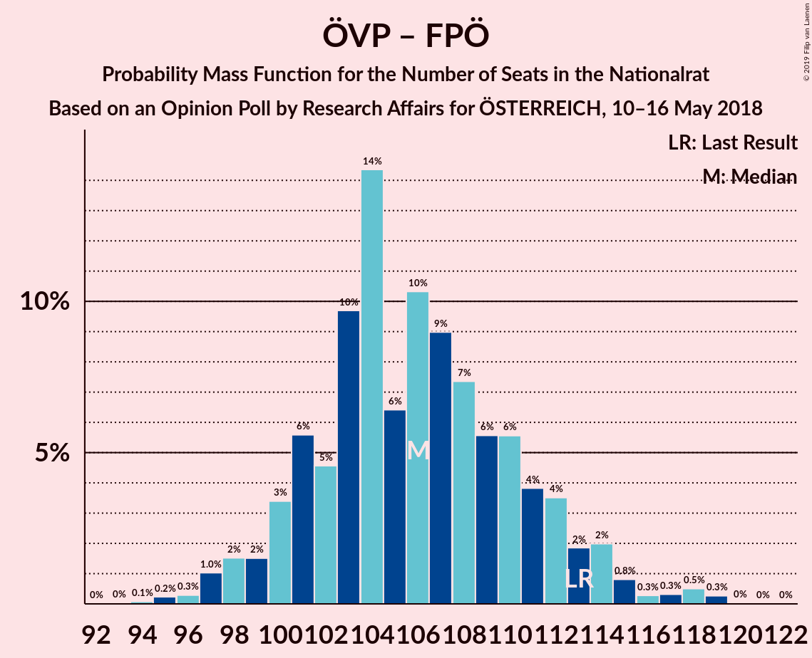
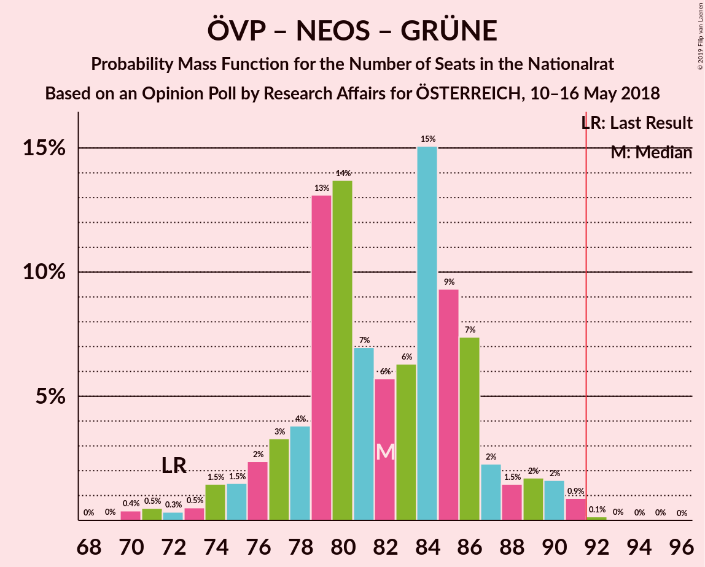
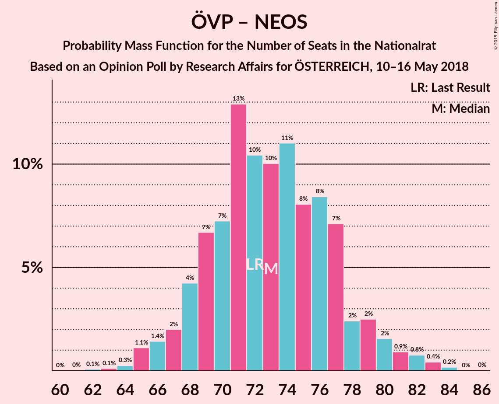
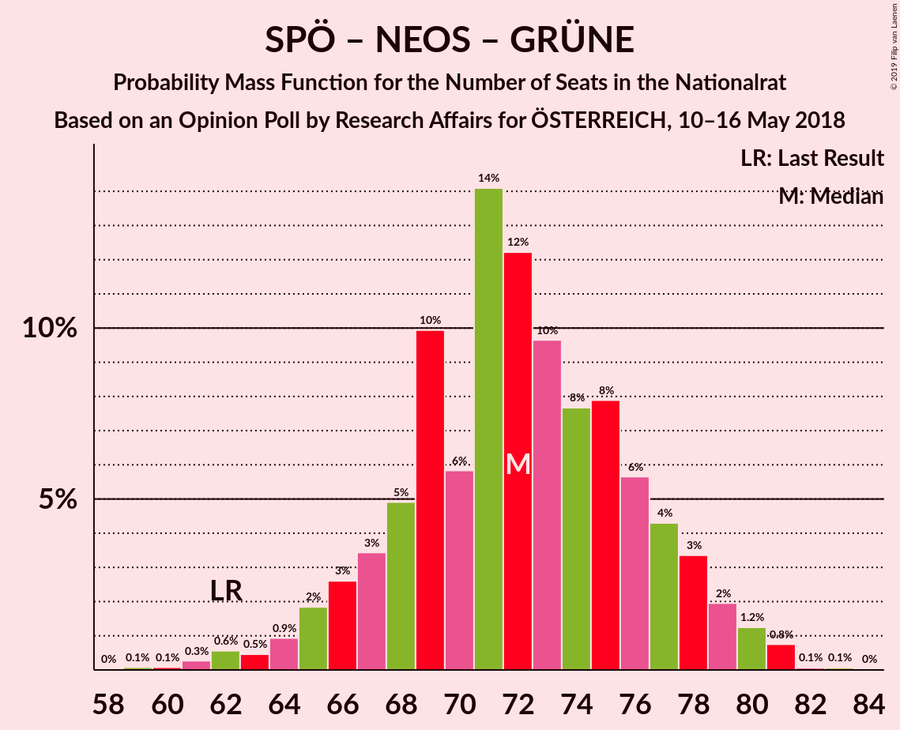

# Opinion Poll by Research Affairs for ÖSTERREICH, 10–16 May 2018

<a href="#voting-intentions">Voting Intentions</a> | <a href="#seats">Seats</a> | <a href="#coalitions">Coalitions</a> | <a href="#technical-information">Technical Information</a>

## Voting Intentions

### Confidence Intervals

| Party | Last Result | Poll Result | 80% Confidence Interval | 90% Confidence Interval | 95% Confidence Interval | 99% Confidence Interval |
|:-----:|:-----------:|:-----------:|:-----------------------:|:-----------------------:|:-----------------------:|:-----------------------:|
| Österreichische Volkspartei | 31.5% | 32.0% | 30.2–34.0% |29.7–34.5% |29.2–35.0% |28.4–35.9% |
| Sozialdemokratische Partei Österreichs | 26.9% | 27.0% | 25.2–28.8% |24.8–29.4% |24.3–29.8% |23.5–30.7% |
| Freiheitliche Partei Österreichs | 26.0% | 23.0% | 21.4–24.8% |20.9–25.3% |20.5–25.7% |19.8–26.6% |
| NEOS–Das Neue Österreich und Liberales Forum | 5.3% | 6.0% | 5.1–7.0% |4.8–7.3% |4.6–7.6% |4.3–8.1% |
| Die Grünen–Die Grüne Alternative | 3.8% | 5.0% | 4.2–6.0% |4.0–6.2% |3.8–6.5% |3.4–7.0% |
| JETZT–Liste Pilz | 4.4% | 3.0% | 2.4–3.8% |2.2–4.0% |2.1–4.2% |1.8–4.6% |

*Note:* The poll result column reflects the actual value used in the calculations. Published results may vary slightly, and in addition be rounded to fewer digits.

## Seats

### Confidence Intervals

| Party | Last Result | Median | 80% Confidence Interval | 90% Confidence Interval | 95% Confidence Interval | 99% Confidence Interval |
|:-----:|:-----------:|:------:|:-----------------------:|:-----------------------:|:-----------------------:|:-----------------------:|
| <a href="#österreichische-volkspartei">Österreichische Volkspartei</a> | 62 | 62 | 58–66 |56–68 |55–70 |54–71 |
| <a href="#sozialdemokratische-partei-österreichs">Sozialdemokratische Partei Österreichs</a> | 52 | 51 | 48–56 |47–57 |46–58 |44–60 |
| <a href="#freiheitliche-partei-österreichs">Freiheitliche Partei Österreichs</a> | 51 | 43 | 41–48 |40–49 |39–50 |38–51 |
| <a href="#neos–das-neue-österreich-und-liberales-forum">NEOS–Das Neue Österreich und Liberales Forum</a> | 10 | 11 | 10–13 |9–14 |8–14 |8–15 |
| <a href="#die-grünen–die-grüne-alternative">Die Grünen–Die Grüne Alternative</a> | 0 | 9 | 8–11 |0–12 |0–12 |0–13 |
| <a href="#jetzt–liste-pilz">JETZT–Liste Pilz</a> | 8 | 0 | 0 |0–7 |0–8 |0–8 |

### Österreichische Volkspartei

*For a full overview of the results for this party, see the [Österreichische Volkspartei](party-österreichischevolkspartei.html) page.*

| Number of Seats | Probability | Accumulated | Special Marks |
|:---------------:|:-----------:|:-----------:|:-------------:|
| 52 | 0.1% | 100% |  |
| 53 | 0.3% | 99.9% |  |
| 54 | 0.6% | 99.6% |  |
| 55 | 2% | 99.1% |  |
| 56 | 3% | 97% |  |
| 57 | 4% | 94% |  |
| 58 | 7% | 90% |  |
| 59 | 6% | 84% |  |
| 60 | 15% | 78% |  |
| 61 | 12% | 63% |  |
| 62 | 19% | 51% | Last Result, Median |
| 63 | 7% | 32% |  |
| 64 | 7% | 25% |  |
| 65 | 4% | 17% |  |
| 66 | 5% | 14% |  |
| 67 | 1.3% | 9% |  |
| 68 | 4% | 7% |  |
| 69 | 0.8% | 3% |  |
| 70 | 1.1% | 3% |  |
| 71 | 1.4% | 2% |  |
| 72 | 0.1% | 0.1% |  |
| 73 | 0% | 0% |  |

### Sozialdemokratische Partei Österreichs

*For a full overview of the results for this party, see the [Sozialdemokratische Partei Österreichs](party-sozialdemokratischeparteiösterreichs.html) page.*

| Number of Seats | Probability | Accumulated | Special Marks |
|:---------------:|:-----------:|:-----------:|:-------------:|
| 42 | 0% | 100% |  |
| 43 | 0.1% | 99.9% |  |
| 44 | 0.4% | 99.9% |  |
| 45 | 0.5% | 99.4% |  |
| 46 | 2% | 98.9% |  |
| 47 | 5% | 97% |  |
| 48 | 9% | 92% |  |
| 49 | 6% | 83% |  |
| 50 | 19% | 76% |  |
| 51 | 13% | 58% | Median |
| 52 | 7% | 45% | Last Result |
| 53 | 9% | 38% |  |
| 54 | 6% | 28% |  |
| 55 | 10% | 22% |  |
| 56 | 5% | 12% |  |
| 57 | 3% | 7% |  |
| 58 | 3% | 4% |  |
| 59 | 0.9% | 2% |  |
| 60 | 0.4% | 0.6% |  |
| 61 | 0.2% | 0.3% |  |
| 62 | 0.1% | 0.1% |  |
| 63 | 0% | 0% |  |

### Freiheitliche Partei Österreichs

*For a full overview of the results for this party, see the [Freiheitliche Partei Österreichs](party-freiheitlicheparteiösterreichs.html) page.*

| Number of Seats | Probability | Accumulated | Special Marks |
|:---------------:|:-----------:|:-----------:|:-------------:|
| 36 | 0.1% | 100% |  |
| 37 | 0.3% | 99.8% |  |
| 38 | 1.4% | 99.5% |  |
| 39 | 2% | 98% |  |
| 40 | 4% | 96% |  |
| 41 | 3% | 92% |  |
| 42 | 22% | 88% |  |
| 43 | 19% | 66% | Median |
| 44 | 10% | 47% |  |
| 45 | 9% | 37% |  |
| 46 | 7% | 28% |  |
| 47 | 7% | 21% |  |
| 48 | 7% | 14% |  |
| 49 | 5% | 8% |  |
| 50 | 0.9% | 3% |  |
| 51 | 1.1% | 2% | Last Result |
| 52 | 0.2% | 0.5% |  |
| 53 | 0.1% | 0.2% |  |
| 54 | 0.1% | 0.1% |  |
| 55 | 0% | 0% |  |

### NEOS–Das Neue Österreich und Liberales Forum

*For a full overview of the results for this party, see the [NEOS–Das Neue Österreich und Liberales Forum](party-neos–dasneueösterreichundliberalesforum.html) page.*

| Number of Seats | Probability | Accumulated | Special Marks |
|:---------------:|:-----------:|:-----------:|:-------------:|
| 0 | 0.1% | 100% |  |
| 1 | 0% | 99.9% |  |
| 2 | 0% | 99.9% |  |
| 3 | 0% | 99.9% |  |
| 4 | 0% | 99.9% |  |
| 5 | 0% | 99.9% |  |
| 6 | 0% | 99.9% |  |
| 7 | 0.2% | 99.9% |  |
| 8 | 2% | 99.7% |  |
| 9 | 6% | 97% |  |
| 10 | 25% | 91% | Last Result |
| 11 | 18% | 66% | Median |
| 12 | 27% | 47% |  |
| 13 | 14% | 21% |  |
| 14 | 5% | 7% |  |
| 15 | 1.0% | 1.5% |  |
| 16 | 0.4% | 0.4% |  |
| 17 | 0% | 0.1% |  |
| 18 | 0% | 0% |  |

### Die Grünen–Die Grüne Alternative

*For a full overview of the results for this party, see the [Die Grünen–Die Grüne Alternative](party-diegrünen–diegrünealternative.html) page.*

| Number of Seats | Probability | Accumulated | Special Marks |
|:---------------:|:-----------:|:-----------:|:-------------:|
| 0 | 7% | 100% | Last Result |
| 1 | 0% | 93% |  |
| 2 | 0% | 93% |  |
| 3 | 0% | 93% |  |
| 4 | 0% | 93% |  |
| 5 | 0% | 93% |  |
| 6 | 0% | 93% |  |
| 7 | 2% | 93% |  |
| 8 | 22% | 91% |  |
| 9 | 24% | 69% | Median |
| 10 | 27% | 45% |  |
| 11 | 11% | 18% |  |
| 12 | 5% | 7% |  |
| 13 | 2% | 2% |  |
| 14 | 0.3% | 0.3% |  |
| 15 | 0% | 0% |  |

### JETZT–Liste Pilz

*For a full overview of the results for this party, see the [JETZT–Liste Pilz](party-jetzt–listepilz.html) page.*

| Number of Seats | Probability | Accumulated | Special Marks |
|:---------------:|:-----------:|:-----------:|:-------------:|
| 0 | 94% | 100% | Median |
| 1 | 0% | 6% |  |
| 2 | 0% | 6% |  |
| 3 | 0% | 6% |  |
| 4 | 0% | 6% |  |
| 5 | 0% | 6% |  |
| 6 | 0% | 6% |  |
| 7 | 3% | 6% |  |
| 8 | 3% | 3% | Last Result |
| 9 | 0.3% | 0.3% |  |
| 10 | 0% | 0% |  |

## Coalitions

### Confidence Intervals

| Coalition | Last Result | Median | Majority? | 80% Confidence Interval | 90% Confidence Interval | 95% Confidence Interval | 99% Confidence Interval |
|:---------:|:-----------:|:------:|:---------:|:-----------------------:|:-----------------------:|:-----------------------:|:-----------------------:|
| Österreichische Volkspartei – Sozialdemokratische Partei Österreichs | 114 | 112 | 100% | 108–120 | 107–121 | 106–123 | 104–126 |
| Österreichische Volkspartei – Freiheitliche Partei Österreichs | 113 | 105 | 100% | 101–112 | 100–114 | 98–115 | 96–118 |
| Sozialdemokratische Partei Österreichs – Freiheitliche Partei Österreichs | 103 | 96 | 85% | 91–101 | 90–103 | 89–104 | 86–106 |
| Österreichische Volkspartei – NEOS–Das Neue Österreich und Liberales Forum – Die Grünen–Die Grüne Alternative | 72 | 82 | 0.2% | 78–86 | 76–89 | 74–90 | 72–91 |
| Österreichische Volkspartei – NEOS–Das Neue Österreich und Liberales Forum | 72 | 73 | 0% | 69–79 | 68–80 | 66–81 | 64–82 |
| Sozialdemokratische Partei Österreichs – NEOS–Das Neue Österreich und Liberales Forum – Die Grünen–Die Grüne Alternative | 62 | 72 | 0% | 67–77 | 66–78 | 65–79 | 61–81 |
| Österreichische Volkspartei – Die Grünen–Die Grüne Alternative | 62 | 71 | 0% | 66–75 | 65–77 | 63–78 | 61–80 |
| Österreichische Volkspartei | 62 | 62 | 0% | 58–66 | 56–68 | 55–70 | 54–71 |
| Sozialdemokratische Partei Österreichs | 52 | 51 | 0% | 48–56 | 47–57 | 46–58 | 44–60 |

### Österreichische Volkspartei – Sozialdemokratische Partei Österreichs

| Number of Seats | Probability | Accumulated | Special Marks |
|:---------------:|:-----------:|:-----------:|:-------------:|
| 101 | 0.1% | 100% |  |
| 102 | 0.1% | 99.9% |  |
| 103 | 0.2% | 99.8% |  |
| 104 | 0.4% | 99.6% |  |
| 105 | 1.0% | 99.2% |  |
| 106 | 2% | 98% |  |
| 107 | 0.9% | 96% |  |
| 108 | 6% | 95% |  |
| 109 | 8% | 88% |  |
| 110 | 4% | 80% |  |
| 111 | 9% | 76% |  |
| 112 | 21% | 67% |  |
| 113 | 5% | 46% | Median |
| 114 | 7% | 42% | Last Result |
| 115 | 8% | 34% |  |
| 116 | 4% | 27% |  |
| 117 | 4% | 22% |  |
| 118 | 6% | 18% |  |
| 119 | 1.1% | 12% |  |
| 120 | 6% | 11% |  |
| 121 | 0.7% | 6% |  |
| 122 | 0.6% | 5% |  |
| 123 | 2% | 4% |  |
| 124 | 0.1% | 2% |  |
| 125 | 1.3% | 2% |  |
| 126 | 0.3% | 0.5% |  |
| 127 | 0.1% | 0.2% |  |
| 128 | 0% | 0.1% |  |
| 129 | 0% | 0.1% |  |
| 130 | 0% | 0.1% |  |
| 131 | 0.1% | 0.1% |  |
| 132 | 0% | 0% |  |

### Österreichische Volkspartei – Freiheitliche Partei Österreichs

| Number of Seats | Probability | Accumulated | Special Marks |
|:---------------:|:-----------:|:-----------:|:-------------:|
| 94 | 0% | 100% |  |
| 95 | 0.2% | 99.9% |  |
| 96 | 0.4% | 99.8% |  |
| 97 | 0.8% | 99.4% |  |
| 98 | 2% | 98.6% |  |
| 99 | 1.2% | 96% |  |
| 100 | 3% | 95% |  |
| 101 | 7% | 92% |  |
| 102 | 7% | 85% |  |
| 103 | 10% | 79% |  |
| 104 | 17% | 68% |  |
| 105 | 5% | 51% | Median |
| 106 | 12% | 46% |  |
| 107 | 7% | 34% |  |
| 108 | 5% | 27% |  |
| 109 | 3% | 22% |  |
| 110 | 3% | 19% |  |
| 111 | 3% | 16% |  |
| 112 | 5% | 13% |  |
| 113 | 2% | 8% | Last Result |
| 114 | 3% | 6% |  |
| 115 | 1.3% | 3% |  |
| 116 | 0.5% | 2% |  |
| 117 | 0.2% | 2% |  |
| 118 | 1.3% | 1.4% |  |
| 119 | 0% | 0.1% |  |
| 120 | 0% | 0.1% |  |
| 121 | 0% | 0.1% |  |
| 122 | 0% | 0% |  |

### Sozialdemokratische Partei Österreichs – Freiheitliche Partei Österreichs

| Number of Seats | Probability | Accumulated | Special Marks |
|:---------------:|:-----------:|:-----------:|:-------------:|
| 84 | 0% | 100% |  |
| 85 | 0.2% | 99.9% |  |
| 86 | 0.4% | 99.8% |  |
| 87 | 0.7% | 99.4% |  |
| 88 | 1.0% | 98.7% |  |
| 89 | 1.2% | 98% |  |
| 90 | 4% | 97% |  |
| 91 | 7% | 92% |  |
| 92 | 15% | 85% | Majority |
| 93 | 6% | 70% |  |
| 94 | 4% | 64% | Median |
| 95 | 9% | 60% |  |
| 96 | 11% | 51% |  |
| 97 | 4% | 40% |  |
| 98 | 12% | 35% |  |
| 99 | 8% | 23% |  |
| 100 | 2% | 15% |  |
| 101 | 4% | 13% |  |
| 102 | 3% | 9% |  |
| 103 | 3% | 6% | Last Result |
| 104 | 2% | 3% |  |
| 105 | 0.8% | 1.3% |  |
| 106 | 0.2% | 0.5% |  |
| 107 | 0.1% | 0.3% |  |
| 108 | 0.1% | 0.2% |  |
| 109 | 0% | 0.1% |  |
| 110 | 0% | 0.1% |  |
| 111 | 0% | 0.1% |  |
| 112 | 0% | 0.1% |  |
| 113 | 0% | 0% |  |

### Österreichische Volkspartei – NEOS–Das Neue Österreich und Liberales Forum – Die Grünen–Die Grüne Alternative

| Number of Seats | Probability | Accumulated | Special Marks |
|:---------------:|:-----------:|:-----------:|:-------------:|
| 68 | 0% | 100% |  |
| 69 | 0.1% | 99.9% |  |
| 70 | 0.1% | 99.9% |  |
| 71 | 0.2% | 99.8% |  |
| 72 | 0.3% | 99.7% | Last Result |
| 73 | 0.3% | 99.4% |  |
| 74 | 2% | 99.1% |  |
| 75 | 1.3% | 97% |  |
| 76 | 2% | 96% |  |
| 77 | 4% | 94% |  |
| 78 | 8% | 90% |  |
| 79 | 14% | 82% |  |
| 80 | 12% | 69% |  |
| 81 | 5% | 56% |  |
| 82 | 5% | 52% | Median |
| 83 | 6% | 47% |  |
| 84 | 22% | 41% |  |
| 85 | 8% | 19% |  |
| 86 | 2% | 11% |  |
| 87 | 1.1% | 9% |  |
| 88 | 2% | 8% |  |
| 89 | 1.1% | 6% |  |
| 90 | 4% | 5% |  |
| 91 | 0.6% | 0.8% |  |
| 92 | 0.1% | 0.2% | Majority |
| 93 | 0.1% | 0.1% |  |
| 94 | 0% | 0% |  |

### Österreichische Volkspartei – NEOS–Das Neue Österreich und Liberales Forum

| Number of Seats | Probability | Accumulated | Special Marks |
|:---------------:|:-----------:|:-----------:|:-------------:|
| 61 | 0% | 100% |  |
| 62 | 0.1% | 99.9% |  |
| 63 | 0% | 99.8% |  |
| 64 | 0.6% | 99.8% |  |
| 65 | 0.8% | 99.2% |  |
| 66 | 1.4% | 98% |  |
| 67 | 2% | 97% |  |
| 68 | 5% | 95% |  |
| 69 | 4% | 90% |  |
| 70 | 9% | 86% |  |
| 71 | 19% | 77% |  |
| 72 | 6% | 58% | Last Result |
| 73 | 7% | 52% | Median |
| 74 | 18% | 45% |  |
| 75 | 5% | 27% |  |
| 76 | 7% | 22% |  |
| 77 | 3% | 15% |  |
| 78 | 2% | 12% |  |
| 79 | 4% | 10% |  |
| 80 | 2% | 6% |  |
| 81 | 2% | 4% |  |
| 82 | 2% | 2% |  |
| 83 | 0.4% | 0.4% |  |
| 84 | 0% | 0.1% |  |
| 85 | 0% | 0% |  |

### Sozialdemokratische Partei Österreichs – NEOS–Das Neue Österreich und Liberales Forum – Die Grünen–Die Grüne Alternative

| Number of Seats | Probability | Accumulated | Special Marks |
|:---------------:|:-----------:|:-----------:|:-------------:|
| 59 | 0.2% | 100% |  |
| 60 | 0% | 99.8% |  |
| 61 | 0.3% | 99.8% |  |
| 62 | 0.1% | 99.4% | Last Result |
| 63 | 0.8% | 99.3% |  |
| 64 | 0.5% | 98.5% |  |
| 65 | 3% | 98% |  |
| 66 | 2% | 95% |  |
| 67 | 5% | 93% |  |
| 68 | 3% | 88% |  |
| 69 | 13% | 85% |  |
| 70 | 6% | 72% |  |
| 71 | 8% | 66% | Median |
| 72 | 20% | 58% |  |
| 73 | 11% | 38% |  |
| 74 | 3% | 27% |  |
| 75 | 8% | 23% |  |
| 76 | 4% | 15% |  |
| 77 | 4% | 11% |  |
| 78 | 3% | 7% |  |
| 79 | 1.4% | 3% |  |
| 80 | 0.5% | 2% |  |
| 81 | 1.2% | 1.4% |  |
| 82 | 0.1% | 0.2% |  |
| 83 | 0% | 0.1% |  |
| 84 | 0% | 0% |  |

### Österreichische Volkspartei – Die Grünen–Die Grüne Alternative

| Number of Seats | Probability | Accumulated | Special Marks |
|:---------------:|:-----------:|:-----------:|:-------------:|
| 57 | 0.1% | 100% |  |
| 58 | 0% | 99.9% |  |
| 59 | 0.1% | 99.9% |  |
| 60 | 0.2% | 99.8% |  |
| 61 | 0.2% | 99.6% |  |
| 62 | 0.5% | 99.4% | Last Result |
| 63 | 2% | 98.9% |  |
| 64 | 2% | 97% |  |
| 65 | 3% | 96% |  |
| 66 | 3% | 93% |  |
| 67 | 9% | 89% |  |
| 68 | 8% | 81% |  |
| 69 | 16% | 72% |  |
| 70 | 6% | 56% |  |
| 71 | 7% | 51% | Median |
| 72 | 18% | 43% |  |
| 73 | 8% | 26% |  |
| 74 | 7% | 18% |  |
| 75 | 3% | 11% |  |
| 76 | 1.1% | 8% |  |
| 77 | 3% | 7% |  |
| 78 | 1.0% | 3% |  |
| 79 | 2% | 2% |  |
| 80 | 0.5% | 0.6% |  |
| 81 | 0% | 0.1% |  |
| 82 | 0.1% | 0.1% |  |
| 83 | 0% | 0% |  |

### Österreichische Volkspartei

| Number of Seats | Probability | Accumulated | Special Marks |
|:---------------:|:-----------:|:-----------:|:-------------:|
| 52 | 0.1% | 100% |  |
| 53 | 0.3% | 99.9% |  |
| 54 | 0.6% | 99.6% |  |
| 55 | 2% | 99.1% |  |
| 56 | 3% | 97% |  |
| 57 | 4% | 94% |  |
| 58 | 7% | 90% |  |
| 59 | 6% | 84% |  |
| 60 | 15% | 78% |  |
| 61 | 12% | 63% |  |
| 62 | 19% | 51% | Last Result, Median |
| 63 | 7% | 32% |  |
| 64 | 7% | 25% |  |
| 65 | 4% | 17% |  |
| 66 | 5% | 14% |  |
| 67 | 1.3% | 9% |  |
| 68 | 4% | 7% |  |
| 69 | 0.8% | 3% |  |
| 70 | 1.1% | 3% |  |
| 71 | 1.4% | 2% |  |
| 72 | 0.1% | 0.1% |  |
| 73 | 0% | 0% |  |

### Sozialdemokratische Partei Österreichs

| Number of Seats | Probability | Accumulated | Special Marks |
|:---------------:|:-----------:|:-----------:|:-------------:|
| 42 | 0% | 100% |  |
| 43 | 0.1% | 99.9% |  |
| 44 | 0.4% | 99.9% |  |
| 45 | 0.5% | 99.4% |  |
| 46 | 2% | 98.9% |  |
| 47 | 5% | 97% |  |
| 48 | 9% | 92% |  |
| 49 | 6% | 83% |  |
| 50 | 19% | 76% |  |
| 51 | 13% | 58% | Median |
| 52 | 7% | 45% | Last Result |
| 53 | 9% | 38% |  |
| 54 | 6% | 28% |  |
| 55 | 10% | 22% |  |
| 56 | 5% | 12% |  |
| 57 | 3% | 7% |  |
| 58 | 3% | 4% |  |
| 59 | 0.9% | 2% |  |
| 60 | 0.4% | 0.6% |  |
| 61 | 0.2% | 0.3% |  |
| 62 | 0.1% | 0.1% |  |
| 63 | 0% | 0% |  |

## Technical Information

### Opinion Poll

+ **Polling firm:** Research Affairs
+ **Commissioner(s):** ÖSTERREICH
+ **Fieldwork period:** 10–16 May 2018

### Calculations

+ **Sample size:** 1008
+ **Simulations done:** 32,768
+ **Error estimate:** 1.51%

