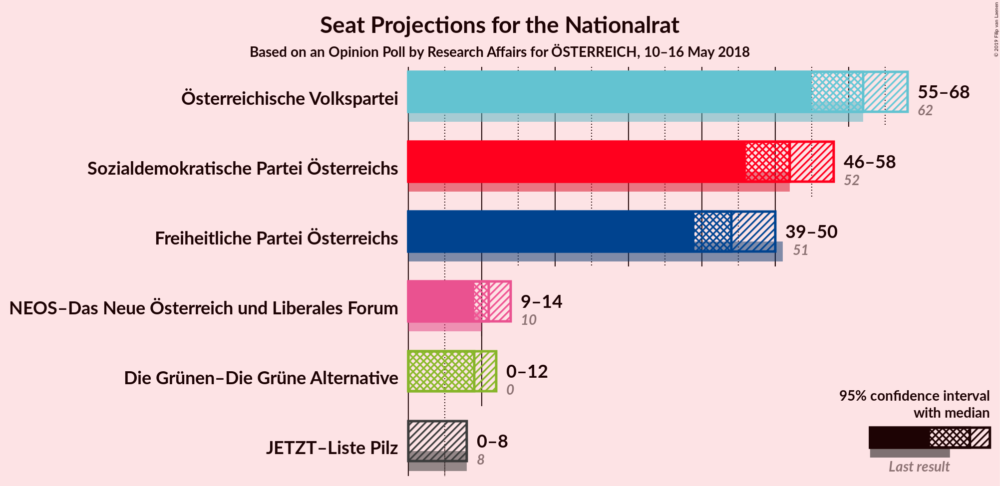
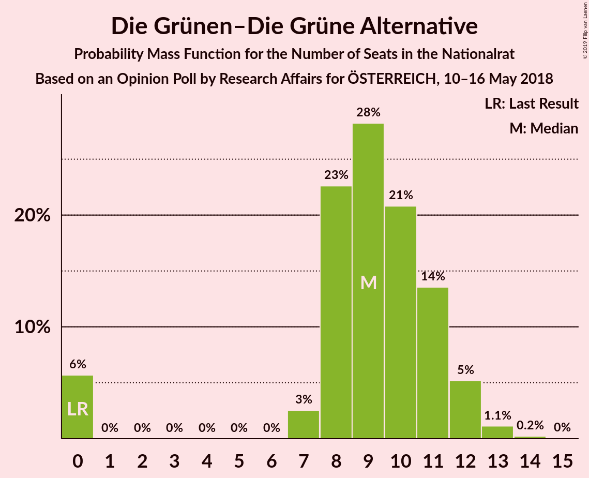

# Opinion Poll by Research Affairs for ÖSTERREICH, 10–16 May 2018

<a href="#voting-intentions">Voting Intentions</a> | <a href="#seats">Seats</a> | <a href="#coalitions">Coalitions</a> | <a href="#technical-information">Technical Information</a>

## Voting Intentions

### Confidence Intervals

| Party | Last Result | Poll Result | 80% Confidence Interval | 90% Confidence Interval | 95% Confidence Interval | 99% Confidence Interval |
|:-----:|:-----------:|:-----------:|:-----------------------:|:-----------------------:|:-----------------------:|:-----------------------:|
| Österreichische Volkspartei | 31.5% | 32.0% | 30.2–34.0% |29.7–34.5% |29.2–35.0% |28.4–35.9% |
| Sozialdemokratische Partei Österreichs | 26.9% | 27.0% | 25.2–28.8% |24.8–29.4% |24.3–29.8% |23.5–30.7% |
| Freiheitliche Partei Österreichs | 26.0% | 23.0% | 21.4–24.8% |20.9–25.3% |20.5–25.7% |19.8–26.6% |
| NEOS–Das Neue Österreich und Liberales Forum | 5.3% | 6.0% | 5.1–7.0% |4.8–7.3% |4.6–7.6% |4.3–8.1% |
| Die Grünen–Die Grüne Alternative | 3.8% | 5.0% | 4.2–6.0% |4.0–6.2% |3.8–6.5% |3.4–7.0% |
| JETZT–Liste Pilz | 4.4% | 3.0% | 2.4–3.8% |2.2–4.0% |2.1–4.2% |1.8–4.6% |

*Note:* The poll result column reflects the actual value used in the calculations. Published results may vary slightly, and in addition be rounded to fewer digits.

## Seats

### Confidence Intervals

| Party | Last Result | Median | 80% Confidence Interval | 90% Confidence Interval | 95% Confidence Interval | 99% Confidence Interval |
|:-----:|:-----------:|:------:|:-----------------------:|:-----------------------:|:-----------------------:|:-----------------------:|
| <a href="#österreichische-volkspartei">Österreichische Volkspartei</a> | 62 | 59 | 58–61 |58–63 |56–66 |55–74 |
| <a href="#sozialdemokratische-partei-österreichs">Sozialdemokratische Partei Österreichs</a> | 52 | 47 | 47–50 |45–53 |43–53 |43–53 |
| <a href="#freiheitliche-partei-österreichs">Freiheitliche Partei Österreichs</a> | 51 | 49 | 45–49 |43–50 |41–50 |40–52 |
| <a href="#neos–das-neue-österreich-und-liberales-forum">NEOS–Das Neue Österreich und Liberales Forum</a> | 10 | 12 | 12–13 |12–14 |11–15 |8–16 |
| <a href="#die-grünen–die-grüne-alternative">Die Grünen–Die Grüne Alternative</a> | 0 | 8 | 8–12 |8–13 |8–13 |0–13 |
| <a href="#jetzt–liste-pilz">JETZT–Liste Pilz</a> | 8 | 0 | 0 |0 |0 |0–9 |

### Österreichische Volkspartei

*For a full overview of the results for this party, see the [Österreichische Volkspartei](party-österreichischevolkspartei.html) page.*

| Number of Seats | Probability | Accumulated | Special Marks |
|:---------------:|:-----------:|:-----------:|:-------------:|
| 53 | 0.2% | 100% |  |
| 54 | 0% | 99.8% |  |
| 55 | 2% | 99.8% |  |
| 56 | 1.3% | 98% |  |
| 57 | 0% | 97% |  |
| 58 | 8% | 97% |  |
| 59 | 75% | 89% | Median |
| 60 | 0.3% | 14% |  |
| 61 | 9% | 14% |  |
| 62 | 0.1% | 6% | Last Result |
| 63 | 0.5% | 5% |  |
| 64 | 1.0% | 5% |  |
| 65 | 0.2% | 4% |  |
| 66 | 3% | 4% |  |
| 67 | 0% | 1.0% |  |
| 68 | 0.1% | 1.0% |  |
| 69 | 0.3% | 0.9% |  |
| 70 | 0.1% | 0.7% |  |
| 71 | 0.1% | 0.6% |  |
| 72 | 0% | 0.5% |  |
| 73 | 0% | 0.5% |  |
| 74 | 0.5% | 0.5% |  |
| 75 | 0% | 0% |  |

### Sozialdemokratische Partei Österreichs

*For a full overview of the results for this party, see the [Sozialdemokratische Partei Österreichs](party-sozialdemokratischeparteiösterreichs.html) page.*

| Number of Seats | Probability | Accumulated | Special Marks |
|:---------------:|:-----------:|:-----------:|:-------------:|
| 41 | 0.3% | 100% |  |
| 42 | 0% | 99.7% |  |
| 43 | 3% | 99.7% |  |
| 44 | 0.1% | 97% |  |
| 45 | 2% | 97% |  |
| 46 | 0.4% | 94% |  |
| 47 | 76% | 94% | Median |
| 48 | 0% | 18% |  |
| 49 | 0.6% | 18% |  |
| 50 | 9% | 18% |  |
| 51 | 0% | 9% |  |
| 52 | 0.8% | 9% | Last Result |
| 53 | 8% | 8% |  |
| 54 | 0% | 0.4% |  |
| 55 | 0.3% | 0.3% |  |
| 56 | 0% | 0.1% |  |
| 57 | 0% | 0.1% |  |
| 58 | 0.1% | 0.1% |  |
| 59 | 0% | 0% |  |

### Freiheitliche Partei Österreichs

*For a full overview of the results for this party, see the [Freiheitliche Partei Österreichs](party-freiheitlicheparteiösterreichs.html) page.*

| Number of Seats | Probability | Accumulated | Special Marks |
|:---------------:|:-----------:|:-----------:|:-------------:|
| 35 | 0.1% | 100% |  |
| 36 | 0% | 99.9% |  |
| 37 | 0.1% | 99.9% |  |
| 38 | 0% | 99.8% |  |
| 39 | 0.1% | 99.8% |  |
| 40 | 0.3% | 99.6% |  |
| 41 | 2% | 99.3% |  |
| 42 | 0.3% | 97% |  |
| 43 | 3% | 97% |  |
| 44 | 2% | 94% |  |
| 45 | 9% | 92% |  |
| 46 | 0.1% | 83% |  |
| 47 | 0.4% | 83% |  |
| 48 | 1.3% | 83% |  |
| 49 | 74% | 81% | Median |
| 50 | 5% | 7% |  |
| 51 | 1.0% | 2% | Last Result |
| 52 | 0.2% | 0.6% |  |
| 53 | 0.4% | 0.4% |  |
| 54 | 0% | 0% |  |

### NEOS–Das Neue Österreich und Liberales Forum

*For a full overview of the results for this party, see the [NEOS–Das Neue Österreich und Liberales Forum](party-neos–dasneueösterreichundliberalesforum.html) page.*

| Number of Seats | Probability | Accumulated | Special Marks |
|:---------------:|:-----------:|:-----------:|:-------------:|
| 0 | 0.1% | 100% |  |
| 1 | 0% | 99.9% |  |
| 2 | 0% | 99.9% |  |
| 3 | 0% | 99.9% |  |
| 4 | 0% | 99.9% |  |
| 5 | 0% | 99.9% |  |
| 6 | 0% | 99.9% |  |
| 7 | 0% | 99.9% |  |
| 8 | 0.5% | 99.9% |  |
| 9 | 0.2% | 99.4% |  |
| 10 | 0.1% | 99.2% | Last Result |
| 11 | 3% | 99.1% |  |
| 12 | 77% | 96% | Median |
| 13 | 9% | 18% |  |
| 14 | 7% | 9% |  |
| 15 | 2% | 3% |  |
| 16 | 0.5% | 0.9% |  |
| 17 | 0.4% | 0.4% |  |
| 18 | 0% | 0% |  |

### Die Grünen–Die Grüne Alternative

*For a full overview of the results for this party, see the [Die Grünen–Die Grüne Alternative](party-diegrünen–diegrünealternative.html) page.*

| Number of Seats | Probability | Accumulated | Special Marks |
|:---------------:|:-----------:|:-----------:|:-------------:|
| 0 | 1.3% | 100% | Last Result |
| 1 | 0% | 98.7% |  |
| 2 | 0% | 98.7% |  |
| 3 | 0% | 98.7% |  |
| 4 | 0% | 98.7% |  |
| 5 | 0% | 98.7% |  |
| 6 | 0% | 98.7% |  |
| 7 | 0% | 98.7% |  |
| 8 | 77% | 98.7% | Median |
| 9 | 9% | 22% |  |
| 10 | 0.4% | 13% |  |
| 11 | 0% | 13% |  |
| 12 | 4% | 13% |  |
| 13 | 9% | 9% |  |
| 14 | 0.1% | 0.1% |  |
| 15 | 0% | 0% |  |

### JETZT–Liste Pilz

*For a full overview of the results for this party, see the [JETZT–Liste Pilz](party-jetzt–listepilz.html) page.*

| Number of Seats | Probability | Accumulated | Special Marks |
|:---------------:|:-----------:|:-----------:|:-------------:|
| 0 | 99.2% | 100% | Median |
| 1 | 0% | 0.8% |  |
| 2 | 0% | 0.8% |  |
| 3 | 0% | 0.8% |  |
| 4 | 0% | 0.8% |  |
| 5 | 0% | 0.8% |  |
| 6 | 0% | 0.8% |  |
| 7 | 0% | 0.8% |  |
| 8 | 0.1% | 0.8% | Last Result |
| 9 | 0.6% | 0.6% |  |
| 10 | 0% | 0% |  |

## Coalitions

### Confidence Intervals

| Coalition | Last Result | Median | Majority? | 80% Confidence Interval | 90% Confidence Interval | 95% Confidence Interval | 99% Confidence Interval |
|:---------:|:-----------:|:------:|:---------:|:-----------------------:|:-----------------------:|:-----------------------:|:-----------------------:|
| Österreichische Volkspartei – Sozialdemokratische Partei Österreichs | 114 | 106 | 100% | 106–111 | 106–111 | 105–115 | 104–119 |
| Österreichische Volkspartei – Freiheitliche Partei Österreichs | 113 | 108 | 100% | 103–109 | 103–111 | 98–111 | 97–117 |
| Sozialdemokratische Partei Österreichs – Freiheitliche Partei Österreichs | 103 | 96 | 92% | 94–98 | 90–100 | 87–100 | 87–104 |
| Österreichische Volkspartei | 62 | 59 | 0% | 58–61 | 58–63 | 56–66 | 55–74 |
| Sozialdemokratische Partei Österreichs | 52 | 47 | 0% | 47–50 | 45–53 | 43–53 | 43–53 |

### Österreichische Volkspartei – Sozialdemokratische Partei Österreichs

| Number of Seats | Probability | Accumulated | Special Marks |
|:---------------:|:-----------:|:-----------:|:-------------:|
| 100 | 0.1% | 100% |  |
| 101 | 0% | 99.9% |  |
| 102 | 0.1% | 99.8% |  |
| 103 | 0.1% | 99.8% |  |
| 104 | 0.3% | 99.6% |  |
| 105 | 4% | 99.4% |  |
| 106 | 76% | 96% | Median |
| 107 | 0% | 19% |  |
| 108 | 0% | 19% |  |
| 109 | 3% | 19% |  |
| 110 | 0.2% | 16% |  |
| 111 | 13% | 16% |  |
| 112 | 0% | 3% |  |
| 113 | 0.2% | 3% |  |
| 114 | 0.2% | 3% | Last Result |
| 115 | 0.6% | 3% |  |
| 116 | 0.1% | 2% |  |
| 117 | 1.0% | 2% |  |
| 118 | 0% | 0.7% |  |
| 119 | 0.5% | 0.7% |  |
| 120 | 0% | 0.2% |  |
| 121 | 0.2% | 0.2% |  |
| 122 | 0% | 0.1% |  |
| 123 | 0% | 0.1% |  |
| 124 | 0.1% | 0.1% |  |
| 125 | 0% | 0% |  |

### Österreichische Volkspartei – Freiheitliche Partei Österreichs

| Number of Seats | Probability | Accumulated | Special Marks |
|:---------------:|:-----------:|:-----------:|:-------------:|
| 95 | 0.1% | 100% |  |
| 96 | 0% | 99.9% |  |
| 97 | 0.6% | 99.9% |  |
| 98 | 2% | 99.3% |  |
| 99 | 0% | 97% |  |
| 100 | 0.1% | 97% |  |
| 101 | 0.5% | 97% |  |
| 102 | 2% | 97% |  |
| 103 | 6% | 95% |  |
| 104 | 0.3% | 89% |  |
| 105 | 0% | 89% |  |
| 106 | 4% | 89% |  |
| 107 | 0.1% | 85% |  |
| 108 | 74% | 85% | Median |
| 109 | 0.5% | 10% |  |
| 110 | 2% | 10% |  |
| 111 | 5% | 7% |  |
| 112 | 0.2% | 2% |  |
| 113 | 0.2% | 2% | Last Result |
| 114 | 0.2% | 2% |  |
| 115 | 0.9% | 2% |  |
| 116 | 0% | 0.8% |  |
| 117 | 0.5% | 0.8% |  |
| 118 | 0.2% | 0.2% |  |
| 119 | 0% | 0.1% |  |
| 120 | 0% | 0.1% |  |
| 121 | 0.1% | 0.1% |  |
| 122 | 0% | 0% |  |

### Sozialdemokratische Partei Österreichs – Freiheitliche Partei Österreichs

| Number of Seats | Probability | Accumulated | Special Marks |
|:---------------:|:-----------:|:-----------:|:-------------:|
| 83 | 0.1% | 100% |  |
| 84 | 0% | 99.9% |  |
| 85 | 0% | 99.9% |  |
| 86 | 0.2% | 99.8% |  |
| 87 | 2% | 99.7% |  |
| 88 | 0.5% | 97% |  |
| 89 | 0.3% | 97% |  |
| 90 | 2% | 96% |  |
| 91 | 2% | 94% |  |
| 92 | 0.1% | 92% | Majority |
| 93 | 2% | 92% |  |
| 94 | 1.0% | 90% |  |
| 95 | 2% | 89% |  |
| 96 | 74% | 88% | Median |
| 97 | 0.1% | 13% |  |
| 98 | 6% | 13% |  |
| 99 | 0.4% | 7% |  |
| 100 | 5% | 6% |  |
| 101 | 0% | 1.3% |  |
| 102 | 0% | 1.3% |  |
| 103 | 0.4% | 1.3% | Last Result |
| 104 | 0.9% | 0.9% |  |
| 105 | 0% | 0% |  |

### Österreichische Volkspartei

| Number of Seats | Probability | Accumulated | Special Marks |
|:---------------:|:-----------:|:-----------:|:-------------:|
| 53 | 0.2% | 100% |  |
| 54 | 0% | 99.8% |  |
| 55 | 2% | 99.8% |  |
| 56 | 1.3% | 98% |  |
| 57 | 0% | 97% |  |
| 58 | 8% | 97% |  |
| 59 | 75% | 89% | Median |
| 60 | 0.3% | 14% |  |
| 61 | 9% | 14% |  |
| 62 | 0.1% | 6% | Last Result |
| 63 | 0.5% | 5% |  |
| 64 | 1.0% | 5% |  |
| 65 | 0.2% | 4% |  |
| 66 | 3% | 4% |  |
| 67 | 0% | 1.0% |  |
| 68 | 0.1% | 1.0% |  |
| 69 | 0.3% | 0.9% |  |
| 70 | 0.1% | 0.7% |  |
| 71 | 0.1% | 0.6% |  |
| 72 | 0% | 0.5% |  |
| 73 | 0% | 0.5% |  |
| 74 | 0.5% | 0.5% |  |
| 75 | 0% | 0% |  |

### Sozialdemokratische Partei Österreichs

| Number of Seats | Probability | Accumulated | Special Marks |
|:---------------:|:-----------:|:-----------:|:-------------:|
| 41 | 0.3% | 100% |  |
| 42 | 0% | 99.7% |  |
| 43 | 3% | 99.7% |  |
| 44 | 0.1% | 97% |  |
| 45 | 2% | 97% |  |
| 46 | 0.4% | 94% |  |
| 47 | 76% | 94% | Median |
| 48 | 0% | 18% |  |
| 49 | 0.6% | 18% |  |
| 50 | 9% | 18% |  |
| 51 | 0% | 9% |  |
| 52 | 0.8% | 9% | Last Result |
| 53 | 8% | 8% |  |
| 54 | 0% | 0.4% |  |
| 55 | 0.3% | 0.3% |  |
| 56 | 0% | 0.1% |  |
| 57 | 0% | 0.1% |  |
| 58 | 0.1% | 0.1% |  |
| 59 | 0% | 0% |  |

## Technical Information

### Opinion Poll

+ **Polling firm:** Research Affairs
+ **Commissioner(s):** ÖSTERREICH
+ **Fieldwork period:** 10–16 May 2018

### Calculations

+ **Sample size:** 1008
+ **Simulations done:** 1,024
+ **Error estimate:** 3.58%

