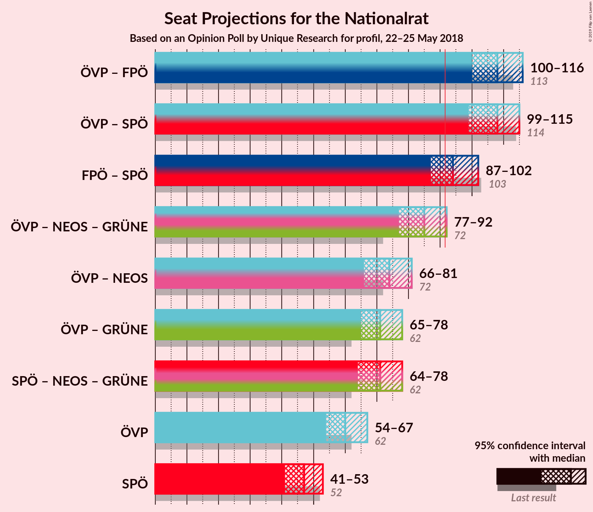
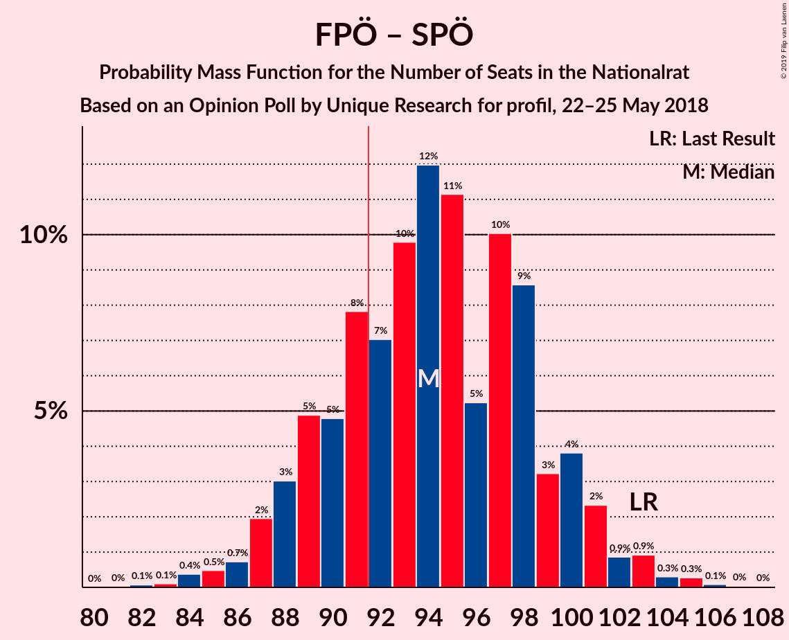

# Opinion Poll by Unique Research for profil, 22–25 May 2018

<a href="#voting-intentions">Voting Intentions</a> | <a href="#seats">Seats</a> | <a href="#coalitions">Coalitions</a> | <a href="#technical-information">Technical Information</a>

## Voting Intentions

### Confidence Intervals

| Party | Last Result | Poll Result | 80% Confidence Interval | 90% Confidence Interval | 95% Confidence Interval | 99% Confidence Interval |
|:-----:|:-----------:|:-----------:|:-----------------------:|:-----------------------:|:-----------------------:|:-----------------------:|
| Österreichische Volkspartei | 31.5% | 32.0% | 29.9–34.2% |29.4–34.8% |28.9–35.3% |27.9–36.4% |
| Sozialdemokratische Partei Österreichs | 26.9% | 25.0% | 23.1–27.0% |22.6–27.6% |22.1–28.1% |21.2–29.1% |
| Freiheitliche Partei Österreichs | 26.0% | 25.0% | 23.1–27.0% |22.6–27.6% |22.1–28.1% |21.2–29.1% |
| NEOS–Das Neue Österreich und Liberales Forum | 5.3% | 7.0% | 6.0–8.3% |5.7–8.7% |5.4–9.0% |5.0–9.6% |
| Die Grünen–Die Grüne Alternative | 3.8% | 6.0% | 5.0–7.2% |4.8–7.6% |4.6–7.9% |4.1–8.5% |
| JETZT–Liste Pilz | 4.4% | 4.0% | 3.2–5.0% |3.0–5.3% |2.9–5.6% |2.5–6.1% |

*Note:* The poll result column reflects the actual value used in the calculations. Published results may vary slightly, and in addition be rounded to fewer digits.

## Seats

### Confidence Intervals

| Party | Last Result | Median | 80% Confidence Interval | 90% Confidence Interval | 95% Confidence Interval | 99% Confidence Interval |
|:-----:|:-----------:|:------:|:-----------------------:|:-----------------------:|:-----------------------:|:-----------------------:|
| <a href="#österreichische-volkspartei">Österreichische Volkspartei</a> | 62 | 59 | 59 |59 |55–59 |55–60 |
| <a href="#sozialdemokratische-partei-österreichs">Sozialdemokratische Partei Österreichs</a> | 52 | 47 | 47 |47 |43–47 |43–51 |
| <a href="#freiheitliche-partei-österreichs">Freiheitliche Partei Österreichs</a> | 51 | 47 | 47 |47 |47–51 |43–51 |
| <a href="#neos–das-neue-österreich-und-liberales-forum">NEOS–Das Neue Österreich und Liberales Forum</a> | 10 | 11 | 11 |11 |11–13 |11–14 |
| <a href="#die-grünen–die-grüne-alternative">Die Grünen–Die Grüne Alternative</a> | 0 | 12 | 12 |12 |12 |9–12 |
| <a href="#jetzt–liste-pilz">JETZT–Liste Pilz</a> | 8 | 7 | 7 |7 |7–9 |0–9 |

### Österreichische Volkspartei

*For a full overview of the results for this party, see the [Österreichische Volkspartei](party-österreichischevolkspartei.html) page.*

| Number of Seats | Probability | Accumulated | Special Marks |
|:---------------:|:-----------:|:-----------:|:-------------:|
| 51 | 0.1% | 100% |  |
| 52 | 0% | 99.9% |  |
| 53 | 0.1% | 99.9% |  |
| 54 | 0% | 99.8% |  |
| 55 | 4% | 99.8% |  |
| 56 | 0% | 96% |  |
| 57 | 0% | 96% |  |
| 58 | 0.5% | 96% |  |
| 59 | 95% | 95% | Median |
| 60 | 0.2% | 0.6% |  |
| 61 | 0% | 0.4% |  |
| 62 | 0% | 0.4% | Last Result |
| 63 | 0% | 0.4% |  |
| 64 | 0% | 0.4% |  |
| 65 | 0% | 0.4% |  |
| 66 | 0% | 0.3% |  |
| 67 | 0% | 0.3% |  |
| 68 | 0% | 0.3% |  |
| 69 | 0.1% | 0.3% |  |
| 70 | 0% | 0.2% |  |
| 71 | 0% | 0.2% |  |
| 72 | 0.2% | 0.2% |  |
| 73 | 0% | 0% |  |

### Sozialdemokratische Partei Österreichs

*For a full overview of the results for this party, see the [Sozialdemokratische Partei Österreichs](party-sozialdemokratischeparteiösterreichs.html) page.*

| Number of Seats | Probability | Accumulated | Special Marks |
|:---------------:|:-----------:|:-----------:|:-------------:|
| 41 | 0.1% | 100% |  |
| 42 | 0% | 99.9% |  |
| 43 | 4% | 99.9% |  |
| 44 | 0.3% | 96% |  |
| 45 | 0% | 96% |  |
| 46 | 0% | 96% |  |
| 47 | 95% | 96% | Median |
| 48 | 0% | 0.7% |  |
| 49 | 0.1% | 0.7% |  |
| 50 | 0.1% | 0.6% |  |
| 51 | 0.1% | 0.5% |  |
| 52 | 0% | 0.5% | Last Result |
| 53 | 0.3% | 0.5% |  |
| 54 | 0.2% | 0.2% |  |
| 55 | 0% | 0% |  |

### Freiheitliche Partei Österreichs

*For a full overview of the results for this party, see the [Freiheitliche Partei Österreichs](party-freiheitlicheparteiösterreichs.html) page.*

| Number of Seats | Probability | Accumulated | Special Marks |
|:---------------:|:-----------:|:-----------:|:-------------:|
| 40 | 0.3% | 100% |  |
| 41 | 0% | 99.7% |  |
| 42 | 0.2% | 99.7% |  |
| 43 | 0.1% | 99.5% |  |
| 44 | 0.1% | 99.4% |  |
| 45 | 0% | 99.3% |  |
| 46 | 0.1% | 99.3% |  |
| 47 | 95% | 99.2% | Median |
| 48 | 0% | 4% |  |
| 49 | 0.1% | 4% |  |
| 50 | 0% | 4% |  |
| 51 | 4% | 4% | Last Result |
| 52 | 0% | 0.1% |  |
| 53 | 0% | 0.1% |  |
| 54 | 0% | 0.1% |  |
| 55 | 0% | 0.1% |  |
| 56 | 0% | 0.1% |  |
| 57 | 0.1% | 0.1% |  |
| 58 | 0% | 0% |  |

### NEOS–Das Neue Österreich und Liberales Forum

*For a full overview of the results for this party, see the [NEOS–Das Neue Österreich und Liberales Forum](party-neos–dasneueösterreichundliberalesforum.html) page.*

| Number of Seats | Probability | Accumulated | Special Marks |
|:---------------:|:-----------:|:-----------:|:-------------:|
| 10 | 0.1% | 100% | Last Result |
| 11 | 95% | 99.9% | Median |
| 12 | 0% | 5% |  |
| 13 | 4% | 5% |  |
| 14 | 0.4% | 0.7% |  |
| 15 | 0.1% | 0.2% |  |
| 16 | 0% | 0.1% |  |
| 17 | 0.1% | 0.1% |  |
| 18 | 0% | 0% |  |

### Die Grünen–Die Grüne Alternative

*For a full overview of the results for this party, see the [Die Grünen–Die Grüne Alternative](party-diegrünen–diegrünealternative.html) page.*

| Number of Seats | Probability | Accumulated | Special Marks |
|:---------------:|:-----------:|:-----------:|:-------------:|
| 0 | 0.1% | 100% | Last Result |
| 1 | 0% | 99.9% |  |
| 2 | 0% | 99.9% |  |
| 3 | 0% | 99.9% |  |
| 4 | 0% | 99.9% |  |
| 5 | 0% | 99.9% |  |
| 6 | 0% | 99.9% |  |
| 7 | 0% | 99.9% |  |
| 8 | 0.1% | 99.9% |  |
| 9 | 0.4% | 99.7% |  |
| 10 | 0% | 99.4% |  |
| 11 | 0.3% | 99.4% |  |
| 12 | 98.8% | 99.1% | Median |
| 13 | 0.2% | 0.3% |  |
| 14 | 0% | 0.1% |  |
| 15 | 0.1% | 0.1% |  |
| 16 | 0% | 0% |  |

### JETZT–Liste Pilz

*For a full overview of the results for this party, see the [JETZT–Liste Pilz](party-jetzt–listepilz.html) page.*

| Number of Seats | Probability | Accumulated | Special Marks |
|:---------------:|:-----------:|:-----------:|:-------------:|
| 0 | 0.6% | 100% |  |
| 1 | 0% | 99.4% |  |
| 2 | 0% | 99.4% |  |
| 3 | 0% | 99.4% |  |
| 4 | 0% | 99.4% |  |
| 5 | 0% | 99.4% |  |
| 6 | 0% | 99.4% |  |
| 7 | 95% | 99.4% | Median |
| 8 | 0.4% | 5% | Last Result |
| 9 | 4% | 4% |  |
| 10 | 0.3% | 0.5% |  |
| 11 | 0.1% | 0.2% |  |
| 12 | 0.1% | 0.1% |  |
| 13 | 0% | 0% |  |

## Coalitions

### Confidence Intervals

| Coalition | Last Result | Median | Majority? | 80% Confidence Interval | 90% Confidence Interval | 95% Confidence Interval | 99% Confidence Interval |
|:---------:|:-----------:|:------:|:---------:|:-----------------------:|:-----------------------:|:-----------------------:|:-----------------------:|
| Österreichische Volkspartei – Freiheitliche Partei Österreichs | 113 | 106 | 100% | 106 | 106 | 106 | 102–106 |
| Österreichische Volkspartei – Sozialdemokratische Partei Österreichs | 114 | 106 | 100% | 106 | 106 | 98–106 | 98–111 |
| Freiheitliche Partei Österreichs – Sozialdemokratische Partei Österreichs | 103 | 94 | 99.6% | 94 | 94 | 94 | 93–94 |
| Österreichische Volkspartei | 62 | 59 | 0% | 59 | 59 | 55–59 | 55–60 |
| Sozialdemokratische Partei Österreichs | 52 | 47 | 0% | 47 | 47 | 43–47 | 43–51 |

### Österreichische Volkspartei – Freiheitliche Partei Österreichs

| Number of Seats | Probability | Accumulated | Special Marks |
|:---------------:|:-----------:|:-----------:|:-------------:|
| 98 | 0.3% | 100% |  |
| 99 | 0.1% | 99.7% |  |
| 100 | 0% | 99.6% |  |
| 101 | 0% | 99.6% |  |
| 102 | 0.2% | 99.6% |  |
| 103 | 0.1% | 99.5% |  |
| 104 | 0% | 99.3% |  |
| 105 | 0.3% | 99.3% |  |
| 106 | 98.5% | 99.0% | Median |
| 107 | 0% | 0.5% |  |
| 108 | 0% | 0.5% |  |
| 109 | 0% | 0.5% |  |
| 110 | 0% | 0.5% |  |
| 111 | 0% | 0.5% |  |
| 112 | 0.1% | 0.5% |  |
| 113 | 0% | 0.4% | Last Result |
| 114 | 0.2% | 0.4% |  |
| 115 | 0.2% | 0.2% |  |
| 116 | 0% | 0% |  |

### Österreichische Volkspartei – Sozialdemokratische Partei Österreichs

| Number of Seats | Probability | Accumulated | Special Marks |
|:---------------:|:-----------:|:-----------:|:-------------:|
| 98 | 4% | 100% |  |
| 99 | 0% | 96% |  |
| 100 | 0.1% | 96% |  |
| 101 | 0.1% | 96% |  |
| 102 | 0.1% | 96% |  |
| 103 | 0% | 96% |  |
| 104 | 0.1% | 96% |  |
| 105 | 0.3% | 96% |  |
| 106 | 95% | 95% | Median |
| 107 | 0.1% | 0.7% |  |
| 108 | 0% | 0.6% |  |
| 109 | 0% | 0.6% |  |
| 110 | 0% | 0.6% |  |
| 111 | 0.3% | 0.6% |  |
| 112 | 0% | 0.3% |  |
| 113 | 0% | 0.3% |  |
| 114 | 0% | 0.3% | Last Result |
| 115 | 0% | 0.3% |  |
| 116 | 0.2% | 0.3% |  |
| 117 | 0% | 0.1% |  |
| 118 | 0% | 0.1% |  |
| 119 | 0% | 0.1% |  |
| 120 | 0% | 0.1% |  |
| 121 | 0% | 0.1% |  |
| 122 | 0% | 0.1% |  |
| 123 | 0.1% | 0.1% |  |
| 124 | 0% | 0% |  |

### Freiheitliche Partei Österreichs – Sozialdemokratische Partei Österreichs

| Number of Seats | Probability | Accumulated | Special Marks |
|:---------------:|:-----------:|:-----------:|:-------------:|
| 84 | 0.1% | 100% |  |
| 85 | 0% | 99.9% |  |
| 86 | 0.2% | 99.9% |  |
| 87 | 0% | 99.7% |  |
| 88 | 0% | 99.7% |  |
| 89 | 0% | 99.7% |  |
| 90 | 0% | 99.6% |  |
| 91 | 0% | 99.6% |  |
| 92 | 0% | 99.6% | Majority |
| 93 | 0.4% | 99.6% |  |
| 94 | 98.8% | 99.2% | Median |
| 95 | 0% | 0.4% |  |
| 96 | 0% | 0.4% |  |
| 97 | 0% | 0.4% |  |
| 98 | 0.1% | 0.4% |  |
| 99 | 0% | 0.4% |  |
| 100 | 0.1% | 0.4% |  |
| 101 | 0% | 0.3% |  |
| 102 | 0.1% | 0.2% |  |
| 103 | 0.1% | 0.2% | Last Result |
| 104 | 0% | 0.1% |  |
| 105 | 0% | 0.1% |  |
| 106 | 0% | 0.1% |  |
| 107 | 0.1% | 0.1% |  |
| 108 | 0% | 0% |  |

### Österreichische Volkspartei

| Number of Seats | Probability | Accumulated | Special Marks |
|:---------------:|:-----------:|:-----------:|:-------------:|
| 51 | 0.1% | 100% |  |
| 52 | 0% | 99.9% |  |
| 53 | 0.1% | 99.9% |  |
| 54 | 0% | 99.8% |  |
| 55 | 4% | 99.8% |  |
| 56 | 0% | 96% |  |
| 57 | 0% | 96% |  |
| 58 | 0.5% | 96% |  |
| 59 | 95% | 95% | Median |
| 60 | 0.2% | 0.6% |  |
| 61 | 0% | 0.4% |  |
| 62 | 0% | 0.4% | Last Result |
| 63 | 0% | 0.4% |  |
| 64 | 0% | 0.4% |  |
| 65 | 0% | 0.4% |  |
| 66 | 0% | 0.3% |  |
| 67 | 0% | 0.3% |  |
| 68 | 0% | 0.3% |  |
| 69 | 0.1% | 0.3% |  |
| 70 | 0% | 0.2% |  |
| 71 | 0% | 0.2% |  |
| 72 | 0.2% | 0.2% |  |
| 73 | 0% | 0% |  |

### Sozialdemokratische Partei Österreichs

| Number of Seats | Probability | Accumulated | Special Marks |
|:---------------:|:-----------:|:-----------:|:-------------:|
| 41 | 0.1% | 100% |  |
| 42 | 0% | 99.9% |  |
| 43 | 4% | 99.9% |  |
| 44 | 0.3% | 96% |  |
| 45 | 0% | 96% |  |
| 46 | 0% | 96% |  |
| 47 | 95% | 96% | Median |
| 48 | 0% | 0.7% |  |
| 49 | 0.1% | 0.7% |  |
| 50 | 0.1% | 0.6% |  |
| 51 | 0.1% | 0.5% |  |
| 52 | 0% | 0.5% | Last Result |
| 53 | 0.3% | 0.5% |  |
| 54 | 0.2% | 0.2% |  |
| 55 | 0% | 0% |  |

## Technical Information

### Opinion Poll

+ **Polling firm:** Unique Research
+ **Commissioner(s):** profil
+ **Fieldwork period:** 22–25 May 2018

### Calculations

+ **Sample size:** 800
+ **Simulations done:** 1,024
+ **Error estimate:** 2.47%

