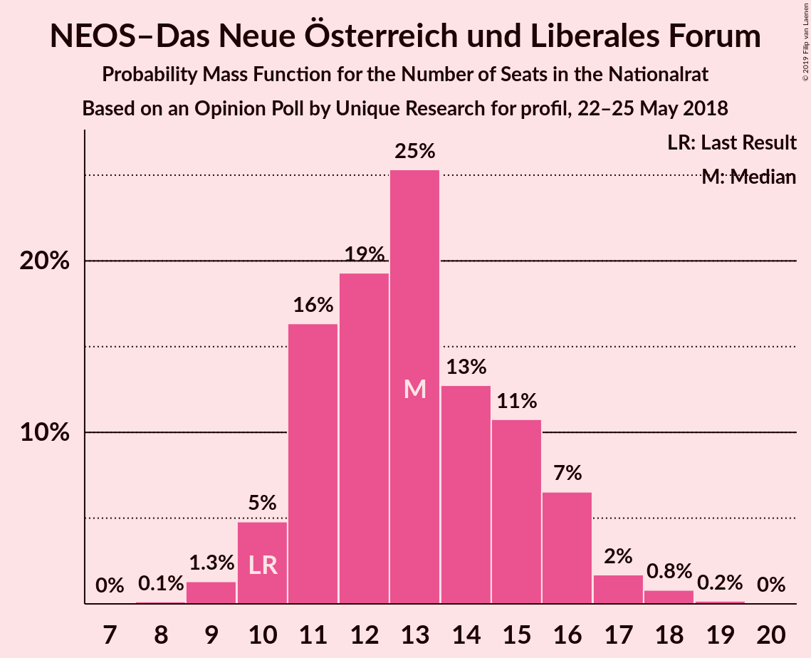
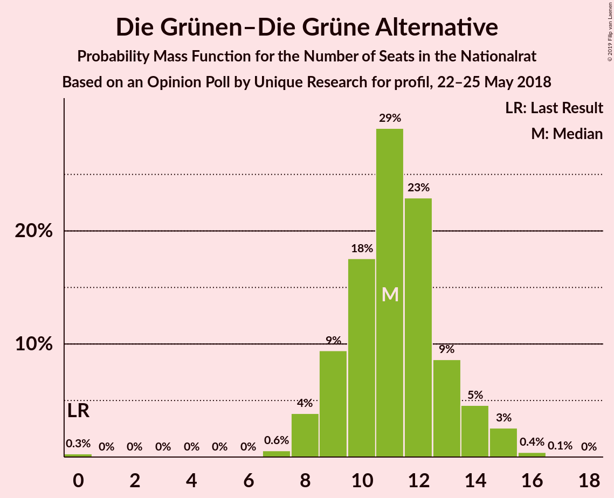
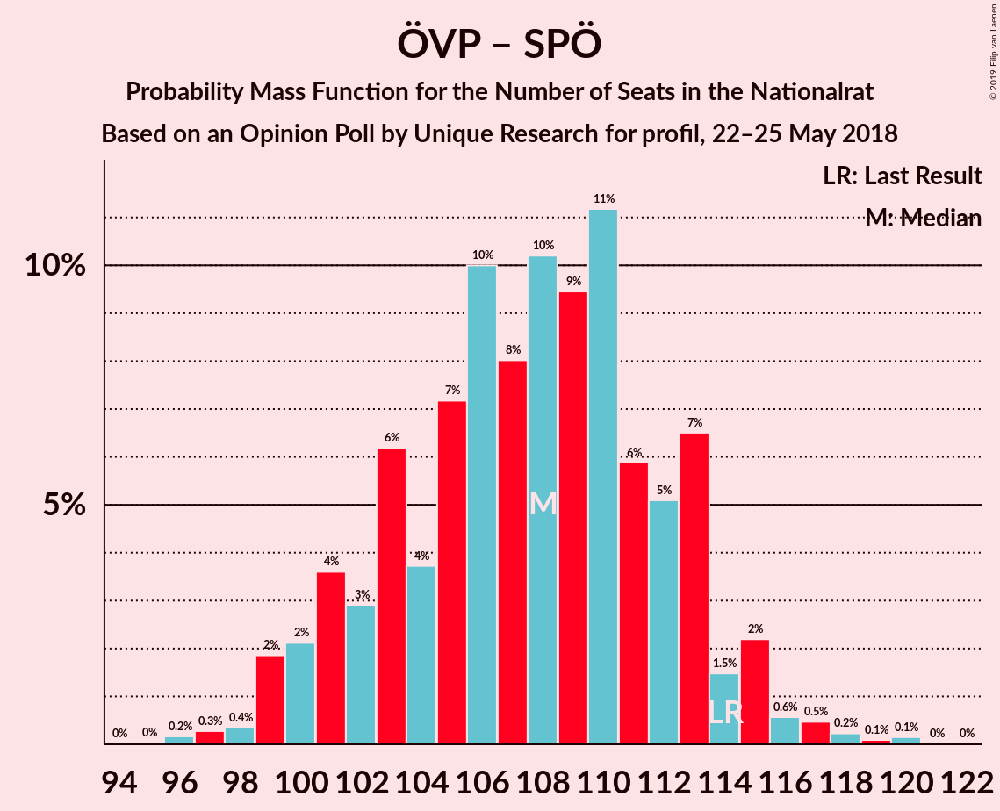

# Opinion Poll by Unique Research for profil, 22–25 May 2018

<a href="#voting-intentions">Voting Intentions</a> | <a href="#seats">Seats</a> | <a href="#coalitions">Coalitions</a> | <a href="#technical-information">Technical Information</a>

## Voting Intentions

### Confidence Intervals

| Party | Last Result | Poll Result | 80% Confidence Interval | 90% Confidence Interval | 95% Confidence Interval | 99% Confidence Interval |
|:-----:|:-----------:|:-----------:|:-----------------------:|:-----------------------:|:-----------------------:|:-----------------------:|
| Österreichische Volkspartei | 31.5% | 32.0% | 29.9–34.2% |29.4–34.8% |28.9–35.3% |27.9–36.4% |
| Sozialdemokratische Partei Österreichs | 26.9% | 25.0% | 23.1–27.0% |22.6–27.6% |22.1–28.1% |21.2–29.1% |
| Freiheitliche Partei Österreichs | 26.0% | 25.0% | 23.1–27.0% |22.6–27.6% |22.1–28.1% |21.2–29.1% |
| NEOS–Das Neue Österreich und Liberales Forum | 5.3% | 7.0% | 6.0–8.3% |5.7–8.7% |5.4–9.0% |5.0–9.6% |
| Die Grünen–Die Grüne Alternative | 3.8% | 6.0% | 5.0–7.2% |4.8–7.6% |4.6–7.9% |4.1–8.5% |
| JETZT–Liste Pilz | 4.4% | 4.0% | 3.2–5.0% |3.0–5.3% |2.9–5.6% |2.5–6.1% |

*Note:* The poll result column reflects the actual value used in the calculations. Published results may vary slightly, and in addition be rounded to fewer digits.

## Seats

### Confidence Intervals

| Party | Last Result | Median | 80% Confidence Interval | 90% Confidence Interval | 95% Confidence Interval | 99% Confidence Interval |
|:-----:|:-----------:|:------:|:-----------------------:|:-----------------------:|:-----------------------:|:-----------------------:|
| <a href="#österreichische-volkspartei">Österreichische Volkspartei</a> | 62 | 60 | 56–65 |55–66 |54–67 |52–69 |
| <a href="#sozialdemokratische-partei-österreichs">Sozialdemokratische Partei Österreichs</a> | 52 | 47 | 43–51 |42–52 |41–53 |39–56 |
| <a href="#freiheitliche-partei-österreichs">Freiheitliche Partei Österreichs</a> | 51 | 47 | 43–51 |42–52 |41–53 |39–55 |
| <a href="#neos–das-neue-österreich-und-liberales-forum">NEOS–Das Neue Österreich und Liberales Forum</a> | 10 | 13 | 11–15 |10–16 |10–17 |9–18 |
| <a href="#die-grünen–die-grüne-alternative">Die Grünen–Die Grüne Alternative</a> | 0 | 11 | 9–13 |9–14 |8–15 |7–16 |
| <a href="#jetzt–liste-pilz">JETZT–Liste Pilz</a> | 8 | 7 | 0–9 |0–9 |0–10 |0–11 |

### Österreichische Volkspartei

*For a full overview of the results for this party, see the [Österreichische Volkspartei](party-österreichischevolkspartei.html) page.*

| Number of Seats | Probability | Accumulated | Special Marks |
|:---------------:|:-----------:|:-----------:|:-------------:|
| 50 | 0.1% | 100% |  |
| 51 | 0.3% | 99.9% |  |
| 52 | 0.5% | 99.6% |  |
| 53 | 1.0% | 99.1% |  |
| 54 | 2% | 98% |  |
| 55 | 3% | 96% |  |
| 56 | 5% | 93% |  |
| 57 | 6% | 88% |  |
| 58 | 6% | 82% |  |
| 59 | 15% | 76% |  |
| 60 | 11% | 61% | Median |
| 61 | 11% | 50% |  |
| 62 | 11% | 39% | Last Result |
| 63 | 11% | 29% |  |
| 64 | 6% | 17% |  |
| 65 | 5% | 11% |  |
| 66 | 2% | 7% |  |
| 67 | 3% | 4% |  |
| 68 | 0.7% | 2% |  |
| 69 | 0.5% | 0.9% |  |
| 70 | 0.3% | 0.4% |  |
| 71 | 0.1% | 0.1% |  |
| 72 | 0% | 0.1% |  |
| 73 | 0% | 0% |  |

### Sozialdemokratische Partei Österreichs

*For a full overview of the results for this party, see the [Sozialdemokratische Partei Österreichs](party-sozialdemokratischeparteiösterreichs.html) page.*

| Number of Seats | Probability | Accumulated | Special Marks |
|:---------------:|:-----------:|:-----------:|:-------------:|
| 37 | 0% | 100% |  |
| 38 | 0.1% | 99.9% |  |
| 39 | 0.5% | 99.9% |  |
| 40 | 0.9% | 99.3% |  |
| 41 | 1.3% | 98% |  |
| 42 | 5% | 97% |  |
| 43 | 4% | 92% |  |
| 44 | 8% | 88% |  |
| 45 | 12% | 80% |  |
| 46 | 8% | 68% |  |
| 47 | 18% | 60% | Median |
| 48 | 12% | 42% |  |
| 49 | 8% | 30% |  |
| 50 | 9% | 23% |  |
| 51 | 7% | 13% |  |
| 52 | 2% | 7% | Last Result |
| 53 | 3% | 5% |  |
| 54 | 0.8% | 2% |  |
| 55 | 0.4% | 0.9% |  |
| 56 | 0.4% | 0.5% |  |
| 57 | 0.1% | 0.1% |  |
| 58 | 0% | 0.1% |  |
| 59 | 0% | 0% |  |

### Freiheitliche Partei Österreichs

*For a full overview of the results for this party, see the [Freiheitliche Partei Österreichs](party-freiheitlicheparteiösterreichs.html) page.*

| Number of Seats | Probability | Accumulated | Special Marks |
|:---------------:|:-----------:|:-----------:|:-------------:|
| 37 | 0% | 100% |  |
| 38 | 0.2% | 99.9% |  |
| 39 | 0.4% | 99.8% |  |
| 40 | 0.7% | 99.4% |  |
| 41 | 2% | 98.7% |  |
| 42 | 2% | 97% |  |
| 43 | 6% | 95% |  |
| 44 | 8% | 89% |  |
| 45 | 10% | 81% |  |
| 46 | 14% | 72% |  |
| 47 | 12% | 58% | Median |
| 48 | 11% | 46% |  |
| 49 | 13% | 35% |  |
| 50 | 9% | 22% |  |
| 51 | 7% | 13% | Last Result |
| 52 | 3% | 6% |  |
| 53 | 1.3% | 3% |  |
| 54 | 1.0% | 2% |  |
| 55 | 0.4% | 0.8% |  |
| 56 | 0.2% | 0.4% |  |
| 57 | 0.1% | 0.2% |  |
| 58 | 0% | 0.1% |  |
| 59 | 0% | 0% |  |

### NEOS–Das Neue Österreich und Liberales Forum

*For a full overview of the results for this party, see the [NEOS–Das Neue Österreich und Liberales Forum](party-neos–dasneueösterreichundliberalesforum.html) page.*

| Number of Seats | Probability | Accumulated | Special Marks |
|:---------------:|:-----------:|:-----------:|:-------------:|
| 8 | 0.1% | 100% |  |
| 9 | 1.3% | 99.9% |  |
| 10 | 5% | 98.5% | Last Result |
| 11 | 16% | 94% |  |
| 12 | 19% | 77% |  |
| 13 | 25% | 58% | Median |
| 14 | 13% | 33% |  |
| 15 | 11% | 20% |  |
| 16 | 7% | 9% |  |
| 17 | 2% | 3% |  |
| 18 | 0.8% | 1.0% |  |
| 19 | 0.2% | 0.2% |  |
| 20 | 0% | 0% |  |

### Die Grünen–Die Grüne Alternative

*For a full overview of the results for this party, see the [Die Grünen–Die Grüne Alternative](party-diegrünen–diegrünealternative.html) page.*

| Number of Seats | Probability | Accumulated | Special Marks |
|:---------------:|:-----------:|:-----------:|:-------------:|
| 0 | 0.3% | 100% | Last Result |
| 1 | 0% | 99.7% |  |
| 2 | 0% | 99.7% |  |
| 3 | 0% | 99.7% |  |
| 4 | 0% | 99.7% |  |
| 5 | 0% | 99.7% |  |
| 6 | 0% | 99.7% |  |
| 7 | 0.6% | 99.7% |  |
| 8 | 4% | 99.1% |  |
| 9 | 9% | 95% |  |
| 10 | 18% | 86% |  |
| 11 | 29% | 68% | Median |
| 12 | 23% | 39% |  |
| 13 | 9% | 16% |  |
| 14 | 5% | 8% |  |
| 15 | 3% | 3% |  |
| 16 | 0.4% | 0.5% |  |
| 17 | 0.1% | 0.1% |  |
| 18 | 0% | 0% |  |

### JETZT–Liste Pilz

*For a full overview of the results for this party, see the [JETZT–Liste Pilz](party-jetzt–listepilz.html) page.*

| Number of Seats | Probability | Accumulated | Special Marks |
|:---------------:|:-----------:|:-----------:|:-------------:|
| 0 | 49% | 100% |  |
| 1 | 0% | 51% |  |
| 2 | 0% | 51% |  |
| 3 | 0% | 51% |  |
| 4 | 0% | 51% |  |
| 5 | 0% | 51% |  |
| 6 | 0% | 51% |  |
| 7 | 14% | 51% | Median |
| 8 | 23% | 37% | Last Result |
| 9 | 10% | 14% |  |
| 10 | 3% | 4% |  |
| 11 | 1.1% | 1.3% |  |
| 12 | 0.2% | 0.2% |  |
| 13 | 0% | 0% |  |

## Coalitions

### Confidence Intervals

| Coalition | Last Result | Median | Majority? | 80% Confidence Interval | 90% Confidence Interval | 95% Confidence Interval | 99% Confidence Interval |
|:---------:|:-----------:|:------:|:---------:|:-----------------------:|:-----------------------:|:-----------------------:|:-----------------------:|
| Österreichische Volkspartei – Freiheitliche Partei Österreichs | 113 | 108 | 100% | 103–113 | 101–114 | 100–116 | 98–118 |
| Österreichische Volkspartei – Sozialdemokratische Partei Österreichs | 114 | 108 | 100% | 102–113 | 101–114 | 99–115 | 98–118 |
| Freiheitliche Partei Österreichs – Sozialdemokratische Partei Österreichs | 103 | 94 | 76% | 89–99 | 88–100 | 87–102 | 84–104 |
| Österreichische Volkspartei – NEOS–Das Neue Österreich und Liberales Forum – Die Grünen–Die Grüne Alternative | 72 | 85 | 3% | 80–90 | 78–91 | 77–92 | 75–94 |
| Österreichische Volkspartei – NEOS–Das Neue Österreich und Liberales Forum | 72 | 74 | 0% | 69–79 | 67–80 | 66–81 | 64–83 |
| Österreichische Volkspartei – Die Grünen–Die Grüne Alternative | 62 | 71 | 0% | 67–76 | 66–78 | 65–78 | 62–81 |
| Sozialdemokratische Partei Österreichs – NEOS–Das Neue Österreich und Liberales Forum – Die Grünen–Die Grüne Alternative | 62 | 71 | 0% | 66–76 | 65–77 | 64–78 | 62–81 |
| Österreichische Volkspartei | 62 | 60 | 0% | 56–65 | 55–66 | 54–67 | 52–69 |
| Sozialdemokratische Partei Österreichs | 52 | 47 | 0% | 43–51 | 42–52 | 41–53 | 39–56 |

### Österreichische Volkspartei – Freiheitliche Partei Österreichs

| Number of Seats | Probability | Accumulated | Special Marks |
|:---------------:|:-----------:|:-----------:|:-------------:|
| 95 | 0.1% | 100% |  |
| 96 | 0.1% | 99.9% |  |
| 97 | 0.2% | 99.8% |  |
| 98 | 0.5% | 99.6% |  |
| 99 | 1.3% | 99.1% |  |
| 100 | 1.5% | 98% |  |
| 101 | 3% | 96% |  |
| 102 | 3% | 94% |  |
| 103 | 6% | 90% |  |
| 104 | 5% | 85% |  |
| 105 | 9% | 79% |  |
| 106 | 11% | 70% |  |
| 107 | 7% | 58% | Median |
| 108 | 8% | 52% |  |
| 109 | 9% | 44% |  |
| 110 | 9% | 35% |  |
| 111 | 9% | 27% |  |
| 112 | 6% | 18% |  |
| 113 | 5% | 11% | Last Result |
| 114 | 3% | 7% |  |
| 115 | 1.3% | 4% |  |
| 116 | 1.1% | 3% |  |
| 117 | 0.5% | 2% |  |
| 118 | 0.7% | 1.0% |  |
| 119 | 0.1% | 0.3% |  |
| 120 | 0.1% | 0.1% |  |
| 121 | 0% | 0% |  |

### Österreichische Volkspartei – Sozialdemokratische Partei Österreichs

| Number of Seats | Probability | Accumulated | Special Marks |
|:---------------:|:-----------:|:-----------:|:-------------:|
| 95 | 0% | 100% |  |
| 96 | 0.2% | 99.9% |  |
| 97 | 0.3% | 99.8% |  |
| 98 | 0.4% | 99.5% |  |
| 99 | 2% | 99.1% |  |
| 100 | 2% | 97% |  |
| 101 | 4% | 95% |  |
| 102 | 3% | 92% |  |
| 103 | 6% | 89% |  |
| 104 | 4% | 82% |  |
| 105 | 7% | 79% |  |
| 106 | 10% | 72% |  |
| 107 | 8% | 62% | Median |
| 108 | 10% | 54% |  |
| 109 | 9% | 43% |  |
| 110 | 11% | 34% |  |
| 111 | 6% | 23% |  |
| 112 | 5% | 17% |  |
| 113 | 7% | 12% |  |
| 114 | 1.5% | 5% | Last Result |
| 115 | 2% | 4% |  |
| 116 | 0.6% | 2% |  |
| 117 | 0.5% | 1.0% |  |
| 118 | 0.2% | 0.5% |  |
| 119 | 0.1% | 0.3% |  |
| 120 | 0.1% | 0.2% |  |
| 121 | 0% | 0% |  |

### Freiheitliche Partei Österreichs – Sozialdemokratische Partei Österreichs

| Number of Seats | Probability | Accumulated | Special Marks |
|:---------------:|:-----------:|:-----------:|:-------------:|
| 82 | 0.1% | 100% |  |
| 83 | 0.1% | 99.9% |  |
| 84 | 0.4% | 99.8% |  |
| 85 | 0.5% | 99.4% |  |
| 86 | 0.7% | 98.9% |  |
| 87 | 2% | 98% |  |
| 88 | 3% | 96% |  |
| 89 | 5% | 93% |  |
| 90 | 5% | 88% |  |
| 91 | 8% | 84% |  |
| 92 | 7% | 76% | Majority |
| 93 | 10% | 69% |  |
| 94 | 12% | 59% | Median |
| 95 | 11% | 47% |  |
| 96 | 5% | 36% |  |
| 97 | 10% | 31% |  |
| 98 | 9% | 20% |  |
| 99 | 3% | 12% |  |
| 100 | 4% | 9% |  |
| 101 | 2% | 5% |  |
| 102 | 0.9% | 3% |  |
| 103 | 0.9% | 2% | Last Result |
| 104 | 0.3% | 0.7% |  |
| 105 | 0.3% | 0.4% |  |
| 106 | 0.1% | 0.2% |  |
| 107 | 0% | 0.1% |  |
| 108 | 0% | 0% |  |

### Österreichische Volkspartei – NEOS–Das Neue Österreich und Liberales Forum – Die Grünen–Die Grüne Alternative

| Number of Seats | Probability | Accumulated | Special Marks |
|:---------------:|:-----------:|:-----------:|:-------------:|
| 72 | 0% | 100% | Last Result |
| 73 | 0.1% | 99.9% |  |
| 74 | 0.2% | 99.9% |  |
| 75 | 0.6% | 99.7% |  |
| 76 | 0.7% | 99.1% |  |
| 77 | 2% | 98% |  |
| 78 | 3% | 97% |  |
| 79 | 2% | 94% |  |
| 80 | 6% | 91% |  |
| 81 | 4% | 85% |  |
| 82 | 11% | 81% |  |
| 83 | 10% | 70% |  |
| 84 | 7% | 61% | Median |
| 85 | 14% | 54% |  |
| 86 | 12% | 40% |  |
| 87 | 5% | 28% |  |
| 88 | 9% | 23% |  |
| 89 | 4% | 15% |  |
| 90 | 5% | 11% |  |
| 91 | 3% | 6% |  |
| 92 | 1.2% | 3% | Majority |
| 93 | 0.8% | 2% |  |
| 94 | 0.8% | 1.1% |  |
| 95 | 0.2% | 0.4% |  |
| 96 | 0.1% | 0.2% |  |
| 97 | 0% | 0% |  |

### Österreichische Volkspartei – NEOS–Das Neue Österreich und Liberales Forum

| Number of Seats | Probability | Accumulated | Special Marks |
|:---------------:|:-----------:|:-----------:|:-------------:|
| 62 | 0% | 100% |  |
| 63 | 0.2% | 99.9% |  |
| 64 | 0.4% | 99.7% |  |
| 65 | 0.9% | 99.3% |  |
| 66 | 1.3% | 98% |  |
| 67 | 2% | 97% |  |
| 68 | 2% | 95% |  |
| 69 | 5% | 92% |  |
| 70 | 8% | 87% |  |
| 71 | 11% | 79% |  |
| 72 | 6% | 68% | Last Result |
| 73 | 9% | 61% | Median |
| 74 | 13% | 52% |  |
| 75 | 11% | 39% |  |
| 76 | 11% | 29% |  |
| 77 | 5% | 18% |  |
| 78 | 3% | 13% |  |
| 79 | 5% | 10% |  |
| 80 | 3% | 5% |  |
| 81 | 1.3% | 3% |  |
| 82 | 0.5% | 1.2% |  |
| 83 | 0.4% | 0.8% |  |
| 84 | 0.3% | 0.4% |  |
| 85 | 0% | 0.1% |  |
| 86 | 0% | 0% |  |

### Österreichische Volkspartei – Die Grünen–Die Grüne Alternative

| Number of Seats | Probability | Accumulated | Special Marks |
|:---------------:|:-----------:|:-----------:|:-------------:|
| 59 | 0% | 100% |  |
| 60 | 0.1% | 99.9% |  |
| 61 | 0.2% | 99.9% |  |
| 62 | 0.4% | 99.7% | Last Result |
| 63 | 0.5% | 99.3% |  |
| 64 | 1.2% | 98.8% |  |
| 65 | 2% | 98% |  |
| 66 | 4% | 96% |  |
| 67 | 5% | 92% |  |
| 68 | 5% | 87% |  |
| 69 | 10% | 83% |  |
| 70 | 11% | 73% |  |
| 71 | 13% | 62% | Median |
| 72 | 7% | 49% |  |
| 73 | 9% | 42% |  |
| 74 | 10% | 33% |  |
| 75 | 11% | 24% |  |
| 76 | 3% | 12% |  |
| 77 | 3% | 9% |  |
| 78 | 4% | 6% |  |
| 79 | 1.1% | 2% |  |
| 80 | 0.3% | 1.0% |  |
| 81 | 0.3% | 0.7% |  |
| 82 | 0.2% | 0.4% |  |
| 83 | 0.1% | 0.1% |  |
| 84 | 0% | 0% |  |

### Sozialdemokratische Partei Österreichs – NEOS–Das Neue Österreich und Liberales Forum – Die Grünen–Die Grüne Alternative

| Number of Seats | Probability | Accumulated | Special Marks |
|:---------------:|:-----------:|:-----------:|:-------------:|
| 59 | 0% | 100% |  |
| 60 | 0.1% | 99.9% |  |
| 61 | 0.2% | 99.8% |  |
| 62 | 0.4% | 99.7% | Last Result |
| 63 | 0.7% | 99.3% |  |
| 64 | 1.3% | 98.6% |  |
| 65 | 4% | 97% |  |
| 66 | 5% | 94% |  |
| 67 | 4% | 89% |  |
| 68 | 6% | 84% |  |
| 69 | 10% | 79% |  |
| 70 | 10% | 69% |  |
| 71 | 13% | 59% | Median |
| 72 | 12% | 46% |  |
| 73 | 8% | 34% |  |
| 74 | 8% | 25% |  |
| 75 | 7% | 17% |  |
| 76 | 3% | 10% |  |
| 77 | 2% | 7% |  |
| 78 | 3% | 5% |  |
| 79 | 0.9% | 2% |  |
| 80 | 0.5% | 1.0% |  |
| 81 | 0.3% | 0.5% |  |
| 82 | 0.1% | 0.2% |  |
| 83 | 0.1% | 0.1% |  |
| 84 | 0% | 0% |  |

### Österreichische Volkspartei

| Number of Seats | Probability | Accumulated | Special Marks |
|:---------------:|:-----------:|:-----------:|:-------------:|
| 50 | 0.1% | 100% |  |
| 51 | 0.3% | 99.9% |  |
| 52 | 0.5% | 99.6% |  |
| 53 | 1.0% | 99.1% |  |
| 54 | 2% | 98% |  |
| 55 | 3% | 96% |  |
| 56 | 5% | 93% |  |
| 57 | 6% | 88% |  |
| 58 | 6% | 82% |  |
| 59 | 15% | 76% |  |
| 60 | 11% | 61% | Median |
| 61 | 11% | 50% |  |
| 62 | 11% | 39% | Last Result |
| 63 | 11% | 29% |  |
| 64 | 6% | 17% |  |
| 65 | 5% | 11% |  |
| 66 | 2% | 7% |  |
| 67 | 3% | 4% |  |
| 68 | 0.7% | 2% |  |
| 69 | 0.5% | 0.9% |  |
| 70 | 0.3% | 0.4% |  |
| 71 | 0.1% | 0.1% |  |
| 72 | 0% | 0.1% |  |
| 73 | 0% | 0% |  |

### Sozialdemokratische Partei Österreichs

| Number of Seats | Probability | Accumulated | Special Marks |
|:---------------:|:-----------:|:-----------:|:-------------:|
| 37 | 0% | 100% |  |
| 38 | 0.1% | 99.9% |  |
| 39 | 0.5% | 99.9% |  |
| 40 | 0.9% | 99.3% |  |
| 41 | 1.3% | 98% |  |
| 42 | 5% | 97% |  |
| 43 | 4% | 92% |  |
| 44 | 8% | 88% |  |
| 45 | 12% | 80% |  |
| 46 | 8% | 68% |  |
| 47 | 18% | 60% | Median |
| 48 | 12% | 42% |  |
| 49 | 8% | 30% |  |
| 50 | 9% | 23% |  |
| 51 | 7% | 13% |  |
| 52 | 2% | 7% | Last Result |
| 53 | 3% | 5% |  |
| 54 | 0.8% | 2% |  |
| 55 | 0.4% | 0.9% |  |
| 56 | 0.4% | 0.5% |  |
| 57 | 0.1% | 0.1% |  |
| 58 | 0% | 0.1% |  |
| 59 | 0% | 0% |  |

## Technical Information

### Opinion Poll

+ **Polling firm:** Unique Research
+ **Commissioner(s):** profil
+ **Fieldwork period:** 22–25 May 2018

### Calculations

+ **Sample size:** 800
+ **Simulations done:** 131,072
+ **Error estimate:** 0.66%

