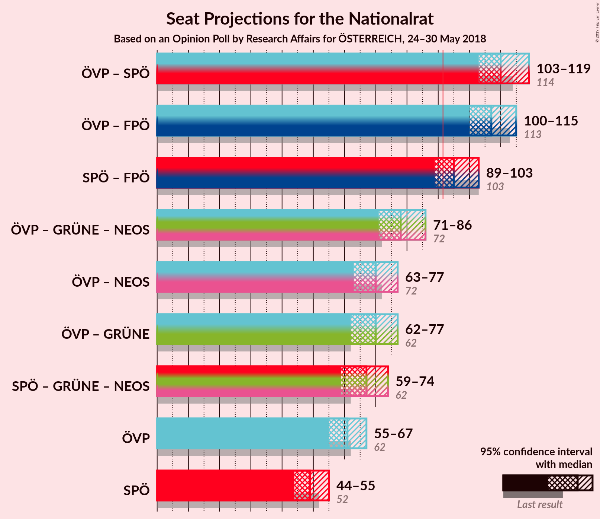

# Opinion Poll by Research Affairs for ÖSTERREICH, 24–30 May 2018

<a href="#voting-intentions">Voting Intentions</a> | <a href="#seats">Seats</a> | <a href="#coalitions">Coalitions</a> | <a href="#technical-information">Technical Information</a>

## Voting Intentions

### Confidence Intervals

| Party | Last Result | Poll Result | 80% Confidence Interval | 90% Confidence Interval | 95% Confidence Interval | 99% Confidence Interval |
|:-----:|:-----------:|:-----------:|:-----------------------:|:-----------------------:|:-----------------------:|:-----------------------:|
| Österreichische Volkspartei | 31.5% | 32.0% | 30.1–33.9% |29.6–34.5% |29.2–35.0% |28.3–35.9% |
| Sozialdemokratische Partei Österreichs | 26.9% | 26.0% | 24.3–27.9% |23.8–28.4% |23.4–28.8% |22.6–29.7% |
| Freiheitliche Partei Österreichs | 26.0% | 24.0% | 22.4–25.8% |21.9–26.3% |21.5–26.8% |20.7–27.6% |
| NEOS–Das Neue Österreich und Liberales Forum | 5.3% | 5.0% | 4.2–6.0% |4.0–6.3% |3.8–6.5% |3.5–7.0% |
| Die Grünen–Die Grüne Alternative | 3.8% | 5.0% | 4.2–6.0% |4.0–6.3% |3.8–6.5% |3.5–7.0% |
| JETZT–Liste Pilz | 4.4% | 3.0% | 2.4–3.8% |2.2–4.0% |2.1–4.3% |1.8–4.7% |

*Note:* The poll result column reflects the actual value used in the calculations. Published results may vary slightly, and in addition be rounded to fewer digits.

## Seats

### Confidence Intervals

| Party | Last Result | Median | 80% Confidence Interval | 90% Confidence Interval | 95% Confidence Interval | 99% Confidence Interval |
|:-----:|:-----------:|:------:|:-----------------------:|:-----------------------:|:-----------------------:|:-----------------------:|
| <a href="#österreichische-volkspartei">Österreichische Volkspartei</a> | 62 | 61 | 57–65 |56–66 |55–67 |53–70 |
| <a href="#sozialdemokratische-partei-österreichs">Sozialdemokratische Partei Österreichs</a> | 52 | 49 | 46–53 |45–55 |44–55 |42–57 |
| <a href="#freiheitliche-partei-österreichs">Freiheitliche Partei Österreichs</a> | 51 | 46 | 42–49 |41–50 |41–51 |39–53 |
| <a href="#neos–das-neue-österreich-und-liberales-forum">NEOS–Das Neue Österreich und Liberales Forum</a> | 10 | 9 | 8–11 |7–11 |0–12 |0–13 |
| <a href="#die-grünen–die-grüne-alternative">Die Grünen–Die Grüne Alternative</a> | 0 | 9 | 7–11 |0–11 |0–12 |0–13 |
| <a href="#jetzt–liste-pilz">JETZT–Liste Pilz</a> | 8 | 0 | 0 |0–7 |0–7 |0–8 |

### Österreichische Volkspartei

*For a full overview of the results for this party, see the [Österreichische Volkspartei](party-österreichischevolkspartei.html) page.*

| Number of Seats | Probability | Accumulated | Special Marks |
|:---------------:|:-----------:|:-----------:|:-------------:|
| 51 | 0% | 100% |  |
| 52 | 0.1% | 99.9% |  |
| 53 | 0.5% | 99.8% |  |
| 54 | 0.8% | 99.3% |  |
| 55 | 1.3% | 98.5% |  |
| 56 | 5% | 97% |  |
| 57 | 5% | 92% |  |
| 58 | 9% | 87% |  |
| 59 | 12% | 79% |  |
| 60 | 8% | 67% |  |
| 61 | 21% | 58% | Median |
| 62 | 9% | 37% | Last Result |
| 63 | 8% | 29% |  |
| 64 | 9% | 21% |  |
| 65 | 4% | 12% |  |
| 66 | 4% | 8% |  |
| 67 | 2% | 4% |  |
| 68 | 1.1% | 2% |  |
| 69 | 0.7% | 1.2% |  |
| 70 | 0.3% | 0.5% |  |
| 71 | 0.1% | 0.2% |  |
| 72 | 0.1% | 0.1% |  |
| 73 | 0% | 0% |  |

### Sozialdemokratische Partei Österreichs

*For a full overview of the results for this party, see the [Sozialdemokratische Partei Österreichs](party-sozialdemokratischeparteiösterreichs.html) page.*

| Number of Seats | Probability | Accumulated | Special Marks |
|:---------------:|:-----------:|:-----------:|:-------------:|
| 41 | 0.1% | 100% |  |
| 42 | 0.4% | 99.8% |  |
| 43 | 0.8% | 99.5% |  |
| 44 | 2% | 98.7% |  |
| 45 | 4% | 97% |  |
| 46 | 7% | 93% |  |
| 47 | 14% | 86% |  |
| 48 | 14% | 71% |  |
| 49 | 12% | 57% | Median |
| 50 | 12% | 46% |  |
| 51 | 9% | 34% |  |
| 52 | 8% | 25% | Last Result |
| 53 | 7% | 16% |  |
| 54 | 4% | 9% |  |
| 55 | 3% | 5% |  |
| 56 | 1.0% | 2% |  |
| 57 | 0.6% | 1.1% |  |
| 58 | 0.3% | 0.5% |  |
| 59 | 0.1% | 0.2% |  |
| 60 | 0% | 0.1% |  |
| 61 | 0% | 0% |  |

### Freiheitliche Partei Österreichs

*For a full overview of the results for this party, see the [Freiheitliche Partei Österreichs](party-freiheitlicheparteiösterreichs.html) page.*

| Number of Seats | Probability | Accumulated | Special Marks |
|:---------------:|:-----------:|:-----------:|:-------------:|
| 37 | 0.1% | 100% |  |
| 38 | 0.3% | 99.9% |  |
| 39 | 0.6% | 99.7% |  |
| 40 | 1.2% | 99.0% |  |
| 41 | 4% | 98% |  |
| 42 | 9% | 94% |  |
| 43 | 6% | 85% |  |
| 44 | 12% | 79% |  |
| 45 | 13% | 66% |  |
| 46 | 9% | 54% | Median |
| 47 | 17% | 45% |  |
| 48 | 13% | 27% |  |
| 49 | 6% | 14% |  |
| 50 | 3% | 8% |  |
| 51 | 3% | 5% | Last Result |
| 52 | 1.1% | 2% |  |
| 53 | 0.5% | 1.0% |  |
| 54 | 0.3% | 0.5% |  |
| 55 | 0.1% | 0.2% |  |
| 56 | 0.1% | 0.1% |  |
| 57 | 0% | 0% |  |

### NEOS–Das Neue Österreich und Liberales Forum

*For a full overview of the results for this party, see the [NEOS–Das Neue Österreich und Liberales Forum](party-neos–dasneueösterreichundliberalesforum.html) page.*

| Number of Seats | Probability | Accumulated | Special Marks |
|:---------------:|:-----------:|:-----------:|:-------------:|
| 0 | 5% | 100% |  |
| 1 | 0% | 95% |  |
| 2 | 0% | 95% |  |
| 3 | 0% | 95% |  |
| 4 | 0% | 95% |  |
| 5 | 0% | 95% |  |
| 6 | 0% | 95% |  |
| 7 | 5% | 95% |  |
| 8 | 26% | 90% |  |
| 9 | 18% | 64% | Median |
| 10 | 28% | 46% | Last Result |
| 11 | 14% | 18% |  |
| 12 | 3% | 4% |  |
| 13 | 1.0% | 1.2% |  |
| 14 | 0.2% | 0.2% |  |
| 15 | 0% | 0% |  |

### Die Grünen–Die Grüne Alternative

*For a full overview of the results for this party, see the [Die Grünen–Die Grüne Alternative](party-diegrünen–diegrünealternative.html) page.*

| Number of Seats | Probability | Accumulated | Special Marks |
|:---------------:|:-----------:|:-----------:|:-------------:|
| 0 | 6% | 100% | Last Result |
| 1 | 0% | 94% |  |
| 2 | 0% | 94% |  |
| 3 | 0% | 94% |  |
| 4 | 0% | 94% |  |
| 5 | 0% | 94% |  |
| 6 | 0% | 94% |  |
| 7 | 4% | 94% |  |
| 8 | 23% | 90% |  |
| 9 | 27% | 67% | Median |
| 10 | 22% | 40% |  |
| 11 | 13% | 17% |  |
| 12 | 3% | 5% |  |
| 13 | 1.1% | 1.3% |  |
| 14 | 0.2% | 0.2% |  |
| 15 | 0% | 0% |  |

### JETZT–Liste Pilz

*For a full overview of the results for this party, see the [JETZT–Liste Pilz](party-jetzt–listepilz.html) page.*

| Number of Seats | Probability | Accumulated | Special Marks |
|:---------------:|:-----------:|:-----------:|:-------------:|
| 0 | 94% | 100% | Median |
| 1 | 0% | 6% |  |
| 2 | 0% | 6% |  |
| 3 | 0% | 6% |  |
| 4 | 0% | 6% |  |
| 5 | 0% | 6% |  |
| 6 | 0% | 6% |  |
| 7 | 3% | 6% |  |
| 8 | 2% | 2% | Last Result |
| 9 | 0.2% | 0.3% |  |
| 10 | 0% | 0% |  |

## Coalitions

### Confidence Intervals

| Coalition | Last Result | Median | Majority? | 80% Confidence Interval | 90% Confidence Interval | 95% Confidence Interval | 99% Confidence Interval |
|:---------:|:-----------:|:------:|:---------:|:-----------------------:|:-----------------------:|:-----------------------:|:-----------------------:|
| Österreichische Volkspartei – Sozialdemokratische Partei Österreichs | 114 | 110 | 100% | 106–115 | 105–117 | 103–119 | 101–122 |
| Österreichische Volkspartei – Freiheitliche Partei Österreichs | 113 | 107 | 100% | 102–111 | 101–113 | 100–115 | 98–118 |
| Sozialdemokratische Partei Österreichs – Freiheitliche Partei Österreichs | 103 | 95 | 84% | 91–100 | 90–101 | 89–103 | 86–106 |
| Österreichische Volkspartei – Die Grünen–Die Grüne Alternative – NEOS–Das Neue Österreich und Liberales Forum | 72 | 78 | 0% | 74–83 | 72–84 | 71–86 | 68–88 |
| Österreichische Volkspartei – NEOS–Das Neue Österreich und Liberales Forum | 72 | 70 | 0% | 66–74 | 64–75 | 63–77 | 60–79 |
| Österreichische Volkspartei – Die Grünen–Die Grüne Alternative | 62 | 70 | 0% | 66–74 | 64–75 | 62–77 | 60–79 |
| Sozialdemokratische Partei Österreichs – Die Grünen–Die Grüne Alternative – NEOS–Das Neue Österreich und Liberales Forum | 62 | 67 | 0% | 63–72 | 61–73 | 59–74 | 57–76 |
| Österreichische Volkspartei | 62 | 61 | 0% | 57–65 | 56–66 | 55–67 | 53–70 |
| Sozialdemokratische Partei Österreichs | 52 | 49 | 0% | 46–53 | 45–55 | 44–55 | 42–57 |

### Österreichische Volkspartei – Sozialdemokratische Partei Österreichs

| Number of Seats | Probability | Accumulated | Special Marks |
|:---------------:|:-----------:|:-----------:|:-------------:|
| 99 | 0.1% | 100% |  |
| 100 | 0.1% | 99.9% |  |
| 101 | 0.3% | 99.8% |  |
| 102 | 0.7% | 99.5% |  |
| 103 | 1.4% | 98.8% |  |
| 104 | 2% | 97% |  |
| 105 | 4% | 95% |  |
| 106 | 6% | 92% |  |
| 107 | 10% | 86% |  |
| 108 | 10% | 76% |  |
| 109 | 11% | 66% |  |
| 110 | 8% | 55% | Median |
| 111 | 13% | 47% |  |
| 112 | 6% | 34% |  |
| 113 | 10% | 28% |  |
| 114 | 4% | 18% | Last Result |
| 115 | 4% | 14% |  |
| 116 | 3% | 10% |  |
| 117 | 3% | 7% |  |
| 118 | 1.3% | 4% |  |
| 119 | 0.9% | 3% |  |
| 120 | 1.1% | 2% |  |
| 121 | 0.5% | 1.1% |  |
| 122 | 0.2% | 0.6% |  |
| 123 | 0.3% | 0.4% |  |
| 124 | 0.1% | 0.2% |  |
| 125 | 0% | 0.1% |  |
| 126 | 0% | 0.1% |  |
| 127 | 0% | 0% |  |

### Österreichische Volkspartei – Freiheitliche Partei Österreichs

| Number of Seats | Probability | Accumulated | Special Marks |
|:---------------:|:-----------:|:-----------:|:-------------:|
| 95 | 0.1% | 100% |  |
| 96 | 0.1% | 99.9% |  |
| 97 | 0.3% | 99.8% |  |
| 98 | 0.4% | 99.5% |  |
| 99 | 1.3% | 99.1% |  |
| 100 | 2% | 98% |  |
| 101 | 3% | 96% |  |
| 102 | 4% | 92% |  |
| 103 | 9% | 88% |  |
| 104 | 7% | 79% |  |
| 105 | 12% | 72% |  |
| 106 | 9% | 60% |  |
| 107 | 9% | 52% | Median |
| 108 | 14% | 43% |  |
| 109 | 7% | 29% |  |
| 110 | 7% | 22% |  |
| 111 | 5% | 15% |  |
| 112 | 2% | 9% |  |
| 113 | 3% | 7% | Last Result |
| 114 | 2% | 5% |  |
| 115 | 1.1% | 3% |  |
| 116 | 0.7% | 2% |  |
| 117 | 0.4% | 0.9% |  |
| 118 | 0.3% | 0.5% |  |
| 119 | 0.1% | 0.3% |  |
| 120 | 0% | 0.2% |  |
| 121 | 0.1% | 0.2% |  |
| 122 | 0.1% | 0.1% |  |
| 123 | 0% | 0% |  |

### Sozialdemokratische Partei Österreichs – Freiheitliche Partei Österreichs

| Number of Seats | Probability | Accumulated | Special Marks |
|:---------------:|:-----------:|:-----------:|:-------------:|
| 84 | 0.1% | 100% |  |
| 85 | 0.1% | 99.9% |  |
| 86 | 0.4% | 99.8% |  |
| 87 | 0.5% | 99.4% |  |
| 88 | 1.1% | 98.9% |  |
| 89 | 3% | 98% |  |
| 90 | 4% | 95% |  |
| 91 | 7% | 91% |  |
| 92 | 9% | 84% | Majority |
| 93 | 9% | 75% |  |
| 94 | 6% | 66% |  |
| 95 | 12% | 60% | Median |
| 96 | 14% | 48% |  |
| 97 | 11% | 34% |  |
| 98 | 7% | 23% |  |
| 99 | 4% | 16% |  |
| 100 | 3% | 12% |  |
| 101 | 4% | 8% |  |
| 102 | 2% | 5% |  |
| 103 | 1.3% | 3% | Last Result |
| 104 | 0.5% | 1.4% |  |
| 105 | 0.3% | 0.9% |  |
| 106 | 0.3% | 0.6% |  |
| 107 | 0.1% | 0.3% |  |
| 108 | 0.1% | 0.2% |  |
| 109 | 0% | 0.1% |  |
| 110 | 0% | 0.1% |  |
| 111 | 0% | 0.1% |  |
| 112 | 0% | 0% |  |

### Österreichische Volkspartei – Die Grünen–Die Grüne Alternative – NEOS–Das Neue Österreich und Liberales Forum

| Number of Seats | Probability | Accumulated | Special Marks |
|:---------------:|:-----------:|:-----------:|:-------------:|
| 63 | 0% | 100% |  |
| 64 | 0% | 99.9% |  |
| 65 | 0% | 99.9% |  |
| 66 | 0.1% | 99.9% |  |
| 67 | 0.2% | 99.8% |  |
| 68 | 0.1% | 99.5% |  |
| 69 | 0.3% | 99.4% |  |
| 70 | 0.8% | 99.1% |  |
| 71 | 2% | 98% |  |
| 72 | 2% | 96% | Last Result |
| 73 | 2% | 94% |  |
| 74 | 4% | 92% |  |
| 75 | 5% | 88% |  |
| 76 | 9% | 83% |  |
| 77 | 12% | 74% |  |
| 78 | 14% | 63% |  |
| 79 | 9% | 49% | Median |
| 80 | 8% | 40% |  |
| 81 | 11% | 32% |  |
| 82 | 8% | 22% |  |
| 83 | 6% | 14% |  |
| 84 | 3% | 8% |  |
| 85 | 2% | 5% |  |
| 86 | 1.3% | 3% |  |
| 87 | 0.8% | 1.4% |  |
| 88 | 0.3% | 0.6% |  |
| 89 | 0.2% | 0.3% |  |
| 90 | 0.1% | 0.1% |  |
| 91 | 0% | 0% |  |

### Österreichische Volkspartei – NEOS–Das Neue Österreich und Liberales Forum

| Number of Seats | Probability | Accumulated | Special Marks |
|:---------------:|:-----------:|:-----------:|:-------------:|
| 57 | 0.1% | 100% |  |
| 58 | 0.1% | 99.9% |  |
| 59 | 0.1% | 99.8% |  |
| 60 | 0.3% | 99.7% |  |
| 61 | 0.5% | 99.4% |  |
| 62 | 0.8% | 98.9% |  |
| 63 | 1.3% | 98% |  |
| 64 | 2% | 97% |  |
| 65 | 3% | 94% |  |
| 66 | 7% | 91% |  |
| 67 | 8% | 84% |  |
| 68 | 8% | 76% |  |
| 69 | 16% | 69% |  |
| 70 | 9% | 53% | Median |
| 71 | 13% | 44% |  |
| 72 | 10% | 30% | Last Result |
| 73 | 6% | 20% |  |
| 74 | 7% | 14% |  |
| 75 | 3% | 8% |  |
| 76 | 2% | 5% |  |
| 77 | 1.1% | 3% |  |
| 78 | 0.6% | 2% |  |
| 79 | 0.6% | 0.9% |  |
| 80 | 0.3% | 0.4% |  |
| 81 | 0.1% | 0.1% |  |
| 82 | 0% | 0.1% |  |
| 83 | 0% | 0% |  |

### Österreichische Volkspartei – Die Grünen–Die Grüne Alternative

| Number of Seats | Probability | Accumulated | Special Marks |
|:---------------:|:-----------:|:-----------:|:-------------:|
| 57 | 0.1% | 100% |  |
| 58 | 0.1% | 99.9% |  |
| 59 | 0.1% | 99.8% |  |
| 60 | 0.3% | 99.7% |  |
| 61 | 1.3% | 99.4% |  |
| 62 | 1.1% | 98% | Last Result |
| 63 | 1.2% | 97% |  |
| 64 | 2% | 96% |  |
| 65 | 4% | 94% |  |
| 66 | 8% | 90% |  |
| 67 | 9% | 82% |  |
| 68 | 8% | 73% |  |
| 69 | 10% | 65% |  |
| 70 | 13% | 55% | Median |
| 71 | 15% | 42% |  |
| 72 | 6% | 26% |  |
| 73 | 7% | 20% |  |
| 74 | 4% | 13% |  |
| 75 | 4% | 9% |  |
| 76 | 2% | 5% |  |
| 77 | 2% | 3% |  |
| 78 | 0.6% | 1.4% |  |
| 79 | 0.4% | 0.7% |  |
| 80 | 0.2% | 0.3% |  |
| 81 | 0.1% | 0.1% |  |
| 82 | 0% | 0.1% |  |
| 83 | 0% | 0% |  |

### Sozialdemokratische Partei Österreichs – Die Grünen–Die Grüne Alternative – NEOS–Das Neue Österreich und Liberales Forum

| Number of Seats | Probability | Accumulated | Special Marks |
|:---------------:|:-----------:|:-----------:|:-------------:|
| 53 | 0% | 100% |  |
| 54 | 0.1% | 99.9% |  |
| 55 | 0.1% | 99.9% |  |
| 56 | 0.3% | 99.8% |  |
| 57 | 0.5% | 99.5% |  |
| 58 | 1.1% | 99.1% |  |
| 59 | 0.9% | 98% |  |
| 60 | 2% | 97% |  |
| 61 | 2% | 95% |  |
| 62 | 2% | 93% | Last Result |
| 63 | 6% | 91% |  |
| 64 | 9% | 86% |  |
| 65 | 8% | 76% |  |
| 66 | 13% | 69% |  |
| 67 | 9% | 56% | Median |
| 68 | 12% | 47% |  |
| 69 | 9% | 34% |  |
| 70 | 8% | 26% |  |
| 71 | 5% | 17% |  |
| 72 | 6% | 12% |  |
| 73 | 3% | 6% |  |
| 74 | 1.5% | 3% |  |
| 75 | 0.7% | 2% |  |
| 76 | 0.4% | 0.8% |  |
| 77 | 0.3% | 0.4% |  |
| 78 | 0.1% | 0.1% |  |
| 79 | 0% | 0% |  |

### Österreichische Volkspartei

| Number of Seats | Probability | Accumulated | Special Marks |
|:---------------:|:-----------:|:-----------:|:-------------:|
| 51 | 0% | 100% |  |
| 52 | 0.1% | 99.9% |  |
| 53 | 0.5% | 99.8% |  |
| 54 | 0.8% | 99.3% |  |
| 55 | 1.3% | 98.5% |  |
| 56 | 5% | 97% |  |
| 57 | 5% | 92% |  |
| 58 | 9% | 87% |  |
| 59 | 12% | 79% |  |
| 60 | 8% | 67% |  |
| 61 | 21% | 58% | Median |
| 62 | 9% | 37% | Last Result |
| 63 | 8% | 29% |  |
| 64 | 9% | 21% |  |
| 65 | 4% | 12% |  |
| 66 | 4% | 8% |  |
| 67 | 2% | 4% |  |
| 68 | 1.1% | 2% |  |
| 69 | 0.7% | 1.2% |  |
| 70 | 0.3% | 0.5% |  |
| 71 | 0.1% | 0.2% |  |
| 72 | 0.1% | 0.1% |  |
| 73 | 0% | 0% |  |

### Sozialdemokratische Partei Österreichs

| Number of Seats | Probability | Accumulated | Special Marks |
|:---------------:|:-----------:|:-----------:|:-------------:|
| 41 | 0.1% | 100% |  |
| 42 | 0.4% | 99.8% |  |
| 43 | 0.8% | 99.5% |  |
| 44 | 2% | 98.7% |  |
| 45 | 4% | 97% |  |
| 46 | 7% | 93% |  |
| 47 | 14% | 86% |  |
| 48 | 14% | 71% |  |
| 49 | 12% | 57% | Median |
| 50 | 12% | 46% |  |
| 51 | 9% | 34% |  |
| 52 | 8% | 25% | Last Result |
| 53 | 7% | 16% |  |
| 54 | 4% | 9% |  |
| 55 | 3% | 5% |  |
| 56 | 1.0% | 2% |  |
| 57 | 0.6% | 1.1% |  |
| 58 | 0.3% | 0.5% |  |
| 59 | 0.1% | 0.2% |  |
| 60 | 0% | 0.1% |  |
| 61 | 0% | 0% |  |

## Technical Information

### Opinion Poll

+ **Polling firm:** Research Affairs
+ **Commissioner(s):** ÖSTERREICH
+ **Fieldwork period:** 24–30 May 2018

### Calculations

+ **Sample size:** 1003
+ **Simulations done:** 131,072
+ **Error estimate:** 0.90%

