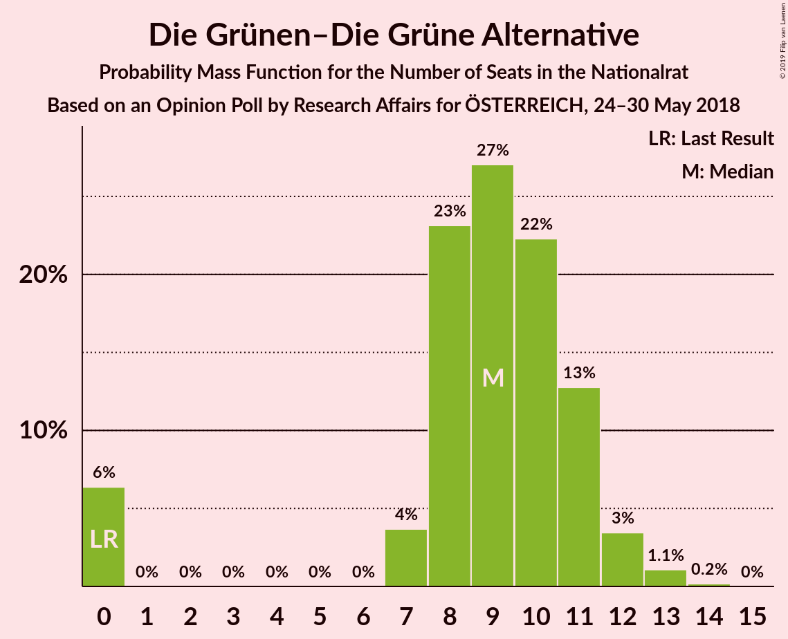
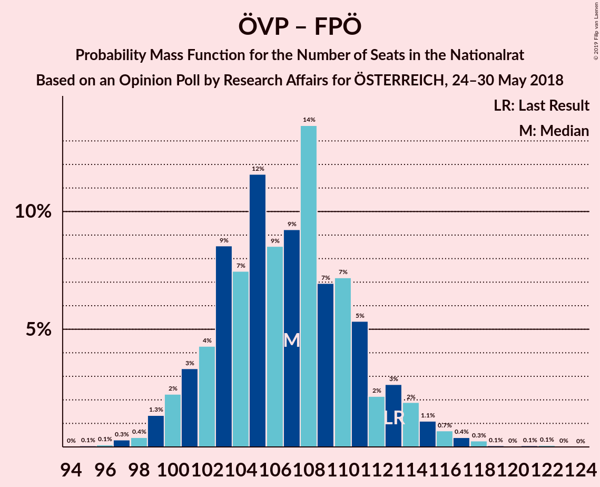

# Opinion Poll by Research Affairs for ÖSTERREICH, 24–30 May 2018

<a href="#voting-intentions">Voting Intentions</a> | <a href="#seats">Seats</a> | <a href="#coalitions">Coalitions</a> | <a href="#technical-information">Technical Information</a>

## Voting Intentions

### Confidence Intervals

| Party | Last Result | Poll Result | 80% Confidence Interval | 90% Confidence Interval | 95% Confidence Interval | 99% Confidence Interval |
|:-----:|:-----------:|:-----------:|:-----------------------:|:-----------------------:|:-----------------------:|:-----------------------:|
| Österreichische Volkspartei | 31.5% | 32.0% | 30.1–33.9% |29.6–34.5% |29.2–35.0% |28.3–35.9% |
| Sozialdemokratische Partei Österreichs | 26.9% | 26.0% | 24.3–27.9% |23.8–28.4% |23.4–28.8% |22.6–29.7% |
| Freiheitliche Partei Österreichs | 26.0% | 24.0% | 22.4–25.8% |21.9–26.3% |21.5–26.8% |20.7–27.6% |
| NEOS–Das Neue Österreich und Liberales Forum | 5.3% | 5.0% | 4.2–6.0% |4.0–6.3% |3.8–6.5% |3.5–7.0% |
| Die Grünen–Die Grüne Alternative | 3.8% | 5.0% | 4.2–6.0% |4.0–6.3% |3.8–6.5% |3.5–7.0% |
| JETZT–Liste Pilz | 4.4% | 3.0% | 2.4–3.8% |2.2–4.0% |2.1–4.3% |1.8–4.7% |

*Note:* The poll result column reflects the actual value used in the calculations. Published results may vary slightly, and in addition be rounded to fewer digits.

## Seats

### Confidence Intervals

| Party | Last Result | Median | 80% Confidence Interval | 90% Confidence Interval | 95% Confidence Interval | 99% Confidence Interval |
|:-----:|:-----------:|:------:|:-----------------------:|:-----------------------:|:-----------------------:|:-----------------------:|
| <a href="#österreichische-volkspartei">Österreichische Volkspartei</a> | 62 | 59 | 57–64 |56–64 |56–64 |56–74 |
| <a href="#sozialdemokratische-partei-österreichs">Sozialdemokratische Partei Österreichs</a> | 52 | 47 | 44–58 |43–60 |43–60 |42–61 |
| <a href="#freiheitliche-partei-österreichs">Freiheitliche Partei Österreichs</a> | 51 | 48 | 42–52 |42–52 |42–52 |41–52 |
| <a href="#neos–das-neue-österreich-und-liberales-forum">NEOS–Das Neue Österreich und Liberales Forum</a> | 10 | 8 | 0–10 |0–10 |0–13 |0–14 |
| <a href="#die-grünen–die-grüne-alternative">Die Grünen–Die Grüne Alternative</a> | 0 | 9 | 7–13 |0–13 |0–13 |0–14 |
| <a href="#jetzt–liste-pilz">JETZT–Liste Pilz</a> | 8 | 0 | 0–8 |0–8 |0–8 |0–8 |

### Österreichische Volkspartei

*For a full overview of the results for this party, see the [Österreichische Volkspartei](party-österreichischevolkspartei.html) page.*

| Number of Seats | Probability | Accumulated | Special Marks |
|:---------------:|:-----------:|:-----------:|:-------------:|
| 51 | 0.1% | 100% |  |
| 52 | 0% | 99.9% |  |
| 53 | 0% | 99.9% |  |
| 54 | 0% | 99.9% |  |
| 55 | 0% | 99.9% |  |
| 56 | 6% | 99.9% |  |
| 57 | 28% | 93% |  |
| 58 | 2% | 65% |  |
| 59 | 16% | 63% | Median |
| 60 | 15% | 47% |  |
| 61 | 15% | 32% |  |
| 62 | 1.1% | 17% | Last Result |
| 63 | 3% | 16% |  |
| 64 | 11% | 13% |  |
| 65 | 0.2% | 2% |  |
| 66 | 0% | 1.5% |  |
| 67 | 0% | 1.5% |  |
| 68 | 0% | 1.4% |  |
| 69 | 0.1% | 1.4% |  |
| 70 | 0% | 1.3% |  |
| 71 | 0.1% | 1.3% |  |
| 72 | 0.6% | 1.2% |  |
| 73 | 0% | 0.6% |  |
| 74 | 0.1% | 0.6% |  |
| 75 | 0% | 0.5% |  |
| 76 | 0.5% | 0.5% |  |
| 77 | 0% | 0% |  |

### Sozialdemokratische Partei Österreichs

*For a full overview of the results for this party, see the [Sozialdemokratische Partei Österreichs](party-sozialdemokratischeparteiösterreichs.html) page.*

| Number of Seats | Probability | Accumulated | Special Marks |
|:---------------:|:-----------:|:-----------:|:-------------:|
| 38 | 0.1% | 100% |  |
| 39 | 0% | 99.9% |  |
| 40 | 0% | 99.9% |  |
| 41 | 0.1% | 99.9% |  |
| 42 | 0.5% | 99.9% |  |
| 43 | 8% | 99.3% |  |
| 44 | 5% | 91% |  |
| 45 | 9% | 86% |  |
| 46 | 19% | 77% |  |
| 47 | 18% | 58% | Median |
| 48 | 5% | 40% |  |
| 49 | 15% | 34% |  |
| 50 | 0.4% | 19% |  |
| 51 | 0.1% | 19% |  |
| 52 | 0% | 19% | Last Result |
| 53 | 0.7% | 19% |  |
| 54 | 0.2% | 18% |  |
| 55 | 0.1% | 18% |  |
| 56 | 0% | 18% |  |
| 57 | 0.5% | 18% |  |
| 58 | 11% | 18% |  |
| 59 | 0.3% | 7% |  |
| 60 | 4% | 6% |  |
| 61 | 2% | 2% |  |
| 62 | 0% | 0% |  |

### Freiheitliche Partei Österreichs

*For a full overview of the results for this party, see the [Freiheitliche Partei Österreichs](party-freiheitlicheparteiösterreichs.html) page.*

| Number of Seats | Probability | Accumulated | Special Marks |
|:---------------:|:-----------:|:-----------:|:-------------:|
| 36 | 0.1% | 100% |  |
| 37 | 0% | 99.9% |  |
| 38 | 0% | 99.9% |  |
| 39 | 0% | 99.9% |  |
| 40 | 0% | 99.9% |  |
| 41 | 2% | 99.9% |  |
| 42 | 12% | 98% |  |
| 43 | 12% | 86% |  |
| 44 | 5% | 74% |  |
| 45 | 2% | 69% |  |
| 46 | 0% | 67% |  |
| 47 | 15% | 67% |  |
| 48 | 11% | 52% | Median |
| 49 | 2% | 41% |  |
| 50 | 12% | 39% |  |
| 51 | 16% | 27% | Last Result |
| 52 | 10% | 11% |  |
| 53 | 0% | 0.1% |  |
| 54 | 0% | 0.1% |  |
| 55 | 0% | 0% |  |

### NEOS–Das Neue Österreich und Liberales Forum

*For a full overview of the results for this party, see the [NEOS–Das Neue Österreich und Liberales Forum](party-neos–dasneueösterreichundliberalesforum.html) page.*

| Number of Seats | Probability | Accumulated | Special Marks |
|:---------------:|:-----------:|:-----------:|:-------------:|
| 0 | 28% | 100% |  |
| 1 | 0% | 72% |  |
| 2 | 0% | 72% |  |
| 3 | 0% | 72% |  |
| 4 | 0% | 72% |  |
| 5 | 0% | 72% |  |
| 6 | 0% | 72% |  |
| 7 | 21% | 72% |  |
| 8 | 2% | 50% | Median |
| 9 | 28% | 48% |  |
| 10 | 17% | 20% | Last Result |
| 11 | 0.3% | 4% |  |
| 12 | 0.1% | 3% |  |
| 13 | 1.2% | 3% |  |
| 14 | 2% | 2% |  |
| 15 | 0% | 0% |  |

### Die Grünen–Die Grüne Alternative

*For a full overview of the results for this party, see the [Die Grünen–Die Grüne Alternative](party-diegrünen–diegrünealternative.html) page.*

| Number of Seats | Probability | Accumulated | Special Marks |
|:---------------:|:-----------:|:-----------:|:-------------:|
| 0 | 8% | 100% | Last Result |
| 1 | 0% | 92% |  |
| 2 | 0% | 92% |  |
| 3 | 0% | 92% |  |
| 4 | 0% | 92% |  |
| 5 | 0% | 92% |  |
| 6 | 0% | 92% |  |
| 7 | 11% | 92% |  |
| 8 | 3% | 81% |  |
| 9 | 36% | 78% | Median |
| 10 | 9% | 42% |  |
| 11 | 5% | 33% |  |
| 12 | 1.1% | 28% |  |
| 13 | 25% | 27% |  |
| 14 | 2% | 2% |  |
| 15 | 0% | 0% |  |

### JETZT–Liste Pilz

*For a full overview of the results for this party, see the [JETZT–Liste Pilz](party-jetzt–listepilz.html) page.*

| Number of Seats | Probability | Accumulated | Special Marks |
|:---------------:|:-----------:|:-----------:|:-------------:|
| 0 | 63% | 100% | Median |
| 1 | 0% | 37% |  |
| 2 | 0% | 37% |  |
| 3 | 0% | 37% |  |
| 4 | 0% | 37% |  |
| 5 | 0% | 37% |  |
| 6 | 0% | 37% |  |
| 7 | 6% | 37% |  |
| 8 | 31% | 31% | Last Result |
| 9 | 0% | 0% |  |

## Coalitions

### Confidence Intervals

| Coalition | Last Result | Median | Majority? | 80% Confidence Interval | 90% Confidence Interval | 95% Confidence Interval | 99% Confidence Interval |
|:---------:|:-----------:|:------:|:---------:|:-----------------------:|:-----------------------:|:-----------------------:|:-----------------------:|
| Österreichische Volkspartei – Sozialdemokratische Partei Österreichs | 114 | 107 | 100% | 103–115 | 103–119 | 103–121 | 102–128 |
| Österreichische Volkspartei – Freiheitliche Partei Österreichs | 113 | 108 | 100% | 100–112 | 100–113 | 100–113 | 100–120 |
| Sozialdemokratische Partei Österreichs – Freiheitliche Partei Österreichs | 103 | 97 | 85% | 86–101 | 85–104 | 85–106 | 84–106 |
| Österreichische Volkspartei | 62 | 59 | 0% | 57–64 | 56–64 | 56–64 | 56–74 |
| Sozialdemokratische Partei Österreichs | 52 | 47 | 0% | 44–58 | 43–60 | 43–60 | 42–61 |

### Österreichische Volkspartei – Sozialdemokratische Partei Österreichs

| Number of Seats | Probability | Accumulated | Special Marks |
|:---------------:|:-----------:|:-----------:|:-------------:|
| 101 | 0.1% | 100% |  |
| 102 | 2% | 99.9% |  |
| 103 | 15% | 98% |  |
| 104 | 12% | 83% |  |
| 105 | 6% | 71% |  |
| 106 | 14% | 64% | Median |
| 107 | 15% | 50% |  |
| 108 | 0.1% | 35% |  |
| 109 | 2% | 35% |  |
| 110 | 2% | 32% |  |
| 111 | 9% | 30% |  |
| 112 | 2% | 21% |  |
| 113 | 0% | 19% |  |
| 114 | 0% | 19% | Last Result |
| 115 | 11% | 19% |  |
| 116 | 0% | 8% |  |
| 117 | 0.1% | 8% |  |
| 118 | 0.3% | 8% |  |
| 119 | 4% | 8% |  |
| 120 | 0% | 4% |  |
| 121 | 2% | 4% |  |
| 122 | 0% | 1.4% |  |
| 123 | 0.2% | 1.4% |  |
| 124 | 0.1% | 1.2% |  |
| 125 | 0.6% | 1.1% |  |
| 126 | 0% | 0.5% |  |
| 127 | 0% | 0.5% |  |
| 128 | 0% | 0.5% |  |
| 129 | 0% | 0.5% |  |
| 130 | 0% | 0.5% |  |
| 131 | 0% | 0.5% |  |
| 132 | 0% | 0.5% |  |
| 133 | 0.5% | 0.5% |  |
| 134 | 0% | 0% |  |

### Österreichische Volkspartei – Freiheitliche Partei Österreichs

| Number of Seats | Probability | Accumulated | Special Marks |
|:---------------:|:-----------:|:-----------:|:-------------:|
| 96 | 0% | 100% |  |
| 97 | 0% | 99.9% |  |
| 98 | 0.1% | 99.9% |  |
| 99 | 0% | 99.8% |  |
| 100 | 12% | 99.8% |  |
| 101 | 0% | 87% |  |
| 102 | 12% | 87% |  |
| 103 | 5% | 75% |  |
| 104 | 0.4% | 70% |  |
| 105 | 2% | 70% |  |
| 106 | 6% | 68% |  |
| 107 | 3% | 61% | Median |
| 108 | 29% | 58% |  |
| 109 | 2% | 29% |  |
| 110 | 1.0% | 26% |  |
| 111 | 11% | 26% |  |
| 112 | 9% | 15% |  |
| 113 | 4% | 6% | Last Result |
| 114 | 0.4% | 2% |  |
| 115 | 0.1% | 1.3% |  |
| 116 | 0.1% | 1.2% |  |
| 117 | 0% | 1.2% |  |
| 118 | 0.1% | 1.1% |  |
| 119 | 0% | 1.1% |  |
| 120 | 0.6% | 1.1% |  |
| 121 | 0% | 0.5% |  |
| 122 | 0% | 0.5% |  |
| 123 | 0% | 0.5% |  |
| 124 | 0% | 0.5% |  |
| 125 | 0% | 0.5% |  |
| 126 | 0.5% | 0.5% |  |
| 127 | 0% | 0% |  |

### Sozialdemokratische Partei Österreichs – Freiheitliche Partei Österreichs

| Number of Seats | Probability | Accumulated | Special Marks |
|:---------------:|:-----------:|:-----------:|:-------------:|
| 83 | 0.1% | 100% |  |
| 84 | 1.4% | 99.9% |  |
| 85 | 7% | 98.5% |  |
| 86 | 5% | 91% |  |
| 87 | 0% | 86% |  |
| 88 | 0% | 86% |  |
| 89 | 0.1% | 86% |  |
| 90 | 0.4% | 86% |  |
| 91 | 0.1% | 85% |  |
| 92 | 0.5% | 85% | Majority |
| 93 | 15% | 85% |  |
| 94 | 0% | 69% |  |
| 95 | 10% | 69% | Median |
| 96 | 3% | 59% |  |
| 97 | 17% | 57% |  |
| 98 | 7% | 40% |  |
| 99 | 0% | 33% |  |
| 100 | 14% | 33% |  |
| 101 | 12% | 19% |  |
| 102 | 0% | 7% |  |
| 103 | 0.3% | 7% | Last Result |
| 104 | 4% | 7% |  |
| 105 | 0% | 3% |  |
| 106 | 2% | 3% |  |
| 107 | 0.5% | 0.5% |  |
| 108 | 0% | 0% |  |

### Österreichische Volkspartei

| Number of Seats | Probability | Accumulated | Special Marks |
|:---------------:|:-----------:|:-----------:|:-------------:|
| 51 | 0.1% | 100% |  |
| 52 | 0% | 99.9% |  |
| 53 | 0% | 99.9% |  |
| 54 | 0% | 99.9% |  |
| 55 | 0% | 99.9% |  |
| 56 | 6% | 99.9% |  |
| 57 | 28% | 93% |  |
| 58 | 2% | 65% |  |
| 59 | 16% | 63% | Median |
| 60 | 15% | 47% |  |
| 61 | 15% | 32% |  |
| 62 | 1.1% | 17% | Last Result |
| 63 | 3% | 16% |  |
| 64 | 11% | 13% |  |
| 65 | 0.2% | 2% |  |
| 66 | 0% | 1.5% |  |
| 67 | 0% | 1.5% |  |
| 68 | 0% | 1.4% |  |
| 69 | 0.1% | 1.4% |  |
| 70 | 0% | 1.3% |  |
| 71 | 0.1% | 1.3% |  |
| 72 | 0.6% | 1.2% |  |
| 73 | 0% | 0.6% |  |
| 74 | 0.1% | 0.6% |  |
| 75 | 0% | 0.5% |  |
| 76 | 0.5% | 0.5% |  |
| 77 | 0% | 0% |  |

### Sozialdemokratische Partei Österreichs

| Number of Seats | Probability | Accumulated | Special Marks |
|:---------------:|:-----------:|:-----------:|:-------------:|
| 38 | 0.1% | 100% |  |
| 39 | 0% | 99.9% |  |
| 40 | 0% | 99.9% |  |
| 41 | 0.1% | 99.9% |  |
| 42 | 0.5% | 99.9% |  |
| 43 | 8% | 99.3% |  |
| 44 | 5% | 91% |  |
| 45 | 9% | 86% |  |
| 46 | 19% | 77% |  |
| 47 | 18% | 58% | Median |
| 48 | 5% | 40% |  |
| 49 | 15% | 34% |  |
| 50 | 0.4% | 19% |  |
| 51 | 0.1% | 19% |  |
| 52 | 0% | 19% | Last Result |
| 53 | 0.7% | 19% |  |
| 54 | 0.2% | 18% |  |
| 55 | 0.1% | 18% |  |
| 56 | 0% | 18% |  |
| 57 | 0.5% | 18% |  |
| 58 | 11% | 18% |  |
| 59 | 0.3% | 7% |  |
| 60 | 4% | 6% |  |
| 61 | 2% | 2% |  |
| 62 | 0% | 0% |  |

## Technical Information

### Opinion Poll

+ **Polling firm:** Research Affairs
+ **Commissioner(s):** ÖSTERREICH
+ **Fieldwork period:** 24–30 May 2018

### Calculations

+ **Sample size:** 1003
+ **Simulations done:** 1,024
+ **Error estimate:** 2.10%

