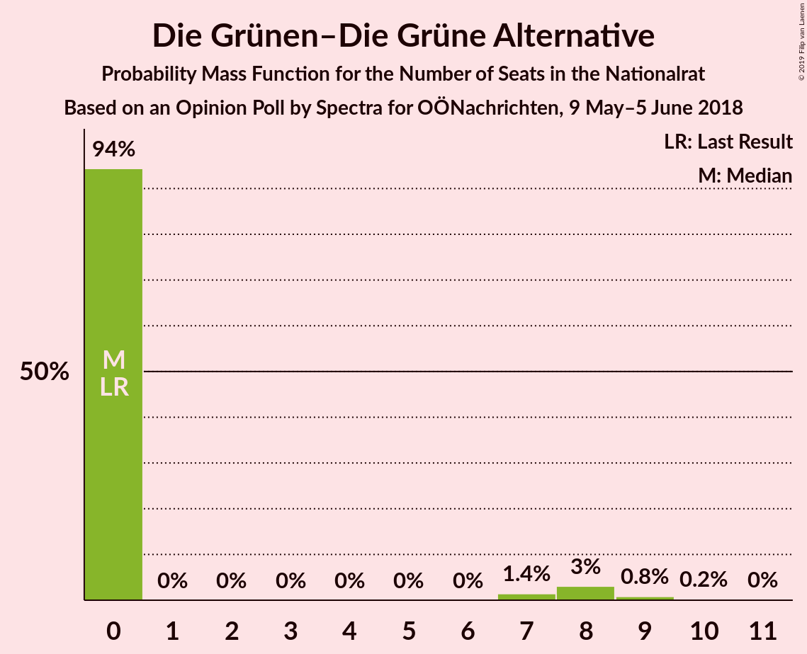

# Opinion Poll by Spectra for OÖNachrichten, 9 May–5 June 2018

<a href="#voting-intentions">Voting Intentions</a> | <a href="#seats">Seats</a> | <a href="#coalitions">Coalitions</a> | <a href="#technical-information">Technical Information</a>

## Voting Intentions

### Confidence Intervals

| Party | Last Result | Poll Result | 80% Confidence Interval | 90% Confidence Interval | 95% Confidence Interval | 99% Confidence Interval |
|:-----:|:-----------:|:-----------:|:-----------------------:|:-----------------------:|:-----------------------:|:-----------------------:|
| Österreichische Volkspartei | 31.5% | 33.1% | 30.9–35.3% |30.3–36.0% |29.7–36.6% |28.7–37.7% |
| Freiheitliche Partei Österreichs | 26.0% | 28.0% | 25.9–30.2% |25.4–30.8% |24.9–31.4% |23.9–32.4% |
| Sozialdemokratische Partei Österreichs | 26.9% | 27.0% | 25.0–29.2% |24.4–29.9% |23.9–30.4% |23.0–31.5% |
| NEOS–Das Neue Österreich und Liberales Forum | 5.3% | 4.0% | 3.2–5.1% |3.0–5.4% |2.8–5.6% |2.4–6.2% |
| JETZT–Liste Pilz | 4.4% | 4.0% | 3.2–5.1% |3.0–5.4% |2.8–5.6% |2.4–6.2% |
| Die Grünen–Die Grüne Alternative | 3.8% | 3.0% | 2.3–4.0% |2.1–4.3% |2.0–4.5% |1.7–5.0% |

*Note:* The poll result column reflects the actual value used in the calculations. Published results may vary slightly, and in addition be rounded to fewer digits.

## Seats

### Confidence Intervals

| Party | Last Result | Median | 80% Confidence Interval | 90% Confidence Interval | 95% Confidence Interval | 99% Confidence Interval |
|:-----:|:-----------:|:------:|:-----------------------:|:-----------------------:|:-----------------------:|:-----------------------:|
| <a href="#österreichische-volkspartei">Österreichische Volkspartei</a> | 62 | 65 | 63–74 |63–74 |63–74 |63–74 |
| <a href="#freiheitliche-partei-österreichs">Freiheitliche Partei Österreichs</a> | 51 | 56 | 51–60 |51–60 |45–60 |45–61 |
| <a href="#sozialdemokratische-partei-österreichs">Sozialdemokratische Partei Österreichs</a> | 52 | 48 | 44–51 |44–51 |44–58 |41–64 |
| <a href="#neos–das-neue-österreich-und-liberales-forum">NEOS–Das Neue Österreich und Liberales Forum</a> | 10 | 0 | 0–10 |0–10 |0–10 |0–10 |
| <a href="#jetzt–liste-pilz">JETZT–Liste Pilz</a> | 8 | 8 | 8–10 |8–10 |0–10 |0–10 |
| <a href="#die-grünen–die-grüne-alternative">Die Grünen–Die Grüne Alternative</a> | 0 | 0 | 0 |0 |0 |0–8 |

### Österreichische Volkspartei

*For a full overview of the results for this party, see the [Österreichische Volkspartei](party-österreichischevolkspartei.html) page.*

| Number of Seats | Probability | Accumulated | Special Marks |
|:---------------:|:-----------:|:-----------:|:-------------:|
| 54 | 0% | 100% |  |
| 55 | 0% | 99.9% |  |
| 56 | 0% | 99.9% |  |
| 57 | 0.3% | 99.9% |  |
| 58 | 0% | 99.6% |  |
| 59 | 0% | 99.6% |  |
| 60 | 0% | 99.6% |  |
| 61 | 0% | 99.6% |  |
| 62 | 0% | 99.6% | Last Result |
| 63 | 29% | 99.6% |  |
| 64 | 2% | 71% |  |
| 65 | 22% | 69% | Median |
| 66 | 0% | 46% |  |
| 67 | 16% | 46% |  |
| 68 | 1.1% | 30% |  |
| 69 | 0% | 29% |  |
| 70 | 0% | 29% |  |
| 71 | 0% | 29% |  |
| 72 | 3% | 29% |  |
| 73 | 1.3% | 26% |  |
| 74 | 25% | 25% |  |
| 75 | 0% | 0% |  |

### Freiheitliche Partei Österreichs

*For a full overview of the results for this party, see the [Freiheitliche Partei Österreichs](party-freiheitlicheparteiösterreichs.html) page.*

| Number of Seats | Probability | Accumulated | Special Marks |
|:---------------:|:-----------:|:-----------:|:-------------:|
| 42 | 0.1% | 100% |  |
| 43 | 0% | 99.9% |  |
| 44 | 0% | 99.9% |  |
| 45 | 3% | 99.8% |  |
| 46 | 0% | 97% |  |
| 47 | 0.7% | 97% |  |
| 48 | 0% | 97% |  |
| 49 | 0.4% | 97% |  |
| 50 | 0% | 96% |  |
| 51 | 26% | 96% | Last Result |
| 52 | 0.1% | 70% |  |
| 53 | 0% | 70% |  |
| 54 | 0% | 70% |  |
| 55 | 2% | 70% |  |
| 56 | 33% | 68% | Median |
| 57 | 0% | 35% |  |
| 58 | 0% | 34% |  |
| 59 | 0% | 34% |  |
| 60 | 33% | 34% |  |
| 61 | 1.3% | 1.3% |  |
| 62 | 0% | 0% |  |

### Sozialdemokratische Partei Österreichs

*For a full overview of the results for this party, see the [Sozialdemokratische Partei Österreichs](party-sozialdemokratischeparteiösterreichs.html) page.*

| Number of Seats | Probability | Accumulated | Special Marks |
|:---------------:|:-----------:|:-----------:|:-------------:|
| 41 | 1.3% | 100% |  |
| 42 | 0% | 98.7% |  |
| 43 | 0% | 98.7% |  |
| 44 | 46% | 98.7% |  |
| 45 | 0.1% | 53% |  |
| 46 | 0% | 53% |  |
| 47 | 0% | 53% |  |
| 48 | 28% | 53% | Median |
| 49 | 4% | 25% |  |
| 50 | 0.1% | 21% |  |
| 51 | 17% | 21% |  |
| 52 | 0.3% | 4% | Last Result |
| 53 | 0% | 4% |  |
| 54 | 0% | 4% |  |
| 55 | 0% | 4% |  |
| 56 | 1.1% | 4% |  |
| 57 | 0% | 3% |  |
| 58 | 0.1% | 3% |  |
| 59 | 0% | 2% |  |
| 60 | 0% | 2% |  |
| 61 | 0% | 2% |  |
| 62 | 0.4% | 2% |  |
| 63 | 0% | 2% |  |
| 64 | 2% | 2% |  |
| 65 | 0% | 0% |  |

### NEOS–Das Neue Österreich und Liberales Forum

*For a full overview of the results for this party, see the [NEOS–Das Neue Österreich und Liberales Forum](party-neos–dasneueösterreichundliberalesforum.html) page.*

| Number of Seats | Probability | Accumulated | Special Marks |
|:---------------:|:-----------:|:-----------:|:-------------:|
| 0 | 50% | 100% | Median |
| 1 | 0% | 50% |  |
| 2 | 0% | 50% |  |
| 3 | 0% | 50% |  |
| 4 | 0% | 50% |  |
| 5 | 0% | 50% |  |
| 6 | 0% | 50% |  |
| 7 | 0% | 50% |  |
| 8 | 31% | 50% |  |
| 9 | 0.4% | 18% |  |
| 10 | 18% | 18% | Last Result |
| 11 | 0.2% | 0.2% |  |
| 12 | 0% | 0% |  |

### JETZT–Liste Pilz

*For a full overview of the results for this party, see the [JETZT–Liste Pilz](party-jetzt–listepilz.html) page.*

| Number of Seats | Probability | Accumulated | Special Marks |
|:---------------:|:-----------:|:-----------:|:-------------:|
| 0 | 4% | 100% |  |
| 1 | 0% | 96% |  |
| 2 | 0% | 96% |  |
| 3 | 0% | 96% |  |
| 4 | 0% | 96% |  |
| 5 | 0% | 96% |  |
| 6 | 0% | 96% |  |
| 7 | 0% | 96% |  |
| 8 | 47% | 96% | Last Result, Median |
| 9 | 21% | 49% |  |
| 10 | 28% | 29% |  |
| 11 | 0% | 0.3% |  |
| 12 | 0% | 0.3% |  |
| 13 | 0% | 0.3% |  |
| 14 | 0.3% | 0.3% |  |
| 15 | 0% | 0% |  |

### Die Grünen–Die Grüne Alternative

*For a full overview of the results for this party, see the [Die Grünen–Die Grüne Alternative](party-diegrünen–diegrünealternative.html) page.*

| Number of Seats | Probability | Accumulated | Special Marks |
|:---------------:|:-----------:|:-----------:|:-------------:|
| 0 | 98.6% | 100% | Last Result, Median |
| 1 | 0% | 1.4% |  |
| 2 | 0% | 1.4% |  |
| 3 | 0% | 1.4% |  |
| 4 | 0% | 1.4% |  |
| 5 | 0% | 1.4% |  |
| 6 | 0% | 1.4% |  |
| 7 | 0% | 1.4% |  |
| 8 | 1.2% | 1.3% |  |
| 9 | 0% | 0.1% |  |
| 10 | 0% | 0.1% |  |
| 11 | 0% | 0.1% |  |
| 12 | 0.1% | 0.1% |  |
| 13 | 0% | 0% |  |

## Coalitions

### Confidence Intervals

| Coalition | Last Result | Median | Majority? | 80% Confidence Interval | 90% Confidence Interval | 95% Confidence Interval | 99% Confidence Interval |
|:---------:|:-----------:|:------:|:---------:|:-----------------------:|:-----------------------:|:-----------------------:|:-----------------------:|
| Österreichische Volkspartei – Freiheitliche Partei Österreichs | 113 | 123 | 100% | 121–125 | 119–125 | 117–125 | 112–134 |
| Österreichische Volkspartei – Sozialdemokratische Partei Österreichs | 114 | 114 | 100% | 107–122 | 107–122 | 107–125 | 107–128 |
| Freiheitliche Partei Österreichs – Sozialdemokratische Partei Österreichs | 103 | 104 | 99.8% | 99–107 | 99–109 | 93–111 | 93–119 |
| Österreichische Volkspartei | 62 | 65 | 0% | 63–74 | 63–74 | 63–74 | 63–74 |
| Sozialdemokratische Partei Österreichs | 52 | 48 | 0% | 44–51 | 44–51 | 44–58 | 41–64 |

### Österreichische Volkspartei – Freiheitliche Partei Österreichs

| Number of Seats | Probability | Accumulated | Special Marks |
|:---------------:|:-----------:|:-----------:|:-------------:|
| 106 | 0.1% | 100% |  |
| 107 | 0% | 99.9% |  |
| 108 | 0% | 99.9% |  |
| 109 | 0.1% | 99.9% |  |
| 110 | 0% | 99.7% |  |
| 111 | 0% | 99.7% |  |
| 112 | 1.0% | 99.7% |  |
| 113 | 0% | 98.8% | Last Result |
| 114 | 0% | 98.8% |  |
| 115 | 0% | 98.8% |  |
| 116 | 0% | 98.8% |  |
| 117 | 3% | 98.7% |  |
| 118 | 0% | 96% |  |
| 119 | 3% | 96% |  |
| 120 | 0% | 93% |  |
| 121 | 17% | 93% | Median |
| 122 | 0% | 75% |  |
| 123 | 44% | 75% |  |
| 124 | 0% | 31% |  |
| 125 | 30% | 31% |  |
| 126 | 0% | 1.3% |  |
| 127 | 0% | 1.3% |  |
| 128 | 0% | 1.3% |  |
| 129 | 0% | 1.3% |  |
| 130 | 0% | 1.3% |  |
| 131 | 0% | 1.3% |  |
| 132 | 0% | 1.3% |  |
| 133 | 0% | 1.3% |  |
| 134 | 1.3% | 1.3% |  |
| 135 | 0% | 0% |  |

### Österreichische Volkspartei – Sozialdemokratische Partei Österreichs

| Number of Seats | Probability | Accumulated | Special Marks |
|:---------------:|:-----------:|:-----------:|:-------------:|
| 104 | 0% | 100% |  |
| 105 | 0% | 99.9% |  |
| 106 | 0% | 99.9% |  |
| 107 | 28% | 99.9% |  |
| 108 | 0% | 72% |  |
| 109 | 17% | 72% |  |
| 110 | 0% | 54% |  |
| 111 | 0% | 54% |  |
| 112 | 0% | 54% |  |
| 113 | 0% | 54% | Median |
| 114 | 6% | 54% | Last Result |
| 115 | 0% | 48% |  |
| 116 | 0.8% | 48% |  |
| 117 | 0% | 47% |  |
| 118 | 16% | 47% |  |
| 119 | 0% | 31% |  |
| 120 | 3% | 31% |  |
| 121 | 0% | 29% |  |
| 122 | 25% | 29% |  |
| 123 | 0% | 4% |  |
| 124 | 1.1% | 4% |  |
| 125 | 0.5% | 3% |  |
| 126 | 0% | 2% |  |
| 127 | 0% | 2% |  |
| 128 | 2% | 2% |  |
| 129 | 0% | 0% |  |

### Freiheitliche Partei Österreichs – Sozialdemokratische Partei Österreichs

| Number of Seats | Probability | Accumulated | Special Marks |
|:---------------:|:-----------:|:-----------:|:-------------:|
| 91 | 0.2% | 100% |  |
| 92 | 0% | 99.8% | Majority |
| 93 | 3% | 99.8% |  |
| 94 | 0% | 97% |  |
| 95 | 0% | 97% |  |
| 96 | 0% | 97% |  |
| 97 | 0% | 97% |  |
| 98 | 0.6% | 97% |  |
| 99 | 25% | 97% |  |
| 100 | 17% | 72% |  |
| 101 | 0.1% | 54% |  |
| 102 | 1.3% | 54% |  |
| 103 | 0% | 53% | Last Result |
| 104 | 28% | 53% | Median |
| 105 | 0% | 24% |  |
| 106 | 0% | 24% |  |
| 107 | 17% | 24% |  |
| 108 | 0% | 7% |  |
| 109 | 4% | 7% |  |
| 110 | 0% | 3% |  |
| 111 | 0.4% | 3% |  |
| 112 | 0.3% | 2% |  |
| 113 | 0% | 2% |  |
| 114 | 0% | 2% |  |
| 115 | 0% | 2% |  |
| 116 | 0% | 2% |  |
| 117 | 0% | 2% |  |
| 118 | 0% | 2% |  |
| 119 | 2% | 2% |  |
| 120 | 0% | 0% |  |

### Österreichische Volkspartei

| Number of Seats | Probability | Accumulated | Special Marks |
|:---------------:|:-----------:|:-----------:|:-------------:|
| 54 | 0% | 100% |  |
| 55 | 0% | 99.9% |  |
| 56 | 0% | 99.9% |  |
| 57 | 0.3% | 99.9% |  |
| 58 | 0% | 99.6% |  |
| 59 | 0% | 99.6% |  |
| 60 | 0% | 99.6% |  |
| 61 | 0% | 99.6% |  |
| 62 | 0% | 99.6% | Last Result |
| 63 | 29% | 99.6% |  |
| 64 | 2% | 71% |  |
| 65 | 22% | 69% | Median |
| 66 | 0% | 46% |  |
| 67 | 16% | 46% |  |
| 68 | 1.1% | 30% |  |
| 69 | 0% | 29% |  |
| 70 | 0% | 29% |  |
| 71 | 0% | 29% |  |
| 72 | 3% | 29% |  |
| 73 | 1.3% | 26% |  |
| 74 | 25% | 25% |  |
| 75 | 0% | 0% |  |

### Sozialdemokratische Partei Österreichs

| Number of Seats | Probability | Accumulated | Special Marks |
|:---------------:|:-----------:|:-----------:|:-------------:|
| 41 | 1.3% | 100% |  |
| 42 | 0% | 98.7% |  |
| 43 | 0% | 98.7% |  |
| 44 | 46% | 98.7% |  |
| 45 | 0.1% | 53% |  |
| 46 | 0% | 53% |  |
| 47 | 0% | 53% |  |
| 48 | 28% | 53% | Median |
| 49 | 4% | 25% |  |
| 50 | 0.1% | 21% |  |
| 51 | 17% | 21% |  |
| 52 | 0.3% | 4% | Last Result |
| 53 | 0% | 4% |  |
| 54 | 0% | 4% |  |
| 55 | 0% | 4% |  |
| 56 | 1.1% | 4% |  |
| 57 | 0% | 3% |  |
| 58 | 0.1% | 3% |  |
| 59 | 0% | 2% |  |
| 60 | 0% | 2% |  |
| 61 | 0% | 2% |  |
| 62 | 0.4% | 2% |  |
| 63 | 0% | 2% |  |
| 64 | 2% | 2% |  |
| 65 | 0% | 0% |  |

## Technical Information

### Opinion Poll

+ **Polling firm:** Spectra
+ **Commissioner(s):** OÖNachrichten
+ **Fieldwork period:** 9 May–5 June 2018

### Calculations

+ **Sample size:** 732
+ **Simulations done:** 1,024
+ **Error estimate:** 2.24%

