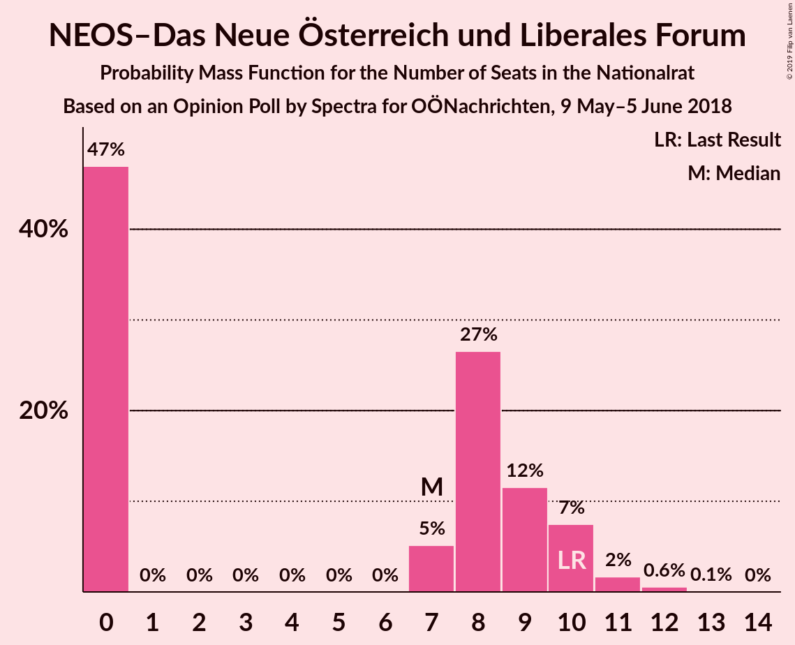
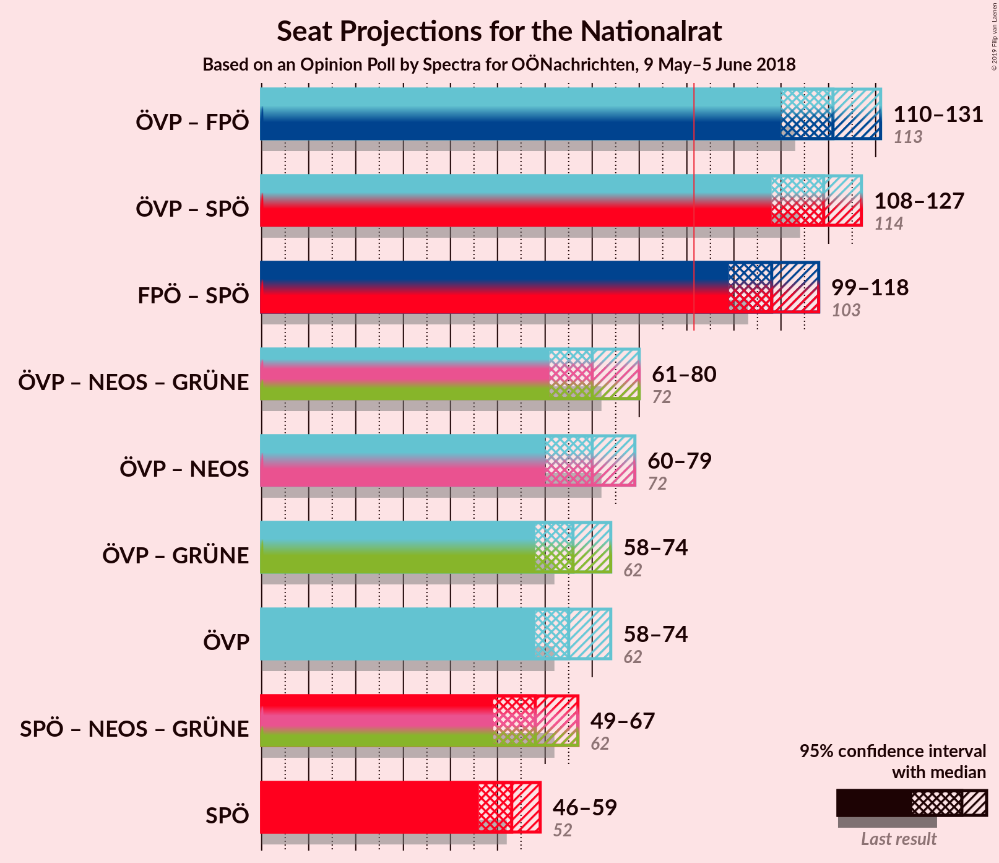
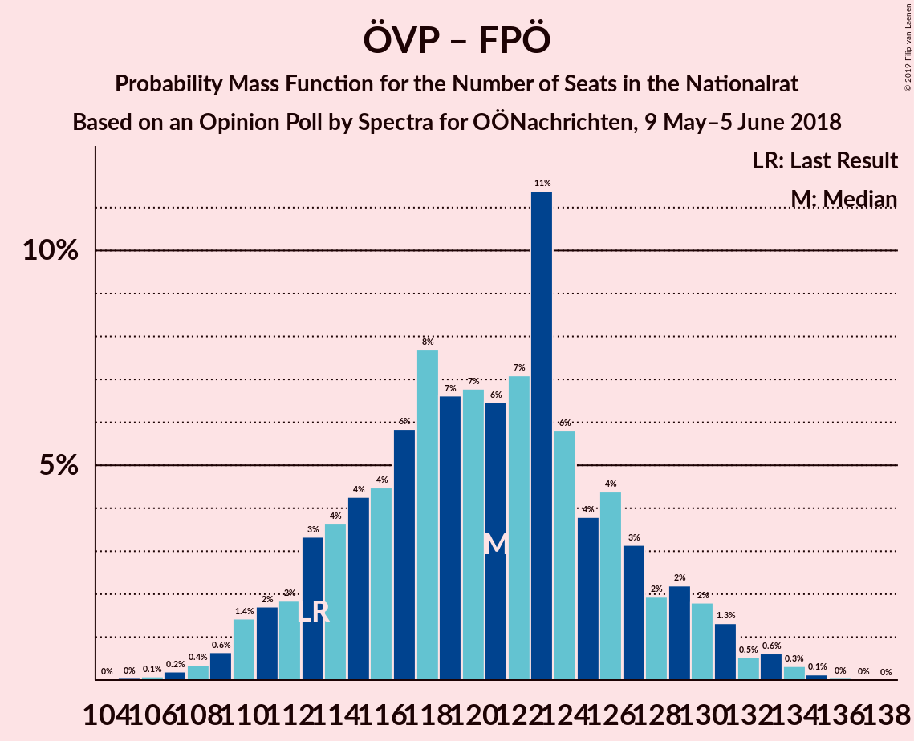

# Opinion Poll by Spectra for OÖNachrichten, 9 May–5 June 2018

<a href="#voting-intentions">Voting Intentions</a> | <a href="#seats">Seats</a> | <a href="#coalitions">Coalitions</a> | <a href="#technical-information">Technical Information</a>

## Voting Intentions

### Confidence Intervals

| Party | Last Result | Poll Result | 80% Confidence Interval | 90% Confidence Interval | 95% Confidence Interval | 99% Confidence Interval |
|:-----:|:-----------:|:-----------:|:-----------------------:|:-----------------------:|:-----------------------:|:-----------------------:|
| Österreichische Volkspartei | 31.5% | 33.1% | 30.9–35.3% |30.3–36.0% |29.7–36.6% |28.7–37.7% |
| Freiheitliche Partei Österreichs | 26.0% | 28.0% | 25.9–30.2% |25.4–30.8% |24.9–31.4% |23.9–32.4% |
| Sozialdemokratische Partei Österreichs | 26.9% | 27.0% | 25.0–29.2% |24.4–29.9% |23.9–30.4% |23.0–31.5% |
| NEOS–Das Neue Österreich und Liberales Forum | 5.3% | 4.0% | 3.2–5.1% |3.0–5.4% |2.8–5.6% |2.4–6.2% |
| JETZT–Liste Pilz | 4.4% | 4.0% | 3.2–5.1% |3.0–5.4% |2.8–5.6% |2.4–6.2% |
| Die Grünen–Die Grüne Alternative | 3.8% | 3.0% | 2.3–4.0% |2.1–4.3% |2.0–4.5% |1.7–5.0% |

*Note:* The poll result column reflects the actual value used in the calculations. Published results may vary slightly, and in addition be rounded to fewer digits.

## Seats

### Confidence Intervals

| Party | Last Result | Median | 80% Confidence Interval | 90% Confidence Interval | 95% Confidence Interval | 99% Confidence Interval |
|:-----:|:-----------:|:------:|:-----------------------:|:-----------------------:|:-----------------------:|:-----------------------:|
| <a href="#österreichische-volkspartei">Österreichische Volkspartei</a> | 62 | 65 | 60–70 |59–72 |58–74 |55–76 |
| <a href="#freiheitliche-partei-österreichs">Freiheitliche Partei Österreichs</a> | 51 | 55 | 50–60 |49–61 |48–63 |46–65 |
| <a href="#sozialdemokratische-partei-österreichs">Sozialdemokratische Partei Österreichs</a> | 52 | 53 | 48–58 |47–59 |46–59 |44–62 |
| <a href="#neos–das-neue-österreich-und-liberales-forum">NEOS–Das Neue Österreich und Liberales Forum</a> | 10 | 7 | 0–9 |0–10 |0–10 |0–12 |
| <a href="#jetzt–liste-pilz">JETZT–Liste Pilz</a> | 8 | 7 | 0–9 |0–10 |0–11 |0–12 |
| <a href="#die-grünen–die-grüne-alternative">Die Grünen–Die Grüne Alternative</a> | 0 | 0 | 0 |0–7 |0–8 |0–9 |

### Österreichische Volkspartei

*For a full overview of the results for this party, see the [Österreichische Volkspartei](party-österreichischevolkspartei.html) page.*

| Number of Seats | Probability | Accumulated | Special Marks |
|:---------------:|:-----------:|:-----------:|:-------------:|
| 53 | 0% | 100% |  |
| 54 | 0.3% | 99.9% |  |
| 55 | 0.2% | 99.7% |  |
| 56 | 0.7% | 99.4% |  |
| 57 | 1.0% | 98.7% |  |
| 58 | 2% | 98% |  |
| 59 | 3% | 95% |  |
| 60 | 5% | 92% |  |
| 61 | 6% | 87% |  |
| 62 | 7% | 81% | Last Result |
| 63 | 5% | 74% |  |
| 64 | 9% | 69% |  |
| 65 | 11% | 60% | Median |
| 66 | 10% | 49% |  |
| 67 | 16% | 40% |  |
| 68 | 5% | 24% |  |
| 69 | 7% | 19% |  |
| 70 | 3% | 12% |  |
| 71 | 2% | 9% |  |
| 72 | 3% | 7% |  |
| 73 | 1.0% | 4% |  |
| 74 | 2% | 3% |  |
| 75 | 0.2% | 1.1% |  |
| 76 | 0.4% | 0.8% |  |
| 77 | 0.3% | 0.5% |  |
| 78 | 0.1% | 0.1% |  |
| 79 | 0% | 0.1% |  |
| 80 | 0% | 0% |  |

### Freiheitliche Partei Österreichs

*For a full overview of the results for this party, see the [Freiheitliche Partei Österreichs](party-freiheitlicheparteiösterreichs.html) page.*

| Number of Seats | Probability | Accumulated | Special Marks |
|:---------------:|:-----------:|:-----------:|:-------------:|
| 44 | 0% | 100% |  |
| 45 | 0.3% | 99.9% |  |
| 46 | 0.6% | 99.6% |  |
| 47 | 0.7% | 99.1% |  |
| 48 | 1.2% | 98% |  |
| 49 | 4% | 97% |  |
| 50 | 5% | 93% |  |
| 51 | 4% | 89% | Last Result |
| 52 | 6% | 84% |  |
| 53 | 8% | 78% |  |
| 54 | 10% | 70% |  |
| 55 | 10% | 59% | Median |
| 56 | 13% | 49% |  |
| 57 | 12% | 36% |  |
| 58 | 6% | 24% |  |
| 59 | 6% | 19% |  |
| 60 | 5% | 13% |  |
| 61 | 3% | 8% |  |
| 62 | 2% | 5% |  |
| 63 | 0.6% | 3% |  |
| 64 | 1.0% | 2% |  |
| 65 | 0.6% | 1.0% |  |
| 66 | 0.2% | 0.4% |  |
| 67 | 0% | 0.1% |  |
| 68 | 0% | 0.1% |  |
| 69 | 0% | 0% |  |

### Sozialdemokratische Partei Österreichs

*For a full overview of the results for this party, see the [Sozialdemokratische Partei Österreichs](party-sozialdemokratischeparteiösterreichs.html) page.*

| Number of Seats | Probability | Accumulated | Special Marks |
|:---------------:|:-----------:|:-----------:|:-------------:|
| 42 | 0.1% | 100% |  |
| 43 | 0.2% | 99.9% |  |
| 44 | 0.4% | 99.7% |  |
| 45 | 1.1% | 99.3% |  |
| 46 | 2% | 98% |  |
| 47 | 3% | 96% |  |
| 48 | 6% | 94% |  |
| 49 | 8% | 88% |  |
| 50 | 7% | 80% |  |
| 51 | 9% | 73% |  |
| 52 | 9% | 64% | Last Result |
| 53 | 15% | 55% | Median |
| 54 | 10% | 40% |  |
| 55 | 6% | 30% |  |
| 56 | 5% | 24% |  |
| 57 | 9% | 19% |  |
| 58 | 4% | 10% |  |
| 59 | 4% | 6% |  |
| 60 | 2% | 2% |  |
| 61 | 0.4% | 0.9% |  |
| 62 | 0.2% | 0.5% |  |
| 63 | 0.1% | 0.3% |  |
| 64 | 0.1% | 0.2% |  |
| 65 | 0.1% | 0.1% |  |
| 66 | 0% | 0% |  |

### NEOS–Das Neue Österreich und Liberales Forum

*For a full overview of the results for this party, see the [NEOS–Das Neue Österreich und Liberales Forum](party-neos–dasneueösterreichundliberalesforum.html) page.*

| Number of Seats | Probability | Accumulated | Special Marks |
|:---------------:|:-----------:|:-----------:|:-------------:|
| 0 | 47% | 100% |  |
| 1 | 0% | 53% |  |
| 2 | 0% | 53% |  |
| 3 | 0% | 53% |  |
| 4 | 0% | 53% |  |
| 5 | 0% | 53% |  |
| 6 | 0% | 53% |  |
| 7 | 5% | 53% | Median |
| 8 | 27% | 48% |  |
| 9 | 12% | 21% |  |
| 10 | 7% | 10% | Last Result |
| 11 | 2% | 2% |  |
| 12 | 0.6% | 0.7% |  |
| 13 | 0.1% | 0.1% |  |
| 14 | 0% | 0% |  |

### JETZT–Liste Pilz

*For a full overview of the results for this party, see the [JETZT–Liste Pilz](party-jetzt–listepilz.html) page.*

| Number of Seats | Probability | Accumulated | Special Marks |
|:---------------:|:-----------:|:-----------:|:-------------:|
| 0 | 45% | 100% |  |
| 1 | 0% | 55% |  |
| 2 | 0% | 55% |  |
| 3 | 0% | 55% |  |
| 4 | 0% | 55% |  |
| 5 | 0% | 55% |  |
| 6 | 0% | 55% |  |
| 7 | 7% | 55% | Median |
| 8 | 22% | 48% | Last Result |
| 9 | 16% | 25% |  |
| 10 | 6% | 9% |  |
| 11 | 2% | 3% |  |
| 12 | 0.6% | 0.7% |  |
| 13 | 0.1% | 0.1% |  |
| 14 | 0% | 0% |  |

### Die Grünen–Die Grüne Alternative

*For a full overview of the results for this party, see the [Die Grünen–Die Grüne Alternative](party-diegrünen–diegrünealternative.html) page.*

| Number of Seats | Probability | Accumulated | Special Marks |
|:---------------:|:-----------:|:-----------:|:-------------:|
| 0 | 94% | 100% | Last Result, Median |
| 1 | 0% | 6% |  |
| 2 | 0% | 6% |  |
| 3 | 0% | 6% |  |
| 4 | 0% | 6% |  |
| 5 | 0% | 6% |  |
| 6 | 0% | 6% |  |
| 7 | 1.4% | 6% |  |
| 8 | 3% | 4% |  |
| 9 | 0.8% | 1.1% |  |
| 10 | 0.2% | 0.2% |  |
| 11 | 0% | 0% |  |

## Coalitions

### Confidence Intervals

| Coalition | Last Result | Median | Majority? | 80% Confidence Interval | 90% Confidence Interval | 95% Confidence Interval | 99% Confidence Interval |
|:---------:|:-----------:|:------:|:---------:|:-----------------------:|:-----------------------:|:-----------------------:|:-----------------------:|
| Österreichische Volkspartei – Freiheitliche Partei Österreichs | 113 | 121 | 100% | 114–127 | 112–129 | 110–131 | 108–134 |
| Österreichische Volkspartei – Sozialdemokratische Partei Österreichs | 114 | 119 | 100% | 111–125 | 110–126 | 108–127 | 105–130 |
| Freiheitliche Partei Österreichs – Sozialdemokratische Partei Österreichs | 103 | 108 | 100% | 101–115 | 100–116 | 99–118 | 96–120 |
| Österreichische Volkspartei – NEOS–Das Neue Österreich und Liberales Forum – Die Grünen–Die Grüne Alternative | 72 | 70 | 0% | 65–76 | 63–78 | 61–80 | 59–82 |
| Österreichische Volkspartei – NEOS–Das Neue Österreich und Liberales Forum | 72 | 70 | 0% | 64–76 | 62–77 | 60–79 | 58–81 |
| Österreichische Volkspartei – Die Grünen–Die Grüne Alternative | 62 | 66 | 0% | 60–71 | 59–73 | 58–74 | 56–77 |
| Österreichische Volkspartei | 62 | 65 | 0% | 60–70 | 59–72 | 58–74 | 55–76 |
| Sozialdemokratische Partei Österreichs – NEOS–Das Neue Österreich und Liberales Forum – Die Grünen–Die Grüne Alternative | 62 | 58 | 0% | 52–64 | 50–65 | 49–67 | 47–71 |
| Sozialdemokratische Partei Österreichs | 52 | 53 | 0% | 48–58 | 47–59 | 46–59 | 44–62 |

### Österreichische Volkspartei – Freiheitliche Partei Österreichs

| Number of Seats | Probability | Accumulated | Special Marks |
|:---------------:|:-----------:|:-----------:|:-------------:|
| 105 | 0% | 100% |  |
| 106 | 0.1% | 99.9% |  |
| 107 | 0.2% | 99.8% |  |
| 108 | 0.4% | 99.6% |  |
| 109 | 0.6% | 99.3% |  |
| 110 | 1.4% | 98.6% |  |
| 111 | 2% | 97% |  |
| 112 | 2% | 95% |  |
| 113 | 3% | 94% | Last Result |
| 114 | 4% | 90% |  |
| 115 | 4% | 87% |  |
| 116 | 4% | 82% |  |
| 117 | 6% | 78% |  |
| 118 | 8% | 72% |  |
| 119 | 7% | 64% |  |
| 120 | 7% | 58% | Median |
| 121 | 6% | 51% |  |
| 122 | 7% | 45% |  |
| 123 | 11% | 37% |  |
| 124 | 6% | 26% |  |
| 125 | 4% | 20% |  |
| 126 | 4% | 16% |  |
| 127 | 3% | 12% |  |
| 128 | 2% | 9% |  |
| 129 | 2% | 7% |  |
| 130 | 2% | 5% |  |
| 131 | 1.3% | 3% |  |
| 132 | 0.5% | 2% |  |
| 133 | 0.6% | 1.1% |  |
| 134 | 0.3% | 0.5% |  |
| 135 | 0.1% | 0.2% |  |
| 136 | 0% | 0.1% |  |
| 137 | 0% | 0% |  |

### Österreichische Volkspartei – Sozialdemokratische Partei Österreichs

| Number of Seats | Probability | Accumulated | Special Marks |
|:---------------:|:-----------:|:-----------:|:-------------:|
| 102 | 0% | 100% |  |
| 103 | 0.1% | 99.9% |  |
| 104 | 0.1% | 99.9% |  |
| 105 | 0.3% | 99.7% |  |
| 106 | 0.5% | 99.5% |  |
| 107 | 1.0% | 99.0% |  |
| 108 | 1.4% | 98% |  |
| 109 | 1.4% | 97% |  |
| 110 | 3% | 95% |  |
| 111 | 4% | 93% |  |
| 112 | 4% | 88% |  |
| 113 | 5% | 84% |  |
| 114 | 5% | 79% | Last Result |
| 115 | 3% | 74% |  |
| 116 | 8% | 71% |  |
| 117 | 7% | 63% |  |
| 118 | 4% | 56% | Median |
| 119 | 13% | 51% |  |
| 120 | 7% | 38% |  |
| 121 | 5% | 31% |  |
| 122 | 7% | 26% |  |
| 123 | 5% | 19% |  |
| 124 | 3% | 14% |  |
| 125 | 3% | 11% |  |
| 126 | 4% | 8% |  |
| 127 | 2% | 5% |  |
| 128 | 1.3% | 2% |  |
| 129 | 0.2% | 0.9% |  |
| 130 | 0.3% | 0.7% |  |
| 131 | 0.2% | 0.4% |  |
| 132 | 0.1% | 0.2% |  |
| 133 | 0.1% | 0.2% |  |
| 134 | 0.1% | 0.1% |  |
| 135 | 0% | 0% |  |

### Freiheitliche Partei Österreichs – Sozialdemokratische Partei Österreichs

| Number of Seats | Probability | Accumulated | Special Marks |
|:---------------:|:-----------:|:-----------:|:-------------:|
| 93 | 0.1% | 100% |  |
| 94 | 0.1% | 99.9% |  |
| 95 | 0.2% | 99.8% |  |
| 96 | 0.4% | 99.5% |  |
| 97 | 0.4% | 99.1% |  |
| 98 | 1.0% | 98.7% |  |
| 99 | 1.3% | 98% |  |
| 100 | 3% | 96% |  |
| 101 | 4% | 93% |  |
| 102 | 4% | 89% |  |
| 103 | 4% | 85% | Last Result |
| 104 | 4% | 81% |  |
| 105 | 5% | 77% |  |
| 106 | 6% | 72% |  |
| 107 | 10% | 66% |  |
| 108 | 13% | 56% | Median |
| 109 | 7% | 43% |  |
| 110 | 7% | 36% |  |
| 111 | 8% | 29% |  |
| 112 | 1.3% | 21% |  |
| 113 | 6% | 20% |  |
| 114 | 3% | 15% |  |
| 115 | 3% | 12% |  |
| 116 | 5% | 9% |  |
| 117 | 0.5% | 4% |  |
| 118 | 3% | 4% |  |
| 119 | 0.1% | 1.3% |  |
| 120 | 0.9% | 1.2% |  |
| 121 | 0% | 0.3% |  |
| 122 | 0.1% | 0.3% |  |
| 123 | 0.1% | 0.2% |  |
| 124 | 0% | 0.1% |  |
| 125 | 0% | 0% |  |

### Österreichische Volkspartei – NEOS–Das Neue Österreich und Liberales Forum – Die Grünen–Die Grüne Alternative

| Number of Seats | Probability | Accumulated | Special Marks |
|:---------------:|:-----------:|:-----------:|:-------------:|
| 56 | 0.1% | 100% |  |
| 57 | 0.1% | 99.9% |  |
| 58 | 0.3% | 99.8% |  |
| 59 | 0.6% | 99.6% |  |
| 60 | 0.9% | 99.0% |  |
| 61 | 2% | 98% |  |
| 62 | 0.4% | 96% |  |
| 63 | 4% | 96% |  |
| 64 | 0.7% | 92% |  |
| 65 | 9% | 91% |  |
| 66 | 3% | 82% |  |
| 67 | 13% | 79% |  |
| 68 | 7% | 66% |  |
| 69 | 6% | 59% |  |
| 70 | 8% | 53% |  |
| 71 | 4% | 45% |  |
| 72 | 9% | 42% | Last Result, Median |
| 73 | 4% | 33% |  |
| 74 | 7% | 29% |  |
| 75 | 6% | 22% |  |
| 76 | 8% | 16% |  |
| 77 | 3% | 8% |  |
| 78 | 1.0% | 5% |  |
| 79 | 2% | 4% |  |
| 80 | 0.9% | 3% |  |
| 81 | 0.7% | 2% |  |
| 82 | 0.5% | 1.0% |  |
| 83 | 0.2% | 0.5% |  |
| 84 | 0.1% | 0.2% |  |
| 85 | 0.1% | 0.1% |  |
| 86 | 0% | 0% |  |

### Österreichische Volkspartei – NEOS–Das Neue Österreich und Liberales Forum

| Number of Seats | Probability | Accumulated | Special Marks |
|:---------------:|:-----------:|:-----------:|:-------------:|
| 56 | 0.1% | 100% |  |
| 57 | 0.1% | 99.8% |  |
| 58 | 0.4% | 99.8% |  |
| 59 | 0.7% | 99.4% |  |
| 60 | 1.3% | 98.7% |  |
| 61 | 2% | 97% |  |
| 62 | 0.7% | 95% |  |
| 63 | 4% | 95% |  |
| 64 | 1.1% | 91% |  |
| 65 | 9% | 90% |  |
| 66 | 3% | 80% |  |
| 67 | 12% | 77% |  |
| 68 | 7% | 64% |  |
| 69 | 7% | 57% |  |
| 70 | 8% | 50% |  |
| 71 | 4% | 42% |  |
| 72 | 8% | 38% | Last Result, Median |
| 73 | 4% | 30% |  |
| 74 | 7% | 26% |  |
| 75 | 6% | 19% |  |
| 76 | 7% | 13% |  |
| 77 | 2% | 6% |  |
| 78 | 0.8% | 4% |  |
| 79 | 1.2% | 3% |  |
| 80 | 0.7% | 2% |  |
| 81 | 0.6% | 1.1% |  |
| 82 | 0.3% | 0.5% |  |
| 83 | 0.1% | 0.2% |  |
| 84 | 0.1% | 0.1% |  |
| 85 | 0% | 0.1% |  |
| 86 | 0% | 0% |  |

### Österreichische Volkspartei – Die Grünen–Die Grüne Alternative

| Number of Seats | Probability | Accumulated | Special Marks |
|:---------------:|:-----------:|:-----------:|:-------------:|
| 54 | 0.1% | 100% |  |
| 55 | 0.2% | 99.8% |  |
| 56 | 0.4% | 99.6% |  |
| 57 | 0.7% | 99.2% |  |
| 58 | 2% | 98% |  |
| 59 | 3% | 96% |  |
| 60 | 5% | 93% |  |
| 61 | 5% | 89% |  |
| 62 | 7% | 84% | Last Result |
| 63 | 5% | 77% |  |
| 64 | 8% | 72% |  |
| 65 | 10% | 63% | Median |
| 66 | 9% | 53% |  |
| 67 | 16% | 44% |  |
| 68 | 5% | 28% |  |
| 69 | 7% | 22% |  |
| 70 | 4% | 15% |  |
| 71 | 2% | 11% |  |
| 72 | 4% | 9% |  |
| 73 | 1.2% | 5% |  |
| 74 | 2% | 4% |  |
| 75 | 0.4% | 2% |  |
| 76 | 0.8% | 2% |  |
| 77 | 0.4% | 0.8% |  |
| 78 | 0.1% | 0.4% |  |
| 79 | 0.2% | 0.3% |  |
| 80 | 0% | 0.1% |  |
| 81 | 0% | 0% |  |

### Österreichische Volkspartei

| Number of Seats | Probability | Accumulated | Special Marks |
|:---------------:|:-----------:|:-----------:|:-------------:|
| 53 | 0% | 100% |  |
| 54 | 0.3% | 99.9% |  |
| 55 | 0.2% | 99.7% |  |
| 56 | 0.7% | 99.4% |  |
| 57 | 1.0% | 98.7% |  |
| 58 | 2% | 98% |  |
| 59 | 3% | 95% |  |
| 60 | 5% | 92% |  |
| 61 | 6% | 87% |  |
| 62 | 7% | 81% | Last Result |
| 63 | 5% | 74% |  |
| 64 | 9% | 69% |  |
| 65 | 11% | 60% | Median |
| 66 | 10% | 49% |  |
| 67 | 16% | 40% |  |
| 68 | 5% | 24% |  |
| 69 | 7% | 19% |  |
| 70 | 3% | 12% |  |
| 71 | 2% | 9% |  |
| 72 | 3% | 7% |  |
| 73 | 1.0% | 4% |  |
| 74 | 2% | 3% |  |
| 75 | 0.2% | 1.1% |  |
| 76 | 0.4% | 0.8% |  |
| 77 | 0.3% | 0.5% |  |
| 78 | 0.1% | 0.1% |  |
| 79 | 0% | 0.1% |  |
| 80 | 0% | 0% |  |

### Sozialdemokratische Partei Österreichs – NEOS–Das Neue Österreich und Liberales Forum – Die Grünen–Die Grüne Alternative

| Number of Seats | Probability | Accumulated | Special Marks |
|:---------------:|:-----------:|:-----------:|:-------------:|
| 45 | 0.1% | 100% |  |
| 46 | 0.3% | 99.9% |  |
| 47 | 0.5% | 99.6% |  |
| 48 | 0.6% | 99.1% |  |
| 49 | 2% | 98% |  |
| 50 | 3% | 96% |  |
| 51 | 3% | 93% |  |
| 52 | 3% | 90% |  |
| 53 | 6% | 87% |  |
| 54 | 9% | 81% |  |
| 55 | 5% | 72% |  |
| 56 | 7% | 67% |  |
| 57 | 7% | 60% |  |
| 58 | 6% | 52% |  |
| 59 | 9% | 46% |  |
| 60 | 11% | 38% | Median |
| 61 | 7% | 27% |  |
| 62 | 4% | 21% | Last Result |
| 63 | 3% | 17% |  |
| 64 | 4% | 13% |  |
| 65 | 6% | 10% |  |
| 66 | 1.0% | 4% |  |
| 67 | 0.7% | 3% |  |
| 68 | 1.1% | 2% |  |
| 69 | 0.5% | 1.2% |  |
| 70 | 0.1% | 0.7% |  |
| 71 | 0.4% | 0.6% |  |
| 72 | 0.1% | 0.2% |  |
| 73 | 0% | 0.1% |  |
| 74 | 0% | 0.1% |  |
| 75 | 0% | 0% |  |

### Sozialdemokratische Partei Österreichs

| Number of Seats | Probability | Accumulated | Special Marks |
|:---------------:|:-----------:|:-----------:|:-------------:|
| 42 | 0.1% | 100% |  |
| 43 | 0.2% | 99.9% |  |
| 44 | 0.4% | 99.7% |  |
| 45 | 1.1% | 99.3% |  |
| 46 | 2% | 98% |  |
| 47 | 3% | 96% |  |
| 48 | 6% | 94% |  |
| 49 | 8% | 88% |  |
| 50 | 7% | 80% |  |
| 51 | 9% | 73% |  |
| 52 | 9% | 64% | Last Result |
| 53 | 15% | 55% | Median |
| 54 | 10% | 40% |  |
| 55 | 6% | 30% |  |
| 56 | 5% | 24% |  |
| 57 | 9% | 19% |  |
| 58 | 4% | 10% |  |
| 59 | 4% | 6% |  |
| 60 | 2% | 2% |  |
| 61 | 0.4% | 0.9% |  |
| 62 | 0.2% | 0.5% |  |
| 63 | 0.1% | 0.3% |  |
| 64 | 0.1% | 0.2% |  |
| 65 | 0.1% | 0.1% |  |
| 66 | 0% | 0% |  |

## Technical Information

### Opinion Poll

+ **Polling firm:** Spectra
+ **Commissioner(s):** OÖNachrichten
+ **Fieldwork period:** 9 May–5 June 2018

### Calculations

+ **Sample size:** 732
+ **Simulations done:** 131,072
+ **Error estimate:** 1.68%

