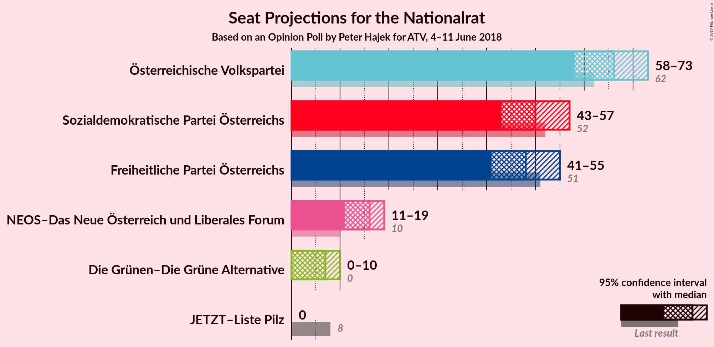
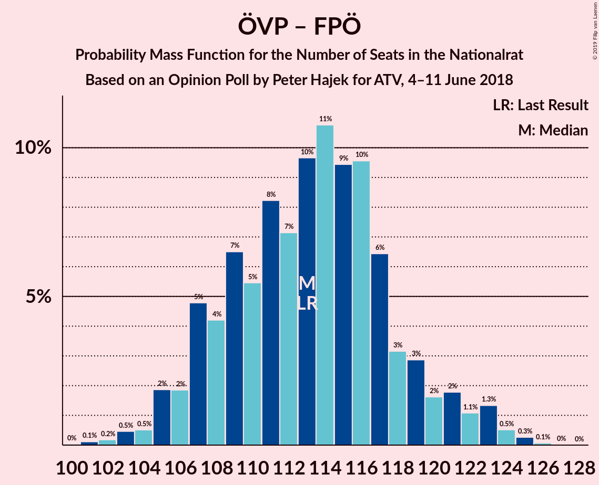

# Opinion Poll by Peter Hajek for ATV, 4–11 June 2018

<a href="#voting-intentions">Voting Intentions</a> | <a href="#seats">Seats</a> | <a href="#coalitions">Coalitions</a> | <a href="#technical-information">Technical Information</a>

## Voting Intentions

### Confidence Intervals

| Party | Last Result | Poll Result | 80% Confidence Interval | 90% Confidence Interval | 95% Confidence Interval | 99% Confidence Interval |
|:-----:|:-----------:|:-----------:|:-----------------------:|:-----------------------:|:-----------------------:|:-----------------------:|
| Österreichische Volkspartei | 31.5% | 34.0% | 31.8–36.4% |31.1–37.0% |30.6–37.6% |29.5–38.7% |
| Sozialdemokratische Partei Österreichs | 26.9% | 26.0% | 24.0–28.2% |23.4–28.8% |22.9–29.4% |21.9–30.5% |
| Freiheitliche Partei Österreichs | 26.0% | 25.0% | 23.0–27.2% |22.4–27.8% |21.9–28.3% |21.0–29.4% |
| NEOS–Das Neue Österreich und Liberales Forum | 5.3% | 8.0% | 6.8–9.5% |6.5–9.9% |6.2–10.3% |5.7–11.0% |
| Die Grünen–Die Grüne Alternative | 3.8% | 4.0% | 3.2–5.1% |3.0–5.4% |2.8–5.7% |2.4–6.3% |
| JETZT–Liste Pilz | 4.4% | 1.0% | 0.7–1.7% |0.6–1.9% |0.5–2.1% |0.4–2.4% |

*Note:* The poll result column reflects the actual value used in the calculations. Published results may vary slightly, and in addition be rounded to fewer digits.

## Seats

### Confidence Intervals

| Party | Last Result | Median | 80% Confidence Interval | 90% Confidence Interval | 95% Confidence Interval | 99% Confidence Interval |
|:-----:|:-----------:|:------:|:-----------------------:|:-----------------------:|:-----------------------:|:-----------------------:|
| <a href="#österreichische-volkspartei">Österreichische Volkspartei</a> | 62 | 66 | 60–70 |59–71 |58–73 |56–76 |
| <a href="#sozialdemokratische-partei-österreichs">Sozialdemokratische Partei Österreichs</a> | 52 | 50 | 45–55 |45–56 |43–57 |42–59 |
| <a href="#freiheitliche-partei-österreichs">Freiheitliche Partei Österreichs</a> | 51 | 48 | 44–52 |43–54 |41–55 |39–58 |
| <a href="#neos–das-neue-österreich-und-liberales-forum">NEOS–Das Neue Österreich und Liberales Forum</a> | 10 | 16 | 12–18 |12–18 |11–19 |11–21 |
| <a href="#die-grünen–die-grüne-alternative">Die Grünen–Die Grüne Alternative</a> | 0 | 7 | 0–9 |0–10 |0–10 |0–12 |
| <a href="#jetzt–liste-pilz">JETZT–Liste Pilz</a> | 8 | 0 | 0 |0 |0 |0 |

### Österreichische Volkspartei

*For a full overview of the results for this party, see the [Österreichische Volkspartei](party-österreichischevolkspartei.html) page.*

| Number of Seats | Probability | Accumulated | Special Marks |
|:---------------:|:-----------:|:-----------:|:-------------:|
| 54 | 0.1% | 100% |  |
| 55 | 0.2% | 99.9% |  |
| 56 | 0.4% | 99.7% |  |
| 57 | 1.2% | 99.2% |  |
| 58 | 2% | 98% |  |
| 59 | 3% | 96% |  |
| 60 | 4% | 93% |  |
| 61 | 6% | 89% |  |
| 62 | 9% | 83% | Last Result |
| 63 | 8% | 75% |  |
| 64 | 8% | 67% |  |
| 65 | 8% | 58% |  |
| 66 | 10% | 50% | Median |
| 67 | 11% | 41% |  |
| 68 | 11% | 30% |  |
| 69 | 6% | 19% |  |
| 70 | 4% | 13% |  |
| 71 | 4% | 8% |  |
| 72 | 2% | 5% |  |
| 73 | 1.2% | 3% |  |
| 74 | 1.0% | 2% |  |
| 75 | 0.3% | 0.8% |  |
| 76 | 0.4% | 0.5% |  |
| 77 | 0.1% | 0.1% |  |
| 78 | 0% | 0.1% |  |
| 79 | 0% | 0% |  |

### Sozialdemokratische Partei Österreichs

*For a full overview of the results for this party, see the [Sozialdemokratische Partei Österreichs](party-sozialdemokratischeparteiösterreichs.html) page.*

| Number of Seats | Probability | Accumulated | Special Marks |
|:---------------:|:-----------:|:-----------:|:-------------:|
| 39 | 0% | 100% |  |
| 40 | 0.1% | 99.9% |  |
| 41 | 0.3% | 99.8% |  |
| 42 | 0.4% | 99.5% |  |
| 43 | 2% | 99.1% |  |
| 44 | 2% | 97% |  |
| 45 | 6% | 96% |  |
| 46 | 3% | 90% |  |
| 47 | 11% | 86% |  |
| 48 | 6% | 75% |  |
| 49 | 15% | 70% |  |
| 50 | 7% | 54% | Median |
| 51 | 16% | 48% |  |
| 52 | 6% | 32% | Last Result |
| 53 | 11% | 25% |  |
| 54 | 3% | 14% |  |
| 55 | 6% | 11% |  |
| 56 | 2% | 5% |  |
| 57 | 2% | 3% |  |
| 58 | 1.1% | 2% |  |
| 59 | 0.3% | 0.7% |  |
| 60 | 0.3% | 0.4% |  |
| 61 | 0.1% | 0.1% |  |
| 62 | 0% | 0.1% |  |
| 63 | 0% | 0% |  |

### Freiheitliche Partei Österreichs

*For a full overview of the results for this party, see the [Freiheitliche Partei Österreichs](party-freiheitlicheparteiösterreichs.html) page.*

| Number of Seats | Probability | Accumulated | Special Marks |
|:---------------:|:-----------:|:-----------:|:-------------:|
| 38 | 0% | 100% |  |
| 39 | 0.5% | 99.9% |  |
| 40 | 0.2% | 99.5% |  |
| 41 | 2% | 99.2% |  |
| 42 | 2% | 97% |  |
| 43 | 3% | 95% |  |
| 44 | 8% | 92% |  |
| 45 | 10% | 84% |  |
| 46 | 4% | 74% |  |
| 47 | 20% | 70% |  |
| 48 | 8% | 50% | Median |
| 49 | 13% | 42% |  |
| 50 | 7% | 28% |  |
| 51 | 6% | 21% | Last Result |
| 52 | 7% | 15% |  |
| 53 | 3% | 8% |  |
| 54 | 3% | 5% |  |
| 55 | 0.5% | 3% |  |
| 56 | 2% | 2% |  |
| 57 | 0.2% | 0.7% |  |
| 58 | 0.3% | 0.6% |  |
| 59 | 0.2% | 0.3% |  |
| 60 | 0% | 0.1% |  |
| 61 | 0% | 0% |  |

### NEOS–Das Neue Österreich und Liberales Forum

*For a full overview of the results for this party, see the [NEOS–Das Neue Österreich und Liberales Forum](party-neos–dasneueösterreichundliberalesforum.html) page.*

| Number of Seats | Probability | Accumulated | Special Marks |
|:---------------:|:-----------:|:-----------:|:-------------:|
| 10 | 0.4% | 100% | Last Result |
| 11 | 3% | 99.5% |  |
| 12 | 8% | 97% |  |
| 13 | 11% | 89% |  |
| 14 | 11% | 79% |  |
| 15 | 12% | 67% |  |
| 16 | 23% | 55% | Median |
| 17 | 20% | 32% |  |
| 18 | 9% | 12% |  |
| 19 | 2% | 4% |  |
| 20 | 0.9% | 2% |  |
| 21 | 0.5% | 0.8% |  |
| 22 | 0.3% | 0.4% |  |
| 23 | 0.1% | 0.1% |  |
| 24 | 0% | 0% |  |

### Die Grünen–Die Grüne Alternative

*For a full overview of the results for this party, see the [Die Grünen–Die Grüne Alternative](party-diegrünen–diegrünealternative.html) page.*

| Number of Seats | Probability | Accumulated | Special Marks |
|:---------------:|:-----------:|:-----------:|:-------------:|
| 0 | 49% | 100% | Last Result |
| 1 | 0% | 51% |  |
| 2 | 0% | 51% |  |
| 3 | 0% | 51% |  |
| 4 | 0% | 51% |  |
| 5 | 0% | 51% |  |
| 6 | 0% | 51% |  |
| 7 | 9% | 51% | Median |
| 8 | 21% | 42% |  |
| 9 | 12% | 21% |  |
| 10 | 6% | 9% |  |
| 11 | 2% | 2% |  |
| 12 | 0.5% | 0.6% |  |
| 13 | 0.1% | 0.1% |  |
| 14 | 0% | 0% |  |

### JETZT–Liste Pilz

*For a full overview of the results for this party, see the [JETZT–Liste Pilz](party-jetzt–listepilz.html) page.*

| Number of Seats | Probability | Accumulated | Special Marks |
|:---------------:|:-----------:|:-----------:|:-------------:|
| 0 | 100% | 100% | Median |
| 1 | 0% | 0% |  |
| 2 | 0% | 0% |  |
| 3 | 0% | 0% |  |
| 4 | 0% | 0% |  |
| 5 | 0% | 0% |  |
| 6 | 0% | 0% |  |
| 7 | 0% | 0% |  |
| 8 | 0% | 0% | Last Result |

## Coalitions

### Confidence Intervals

| Coalition | Last Result | Median | Majority? | 80% Confidence Interval | 90% Confidence Interval | 95% Confidence Interval | 99% Confidence Interval |
|:---------:|:-----------:|:------:|:---------:|:-----------------------:|:-----------------------:|:-----------------------:|:-----------------------:|
| Österreichische Volkspartei – Sozialdemokratische Partei Österreichs | 114 | 116 | 100% | 109–122 | 108–123 | 106–124 | 105–125 |
| Österreichische Volkspartei – Freiheitliche Partei Österreichs | 113 | 113 | 100% | 108–118 | 106–121 | 105–122 | 103–124 |
| Sozialdemokratische Partei Österreichs – Freiheitliche Partei Österreichs | 103 | 98 | 94% | 93–103 | 91–105 | 90–106 | 87–109 |
| Österreichische Volkspartei – NEOS–Das Neue Österreich und Liberales Forum – Die Grünen–Die Grüne Alternative | 72 | 85 | 6% | 80–90 | 78–92 | 77–93 | 74–96 |
| Österreichische Volkspartei – NEOS–Das Neue Österreich und Liberales Forum | 72 | 81 | 0.3% | 75–86 | 74–87 | 72–88 | 70–91 |
| Österreichische Volkspartei – Die Grünen–Die Grüne Alternative | 62 | 69 | 0% | 64–75 | 63–77 | 62–78 | 59–80 |
| Sozialdemokratische Partei Österreichs – NEOS–Das Neue Österreich und Liberales Forum – Die Grünen–Die Grüne Alternative | 62 | 70 | 0% | 65–75 | 62–77 | 61–78 | 59–80 |
| Österreichische Volkspartei | 62 | 66 | 0% | 60–70 | 59–71 | 58–73 | 56–76 |
| Sozialdemokratische Partei Österreichs | 52 | 50 | 0% | 45–55 | 45–56 | 43–57 | 42–59 |

### Österreichische Volkspartei – Sozialdemokratische Partei Österreichs

| Number of Seats | Probability | Accumulated | Special Marks |
|:---------------:|:-----------:|:-----------:|:-------------:|
| 102 | 0% | 100% |  |
| 103 | 0.1% | 99.9% |  |
| 104 | 0.2% | 99.8% |  |
| 105 | 0.4% | 99.6% |  |
| 106 | 2% | 99.2% |  |
| 107 | 0.4% | 97% |  |
| 108 | 6% | 97% |  |
| 109 | 4% | 90% |  |
| 110 | 1.1% | 87% |  |
| 111 | 13% | 86% |  |
| 112 | 3% | 72% |  |
| 113 | 3% | 69% |  |
| 114 | 10% | 66% | Last Result |
| 115 | 6% | 57% |  |
| 116 | 7% | 51% | Median |
| 117 | 6% | 44% |  |
| 118 | 8% | 38% |  |
| 119 | 12% | 30% |  |
| 120 | 2% | 18% |  |
| 121 | 4% | 16% |  |
| 122 | 6% | 12% |  |
| 123 | 2% | 6% |  |
| 124 | 1.1% | 3% |  |
| 125 | 2% | 2% |  |
| 126 | 0.2% | 0.4% |  |
| 127 | 0.1% | 0.2% |  |
| 128 | 0.1% | 0.1% |  |
| 129 | 0% | 0% |  |

### Österreichische Volkspartei – Freiheitliche Partei Österreichs

| Number of Seats | Probability | Accumulated | Special Marks |
|:---------------:|:-----------:|:-----------:|:-------------:|
| 100 | 0% | 100% |  |
| 101 | 0.1% | 99.9% |  |
| 102 | 0.2% | 99.8% |  |
| 103 | 0.5% | 99.6% |  |
| 104 | 0.5% | 99.2% |  |
| 105 | 2% | 98.7% |  |
| 106 | 2% | 97% |  |
| 107 | 5% | 95% |  |
| 108 | 4% | 90% |  |
| 109 | 7% | 86% |  |
| 110 | 5% | 79% |  |
| 111 | 8% | 74% |  |
| 112 | 7% | 66% |  |
| 113 | 10% | 59% | Last Result |
| 114 | 11% | 49% | Median |
| 115 | 9% | 38% |  |
| 116 | 10% | 29% |  |
| 117 | 6% | 19% |  |
| 118 | 3% | 13% |  |
| 119 | 3% | 10% |  |
| 120 | 2% | 7% |  |
| 121 | 2% | 5% |  |
| 122 | 1.1% | 3% |  |
| 123 | 1.3% | 2% |  |
| 124 | 0.5% | 0.9% |  |
| 125 | 0.3% | 0.4% |  |
| 126 | 0.1% | 0.1% |  |
| 127 | 0% | 0% |  |

### Sozialdemokratische Partei Österreichs – Freiheitliche Partei Österreichs

| Number of Seats | Probability | Accumulated | Special Marks |
|:---------------:|:-----------:|:-----------:|:-------------:|
| 85 | 0.1% | 100% |  |
| 86 | 0.1% | 99.9% |  |
| 87 | 0.3% | 99.8% |  |
| 88 | 0.3% | 99.5% |  |
| 89 | 1.0% | 99.1% |  |
| 90 | 1.3% | 98% |  |
| 91 | 3% | 97% |  |
| 92 | 3% | 94% | Majority |
| 93 | 5% | 91% |  |
| 94 | 7% | 87% |  |
| 95 | 6% | 80% |  |
| 96 | 12% | 74% |  |
| 97 | 5% | 62% |  |
| 98 | 12% | 57% | Median |
| 99 | 9% | 44% |  |
| 100 | 10% | 35% |  |
| 101 | 7% | 25% |  |
| 102 | 4% | 18% |  |
| 103 | 5% | 14% | Last Result |
| 104 | 3% | 9% |  |
| 105 | 2% | 6% |  |
| 106 | 2% | 4% |  |
| 107 | 0.9% | 2% |  |
| 108 | 0.4% | 0.9% |  |
| 109 | 0.3% | 0.5% |  |
| 110 | 0.2% | 0.3% |  |
| 111 | 0.1% | 0.1% |  |
| 112 | 0% | 0% |  |

### Österreichische Volkspartei – NEOS–Das Neue Österreich und Liberales Forum – Die Grünen–Die Grüne Alternative

| Number of Seats | Probability | Accumulated | Special Marks |
|:---------------:|:-----------:|:-----------:|:-------------:|
| 72 | 0.1% | 100% | Last Result |
| 73 | 0.2% | 99.9% |  |
| 74 | 0.3% | 99.7% |  |
| 75 | 0.4% | 99.5% |  |
| 76 | 0.9% | 99.1% |  |
| 77 | 2% | 98% |  |
| 78 | 2% | 96% |  |
| 79 | 3% | 94% |  |
| 80 | 5% | 91% |  |
| 81 | 4% | 86% |  |
| 82 | 7% | 82% |  |
| 83 | 10% | 75% |  |
| 84 | 9% | 65% |  |
| 85 | 12% | 55% |  |
| 86 | 5% | 43% |  |
| 87 | 12% | 38% |  |
| 88 | 6% | 26% |  |
| 89 | 7% | 20% | Median |
| 90 | 5% | 13% |  |
| 91 | 3% | 9% |  |
| 92 | 3% | 6% | Majority |
| 93 | 1.3% | 3% |  |
| 94 | 0.9% | 2% |  |
| 95 | 0.3% | 0.9% |  |
| 96 | 0.3% | 0.5% |  |
| 97 | 0.1% | 0.2% |  |
| 98 | 0.1% | 0.1% |  |
| 99 | 0% | 0% |  |

### Österreichische Volkspartei – NEOS–Das Neue Österreich und Liberales Forum

| Number of Seats | Probability | Accumulated | Special Marks |
|:---------------:|:-----------:|:-----------:|:-------------:|
| 68 | 0% | 100% |  |
| 69 | 0.1% | 99.9% |  |
| 70 | 0.5% | 99.9% |  |
| 71 | 0.3% | 99.4% |  |
| 72 | 2% | 99.1% | Last Result |
| 73 | 1.1% | 97% |  |
| 74 | 2% | 96% |  |
| 75 | 5% | 94% |  |
| 76 | 4% | 88% |  |
| 77 | 9% | 84% |  |
| 78 | 6% | 75% |  |
| 79 | 9% | 69% |  |
| 80 | 7% | 61% |  |
| 81 | 10% | 53% |  |
| 82 | 8% | 44% | Median |
| 83 | 10% | 35% |  |
| 84 | 7% | 26% |  |
| 85 | 7% | 19% |  |
| 86 | 2% | 11% |  |
| 87 | 6% | 10% |  |
| 88 | 2% | 4% |  |
| 89 | 0.9% | 2% |  |
| 90 | 0.9% | 1.4% |  |
| 91 | 0.2% | 0.5% |  |
| 92 | 0.2% | 0.3% | Majority |
| 93 | 0% | 0.1% |  |
| 94 | 0% | 0.1% |  |
| 95 | 0% | 0% |  |

### Österreichische Volkspartei – Die Grünen–Die Grüne Alternative

| Number of Seats | Probability | Accumulated | Special Marks |
|:---------------:|:-----------:|:-----------:|:-------------:|
| 57 | 0.1% | 100% |  |
| 58 | 0.2% | 99.9% |  |
| 59 | 0.4% | 99.7% |  |
| 60 | 0.6% | 99.3% |  |
| 61 | 1.2% | 98.7% |  |
| 62 | 2% | 98% | Last Result |
| 63 | 3% | 96% |  |
| 64 | 4% | 93% |  |
| 65 | 5% | 89% |  |
| 66 | 6% | 84% |  |
| 67 | 8% | 78% |  |
| 68 | 11% | 69% |  |
| 69 | 10% | 59% |  |
| 70 | 8% | 49% |  |
| 71 | 9% | 41% |  |
| 72 | 6% | 32% |  |
| 73 | 6% | 26% | Median |
| 74 | 7% | 20% |  |
| 75 | 5% | 13% |  |
| 76 | 3% | 9% |  |
| 77 | 2% | 5% |  |
| 78 | 1.2% | 3% |  |
| 79 | 0.8% | 2% |  |
| 80 | 0.4% | 0.9% |  |
| 81 | 0.3% | 0.4% |  |
| 82 | 0.1% | 0.2% |  |
| 83 | 0% | 0.1% |  |
| 84 | 0% | 0.1% |  |
| 85 | 0% | 0% |  |

### Sozialdemokratische Partei Österreichs – NEOS–Das Neue Österreich und Liberales Forum – Die Grünen–Die Grüne Alternative

| Number of Seats | Probability | Accumulated | Special Marks |
|:---------------:|:-----------:|:-----------:|:-------------:|
| 57 | 0.1% | 100% |  |
| 58 | 0.3% | 99.9% |  |
| 59 | 0.5% | 99.6% |  |
| 60 | 1.3% | 99.1% |  |
| 61 | 1.1% | 98% |  |
| 62 | 2% | 97% | Last Result |
| 63 | 2% | 95% |  |
| 64 | 3% | 93% |  |
| 65 | 3% | 90% |  |
| 66 | 6% | 87% |  |
| 67 | 10% | 81% |  |
| 68 | 9% | 71% |  |
| 69 | 11% | 62% |  |
| 70 | 10% | 51% |  |
| 71 | 7% | 41% |  |
| 72 | 8% | 34% |  |
| 73 | 5% | 26% | Median |
| 74 | 6% | 20% |  |
| 75 | 4% | 14% |  |
| 76 | 5% | 10% |  |
| 77 | 2% | 5% |  |
| 78 | 2% | 3% |  |
| 79 | 0.5% | 1.3% |  |
| 80 | 0.5% | 0.8% |  |
| 81 | 0.2% | 0.4% |  |
| 82 | 0.1% | 0.2% |  |
| 83 | 0% | 0.1% |  |
| 84 | 0% | 0% |  |

### Österreichische Volkspartei

| Number of Seats | Probability | Accumulated | Special Marks |
|:---------------:|:-----------:|:-----------:|:-------------:|
| 54 | 0.1% | 100% |  |
| 55 | 0.2% | 99.9% |  |
| 56 | 0.4% | 99.7% |  |
| 57 | 1.2% | 99.2% |  |
| 58 | 2% | 98% |  |
| 59 | 3% | 96% |  |
| 60 | 4% | 93% |  |
| 61 | 6% | 89% |  |
| 62 | 9% | 83% | Last Result |
| 63 | 8% | 75% |  |
| 64 | 8% | 67% |  |
| 65 | 8% | 58% |  |
| 66 | 10% | 50% | Median |
| 67 | 11% | 41% |  |
| 68 | 11% | 30% |  |
| 69 | 6% | 19% |  |
| 70 | 4% | 13% |  |
| 71 | 4% | 8% |  |
| 72 | 2% | 5% |  |
| 73 | 1.2% | 3% |  |
| 74 | 1.0% | 2% |  |
| 75 | 0.3% | 0.8% |  |
| 76 | 0.4% | 0.5% |  |
| 77 | 0.1% | 0.1% |  |
| 78 | 0% | 0.1% |  |
| 79 | 0% | 0% |  |

### Sozialdemokratische Partei Österreichs

| Number of Seats | Probability | Accumulated | Special Marks |
|:---------------:|:-----------:|:-----------:|:-------------:|
| 39 | 0% | 100% |  |
| 40 | 0.1% | 99.9% |  |
| 41 | 0.3% | 99.8% |  |
| 42 | 0.4% | 99.5% |  |
| 43 | 2% | 99.1% |  |
| 44 | 2% | 97% |  |
| 45 | 6% | 96% |  |
| 46 | 3% | 90% |  |
| 47 | 11% | 86% |  |
| 48 | 6% | 75% |  |
| 49 | 15% | 70% |  |
| 50 | 7% | 54% | Median |
| 51 | 16% | 48% |  |
| 52 | 6% | 32% | Last Result |
| 53 | 11% | 25% |  |
| 54 | 3% | 14% |  |
| 55 | 6% | 11% |  |
| 56 | 2% | 5% |  |
| 57 | 2% | 3% |  |
| 58 | 1.1% | 2% |  |
| 59 | 0.3% | 0.7% |  |
| 60 | 0.3% | 0.4% |  |
| 61 | 0.1% | 0.1% |  |
| 62 | 0% | 0.1% |  |
| 63 | 0% | 0% |  |

## Technical Information

### Opinion Poll

+ **Polling firm:** Peter Hajek
+ **Commissioner(s):** ATV
+ **Fieldwork period:** 4–11 June 2018

### Calculations

+ **Sample size:** 700
+ **Simulations done:** 131,072
+ **Error estimate:** 0.73%

