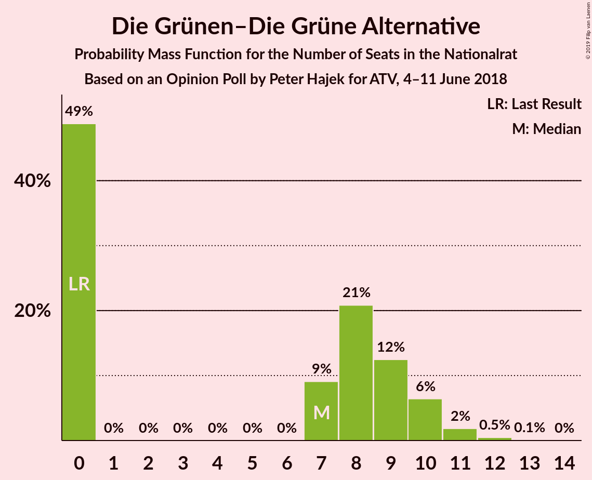
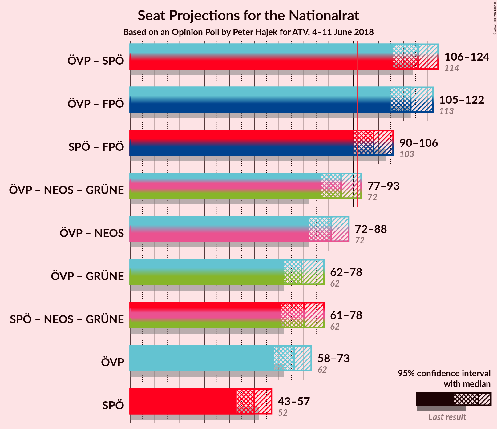

# Opinion Poll by Peter Hajek for ATV, 4–11 June 2018

<a href="#voting-intentions">Voting Intentions</a> | <a href="#seats">Seats</a> | <a href="#coalitions">Coalitions</a> | <a href="#technical-information">Technical Information</a>

## Voting Intentions

### Confidence Intervals

| Party | Last Result | Poll Result | 80% Confidence Interval | 90% Confidence Interval | 95% Confidence Interval | 99% Confidence Interval |
|:-----:|:-----------:|:-----------:|:-----------------------:|:-----------------------:|:-----------------------:|:-----------------------:|
| Österreichische Volkspartei | 31.5% | 34.0% | 31.8–36.4% |31.1–37.0% |30.6–37.6% |29.5–38.7% |
| Sozialdemokratische Partei Österreichs | 26.9% | 26.0% | 24.0–28.2% |23.4–28.8% |22.9–29.4% |21.9–30.5% |
| Freiheitliche Partei Österreichs | 26.0% | 25.0% | 23.0–27.2% |22.4–27.8% |21.9–28.3% |21.0–29.4% |
| NEOS–Das Neue Österreich und Liberales Forum | 5.3% | 8.0% | 6.8–9.5% |6.5–9.9% |6.2–10.3% |5.7–11.0% |
| Die Grünen–Die Grüne Alternative | 3.8% | 4.0% | 3.2–5.1% |3.0–5.4% |2.8–5.7% |2.4–6.3% |
| JETZT–Liste Pilz | 4.4% | 1.0% | 0.7–1.7% |0.6–1.9% |0.5–2.1% |0.4–2.4% |

*Note:* The poll result column reflects the actual value used in the calculations. Published results may vary slightly, and in addition be rounded to fewer digits.

## Seats

### Confidence Intervals

| Party | Last Result | Median | 80% Confidence Interval | 90% Confidence Interval | 95% Confidence Interval | 99% Confidence Interval |
|:-----:|:-----------:|:------:|:-----------------------:|:-----------------------:|:-----------------------:|:-----------------------:|
| <a href="#österreichische-volkspartei">Österreichische Volkspartei</a> | 62 | 66 | 62–70 |62–71 |62–71 |61–73 |
| <a href="#sozialdemokratische-partei-österreichs">Sozialdemokratische Partei Österreichs</a> | 52 | 47 | 43–49 |43–49 |43–49 |43–55 |
| <a href="#freiheitliche-partei-österreichs">Freiheitliche Partei Österreichs</a> | 51 | 47 | 44–54 |43–54 |43–54 |42–55 |
| <a href="#neos–das-neue-österreich-und-liberales-forum">NEOS–Das Neue Österreich und Liberales Forum</a> | 10 | 15 | 12–18 |12–21 |12–21 |9–21 |
| <a href="#die-grünen–die-grüne-alternative">Die Grünen–Die Grüne Alternative</a> | 0 | 9 | 0–10 |0–10 |0–10 |0–10 |
| <a href="#jetzt–liste-pilz">JETZT–Liste Pilz</a> | 8 | 0 | 0 |0 |0 |0 |

### Österreichische Volkspartei

*For a full overview of the results for this party, see the [Österreichische Volkspartei](party-österreichischevolkspartei.html) page.*

| Number of Seats | Probability | Accumulated | Special Marks |
|:---------------:|:-----------:|:-----------:|:-------------:|
| 54 | 0.2% | 100% |  |
| 55 | 0% | 99.8% |  |
| 56 | 0% | 99.8% |  |
| 57 | 0.2% | 99.8% |  |
| 58 | 0% | 99.6% |  |
| 59 | 0% | 99.6% |  |
| 60 | 0% | 99.5% |  |
| 61 | 0% | 99.5% |  |
| 62 | 12% | 99.5% | Last Result |
| 63 | 0.1% | 88% |  |
| 64 | 0% | 87% |  |
| 65 | 20% | 87% |  |
| 66 | 35% | 67% | Median |
| 67 | 0.1% | 32% |  |
| 68 | 0.1% | 31% |  |
| 69 | 13% | 31% |  |
| 70 | 9% | 19% |  |
| 71 | 9% | 9% |  |
| 72 | 0.1% | 0.7% |  |
| 73 | 0.2% | 0.5% |  |
| 74 | 0.1% | 0.3% |  |
| 75 | 0.1% | 0.2% |  |
| 76 | 0% | 0.1% |  |
| 77 | 0% | 0.1% |  |
| 78 | 0.1% | 0.1% |  |
| 79 | 0% | 0% |  |

### Sozialdemokratische Partei Österreichs

*For a full overview of the results for this party, see the [Sozialdemokratische Partei Österreichs](party-sozialdemokratischeparteiösterreichs.html) page.*

| Number of Seats | Probability | Accumulated | Special Marks |
|:---------------:|:-----------:|:-----------:|:-------------:|
| 41 | 0.2% | 100% |  |
| 42 | 0.1% | 99.8% |  |
| 43 | 21% | 99.7% |  |
| 44 | 12% | 79% |  |
| 45 | 13% | 67% |  |
| 46 | 0% | 54% |  |
| 47 | 8% | 54% | Median |
| 48 | 0.3% | 46% |  |
| 49 | 44% | 46% |  |
| 50 | 0.3% | 2% |  |
| 51 | 0.8% | 1.3% |  |
| 52 | 0.1% | 0.6% | Last Result |
| 53 | 0% | 0.5% |  |
| 54 | 0% | 0.5% |  |
| 55 | 0.1% | 0.5% |  |
| 56 | 0.2% | 0.4% |  |
| 57 | 0% | 0.2% |  |
| 58 | 0% | 0.2% |  |
| 59 | 0% | 0.2% |  |
| 60 | 0% | 0.2% |  |
| 61 | 0.2% | 0.2% |  |
| 62 | 0% | 0% |  |

### Freiheitliche Partei Österreichs

*For a full overview of the results for this party, see the [Freiheitliche Partei Österreichs](party-freiheitlicheparteiösterreichs.html) page.*

| Number of Seats | Probability | Accumulated | Special Marks |
|:---------------:|:-----------:|:-----------:|:-------------:|
| 36 | 0.2% | 100% |  |
| 37 | 0% | 99.8% |  |
| 38 | 0% | 99.8% |  |
| 39 | 0.1% | 99.8% |  |
| 40 | 0.1% | 99.7% |  |
| 41 | 0% | 99.6% |  |
| 42 | 0.1% | 99.6% |  |
| 43 | 9% | 99.4% |  |
| 44 | 36% | 91% |  |
| 45 | 0% | 54% |  |
| 46 | 0.1% | 54% |  |
| 47 | 33% | 54% | Median |
| 48 | 0.2% | 21% |  |
| 49 | 8% | 21% |  |
| 50 | 0.2% | 12% |  |
| 51 | 0% | 12% | Last Result |
| 52 | 0% | 12% |  |
| 53 | 0.1% | 12% |  |
| 54 | 12% | 12% |  |
| 55 | 0.6% | 0.6% |  |
| 56 | 0% | 0.1% |  |
| 57 | 0% | 0.1% |  |
| 58 | 0% | 0% |  |

### NEOS–Das Neue Österreich und Liberales Forum

*For a full overview of the results for this party, see the [NEOS–Das Neue Österreich und Liberales Forum](party-neos–dasneueösterreichundliberalesforum.html) page.*

| Number of Seats | Probability | Accumulated | Special Marks |
|:---------------:|:-----------:|:-----------:|:-------------:|
| 9 | 0.8% | 100% |  |
| 10 | 0.2% | 99.2% | Last Result |
| 11 | 0% | 99.1% |  |
| 12 | 13% | 99.0% |  |
| 13 | 0.9% | 86% |  |
| 14 | 12% | 85% |  |
| 15 | 36% | 74% | Median |
| 16 | 9% | 38% |  |
| 17 | 0% | 29% |  |
| 18 | 21% | 29% |  |
| 19 | 0.1% | 9% |  |
| 20 | 0% | 9% |  |
| 21 | 9% | 9% |  |
| 22 | 0% | 0.1% |  |
| 23 | 0% | 0% |  |

### Die Grünen–Die Grüne Alternative

*For a full overview of the results for this party, see the [Die Grünen–Die Grüne Alternative](party-diegrünen–diegrünealternative.html) page.*

| Number of Seats | Probability | Accumulated | Special Marks |
|:---------------:|:-----------:|:-----------:|:-------------:|
| 0 | 18% | 100% | Last Result |
| 1 | 0% | 82% |  |
| 2 | 0% | 82% |  |
| 3 | 0% | 82% |  |
| 4 | 0% | 82% |  |
| 5 | 0% | 82% |  |
| 6 | 0% | 82% |  |
| 7 | 0% | 82% |  |
| 8 | 0.2% | 82% |  |
| 9 | 49% | 82% | Median |
| 10 | 33% | 34% |  |
| 11 | 0.1% | 0.1% |  |
| 12 | 0% | 0% |  |

### JETZT–Liste Pilz

*For a full overview of the results for this party, see the [JETZT–Liste Pilz](party-jetzt–listepilz.html) page.*

| Number of Seats | Probability | Accumulated | Special Marks |
|:---------------:|:-----------:|:-----------:|:-------------:|
| 0 | 100% | 100% | Median |
| 1 | 0% | 0% |  |
| 2 | 0% | 0% |  |
| 3 | 0% | 0% |  |
| 4 | 0% | 0% |  |
| 5 | 0% | 0% |  |
| 6 | 0% | 0% |  |
| 7 | 0% | 0% |  |
| 8 | 0% | 0% | Last Result |

## Coalitions

### Confidence Intervals

| Coalition | Last Result | Median | Majority? | 80% Confidence Interval | 90% Confidence Interval | 95% Confidence Interval | 99% Confidence Interval |
|:---------:|:-----------:|:------:|:---------:|:-----------------------:|:-----------------------:|:-----------------------:|:-----------------------:|
| Österreichische Volkspartei – Freiheitliche Partei Österreichs | 113 | 112 | 100% | 110–116 | 110–120 | 110–120 | 109–120 |
| Österreichische Volkspartei – Sozialdemokratische Partei Österreichs | 114 | 115 | 100% | 106–119 | 106–119 | 106–119 | 106–123 |
| Sozialdemokratische Partei Österreichs – Freiheitliche Partei Österreichs | 103 | 93 | 79% | 90–98 | 90–98 | 90–98 | 90–101 |
| Österreichische Volkspartei | 62 | 66 | 0% | 62–70 | 62–71 | 62–71 | 61–73 |
| Sozialdemokratische Partei Österreichs | 52 | 47 | 0% | 43–49 | 43–49 | 43–49 | 43–55 |

### Österreichische Volkspartei – Freiheitliche Partei Österreichs

| Number of Seats | Probability | Accumulated | Special Marks |
|:---------------:|:-----------:|:-----------:|:-------------:|
| 98 | 0.2% | 100% |  |
| 99 | 0% | 99.8% |  |
| 100 | 0% | 99.8% |  |
| 101 | 0% | 99.8% |  |
| 102 | 0% | 99.8% |  |
| 103 | 0% | 99.8% |  |
| 104 | 0% | 99.8% |  |
| 105 | 0.2% | 99.8% |  |
| 106 | 0% | 99.6% |  |
| 107 | 0% | 99.5% |  |
| 108 | 0% | 99.5% |  |
| 109 | 0.2% | 99.5% |  |
| 110 | 36% | 99.3% |  |
| 111 | 0% | 64% |  |
| 112 | 21% | 64% |  |
| 113 | 9% | 43% | Last Result, Median |
| 114 | 0.8% | 34% |  |
| 115 | 0% | 34% |  |
| 116 | 24% | 34% |  |
| 117 | 0.6% | 9% |  |
| 118 | 0.1% | 9% |  |
| 119 | 0% | 9% |  |
| 120 | 9% | 9% |  |
| 121 | 0% | 0.3% |  |
| 122 | 0% | 0.3% |  |
| 123 | 0.1% | 0.3% |  |
| 124 | 0% | 0.2% |  |
| 125 | 0.1% | 0.2% |  |
| 126 | 0% | 0.1% |  |
| 127 | 0% | 0.1% |  |
| 128 | 0% | 0.1% |  |
| 129 | 0% | 0% |  |

### Österreichische Volkspartei – Sozialdemokratische Partei Österreichs

| Number of Seats | Probability | Accumulated | Special Marks |
|:---------------:|:-----------:|:-----------:|:-------------:|
| 101 | 0% | 100% |  |
| 102 | 0% | 99.9% |  |
| 103 | 0% | 99.9% |  |
| 104 | 0% | 99.9% |  |
| 105 | 0% | 99.9% |  |
| 106 | 12% | 99.9% |  |
| 107 | 0% | 88% |  |
| 108 | 21% | 88% |  |
| 109 | 0% | 67% |  |
| 110 | 0% | 67% |  |
| 111 | 0.1% | 67% |  |
| 112 | 0% | 67% |  |
| 113 | 0.2% | 67% | Median |
| 114 | 13% | 67% | Last Result |
| 115 | 36% | 54% |  |
| 116 | 0.1% | 19% |  |
| 117 | 0% | 18% |  |
| 118 | 8% | 18% |  |
| 119 | 9% | 10% |  |
| 120 | 0.1% | 1.4% |  |
| 121 | 0.8% | 1.4% |  |
| 122 | 0% | 0.6% |  |
| 123 | 0.4% | 0.6% |  |
| 124 | 0% | 0.2% |  |
| 125 | 0% | 0.2% |  |
| 126 | 0.2% | 0.2% |  |
| 127 | 0% | 0% |  |

### Sozialdemokratische Partei Österreichs – Freiheitliche Partei Österreichs

| Number of Seats | Probability | Accumulated | Special Marks |
|:---------------:|:-----------:|:-----------:|:-------------:|
| 84 | 0.1% | 100% |  |
| 85 | 0% | 99.9% |  |
| 86 | 0.2% | 99.9% |  |
| 87 | 0% | 99.6% |  |
| 88 | 0% | 99.6% |  |
| 89 | 0% | 99.6% |  |
| 90 | 21% | 99.5% |  |
| 91 | 0% | 79% |  |
| 92 | 21% | 79% | Majority |
| 93 | 35% | 58% |  |
| 94 | 0.2% | 22% | Median |
| 95 | 0.8% | 22% |  |
| 96 | 9% | 21% |  |
| 97 | 0% | 13% |  |
| 98 | 12% | 13% |  |
| 99 | 0.5% | 1.1% |  |
| 100 | 0% | 0.5% |  |
| 101 | 0% | 0.5% |  |
| 102 | 0.1% | 0.5% |  |
| 103 | 0% | 0.4% | Last Result |
| 104 | 0.3% | 0.4% |  |
| 105 | 0.1% | 0.2% |  |
| 106 | 0% | 0% |  |

### Österreichische Volkspartei

| Number of Seats | Probability | Accumulated | Special Marks |
|:---------------:|:-----------:|:-----------:|:-------------:|
| 54 | 0.2% | 100% |  |
| 55 | 0% | 99.8% |  |
| 56 | 0% | 99.8% |  |
| 57 | 0.2% | 99.8% |  |
| 58 | 0% | 99.6% |  |
| 59 | 0% | 99.6% |  |
| 60 | 0% | 99.5% |  |
| 61 | 0% | 99.5% |  |
| 62 | 12% | 99.5% | Last Result |
| 63 | 0.1% | 88% |  |
| 64 | 0% | 87% |  |
| 65 | 20% | 87% |  |
| 66 | 35% | 67% | Median |
| 67 | 0.1% | 32% |  |
| 68 | 0.1% | 31% |  |
| 69 | 13% | 31% |  |
| 70 | 9% | 19% |  |
| 71 | 9% | 9% |  |
| 72 | 0.1% | 0.7% |  |
| 73 | 0.2% | 0.5% |  |
| 74 | 0.1% | 0.3% |  |
| 75 | 0.1% | 0.2% |  |
| 76 | 0% | 0.1% |  |
| 77 | 0% | 0.1% |  |
| 78 | 0.1% | 0.1% |  |
| 79 | 0% | 0% |  |

### Sozialdemokratische Partei Österreichs

| Number of Seats | Probability | Accumulated | Special Marks |
|:---------------:|:-----------:|:-----------:|:-------------:|
| 41 | 0.2% | 100% |  |
| 42 | 0.1% | 99.8% |  |
| 43 | 21% | 99.7% |  |
| 44 | 12% | 79% |  |
| 45 | 13% | 67% |  |
| 46 | 0% | 54% |  |
| 47 | 8% | 54% | Median |
| 48 | 0.3% | 46% |  |
| 49 | 44% | 46% |  |
| 50 | 0.3% | 2% |  |
| 51 | 0.8% | 1.3% |  |
| 52 | 0.1% | 0.6% | Last Result |
| 53 | 0% | 0.5% |  |
| 54 | 0% | 0.5% |  |
| 55 | 0.1% | 0.5% |  |
| 56 | 0.2% | 0.4% |  |
| 57 | 0% | 0.2% |  |
| 58 | 0% | 0.2% |  |
| 59 | 0% | 0.2% |  |
| 60 | 0% | 0.2% |  |
| 61 | 0.2% | 0.2% |  |
| 62 | 0% | 0% |  |

## Technical Information

### Opinion Poll

+ **Polling firm:** Peter Hajek
+ **Commissioner(s):** ATV
+ **Fieldwork period:** 4–11 June 2018

### Calculations

+ **Sample size:** 700
+ **Simulations done:** 1,024
+ **Error estimate:** 5.50%

