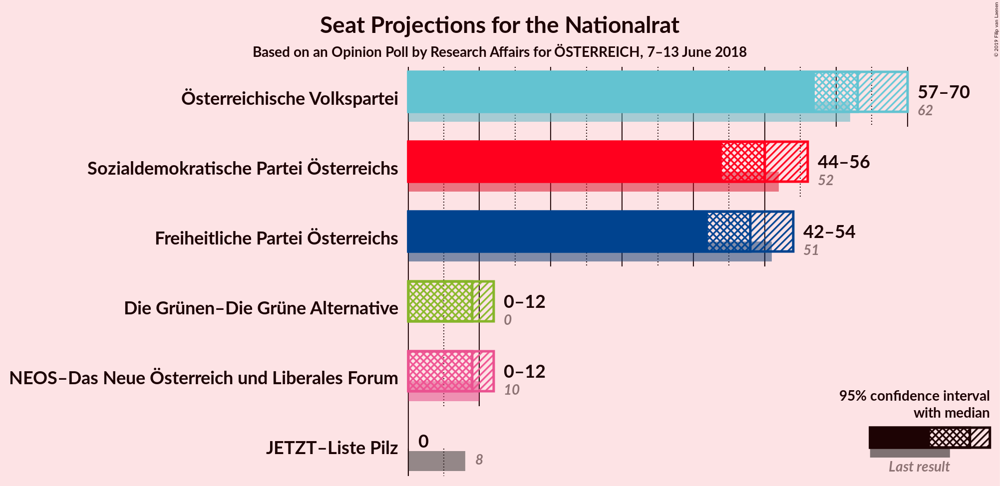
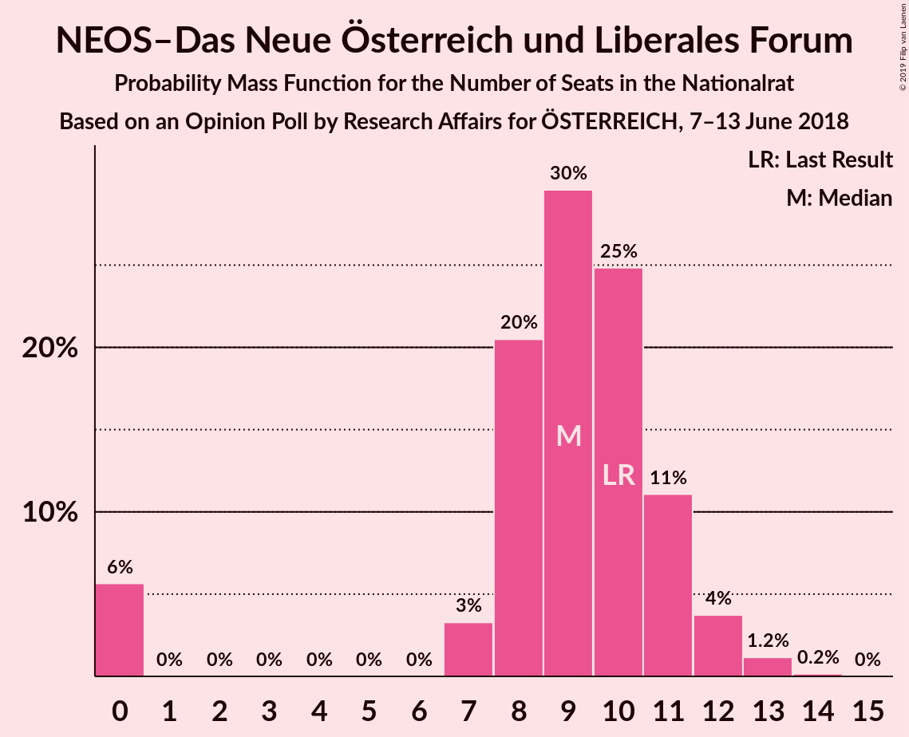
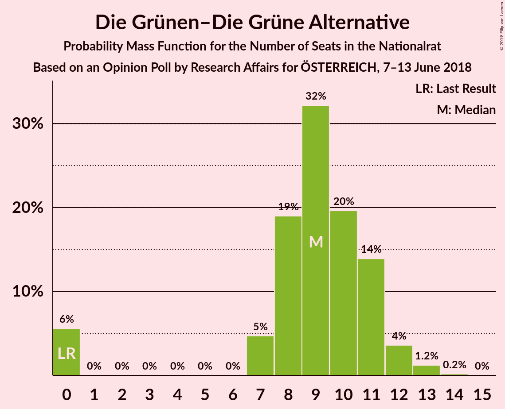
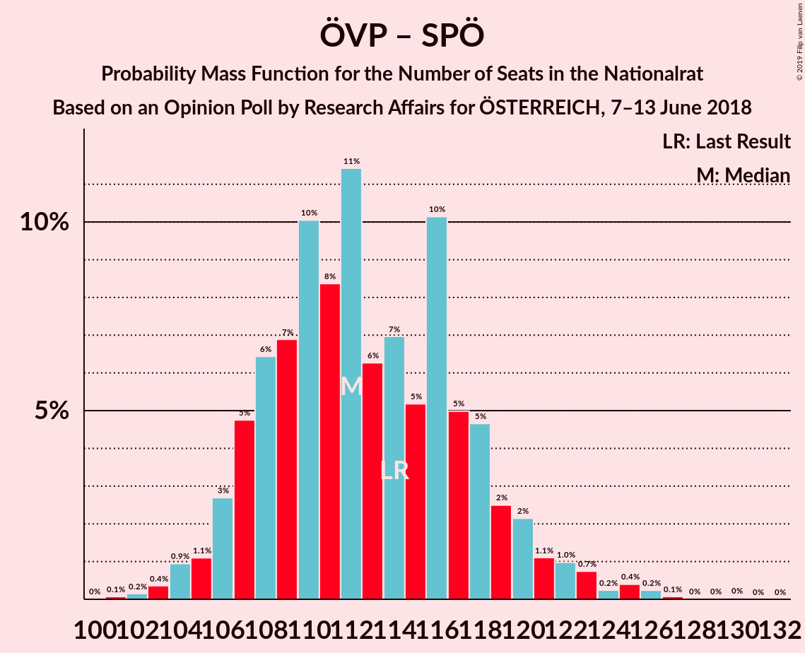
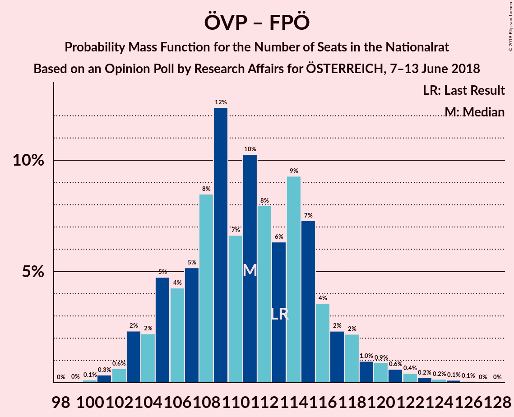
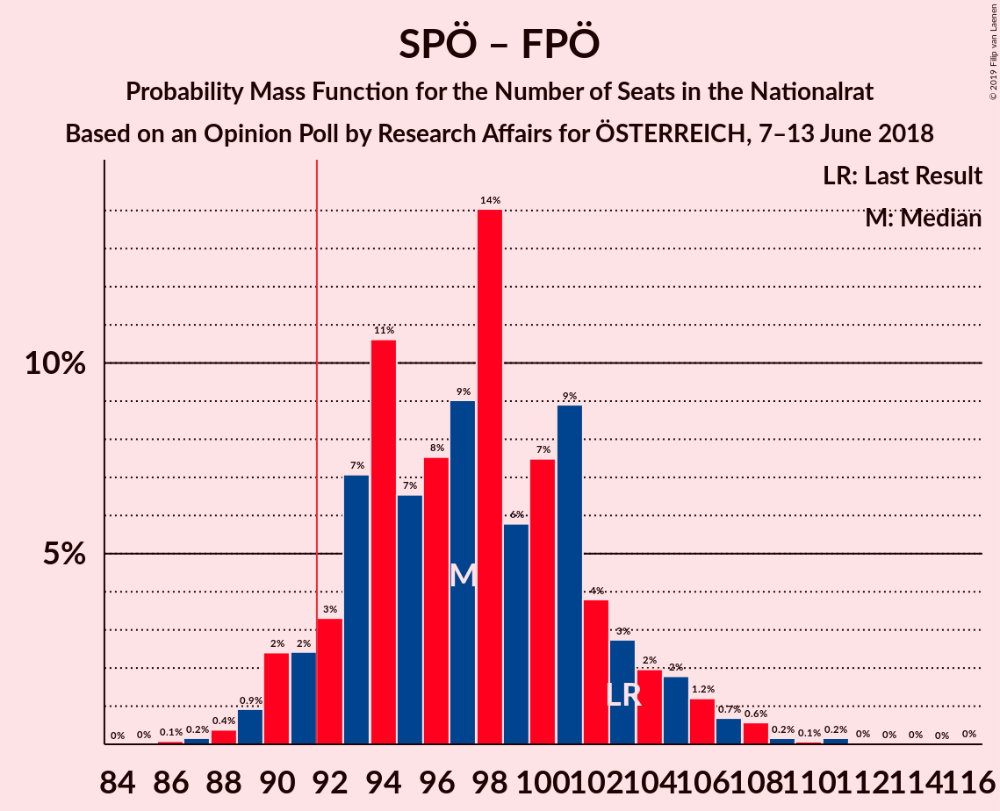

# Opinion Poll by Research Affairs for ÖSTERREICH, 7–13 June 2018

<a href="#voting-intentions">Voting Intentions</a> | <a href="#seats">Seats</a> | <a href="#coalitions">Coalitions</a> | <a href="#technical-information">Technical Information</a>

## Voting Intentions

### Confidence Intervals

| Party | Last Result | Poll Result | 80% Confidence Interval | 90% Confidence Interval | 95% Confidence Interval | 99% Confidence Interval |
|:-----:|:-----------:|:-----------:|:-----------------------:|:-----------------------:|:-----------------------:|:-----------------------:|
| Österreichische Volkspartei | 31.5% | 33.0% | 31.1–34.9% |30.6–35.5% |30.1–35.9% |29.2–36.9% |
| Sozialdemokratische Partei Österreichs | 26.9% | 26.0% | 24.3–27.8% |23.8–28.3% |23.4–28.8% |22.6–29.7% |
| Freiheitliche Partei Österreichs | 26.0% | 25.0% | 23.3–26.8% |22.8–27.3% |22.4–27.8% |21.6–28.7% |
| NEOS–Das Neue Österreich und Liberales Forum | 5.3% | 5.0% | 4.2–6.0% |4.0–6.3% |3.8–6.5% |3.4–7.0% |
| Die Grünen–Die Grüne Alternative | 3.8% | 5.0% | 4.2–6.0% |4.0–6.3% |3.8–6.5% |3.4–7.0% |
| JETZT–Liste Pilz | 4.4% | 2.0% | 1.5–2.7% |1.4–2.9% |1.3–3.1% |1.1–3.4% |

*Note:* The poll result column reflects the actual value used in the calculations. Published results may vary slightly, and in addition be rounded to fewer digits.

## Seats

### Confidence Intervals

| Party | Last Result | Median | 80% Confidence Interval | 90% Confidence Interval | 95% Confidence Interval | 99% Confidence Interval |
|:-----:|:-----------:|:------:|:-----------------------:|:-----------------------:|:-----------------------:|:-----------------------:|
| <a href="#österreichische-volkspartei">Österreichische Volkspartei</a> | 62 | 66 | 59–68 |56–68 |56–69 |56–71 |
| <a href="#sozialdemokratische-partei-österreichs">Sozialdemokratische Partei Österreichs</a> | 52 | 52 | 44–54 |44–54 |44–55 |42–57 |
| <a href="#freiheitliche-partei-österreichs">Freiheitliche Partei Österreichs</a> | 51 | 44 | 42–52 |42–52 |42–52 |42–54 |
| <a href="#neos–das-neue-österreich-und-liberales-forum">NEOS–Das Neue Österreich und Liberales Forum</a> | 10 | 8 | 7–12 |7–13 |0–13 |0–14 |
| <a href="#die-grünen–die-grüne-alternative">Die Grünen–Die Grüne Alternative</a> | 0 | 8 | 8–11 |8–12 |0–12 |0–14 |
| <a href="#jetzt–liste-pilz">JETZT–Liste Pilz</a> | 8 | 0 | 0 |0 |0 |0–7 |

### Österreichische Volkspartei

*For a full overview of the results for this party, see the [Österreichische Volkspartei](party-österreichischevolkspartei.html) page.*

| Number of Seats | Probability | Accumulated | Special Marks |
|:---------------:|:-----------:|:-----------:|:-------------:|
| 55 | 0.3% | 100% |  |
| 56 | 6% | 99.6% |  |
| 57 | 1.4% | 94% |  |
| 58 | 0.7% | 93% |  |
| 59 | 14% | 92% |  |
| 60 | 0.9% | 78% |  |
| 61 | 1.3% | 77% |  |
| 62 | 11% | 76% | Last Result |
| 63 | 0.2% | 65% |  |
| 64 | 3% | 65% |  |
| 65 | 10% | 62% |  |
| 66 | 40% | 52% | Median |
| 67 | 0.3% | 12% |  |
| 68 | 9% | 12% |  |
| 69 | 0.3% | 3% |  |
| 70 | 0.4% | 2% |  |
| 71 | 2% | 2% |  |
| 72 | 0% | 0.4% |  |
| 73 | 0.3% | 0.4% |  |
| 74 | 0% | 0% |  |

### Sozialdemokratische Partei Österreichs

*For a full overview of the results for this party, see the [Sozialdemokratische Partei Österreichs](party-sozialdemokratischeparteiösterreichs.html) page.*

| Number of Seats | Probability | Accumulated | Special Marks |
|:---------------:|:-----------:|:-----------:|:-------------:|
| 41 | 0.2% | 100% |  |
| 42 | 0.9% | 99.8% |  |
| 43 | 1.4% | 98.9% |  |
| 44 | 10% | 98% |  |
| 45 | 2% | 88% |  |
| 46 | 7% | 86% |  |
| 47 | 1.0% | 79% |  |
| 48 | 7% | 78% |  |
| 49 | 0% | 71% |  |
| 50 | 5% | 71% |  |
| 51 | 2% | 67% |  |
| 52 | 52% | 65% | Last Result, Median |
| 53 | 0.1% | 13% |  |
| 54 | 9% | 13% |  |
| 55 | 2% | 3% |  |
| 56 | 0.3% | 2% |  |
| 57 | 1.1% | 1.5% |  |
| 58 | 0% | 0.3% |  |
| 59 | 0.3% | 0.3% |  |
| 60 | 0% | 0.1% |  |
| 61 | 0% | 0.1% |  |
| 62 | 0% | 0% |  |

### Freiheitliche Partei Österreichs

*For a full overview of the results for this party, see the [Freiheitliche Partei Österreichs](party-freiheitlicheparteiösterreichs.html) page.*

| Number of Seats | Probability | Accumulated | Special Marks |
|:---------------:|:-----------:|:-----------:|:-------------:|
| 40 | 0% | 100% |  |
| 41 | 0% | 99.9% |  |
| 42 | 49% | 99.9% |  |
| 43 | 0.2% | 51% |  |
| 44 | 17% | 51% | Median |
| 45 | 1.0% | 33% |  |
| 46 | 2% | 32% |  |
| 47 | 0.1% | 30% |  |
| 48 | 1.0% | 30% |  |
| 49 | 0.6% | 29% |  |
| 50 | 15% | 29% |  |
| 51 | 0.9% | 14% | Last Result |
| 52 | 12% | 13% |  |
| 53 | 0% | 1.3% |  |
| 54 | 0.9% | 1.3% |  |
| 55 | 0% | 0.4% |  |
| 56 | 0% | 0.4% |  |
| 57 | 0.2% | 0.4% |  |
| 58 | 0% | 0.2% |  |
| 59 | 0.2% | 0.2% |  |
| 60 | 0% | 0% |  |

### NEOS–Das Neue Österreich und Liberales Forum

*For a full overview of the results for this party, see the [NEOS–Das Neue Österreich und Liberales Forum](party-neos–dasneueösterreichundliberalesforum.html) page.*

| Number of Seats | Probability | Accumulated | Special Marks |
|:---------------:|:-----------:|:-----------:|:-------------:|
| 0 | 3% | 100% |  |
| 1 | 0% | 97% |  |
| 2 | 0% | 97% |  |
| 3 | 0% | 97% |  |
| 4 | 0% | 97% |  |
| 5 | 0% | 97% |  |
| 6 | 0% | 97% |  |
| 7 | 9% | 97% |  |
| 8 | 54% | 88% | Median |
| 9 | 11% | 34% |  |
| 10 | 1.5% | 23% | Last Result |
| 11 | 0.7% | 22% |  |
| 12 | 13% | 21% |  |
| 13 | 8% | 9% |  |
| 14 | 0.5% | 0.5% |  |
| 15 | 0% | 0% |  |

### Die Grünen–Die Grüne Alternative

*For a full overview of the results for this party, see the [Die Grünen–Die Grüne Alternative](party-diegrünen–diegrünealternative.html) page.*

| Number of Seats | Probability | Accumulated | Special Marks |
|:---------------:|:-----------:|:-----------:|:-------------:|
| 0 | 3% | 100% | Last Result |
| 1 | 0% | 97% |  |
| 2 | 0% | 97% |  |
| 3 | 0% | 97% |  |
| 4 | 0% | 97% |  |
| 5 | 0% | 97% |  |
| 6 | 0% | 97% |  |
| 7 | 0.6% | 97% |  |
| 8 | 49% | 96% | Median |
| 9 | 12% | 47% |  |
| 10 | 17% | 36% |  |
| 11 | 12% | 19% |  |
| 12 | 5% | 7% |  |
| 13 | 2% | 2% |  |
| 14 | 0.3% | 0.5% |  |
| 15 | 0.1% | 0.2% |  |
| 16 | 0.1% | 0.1% |  |
| 17 | 0% | 0% |  |

### JETZT–Liste Pilz

*For a full overview of the results for this party, see the [JETZT–Liste Pilz](party-jetzt–listepilz.html) page.*

| Number of Seats | Probability | Accumulated | Special Marks |
|:---------------:|:-----------:|:-----------:|:-------------:|
| 0 | 98.6% | 100% | Median |
| 1 | 0% | 1.4% |  |
| 2 | 0% | 1.4% |  |
| 3 | 0% | 1.4% |  |
| 4 | 0% | 1.4% |  |
| 5 | 0% | 1.4% |  |
| 6 | 0% | 1.4% |  |
| 7 | 1.3% | 1.4% |  |
| 8 | 0% | 0% | Last Result |

## Coalitions

### Confidence Intervals

| Coalition | Last Result | Median | Majority? | 80% Confidence Interval | 90% Confidence Interval | 95% Confidence Interval | 99% Confidence Interval |
|:---------:|:-----------:|:------:|:---------:|:-----------------------:|:-----------------------:|:-----------------------:|:-----------------------:|
| Österreichische Volkspartei – Sozialdemokratische Partei Österreichs | 114 | 118 | 100% | 103–119 | 103–122 | 103–122 | 101–128 |
| Österreichische Volkspartei – Freiheitliche Partei Österreichs | 113 | 108 | 100% | 106–114 | 106–114 | 106–115 | 104–117 |
| Sozialdemokratische Partei Österreichs – Freiheitliche Partei Österreichs | 103 | 94 | 97% | 93–100 | 92–104 | 91–107 | 86–111 |
| Österreichische Volkspartei | 62 | 66 | 0% | 59–68 | 56–68 | 56–69 | 56–71 |
| Sozialdemokratische Partei Österreichs | 52 | 52 | 0% | 44–54 | 44–54 | 44–55 | 42–57 |

### Österreichische Volkspartei – Sozialdemokratische Partei Österreichs

| Number of Seats | Probability | Accumulated | Special Marks |
|:---------------:|:-----------:|:-----------:|:-------------:|
| 100 | 0.1% | 100% |  |
| 101 | 0.8% | 99.9% |  |
| 102 | 1.3% | 99.0% |  |
| 103 | 9% | 98% |  |
| 104 | 0.1% | 88% |  |
| 105 | 0.6% | 88% |  |
| 106 | 5% | 88% |  |
| 107 | 0.8% | 83% |  |
| 108 | 6% | 82% |  |
| 109 | 2% | 76% |  |
| 110 | 5% | 74% |  |
| 111 | 4% | 69% |  |
| 112 | 1.3% | 65% |  |
| 113 | 0% | 64% |  |
| 114 | 0.2% | 64% | Last Result |
| 115 | 2% | 63% |  |
| 116 | 0.4% | 62% |  |
| 117 | 10% | 61% |  |
| 118 | 39% | 51% | Median |
| 119 | 2% | 12% |  |
| 120 | 0% | 10% |  |
| 121 | 0.1% | 10% |  |
| 122 | 9% | 10% |  |
| 123 | 0.1% | 0.7% |  |
| 124 | 0% | 0.6% |  |
| 125 | 0% | 0.6% |  |
| 126 | 0% | 0.6% |  |
| 127 | 0% | 0.6% |  |
| 128 | 0.3% | 0.6% |  |
| 129 | 0.3% | 0.3% |  |
| 130 | 0% | 0% |  |

### Österreichische Volkspartei – Freiheitliche Partei Österreichs

| Number of Seats | Probability | Accumulated | Special Marks |
|:---------------:|:-----------:|:-----------:|:-------------:|
| 100 | 0% | 100% |  |
| 101 | 0% | 99.9% |  |
| 102 | 0% | 99.9% |  |
| 103 | 0.1% | 99.9% |  |
| 104 | 0.8% | 99.8% |  |
| 105 | 1.5% | 99.0% |  |
| 106 | 9% | 98% |  |
| 107 | 10% | 89% |  |
| 108 | 40% | 79% |  |
| 109 | 14% | 39% |  |
| 110 | 1.5% | 26% | Median |
| 111 | 4% | 24% |  |
| 112 | 10% | 21% |  |
| 113 | 0.3% | 11% | Last Result |
| 114 | 8% | 11% |  |
| 115 | 2% | 3% |  |
| 116 | 0.6% | 1.2% |  |
| 117 | 0.2% | 0.6% |  |
| 118 | 0.3% | 0.3% |  |
| 119 | 0% | 0% |  |

### Sozialdemokratische Partei Österreichs – Freiheitliche Partei Österreichs

| Number of Seats | Probability | Accumulated | Special Marks |
|:---------------:|:-----------:|:-----------:|:-------------:|
| 85 | 0.2% | 100% |  |
| 86 | 0.8% | 99.8% |  |
| 87 | 0.1% | 99.0% |  |
| 88 | 0% | 98.9% |  |
| 89 | 0.2% | 98.9% |  |
| 90 | 0.9% | 98.7% |  |
| 91 | 0.4% | 98% |  |
| 92 | 7% | 97% | Majority |
| 93 | 3% | 91% |  |
| 94 | 58% | 88% |  |
| 95 | 0.1% | 30% |  |
| 96 | 0% | 30% | Median |
| 97 | 2% | 30% |  |
| 98 | 17% | 28% |  |
| 99 | 0.6% | 12% |  |
| 100 | 4% | 11% |  |
| 101 | 0.4% | 7% |  |
| 102 | 0% | 7% |  |
| 103 | 0.1% | 7% | Last Result |
| 104 | 3% | 6% |  |
| 105 | 0.4% | 3% |  |
| 106 | 0% | 3% |  |
| 107 | 1.3% | 3% |  |
| 108 | 0% | 1.3% |  |
| 109 | 0% | 1.3% |  |
| 110 | 0% | 1.3% |  |
| 111 | 0.9% | 1.3% |  |
| 112 | 0.2% | 0.4% |  |
| 113 | 0% | 0.2% |  |
| 114 | 0% | 0.2% |  |
| 115 | 0% | 0.2% |  |
| 116 | 0.2% | 0.2% |  |
| 117 | 0% | 0% |  |

### Österreichische Volkspartei

| Number of Seats | Probability | Accumulated | Special Marks |
|:---------------:|:-----------:|:-----------:|:-------------:|
| 55 | 0.3% | 100% |  |
| 56 | 6% | 99.6% |  |
| 57 | 1.4% | 94% |  |
| 58 | 0.7% | 93% |  |
| 59 | 14% | 92% |  |
| 60 | 0.9% | 78% |  |
| 61 | 1.3% | 77% |  |
| 62 | 11% | 76% | Last Result |
| 63 | 0.2% | 65% |  |
| 64 | 3% | 65% |  |
| 65 | 10% | 62% |  |
| 66 | 40% | 52% | Median |
| 67 | 0.3% | 12% |  |
| 68 | 9% | 12% |  |
| 69 | 0.3% | 3% |  |
| 70 | 0.4% | 2% |  |
| 71 | 2% | 2% |  |
| 72 | 0% | 0.4% |  |
| 73 | 0.3% | 0.4% |  |
| 74 | 0% | 0% |  |

### Sozialdemokratische Partei Österreichs

| Number of Seats | Probability | Accumulated | Special Marks |
|:---------------:|:-----------:|:-----------:|:-------------:|
| 41 | 0.2% | 100% |  |
| 42 | 0.9% | 99.8% |  |
| 43 | 1.4% | 98.9% |  |
| 44 | 10% | 98% |  |
| 45 | 2% | 88% |  |
| 46 | 7% | 86% |  |
| 47 | 1.0% | 79% |  |
| 48 | 7% | 78% |  |
| 49 | 0% | 71% |  |
| 50 | 5% | 71% |  |
| 51 | 2% | 67% |  |
| 52 | 52% | 65% | Last Result, Median |
| 53 | 0.1% | 13% |  |
| 54 | 9% | 13% |  |
| 55 | 2% | 3% |  |
| 56 | 0.3% | 2% |  |
| 57 | 1.1% | 1.5% |  |
| 58 | 0% | 0.3% |  |
| 59 | 0.3% | 0.3% |  |
| 60 | 0% | 0.1% |  |
| 61 | 0% | 0.1% |  |
| 62 | 0% | 0% |  |

## Technical Information

### Opinion Poll

+ **Polling firm:** Research Affairs
+ **Commissioner(s):** ÖSTERREICH
+ **Fieldwork period:** 7–13 June 2018

### Calculations

+ **Sample size:** 1004
+ **Simulations done:** 1,024
+ **Error estimate:** 4.82%

