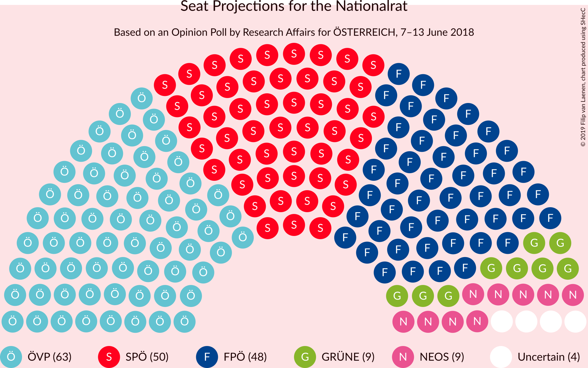
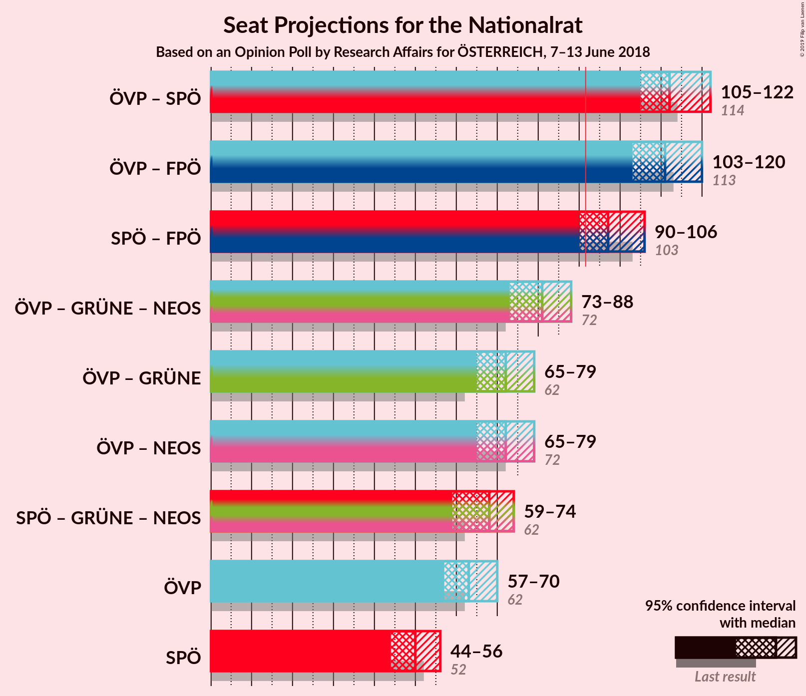
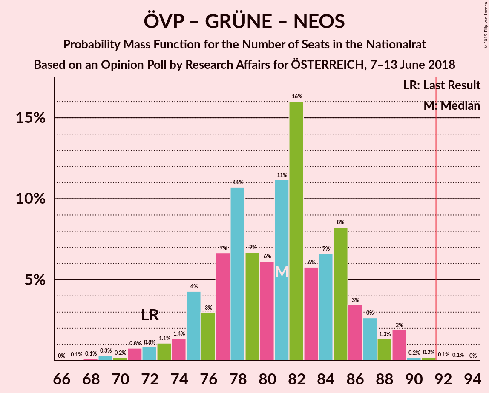
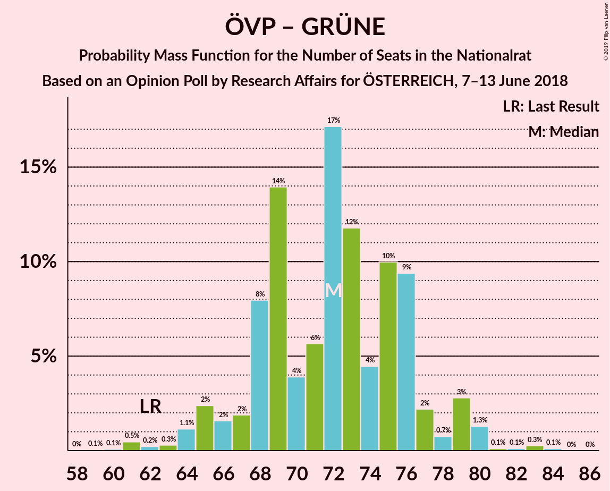
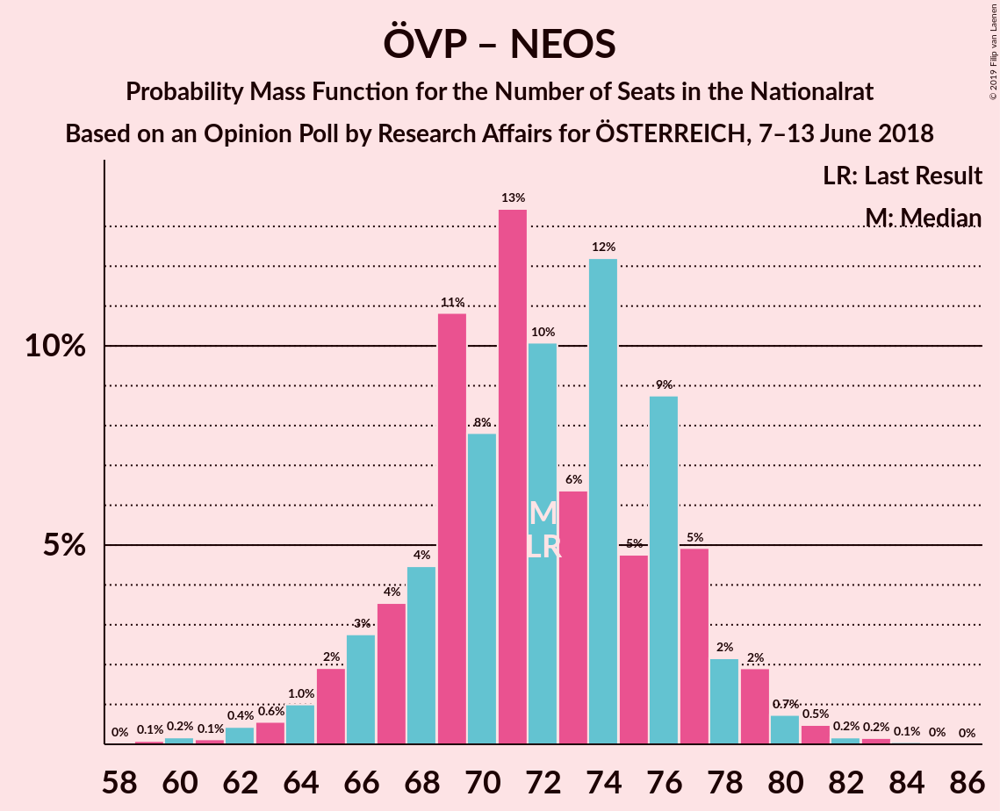
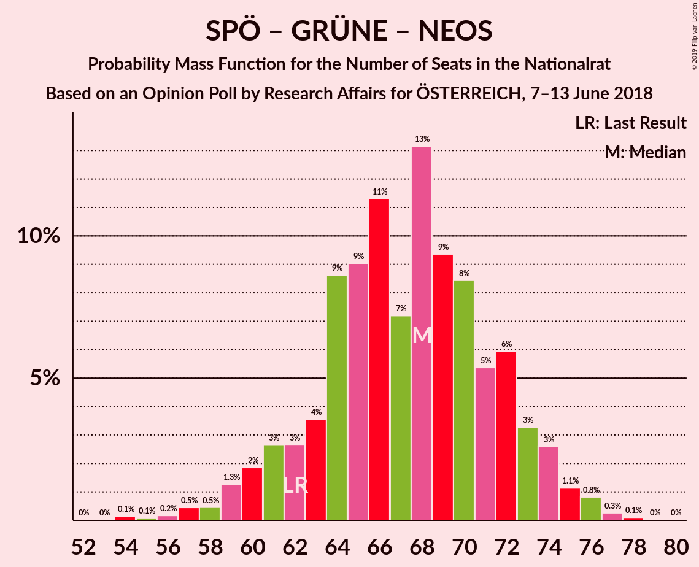

# Opinion Poll by Research Affairs for ÖSTERREICH, 7–13 June 2018

<a href="#voting-intentions">Voting Intentions</a> | <a href="#seats">Seats</a> | <a href="#coalitions">Coalitions</a> | <a href="#technical-information">Technical Information</a>

## Voting Intentions

### Confidence Intervals

| Party | Last Result | Poll Result | 80% Confidence Interval | 90% Confidence Interval | 95% Confidence Interval | 99% Confidence Interval |
|:-----:|:-----------:|:-----------:|:-----------------------:|:-----------------------:|:-----------------------:|:-----------------------:|
| Österreichische Volkspartei | 31.5% | 33.0% | 31.1–34.9% |30.6–35.5% |30.1–35.9% |29.2–36.9% |
| Sozialdemokratische Partei Österreichs | 26.9% | 26.0% | 24.3–27.8% |23.8–28.3% |23.4–28.8% |22.6–29.7% |
| Freiheitliche Partei Österreichs | 26.0% | 25.0% | 23.3–26.8% |22.8–27.3% |22.4–27.8% |21.6–28.7% |
| NEOS–Das Neue Österreich und Liberales Forum | 5.3% | 5.0% | 4.2–6.0% |4.0–6.3% |3.8–6.5% |3.4–7.0% |
| Die Grünen–Die Grüne Alternative | 3.8% | 5.0% | 4.2–6.0% |4.0–6.3% |3.8–6.5% |3.4–7.0% |
| JETZT–Liste Pilz | 4.4% | 2.0% | 1.5–2.7% |1.4–2.9% |1.3–3.1% |1.1–3.4% |

*Note:* The poll result column reflects the actual value used in the calculations. Published results may vary slightly, and in addition be rounded to fewer digits.

## Seats

### Confidence Intervals

| Party | Last Result | Median | 80% Confidence Interval | 90% Confidence Interval | 95% Confidence Interval | 99% Confidence Interval |
|:-----:|:-----------:|:------:|:-----------------------:|:-----------------------:|:-----------------------:|:-----------------------:|
| <a href="#österreichische-volkspartei">Österreichische Volkspartei</a> | 62 | 63 | 59–68 |58–68 |57–70 |55–72 |
| <a href="#sozialdemokratische-partei-österreichs">Sozialdemokratische Partei Österreichs</a> | 52 | 50 | 46–53 |45–55 |44–56 |43–58 |
| <a href="#freiheitliche-partei-österreichs">Freiheitliche Partei Österreichs</a> | 51 | 48 | 44–51 |43–53 |42–54 |41–56 |
| <a href="#neos–das-neue-österreich-und-liberales-forum">NEOS–Das Neue Österreich und Liberales Forum</a> | 10 | 9 | 8–11 |0–12 |0–12 |0–13 |
| <a href="#die-grünen–die-grüne-alternative">Die Grünen–Die Grüne Alternative</a> | 0 | 9 | 7–11 |0–12 |0–12 |0–13 |
| <a href="#jetzt–liste-pilz">JETZT–Liste Pilz</a> | 8 | 0 | 0 |0 |0 |0 |

### Österreichische Volkspartei

*For a full overview of the results for this party, see the [Österreichische Volkspartei](party-österreichischevolkspartei.html) page.*

| Number of Seats | Probability | Accumulated | Special Marks |
|:---------------:|:-----------:|:-----------:|:-------------:|
| 53 | 0.1% | 100% |  |
| 54 | 0.2% | 99.9% |  |
| 55 | 0.4% | 99.7% |  |
| 56 | 1.3% | 99.3% |  |
| 57 | 2% | 98% |  |
| 58 | 3% | 96% |  |
| 59 | 7% | 93% |  |
| 60 | 9% | 87% |  |
| 61 | 12% | 78% |  |
| 62 | 10% | 66% | Last Result |
| 63 | 11% | 56% | Median |
| 64 | 11% | 45% |  |
| 65 | 10% | 33% |  |
| 66 | 8% | 24% |  |
| 67 | 5% | 15% |  |
| 68 | 6% | 10% |  |
| 69 | 2% | 5% |  |
| 70 | 0.8% | 3% |  |
| 71 | 0.8% | 2% |  |
| 72 | 0.6% | 1.0% |  |
| 73 | 0.1% | 0.3% |  |
| 74 | 0.1% | 0.2% |  |
| 75 | 0.1% | 0.1% |  |
| 76 | 0% | 0% |  |

### Sozialdemokratische Partei Österreichs

*For a full overview of the results for this party, see the [Sozialdemokratische Partei Österreichs](party-sozialdemokratischeparteiösterreichs.html) page.*

| Number of Seats | Probability | Accumulated | Special Marks |
|:---------------:|:-----------:|:-----------:|:-------------:|
| 41 | 0.1% | 100% |  |
| 42 | 0.3% | 99.8% |  |
| 43 | 0.8% | 99.5% |  |
| 44 | 3% | 98.8% |  |
| 45 | 3% | 96% |  |
| 46 | 7% | 93% |  |
| 47 | 15% | 86% |  |
| 48 | 7% | 71% |  |
| 49 | 13% | 64% |  |
| 50 | 15% | 51% | Median |
| 51 | 9% | 36% |  |
| 52 | 11% | 27% | Last Result |
| 53 | 6% | 16% |  |
| 54 | 4% | 10% |  |
| 55 | 3% | 6% |  |
| 56 | 1.0% | 3% |  |
| 57 | 1.1% | 2% |  |
| 58 | 0.5% | 0.8% |  |
| 59 | 0.2% | 0.2% |  |
| 60 | 0.1% | 0.1% |  |
| 61 | 0% | 0% |  |

### Freiheitliche Partei Österreichs

*For a full overview of the results for this party, see the [Freiheitliche Partei Österreichs](party-freiheitlicheparteiösterreichs.html) page.*

| Number of Seats | Probability | Accumulated | Special Marks |
|:---------------:|:-----------:|:-----------:|:-------------:|
| 39 | 0% | 100% |  |
| 40 | 0.3% | 99.9% |  |
| 41 | 0.8% | 99.6% |  |
| 42 | 2% | 98.8% |  |
| 43 | 4% | 97% |  |
| 44 | 5% | 93% |  |
| 45 | 7% | 87% |  |
| 46 | 10% | 81% |  |
| 47 | 16% | 71% |  |
| 48 | 17% | 54% | Median |
| 49 | 15% | 38% |  |
| 50 | 8% | 23% |  |
| 51 | 6% | 15% | Last Result |
| 52 | 3% | 8% |  |
| 53 | 2% | 6% |  |
| 54 | 2% | 3% |  |
| 55 | 0.8% | 2% |  |
| 56 | 0.4% | 0.7% |  |
| 57 | 0.2% | 0.3% |  |
| 58 | 0% | 0.1% |  |
| 59 | 0% | 0% |  |

### NEOS–Das Neue Österreich und Liberales Forum

*For a full overview of the results for this party, see the [NEOS–Das Neue Österreich und Liberales Forum](party-neos–dasneueösterreichundliberalesforum.html) page.*

| Number of Seats | Probability | Accumulated | Special Marks |
|:---------------:|:-----------:|:-----------:|:-------------:|
| 0 | 6% | 100% |  |
| 1 | 0% | 94% |  |
| 2 | 0% | 94% |  |
| 3 | 0% | 94% |  |
| 4 | 0% | 94% |  |
| 5 | 0% | 94% |  |
| 6 | 0% | 94% |  |
| 7 | 3% | 94% |  |
| 8 | 20% | 91% |  |
| 9 | 30% | 71% | Median |
| 10 | 25% | 41% | Last Result |
| 11 | 11% | 16% |  |
| 12 | 4% | 5% |  |
| 13 | 1.2% | 1.3% |  |
| 14 | 0.2% | 0.2% |  |
| 15 | 0% | 0% |  |

### Die Grünen–Die Grüne Alternative

*For a full overview of the results for this party, see the [Die Grünen–Die Grüne Alternative](party-diegrünen–diegrünealternative.html) page.*

| Number of Seats | Probability | Accumulated | Special Marks |
|:---------------:|:-----------:|:-----------:|:-------------:|
| 0 | 6% | 100% | Last Result |
| 1 | 0% | 94% |  |
| 2 | 0% | 94% |  |
| 3 | 0% | 94% |  |
| 4 | 0% | 94% |  |
| 5 | 0% | 94% |  |
| 6 | 0% | 94% |  |
| 7 | 5% | 94% |  |
| 8 | 19% | 90% |  |
| 9 | 32% | 71% | Median |
| 10 | 20% | 39% |  |
| 11 | 14% | 19% |  |
| 12 | 4% | 5% |  |
| 13 | 1.2% | 1.4% |  |
| 14 | 0.2% | 0.2% |  |
| 15 | 0% | 0% |  |

### JETZT–Liste Pilz

*For a full overview of the results for this party, see the [JETZT–Liste Pilz](party-jetzt–listepilz.html) page.*

| Number of Seats | Probability | Accumulated | Special Marks |
|:---------------:|:-----------:|:-----------:|:-------------:|
| 0 | 100% | 100% | Median |
| 1 | 0% | 0% |  |
| 2 | 0% | 0% |  |
| 3 | 0% | 0% |  |
| 4 | 0% | 0% |  |
| 5 | 0% | 0% |  |
| 6 | 0% | 0% |  |
| 7 | 0% | 0% |  |
| 8 | 0% | 0% | Last Result |

## Coalitions

### Confidence Intervals

| Coalition | Last Result | Median | Majority? | 80% Confidence Interval | 90% Confidence Interval | 95% Confidence Interval | 99% Confidence Interval |
|:---------:|:-----------:|:------:|:---------:|:-----------------------:|:-----------------------:|:-----------------------:|:-----------------------:|
| Österreichische Volkspartei – Sozialdemokratische Partei Österreichs | 114 | 112 | 100% | 107–118 | 106–120 | 105–122 | 103–125 |
| Österreichische Volkspartei – Freiheitliche Partei Österreichs | 113 | 111 | 100% | 105–116 | 104–118 | 103–120 | 101–123 |
| Sozialdemokratische Partei Österreichs – Freiheitliche Partei Österreichs | 103 | 97 | 94% | 93–102 | 91–104 | 90–106 | 88–109 |
| Österreichische Volkspartei – Die Grünen–Die Grüne Alternative – NEOS–Das Neue Österreich und Liberales Forum | 72 | 81 | 0.1% | 76–85 | 75–87 | 73–88 | 69–90 |
| Österreichische Volkspartei – Die Grünen–Die Grüne Alternative | 62 | 72 | 0% | 68–76 | 66–78 | 65–79 | 61–81 |
| Österreichische Volkspartei – NEOS–Das Neue Österreich und Liberales Forum | 72 | 72 | 0% | 67–77 | 66–78 | 65–79 | 62–81 |
| Sozialdemokratische Partei Österreichs – Die Grünen–Die Grüne Alternative – NEOS–Das Neue Österreich und Liberales Forum | 62 | 68 | 0% | 63–72 | 61–73 | 59–74 | 57–76 |
| Österreichische Volkspartei | 62 | 63 | 0% | 59–68 | 58–68 | 57–70 | 55–72 |
| Sozialdemokratische Partei Österreichs | 52 | 50 | 0% | 46–53 | 45–55 | 44–56 | 43–58 |

### Österreichische Volkspartei – Sozialdemokratische Partei Österreichs

| Number of Seats | Probability | Accumulated | Special Marks |
|:---------------:|:-----------:|:-----------:|:-------------:|
| 101 | 0.1% | 100% |  |
| 102 | 0.2% | 99.9% |  |
| 103 | 0.4% | 99.7% |  |
| 104 | 0.9% | 99.4% |  |
| 105 | 1.1% | 98% |  |
| 106 | 3% | 97% |  |
| 107 | 5% | 95% |  |
| 108 | 6% | 90% |  |
| 109 | 7% | 83% |  |
| 110 | 10% | 77% |  |
| 111 | 8% | 67% |  |
| 112 | 11% | 58% |  |
| 113 | 6% | 47% | Median |
| 114 | 7% | 40% | Last Result |
| 115 | 5% | 33% |  |
| 116 | 10% | 28% |  |
| 117 | 5% | 18% |  |
| 118 | 5% | 13% |  |
| 119 | 2% | 9% |  |
| 120 | 2% | 6% |  |
| 121 | 1.1% | 4% |  |
| 122 | 1.0% | 3% |  |
| 123 | 0.7% | 2% |  |
| 124 | 0.2% | 1.0% |  |
| 125 | 0.4% | 0.8% |  |
| 126 | 0.2% | 0.4% |  |
| 127 | 0.1% | 0.2% |  |
| 128 | 0% | 0.1% |  |
| 129 | 0% | 0.1% |  |
| 130 | 0% | 0.1% |  |
| 131 | 0% | 0% |  |

### Österreichische Volkspartei – Freiheitliche Partei Österreichs

| Number of Seats | Probability | Accumulated | Special Marks |
|:---------------:|:-----------:|:-----------:|:-------------:|
| 99 | 0% | 100% |  |
| 100 | 0.1% | 99.9% |  |
| 101 | 0.3% | 99.8% |  |
| 102 | 0.6% | 99.5% |  |
| 103 | 2% | 98.8% |  |
| 104 | 2% | 97% |  |
| 105 | 5% | 94% |  |
| 106 | 4% | 90% |  |
| 107 | 5% | 85% |  |
| 108 | 8% | 80% |  |
| 109 | 12% | 72% |  |
| 110 | 7% | 59% |  |
| 111 | 10% | 53% | Median |
| 112 | 8% | 42% |  |
| 113 | 6% | 34% | Last Result |
| 114 | 9% | 28% |  |
| 115 | 7% | 19% |  |
| 116 | 4% | 12% |  |
| 117 | 2% | 8% |  |
| 118 | 2% | 6% |  |
| 119 | 1.0% | 3% |  |
| 120 | 0.9% | 3% |  |
| 121 | 0.6% | 2% |  |
| 122 | 0.4% | 1.0% |  |
| 123 | 0.2% | 0.6% |  |
| 124 | 0.2% | 0.4% |  |
| 125 | 0.1% | 0.2% |  |
| 126 | 0.1% | 0.1% |  |
| 127 | 0% | 0% |  |

### Sozialdemokratische Partei Österreichs – Freiheitliche Partei Österreichs

| Number of Seats | Probability | Accumulated | Special Marks |
|:---------------:|:-----------:|:-----------:|:-------------:|
| 86 | 0.1% | 100% |  |
| 87 | 0.2% | 99.9% |  |
| 88 | 0.4% | 99.7% |  |
| 89 | 0.9% | 99.3% |  |
| 90 | 2% | 98% |  |
| 91 | 2% | 96% |  |
| 92 | 3% | 94% | Majority |
| 93 | 7% | 90% |  |
| 94 | 11% | 83% |  |
| 95 | 7% | 73% |  |
| 96 | 8% | 66% |  |
| 97 | 9% | 59% |  |
| 98 | 14% | 49% | Median |
| 99 | 6% | 35% |  |
| 100 | 7% | 30% |  |
| 101 | 9% | 22% |  |
| 102 | 4% | 13% |  |
| 103 | 3% | 9% | Last Result |
| 104 | 2% | 7% |  |
| 105 | 2% | 5% |  |
| 106 | 1.2% | 3% |  |
| 107 | 0.7% | 2% |  |
| 108 | 0.6% | 1.1% |  |
| 109 | 0.2% | 0.5% |  |
| 110 | 0.1% | 0.3% |  |
| 111 | 0.2% | 0.3% |  |
| 112 | 0% | 0.1% |  |
| 113 | 0% | 0.1% |  |
| 114 | 0% | 0.1% |  |
| 115 | 0% | 0% |  |

### Österreichische Volkspartei – Die Grünen–Die Grüne Alternative – NEOS–Das Neue Österreich und Liberales Forum

| Number of Seats | Probability | Accumulated | Special Marks |
|:---------------:|:-----------:|:-----------:|:-------------:|
| 66 | 0% | 100% |  |
| 67 | 0.1% | 99.9% |  |
| 68 | 0.1% | 99.9% |  |
| 69 | 0.3% | 99.7% |  |
| 70 | 0.2% | 99.4% |  |
| 71 | 0.8% | 99.2% |  |
| 72 | 0.8% | 98% | Last Result |
| 73 | 1.1% | 98% |  |
| 74 | 1.4% | 97% |  |
| 75 | 4% | 95% |  |
| 76 | 3% | 91% |  |
| 77 | 7% | 88% |  |
| 78 | 11% | 81% |  |
| 79 | 7% | 71% |  |
| 80 | 6% | 64% |  |
| 81 | 11% | 58% | Median |
| 82 | 16% | 47% |  |
| 83 | 6% | 31% |  |
| 84 | 7% | 25% |  |
| 85 | 8% | 18% |  |
| 86 | 3% | 10% |  |
| 87 | 3% | 6% |  |
| 88 | 1.3% | 4% |  |
| 89 | 2% | 2% |  |
| 90 | 0.2% | 0.5% |  |
| 91 | 0.2% | 0.4% |  |
| 92 | 0.1% | 0.1% | Majority |
| 93 | 0.1% | 0.1% |  |
| 94 | 0% | 0% |  |

### Österreichische Volkspartei – Die Grünen–Die Grüne Alternative

| Number of Seats | Probability | Accumulated | Special Marks |
|:---------------:|:-----------:|:-----------:|:-------------:|
| 59 | 0.1% | 100% |  |
| 60 | 0.1% | 99.9% |  |
| 61 | 0.5% | 99.8% |  |
| 62 | 0.2% | 99.4% | Last Result |
| 63 | 0.3% | 99.1% |  |
| 64 | 1.1% | 98.8% |  |
| 65 | 2% | 98% |  |
| 66 | 2% | 95% |  |
| 67 | 2% | 94% |  |
| 68 | 8% | 92% |  |
| 69 | 14% | 84% |  |
| 70 | 4% | 70% |  |
| 71 | 6% | 66% |  |
| 72 | 17% | 60% | Median |
| 73 | 12% | 43% |  |
| 74 | 4% | 31% |  |
| 75 | 10% | 27% |  |
| 76 | 9% | 17% |  |
| 77 | 2% | 8% |  |
| 78 | 0.7% | 5% |  |
| 79 | 3% | 5% |  |
| 80 | 1.3% | 2% |  |
| 81 | 0.1% | 0.6% |  |
| 82 | 0.1% | 0.5% |  |
| 83 | 0.3% | 0.4% |  |
| 84 | 0.1% | 0.1% |  |
| 85 | 0% | 0% |  |

### Österreichische Volkspartei – NEOS–Das Neue Österreich und Liberales Forum

| Number of Seats | Probability | Accumulated | Special Marks |
|:---------------:|:-----------:|:-----------:|:-------------:|
| 59 | 0.1% | 100% |  |
| 60 | 0.2% | 99.9% |  |
| 61 | 0.1% | 99.7% |  |
| 62 | 0.4% | 99.6% |  |
| 63 | 0.6% | 99.1% |  |
| 64 | 1.0% | 98.6% |  |
| 65 | 2% | 98% |  |
| 66 | 3% | 96% |  |
| 67 | 4% | 93% |  |
| 68 | 4% | 89% |  |
| 69 | 11% | 85% |  |
| 70 | 8% | 74% |  |
| 71 | 13% | 66% |  |
| 72 | 10% | 53% | Last Result, Median |
| 73 | 6% | 43% |  |
| 74 | 12% | 36% |  |
| 75 | 5% | 24% |  |
| 76 | 9% | 19% |  |
| 77 | 5% | 11% |  |
| 78 | 2% | 6% |  |
| 79 | 2% | 4% |  |
| 80 | 0.7% | 2% |  |
| 81 | 0.5% | 0.9% |  |
| 82 | 0.2% | 0.4% |  |
| 83 | 0.2% | 0.3% |  |
| 84 | 0.1% | 0.1% |  |
| 85 | 0% | 0% |  |

### Sozialdemokratische Partei Österreichs – Die Grünen–Die Grüne Alternative – NEOS–Das Neue Österreich und Liberales Forum

| Number of Seats | Probability | Accumulated | Special Marks |
|:---------------:|:-----------:|:-----------:|:-------------:|
| 53 | 0% | 100% |  |
| 54 | 0.1% | 99.9% |  |
| 55 | 0.1% | 99.8% |  |
| 56 | 0.2% | 99.7% |  |
| 57 | 0.5% | 99.5% |  |
| 58 | 0.5% | 99.1% |  |
| 59 | 1.3% | 98.6% |  |
| 60 | 2% | 97% |  |
| 61 | 3% | 96% |  |
| 62 | 3% | 93% | Last Result |
| 63 | 4% | 90% |  |
| 64 | 9% | 87% |  |
| 65 | 9% | 78% |  |
| 66 | 11% | 69% |  |
| 67 | 7% | 58% |  |
| 68 | 13% | 51% | Median |
| 69 | 9% | 37% |  |
| 70 | 8% | 28% |  |
| 71 | 5% | 20% |  |
| 72 | 6% | 14% |  |
| 73 | 3% | 8% |  |
| 74 | 3% | 5% |  |
| 75 | 1.1% | 2% |  |
| 76 | 0.8% | 1.2% |  |
| 77 | 0.3% | 0.4% |  |
| 78 | 0.1% | 0.2% |  |
| 79 | 0% | 0% |  |

### Österreichische Volkspartei

| Number of Seats | Probability | Accumulated | Special Marks |
|:---------------:|:-----------:|:-----------:|:-------------:|
| 53 | 0.1% | 100% |  |
| 54 | 0.2% | 99.9% |  |
| 55 | 0.4% | 99.7% |  |
| 56 | 1.3% | 99.3% |  |
| 57 | 2% | 98% |  |
| 58 | 3% | 96% |  |
| 59 | 7% | 93% |  |
| 60 | 9% | 87% |  |
| 61 | 12% | 78% |  |
| 62 | 10% | 66% | Last Result |
| 63 | 11% | 56% | Median |
| 64 | 11% | 45% |  |
| 65 | 10% | 33% |  |
| 66 | 8% | 24% |  |
| 67 | 5% | 15% |  |
| 68 | 6% | 10% |  |
| 69 | 2% | 5% |  |
| 70 | 0.8% | 3% |  |
| 71 | 0.8% | 2% |  |
| 72 | 0.6% | 1.0% |  |
| 73 | 0.1% | 0.3% |  |
| 74 | 0.1% | 0.2% |  |
| 75 | 0.1% | 0.1% |  |
| 76 | 0% | 0% |  |

### Sozialdemokratische Partei Österreichs

| Number of Seats | Probability | Accumulated | Special Marks |
|:---------------:|:-----------:|:-----------:|:-------------:|
| 41 | 0.1% | 100% |  |
| 42 | 0.3% | 99.8% |  |
| 43 | 0.8% | 99.5% |  |
| 44 | 3% | 98.8% |  |
| 45 | 3% | 96% |  |
| 46 | 7% | 93% |  |
| 47 | 15% | 86% |  |
| 48 | 7% | 71% |  |
| 49 | 13% | 64% |  |
| 50 | 15% | 51% | Median |
| 51 | 9% | 36% |  |
| 52 | 11% | 27% | Last Result |
| 53 | 6% | 16% |  |
| 54 | 4% | 10% |  |
| 55 | 3% | 6% |  |
| 56 | 1.0% | 3% |  |
| 57 | 1.1% | 2% |  |
| 58 | 0.5% | 0.8% |  |
| 59 | 0.2% | 0.2% |  |
| 60 | 0.1% | 0.1% |  |
| 61 | 0% | 0% |  |

## Technical Information

### Opinion Poll

+ **Polling firm:** Research Affairs
+ **Commissioner(s):** ÖSTERREICH
+ **Fieldwork period:** 7–13 June 2018

### Calculations

+ **Sample size:** 1004
+ **Simulations done:** 131,072
+ **Error estimate:** 1.25%

