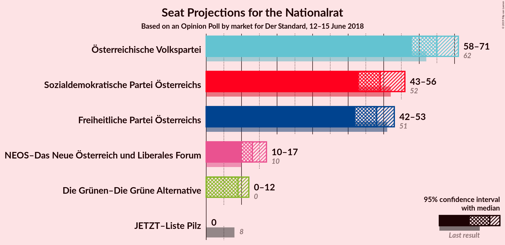
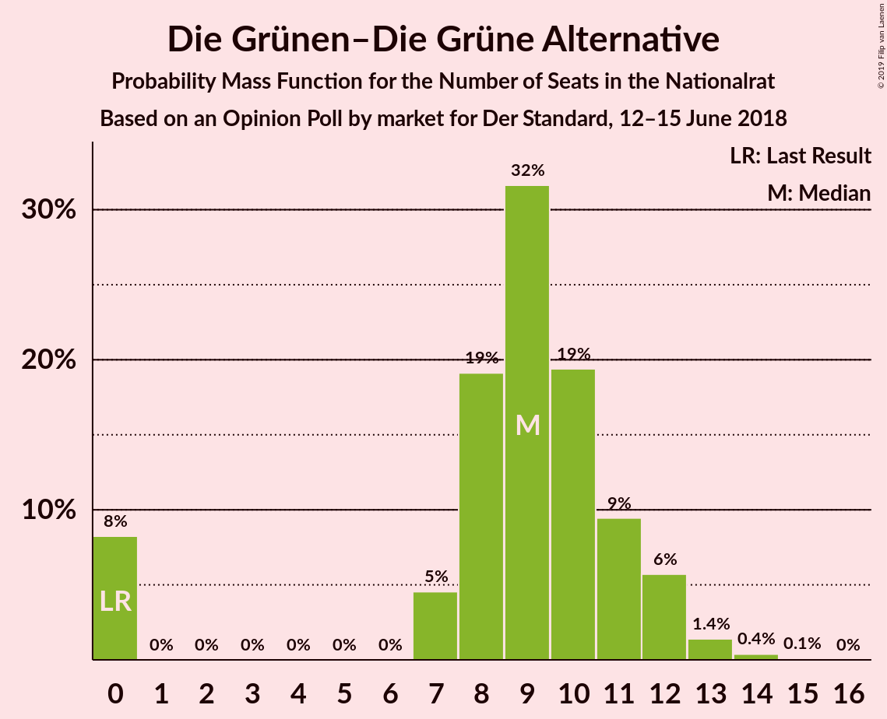
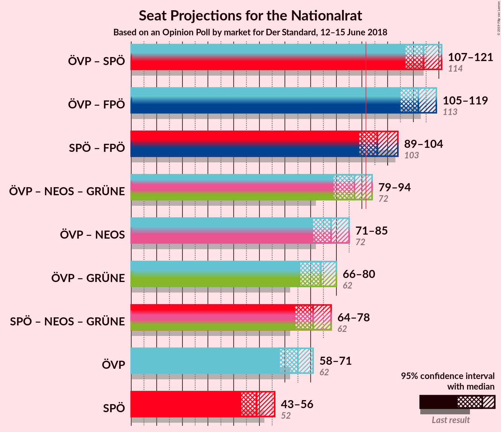
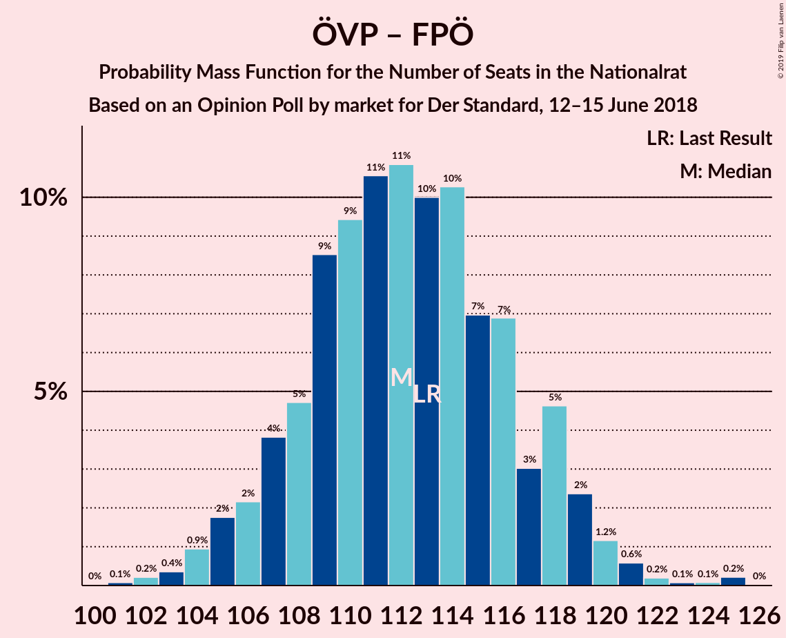
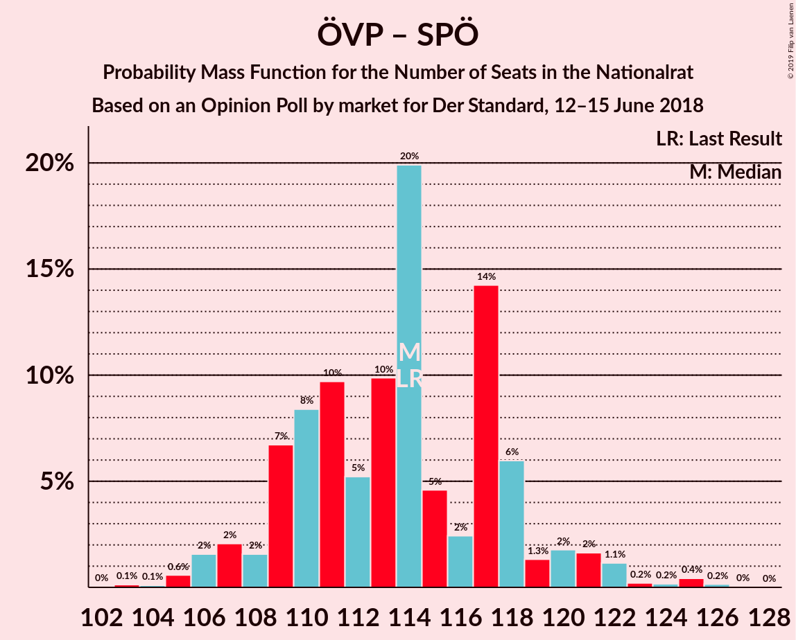
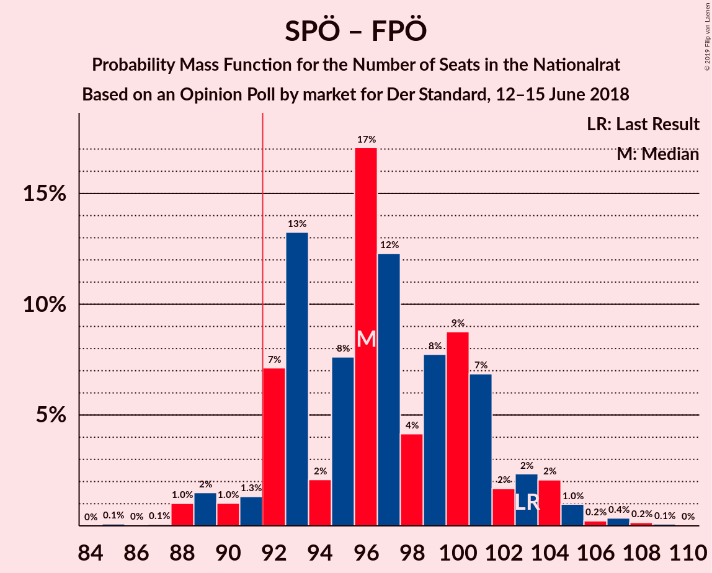

# Opinion Poll by market for Der Standard, 12–15 June 2018

<a href="#voting-intentions">Voting Intentions</a> | <a href="#seats">Seats</a> | <a href="#coalitions">Coalitions</a> | <a href="#technical-information">Technical Information</a>

## Voting Intentions

### Confidence Intervals

| Party | Last Result | Poll Result | 80% Confidence Interval | 90% Confidence Interval | 95% Confidence Interval | 99% Confidence Interval |
|:-----:|:-----------:|:-----------:|:-----------------------:|:-----------------------:|:-----------------------:|:-----------------------:|
| Österreichische Volkspartei | 31.5% | 34.0% | 31.9–36.2% |31.3–36.8% |30.8–37.4% |29.8–38.4% |
| Sozialdemokratische Partei Österreichs | 26.9% | 26.0% | 24.1–28.1% |23.5–28.7% |23.1–29.2% |22.2–30.2% |
| Freiheitliche Partei Österreichs | 26.0% | 25.0% | 23.1–27.0% |22.6–27.6% |22.1–28.1% |21.2–29.1% |
| NEOS–Das Neue Österreich und Liberales Forum | 5.3% | 7.0% | 6.0–8.3% |5.7–8.7% |5.4–9.0% |5.0–9.6% |
| Die Grünen–Die Grüne Alternative | 3.8% | 5.0% | 4.1–6.1% |3.9–6.5% |3.7–6.8% |3.3–7.3% |
| JETZT–Liste Pilz | 4.4% | 2.0% | 1.5–2.8% |1.4–3.0% |1.2–3.2% |1.0–3.7% |

*Note:* The poll result column reflects the actual value used in the calculations. Published results may vary slightly, and in addition be rounded to fewer digits.

## Seats

### Confidence Intervals

| Party | Last Result | Median | 80% Confidence Interval | 90% Confidence Interval | 95% Confidence Interval | 99% Confidence Interval |
|:-----:|:-----------:|:------:|:-----------------------:|:-----------------------:|:-----------------------:|:-----------------------:|
| <a href="#österreichische-volkspartei">Österreichische Volkspartei</a> | 62 | 64 | 62–67 |62–68 |60–69 |58–72 |
| <a href="#sozialdemokratische-partei-österreichs">Sozialdemokratische Partei Österreichs</a> | 52 | 50 | 45–51 |40–51 |40–56 |39–60 |
| <a href="#freiheitliche-partei-österreichs">Freiheitliche Partei Österreichs</a> | 51 | 49 | 46–49 |44–52 |42–55 |38–56 |
| <a href="#neos–das-neue-österreich-und-liberales-forum">NEOS–Das Neue Österreich und Liberales Forum</a> | 10 | 12 | 10–15 |10–17 |10–17 |8–17 |
| <a href="#die-grünen–die-grüne-alternative">Die Grünen–Die Grüne Alternative</a> | 0 | 9 | 8–13 |8–13 |7–13 |0–13 |
| <a href="#jetzt–liste-pilz">JETZT–Liste Pilz</a> | 8 | 0 | 0 |0 |0 |0 |

### Österreichische Volkspartei

*For a full overview of the results for this party, see the [Österreichische Volkspartei](party-österreichischevolkspartei.html) page.*

| Number of Seats | Probability | Accumulated | Special Marks |
|:---------------:|:-----------:|:-----------:|:-------------:|
| 55 | 0.1% | 100% |  |
| 56 | 0% | 99.9% |  |
| 57 | 0% | 99.8% |  |
| 58 | 0.4% | 99.8% |  |
| 59 | 0% | 99.4% |  |
| 60 | 4% | 99.4% |  |
| 61 | 0% | 96% |  |
| 62 | 23% | 96% | Last Result |
| 63 | 0% | 73% |  |
| 64 | 32% | 73% | Median |
| 65 | 0% | 41% |  |
| 66 | 26% | 41% |  |
| 67 | 7% | 15% |  |
| 68 | 6% | 8% |  |
| 69 | 2% | 3% |  |
| 70 | 0% | 1.0% |  |
| 71 | 0.4% | 1.0% |  |
| 72 | 0.2% | 0.6% |  |
| 73 | 0.1% | 0.5% |  |
| 74 | 0% | 0.4% |  |
| 75 | 0.3% | 0.3% |  |
| 76 | 0% | 0% |  |

### Sozialdemokratische Partei Österreichs

*For a full overview of the results for this party, see the [Sozialdemokratische Partei Österreichs](party-sozialdemokratischeparteiösterreichs.html) page.*

| Number of Seats | Probability | Accumulated | Special Marks |
|:---------------:|:-----------:|:-----------:|:-------------:|
| 39 | 0.7% | 100% |  |
| 40 | 5% | 99.3% |  |
| 41 | 0% | 95% |  |
| 42 | 0% | 95% |  |
| 43 | 2% | 95% |  |
| 44 | 0.2% | 92% |  |
| 45 | 7% | 92% |  |
| 46 | 1.4% | 86% |  |
| 47 | 32% | 84% |  |
| 48 | 0% | 52% |  |
| 49 | 0% | 52% |  |
| 50 | 22% | 52% | Median |
| 51 | 26% | 30% |  |
| 52 | 0% | 3% | Last Result |
| 53 | 0.5% | 3% |  |
| 54 | 0% | 3% |  |
| 55 | 0.3% | 3% |  |
| 56 | 0.2% | 3% |  |
| 57 | 2% | 2% |  |
| 58 | 0% | 1.0% |  |
| 59 | 0% | 1.0% |  |
| 60 | 1.0% | 1.0% |  |
| 61 | 0% | 0% |  |

### Freiheitliche Partei Österreichs

*For a full overview of the results for this party, see the [Freiheitliche Partei Österreichs](party-freiheitlicheparteiösterreichs.html) page.*

| Number of Seats | Probability | Accumulated | Special Marks |
|:---------------:|:-----------:|:-----------:|:-------------:|
| 38 | 1.1% | 100% |  |
| 39 | 0% | 98.9% |  |
| 40 | 0.3% | 98.9% |  |
| 41 | 0.9% | 98.6% |  |
| 42 | 0.6% | 98% |  |
| 43 | 0% | 97% |  |
| 44 | 7% | 97% |  |
| 45 | 0% | 91% |  |
| 46 | 27% | 91% |  |
| 47 | 0% | 63% |  |
| 48 | 9% | 63% |  |
| 49 | 46% | 55% | Median |
| 50 | 0% | 9% |  |
| 51 | 0% | 9% | Last Result |
| 52 | 5% | 9% |  |
| 53 | 0% | 4% |  |
| 54 | 1.0% | 4% |  |
| 55 | 0.2% | 3% |  |
| 56 | 2% | 2% |  |
| 57 | 0.1% | 0.1% |  |
| 58 | 0% | 0% |  |

### NEOS–Das Neue Österreich und Liberales Forum

*For a full overview of the results for this party, see the [NEOS–Das Neue Österreich und Liberales Forum](party-neos–dasneueösterreichundliberalesforum.html) page.*

| Number of Seats | Probability | Accumulated | Special Marks |
|:---------------:|:-----------:|:-----------:|:-------------:|
| 8 | 1.0% | 100% |  |
| 9 | 0.1% | 99.0% |  |
| 10 | 33% | 98.9% | Last Result |
| 11 | 2% | 66% |  |
| 12 | 26% | 64% | Median |
| 13 | 5% | 38% |  |
| 14 | 23% | 33% |  |
| 15 | 0.8% | 10% |  |
| 16 | 2% | 9% |  |
| 17 | 7% | 7% |  |
| 18 | 0% | 0.3% |  |
| 19 | 0.3% | 0.3% |  |
| 20 | 0% | 0% |  |

### Die Grünen–Die Grüne Alternative

*For a full overview of the results for this party, see the [Die Grünen–Die Grüne Alternative](party-diegrünen–diegrünealternative.html) page.*

| Number of Seats | Probability | Accumulated | Special Marks |
|:---------------:|:-----------:|:-----------:|:-------------:|
| 0 | 0.6% | 100% | Last Result |
| 1 | 0% | 99.4% |  |
| 2 | 0% | 99.4% |  |
| 3 | 0% | 99.4% |  |
| 4 | 0% | 99.4% |  |
| 5 | 0% | 99.4% |  |
| 6 | 0% | 99.4% |  |
| 7 | 2% | 99.4% |  |
| 8 | 43% | 97% |  |
| 9 | 9% | 55% | Median |
| 10 | 12% | 46% |  |
| 11 | 0.5% | 34% |  |
| 12 | 0% | 33% |  |
| 13 | 33% | 33% |  |
| 14 | 0.2% | 0.2% |  |
| 15 | 0% | 0% |  |

### JETZT–Liste Pilz

*For a full overview of the results for this party, see the [JETZT–Liste Pilz](party-jetzt–listepilz.html) page.*

| Number of Seats | Probability | Accumulated | Special Marks |
|:---------------:|:-----------:|:-----------:|:-------------:|
| 0 | 100% | 100% | Median |
| 1 | 0% | 0% |  |
| 2 | 0% | 0% |  |
| 3 | 0% | 0% |  |
| 4 | 0% | 0% |  |
| 5 | 0% | 0% |  |
| 6 | 0% | 0% |  |
| 7 | 0% | 0% |  |
| 8 | 0% | 0% | Last Result |

## Coalitions

### Confidence Intervals

| Coalition | Last Result | Median | Majority? | 80% Confidence Interval | 90% Confidence Interval | 95% Confidence Interval | 99% Confidence Interval |
|:---------:|:-----------:|:------:|:---------:|:-----------------------:|:-----------------------:|:-----------------------:|:-----------------------:|
| Österreichische Volkspartei – Freiheitliche Partei Österreichs | 113 | 112 | 100% | 110–113 | 110–120 | 107–120 | 103–122 |
| Österreichische Volkspartei – Sozialdemokratische Partei Österreichs | 114 | 112 | 100% | 111–117 | 108–117 | 106–117 | 103–126 |
| Sozialdemokratische Partei Österreichs – Freiheitliche Partei Österreichs | 103 | 97 | 92% | 92–99 | 89–99 | 89–100 | 87–106 |
| Österreichische Volkspartei | 62 | 64 | 0% | 62–67 | 62–68 | 60–69 | 58–72 |
| Sozialdemokratische Partei Österreichs | 52 | 50 | 0% | 45–51 | 40–51 | 40–56 | 39–60 |

### Österreichische Volkspartei – Freiheitliche Partei Österreichs

| Number of Seats | Probability | Accumulated | Special Marks |
|:---------------:|:-----------:|:-----------:|:-------------:|
| 100 | 0.3% | 100% |  |
| 101 | 0% | 99.7% |  |
| 102 | 0% | 99.7% |  |
| 103 | 0.5% | 99.7% |  |
| 104 | 0.4% | 99.2% |  |
| 105 | 0% | 98.8% |  |
| 106 | 1.0% | 98.8% |  |
| 107 | 1.1% | 98% |  |
| 108 | 0% | 97% |  |
| 109 | 0% | 97% |  |
| 110 | 9% | 97% |  |
| 111 | 20% | 88% |  |
| 112 | 26% | 68% |  |
| 113 | 32% | 42% | Last Result, Median |
| 114 | 0.2% | 9% |  |
| 115 | 0.2% | 9% |  |
| 116 | 2% | 9% |  |
| 117 | 0.3% | 7% |  |
| 118 | 0% | 6% |  |
| 119 | 0% | 6% |  |
| 120 | 5% | 6% |  |
| 121 | 0.7% | 2% |  |
| 122 | 1.0% | 1.0% |  |
| 123 | 0% | 0% |  |

### Österreichische Volkspartei – Sozialdemokratische Partei Österreichs

| Number of Seats | Probability | Accumulated | Special Marks |
|:---------------:|:-----------:|:-----------:|:-------------:|
| 103 | 2% | 100% |  |
| 104 | 0% | 98% |  |
| 105 | 0% | 98% |  |
| 106 | 0.1% | 98% |  |
| 107 | 0% | 97% |  |
| 108 | 5% | 97% |  |
| 109 | 0% | 92% |  |
| 110 | 0% | 92% |  |
| 111 | 32% | 92% |  |
| 112 | 29% | 60% |  |
| 113 | 0% | 31% |  |
| 114 | 1.0% | 31% | Last Result, Median |
| 115 | 1.2% | 30% |  |
| 116 | 0.4% | 29% |  |
| 117 | 26% | 29% |  |
| 118 | 0.1% | 2% |  |
| 119 | 0% | 2% |  |
| 120 | 1.0% | 2% |  |
| 121 | 0% | 1.5% |  |
| 122 | 0% | 1.4% |  |
| 123 | 0% | 1.4% |  |
| 124 | 0% | 1.4% |  |
| 125 | 0% | 1.4% |  |
| 126 | 1.4% | 1.4% |  |
| 127 | 0% | 0% |  |

### Sozialdemokratische Partei Österreichs – Freiheitliche Partei Österreichs

| Number of Seats | Probability | Accumulated | Special Marks |
|:---------------:|:-----------:|:-----------:|:-------------:|
| 86 | 0.2% | 100% |  |
| 87 | 0.4% | 99.8% |  |
| 88 | 0% | 99.4% |  |
| 89 | 7% | 99.4% |  |
| 90 | 0% | 93% |  |
| 91 | 0.7% | 93% |  |
| 92 | 5% | 92% | Majority |
| 93 | 0.4% | 88% |  |
| 94 | 0.5% | 87% |  |
| 95 | 1.4% | 87% |  |
| 96 | 32% | 85% |  |
| 97 | 26% | 53% |  |
| 98 | 9% | 27% |  |
| 99 | 16% | 18% | Median |
| 100 | 1.0% | 3% |  |
| 101 | 0% | 2% |  |
| 102 | 0% | 2% |  |
| 103 | 0.4% | 2% | Last Result |
| 104 | 0% | 1.3% |  |
| 105 | 0% | 1.3% |  |
| 106 | 1.0% | 1.2% |  |
| 107 | 0% | 0.3% |  |
| 108 | 0.1% | 0.3% |  |
| 109 | 0% | 0.2% |  |
| 110 | 0% | 0.2% |  |
| 111 | 0.2% | 0.2% |  |
| 112 | 0% | 0% |  |

### Österreichische Volkspartei

| Number of Seats | Probability | Accumulated | Special Marks |
|:---------------:|:-----------:|:-----------:|:-------------:|
| 55 | 0.1% | 100% |  |
| 56 | 0% | 99.9% |  |
| 57 | 0% | 99.8% |  |
| 58 | 0.4% | 99.8% |  |
| 59 | 0% | 99.4% |  |
| 60 | 4% | 99.4% |  |
| 61 | 0% | 96% |  |
| 62 | 23% | 96% | Last Result |
| 63 | 0% | 73% |  |
| 64 | 32% | 73% | Median |
| 65 | 0% | 41% |  |
| 66 | 26% | 41% |  |
| 67 | 7% | 15% |  |
| 68 | 6% | 8% |  |
| 69 | 2% | 3% |  |
| 70 | 0% | 1.0% |  |
| 71 | 0.4% | 1.0% |  |
| 72 | 0.2% | 0.6% |  |
| 73 | 0.1% | 0.5% |  |
| 74 | 0% | 0.4% |  |
| 75 | 0.3% | 0.3% |  |
| 76 | 0% | 0% |  |

### Sozialdemokratische Partei Österreichs

| Number of Seats | Probability | Accumulated | Special Marks |
|:---------------:|:-----------:|:-----------:|:-------------:|
| 39 | 0.7% | 100% |  |
| 40 | 5% | 99.3% |  |
| 41 | 0% | 95% |  |
| 42 | 0% | 95% |  |
| 43 | 2% | 95% |  |
| 44 | 0.2% | 92% |  |
| 45 | 7% | 92% |  |
| 46 | 1.4% | 86% |  |
| 47 | 32% | 84% |  |
| 48 | 0% | 52% |  |
| 49 | 0% | 52% |  |
| 50 | 22% | 52% | Median |
| 51 | 26% | 30% |  |
| 52 | 0% | 3% | Last Result |
| 53 | 0.5% | 3% |  |
| 54 | 0% | 3% |  |
| 55 | 0.3% | 3% |  |
| 56 | 0.2% | 3% |  |
| 57 | 2% | 2% |  |
| 58 | 0% | 1.0% |  |
| 59 | 0% | 1.0% |  |
| 60 | 1.0% | 1.0% |  |
| 61 | 0% | 0% |  |

## Technical Information

### Opinion Poll

+ **Polling firm:** market
+ **Commissioner(s):** Der Standard
+ **Fieldwork period:** 12–15 June 2018

### Calculations

+ **Sample size:** 800
+ **Simulations done:** 1,024
+ **Error estimate:** 2.30%

