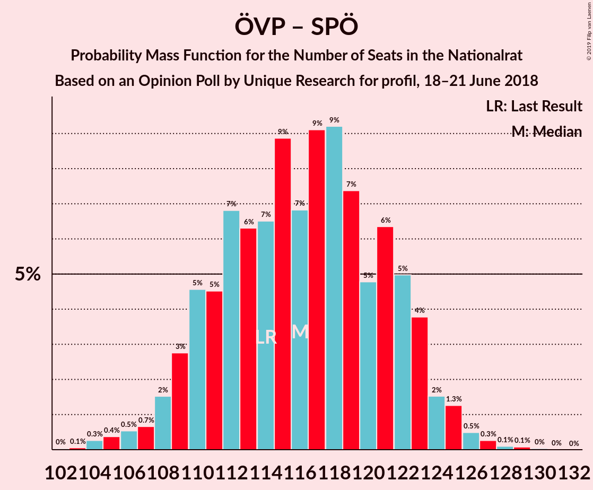

# Opinion Poll by Unique Research for profil, 18–21 June 2018

<a href="#voting-intentions">Voting Intentions</a> | <a href="#seats">Seats</a> | <a href="#coalitions">Coalitions</a> | <a href="#technical-information">Technical Information</a>

## Voting Intentions

### Confidence Intervals

| Party | Last Result | Poll Result | 80% Confidence Interval | 90% Confidence Interval | 95% Confidence Interval | 99% Confidence Interval |
|:-----:|:-----------:|:-----------:|:-----------------------:|:-----------------------:|:-----------------------:|:-----------------------:|
| Österreichische Volkspartei | 31.5% | 33.0% | 30.9–35.2% |30.3–35.8% |29.8–36.3% |28.8–37.4% |
| Sozialdemokratische Partei Österreichs | 26.9% | 27.0% | 25.1–29.1% |24.5–29.7% |24.0–30.2% |23.1–31.2% |
| Freiheitliche Partei Österreichs | 26.0% | 25.0% | 23.1–27.0% |22.6–27.6% |22.1–28.1% |21.2–29.1% |
| NEOS–Das Neue Österreich und Liberales Forum | 5.3% | 7.0% | 6.0–8.3% |5.7–8.7% |5.4–9.0% |5.0–9.6% |
| Die Grünen–Die Grüne Alternative | 3.8% | 4.0% | 3.2–5.0% |3.0–5.3% |2.9–5.6% |2.5–6.1% |
| JETZT–Liste Pilz | 4.4% | 3.0% | 2.3–3.9% |2.2–4.2% |2.0–4.4% |1.8–4.9% |

*Note:* The poll result column reflects the actual value used in the calculations. Published results may vary slightly, and in addition be rounded to fewer digits.

## Seats

### Confidence Intervals

| Party | Last Result | Median | 80% Confidence Interval | 90% Confidence Interval | 95% Confidence Interval | 99% Confidence Interval |
|:-----:|:-----------:|:------:|:-----------------------:|:-----------------------:|:-----------------------:|:-----------------------:|
| <a href="#österreichische-volkspartei">Österreichische Volkspartei</a> | 62 | 64 | 59–68 |58–69 |57–71 |55–73 |
| <a href="#sozialdemokratische-partei-österreichs">Sozialdemokratische Partei Österreichs</a> | 52 | 52 | 48–57 |47–58 |46–59 |44–61 |
| <a href="#freiheitliche-partei-österreichs">Freiheitliche Partei Österreichs</a> | 51 | 48 | 44–53 |43–54 |42–55 |41–57 |
| <a href="#neos–das-neue-österreich-und-liberales-forum">NEOS–Das Neue Österreich und Liberales Forum</a> | 10 | 13 | 11–16 |11–16 |10–17 |9–18 |
| <a href="#die-grünen–die-grüne-alternative">Die Grünen–Die Grüne Alternative</a> | 0 | 7 | 0–9 |0–10 |0–10 |0–11 |
| <a href="#jetzt–liste-pilz">JETZT–Liste Pilz</a> | 8 | 0 | 0 |0–7 |0–8 |0–9 |

### Österreichische Volkspartei

*For a full overview of the results for this party, see the [Österreichische Volkspartei](party-österreichischevolkspartei.html) page.*

| Number of Seats | Probability | Accumulated | Special Marks |
|:---------------:|:-----------:|:-----------:|:-------------:|
| 53 | 0.1% | 100% |  |
| 54 | 0.2% | 99.9% |  |
| 55 | 0.4% | 99.7% |  |
| 56 | 1.2% | 99.3% |  |
| 57 | 1.2% | 98% |  |
| 58 | 3% | 97% |  |
| 59 | 5% | 94% |  |
| 60 | 8% | 89% |  |
| 61 | 7% | 81% |  |
| 62 | 10% | 74% | Last Result |
| 63 | 8% | 65% |  |
| 64 | 10% | 56% | Median |
| 65 | 13% | 46% |  |
| 66 | 8% | 33% |  |
| 67 | 9% | 25% |  |
| 68 | 7% | 17% |  |
| 69 | 5% | 9% |  |
| 70 | 1.4% | 4% |  |
| 71 | 1.2% | 3% |  |
| 72 | 0.5% | 1.3% |  |
| 73 | 0.4% | 0.8% |  |
| 74 | 0.3% | 0.5% |  |
| 75 | 0.1% | 0.2% |  |
| 76 | 0.1% | 0.1% |  |
| 77 | 0% | 0% |  |

### Sozialdemokratische Partei Österreichs

*For a full overview of the results for this party, see the [Sozialdemokratische Partei Österreichs](party-sozialdemokratischeparteiösterreichs.html) page.*

| Number of Seats | Probability | Accumulated | Special Marks |
|:---------------:|:-----------:|:-----------:|:-------------:|
| 42 | 0.1% | 100% |  |
| 43 | 0.2% | 99.9% |  |
| 44 | 0.4% | 99.7% |  |
| 45 | 1.0% | 99.2% |  |
| 46 | 2% | 98% |  |
| 47 | 3% | 96% |  |
| 48 | 8% | 93% |  |
| 49 | 6% | 86% |  |
| 50 | 8% | 80% |  |
| 51 | 12% | 72% |  |
| 52 | 12% | 60% | Last Result, Median |
| 53 | 11% | 47% |  |
| 54 | 13% | 36% |  |
| 55 | 6% | 23% |  |
| 56 | 7% | 17% |  |
| 57 | 5% | 10% |  |
| 58 | 2% | 5% |  |
| 59 | 2% | 3% |  |
| 60 | 0.8% | 1.3% |  |
| 61 | 0.2% | 0.6% |  |
| 62 | 0.3% | 0.4% |  |
| 63 | 0.1% | 0.1% |  |
| 64 | 0% | 0.1% |  |
| 65 | 0% | 0% |  |

### Freiheitliche Partei Österreichs

*For a full overview of the results for this party, see the [Freiheitliche Partei Österreichs](party-freiheitlicheparteiösterreichs.html) page.*

| Number of Seats | Probability | Accumulated | Special Marks |
|:---------------:|:-----------:|:-----------:|:-------------:|
| 38 | 0.1% | 100% |  |
| 39 | 0.2% | 99.9% |  |
| 40 | 0.2% | 99.8% |  |
| 41 | 1.3% | 99.5% |  |
| 42 | 1.2% | 98% |  |
| 43 | 3% | 97% |  |
| 44 | 6% | 94% |  |
| 45 | 7% | 88% |  |
| 46 | 12% | 81% |  |
| 47 | 8% | 69% |  |
| 48 | 14% | 61% | Median |
| 49 | 9% | 47% |  |
| 50 | 11% | 38% |  |
| 51 | 9% | 26% | Last Result |
| 52 | 7% | 17% |  |
| 53 | 5% | 10% |  |
| 54 | 2% | 5% |  |
| 55 | 3% | 3% |  |
| 56 | 0.4% | 1.0% |  |
| 57 | 0.3% | 0.6% |  |
| 58 | 0.1% | 0.2% |  |
| 59 | 0.1% | 0.1% |  |
| 60 | 0% | 0% |  |

### NEOS–Das Neue Österreich und Liberales Forum

*For a full overview of the results for this party, see the [NEOS–Das Neue Österreich und Liberales Forum](party-neos–dasneueösterreichundliberalesforum.html) page.*

| Number of Seats | Probability | Accumulated | Special Marks |
|:---------------:|:-----------:|:-----------:|:-------------:|
| 8 | 0.1% | 100% |  |
| 9 | 1.0% | 99.9% |  |
| 10 | 3% | 98.9% | Last Result |
| 11 | 12% | 96% |  |
| 12 | 17% | 84% |  |
| 13 | 22% | 67% | Median |
| 14 | 21% | 45% |  |
| 15 | 13% | 24% |  |
| 16 | 7% | 11% |  |
| 17 | 3% | 4% |  |
| 18 | 1.1% | 2% |  |
| 19 | 0.4% | 0.5% |  |
| 20 | 0.1% | 0.1% |  |
| 21 | 0% | 0% |  |

### Die Grünen–Die Grüne Alternative

*For a full overview of the results for this party, see the [Die Grünen–Die Grüne Alternative](party-diegrünen–diegrünealternative.html) page.*

| Number of Seats | Probability | Accumulated | Special Marks |
|:---------------:|:-----------:|:-----------:|:-------------:|
| 0 | 47% | 100% | Last Result |
| 1 | 0% | 53% |  |
| 2 | 0% | 53% |  |
| 3 | 0% | 53% |  |
| 4 | 0% | 53% |  |
| 5 | 0% | 53% |  |
| 6 | 0% | 53% |  |
| 7 | 9% | 53% | Median |
| 8 | 23% | 44% |  |
| 9 | 16% | 22% |  |
| 10 | 4% | 6% |  |
| 11 | 2% | 2% |  |
| 12 | 0.2% | 0.3% |  |
| 13 | 0.1% | 0.1% |  |
| 14 | 0% | 0% |  |

### JETZT–Liste Pilz

*For a full overview of the results for this party, see the [JETZT–Liste Pilz](party-jetzt–listepilz.html) page.*

| Number of Seats | Probability | Accumulated | Special Marks |
|:---------------:|:-----------:|:-----------:|:-------------:|
| 0 | 92% | 100% | Median |
| 1 | 0% | 8% |  |
| 2 | 0% | 8% |  |
| 3 | 0% | 8% |  |
| 4 | 0% | 8% |  |
| 5 | 0% | 8% |  |
| 6 | 0% | 8% |  |
| 7 | 4% | 8% |  |
| 8 | 3% | 4% | Last Result |
| 9 | 0.7% | 0.9% |  |
| 10 | 0.1% | 0.1% |  |
| 11 | 0% | 0% |  |

## Coalitions

### Confidence Intervals

| Coalition | Last Result | Median | Majority? | 80% Confidence Interval | 90% Confidence Interval | 95% Confidence Interval | 99% Confidence Interval |
|:---------:|:-----------:|:------:|:---------:|:-----------------------:|:-----------------------:|:-----------------------:|:-----------------------:|
| Österreichische Volkspartei – Sozialdemokratische Partei Österreichs | 114 | 116 | 100% | 110–122 | 109–123 | 108–124 | 105–126 |
| Österreichische Volkspartei – Freiheitliche Partei Österreichs | 113 | 112 | 100% | 107–118 | 105–119 | 104–120 | 101–123 |
| Sozialdemokratische Partei Österreichs – Freiheitliche Partei Österreichs | 103 | 101 | 99.0% | 95–106 | 94–107 | 92–108 | 90–111 |
| Österreichische Volkspartei – NEOS–Das Neue Österreich und Liberales Forum – Die Grünen–Die Grüne Alternative | 72 | 82 | 0.4% | 77–87 | 75–89 | 74–89 | 70–91 |
| Österreichische Volkspartei – NEOS–Das Neue Österreich und Liberales Forum | 72 | 77 | 0% | 72–82 | 71–83 | 70–85 | 68–88 |
| Sozialdemokratische Partei Österreichs – NEOS–Das Neue Österreich und Liberales Forum – Die Grünen–Die Grüne Alternative | 62 | 70 | 0% | 65–76 | 63–77 | 62–78 | 60–81 |
| Österreichische Volkspartei – Die Grünen–Die Grüne Alternative | 62 | 68 | 0% | 63–74 | 61–76 | 60–76 | 58–78 |
| Österreichische Volkspartei | 62 | 64 | 0% | 59–68 | 58–69 | 57–71 | 55–73 |
| Sozialdemokratische Partei Österreichs | 52 | 52 | 0% | 48–57 | 47–58 | 46–59 | 44–61 |

### Österreichische Volkspartei – Sozialdemokratische Partei Österreichs

| Number of Seats | Probability | Accumulated | Special Marks |
|:---------------:|:-----------:|:-----------:|:-------------:|
| 102 | 0% | 100% |  |
| 103 | 0.1% | 99.9% |  |
| 104 | 0.3% | 99.9% |  |
| 105 | 0.4% | 99.6% |  |
| 106 | 0.5% | 99.2% |  |
| 107 | 0.7% | 98.7% |  |
| 108 | 2% | 98% |  |
| 109 | 3% | 97% |  |
| 110 | 5% | 94% |  |
| 111 | 5% | 89% |  |
| 112 | 7% | 85% |  |
| 113 | 6% | 78% |  |
| 114 | 7% | 72% | Last Result |
| 115 | 9% | 65% |  |
| 116 | 7% | 56% | Median |
| 117 | 9% | 49% |  |
| 118 | 9% | 40% |  |
| 119 | 7% | 31% |  |
| 120 | 5% | 24% |  |
| 121 | 6% | 19% |  |
| 122 | 5% | 13% |  |
| 123 | 4% | 8% |  |
| 124 | 2% | 4% |  |
| 125 | 1.3% | 2% |  |
| 126 | 0.5% | 1.0% |  |
| 127 | 0.3% | 0.5% |  |
| 128 | 0.1% | 0.2% |  |
| 129 | 0.1% | 0.1% |  |
| 130 | 0% | 0.1% |  |
| 131 | 0% | 0% |  |

### Österreichische Volkspartei – Freiheitliche Partei Österreichs

| Number of Seats | Probability | Accumulated | Special Marks |
|:---------------:|:-----------:|:-----------:|:-------------:|
| 99 | 0.1% | 100% |  |
| 100 | 0.2% | 99.9% |  |
| 101 | 0.2% | 99.6% |  |
| 102 | 0.6% | 99.4% |  |
| 103 | 0.6% | 98.9% |  |
| 104 | 1.3% | 98% |  |
| 105 | 4% | 97% |  |
| 106 | 3% | 93% |  |
| 107 | 5% | 90% |  |
| 108 | 4% | 85% |  |
| 109 | 5% | 81% |  |
| 110 | 13% | 76% |  |
| 111 | 7% | 64% |  |
| 112 | 7% | 56% | Median |
| 113 | 10% | 49% | Last Result |
| 114 | 3% | 39% |  |
| 115 | 11% | 35% |  |
| 116 | 9% | 24% |  |
| 117 | 3% | 16% |  |
| 118 | 7% | 12% |  |
| 119 | 0.7% | 6% |  |
| 120 | 3% | 5% |  |
| 121 | 1.4% | 2% |  |
| 122 | 0.1% | 0.9% |  |
| 123 | 0.5% | 0.8% |  |
| 124 | 0.2% | 0.3% |  |
| 125 | 0% | 0.1% |  |
| 126 | 0% | 0.1% |  |
| 127 | 0% | 0% |  |

### Sozialdemokratische Partei Österreichs – Freiheitliche Partei Österreichs

| Number of Seats | Probability | Accumulated | Special Marks |
|:---------------:|:-----------:|:-----------:|:-------------:|
| 87 | 0% | 100% |  |
| 88 | 0.1% | 99.9% |  |
| 89 | 0.2% | 99.9% |  |
| 90 | 0.3% | 99.6% |  |
| 91 | 0.4% | 99.4% |  |
| 92 | 2% | 99.0% | Majority |
| 93 | 1.3% | 97% |  |
| 94 | 5% | 96% |  |
| 95 | 3% | 92% |  |
| 96 | 3% | 88% |  |
| 97 | 9% | 85% |  |
| 98 | 7% | 76% |  |
| 99 | 8% | 69% |  |
| 100 | 10% | 61% | Median |
| 101 | 8% | 51% |  |
| 102 | 10% | 43% |  |
| 103 | 7% | 33% | Last Result |
| 104 | 7% | 26% |  |
| 105 | 4% | 20% |  |
| 106 | 8% | 15% |  |
| 107 | 3% | 7% |  |
| 108 | 2% | 4% |  |
| 109 | 1.1% | 2% |  |
| 110 | 0.7% | 1.3% |  |
| 111 | 0.3% | 0.6% |  |
| 112 | 0.1% | 0.3% |  |
| 113 | 0.1% | 0.1% |  |
| 114 | 0% | 0.1% |  |
| 115 | 0% | 0% |  |

### Österreichische Volkspartei – NEOS–Das Neue Österreich und Liberales Forum – Die Grünen–Die Grüne Alternative

| Number of Seats | Probability | Accumulated | Special Marks |
|:---------------:|:-----------:|:-----------:|:-------------:|
| 68 | 0% | 100% |  |
| 69 | 0.1% | 99.9% |  |
| 70 | 0.4% | 99.9% |  |
| 71 | 0.2% | 99.5% |  |
| 72 | 0.6% | 99.3% | Last Result |
| 73 | 0.9% | 98.7% |  |
| 74 | 2% | 98% |  |
| 75 | 2% | 96% |  |
| 76 | 3% | 94% |  |
| 77 | 9% | 90% |  |
| 78 | 5% | 81% |  |
| 79 | 8% | 77% |  |
| 80 | 8% | 69% |  |
| 81 | 9% | 61% |  |
| 82 | 8% | 52% |  |
| 83 | 10% | 44% |  |
| 84 | 8% | 34% | Median |
| 85 | 6% | 26% |  |
| 86 | 8% | 20% |  |
| 87 | 3% | 12% |  |
| 88 | 3% | 9% |  |
| 89 | 4% | 6% |  |
| 90 | 0.9% | 2% |  |
| 91 | 1.0% | 1.4% |  |
| 92 | 0.2% | 0.4% | Majority |
| 93 | 0.1% | 0.3% |  |
| 94 | 0.1% | 0.1% |  |
| 95 | 0% | 0% |  |

### Österreichische Volkspartei – NEOS–Das Neue Österreich und Liberales Forum

| Number of Seats | Probability | Accumulated | Special Marks |
|:---------------:|:-----------:|:-----------:|:-------------:|
| 65 | 0% | 100% |  |
| 66 | 0.2% | 99.9% |  |
| 67 | 0.2% | 99.8% |  |
| 68 | 0.6% | 99.6% |  |
| 69 | 0.6% | 99.0% |  |
| 70 | 2% | 98% |  |
| 71 | 3% | 96% |  |
| 72 | 5% | 93% | Last Result |
| 73 | 7% | 89% |  |
| 74 | 4% | 82% |  |
| 75 | 9% | 77% |  |
| 76 | 8% | 68% |  |
| 77 | 17% | 60% | Median |
| 78 | 7% | 43% |  |
| 79 | 7% | 36% |  |
| 80 | 7% | 29% |  |
| 81 | 6% | 21% |  |
| 82 | 5% | 15% |  |
| 83 | 6% | 10% |  |
| 84 | 0.9% | 4% |  |
| 85 | 1.2% | 3% |  |
| 86 | 0.7% | 2% |  |
| 87 | 0.3% | 0.9% |  |
| 88 | 0.4% | 0.5% |  |
| 89 | 0% | 0.1% |  |
| 90 | 0% | 0.1% |  |
| 91 | 0% | 0% |  |

### Sozialdemokratische Partei Österreichs – NEOS–Das Neue Österreich und Liberales Forum – Die Grünen–Die Grüne Alternative

| Number of Seats | Probability | Accumulated | Special Marks |
|:---------------:|:-----------:|:-----------:|:-------------:|
| 57 | 0% | 100% |  |
| 58 | 0.1% | 99.9% |  |
| 59 | 0.2% | 99.8% |  |
| 60 | 1.0% | 99.6% |  |
| 61 | 0.4% | 98.6% |  |
| 62 | 2% | 98% | Last Result |
| 63 | 3% | 97% |  |
| 64 | 1.4% | 93% |  |
| 65 | 7% | 92% |  |
| 66 | 5% | 85% |  |
| 67 | 8% | 80% |  |
| 68 | 11% | 71% |  |
| 69 | 4% | 60% |  |
| 70 | 10% | 56% |  |
| 71 | 7% | 46% |  |
| 72 | 7% | 39% | Median |
| 73 | 12% | 31% |  |
| 74 | 4% | 19% |  |
| 75 | 4% | 15% |  |
| 76 | 4% | 11% |  |
| 77 | 2% | 7% |  |
| 78 | 3% | 5% |  |
| 79 | 0.8% | 2% |  |
| 80 | 0.3% | 0.8% |  |
| 81 | 0.3% | 0.5% |  |
| 82 | 0.1% | 0.2% |  |
| 83 | 0.1% | 0.1% |  |
| 84 | 0% | 0% |  |

### Österreichische Volkspartei – Die Grünen–Die Grüne Alternative

| Number of Seats | Probability | Accumulated | Special Marks |
|:---------------:|:-----------:|:-----------:|:-------------:|
| 55 | 0% | 100% |  |
| 56 | 0.1% | 99.9% |  |
| 57 | 0.2% | 99.9% |  |
| 58 | 0.3% | 99.6% |  |
| 59 | 1.3% | 99.3% |  |
| 60 | 1.2% | 98% |  |
| 61 | 3% | 97% |  |
| 62 | 1.3% | 94% | Last Result |
| 63 | 4% | 93% |  |
| 64 | 5% | 89% |  |
| 65 | 10% | 83% |  |
| 66 | 7% | 74% |  |
| 67 | 8% | 66% |  |
| 68 | 12% | 58% |  |
| 69 | 10% | 47% |  |
| 70 | 7% | 37% |  |
| 71 | 5% | 30% | Median |
| 72 | 5% | 25% |  |
| 73 | 7% | 20% |  |
| 74 | 3% | 13% |  |
| 75 | 4% | 10% |  |
| 76 | 3% | 5% |  |
| 77 | 1.1% | 2% |  |
| 78 | 0.5% | 0.9% |  |
| 79 | 0.2% | 0.4% |  |
| 80 | 0.1% | 0.2% |  |
| 81 | 0% | 0.1% |  |
| 82 | 0% | 0% |  |

### Österreichische Volkspartei

| Number of Seats | Probability | Accumulated | Special Marks |
|:---------------:|:-----------:|:-----------:|:-------------:|
| 53 | 0.1% | 100% |  |
| 54 | 0.2% | 99.9% |  |
| 55 | 0.4% | 99.7% |  |
| 56 | 1.2% | 99.3% |  |
| 57 | 1.2% | 98% |  |
| 58 | 3% | 97% |  |
| 59 | 5% | 94% |  |
| 60 | 8% | 89% |  |
| 61 | 7% | 81% |  |
| 62 | 10% | 74% | Last Result |
| 63 | 8% | 65% |  |
| 64 | 10% | 56% | Median |
| 65 | 13% | 46% |  |
| 66 | 8% | 33% |  |
| 67 | 9% | 25% |  |
| 68 | 7% | 17% |  |
| 69 | 5% | 9% |  |
| 70 | 1.4% | 4% |  |
| 71 | 1.2% | 3% |  |
| 72 | 0.5% | 1.3% |  |
| 73 | 0.4% | 0.8% |  |
| 74 | 0.3% | 0.5% |  |
| 75 | 0.1% | 0.2% |  |
| 76 | 0.1% | 0.1% |  |
| 77 | 0% | 0% |  |

### Sozialdemokratische Partei Österreichs

| Number of Seats | Probability | Accumulated | Special Marks |
|:---------------:|:-----------:|:-----------:|:-------------:|
| 42 | 0.1% | 100% |  |
| 43 | 0.2% | 99.9% |  |
| 44 | 0.4% | 99.7% |  |
| 45 | 1.0% | 99.2% |  |
| 46 | 2% | 98% |  |
| 47 | 3% | 96% |  |
| 48 | 8% | 93% |  |
| 49 | 6% | 86% |  |
| 50 | 8% | 80% |  |
| 51 | 12% | 72% |  |
| 52 | 12% | 60% | Last Result, Median |
| 53 | 11% | 47% |  |
| 54 | 13% | 36% |  |
| 55 | 6% | 23% |  |
| 56 | 7% | 17% |  |
| 57 | 5% | 10% |  |
| 58 | 2% | 5% |  |
| 59 | 2% | 3% |  |
| 60 | 0.8% | 1.3% |  |
| 61 | 0.2% | 0.6% |  |
| 62 | 0.3% | 0.4% |  |
| 63 | 0.1% | 0.1% |  |
| 64 | 0% | 0.1% |  |
| 65 | 0% | 0% |  |

## Technical Information

### Opinion Poll

+ **Polling firm:** Unique Research
+ **Commissioner(s):** profil
+ **Fieldwork period:** 18–21 June 2018

### Calculations

+ **Sample size:** 800
+ **Simulations done:** 131,072
+ **Error estimate:** 1.20%

