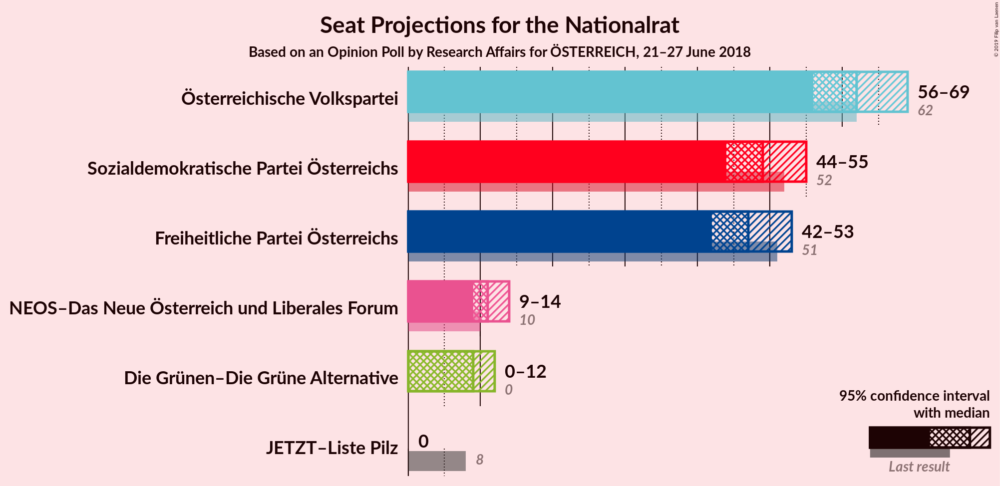
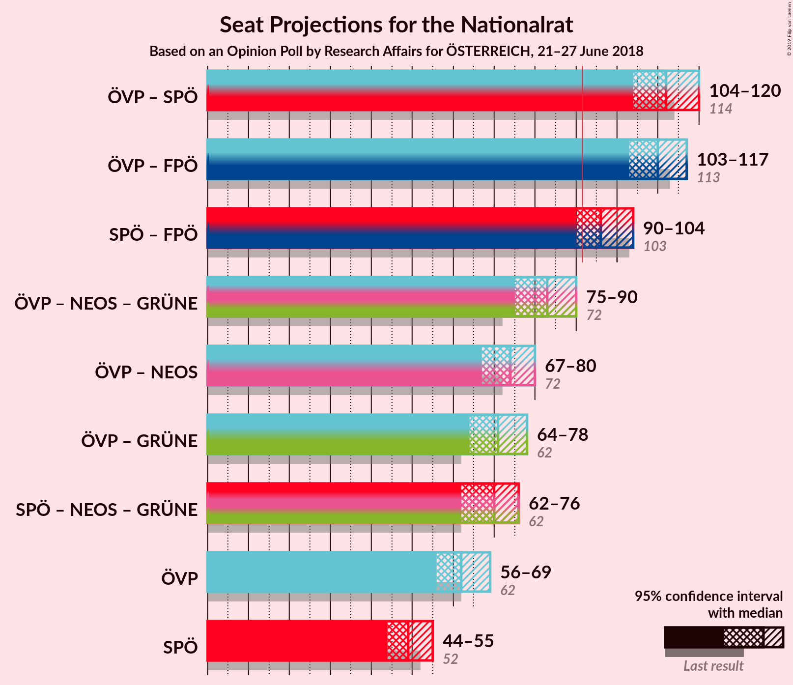
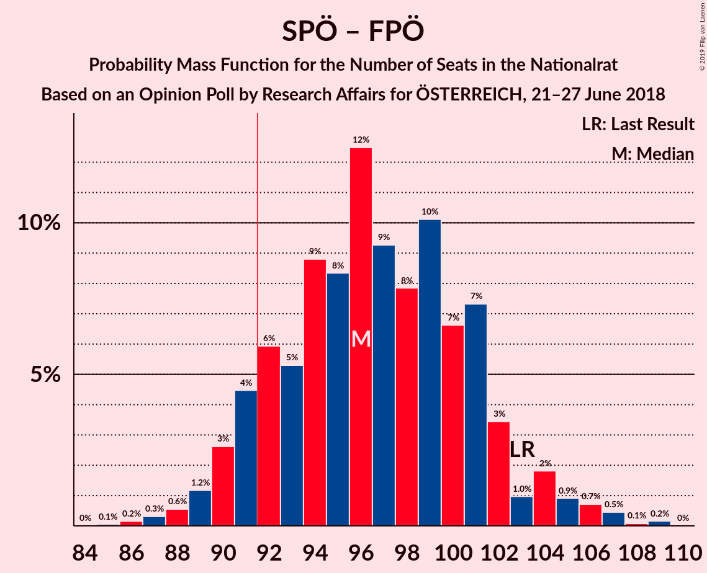

# Opinion Poll by Research Affairs for ÖSTERREICH, 21–27 June 2018

<a href="#voting-intentions">Voting Intentions</a> | <a href="#seats">Seats</a> | <a href="#coalitions">Coalitions</a> | <a href="#technical-information">Technical Information</a>

## Voting Intentions

### Confidence Intervals

| Party | Last Result | Poll Result | 80% Confidence Interval | 90% Confidence Interval | 95% Confidence Interval | 99% Confidence Interval |
|:-----:|:-----------:|:-----------:|:-----------------------:|:-----------------------:|:-----------------------:|:-----------------------:|
| Österreichische Volkspartei | 31.5% | 32.7% | 30.8–34.6% |30.3–35.2% |29.8–35.6% |29.0–36.6% |
| Sozialdemokratische Partei Österreichs | 26.9% | 25.7% | 24.0–27.5% |23.5–28.0% |23.1–28.5% |22.3–29.4% |
| Freiheitliche Partei Österreichs | 26.0% | 24.8% | 23.1–26.6% |22.6–27.1% |22.2–27.6% |21.4–28.5% |
| NEOS–Das Neue Österreich und Liberales Forum | 5.3% | 6.0% | 5.1–7.1% |4.9–7.4% |4.7–7.6% |4.3–8.2% |
| Die Grünen–Die Grüne Alternative | 3.8% | 5.0% | 4.2–6.0% |4.0–6.3% |3.8–6.5% |3.4–7.0% |
| JETZT–Liste Pilz | 4.4% | 2.0% | 1.5–2.7% |1.4–2.9% |1.3–3.1% |1.1–3.4% |

*Note:* The poll result column reflects the actual value used in the calculations. Published results may vary slightly, and in addition be rounded to fewer digits.

## Seats

### Confidence Intervals

| Party | Last Result | Median | 80% Confidence Interval | 90% Confidence Interval | 95% Confidence Interval | 99% Confidence Interval |
|:-----:|:-----------:|:------:|:-----------------------:|:-----------------------:|:-----------------------:|:-----------------------:|
| <a href="#österreichische-volkspartei">Österreichische Volkspartei</a> | 62 | 60 | 59–64 |58–65 |58–66 |58–66 |
| <a href="#sozialdemokratische-partei-österreichs">Sozialdemokratische Partei Österreichs</a> | 52 | 51 | 50–52 |50–54 |49–54 |48–56 |
| <a href="#freiheitliche-partei-österreichs">Freiheitliche Partei Österreichs</a> | 51 | 47 | 45–49 |44–52 |44–54 |42–54 |
| <a href="#neos–das-neue-österreich-und-liberales-forum">NEOS–Das Neue Österreich und Liberales Forum</a> | 10 | 12 | 11–13 |9–14 |9–14 |8–15 |
| <a href="#die-grünen–die-grüne-alternative">Die Grünen–Die Grüne Alternative</a> | 0 | 9 | 8–11 |0–11 |0–11 |0–13 |
| <a href="#jetzt–liste-pilz">JETZT–Liste Pilz</a> | 8 | 0 | 0 |0 |0 |0 |

### Österreichische Volkspartei

*For a full overview of the results for this party, see the [Österreichische Volkspartei](party-österreichischevolkspartei.html) page.*

| Number of Seats | Probability | Accumulated | Special Marks |
|:---------------:|:-----------:|:-----------:|:-------------:|
| 58 | 5% | 100% |  |
| 59 | 43% | 95% |  |
| 60 | 2% | 52% | Median |
| 61 | 10% | 50% |  |
| 62 | 25% | 40% | Last Result |
| 63 | 0.1% | 15% |  |
| 64 | 10% | 15% |  |
| 65 | 0.8% | 5% |  |
| 66 | 4% | 4% |  |
| 67 | 0% | 0% |  |

### Sozialdemokratische Partei Österreichs

*For a full overview of the results for this party, see the [Sozialdemokratische Partei Österreichs](party-sozialdemokratischeparteiösterreichs.html) page.*

| Number of Seats | Probability | Accumulated | Special Marks |
|:---------------:|:-----------:|:-----------:|:-------------:|
| 48 | 1.2% | 100% |  |
| 49 | 3% | 98.7% |  |
| 50 | 15% | 96% |  |
| 51 | 60% | 81% | Median |
| 52 | 12% | 21% | Last Result |
| 53 | 1.1% | 9% |  |
| 54 | 7% | 8% |  |
| 55 | 0% | 0.8% |  |
| 56 | 0.8% | 0.8% |  |
| 57 | 0% | 0% |  |

### Freiheitliche Partei Österreichs

*For a full overview of the results for this party, see the [Freiheitliche Partei Österreichs](party-freiheitlicheparteiösterreichs.html) page.*

| Number of Seats | Probability | Accumulated | Special Marks |
|:---------------:|:-----------:|:-----------:|:-------------:|
| 40 | 0.1% | 100% |  |
| 41 | 0.1% | 99.9% |  |
| 42 | 0.4% | 99.8% |  |
| 43 | 0.7% | 99.4% |  |
| 44 | 5% | 98.7% |  |
| 45 | 41% | 94% |  |
| 46 | 3% | 53% |  |
| 47 | 17% | 50% | Median |
| 48 | 7% | 33% |  |
| 49 | 17% | 26% |  |
| 50 | 2% | 9% |  |
| 51 | 0.5% | 6% | Last Result |
| 52 | 1.1% | 6% |  |
| 53 | 0.5% | 5% |  |
| 54 | 4% | 4% |  |
| 55 | 0% | 0% |  |

### NEOS–Das Neue Österreich und Liberales Forum

*For a full overview of the results for this party, see the [NEOS–Das Neue Österreich und Liberales Forum](party-neos–dasneueösterreichundliberalesforum.html) page.*

| Number of Seats | Probability | Accumulated | Special Marks |
|:---------------:|:-----------:|:-----------:|:-------------:|
| 8 | 0.8% | 100% |  |
| 9 | 6% | 99.1% |  |
| 10 | 3% | 94% | Last Result |
| 11 | 10% | 91% |  |
| 12 | 65% | 80% | Median |
| 13 | 10% | 15% |  |
| 14 | 5% | 6% |  |
| 15 | 0.9% | 1.0% |  |
| 16 | 0.1% | 0.1% |  |
| 17 | 0% | 0% |  |

### Die Grünen–Die Grüne Alternative

*For a full overview of the results for this party, see the [Die Grünen–Die Grüne Alternative](party-diegrünen–diegrünealternative.html) page.*

| Number of Seats | Probability | Accumulated | Special Marks |
|:---------------:|:-----------:|:-----------:|:-------------:|
| 0 | 7% | 100% | Last Result |
| 1 | 0% | 93% |  |
| 2 | 0% | 93% |  |
| 3 | 0% | 93% |  |
| 4 | 0% | 93% |  |
| 5 | 0% | 93% |  |
| 6 | 0% | 93% |  |
| 7 | 0% | 93% |  |
| 8 | 42% | 93% |  |
| 9 | 34% | 51% | Median |
| 10 | 5% | 17% |  |
| 11 | 9% | 12% |  |
| 12 | 0.7% | 2% |  |
| 13 | 1.5% | 2% |  |
| 14 | 0.1% | 0.1% |  |
| 15 | 0% | 0% |  |

### JETZT–Liste Pilz

*For a full overview of the results for this party, see the [JETZT–Liste Pilz](party-jetzt–listepilz.html) page.*

| Number of Seats | Probability | Accumulated | Special Marks |
|:---------------:|:-----------:|:-----------:|:-------------:|
| 0 | 100% | 100% | Median |
| 1 | 0% | 0% |  |
| 2 | 0% | 0% |  |
| 3 | 0% | 0% |  |
| 4 | 0% | 0% |  |
| 5 | 0% | 0% |  |
| 6 | 0% | 0% |  |
| 7 | 0% | 0% |  |
| 8 | 0% | 0% | Last Result |

## Coalitions

### Confidence Intervals

| Coalition | Last Result | Median | Majority? | 80% Confidence Interval | 90% Confidence Interval | 95% Confidence Interval | 99% Confidence Interval |
|:---------:|:-----------:|:------:|:---------:|:-----------------------:|:-----------------------:|:-----------------------:|:-----------------------:|
| Österreichische Volkspartei – Freiheitliche Partei Österreichs | 113 | 106 | 100% | 104–111 | 104–113 | 104–120 | 101–120 |
| Österreichische Volkspartei – Sozialdemokratische Partei Österreichs | 114 | 112 | 100% | 110–115 | 108–118 | 108–118 | 107–121 |
| Sozialdemokratische Partei Österreichs – Freiheitliche Partei Österreichs | 103 | 97 | 99.5% | 96–101 | 96–105 | 95–106 | 92–106 |
| Österreichische Volkspartei | 62 | 60 | 0% | 59–64 | 58–65 | 58–66 | 58–66 |
| Sozialdemokratische Partei Österreichs | 52 | 51 | 0% | 50–52 | 50–54 | 49–54 | 48–56 |

### Österreichische Volkspartei – Freiheitliche Partei Österreichs

| Number of Seats | Probability | Accumulated | Special Marks |
|:---------------:|:-----------:|:-----------:|:-------------:|
| 99 | 0.1% | 100% |  |
| 100 | 0% | 99.9% |  |
| 101 | 1.0% | 99.9% |  |
| 102 | 0.2% | 98.9% |  |
| 103 | 0.1% | 98.7% |  |
| 104 | 39% | 98.6% |  |
| 105 | 3% | 59% |  |
| 106 | 10% | 56% |  |
| 107 | 0.1% | 46% | Median |
| 108 | 7% | 46% |  |
| 109 | 0% | 39% |  |
| 110 | 5% | 39% |  |
| 111 | 27% | 34% |  |
| 112 | 0.8% | 7% |  |
| 113 | 1.2% | 6% | Last Result |
| 114 | 0% | 5% |  |
| 115 | 0.5% | 5% |  |
| 116 | 0% | 4% |  |
| 117 | 0.1% | 4% |  |
| 118 | 0% | 4% |  |
| 119 | 0% | 4% |  |
| 120 | 4% | 4% |  |
| 121 | 0% | 0% |  |

### Österreichische Volkspartei – Sozialdemokratische Partei Österreichs

| Number of Seats | Probability | Accumulated | Special Marks |
|:---------------:|:-----------:|:-----------:|:-------------:|
| 106 | 0% | 100% |  |
| 107 | 1.1% | 99.9% |  |
| 108 | 8% | 98.9% |  |
| 109 | 0% | 91% |  |
| 110 | 39% | 91% |  |
| 111 | 0% | 52% | Median |
| 112 | 2% | 52% |  |
| 113 | 22% | 49% |  |
| 114 | 15% | 28% | Last Result |
| 115 | 7% | 13% |  |
| 116 | 0% | 5% |  |
| 117 | 0% | 5% |  |
| 118 | 4% | 5% |  |
| 119 | 0.1% | 0.8% |  |
| 120 | 0% | 0.8% |  |
| 121 | 0.8% | 0.8% |  |
| 122 | 0% | 0% |  |

### Sozialdemokratische Partei Österreichs – Freiheitliche Partei Österreichs

| Number of Seats | Probability | Accumulated | Special Marks |
|:---------------:|:-----------:|:-----------:|:-------------:|
| 90 | 0.1% | 100% |  |
| 91 | 0.4% | 99.9% |  |
| 92 | 0.2% | 99.5% | Majority |
| 93 | 0.9% | 99.3% |  |
| 94 | 0.8% | 98% |  |
| 95 | 2% | 98% |  |
| 96 | 44% | 95% |  |
| 97 | 11% | 52% |  |
| 98 | 5% | 41% | Median |
| 99 | 3% | 36% |  |
| 100 | 17% | 33% |  |
| 101 | 7% | 16% |  |
| 102 | 2% | 9% |  |
| 103 | 0.8% | 7% | Last Result |
| 104 | 0.5% | 6% |  |
| 105 | 1.0% | 5% |  |
| 106 | 4% | 4% |  |
| 107 | 0% | 0% |  |

### Österreichische Volkspartei

| Number of Seats | Probability | Accumulated | Special Marks |
|:---------------:|:-----------:|:-----------:|:-------------:|
| 58 | 5% | 100% |  |
| 59 | 43% | 95% |  |
| 60 | 2% | 52% | Median |
| 61 | 10% | 50% |  |
| 62 | 25% | 40% | Last Result |
| 63 | 0.1% | 15% |  |
| 64 | 10% | 15% |  |
| 65 | 0.8% | 5% |  |
| 66 | 4% | 4% |  |
| 67 | 0% | 0% |  |

### Sozialdemokratische Partei Österreichs

| Number of Seats | Probability | Accumulated | Special Marks |
|:---------------:|:-----------:|:-----------:|:-------------:|
| 48 | 1.2% | 100% |  |
| 49 | 3% | 98.7% |  |
| 50 | 15% | 96% |  |
| 51 | 60% | 81% | Median |
| 52 | 12% | 21% | Last Result |
| 53 | 1.1% | 9% |  |
| 54 | 7% | 8% |  |
| 55 | 0% | 0.8% |  |
| 56 | 0.8% | 0.8% |  |
| 57 | 0% | 0% |  |

## Technical Information

### Opinion Poll

+ **Polling firm:** Research Affairs
+ **Commissioner(s):** ÖSTERREICH
+ **Fieldwork period:** 21–27 June 2018

### Calculations

+ **Sample size:** 1004
+ **Simulations done:** 1,024
+ **Error estimate:** 1.31%

