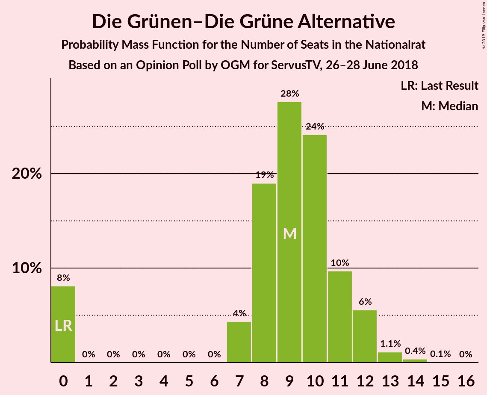
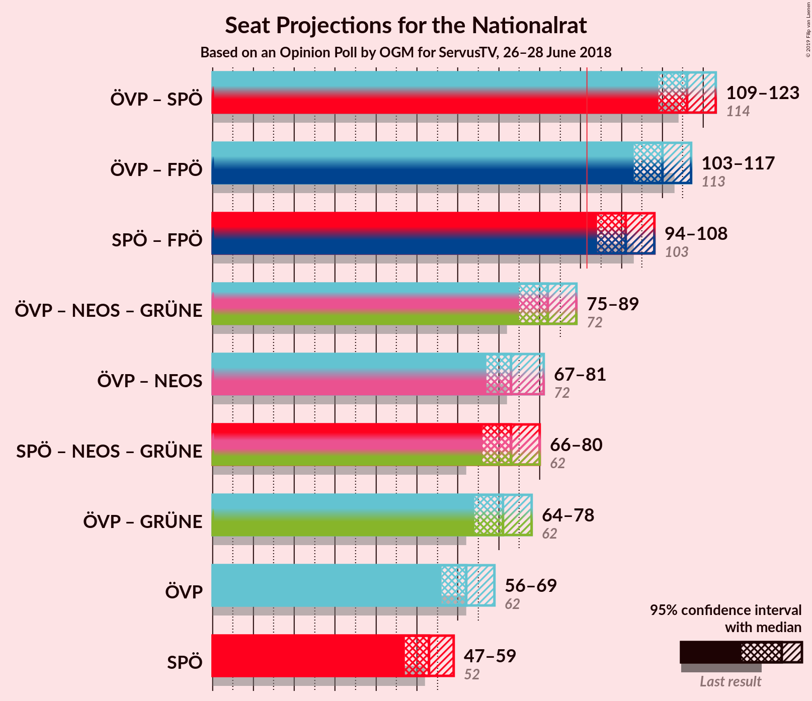
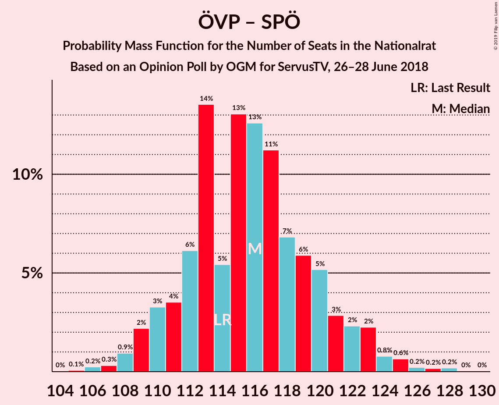
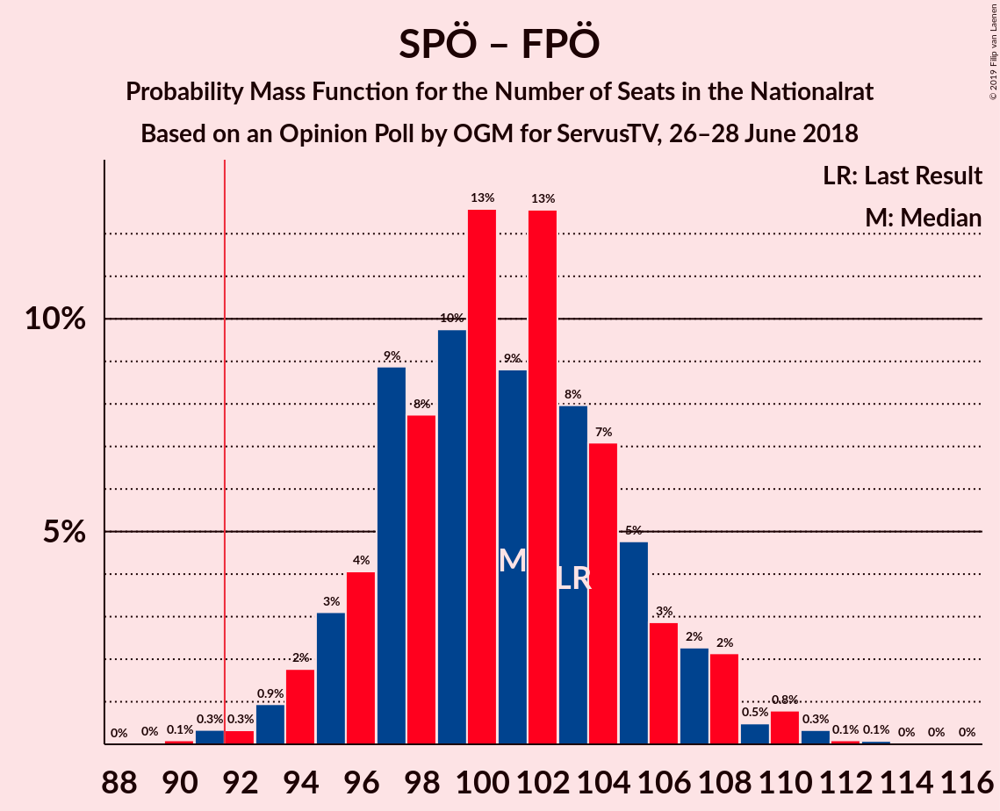

# Opinion Poll by OGM for ServusTV, 26–28 June 2018

<a href="#voting-intentions">Voting Intentions</a> | <a href="#seats">Seats</a> | <a href="#coalitions">Coalitions</a> | <a href="#technical-information">Technical Information</a>

## Voting Intentions

### Confidence Intervals

| Party | Last Result | Poll Result | 80% Confidence Interval | 90% Confidence Interval | 95% Confidence Interval | 99% Confidence Interval |
|:-----:|:-----------:|:-----------:|:-----------------------:|:-----------------------:|:-----------------------:|:-----------------------:|
| Österreichische Volkspartei | 31.5% | 33.0% | 30.9–35.2% |30.3–35.8% |29.8–36.3% |28.9–37.4% |
| Sozialdemokratische Partei Österreichs | 26.9% | 28.0% | 26.1–30.1% |25.5–30.7% |25.0–31.2% |24.1–32.3% |
| Freiheitliche Partei Österreichs | 26.0% | 25.1% | 23.2–27.1% |22.6–27.7% |22.2–28.2% |21.3–29.2% |
| NEOS–Das Neue Österreich und Liberales Forum | 5.3% | 6.0% | 5.0–7.2% |4.7–7.5% |4.5–7.8% |4.1–8.4% |
| Die Grünen–Die Grüne Alternative | 3.8% | 5.0% | 4.1–6.1% |3.9–6.4% |3.7–6.7% |3.3–7.3% |
| JETZT–Liste Pilz | 4.4% | 2.0% | 1.5–2.8% |1.3–3.0% |1.2–3.2% |1.0–3.6% |

*Note:* The poll result column reflects the actual value used in the calculations. Published results may vary slightly, and in addition be rounded to fewer digits.

## Seats

### Confidence Intervals

| Party | Last Result | Median | 80% Confidence Interval | 90% Confidence Interval | 95% Confidence Interval | 99% Confidence Interval |
|:-----:|:-----------:|:------:|:-----------------------:|:-----------------------:|:-----------------------:|:-----------------------:|
| <a href="#österreichische-volkspartei">Österreichische Volkspartei</a> | 62 | 65 | 65 |65 |61–65 |60–66 |
| <a href="#sozialdemokratische-partei-österreichs">Sozialdemokratische Partei Österreichs</a> | 52 | 51 | 51 |51 |49–51 |47–52 |
| <a href="#freiheitliche-partei-österreichs">Freiheitliche Partei Österreichs</a> | 51 | 48 | 48 |48 |48–51 |43–55 |
| <a href="#neos–das-neue-österreich-und-liberales-forum">NEOS–Das Neue Österreich und Liberales Forum</a> | 10 | 10 | 10 |10 |10–14 |10–15 |
| <a href="#die-grünen–die-grüne-alternative">Die Grünen–Die Grüne Alternative</a> | 0 | 9 | 9 |9 |8–9 |8–13 |
| <a href="#jetzt–liste-pilz">JETZT–Liste Pilz</a> | 8 | 0 | 0 |0 |0 |0 |

### Österreichische Volkspartei

*For a full overview of the results for this party, see the [Österreichische Volkspartei](party-österreichischevolkspartei.html) page.*

| Number of Seats | Probability | Accumulated | Special Marks |
|:---------------:|:-----------:|:-----------:|:-------------:|
| 57 | 0.1% | 100% |  |
| 58 | 0% | 99.9% |  |
| 59 | 0% | 99.9% |  |
| 60 | 2% | 99.9% |  |
| 61 | 0.9% | 98% |  |
| 62 | 0% | 97% | Last Result |
| 63 | 0.4% | 97% |  |
| 64 | 0% | 97% |  |
| 65 | 96% | 97% | Median |
| 66 | 0.4% | 0.9% |  |
| 67 | 0.3% | 0.5% |  |
| 68 | 0.1% | 0.2% |  |
| 69 | 0% | 0.1% |  |
| 70 | 0.1% | 0.1% |  |
| 71 | 0% | 0% |  |

### Sozialdemokratische Partei Österreichs

*For a full overview of the results for this party, see the [Sozialdemokratische Partei Österreichs](party-sozialdemokratischeparteiösterreichs.html) page.*

| Number of Seats | Probability | Accumulated | Special Marks |
|:---------------:|:-----------:|:-----------:|:-------------:|
| 44 | 0.1% | 100% |  |
| 45 | 0% | 99.9% |  |
| 46 | 0% | 99.9% |  |
| 47 | 0.7% | 99.9% |  |
| 48 | 0.2% | 99.2% |  |
| 49 | 2% | 99.0% |  |
| 50 | 2% | 97% |  |
| 51 | 94% | 95% | Median |
| 52 | 0.4% | 0.6% | Last Result |
| 53 | 0% | 0.3% |  |
| 54 | 0% | 0.2% |  |
| 55 | 0.1% | 0.2% |  |
| 56 | 0% | 0.1% |  |
| 57 | 0% | 0.1% |  |
| 58 | 0% | 0.1% |  |
| 59 | 0% | 0.1% |  |
| 60 | 0.1% | 0.1% |  |
| 61 | 0% | 0% |  |

### Freiheitliche Partei Österreichs

*For a full overview of the results for this party, see the [Freiheitliche Partei Österreichs](party-freiheitlicheparteiösterreichs.html) page.*

| Number of Seats | Probability | Accumulated | Special Marks |
|:---------------:|:-----------:|:-----------:|:-------------:|
| 39 | 0.1% | 100% |  |
| 40 | 0.1% | 99.9% |  |
| 41 | 0% | 99.8% |  |
| 42 | 0% | 99.8% |  |
| 43 | 0.4% | 99.8% |  |
| 44 | 0% | 99.4% |  |
| 45 | 0.2% | 99.4% |  |
| 46 | 0.4% | 99.2% |  |
| 47 | 0.1% | 98.8% |  |
| 48 | 94% | 98.7% | Median |
| 49 | 1.3% | 4% |  |
| 50 | 0.1% | 3% |  |
| 51 | 2% | 3% | Last Result |
| 52 | 0% | 1.0% |  |
| 53 | 0% | 0.9% |  |
| 54 | 0.2% | 0.9% |  |
| 55 | 0.7% | 0.7% |  |
| 56 | 0% | 0% |  |

### NEOS–Das Neue Österreich und Liberales Forum

*For a full overview of the results for this party, see the [NEOS–Das Neue Österreich und Liberales Forum](party-neos–dasneueösterreichundliberalesforum.html) page.*

| Number of Seats | Probability | Accumulated | Special Marks |
|:---------------:|:-----------:|:-----------:|:-------------:|
| 9 | 0.1% | 100% |  |
| 10 | 97% | 99.9% | Last Result, Median |
| 11 | 0% | 3% |  |
| 12 | 0% | 3% |  |
| 13 | 0% | 3% |  |
| 14 | 0.8% | 3% |  |
| 15 | 2% | 2% |  |
| 16 | 0% | 0% |  |

### Die Grünen–Die Grüne Alternative

*For a full overview of the results for this party, see the [Die Grünen–Die Grüne Alternative](party-diegrünen–diegrünealternative.html) page.*

| Number of Seats | Probability | Accumulated | Special Marks |
|:---------------:|:-----------:|:-----------:|:-------------:|
| 0 | 0.3% | 100% | Last Result |
| 1 | 0% | 99.7% |  |
| 2 | 0% | 99.7% |  |
| 3 | 0% | 99.7% |  |
| 4 | 0% | 99.7% |  |
| 5 | 0% | 99.7% |  |
| 6 | 0% | 99.7% |  |
| 7 | 0% | 99.7% |  |
| 8 | 2% | 99.7% |  |
| 9 | 96% | 97% | Median |
| 10 | 0.9% | 2% |  |
| 11 | 0.1% | 0.7% |  |
| 12 | 0% | 0.6% |  |
| 13 | 0.2% | 0.6% |  |
| 14 | 0.4% | 0.4% |  |
| 15 | 0% | 0% |  |

### JETZT–Liste Pilz

*For a full overview of the results for this party, see the [JETZT–Liste Pilz](party-jetzt–listepilz.html) page.*

| Number of Seats | Probability | Accumulated | Special Marks |
|:---------------:|:-----------:|:-----------:|:-------------:|
| 0 | 100% | 100% | Median |
| 1 | 0% | 0% |  |
| 2 | 0% | 0% |  |
| 3 | 0% | 0% |  |
| 4 | 0% | 0% |  |
| 5 | 0% | 0% |  |
| 6 | 0% | 0% |  |
| 7 | 0% | 0% |  |
| 8 | 0% | 0% | Last Result |

## Coalitions

### Confidence Intervals

| Coalition | Last Result | Median | Majority? | 80% Confidence Interval | 90% Confidence Interval | 95% Confidence Interval | 99% Confidence Interval |
|:---------:|:-----------:|:------:|:---------:|:-----------------------:|:-----------------------:|:-----------------------:|:-----------------------:|
| Österreichische Volkspartei – Sozialdemokratische Partei Österreichs | 114 | 116 | 100% | 116 | 116 | 109–116 | 108–116 |
| Österreichische Volkspartei – Freiheitliche Partei Österreichs | 113 | 113 | 100% | 113 | 113 | 111–113 | 109–116 |
| Sozialdemokratische Partei Österreichs – Freiheitliche Partei Österreichs | 103 | 99 | 99.9% | 99 | 99 | 99–100 | 93–102 |
| Österreichische Volkspartei | 62 | 65 | 0% | 65 | 65 | 61–65 | 60–66 |
| Sozialdemokratische Partei Österreichs | 52 | 51 | 0% | 51 | 51 | 49–51 | 47–52 |

### Österreichische Volkspartei – Sozialdemokratische Partei Österreichs

| Number of Seats | Probability | Accumulated | Special Marks |
|:---------------:|:-----------:|:-----------:|:-------------:|
| 108 | 0.7% | 100% |  |
| 109 | 2% | 99.3% |  |
| 110 | 0.2% | 97% |  |
| 111 | 0% | 97% |  |
| 112 | 0.1% | 97% |  |
| 113 | 0% | 97% |  |
| 114 | 0% | 97% | Last Result |
| 115 | 2% | 97% |  |
| 116 | 95% | 95% | Median |
| 117 | 0.1% | 0.4% |  |
| 118 | 0% | 0.3% |  |
| 119 | 0.1% | 0.3% |  |
| 120 | 0% | 0.2% |  |
| 121 | 0% | 0.2% |  |
| 122 | 0.1% | 0.2% |  |
| 123 | 0% | 0% |  |

### Österreichische Volkspartei – Freiheitliche Partei Österreichs

| Number of Seats | Probability | Accumulated | Special Marks |
|:---------------:|:-----------:|:-----------:|:-------------:|
| 104 | 0.1% | 100% |  |
| 105 | 0% | 99.9% |  |
| 106 | 0.3% | 99.9% |  |
| 107 | 0% | 99.6% |  |
| 108 | 0% | 99.6% |  |
| 109 | 0.8% | 99.6% |  |
| 110 | 0.1% | 98.8% |  |
| 111 | 2% | 98.7% |  |
| 112 | 0% | 97% |  |
| 113 | 94% | 97% | Last Result, Median |
| 114 | 1.3% | 2% |  |
| 115 | 0% | 1.1% |  |
| 116 | 0.7% | 1.0% |  |
| 117 | 0% | 0.3% |  |
| 118 | 0.1% | 0.3% |  |
| 119 | 0% | 0.2% |  |
| 120 | 0% | 0.2% |  |
| 121 | 0.2% | 0.2% |  |
| 122 | 0% | 0% |  |

### Sozialdemokratische Partei Österreichs – Freiheitliche Partei Österreichs

| Number of Seats | Probability | Accumulated | Special Marks |
|:---------------:|:-----------:|:-----------:|:-------------:|
| 89 | 0.1% | 100% |  |
| 90 | 0% | 99.9% |  |
| 91 | 0% | 99.9% |  |
| 92 | 0% | 99.9% | Majority |
| 93 | 0.4% | 99.9% |  |
| 94 | 0.3% | 99.5% |  |
| 95 | 0% | 99.2% |  |
| 96 | 0% | 99.2% |  |
| 97 | 0% | 99.2% |  |
| 98 | 0.4% | 99.1% |  |
| 99 | 96% | 98.7% | Median |
| 100 | 2% | 3% |  |
| 101 | 0% | 1.1% |  |
| 102 | 0.9% | 1.1% |  |
| 103 | 0% | 0.2% | Last Result |
| 104 | 0% | 0.1% |  |
| 105 | 0% | 0.1% |  |
| 106 | 0% | 0.1% |  |
| 107 | 0.1% | 0.1% |  |
| 108 | 0% | 0% |  |

### Österreichische Volkspartei

| Number of Seats | Probability | Accumulated | Special Marks |
|:---------------:|:-----------:|:-----------:|:-------------:|
| 57 | 0.1% | 100% |  |
| 58 | 0% | 99.9% |  |
| 59 | 0% | 99.9% |  |
| 60 | 2% | 99.9% |  |
| 61 | 0.9% | 98% |  |
| 62 | 0% | 97% | Last Result |
| 63 | 0.4% | 97% |  |
| 64 | 0% | 97% |  |
| 65 | 96% | 97% | Median |
| 66 | 0.4% | 0.9% |  |
| 67 | 0.3% | 0.5% |  |
| 68 | 0.1% | 0.2% |  |
| 69 | 0% | 0.1% |  |
| 70 | 0.1% | 0.1% |  |
| 71 | 0% | 0% |  |

### Sozialdemokratische Partei Österreichs

| Number of Seats | Probability | Accumulated | Special Marks |
|:---------------:|:-----------:|:-----------:|:-------------:|
| 44 | 0.1% | 100% |  |
| 45 | 0% | 99.9% |  |
| 46 | 0% | 99.9% |  |
| 47 | 0.7% | 99.9% |  |
| 48 | 0.2% | 99.2% |  |
| 49 | 2% | 99.0% |  |
| 50 | 2% | 97% |  |
| 51 | 94% | 95% | Median |
| 52 | 0.4% | 0.6% | Last Result |
| 53 | 0% | 0.3% |  |
| 54 | 0% | 0.2% |  |
| 55 | 0.1% | 0.2% |  |
| 56 | 0% | 0.1% |  |
| 57 | 0% | 0.1% |  |
| 58 | 0% | 0.1% |  |
| 59 | 0% | 0.1% |  |
| 60 | 0.1% | 0.1% |  |
| 61 | 0% | 0% |  |

## Technical Information

### Opinion Poll

+ **Polling firm:** OGM
+ **Commissioner(s):** ServusTV
+ **Fieldwork period:** 26–28 June 2018

### Calculations

+ **Sample size:** 806
+ **Simulations done:** 1,024
+ **Error estimate:** 3.84%

