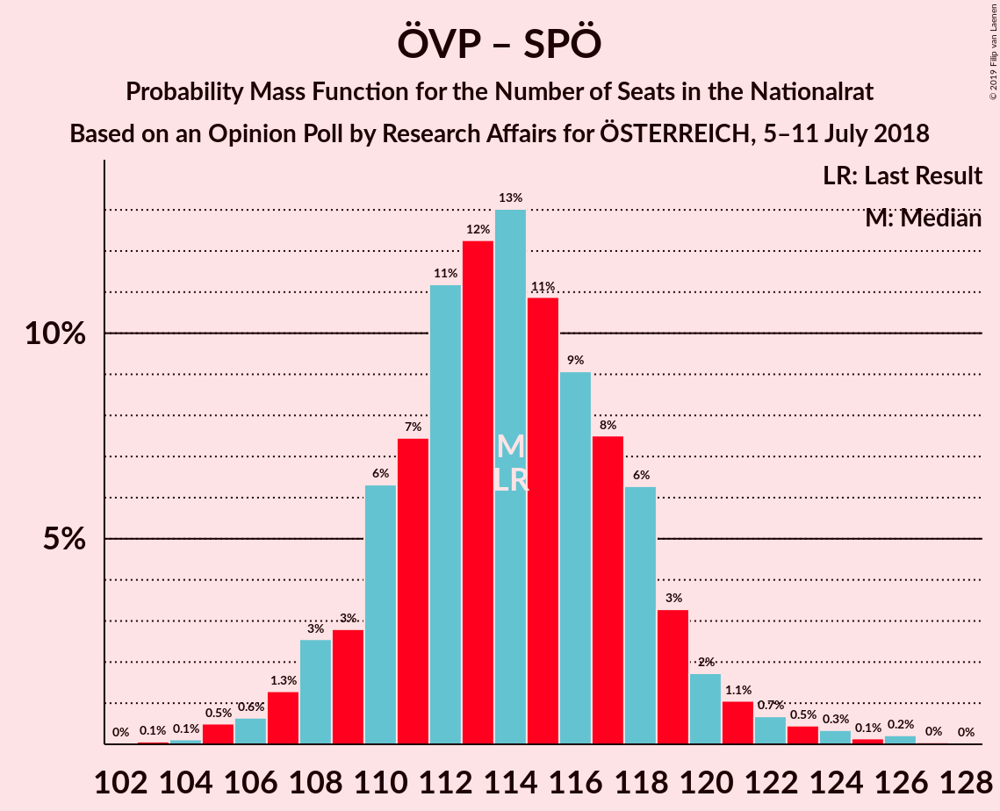
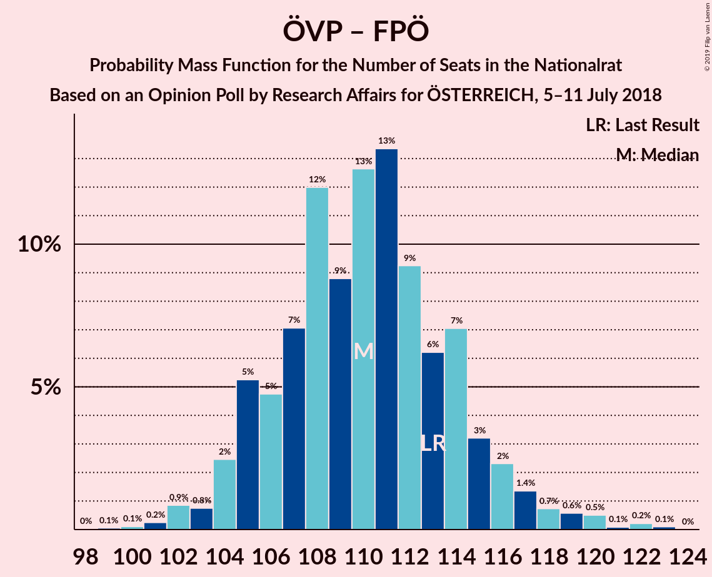
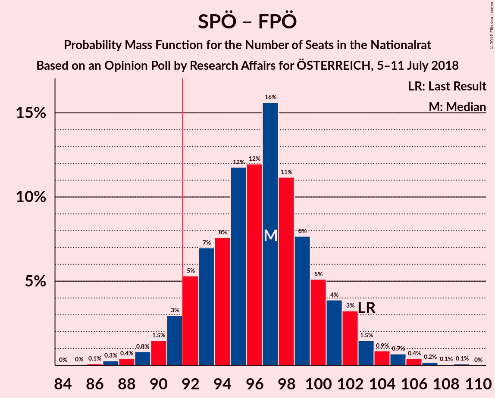

# Opinion Poll by Research Affairs for ÖSTERREICH, 5–11 July 2018

<a href="#voting-intentions">Voting Intentions</a> | <a href="#seats">Seats</a> | <a href="#coalitions">Coalitions</a> | <a href="#technical-information">Technical Information</a>

## Voting Intentions

### Confidence Intervals

| Party | Last Result | Poll Result | 80% Confidence Interval | 90% Confidence Interval | 95% Confidence Interval | 99% Confidence Interval |
|:-----:|:-----------:|:-----------:|:-----------------------:|:-----------------------:|:-----------------------:|:-----------------------:|
| Österreichische Volkspartei | 31.5% | 33.0% | 31.2–35.0% |30.7–35.5% |30.2–36.0% |29.3–36.9% |
| Sozialdemokratische Partei Österreichs | 26.9% | 26.0% | 24.3–27.8% |23.8–28.3% |23.4–28.8% |22.6–29.7% |
| Freiheitliche Partei Österreichs | 26.0% | 24.0% | 22.3–25.8% |21.9–26.3% |21.5–26.7% |20.7–27.6% |
| NEOS–Das Neue Österreich und Liberales Forum | 5.3% | 7.0% | 6.1–8.2% |5.8–8.5% |5.6–8.8% |5.2–9.4% |
| Die Grünen–Die Grüne Alternative | 3.8% | 5.0% | 4.2–6.0% |4.0–6.2% |3.8–6.5% |3.4–7.0% |
| JETZT–Liste Pilz | 4.4% | 2.0% | 1.5–2.7% |1.4–2.9% |1.3–3.0% |1.1–3.4% |

*Note:* The poll result column reflects the actual value used in the calculations. Published results may vary slightly, and in addition be rounded to fewer digits.

## Seats

### Confidence Intervals

| Party | Last Result | Median | 80% Confidence Interval | 90% Confidence Interval | 95% Confidence Interval | 99% Confidence Interval |
|:-----:|:-----------:|:------:|:-----------------------:|:-----------------------:|:-----------------------:|:-----------------------:|
| <a href="#österreichische-volkspartei">Österreichische Volkspartei</a> | 62 | 63 | 61–63 |61–63 |59–66 |59–67 |
| <a href="#sozialdemokratische-partei-österreichs">Sozialdemokratische Partei Österreichs</a> | 52 | 54 | 52–54 |52–54 |50–55 |49–55 |
| <a href="#freiheitliche-partei-österreichs">Freiheitliche Partei Österreichs</a> | 51 | 45 | 43–50 |43–50 |43–51 |40–52 |
| <a href="#neos–das-neue-österreich-und-liberales-forum">NEOS–Das Neue Österreich und Liberales Forum</a> | 10 | 12 | 11–13 |11–13 |11–15 |9–19 |
| <a href="#die-grünen–die-grüne-alternative">Die Grünen–Die Grüne Alternative</a> | 0 | 9 | 8–11 |8–12 |0–12 |0–12 |
| <a href="#jetzt–liste-pilz">JETZT–Liste Pilz</a> | 8 | 0 | 0 |0 |0 |0 |

### Österreichische Volkspartei

*For a full overview of the results for this party, see the [Österreichische Volkspartei](party-österreichischevolkspartei.html) page.*

| Number of Seats | Probability | Accumulated | Special Marks |
|:---------------:|:-----------:|:-----------:|:-------------:|
| 57 | 0.4% | 100% |  |
| 58 | 0.1% | 99.6% |  |
| 59 | 3% | 99.5% |  |
| 60 | 0.4% | 96% |  |
| 61 | 40% | 96% |  |
| 62 | 2% | 56% | Last Result |
| 63 | 50% | 54% | Median |
| 64 | 0.1% | 4% |  |
| 65 | 0.4% | 4% |  |
| 66 | 1.1% | 3% |  |
| 67 | 2% | 2% |  |
| 68 | 0.1% | 0.1% |  |
| 69 | 0% | 0% |  |

### Sozialdemokratische Partei Österreichs

*For a full overview of the results for this party, see the [Sozialdemokratische Partei Österreichs](party-sozialdemokratischeparteiösterreichs.html) page.*

| Number of Seats | Probability | Accumulated | Special Marks |
|:---------------:|:-----------:|:-----------:|:-------------:|
| 47 | 0.1% | 100% |  |
| 48 | 0% | 99.9% |  |
| 49 | 0.6% | 99.9% |  |
| 50 | 4% | 99.4% |  |
| 51 | 0% | 95% |  |
| 52 | 41% | 95% | Last Result |
| 53 | 0.6% | 55% |  |
| 54 | 50% | 54% | Median |
| 55 | 5% | 5% |  |
| 56 | 0% | 0.2% |  |
| 57 | 0.1% | 0.2% |  |
| 58 | 0% | 0% |  |

### Freiheitliche Partei Österreichs

*For a full overview of the results for this party, see the [Freiheitliche Partei Österreichs](party-freiheitlicheparteiösterreichs.html) page.*

| Number of Seats | Probability | Accumulated | Special Marks |
|:---------------:|:-----------:|:-----------:|:-------------:|
| 38 | 0.1% | 100% |  |
| 39 | 0.2% | 99.8% |  |
| 40 | 2% | 99.7% |  |
| 41 | 0% | 98% |  |
| 42 | 0% | 98% |  |
| 43 | 38% | 98% |  |
| 44 | 4% | 60% |  |
| 45 | 8% | 56% | Median |
| 46 | 0.2% | 48% |  |
| 47 | 11% | 48% |  |
| 48 | 0.2% | 37% |  |
| 49 | 0.2% | 37% |  |
| 50 | 33% | 36% |  |
| 51 | 3% | 4% | Last Result |
| 52 | 0.1% | 0.5% |  |
| 53 | 0% | 0.4% |  |
| 54 | 0.4% | 0.4% |  |
| 55 | 0% | 0% |  |

### NEOS–Das Neue Österreich und Liberales Forum

*For a full overview of the results for this party, see the [NEOS–Das Neue Österreich und Liberales Forum](party-neos–dasneueösterreichundliberalesforum.html) page.*

| Number of Seats | Probability | Accumulated | Special Marks |
|:---------------:|:-----------:|:-----------:|:-------------:|
| 9 | 1.3% | 100% |  |
| 10 | 0.6% | 98.6% | Last Result |
| 11 | 46% | 98% |  |
| 12 | 3% | 52% | Median |
| 13 | 44% | 49% |  |
| 14 | 0.2% | 5% |  |
| 15 | 3% | 5% |  |
| 16 | 0.5% | 1.4% |  |
| 17 | 0.1% | 0.8% |  |
| 18 | 0% | 0.7% |  |
| 19 | 0.7% | 0.7% |  |
| 20 | 0% | 0% |  |

### Die Grünen–Die Grüne Alternative

*For a full overview of the results for this party, see the [Die Grünen–Die Grüne Alternative](party-diegrünen–diegrünealternative.html) page.*

| Number of Seats | Probability | Accumulated | Special Marks |
|:---------------:|:-----------:|:-----------:|:-------------:|
| 0 | 3% | 100% | Last Result |
| 1 | 0% | 97% |  |
| 2 | 0% | 97% |  |
| 3 | 0% | 97% |  |
| 4 | 0% | 97% |  |
| 5 | 0% | 97% |  |
| 6 | 0% | 97% |  |
| 7 | 0.3% | 97% |  |
| 8 | 13% | 96% |  |
| 9 | 34% | 84% | Median |
| 10 | 39% | 50% |  |
| 11 | 3% | 10% |  |
| 12 | 7% | 7% |  |
| 13 | 0.1% | 0.1% |  |
| 14 | 0.1% | 0.1% |  |
| 15 | 0% | 0% |  |

### JETZT–Liste Pilz

*For a full overview of the results for this party, see the [JETZT–Liste Pilz](party-jetzt–listepilz.html) page.*

| Number of Seats | Probability | Accumulated | Special Marks |
|:---------------:|:-----------:|:-----------:|:-------------:|
| 0 | 100% | 100% | Median |
| 1 | 0% | 0% |  |
| 2 | 0% | 0% |  |
| 3 | 0% | 0% |  |
| 4 | 0% | 0% |  |
| 5 | 0% | 0% |  |
| 6 | 0% | 0% |  |
| 7 | 0% | 0% |  |
| 8 | 0% | 0% | Last Result |

## Coalitions

### Confidence Intervals

| Coalition | Last Result | Median | Majority? | 80% Confidence Interval | 90% Confidence Interval | 95% Confidence Interval | 99% Confidence Interval |
|:---------:|:-----------:|:------:|:---------:|:-----------------------:|:-----------------------:|:-----------------------:|:-----------------------:|
| Österreichische Volkspartei – Sozialdemokratische Partei Österreichs | 114 | 117 | 100% | 113–117 | 113–117 | 109–121 | 108–122 |
| Österreichische Volkspartei – Freiheitliche Partei Österreichs | 113 | 107 | 100% | 106–111 | 105–111 | 103–114 | 103–114 |
| Sozialdemokratische Partei Österreichs – Freiheitliche Partei Österreichs | 103 | 98 | 99.9% | 97–102 | 95–102 | 94–105 | 93–105 |
| Österreichische Volkspartei | 62 | 63 | 0% | 61–63 | 61–63 | 59–66 | 59–67 |
| Sozialdemokratische Partei Österreichs | 52 | 54 | 0% | 52–54 | 52–54 | 50–55 | 49–55 |

### Österreichische Volkspartei – Sozialdemokratische Partei Österreichs

| Number of Seats | Probability | Accumulated | Special Marks |
|:---------------:|:-----------:|:-----------:|:-------------:|
| 105 | 0.1% | 100% |  |
| 106 | 0.4% | 99.9% |  |
| 107 | 0% | 99.5% |  |
| 108 | 0.1% | 99.5% |  |
| 109 | 3% | 99.5% |  |
| 110 | 0.1% | 96% |  |
| 111 | 0% | 96% |  |
| 112 | 0.3% | 96% |  |
| 113 | 41% | 96% |  |
| 114 | 0.6% | 55% | Last Result |
| 115 | 0% | 55% |  |
| 116 | 0% | 55% |  |
| 117 | 51% | 55% | Median |
| 118 | 0.1% | 3% |  |
| 119 | 0% | 3% |  |
| 120 | 0.1% | 3% |  |
| 121 | 1.0% | 3% |  |
| 122 | 2% | 2% |  |
| 123 | 0% | 0.2% |  |
| 124 | 0% | 0.2% |  |
| 125 | 0.1% | 0.1% |  |
| 126 | 0% | 0% |  |

### Österreichische Volkspartei – Freiheitliche Partei Österreichs

| Number of Seats | Probability | Accumulated | Special Marks |
|:---------------:|:-----------:|:-----------:|:-------------:|
| 100 | 0.1% | 100% |  |
| 101 | 0.1% | 99.9% |  |
| 102 | 0.1% | 99.8% |  |
| 103 | 3% | 99.7% |  |
| 104 | 0% | 97% |  |
| 105 | 2% | 97% |  |
| 106 | 43% | 95% |  |
| 107 | 2% | 51% |  |
| 108 | 0.2% | 49% | Median |
| 109 | 0.1% | 49% |  |
| 110 | 11% | 49% |  |
| 111 | 34% | 38% |  |
| 112 | 0.3% | 4% |  |
| 113 | 0.1% | 3% | Last Result |
| 114 | 3% | 3% |  |
| 115 | 0.2% | 0.2% |  |
| 116 | 0% | 0% |  |

### Sozialdemokratische Partei Österreichs – Freiheitliche Partei Österreichs

| Number of Seats | Probability | Accumulated | Special Marks |
|:---------------:|:-----------:|:-----------:|:-------------:|
| 90 | 0% | 100% |  |
| 91 | 0% | 99.9% |  |
| 92 | 0.2% | 99.9% | Majority |
| 93 | 0.8% | 99.7% |  |
| 94 | 3% | 98.9% |  |
| 95 | 2% | 96% |  |
| 96 | 0.2% | 94% |  |
| 97 | 43% | 94% |  |
| 98 | 2% | 51% |  |
| 99 | 0.5% | 49% | Median |
| 100 | 1.0% | 49% |  |
| 101 | 11% | 48% |  |
| 102 | 33% | 36% |  |
| 103 | 0.5% | 4% | Last Result |
| 104 | 0% | 3% |  |
| 105 | 3% | 3% |  |
| 106 | 0.1% | 0.1% |  |
| 107 | 0% | 0% |  |

### Österreichische Volkspartei

| Number of Seats | Probability | Accumulated | Special Marks |
|:---------------:|:-----------:|:-----------:|:-------------:|
| 57 | 0.4% | 100% |  |
| 58 | 0.1% | 99.6% |  |
| 59 | 3% | 99.5% |  |
| 60 | 0.4% | 96% |  |
| 61 | 40% | 96% |  |
| 62 | 2% | 56% | Last Result |
| 63 | 50% | 54% | Median |
| 64 | 0.1% | 4% |  |
| 65 | 0.4% | 4% |  |
| 66 | 1.1% | 3% |  |
| 67 | 2% | 2% |  |
| 68 | 0.1% | 0.1% |  |
| 69 | 0% | 0% |  |

### Sozialdemokratische Partei Österreichs

| Number of Seats | Probability | Accumulated | Special Marks |
|:---------------:|:-----------:|:-----------:|:-------------:|
| 47 | 0.1% | 100% |  |
| 48 | 0% | 99.9% |  |
| 49 | 0.6% | 99.9% |  |
| 50 | 4% | 99.4% |  |
| 51 | 0% | 95% |  |
| 52 | 41% | 95% | Last Result |
| 53 | 0.6% | 55% |  |
| 54 | 50% | 54% | Median |
| 55 | 5% | 5% |  |
| 56 | 0% | 0.2% |  |
| 57 | 0.1% | 0.2% |  |
| 58 | 0% | 0% |  |

## Technical Information

### Opinion Poll

+ **Polling firm:** Research Affairs
+ **Commissioner(s):** ÖSTERREICH
+ **Fieldwork period:** 5–11 July 2018

### Calculations

+ **Sample size:** 1008
+ **Simulations done:** 1,024
+ **Error estimate:** 1.94%

