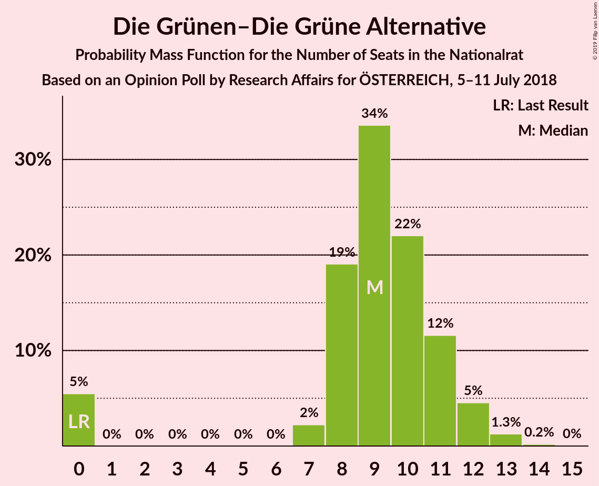

# Opinion Poll by Research Affairs for ÖSTERREICH, 5–11 July 2018

<a href="#voting-intentions">Voting Intentions</a> | <a href="#seats">Seats</a> | <a href="#coalitions">Coalitions</a> | <a href="#technical-information">Technical Information</a>

## Voting Intentions

### Confidence Intervals

| Party | Last Result | Poll Result | 80% Confidence Interval | 90% Confidence Interval | 95% Confidence Interval | 99% Confidence Interval |
|:-----:|:-----------:|:-----------:|:-----------------------:|:-----------------------:|:-----------------------:|:-----------------------:|
| Österreichische Volkspartei | 31.5% | 33.0% | 31.2–35.0% |30.7–35.5% |30.2–36.0% |29.3–36.9% |
| Sozialdemokratische Partei Österreichs | 26.9% | 26.0% | 24.3–27.8% |23.8–28.3% |23.4–28.8% |22.6–29.7% |
| Freiheitliche Partei Österreichs | 26.0% | 24.0% | 22.3–25.8% |21.9–26.3% |21.5–26.7% |20.7–27.6% |
| NEOS–Das Neue Österreich und Liberales Forum | 5.3% | 7.0% | 6.1–8.2% |5.8–8.5% |5.6–8.8% |5.2–9.4% |
| Die Grünen–Die Grüne Alternative | 3.8% | 5.0% | 4.2–6.0% |4.0–6.2% |3.8–6.5% |3.4–7.0% |
| JETZT–Liste Pilz | 4.4% | 2.0% | 1.5–2.7% |1.4–2.9% |1.3–3.0% |1.1–3.4% |

*Note:* The poll result column reflects the actual value used in the calculations. Published results may vary slightly, and in addition be rounded to fewer digits.

## Seats

### Confidence Intervals

| Party | Last Result | Median | 80% Confidence Interval | 90% Confidence Interval | 95% Confidence Interval | 99% Confidence Interval |
|:-----:|:-----------:|:------:|:-----------------------:|:-----------------------:|:-----------------------:|:-----------------------:|
| <a href="#österreichische-volkspartei">Österreichische Volkspartei</a> | 62 | 63 | 60–68 |59–69 |58–70 |56–72 |
| <a href="#sozialdemokratische-partei-österreichs">Sozialdemokratische Partei Österreichs</a> | 52 | 50 | 46–54 |46–55 |45–55 |43–58 |
| <a href="#freiheitliche-partei-österreichs">Freiheitliche Partei Österreichs</a> | 51 | 46 | 43–50 |42–51 |41–52 |40–54 |
| <a href="#neos–das-neue-österreich-und-liberales-forum">NEOS–Das Neue Österreich und Liberales Forum</a> | 10 | 13 | 11–15 |11–16 |10–17 |10–18 |
| <a href="#die-grünen–die-grüne-alternative">Die Grünen–Die Grüne Alternative</a> | 0 | 9 | 8–11 |0–12 |0–12 |0–13 |
| <a href="#jetzt–liste-pilz">JETZT–Liste Pilz</a> | 8 | 0 | 0 |0 |0 |0 |

### Österreichische Volkspartei

*For a full overview of the results for this party, see the [Österreichische Volkspartei](party-österreichischevolkspartei.html) page.*

| Number of Seats | Probability | Accumulated | Special Marks |
|:---------------:|:-----------:|:-----------:|:-------------:|
| 54 | 0% | 100% |  |
| 55 | 0.2% | 99.9% |  |
| 56 | 0.3% | 99.8% |  |
| 57 | 0.9% | 99.5% |  |
| 58 | 3% | 98.6% |  |
| 59 | 4% | 96% |  |
| 60 | 5% | 92% |  |
| 61 | 8% | 87% |  |
| 62 | 13% | 79% | Last Result |
| 63 | 18% | 67% | Median |
| 64 | 10% | 49% |  |
| 65 | 9% | 39% |  |
| 66 | 11% | 30% |  |
| 67 | 8% | 19% |  |
| 68 | 5% | 11% |  |
| 69 | 3% | 6% |  |
| 70 | 2% | 4% |  |
| 71 | 0.8% | 2% |  |
| 72 | 0.5% | 0.8% |  |
| 73 | 0.2% | 0.3% |  |
| 74 | 0.1% | 0.1% |  |
| 75 | 0% | 0.1% |  |
| 76 | 0% | 0% |  |

### Sozialdemokratische Partei Österreichs

*For a full overview of the results for this party, see the [Sozialdemokratische Partei Österreichs](party-sozialdemokratischeparteiösterreichs.html) page.*

| Number of Seats | Probability | Accumulated | Special Marks |
|:---------------:|:-----------:|:-----------:|:-------------:|
| 41 | 0% | 100% |  |
| 42 | 0.2% | 99.9% |  |
| 43 | 0.6% | 99.8% |  |
| 44 | 0.6% | 99.2% |  |
| 45 | 1.2% | 98.6% |  |
| 46 | 9% | 97% |  |
| 47 | 11% | 89% |  |
| 48 | 4% | 78% |  |
| 49 | 6% | 74% |  |
| 50 | 25% | 68% | Median |
| 51 | 18% | 43% |  |
| 52 | 7% | 25% | Last Result |
| 53 | 2% | 18% |  |
| 54 | 8% | 16% |  |
| 55 | 5% | 7% |  |
| 56 | 0.8% | 2% |  |
| 57 | 0.5% | 1.1% |  |
| 58 | 0.3% | 0.6% |  |
| 59 | 0.2% | 0.2% |  |
| 60 | 0.1% | 0.1% |  |
| 61 | 0% | 0% |  |

### Freiheitliche Partei Österreichs

*For a full overview of the results for this party, see the [Freiheitliche Partei Österreichs](party-freiheitlicheparteiösterreichs.html) page.*

| Number of Seats | Probability | Accumulated | Special Marks |
|:---------------:|:-----------:|:-----------:|:-------------:|
| 38 | 0.1% | 100% |  |
| 39 | 0.3% | 99.9% |  |
| 40 | 0.8% | 99.6% |  |
| 41 | 2% | 98.8% |  |
| 42 | 4% | 97% |  |
| 43 | 8% | 93% |  |
| 44 | 11% | 84% |  |
| 45 | 12% | 74% |  |
| 46 | 15% | 62% | Median |
| 47 | 16% | 48% |  |
| 48 | 13% | 31% |  |
| 49 | 7% | 18% |  |
| 50 | 5% | 11% |  |
| 51 | 3% | 7% | Last Result |
| 52 | 2% | 4% |  |
| 53 | 1.2% | 2% |  |
| 54 | 0.4% | 0.5% |  |
| 55 | 0.1% | 0.1% |  |
| 56 | 0% | 0% |  |

### NEOS–Das Neue Österreich und Liberales Forum

*For a full overview of the results for this party, see the [NEOS–Das Neue Österreich und Liberales Forum](party-neos–dasneueösterreichundliberalesforum.html) page.*

| Number of Seats | Probability | Accumulated | Special Marks |
|:---------------:|:-----------:|:-----------:|:-------------:|
| 9 | 0.3% | 100% |  |
| 10 | 3% | 99.7% | Last Result |
| 11 | 9% | 97% |  |
| 12 | 18% | 88% |  |
| 13 | 22% | 70% | Median |
| 14 | 23% | 48% |  |
| 15 | 15% | 24% |  |
| 16 | 6% | 9% |  |
| 17 | 2% | 3% |  |
| 18 | 0.6% | 0.8% |  |
| 19 | 0.1% | 0.2% |  |
| 20 | 0% | 0% |  |

### Die Grünen–Die Grüne Alternative

*For a full overview of the results for this party, see the [Die Grünen–Die Grüne Alternative](party-diegrünen–diegrünealternative.html) page.*

| Number of Seats | Probability | Accumulated | Special Marks |
|:---------------:|:-----------:|:-----------:|:-------------:|
| 0 | 5% | 100% | Last Result |
| 1 | 0% | 95% |  |
| 2 | 0% | 95% |  |
| 3 | 0% | 95% |  |
| 4 | 0% | 95% |  |
| 5 | 0% | 95% |  |
| 6 | 0% | 95% |  |
| 7 | 2% | 95% |  |
| 8 | 19% | 92% |  |
| 9 | 34% | 73% | Median |
| 10 | 22% | 40% |  |
| 11 | 12% | 18% |  |
| 12 | 5% | 6% |  |
| 13 | 1.3% | 1.5% |  |
| 14 | 0.2% | 0.2% |  |
| 15 | 0% | 0% |  |

### JETZT–Liste Pilz

*For a full overview of the results for this party, see the [JETZT–Liste Pilz](party-jetzt–listepilz.html) page.*

| Number of Seats | Probability | Accumulated | Special Marks |
|:---------------:|:-----------:|:-----------:|:-------------:|
| 0 | 100% | 100% | Median |
| 1 | 0% | 0% |  |
| 2 | 0% | 0% |  |
| 3 | 0% | 0% |  |
| 4 | 0% | 0% |  |
| 5 | 0% | 0% |  |
| 6 | 0% | 0% |  |
| 7 | 0% | 0% |  |
| 8 | 0% | 0% | Last Result |

## Coalitions

### Confidence Intervals

| Coalition | Last Result | Median | Majority? | 80% Confidence Interval | 90% Confidence Interval | 95% Confidence Interval | 99% Confidence Interval |
|:---------:|:-----------:|:------:|:---------:|:-----------------------:|:-----------------------:|:-----------------------:|:-----------------------:|
| Österreichische Volkspartei – Sozialdemokratische Partei Österreichs | 114 | 114 | 100% | 110–118 | 108–119 | 107–121 | 105–124 |
| Österreichische Volkspartei – Freiheitliche Partei Österreichs | 113 | 110 | 100% | 106–114 | 105–116 | 104–117 | 102–120 |
| Sozialdemokratische Partei Österreichs – Freiheitliche Partei Österreichs | 103 | 97 | 94% | 92–101 | 91–102 | 90–103 | 88–106 |
| Österreichische Volkspartei – NEOS–Das Neue Österreich und Liberales Forum – Die Grünen–Die Grüne Alternative | 72 | 86 | 4% | 82–90 | 81–91 | 79–92 | 76–94 |
| Österreichische Volkspartei – NEOS–Das Neue Österreich und Liberales Forum | 72 | 77 | 0% | 73–81 | 72–82 | 71–84 | 69–86 |
| Österreichische Volkspartei – Die Grünen–Die Grüne Alternative | 62 | 73 | 0% | 69–77 | 67–78 | 66–79 | 63–81 |
| Sozialdemokratische Partei Österreichs – NEOS–Das Neue Österreich und Liberales Forum – Die Grünen–Die Grüne Alternative | 62 | 73 | 0% | 68–77 | 67–78 | 65–78 | 63–81 |
| Österreichische Volkspartei | 62 | 63 | 0% | 60–68 | 59–69 | 58–70 | 56–72 |
| Sozialdemokratische Partei Österreichs | 52 | 50 | 0% | 46–54 | 46–55 | 45–55 | 43–58 |

### Österreichische Volkspartei – Sozialdemokratische Partei Österreichs

| Number of Seats | Probability | Accumulated | Special Marks |
|:---------------:|:-----------:|:-----------:|:-------------:|
| 103 | 0.1% | 100% |  |
| 104 | 0.1% | 99.9% |  |
| 105 | 0.5% | 99.8% |  |
| 106 | 0.6% | 99.3% |  |
| 107 | 1.3% | 98.6% |  |
| 108 | 3% | 97% |  |
| 109 | 3% | 95% |  |
| 110 | 6% | 92% |  |
| 111 | 7% | 86% |  |
| 112 | 11% | 78% |  |
| 113 | 12% | 67% | Median |
| 114 | 13% | 55% | Last Result |
| 115 | 11% | 42% |  |
| 116 | 9% | 31% |  |
| 117 | 8% | 22% |  |
| 118 | 6% | 14% |  |
| 119 | 3% | 8% |  |
| 120 | 2% | 5% |  |
| 121 | 1.1% | 3% |  |
| 122 | 0.7% | 2% |  |
| 123 | 0.5% | 1.2% |  |
| 124 | 0.3% | 0.8% |  |
| 125 | 0.1% | 0.4% |  |
| 126 | 0.2% | 0.3% |  |
| 127 | 0% | 0.1% |  |
| 128 | 0% | 0% |  |

### Österreichische Volkspartei – Freiheitliche Partei Österreichs

| Number of Seats | Probability | Accumulated | Special Marks |
|:---------------:|:-----------:|:-----------:|:-------------:|
| 99 | 0.1% | 100% |  |
| 100 | 0.1% | 99.9% |  |
| 101 | 0.2% | 99.8% |  |
| 102 | 0.9% | 99.6% |  |
| 103 | 0.8% | 98.7% |  |
| 104 | 2% | 98% |  |
| 105 | 5% | 95% |  |
| 106 | 5% | 90% |  |
| 107 | 7% | 85% |  |
| 108 | 12% | 78% |  |
| 109 | 9% | 66% | Median |
| 110 | 13% | 58% |  |
| 111 | 13% | 45% |  |
| 112 | 9% | 32% |  |
| 113 | 6% | 22% | Last Result |
| 114 | 7% | 16% |  |
| 115 | 3% | 9% |  |
| 116 | 2% | 6% |  |
| 117 | 1.4% | 4% |  |
| 118 | 0.7% | 2% |  |
| 119 | 0.6% | 2% |  |
| 120 | 0.5% | 0.9% |  |
| 121 | 0.1% | 0.4% |  |
| 122 | 0.2% | 0.3% |  |
| 123 | 0.1% | 0.1% |  |
| 124 | 0% | 0% |  |

### Sozialdemokratische Partei Österreichs – Freiheitliche Partei Österreichs

| Number of Seats | Probability | Accumulated | Special Marks |
|:---------------:|:-----------:|:-----------:|:-------------:|
| 86 | 0.1% | 100% |  |
| 87 | 0.3% | 99.9% |  |
| 88 | 0.4% | 99.6% |  |
| 89 | 0.8% | 99.2% |  |
| 90 | 1.5% | 98% |  |
| 91 | 3% | 97% |  |
| 92 | 5% | 94% | Majority |
| 93 | 7% | 89% |  |
| 94 | 8% | 82% |  |
| 95 | 12% | 74% |  |
| 96 | 12% | 62% | Median |
| 97 | 16% | 50% |  |
| 98 | 11% | 35% |  |
| 99 | 8% | 24% |  |
| 100 | 5% | 16% |  |
| 101 | 4% | 11% |  |
| 102 | 3% | 7% |  |
| 103 | 1.5% | 4% | Last Result |
| 104 | 0.9% | 2% |  |
| 105 | 0.7% | 1.4% |  |
| 106 | 0.4% | 0.7% |  |
| 107 | 0.2% | 0.3% |  |
| 108 | 0.1% | 0.1% |  |
| 109 | 0.1% | 0.1% |  |
| 110 | 0% | 0% |  |

### Österreichische Volkspartei – NEOS–Das Neue Österreich und Liberales Forum – Die Grünen–Die Grüne Alternative

| Number of Seats | Probability | Accumulated | Special Marks |
|:---------------:|:-----------:|:-----------:|:-------------:|
| 72 | 0% | 100% | Last Result |
| 73 | 0% | 100% |  |
| 74 | 0.1% | 99.9% |  |
| 75 | 0.2% | 99.8% |  |
| 76 | 0.2% | 99.7% |  |
| 77 | 0.6% | 99.4% |  |
| 78 | 0.8% | 98.9% |  |
| 79 | 1.2% | 98% |  |
| 80 | 2% | 97% |  |
| 81 | 4% | 95% |  |
| 82 | 4% | 91% |  |
| 83 | 5% | 87% |  |
| 84 | 9% | 82% |  |
| 85 | 12% | 72% | Median |
| 86 | 16% | 61% |  |
| 87 | 12% | 45% |  |
| 88 | 11% | 33% |  |
| 89 | 7% | 22% |  |
| 90 | 7% | 15% |  |
| 91 | 4% | 8% |  |
| 92 | 2% | 4% | Majority |
| 93 | 1.2% | 2% |  |
| 94 | 0.5% | 0.9% |  |
| 95 | 0.3% | 0.4% |  |
| 96 | 0.1% | 0.1% |  |
| 97 | 0% | 0.1% |  |
| 98 | 0% | 0% |  |

### Österreichische Volkspartei – NEOS–Das Neue Österreich und Liberales Forum

| Number of Seats | Probability | Accumulated | Special Marks |
|:---------------:|:-----------:|:-----------:|:-------------:|
| 67 | 0.1% | 100% |  |
| 68 | 0.2% | 99.9% |  |
| 69 | 0.5% | 99.7% |  |
| 70 | 0.7% | 99.2% |  |
| 71 | 2% | 98% |  |
| 72 | 4% | 96% | Last Result |
| 73 | 5% | 92% |  |
| 74 | 6% | 88% |  |
| 75 | 10% | 82% |  |
| 76 | 11% | 72% | Median |
| 77 | 17% | 61% |  |
| 78 | 12% | 44% |  |
| 79 | 11% | 33% |  |
| 80 | 9% | 22% |  |
| 81 | 5% | 13% |  |
| 82 | 4% | 8% |  |
| 83 | 2% | 5% |  |
| 84 | 1.4% | 3% |  |
| 85 | 0.6% | 1.5% |  |
| 86 | 0.4% | 0.8% |  |
| 87 | 0.2% | 0.4% |  |
| 88 | 0.1% | 0.2% |  |
| 89 | 0% | 0.1% |  |
| 90 | 0% | 0% |  |

### Österreichische Volkspartei – Die Grünen–Die Grüne Alternative

| Number of Seats | Probability | Accumulated | Special Marks |
|:---------------:|:-----------:|:-----------:|:-------------:|
| 60 | 0.1% | 100% |  |
| 61 | 0.1% | 99.9% |  |
| 62 | 0.2% | 99.8% | Last Result |
| 63 | 0.6% | 99.6% |  |
| 64 | 0.4% | 99.0% |  |
| 65 | 0.7% | 98.5% |  |
| 66 | 1.1% | 98% |  |
| 67 | 2% | 97% |  |
| 68 | 4% | 94% |  |
| 69 | 5% | 90% |  |
| 70 | 8% | 85% |  |
| 71 | 10% | 78% |  |
| 72 | 14% | 67% | Median |
| 73 | 13% | 53% |  |
| 74 | 13% | 41% |  |
| 75 | 8% | 27% |  |
| 76 | 8% | 20% |  |
| 77 | 5% | 12% |  |
| 78 | 3% | 7% |  |
| 79 | 2% | 4% |  |
| 80 | 0.8% | 1.4% |  |
| 81 | 0.3% | 0.5% |  |
| 82 | 0.2% | 0.3% |  |
| 83 | 0% | 0.1% |  |
| 84 | 0% | 0% |  |

### Sozialdemokratische Partei Österreichs – NEOS–Das Neue Österreich und Liberales Forum – Die Grünen–Die Grüne Alternative

| Number of Seats | Probability | Accumulated | Special Marks |
|:---------------:|:-----------:|:-----------:|:-------------:|
| 60 | 0.1% | 100% |  |
| 61 | 0.2% | 99.8% |  |
| 62 | 0.1% | 99.6% | Last Result |
| 63 | 0.6% | 99.5% |  |
| 64 | 0.7% | 98.9% |  |
| 65 | 1.1% | 98% |  |
| 66 | 2% | 97% |  |
| 67 | 3% | 96% |  |
| 68 | 3% | 93% |  |
| 69 | 7% | 89% |  |
| 70 | 7% | 82% |  |
| 71 | 11% | 75% |  |
| 72 | 14% | 65% | Median |
| 73 | 13% | 51% |  |
| 74 | 9% | 38% |  |
| 75 | 12% | 29% |  |
| 76 | 7% | 17% |  |
| 77 | 4% | 11% |  |
| 78 | 4% | 6% |  |
| 79 | 1.4% | 2% |  |
| 80 | 0.5% | 1.0% |  |
| 81 | 0.4% | 0.6% |  |
| 82 | 0.1% | 0.1% |  |
| 83 | 0% | 0% |  |

### Österreichische Volkspartei

| Number of Seats | Probability | Accumulated | Special Marks |
|:---------------:|:-----------:|:-----------:|:-------------:|
| 54 | 0% | 100% |  |
| 55 | 0.2% | 99.9% |  |
| 56 | 0.3% | 99.8% |  |
| 57 | 0.9% | 99.5% |  |
| 58 | 3% | 98.6% |  |
| 59 | 4% | 96% |  |
| 60 | 5% | 92% |  |
| 61 | 8% | 87% |  |
| 62 | 13% | 79% | Last Result |
| 63 | 18% | 67% | Median |
| 64 | 10% | 49% |  |
| 65 | 9% | 39% |  |
| 66 | 11% | 30% |  |
| 67 | 8% | 19% |  |
| 68 | 5% | 11% |  |
| 69 | 3% | 6% |  |
| 70 | 2% | 4% |  |
| 71 | 0.8% | 2% |  |
| 72 | 0.5% | 0.8% |  |
| 73 | 0.2% | 0.3% |  |
| 74 | 0.1% | 0.1% |  |
| 75 | 0% | 0.1% |  |
| 76 | 0% | 0% |  |

### Sozialdemokratische Partei Österreichs

| Number of Seats | Probability | Accumulated | Special Marks |
|:---------------:|:-----------:|:-----------:|:-------------:|
| 41 | 0% | 100% |  |
| 42 | 0.2% | 99.9% |  |
| 43 | 0.6% | 99.8% |  |
| 44 | 0.6% | 99.2% |  |
| 45 | 1.2% | 98.6% |  |
| 46 | 9% | 97% |  |
| 47 | 11% | 89% |  |
| 48 | 4% | 78% |  |
| 49 | 6% | 74% |  |
| 50 | 25% | 68% | Median |
| 51 | 18% | 43% |  |
| 52 | 7% | 25% | Last Result |
| 53 | 2% | 18% |  |
| 54 | 8% | 16% |  |
| 55 | 5% | 7% |  |
| 56 | 0.8% | 2% |  |
| 57 | 0.5% | 1.1% |  |
| 58 | 0.3% | 0.6% |  |
| 59 | 0.2% | 0.2% |  |
| 60 | 0.1% | 0.1% |  |
| 61 | 0% | 0% |  |

## Technical Information

### Opinion Poll

+ **Polling firm:** Research Affairs
+ **Commissioner(s):** ÖSTERREICH
+ **Fieldwork period:** 5–11 July 2018

### Calculations

+ **Sample size:** 1008
+ **Simulations done:** 131,072
+ **Error estimate:** 1.94%

