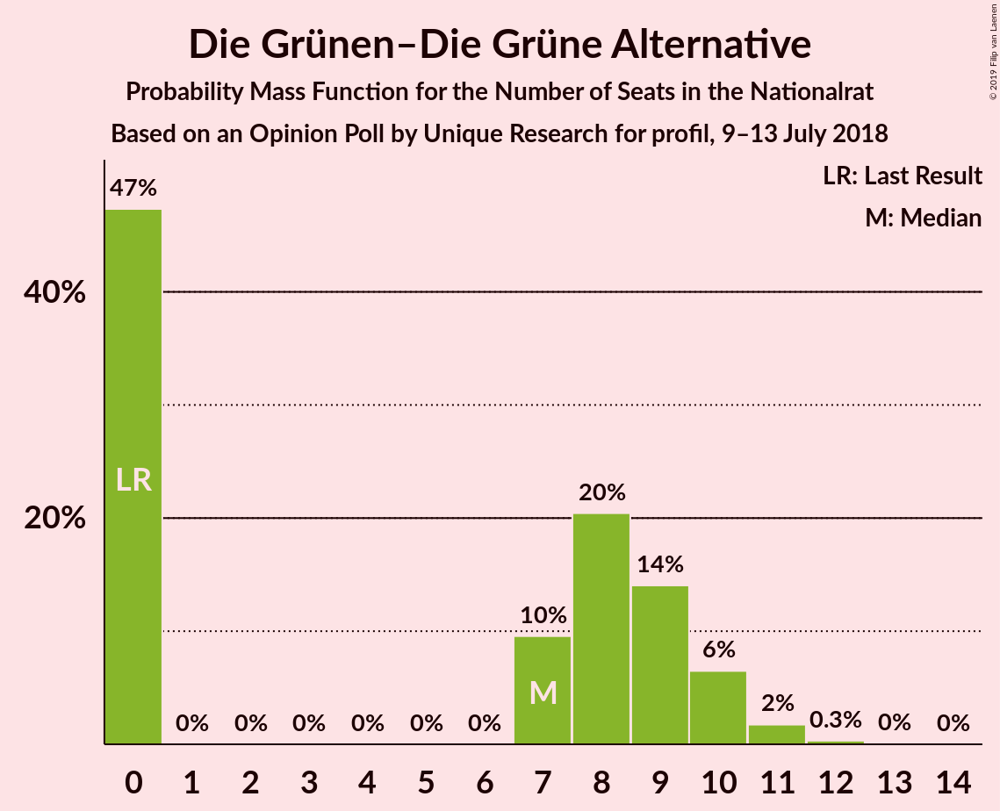
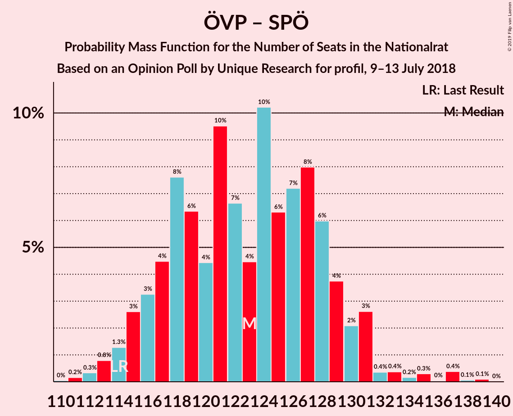
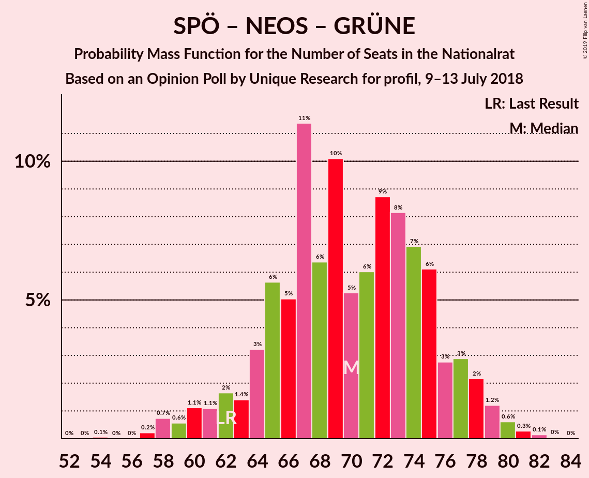

# Opinion Poll by Unique Research for profil, 9–13 July 2018

<a href="#voting-intentions">Voting Intentions</a> | <a href="#seats">Seats</a> | <a href="#coalitions">Coalitions</a> | <a href="#technical-information">Technical Information</a>

## Voting Intentions

### Confidence Intervals

| Party | Last Result | Poll Result | 80% Confidence Interval | 90% Confidence Interval | 95% Confidence Interval | 99% Confidence Interval |
|:-----:|:-----------:|:-----------:|:-----------------------:|:-----------------------:|:-----------------------:|:-----------------------:|
| Österreichische Volkspartei | 31.5% | 34.0% | 31.9–36.2% |31.3–36.8% |30.8–37.4% |29.8–38.4% |
| Sozialdemokratische Partei Österreichs | 26.9% | 29.0% | 27.0–31.1% |26.4–31.7% |26.0–32.3% |25.0–33.3% |
| Freiheitliche Partei Österreichs | 26.0% | 24.0% | 22.1–26.0% |21.6–26.6% |21.2–27.1% |20.3–28.1% |
| NEOS–Das Neue Österreich und Liberales Forum | 5.3% | 5.0% | 4.1–6.1% |3.9–6.5% |3.7–6.8% |3.3–7.3% |
| Die Grünen–Die Grüne Alternative | 3.8% | 4.0% | 3.2–5.0% |3.0–5.3% |2.9–5.6% |2.5–6.1% |
| JETZT–Liste Pilz | 4.4% | 2.0% | 1.5–2.8% |1.4–3.0% |1.2–3.2% |1.0–3.7% |

*Note:* The poll result column reflects the actual value used in the calculations. Published results may vary slightly, and in addition be rounded to fewer digits.

## Seats

### Confidence Intervals

| Party | Last Result | Median | 80% Confidence Interval | 90% Confidence Interval | 95% Confidence Interval | 99% Confidence Interval |
|:-----:|:-----------:|:------:|:-----------------------:|:-----------------------:|:-----------------------:|:-----------------------:|
| <a href="#österreichische-volkspartei">Österreichische Volkspartei</a> | 62 | 67 | 61–71 |60–73 |60–74 |57–77 |
| <a href="#sozialdemokratische-partei-österreichs">Sozialdemokratische Partei Österreichs</a> | 52 | 57 | 52–61 |51–63 |50–63 |48–65 |
| <a href="#freiheitliche-partei-österreichs">Freiheitliche Partei Österreichs</a> | 51 | 47 | 43–51 |42–52 |41–53 |39–55 |
| <a href="#neos–das-neue-österreich-und-liberales-forum">NEOS–Das Neue Österreich und Liberales Forum</a> | 10 | 10 | 7–12 |0–12 |0–13 |0–14 |
| <a href="#die-grünen–die-grüne-alternative">Die Grünen–Die Grüne Alternative</a> | 0 | 7 | 0–9 |0–10 |0–10 |0–11 |
| <a href="#jetzt–liste-pilz">JETZT–Liste Pilz</a> | 8 | 0 | 0 |0 |0 |0 |

### Österreichische Volkspartei

*For a full overview of the results for this party, see the [Österreichische Volkspartei](party-österreichischevolkspartei.html) page.*

| Number of Seats | Probability | Accumulated | Special Marks |
|:---------------:|:-----------:|:-----------:|:-------------:|
| 55 | 0% | 100% |  |
| 56 | 0.2% | 99.9% |  |
| 57 | 0.4% | 99.8% |  |
| 58 | 0.8% | 99.4% |  |
| 59 | 1.0% | 98.6% |  |
| 60 | 3% | 98% |  |
| 61 | 7% | 95% |  |
| 62 | 8% | 88% | Last Result |
| 63 | 6% | 81% |  |
| 64 | 8% | 75% |  |
| 65 | 9% | 67% |  |
| 66 | 6% | 57% |  |
| 67 | 14% | 51% | Median |
| 68 | 8% | 37% |  |
| 69 | 8% | 30% |  |
| 70 | 10% | 22% |  |
| 71 | 3% | 11% |  |
| 72 | 2% | 8% |  |
| 73 | 2% | 6% |  |
| 74 | 2% | 4% |  |
| 75 | 0.9% | 2% |  |
| 76 | 0.4% | 1.0% |  |
| 77 | 0.2% | 0.6% |  |
| 78 | 0.3% | 0.4% |  |
| 79 | 0% | 0.1% |  |
| 80 | 0.1% | 0.1% |  |
| 81 | 0% | 0% |  |

### Sozialdemokratische Partei Österreichs

*For a full overview of the results for this party, see the [Sozialdemokratische Partei Österreichs](party-sozialdemokratischeparteiösterreichs.html) page.*

| Number of Seats | Probability | Accumulated | Special Marks |
|:---------------:|:-----------:|:-----------:|:-------------:|
| 46 | 0% | 100% |  |
| 47 | 0.1% | 99.9% |  |
| 48 | 0.4% | 99.8% |  |
| 49 | 1.3% | 99.4% |  |
| 50 | 3% | 98% |  |
| 51 | 3% | 95% |  |
| 52 | 4% | 92% | Last Result |
| 53 | 5% | 88% |  |
| 54 | 8% | 82% |  |
| 55 | 9% | 74% |  |
| 56 | 14% | 66% |  |
| 57 | 15% | 52% | Median |
| 58 | 10% | 36% |  |
| 59 | 8% | 27% |  |
| 60 | 8% | 19% |  |
| 61 | 4% | 11% |  |
| 62 | 2% | 7% |  |
| 63 | 3% | 5% |  |
| 64 | 2% | 2% |  |
| 65 | 0.4% | 0.9% |  |
| 66 | 0.3% | 0.5% |  |
| 67 | 0.1% | 0.2% |  |
| 68 | 0.1% | 0.1% |  |
| 69 | 0% | 0% |  |

### Freiheitliche Partei Österreichs

*For a full overview of the results for this party, see the [Freiheitliche Partei Österreichs](party-freiheitlicheparteiösterreichs.html) page.*

| Number of Seats | Probability | Accumulated | Special Marks |
|:---------------:|:-----------:|:-----------:|:-------------:|
| 37 | 0% | 100% |  |
| 38 | 0.3% | 99.9% |  |
| 39 | 0.4% | 99.6% |  |
| 40 | 2% | 99.2% |  |
| 41 | 2% | 98% |  |
| 42 | 4% | 96% |  |
| 43 | 8% | 91% |  |
| 44 | 6% | 84% |  |
| 45 | 14% | 77% |  |
| 46 | 11% | 63% |  |
| 47 | 11% | 52% | Median |
| 48 | 10% | 41% |  |
| 49 | 14% | 31% |  |
| 50 | 6% | 17% |  |
| 51 | 4% | 11% | Last Result |
| 52 | 4% | 7% |  |
| 53 | 1.0% | 3% |  |
| 54 | 2% | 2% |  |
| 55 | 0.5% | 0.9% |  |
| 56 | 0.2% | 0.3% |  |
| 57 | 0.1% | 0.2% |  |
| 58 | 0% | 0% |  |

### NEOS–Das Neue Österreich und Liberales Forum

*For a full overview of the results for this party, see the [NEOS–Das Neue Österreich und Liberales Forum](party-neos–dasneueösterreichundliberalesforum.html) page.*

| Number of Seats | Probability | Accumulated | Special Marks |
|:---------------:|:-----------:|:-----------:|:-------------:|
| 0 | 8% | 100% |  |
| 1 | 0% | 92% |  |
| 2 | 0% | 92% |  |
| 3 | 0% | 92% |  |
| 4 | 0% | 92% |  |
| 5 | 0% | 92% |  |
| 6 | 0% | 92% |  |
| 7 | 2% | 92% |  |
| 8 | 18% | 90% |  |
| 9 | 21% | 72% |  |
| 10 | 29% | 51% | Last Result, Median |
| 11 | 12% | 22% |  |
| 12 | 7% | 10% |  |
| 13 | 2% | 3% |  |
| 14 | 0.8% | 1.0% |  |
| 15 | 0.1% | 0.2% |  |
| 16 | 0% | 0% |  |

### Die Grünen–Die Grüne Alternative

*For a full overview of the results for this party, see the [Die Grünen–Die Grüne Alternative](party-diegrünen–diegrünealternative.html) page.*

| Number of Seats | Probability | Accumulated | Special Marks |
|:---------------:|:-----------:|:-----------:|:-------------:|
| 0 | 47% | 100% | Last Result |
| 1 | 0% | 53% |  |
| 2 | 0% | 53% |  |
| 3 | 0% | 53% |  |
| 4 | 0% | 53% |  |
| 5 | 0% | 53% |  |
| 6 | 0% | 53% |  |
| 7 | 10% | 53% | Median |
| 8 | 20% | 43% |  |
| 9 | 14% | 23% |  |
| 10 | 6% | 9% |  |
| 11 | 2% | 2% |  |
| 12 | 0.3% | 0.4% |  |
| 13 | 0% | 0.1% |  |
| 14 | 0% | 0% |  |

### JETZT–Liste Pilz

*For a full overview of the results for this party, see the [JETZT–Liste Pilz](party-jetzt–listepilz.html) page.*

| Number of Seats | Probability | Accumulated | Special Marks |
|:---------------:|:-----------:|:-----------:|:-------------:|
| 0 | 99.9% | 100% | Median |
| 1 | 0% | 0.1% |  |
| 2 | 0% | 0.1% |  |
| 3 | 0% | 0.1% |  |
| 4 | 0% | 0.1% |  |
| 5 | 0% | 0.1% |  |
| 6 | 0% | 0.1% |  |
| 7 | 0% | 0.1% |  |
| 8 | 0.1% | 0.1% | Last Result |
| 9 | 0% | 0% |  |

## Coalitions

### Confidence Intervals

| Coalition | Last Result | Median | Majority? | 80% Confidence Interval | 90% Confidence Interval | 95% Confidence Interval | 99% Confidence Interval |
|:---------:|:-----------:|:------:|:---------:|:-----------------------:|:-----------------------:|:-----------------------:|:-----------------------:|
| Österreichische Volkspartei – Sozialdemokratische Partei Österreichs | 114 | 123 | 100% | 117–129 | 115–130 | 114–131 | 112–137 |
| Österreichische Volkspartei – Freiheitliche Partei Österreichs | 113 | 113 | 100% | 107–119 | 106–121 | 105–123 | 102–125 |
| Sozialdemokratische Partei Österreichs – Freiheitliche Partei Österreichs | 103 | 104 | 99.9% | 98–109 | 96–110 | 95–112 | 93–115 |
| Österreichische Volkspartei – NEOS–Das Neue Österreich und Liberales Forum – Die Grünen–Die Grüne Alternative | 72 | 79 | 0.1% | 74–85 | 73–87 | 71–88 | 68–90 |
| Österreichische Volkspartei – NEOS–Das Neue Österreich und Liberales Forum | 72 | 75 | 0% | 70–80 | 68–82 | 67–83 | 64–85 |
| Österreichische Volkspartei – Die Grünen–Die Grüne Alternative | 62 | 70 | 0% | 65–77 | 63–78 | 62–79 | 61–81 |
| Sozialdemokratische Partei Österreichs – NEOS–Das Neue Österreich und Liberales Forum – Die Grünen–Die Grüne Alternative | 62 | 70 | 0% | 64–76 | 62–77 | 60–78 | 58–80 |
| Österreichische Volkspartei | 62 | 67 | 0% | 61–71 | 60–73 | 60–74 | 57–77 |
| Sozialdemokratische Partei Österreichs | 52 | 57 | 0% | 52–61 | 51–63 | 50–63 | 48–65 |

### Österreichische Volkspartei – Sozialdemokratische Partei Österreichs

| Number of Seats | Probability | Accumulated | Special Marks |
|:---------------:|:-----------:|:-----------:|:-------------:|
| 110 | 0% | 100% |  |
| 111 | 0.2% | 99.9% |  |
| 112 | 0.3% | 99.7% |  |
| 113 | 0.8% | 99.4% |  |
| 114 | 1.3% | 98.6% | Last Result |
| 115 | 3% | 97% |  |
| 116 | 3% | 95% |  |
| 117 | 4% | 91% |  |
| 118 | 8% | 87% |  |
| 119 | 6% | 79% |  |
| 120 | 4% | 73% |  |
| 121 | 10% | 69% |  |
| 122 | 7% | 59% |  |
| 123 | 4% | 52% |  |
| 124 | 10% | 48% | Median |
| 125 | 6% | 38% |  |
| 126 | 7% | 31% |  |
| 127 | 8% | 24% |  |
| 128 | 6% | 16% |  |
| 129 | 4% | 10% |  |
| 130 | 2% | 7% |  |
| 131 | 3% | 4% |  |
| 132 | 0.4% | 2% |  |
| 133 | 0.4% | 1.5% |  |
| 134 | 0.2% | 1.1% |  |
| 135 | 0.3% | 0.9% |  |
| 136 | 0% | 0.6% |  |
| 137 | 0.4% | 0.6% |  |
| 138 | 0.1% | 0.2% |  |
| 139 | 0.1% | 0.1% |  |
| 140 | 0% | 0% |  |

### Österreichische Volkspartei – Freiheitliche Partei Österreichs

| Number of Seats | Probability | Accumulated | Special Marks |
|:---------------:|:-----------:|:-----------:|:-------------:|
| 100 | 0% | 100% |  |
| 101 | 0.2% | 99.9% |  |
| 102 | 0.3% | 99.8% |  |
| 103 | 0.6% | 99.5% |  |
| 104 | 1.2% | 98.9% |  |
| 105 | 2% | 98% |  |
| 106 | 3% | 95% |  |
| 107 | 3% | 93% |  |
| 108 | 6% | 90% |  |
| 109 | 7% | 84% |  |
| 110 | 8% | 77% |  |
| 111 | 9% | 69% |  |
| 112 | 6% | 60% |  |
| 113 | 5% | 54% | Last Result |
| 114 | 10% | 49% | Median |
| 115 | 6% | 38% |  |
| 116 | 11% | 32% |  |
| 117 | 5% | 21% |  |
| 118 | 6% | 16% |  |
| 119 | 3% | 10% |  |
| 120 | 1.4% | 7% |  |
| 121 | 2% | 5% |  |
| 122 | 1.1% | 4% |  |
| 123 | 1.1% | 3% |  |
| 124 | 0.6% | 2% |  |
| 125 | 0.7% | 1.1% |  |
| 126 | 0.2% | 0.4% |  |
| 127 | 0% | 0.1% |  |
| 128 | 0% | 0.1% |  |
| 129 | 0.1% | 0.1% |  |
| 130 | 0% | 0.1% |  |
| 131 | 0% | 0% |  |

### Sozialdemokratische Partei Österreichs – Freiheitliche Partei Österreichs

| Number of Seats | Probability | Accumulated | Special Marks |
|:---------------:|:-----------:|:-----------:|:-------------:|
| 91 | 0.1% | 100% |  |
| 92 | 0.2% | 99.9% | Majority |
| 93 | 0.4% | 99.7% |  |
| 94 | 0.7% | 99.3% |  |
| 95 | 2% | 98.6% |  |
| 96 | 3% | 97% |  |
| 97 | 3% | 94% |  |
| 98 | 6% | 90% |  |
| 99 | 3% | 84% |  |
| 100 | 5% | 81% |  |
| 101 | 9% | 76% |  |
| 102 | 5% | 67% |  |
| 103 | 10% | 62% | Last Result |
| 104 | 13% | 52% | Median |
| 105 | 11% | 39% |  |
| 106 | 11% | 28% |  |
| 107 | 3% | 17% |  |
| 108 | 4% | 15% |  |
| 109 | 3% | 11% |  |
| 110 | 3% | 8% |  |
| 111 | 2% | 5% |  |
| 112 | 2% | 3% |  |
| 113 | 0.9% | 2% |  |
| 114 | 0.2% | 0.7% |  |
| 115 | 0.3% | 0.5% |  |
| 116 | 0.1% | 0.3% |  |
| 117 | 0.1% | 0.1% |  |
| 118 | 0% | 0.1% |  |
| 119 | 0% | 0% |  |

### Österreichische Volkspartei – NEOS–Das Neue Österreich und Liberales Forum – Die Grünen–Die Grüne Alternative

| Number of Seats | Probability | Accumulated | Special Marks |
|:---------------:|:-----------:|:-----------:|:-------------:|
| 65 | 0% | 100% |  |
| 66 | 0.1% | 99.9% |  |
| 67 | 0.1% | 99.9% |  |
| 68 | 0.3% | 99.7% |  |
| 69 | 0.2% | 99.5% |  |
| 70 | 0.9% | 99.3% |  |
| 71 | 2% | 98% |  |
| 72 | 2% | 97% | Last Result |
| 73 | 3% | 95% |  |
| 74 | 3% | 92% |  |
| 75 | 4% | 89% |  |
| 76 | 3% | 85% |  |
| 77 | 11% | 83% |  |
| 78 | 11% | 72% |  |
| 79 | 13% | 61% |  |
| 80 | 10% | 48% |  |
| 81 | 5% | 38% |  |
| 82 | 9% | 33% |  |
| 83 | 5% | 24% |  |
| 84 | 3% | 19% | Median |
| 85 | 6% | 16% |  |
| 86 | 3% | 10% |  |
| 87 | 3% | 6% |  |
| 88 | 2% | 3% |  |
| 89 | 0.7% | 1.4% |  |
| 90 | 0.4% | 0.7% |  |
| 91 | 0.2% | 0.3% |  |
| 92 | 0.1% | 0.1% | Majority |
| 93 | 0% | 0% |  |

### Österreichische Volkspartei – NEOS–Das Neue Österreich und Liberales Forum

| Number of Seats | Probability | Accumulated | Special Marks |
|:---------------:|:-----------:|:-----------:|:-------------:|
| 61 | 0% | 100% |  |
| 62 | 0.2% | 99.9% |  |
| 63 | 0.1% | 99.7% |  |
| 64 | 0.2% | 99.6% |  |
| 65 | 0.5% | 99.4% |  |
| 66 | 1.0% | 98.9% |  |
| 67 | 1.1% | 98% |  |
| 68 | 2% | 97% |  |
| 69 | 3% | 95% |  |
| 70 | 4% | 92% |  |
| 71 | 6% | 88% |  |
| 72 | 9% | 82% | Last Result |
| 73 | 9% | 72% |  |
| 74 | 6% | 64% |  |
| 75 | 9% | 57% |  |
| 76 | 5% | 49% |  |
| 77 | 12% | 44% | Median |
| 78 | 10% | 32% |  |
| 79 | 8% | 22% |  |
| 80 | 6% | 14% |  |
| 81 | 3% | 8% |  |
| 82 | 2% | 6% |  |
| 83 | 1.4% | 4% |  |
| 84 | 0.7% | 2% |  |
| 85 | 1.1% | 2% |  |
| 86 | 0.2% | 0.4% |  |
| 87 | 0.1% | 0.2% |  |
| 88 | 0% | 0.1% |  |
| 89 | 0% | 0% |  |

### Österreichische Volkspartei – Die Grünen–Die Grüne Alternative

| Number of Seats | Probability | Accumulated | Special Marks |
|:---------------:|:-----------:|:-----------:|:-------------:|
| 58 | 0% | 100% |  |
| 59 | 0.2% | 99.9% |  |
| 60 | 0.2% | 99.8% |  |
| 61 | 0.5% | 99.6% |  |
| 62 | 2% | 99.1% | Last Result |
| 63 | 3% | 97% |  |
| 64 | 2% | 94% |  |
| 65 | 3% | 93% |  |
| 66 | 2% | 89% |  |
| 67 | 10% | 87% |  |
| 68 | 5% | 77% |  |
| 69 | 12% | 72% |  |
| 70 | 15% | 60% |  |
| 71 | 6% | 46% |  |
| 72 | 8% | 39% |  |
| 73 | 3% | 32% |  |
| 74 | 7% | 29% | Median |
| 75 | 4% | 21% |  |
| 76 | 7% | 17% |  |
| 77 | 3% | 10% |  |
| 78 | 3% | 7% |  |
| 79 | 2% | 4% |  |
| 80 | 1.1% | 2% |  |
| 81 | 0.6% | 1.1% |  |
| 82 | 0.2% | 0.5% |  |
| 83 | 0.2% | 0.3% |  |
| 84 | 0% | 0.1% |  |
| 85 | 0% | 0% |  |

### Sozialdemokratische Partei Österreichs – NEOS–Das Neue Österreich und Liberales Forum – Die Grünen–Die Grüne Alternative

| Number of Seats | Probability | Accumulated | Special Marks |
|:---------------:|:-----------:|:-----------:|:-------------:|
| 53 | 0% | 100% |  |
| 54 | 0.1% | 99.9% |  |
| 55 | 0% | 99.9% |  |
| 56 | 0% | 99.9% |  |
| 57 | 0.2% | 99.8% |  |
| 58 | 0.7% | 99.6% |  |
| 59 | 0.6% | 98.9% |  |
| 60 | 1.1% | 98% |  |
| 61 | 1.1% | 97% |  |
| 62 | 2% | 96% | Last Result |
| 63 | 1.4% | 94% |  |
| 64 | 3% | 93% |  |
| 65 | 6% | 90% |  |
| 66 | 5% | 84% |  |
| 67 | 11% | 79% |  |
| 68 | 6% | 68% |  |
| 69 | 10% | 61% |  |
| 70 | 5% | 51% |  |
| 71 | 6% | 46% |  |
| 72 | 9% | 40% |  |
| 73 | 8% | 31% |  |
| 74 | 7% | 23% | Median |
| 75 | 6% | 16% |  |
| 76 | 3% | 10% |  |
| 77 | 3% | 7% |  |
| 78 | 2% | 4% |  |
| 79 | 1.2% | 2% |  |
| 80 | 0.6% | 1.1% |  |
| 81 | 0.3% | 0.5% |  |
| 82 | 0.1% | 0.2% |  |
| 83 | 0% | 0.1% |  |
| 84 | 0% | 0% |  |

### Österreichische Volkspartei

| Number of Seats | Probability | Accumulated | Special Marks |
|:---------------:|:-----------:|:-----------:|:-------------:|
| 55 | 0% | 100% |  |
| 56 | 0.2% | 99.9% |  |
| 57 | 0.4% | 99.8% |  |
| 58 | 0.8% | 99.4% |  |
| 59 | 1.0% | 98.6% |  |
| 60 | 3% | 98% |  |
| 61 | 7% | 95% |  |
| 62 | 8% | 88% | Last Result |
| 63 | 6% | 81% |  |
| 64 | 8% | 75% |  |
| 65 | 9% | 67% |  |
| 66 | 6% | 57% |  |
| 67 | 14% | 51% | Median |
| 68 | 8% | 37% |  |
| 69 | 8% | 30% |  |
| 70 | 10% | 22% |  |
| 71 | 3% | 11% |  |
| 72 | 2% | 8% |  |
| 73 | 2% | 6% |  |
| 74 | 2% | 4% |  |
| 75 | 0.9% | 2% |  |
| 76 | 0.4% | 1.0% |  |
| 77 | 0.2% | 0.6% |  |
| 78 | 0.3% | 0.4% |  |
| 79 | 0% | 0.1% |  |
| 80 | 0.1% | 0.1% |  |
| 81 | 0% | 0% |  |

### Sozialdemokratische Partei Österreichs

| Number of Seats | Probability | Accumulated | Special Marks |
|:---------------:|:-----------:|:-----------:|:-------------:|
| 46 | 0% | 100% |  |
| 47 | 0.1% | 99.9% |  |
| 48 | 0.4% | 99.8% |  |
| 49 | 1.3% | 99.4% |  |
| 50 | 3% | 98% |  |
| 51 | 3% | 95% |  |
| 52 | 4% | 92% | Last Result |
| 53 | 5% | 88% |  |
| 54 | 8% | 82% |  |
| 55 | 9% | 74% |  |
| 56 | 14% | 66% |  |
| 57 | 15% | 52% | Median |
| 58 | 10% | 36% |  |
| 59 | 8% | 27% |  |
| 60 | 8% | 19% |  |
| 61 | 4% | 11% |  |
| 62 | 2% | 7% |  |
| 63 | 3% | 5% |  |
| 64 | 2% | 2% |  |
| 65 | 0.4% | 0.9% |  |
| 66 | 0.3% | 0.5% |  |
| 67 | 0.1% | 0.2% |  |
| 68 | 0.1% | 0.1% |  |
| 69 | 0% | 0% |  |

## Technical Information

### Opinion Poll

+ **Polling firm:** Unique Research
+ **Commissioner(s):** profil
+ **Fieldwork period:** 9–13 July 2018

### Calculations

+ **Sample size:** 800
+ **Simulations done:** 131,072
+ **Error estimate:** 0.87%

