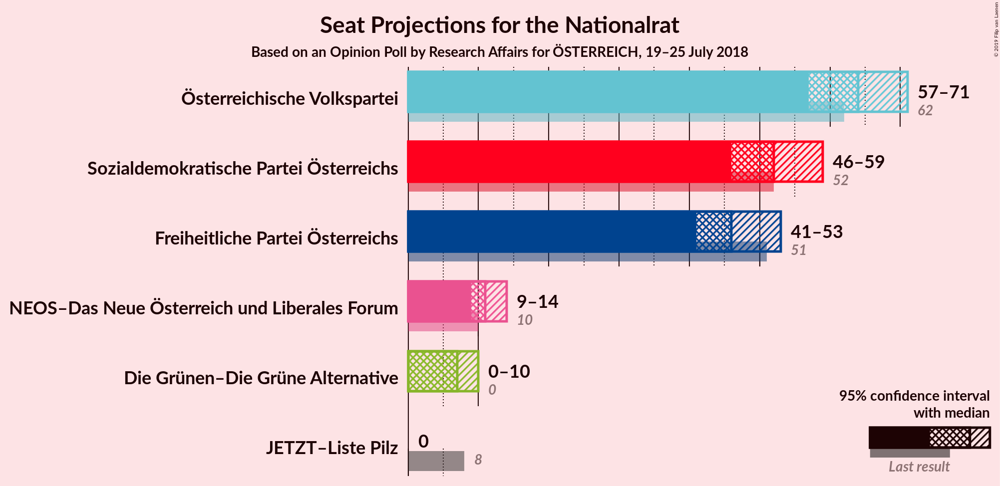
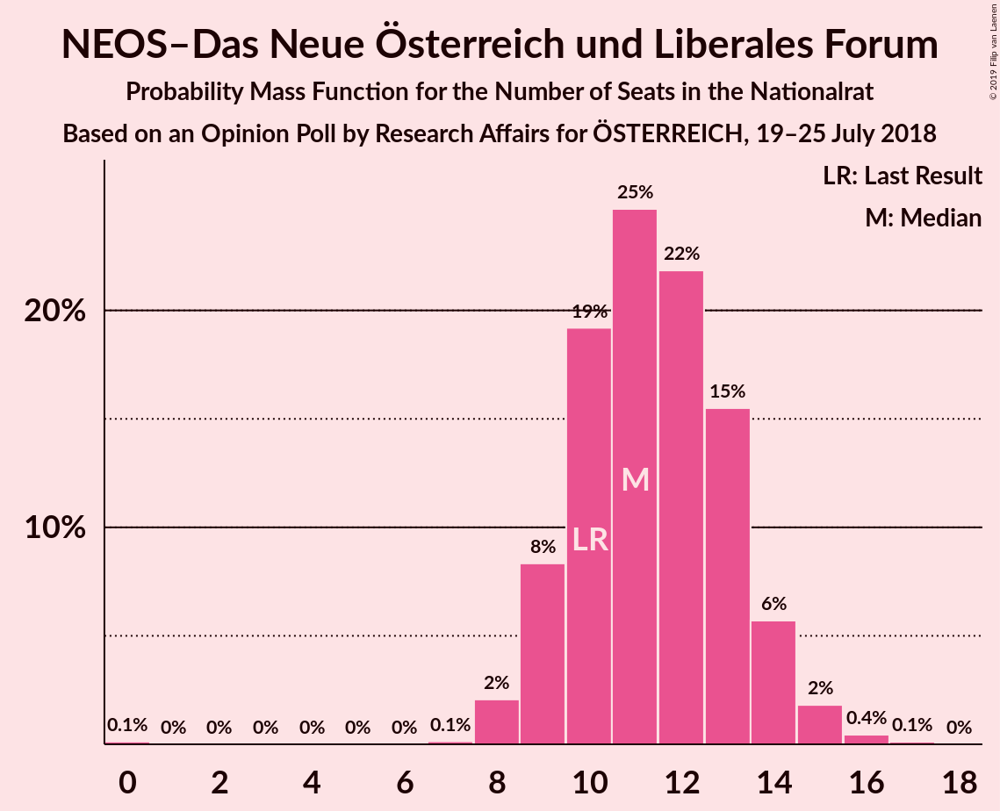
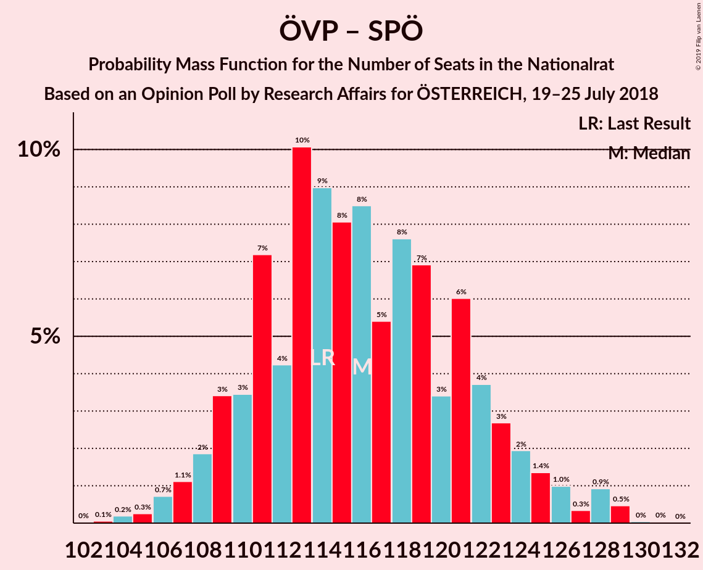
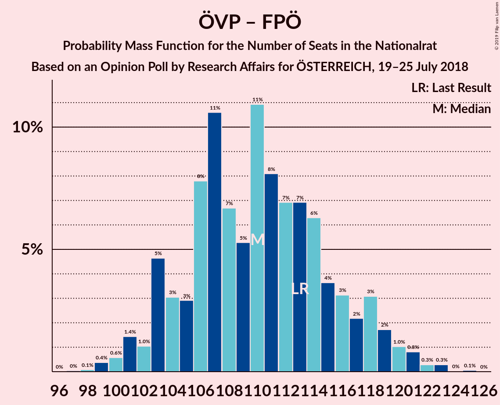
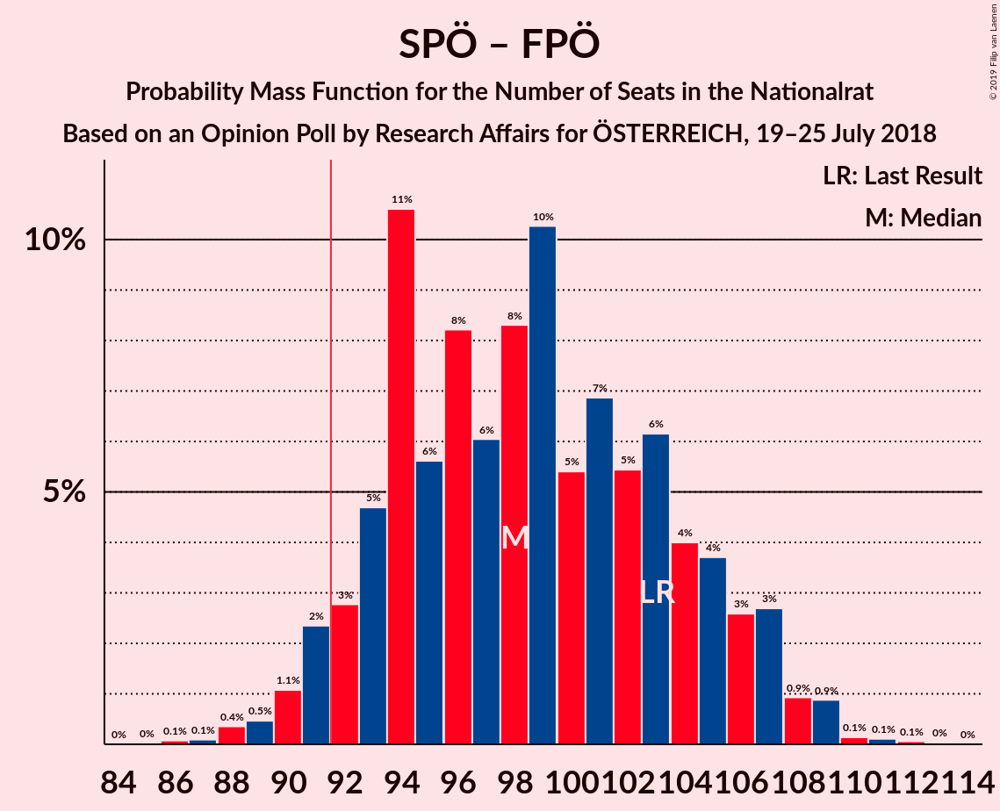

# Opinion Poll by Research Affairs for ÖSTERREICH, 19–25 July 2018

<a href="#voting-intentions">Voting Intentions</a> | <a href="#seats">Seats</a> | <a href="#coalitions">Coalitions</a> | <a href="#technical-information">Technical Information</a>

## Voting Intentions

### Confidence Intervals

| Party | Last Result | Poll Result | 80% Confidence Interval | 90% Confidence Interval | 95% Confidence Interval | 99% Confidence Interval |
|:-----:|:-----------:|:-----------:|:-----------------------:|:-----------------------:|:-----------------------:|:-----------------------:|
| Österreichische Volkspartei | 31.5% | 33.0% | 31.1–34.9% |30.6–35.5% |30.1–36.0% |29.2–36.9% |
| Sozialdemokratische Partei Österreichs | 26.9% | 27.0% | 25.2–28.8% |24.7–29.4% |24.3–29.8% |23.5–30.7% |
| Freiheitliche Partei Österreichs | 26.0% | 24.0% | 22.3–25.8% |21.8–26.3% |21.4–26.7% |20.7–27.6% |
| NEOS–Das Neue Österreich und Liberales Forum | 5.3% | 6.0% | 5.1–7.1% |4.9–7.4% |4.7–7.7% |4.3–8.2% |
| Die Grünen–Die Grüne Alternative | 3.8% | 4.0% | 3.3–4.9% |3.1–5.2% |2.9–5.4% |2.6–5.9% |
| JETZT–Liste Pilz | 4.4% | 2.0% | 1.5–2.7% |1.4–2.9% |1.3–3.1% |1.1–3.4% |

*Note:* The poll result column reflects the actual value used in the calculations. Published results may vary slightly, and in addition be rounded to fewer digits.

## Seats

### Confidence Intervals

| Party | Last Result | Median | 80% Confidence Interval | 90% Confidence Interval | 95% Confidence Interval | 99% Confidence Interval |
|:-----:|:-----------:|:------:|:-----------------------:|:-----------------------:|:-----------------------:|:-----------------------:|
| <a href="#österreichische-volkspartei">Österreichische Volkspartei</a> | 62 | 64 | 60–68 |58–70 |57–71 |55–73 |
| <a href="#sozialdemokratische-partei-österreichs">Sozialdemokratische Partei Österreichs</a> | 52 | 52 | 48–56 |47–58 |46–59 |44–61 |
| <a href="#freiheitliche-partei-österreichs">Freiheitliche Partei Österreichs</a> | 51 | 46 | 42–50 |41–52 |41–53 |39–54 |
| <a href="#neos–das-neue-österreich-und-liberales-forum">NEOS–Das Neue Österreich und Liberales Forum</a> | 10 | 11 | 9–13 |9–14 |9–14 |8–16 |
| <a href="#die-grünen–die-grüne-alternative">Die Grünen–Die Grüne Alternative</a> | 0 | 7 | 0–9 |0–10 |0–10 |0–11 |
| <a href="#jetzt–liste-pilz">JETZT–Liste Pilz</a> | 8 | 0 | 0 |0 |0 |0 |

### Österreichische Volkspartei

*For a full overview of the results for this party, see the [Österreichische Volkspartei](party-österreichischevolkspartei.html) page.*

| Number of Seats | Probability | Accumulated | Special Marks |
|:---------------:|:-----------:|:-----------:|:-------------:|
| 53 | 0% | 100% |  |
| 54 | 0.1% | 99.9% |  |
| 55 | 0.5% | 99.9% |  |
| 56 | 0.9% | 99.3% |  |
| 57 | 2% | 98% |  |
| 58 | 3% | 97% |  |
| 59 | 4% | 94% |  |
| 60 | 7% | 90% |  |
| 61 | 9% | 83% |  |
| 62 | 11% | 74% | Last Result |
| 63 | 13% | 64% |  |
| 64 | 12% | 50% | Median |
| 65 | 10% | 38% |  |
| 66 | 8% | 28% |  |
| 67 | 7% | 20% |  |
| 68 | 5% | 13% |  |
| 69 | 3% | 9% |  |
| 70 | 2% | 6% |  |
| 71 | 2% | 4% |  |
| 72 | 0.8% | 2% |  |
| 73 | 0.9% | 1.3% |  |
| 74 | 0.2% | 0.4% |  |
| 75 | 0.1% | 0.2% |  |
| 76 | 0% | 0% |  |

### Sozialdemokratische Partei Österreichs

*For a full overview of the results for this party, see the [Sozialdemokratische Partei Österreichs](party-sozialdemokratischeparteiösterreichs.html) page.*

| Number of Seats | Probability | Accumulated | Special Marks |
|:---------------:|:-----------:|:-----------:|:-------------:|
| 43 | 0.1% | 100% |  |
| 44 | 0.4% | 99.8% |  |
| 45 | 0.8% | 99.5% |  |
| 46 | 2% | 98.7% |  |
| 47 | 3% | 97% |  |
| 48 | 6% | 94% |  |
| 49 | 7% | 87% |  |
| 50 | 11% | 80% |  |
| 51 | 11% | 69% |  |
| 52 | 14% | 58% | Last Result, Median |
| 53 | 12% | 43% |  |
| 54 | 6% | 31% |  |
| 55 | 7% | 25% |  |
| 56 | 8% | 18% |  |
| 57 | 4% | 10% |  |
| 58 | 2% | 5% |  |
| 59 | 2% | 3% |  |
| 60 | 0.7% | 1.4% |  |
| 61 | 0.5% | 0.7% |  |
| 62 | 0.1% | 0.2% |  |
| 63 | 0% | 0.1% |  |
| 64 | 0% | 0% |  |

### Freiheitliche Partei Österreichs

*For a full overview of the results for this party, see the [Freiheitliche Partei Österreichs](party-freiheitlicheparteiösterreichs.html) page.*

| Number of Seats | Probability | Accumulated | Special Marks |
|:---------------:|:-----------:|:-----------:|:-------------:|
| 37 | 0.1% | 100% |  |
| 38 | 0.2% | 99.9% |  |
| 39 | 0.3% | 99.7% |  |
| 40 | 1.0% | 99.5% |  |
| 41 | 4% | 98% |  |
| 42 | 5% | 94% |  |
| 43 | 8% | 89% |  |
| 44 | 9% | 82% |  |
| 45 | 12% | 72% |  |
| 46 | 12% | 60% | Median |
| 47 | 17% | 48% |  |
| 48 | 7% | 31% |  |
| 49 | 10% | 24% |  |
| 50 | 5% | 14% |  |
| 51 | 3% | 9% | Last Result |
| 52 | 2% | 6% |  |
| 53 | 2% | 4% |  |
| 54 | 1.3% | 2% |  |
| 55 | 0.2% | 0.4% |  |
| 56 | 0.1% | 0.2% |  |
| 57 | 0.1% | 0.1% |  |
| 58 | 0% | 0% |  |

### NEOS–Das Neue Österreich und Liberales Forum

*For a full overview of the results for this party, see the [NEOS–Das Neue Österreich und Liberales Forum](party-neos–dasneueösterreichundliberalesforum.html) page.*

| Number of Seats | Probability | Accumulated | Special Marks |
|:---------------:|:-----------:|:-----------:|:-------------:|
| 0 | 0.1% | 100% |  |
| 1 | 0% | 99.9% |  |
| 2 | 0% | 99.9% |  |
| 3 | 0% | 99.9% |  |
| 4 | 0% | 99.9% |  |
| 5 | 0% | 99.9% |  |
| 6 | 0% | 99.9% |  |
| 7 | 0.1% | 99.9% |  |
| 8 | 2% | 99.7% |  |
| 9 | 8% | 98% |  |
| 10 | 19% | 89% | Last Result |
| 11 | 25% | 70% | Median |
| 12 | 22% | 45% |  |
| 13 | 15% | 24% |  |
| 14 | 6% | 8% |  |
| 15 | 2% | 2% |  |
| 16 | 0.4% | 0.6% |  |
| 17 | 0.1% | 0.1% |  |
| 18 | 0% | 0% |  |

### Die Grünen–Die Grüne Alternative

*For a full overview of the results for this party, see the [Die Grünen–Die Grüne Alternative](party-diegrünen–diegrünealternative.html) page.*

| Number of Seats | Probability | Accumulated | Special Marks |
|:---------------:|:-----------:|:-----------:|:-------------:|
| 0 | 46% | 100% | Last Result |
| 1 | 0% | 54% |  |
| 2 | 0% | 54% |  |
| 3 | 0% | 54% |  |
| 4 | 0% | 54% |  |
| 5 | 0% | 54% |  |
| 6 | 0% | 54% |  |
| 7 | 11% | 54% | Median |
| 8 | 27% | 43% |  |
| 9 | 11% | 16% |  |
| 10 | 4% | 5% |  |
| 11 | 0.8% | 0.9% |  |
| 12 | 0.1% | 0.1% |  |
| 13 | 0% | 0% |  |

### JETZT–Liste Pilz

*For a full overview of the results for this party, see the [JETZT–Liste Pilz](party-jetzt–listepilz.html) page.*

| Number of Seats | Probability | Accumulated | Special Marks |
|:---------------:|:-----------:|:-----------:|:-------------:|
| 0 | 100% | 100% | Median |
| 1 | 0% | 0% |  |
| 2 | 0% | 0% |  |
| 3 | 0% | 0% |  |
| 4 | 0% | 0% |  |
| 5 | 0% | 0% |  |
| 6 | 0% | 0% |  |
| 7 | 0% | 0% |  |
| 8 | 0% | 0% | Last Result |

## Coalitions

### Confidence Intervals

| Coalition | Last Result | Median | Majority? | 80% Confidence Interval | 90% Confidence Interval | 95% Confidence Interval | 99% Confidence Interval |
|:---------:|:-----------:|:------:|:---------:|:-----------------------:|:-----------------------:|:-----------------------:|:-----------------------:|
| Österreichische Volkspartei – Sozialdemokratische Partei Österreichs | 114 | 116 | 100% | 110–122 | 109–124 | 108–126 | 105–129 |
| Österreichische Volkspartei – Freiheitliche Partei Österreichs | 113 | 110 | 100% | 104–116 | 103–118 | 101–120 | 99–122 |
| Sozialdemokratische Partei Österreichs – Freiheitliche Partei Österreichs | 103 | 98 | 96% | 93–105 | 92–106 | 91–107 | 88–109 |
| Österreichische Volkspartei – NEOS–Das Neue Österreich und Liberales Forum – Die Grünen–Die Grüne Alternative | 72 | 80 | 0.1% | 74–85 | 72–86 | 72–88 | 69–90 |
| Österreichische Volkspartei – NEOS–Das Neue Österreich und Liberales Forum | 72 | 75 | 0% | 71–80 | 69–81 | 68–83 | 66–85 |
| Sozialdemokratische Partei Österreichs – NEOS–Das Neue Österreich und Liberales Forum – Die Grünen–Die Grüne Alternative | 62 | 68 | 0% | 62–73 | 61–75 | 60–76 | 58–78 |
| Österreichische Volkspartei – Die Grünen–Die Grüne Alternative | 62 | 68 | 0% | 63–73 | 61–75 | 60–76 | 58–79 |
| Österreichische Volkspartei | 62 | 64 | 0% | 60–68 | 58–70 | 57–71 | 55–73 |
| Sozialdemokratische Partei Österreichs | 52 | 52 | 0% | 48–56 | 47–58 | 46–59 | 44–61 |

### Österreichische Volkspartei – Sozialdemokratische Partei Österreichs

| Number of Seats | Probability | Accumulated | Special Marks |
|:---------------:|:-----------:|:-----------:|:-------------:|
| 103 | 0.1% | 100% |  |
| 104 | 0.2% | 99.9% |  |
| 105 | 0.3% | 99.7% |  |
| 106 | 0.7% | 99.5% |  |
| 107 | 1.1% | 98.7% |  |
| 108 | 2% | 98% |  |
| 109 | 3% | 96% |  |
| 110 | 3% | 92% |  |
| 111 | 7% | 89% |  |
| 112 | 4% | 82% |  |
| 113 | 10% | 77% |  |
| 114 | 9% | 67% | Last Result |
| 115 | 8% | 58% |  |
| 116 | 8% | 50% | Median |
| 117 | 5% | 42% |  |
| 118 | 8% | 36% |  |
| 119 | 7% | 29% |  |
| 120 | 3% | 22% |  |
| 121 | 6% | 19% |  |
| 122 | 4% | 13% |  |
| 123 | 3% | 9% |  |
| 124 | 2% | 6% |  |
| 125 | 1.4% | 4% |  |
| 126 | 1.0% | 3% |  |
| 127 | 0.3% | 2% |  |
| 128 | 0.9% | 1.5% |  |
| 129 | 0.5% | 0.6% |  |
| 130 | 0% | 0.1% |  |
| 131 | 0% | 0% |  |

### Österreichische Volkspartei – Freiheitliche Partei Österreichs

| Number of Seats | Probability | Accumulated | Special Marks |
|:---------------:|:-----------:|:-----------:|:-------------:|
| 97 | 0% | 100% |  |
| 98 | 0.1% | 99.9% |  |
| 99 | 0.4% | 99.9% |  |
| 100 | 0.6% | 99.5% |  |
| 101 | 1.4% | 98.9% |  |
| 102 | 1.0% | 97% |  |
| 103 | 5% | 96% |  |
| 104 | 3% | 92% |  |
| 105 | 3% | 89% |  |
| 106 | 8% | 86% |  |
| 107 | 11% | 78% |  |
| 108 | 7% | 67% |  |
| 109 | 5% | 61% |  |
| 110 | 11% | 55% | Median |
| 111 | 8% | 45% |  |
| 112 | 7% | 36% |  |
| 113 | 7% | 29% | Last Result |
| 114 | 6% | 23% |  |
| 115 | 4% | 16% |  |
| 116 | 3% | 13% |  |
| 117 | 2% | 9% |  |
| 118 | 3% | 7% |  |
| 119 | 2% | 4% |  |
| 120 | 1.0% | 3% |  |
| 121 | 0.8% | 1.5% |  |
| 122 | 0.3% | 0.7% |  |
| 123 | 0.3% | 0.4% |  |
| 124 | 0% | 0.1% |  |
| 125 | 0.1% | 0.1% |  |
| 126 | 0% | 0% |  |

### Sozialdemokratische Partei Österreichs – Freiheitliche Partei Österreichs

| Number of Seats | Probability | Accumulated | Special Marks |
|:---------------:|:-----------:|:-----------:|:-------------:|
| 86 | 0.1% | 100% |  |
| 87 | 0.1% | 99.9% |  |
| 88 | 0.4% | 99.8% |  |
| 89 | 0.5% | 99.5% |  |
| 90 | 1.1% | 99.0% |  |
| 91 | 2% | 98% |  |
| 92 | 3% | 96% | Majority |
| 93 | 5% | 93% |  |
| 94 | 11% | 88% |  |
| 95 | 6% | 77% |  |
| 96 | 8% | 72% |  |
| 97 | 6% | 64% |  |
| 98 | 8% | 58% | Median |
| 99 | 10% | 49% |  |
| 100 | 5% | 39% |  |
| 101 | 7% | 34% |  |
| 102 | 5% | 27% |  |
| 103 | 6% | 21% | Last Result |
| 104 | 4% | 15% |  |
| 105 | 4% | 11% |  |
| 106 | 3% | 7% |  |
| 107 | 3% | 5% |  |
| 108 | 0.9% | 2% |  |
| 109 | 0.9% | 1.2% |  |
| 110 | 0.1% | 0.4% |  |
| 111 | 0.1% | 0.2% |  |
| 112 | 0.1% | 0.1% |  |
| 113 | 0% | 0% |  |

### Österreichische Volkspartei – NEOS–Das Neue Österreich und Liberales Forum – Die Grünen–Die Grüne Alternative

| Number of Seats | Probability | Accumulated | Special Marks |
|:---------------:|:-----------:|:-----------:|:-------------:|
| 67 | 0.1% | 100% |  |
| 68 | 0.1% | 99.9% |  |
| 69 | 0.3% | 99.7% |  |
| 70 | 0.6% | 99.5% |  |
| 71 | 1.4% | 98.9% |  |
| 72 | 3% | 98% | Last Result |
| 73 | 2% | 95% |  |
| 74 | 4% | 92% |  |
| 75 | 2% | 88% |  |
| 76 | 10% | 86% |  |
| 77 | 8% | 76% |  |
| 78 | 8% | 69% |  |
| 79 | 9% | 61% |  |
| 80 | 10% | 52% |  |
| 81 | 11% | 41% |  |
| 82 | 7% | 31% | Median |
| 83 | 6% | 23% |  |
| 84 | 6% | 18% |  |
| 85 | 4% | 11% |  |
| 86 | 3% | 7% |  |
| 87 | 2% | 4% |  |
| 88 | 0.6% | 3% |  |
| 89 | 1.0% | 2% |  |
| 90 | 0.6% | 0.9% |  |
| 91 | 0.2% | 0.3% |  |
| 92 | 0% | 0.1% | Majority |
| 93 | 0% | 0.1% |  |
| 94 | 0% | 0% |  |

### Österreichische Volkspartei – NEOS–Das Neue Österreich und Liberales Forum

| Number of Seats | Probability | Accumulated | Special Marks |
|:---------------:|:-----------:|:-----------:|:-------------:|
| 64 | 0.1% | 100% |  |
| 65 | 0.3% | 99.9% |  |
| 66 | 0.3% | 99.6% |  |
| 67 | 1.3% | 99.3% |  |
| 68 | 2% | 98% |  |
| 69 | 3% | 96% |  |
| 70 | 3% | 94% |  |
| 71 | 8% | 91% |  |
| 72 | 6% | 82% | Last Result |
| 73 | 11% | 77% |  |
| 74 | 13% | 66% |  |
| 75 | 6% | 53% | Median |
| 76 | 14% | 47% |  |
| 77 | 7% | 32% |  |
| 78 | 7% | 26% |  |
| 79 | 7% | 18% |  |
| 80 | 4% | 12% |  |
| 81 | 3% | 8% |  |
| 82 | 1.2% | 5% |  |
| 83 | 1.2% | 3% |  |
| 84 | 1.1% | 2% |  |
| 85 | 0.6% | 1.0% |  |
| 86 | 0.2% | 0.4% |  |
| 87 | 0.1% | 0.2% |  |
| 88 | 0.1% | 0.1% |  |
| 89 | 0% | 0% |  |

### Sozialdemokratische Partei Österreichs – NEOS–Das Neue Österreich und Liberales Forum – Die Grünen–Die Grüne Alternative

| Number of Seats | Probability | Accumulated | Special Marks |
|:---------------:|:-----------:|:-----------:|:-------------:|
| 55 | 0% | 100% |  |
| 56 | 0.1% | 99.9% |  |
| 57 | 0.3% | 99.9% |  |
| 58 | 0.5% | 99.6% |  |
| 59 | 0.6% | 99.1% |  |
| 60 | 2% | 98.5% |  |
| 61 | 3% | 96% |  |
| 62 | 5% | 93% | Last Result |
| 63 | 3% | 88% |  |
| 64 | 8% | 86% |  |
| 65 | 7% | 78% |  |
| 66 | 7% | 71% |  |
| 67 | 7% | 64% |  |
| 68 | 11% | 56% |  |
| 69 | 7% | 45% |  |
| 70 | 9% | 38% | Median |
| 71 | 7% | 29% |  |
| 72 | 6% | 22% |  |
| 73 | 8% | 16% |  |
| 74 | 2% | 9% |  |
| 75 | 3% | 6% |  |
| 76 | 1.5% | 4% |  |
| 77 | 1.4% | 2% |  |
| 78 | 0.4% | 0.7% |  |
| 79 | 0.2% | 0.3% |  |
| 80 | 0.1% | 0.2% |  |
| 81 | 0% | 0.1% |  |
| 82 | 0% | 0% |  |

### Österreichische Volkspartei – Die Grünen–Die Grüne Alternative

| Number of Seats | Probability | Accumulated | Special Marks |
|:---------------:|:-----------:|:-----------:|:-------------:|
| 56 | 0.1% | 100% |  |
| 57 | 0.2% | 99.9% |  |
| 58 | 0.4% | 99.8% |  |
| 59 | 0.8% | 99.4% |  |
| 60 | 2% | 98.5% |  |
| 61 | 3% | 97% |  |
| 62 | 3% | 93% | Last Result |
| 63 | 3% | 91% |  |
| 64 | 8% | 88% |  |
| 65 | 6% | 79% |  |
| 66 | 7% | 73% |  |
| 67 | 8% | 66% |  |
| 68 | 9% | 58% |  |
| 69 | 8% | 49% |  |
| 70 | 11% | 41% |  |
| 71 | 9% | 30% | Median |
| 72 | 6% | 21% |  |
| 73 | 7% | 15% |  |
| 74 | 3% | 8% |  |
| 75 | 2% | 5% |  |
| 76 | 1.2% | 3% |  |
| 77 | 0.7% | 2% |  |
| 78 | 0.8% | 1.4% |  |
| 79 | 0.4% | 0.6% |  |
| 80 | 0.2% | 0.3% |  |
| 81 | 0.1% | 0.1% |  |
| 82 | 0% | 0% |  |

### Österreichische Volkspartei

| Number of Seats | Probability | Accumulated | Special Marks |
|:---------------:|:-----------:|:-----------:|:-------------:|
| 53 | 0% | 100% |  |
| 54 | 0.1% | 99.9% |  |
| 55 | 0.5% | 99.9% |  |
| 56 | 0.9% | 99.3% |  |
| 57 | 2% | 98% |  |
| 58 | 3% | 97% |  |
| 59 | 4% | 94% |  |
| 60 | 7% | 90% |  |
| 61 | 9% | 83% |  |
| 62 | 11% | 74% | Last Result |
| 63 | 13% | 64% |  |
| 64 | 12% | 50% | Median |
| 65 | 10% | 38% |  |
| 66 | 8% | 28% |  |
| 67 | 7% | 20% |  |
| 68 | 5% | 13% |  |
| 69 | 3% | 9% |  |
| 70 | 2% | 6% |  |
| 71 | 2% | 4% |  |
| 72 | 0.8% | 2% |  |
| 73 | 0.9% | 1.3% |  |
| 74 | 0.2% | 0.4% |  |
| 75 | 0.1% | 0.2% |  |
| 76 | 0% | 0% |  |

### Sozialdemokratische Partei Österreichs

| Number of Seats | Probability | Accumulated | Special Marks |
|:---------------:|:-----------:|:-----------:|:-------------:|
| 43 | 0.1% | 100% |  |
| 44 | 0.4% | 99.8% |  |
| 45 | 0.8% | 99.5% |  |
| 46 | 2% | 98.7% |  |
| 47 | 3% | 97% |  |
| 48 | 6% | 94% |  |
| 49 | 7% | 87% |  |
| 50 | 11% | 80% |  |
| 51 | 11% | 69% |  |
| 52 | 14% | 58% | Last Result, Median |
| 53 | 12% | 43% |  |
| 54 | 6% | 31% |  |
| 55 | 7% | 25% |  |
| 56 | 8% | 18% |  |
| 57 | 4% | 10% |  |
| 58 | 2% | 5% |  |
| 59 | 2% | 3% |  |
| 60 | 0.7% | 1.4% |  |
| 61 | 0.5% | 0.7% |  |
| 62 | 0.1% | 0.2% |  |
| 63 | 0% | 0.1% |  |
| 64 | 0% | 0% |  |

## Technical Information

### Opinion Poll

+ **Polling firm:** Research Affairs
+ **Commissioner(s):** ÖSTERREICH
+ **Fieldwork period:** 19–25 July 2018

### Calculations

+ **Sample size:** 1001
+ **Simulations done:** 131,072
+ **Error estimate:** 1.87%

