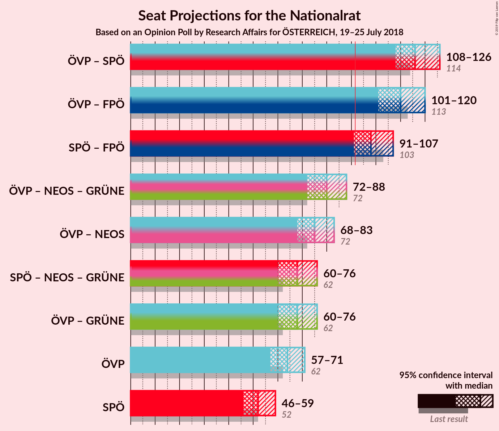

# Opinion Poll by Research Affairs for ÖSTERREICH, 19–25 July 2018

<a href="#voting-intentions">Voting Intentions</a> | <a href="#seats">Seats</a> | <a href="#coalitions">Coalitions</a> | <a href="#technical-information">Technical Information</a>

## Voting Intentions

### Confidence Intervals

| Party | Last Result | Poll Result | 80% Confidence Interval | 90% Confidence Interval | 95% Confidence Interval | 99% Confidence Interval |
|:-----:|:-----------:|:-----------:|:-----------------------:|:-----------------------:|:-----------------------:|:-----------------------:|
| Österreichische Volkspartei | 31.5% | 33.0% | 31.1–34.9% |30.6–35.5% |30.1–36.0% |29.2–36.9% |
| Sozialdemokratische Partei Österreichs | 26.9% | 27.0% | 25.2–28.8% |24.7–29.4% |24.3–29.8% |23.5–30.7% |
| Freiheitliche Partei Österreichs | 26.0% | 24.0% | 22.3–25.8% |21.8–26.3% |21.4–26.7% |20.7–27.6% |
| NEOS–Das Neue Österreich und Liberales Forum | 5.3% | 6.0% | 5.1–7.1% |4.9–7.4% |4.7–7.7% |4.3–8.2% |
| Die Grünen–Die Grüne Alternative | 3.8% | 4.0% | 3.3–4.9% |3.1–5.2% |2.9–5.4% |2.6–5.9% |
| JETZT–Liste Pilz | 4.4% | 2.0% | 1.5–2.7% |1.4–2.9% |1.3–3.1% |1.1–3.4% |

*Note:* The poll result column reflects the actual value used in the calculations. Published results may vary slightly, and in addition be rounded to fewer digits.

## Seats

### Confidence Intervals

| Party | Last Result | Median | 80% Confidence Interval | 90% Confidence Interval | 95% Confidence Interval | 99% Confidence Interval |
|:-----:|:-----------:|:------:|:-----------------------:|:-----------------------:|:-----------------------:|:-----------------------:|
| <a href="#österreichische-volkspartei">Österreichische Volkspartei</a> | 62 | 67 | 67–70 |66–70 |59–70 |57–70 |
| <a href="#sozialdemokratische-partei-österreichs">Sozialdemokratische Partei Österreichs</a> | 52 | 51 | 51–53 |51–53 |50–53 |50–58 |
| <a href="#freiheitliche-partei-österreichs">Freiheitliche Partei Österreichs</a> | 51 | 47 | 47–49 |46–49 |46–49 |43–51 |
| <a href="#neos–das-neue-österreich-und-liberales-forum">NEOS–Das Neue Österreich und Liberales Forum</a> | 10 | 10 | 10–11 |10–11 |10–13 |10–15 |
| <a href="#die-grünen–die-grüne-alternative">Die Grünen–Die Grüne Alternative</a> | 0 | 0 | 0 |0 |0–8 |0–10 |
| <a href="#jetzt–liste-pilz">JETZT–Liste Pilz</a> | 8 | 0 | 0 |0 |0 |0 |

### Österreichische Volkspartei

*For a full overview of the results for this party, see the [Österreichische Volkspartei](party-österreichischevolkspartei.html) page.*

| Number of Seats | Probability | Accumulated | Special Marks |
|:---------------:|:-----------:|:-----------:|:-------------:|
| 55 | 0.4% | 100% |  |
| 56 | 0% | 99.5% |  |
| 57 | 0.5% | 99.5% |  |
| 58 | 0.8% | 99.1% |  |
| 59 | 1.0% | 98% |  |
| 60 | 0.5% | 97% |  |
| 61 | 0.5% | 97% |  |
| 62 | 0% | 96% | Last Result |
| 63 | 0% | 96% |  |
| 64 | 0% | 96% |  |
| 65 | 0% | 96% |  |
| 66 | 3% | 96% |  |
| 67 | 62% | 93% | Median |
| 68 | 0% | 31% |  |
| 69 | 0% | 31% |  |
| 70 | 31% | 31% |  |
| 71 | 0.1% | 0.3% |  |
| 72 | 0% | 0.1% |  |
| 73 | 0.1% | 0.1% |  |
| 74 | 0% | 0% |  |

### Sozialdemokratische Partei Österreichs

*For a full overview of the results for this party, see the [Sozialdemokratische Partei Österreichs](party-sozialdemokratischeparteiösterreichs.html) page.*

| Number of Seats | Probability | Accumulated | Special Marks |
|:---------------:|:-----------:|:-----------:|:-------------:|
| 46 | 0.1% | 100% |  |
| 47 | 0% | 99.9% |  |
| 48 | 0% | 99.9% |  |
| 49 | 0.2% | 99.9% |  |
| 50 | 4% | 99.7% |  |
| 51 | 63% | 96% | Median |
| 52 | 0% | 33% | Last Result |
| 53 | 31% | 33% |  |
| 54 | 0.2% | 2% |  |
| 55 | 0.4% | 1.4% |  |
| 56 | 0% | 1.0% |  |
| 57 | 0.2% | 1.0% |  |
| 58 | 0.4% | 0.8% |  |
| 59 | 0% | 0.4% |  |
| 60 | 0.1% | 0.3% |  |
| 61 | 0% | 0.3% |  |
| 62 | 0.3% | 0.3% |  |
| 63 | 0% | 0% |  |

### Freiheitliche Partei Österreichs

*For a full overview of the results for this party, see the [Freiheitliche Partei Österreichs](party-freiheitlicheparteiösterreichs.html) page.*

| Number of Seats | Probability | Accumulated | Special Marks |
|:---------------:|:-----------:|:-----------:|:-------------:|
| 40 | 0.1% | 100% |  |
| 41 | 0.1% | 99.9% |  |
| 42 | 0.3% | 99.8% |  |
| 43 | 1.4% | 99.6% |  |
| 44 | 0.2% | 98% |  |
| 45 | 0.1% | 98% |  |
| 46 | 4% | 98% |  |
| 47 | 61% | 94% | Median |
| 48 | 0.4% | 32% |  |
| 49 | 31% | 32% |  |
| 50 | 0% | 0.7% |  |
| 51 | 0.6% | 0.7% | Last Result |
| 52 | 0% | 0.1% |  |
| 53 | 0% | 0.1% |  |
| 54 | 0% | 0.1% |  |
| 55 | 0.1% | 0.1% |  |
| 56 | 0% | 0% |  |

### NEOS–Das Neue Österreich und Liberales Forum

*For a full overview of the results for this party, see the [NEOS–Das Neue Österreich und Liberales Forum](party-neos–dasneueösterreichundliberalesforum.html) page.*

| Number of Seats | Probability | Accumulated | Special Marks |
|:---------------:|:-----------:|:-----------:|:-------------:|
| 9 | 0% | 100% |  |
| 10 | 66% | 99.9% | Last Result, Median |
| 11 | 31% | 34% |  |
| 12 | 0.2% | 3% |  |
| 13 | 1.3% | 3% |  |
| 14 | 0.4% | 1.5% |  |
| 15 | 0.6% | 1.1% |  |
| 16 | 0.4% | 0.4% |  |
| 17 | 0% | 0% |  |

### Die Grünen–Die Grüne Alternative

*For a full overview of the results for this party, see the [Die Grünen–Die Grüne Alternative](party-diegrünen–diegrünealternative.html) page.*

| Number of Seats | Probability | Accumulated | Special Marks |
|:---------------:|:-----------:|:-----------:|:-------------:|
| 0 | 97% | 100% | Last Result, Median |
| 1 | 0% | 3% |  |
| 2 | 0% | 3% |  |
| 3 | 0% | 3% |  |
| 4 | 0% | 3% |  |
| 5 | 0% | 3% |  |
| 6 | 0% | 3% |  |
| 7 | 0.1% | 3% |  |
| 8 | 0.3% | 3% |  |
| 9 | 0% | 2% |  |
| 10 | 2% | 2% |  |
| 11 | 0.3% | 0.3% |  |
| 12 | 0% | 0% |  |

### JETZT–Liste Pilz

*For a full overview of the results for this party, see the [JETZT–Liste Pilz](party-jetzt–listepilz.html) page.*

| Number of Seats | Probability | Accumulated | Special Marks |
|:---------------:|:-----------:|:-----------:|:-------------:|
| 0 | 100% | 100% | Median |
| 1 | 0% | 0% |  |
| 2 | 0% | 0% |  |
| 3 | 0% | 0% |  |
| 4 | 0% | 0% |  |
| 5 | 0% | 0% |  |
| 6 | 0% | 0% |  |
| 7 | 0% | 0% |  |
| 8 | 0% | 0% | Last Result |

## Coalitions

### Confidence Intervals

| Coalition | Last Result | Median | Majority? | 80% Confidence Interval | 90% Confidence Interval | 95% Confidence Interval | 99% Confidence Interval |
|:---------:|:-----------:|:------:|:---------:|:-----------------------:|:-----------------------:|:-----------------------:|:-----------------------:|
| Österreichische Volkspartei – Sozialdemokratische Partei Österreichs | 114 | 118 | 100% | 118–123 | 116–123 | 113–123 | 107–123 |
| Österreichische Volkspartei – Freiheitliche Partei Österreichs | 113 | 114 | 100% | 114–119 | 112–119 | 106–119 | 102–119 |
| Sozialdemokratische Partei Österreichs – Freiheitliche Partei Österreichs | 103 | 98 | 99.9% | 98–102 | 96–102 | 96–102 | 94–106 |
| Österreichische Volkspartei | 62 | 67 | 0% | 67–70 | 66–70 | 59–70 | 57–70 |
| Sozialdemokratische Partei Österreichs | 52 | 51 | 0% | 51–53 | 51–53 | 50–53 | 50–58 |

### Österreichische Volkspartei – Sozialdemokratische Partei Österreichs

| Number of Seats | Probability | Accumulated | Special Marks |
|:---------------:|:-----------:|:-----------:|:-------------:|
| 106 | 0.4% | 100% |  |
| 107 | 0.2% | 99.6% |  |
| 108 | 0% | 99.4% |  |
| 109 | 0% | 99.4% |  |
| 110 | 1.0% | 99.4% |  |
| 111 | 0.6% | 98% |  |
| 112 | 0.1% | 98% |  |
| 113 | 0.4% | 98% |  |
| 114 | 0.1% | 97% | Last Result |
| 115 | 0% | 97% |  |
| 116 | 3% | 97% |  |
| 117 | 0.3% | 94% |  |
| 118 | 62% | 94% | Median |
| 119 | 0.7% | 32% |  |
| 120 | 0% | 31% |  |
| 121 | 0% | 31% |  |
| 122 | 0.3% | 31% |  |
| 123 | 31% | 31% |  |
| 124 | 0.1% | 0.3% |  |
| 125 | 0% | 0.1% |  |
| 126 | 0.1% | 0.1% |  |
| 127 | 0% | 0% |  |

### Österreichische Volkspartei – Freiheitliche Partei Österreichs

| Number of Seats | Probability | Accumulated | Special Marks |
|:---------------:|:-----------:|:-----------:|:-------------:|
| 97 | 0.1% | 100% |  |
| 98 | 0% | 99.9% |  |
| 99 | 0% | 99.9% |  |
| 100 | 0.2% | 99.9% |  |
| 101 | 0% | 99.8% |  |
| 102 | 1.2% | 99.8% |  |
| 103 | 0% | 98.6% |  |
| 104 | 0.8% | 98.5% |  |
| 105 | 0% | 98% |  |
| 106 | 0.3% | 98% |  |
| 107 | 0.1% | 97% |  |
| 108 | 0% | 97% |  |
| 109 | 0.8% | 97% |  |
| 110 | 0.1% | 97% |  |
| 111 | 0.4% | 96% |  |
| 112 | 3% | 96% |  |
| 113 | 0.2% | 93% | Last Result |
| 114 | 61% | 92% | Median |
| 115 | 0% | 31% |  |
| 116 | 0.1% | 31% |  |
| 117 | 0.2% | 31% |  |
| 118 | 0% | 31% |  |
| 119 | 31% | 31% |  |
| 120 | 0% | 0% |  |

### Sozialdemokratische Partei Österreichs – Freiheitliche Partei Österreichs

| Number of Seats | Probability | Accumulated | Special Marks |
|:---------------:|:-----------:|:-----------:|:-------------:|
| 87 | 0.1% | 100% |  |
| 88 | 0% | 99.9% |  |
| 89 | 0% | 99.9% |  |
| 90 | 0% | 99.9% |  |
| 91 | 0% | 99.9% |  |
| 92 | 0.2% | 99.9% | Majority |
| 93 | 0.2% | 99.7% |  |
| 94 | 1.0% | 99.5% |  |
| 95 | 0.2% | 98.5% |  |
| 96 | 3% | 98% |  |
| 97 | 0% | 95% |  |
| 98 | 62% | 95% | Median |
| 99 | 0.1% | 33% |  |
| 100 | 0.5% | 33% |  |
| 101 | 0.4% | 33% |  |
| 102 | 31% | 32% |  |
| 103 | 0.2% | 2% | Last Result |
| 104 | 0.7% | 1.4% |  |
| 105 | 0% | 0.7% |  |
| 106 | 0.4% | 0.7% |  |
| 107 | 0% | 0.3% |  |
| 108 | 0.2% | 0.3% |  |
| 109 | 0% | 0.1% |  |
| 110 | 0% | 0% |  |

### Österreichische Volkspartei

| Number of Seats | Probability | Accumulated | Special Marks |
|:---------------:|:-----------:|:-----------:|:-------------:|
| 55 | 0.4% | 100% |  |
| 56 | 0% | 99.5% |  |
| 57 | 0.5% | 99.5% |  |
| 58 | 0.8% | 99.1% |  |
| 59 | 1.0% | 98% |  |
| 60 | 0.5% | 97% |  |
| 61 | 0.5% | 97% |  |
| 62 | 0% | 96% | Last Result |
| 63 | 0% | 96% |  |
| 64 | 0% | 96% |  |
| 65 | 0% | 96% |  |
| 66 | 3% | 96% |  |
| 67 | 62% | 93% | Median |
| 68 | 0% | 31% |  |
| 69 | 0% | 31% |  |
| 70 | 31% | 31% |  |
| 71 | 0.1% | 0.3% |  |
| 72 | 0% | 0.1% |  |
| 73 | 0.1% | 0.1% |  |
| 74 | 0% | 0% |  |

### Sozialdemokratische Partei Österreichs

| Number of Seats | Probability | Accumulated | Special Marks |
|:---------------:|:-----------:|:-----------:|:-------------:|
| 46 | 0.1% | 100% |  |
| 47 | 0% | 99.9% |  |
| 48 | 0% | 99.9% |  |
| 49 | 0.2% | 99.9% |  |
| 50 | 4% | 99.7% |  |
| 51 | 63% | 96% | Median |
| 52 | 0% | 33% | Last Result |
| 53 | 31% | 33% |  |
| 54 | 0.2% | 2% |  |
| 55 | 0.4% | 1.4% |  |
| 56 | 0% | 1.0% |  |
| 57 | 0.2% | 1.0% |  |
| 58 | 0.4% | 0.8% |  |
| 59 | 0% | 0.4% |  |
| 60 | 0.1% | 0.3% |  |
| 61 | 0% | 0.3% |  |
| 62 | 0.3% | 0.3% |  |
| 63 | 0% | 0% |  |

## Technical Information

### Opinion Poll

+ **Polling firm:** Research Affairs
+ **Commissioner(s):** ÖSTERREICH
+ **Fieldwork period:** 19–25 July 2018

### Calculations

+ **Sample size:** 1001
+ **Simulations done:** 1,024
+ **Error estimate:** 3.22%

