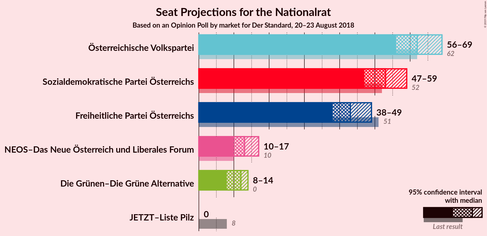
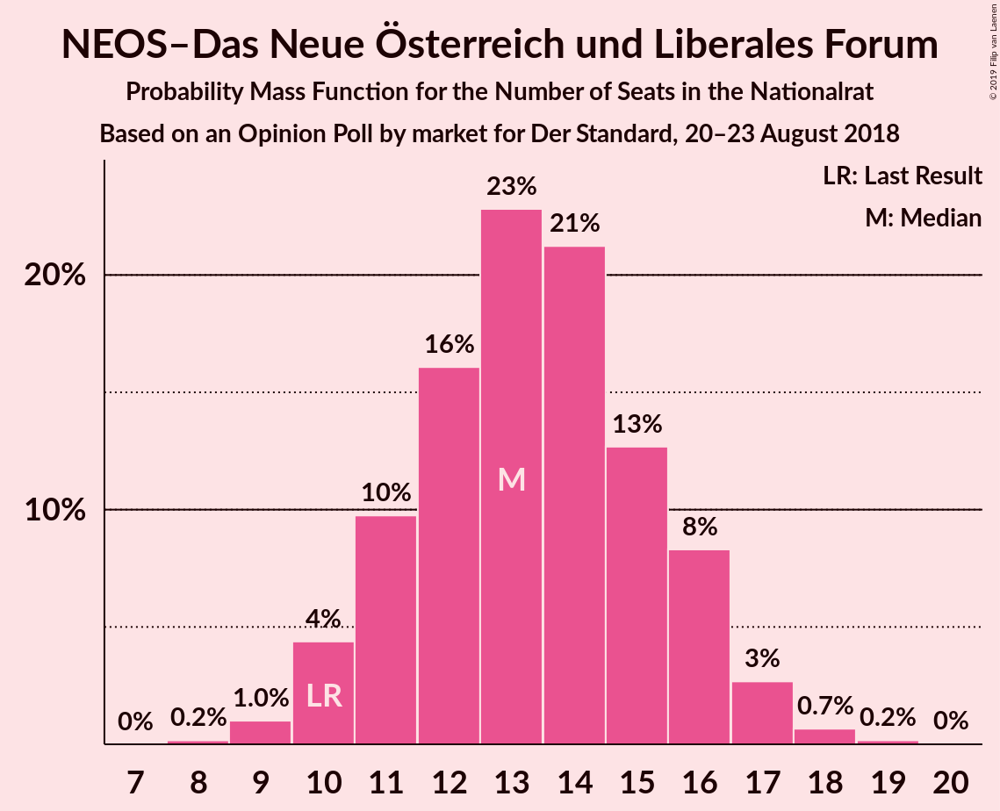
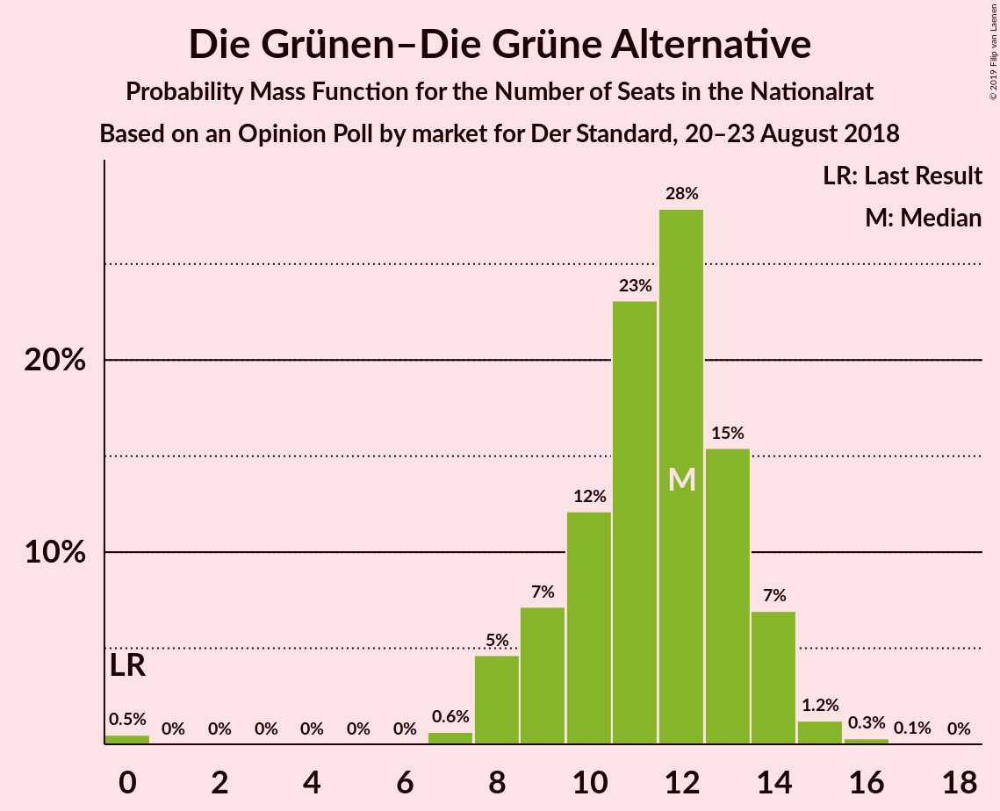
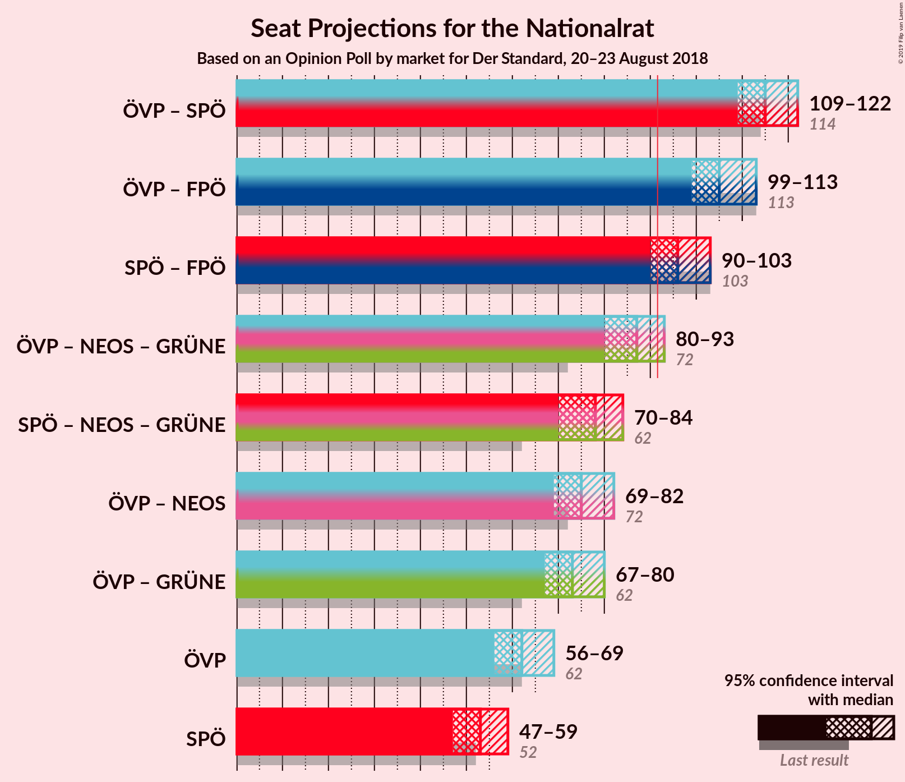
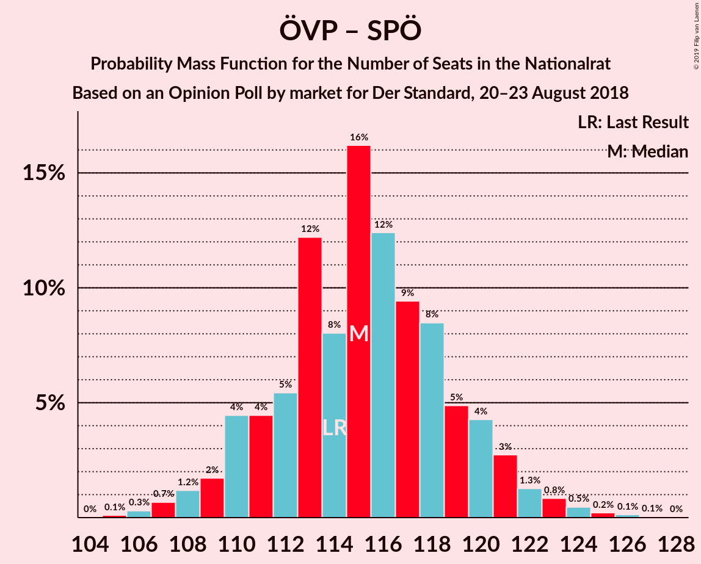
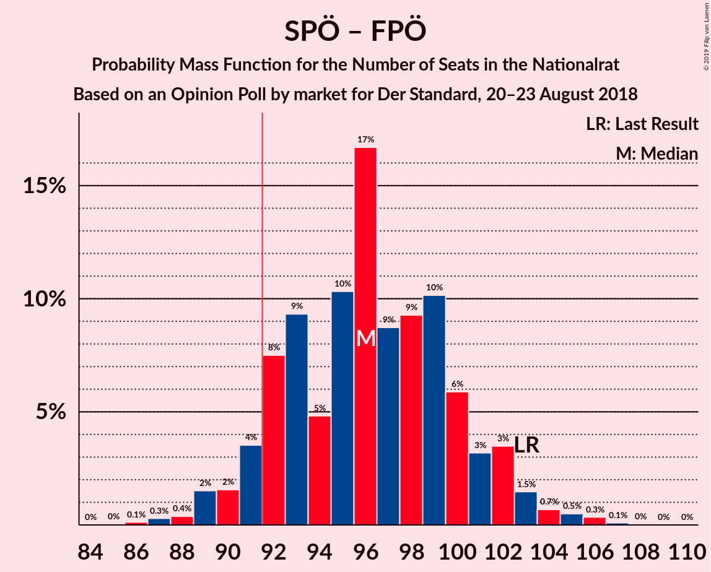

# Opinion Poll by market for Der Standard, 20–23 August 2018

<a href="#voting-intentions">Voting Intentions</a> | <a href="#seats">Seats</a> | <a href="#coalitions">Coalitions</a> | <a href="#technical-information">Technical Information</a>

## Voting Intentions

### Confidence Intervals

| Party | Last Result | Poll Result | 80% Confidence Interval | 90% Confidence Interval | 95% Confidence Interval | 99% Confidence Interval |
|:-----:|:-----------:|:-----------:|:-----------------------:|:-----------------------:|:-----------------------:|:-----------------------:|
| Österreichische Volkspartei | 31.5% | 33.0% | 30.9–35.2% |30.3–35.8% |29.8–36.3% |28.8–37.4% |
| Sozialdemokratische Partei Österreichs | 26.9% | 28.0% | 26.0–30.1% |25.5–30.7% |25.0–31.2% |24.1–32.3% |
| Freiheitliche Partei Österreichs | 26.0% | 23.0% | 21.2–25.0% |20.7–25.6% |20.2–26.0% |19.4–27.0% |
| NEOS–Das Neue Österreich und Liberales Forum | 5.3% | 7.0% | 6.0–8.3% |5.7–8.7% |5.4–9.0% |5.0–9.6% |
| Die Grünen–Die Grüne Alternative | 3.8% | 6.0% | 5.0–7.2% |4.8–7.6% |4.6–7.9% |4.1–8.5% |
| JETZT–Liste Pilz | 4.4% | 2.0% | 1.5–2.8% |1.4–3.0% |1.2–3.2% |1.0–3.7% |

*Note:* The poll result column reflects the actual value used in the calculations. Published results may vary slightly, and in addition be rounded to fewer digits.

## Seats

### Confidence Intervals

| Party | Last Result | Median | 80% Confidence Interval | 90% Confidence Interval | 95% Confidence Interval | 99% Confidence Interval |
|:-----:|:-----------:|:------:|:-----------------------:|:-----------------------:|:-----------------------:|:-----------------------:|
| <a href="#österreichische-volkspartei">Österreichische Volkspartei</a> | 62 | 60 | 60–61 |57–61 |57–61 |56–65 |
| <a href="#sozialdemokratische-partei-österreichs">Sozialdemokratische Partei Österreichs</a> | 52 | 54 | 53–58 |53–60 |53–60 |53–60 |
| <a href="#freiheitliche-partei-österreichs">Freiheitliche Partei Österreichs</a> | 51 | 43 | 43 |43 |43 |42–46 |
| <a href="#neos–das-neue-österreich-und-liberales-forum">NEOS–Das Neue Österreich und Liberales Forum</a> | 10 | 13 | 13–15 |12–15 |12–15 |10–15 |
| <a href="#die-grünen–die-grüne-alternative">Die Grünen–Die Grüne Alternative</a> | 0 | 12 | 11–12 |11–12 |11–12 |0–13 |
| <a href="#jetzt–liste-pilz">JETZT–Liste Pilz</a> | 8 | 0 | 0 |0 |0 |0 |

### Österreichische Volkspartei

*For a full overview of the results for this party, see the [Österreichische Volkspartei](party-österreichischevolkspartei.html) page.*

| Number of Seats | Probability | Accumulated | Special Marks |
|:---------------:|:-----------:|:-----------:|:-------------:|
| 54 | 0% | 100% |  |
| 55 | 0% | 99.9% |  |
| 56 | 2% | 99.9% |  |
| 57 | 7% | 98% |  |
| 58 | 0% | 91% |  |
| 59 | 0% | 90% |  |
| 60 | 43% | 90% | Median |
| 61 | 46% | 48% |  |
| 62 | 0.1% | 2% | Last Result |
| 63 | 0.9% | 2% |  |
| 64 | 0% | 1.4% |  |
| 65 | 1.0% | 1.4% |  |
| 66 | 0.2% | 0.4% |  |
| 67 | 0.1% | 0.2% |  |
| 68 | 0% | 0.1% |  |
| 69 | 0% | 0.1% |  |
| 70 | 0% | 0.1% |  |
| 71 | 0% | 0.1% |  |
| 72 | 0.1% | 0.1% |  |
| 73 | 0% | 0% |  |

### Sozialdemokratische Partei Österreichs

*For a full overview of the results for this party, see the [Sozialdemokratische Partei Österreichs](party-sozialdemokratischeparteiösterreichs.html) page.*

| Number of Seats | Probability | Accumulated | Special Marks |
|:---------------:|:-----------:|:-----------:|:-------------:|
| 50 | 0.1% | 100% |  |
| 51 | 0% | 99.9% |  |
| 52 | 0.2% | 99.9% | Last Result |
| 53 | 43% | 99.7% |  |
| 54 | 46% | 56% | Median |
| 55 | 0% | 11% |  |
| 56 | 0.3% | 11% |  |
| 57 | 0.1% | 10% |  |
| 58 | 2% | 10% |  |
| 59 | 0.8% | 8% |  |
| 60 | 7% | 7% |  |
| 61 | 0.1% | 0.1% |  |
| 62 | 0% | 0% |  |

### Freiheitliche Partei Österreichs

*For a full overview of the results for this party, see the [Freiheitliche Partei Österreichs](party-freiheitlicheparteiösterreichs.html) page.*

| Number of Seats | Probability | Accumulated | Special Marks |
|:---------------:|:-----------:|:-----------:|:-------------:|
| 36 | 0.2% | 100% |  |
| 37 | 0.1% | 99.8% |  |
| 38 | 0% | 99.8% |  |
| 39 | 0% | 99.7% |  |
| 40 | 0% | 99.7% |  |
| 41 | 0.1% | 99.7% |  |
| 42 | 1.2% | 99.7% |  |
| 43 | 97% | 98% | Median |
| 44 | 0.1% | 1.1% |  |
| 45 | 0.1% | 1.0% |  |
| 46 | 0.9% | 0.9% |  |
| 47 | 0% | 0% |  |
| 48 | 0% | 0% |  |
| 49 | 0% | 0% |  |
| 50 | 0% | 0% |  |
| 51 | 0% | 0% | Last Result |

### NEOS–Das Neue Österreich und Liberales Forum

*For a full overview of the results for this party, see the [NEOS–Das Neue Österreich und Liberales Forum](party-neos–dasneueösterreichundliberalesforum.html) page.*

| Number of Seats | Probability | Accumulated | Special Marks |
|:---------------:|:-----------:|:-----------:|:-------------:|
| 9 | 0% | 100% |  |
| 10 | 1.1% | 99.9% | Last Result |
| 11 | 0.1% | 98.9% |  |
| 12 | 7% | 98.8% |  |
| 13 | 46% | 92% | Median |
| 14 | 0% | 46% |  |
| 15 | 45% | 46% |  |
| 16 | 0.1% | 0.4% |  |
| 17 | 0.3% | 0.3% |  |
| 18 | 0% | 0% |  |

### Die Grünen–Die Grüne Alternative

*For a full overview of the results for this party, see the [Die Grünen–Die Grüne Alternative](party-diegrünen–diegrünealternative.html) page.*

| Number of Seats | Probability | Accumulated | Special Marks |
|:---------------:|:-----------:|:-----------:|:-------------:|
| 0 | 1.0% | 100% | Last Result |
| 1 | 0% | 99.0% |  |
| 2 | 0% | 99.0% |  |
| 3 | 0% | 99.0% |  |
| 4 | 0% | 99.0% |  |
| 5 | 0% | 99.0% |  |
| 6 | 0% | 99.0% |  |
| 7 | 0% | 99.0% |  |
| 8 | 0.1% | 99.0% |  |
| 9 | 0% | 98.9% |  |
| 10 | 0% | 98.9% |  |
| 11 | 9% | 98.8% |  |
| 12 | 88% | 89% | Median |
| 13 | 0.9% | 1.1% |  |
| 14 | 0% | 0.2% |  |
| 15 | 0% | 0.2% |  |
| 16 | 0.2% | 0.2% |  |
| 17 | 0% | 0% |  |

### JETZT–Liste Pilz

*For a full overview of the results for this party, see the [JETZT–Liste Pilz](party-jetzt–listepilz.html) page.*

| Number of Seats | Probability | Accumulated | Special Marks |
|:---------------:|:-----------:|:-----------:|:-------------:|
| 0 | 100% | 100% | Median |
| 1 | 0% | 0% |  |
| 2 | 0% | 0% |  |
| 3 | 0% | 0% |  |
| 4 | 0% | 0% |  |
| 5 | 0% | 0% |  |
| 6 | 0% | 0% |  |
| 7 | 0% | 0% |  |
| 8 | 0% | 0% | Last Result |

## Coalitions

### Confidence Intervals

| Coalition | Last Result | Median | Majority? | 80% Confidence Interval | 90% Confidence Interval | 95% Confidence Interval | 99% Confidence Interval |
|:---------:|:-----------:|:------:|:---------:|:-----------------------:|:-----------------------:|:-----------------------:|:-----------------------:|
| Österreichische Volkspartei – Sozialdemokratische Partei Österreichs | 114 | 115 | 100% | 113–115 | 113–117 | 113–117 | 113–122 |
| Österreichische Volkspartei – Freiheitliche Partei Österreichs | 113 | 103 | 100% | 103–104 | 100–104 | 99–104 | 99–109 |
| Sozialdemokratische Partei Österreichs – Freiheitliche Partei Österreichs | 103 | 97 | 99.7% | 96–101 | 96–103 | 96–103 | 95–105 |
| Österreichische Volkspartei | 62 | 60 | 0% | 60–61 | 57–61 | 57–61 | 56–65 |
| Sozialdemokratische Partei Österreichs | 52 | 54 | 0% | 53–58 | 53–60 | 53–60 | 53–60 |

### Österreichische Volkspartei – Sozialdemokratische Partei Österreichs

| Number of Seats | Probability | Accumulated | Special Marks |
|:---------------:|:-----------:|:-----------:|:-------------:|
| 111 | 0.1% | 100% |  |
| 112 | 0.1% | 99.9% |  |
| 113 | 43% | 99.8% |  |
| 114 | 2% | 57% | Last Result, Median |
| 115 | 46% | 55% |  |
| 116 | 0% | 9% |  |
| 117 | 7% | 9% |  |
| 118 | 1.0% | 2% |  |
| 119 | 0.2% | 1.4% |  |
| 120 | 0.1% | 1.1% |  |
| 121 | 0% | 1.0% |  |
| 122 | 0.8% | 1.0% |  |
| 123 | 0% | 0.2% |  |
| 124 | 0% | 0.2% |  |
| 125 | 0.1% | 0.2% |  |
| 126 | 0.1% | 0.1% |  |
| 127 | 0% | 0% |  |

### Österreichische Volkspartei – Freiheitliche Partei Österreichs

| Number of Seats | Probability | Accumulated | Special Marks |
|:---------------:|:-----------:|:-----------:|:-------------:|
| 98 | 0.2% | 100% |  |
| 99 | 2% | 99.8% |  |
| 100 | 7% | 97% |  |
| 101 | 0% | 90% |  |
| 102 | 0.2% | 90% |  |
| 103 | 43% | 90% | Median |
| 104 | 46% | 48% |  |
| 105 | 0.2% | 2% |  |
| 106 | 0% | 2% |  |
| 107 | 0.9% | 2% |  |
| 108 | 0.1% | 1.2% |  |
| 109 | 0.8% | 1.0% |  |
| 110 | 0.2% | 0.2% |  |
| 111 | 0% | 0.1% |  |
| 112 | 0% | 0.1% |  |
| 113 | 0.1% | 0.1% | Last Result |
| 114 | 0% | 0% |  |

### Sozialdemokratische Partei Österreichs – Freiheitliche Partei Österreichs

| Number of Seats | Probability | Accumulated | Special Marks |
|:---------------:|:-----------:|:-----------:|:-------------:|
| 87 | 0.1% | 100% |  |
| 88 | 0.2% | 99.9% |  |
| 89 | 0% | 99.7% |  |
| 90 | 0% | 99.7% |  |
| 91 | 0% | 99.7% |  |
| 92 | 0% | 99.7% | Majority |
| 93 | 0% | 99.7% |  |
| 94 | 0% | 99.7% |  |
| 95 | 0.9% | 99.7% |  |
| 96 | 43% | 98.9% |  |
| 97 | 46% | 56% | Median |
| 98 | 0.4% | 11% |  |
| 99 | 0% | 10% |  |
| 100 | 0% | 10% |  |
| 101 | 2% | 10% |  |
| 102 | 0% | 8% |  |
| 103 | 7% | 8% | Last Result |
| 104 | 0.1% | 1.0% |  |
| 105 | 0.7% | 0.9% |  |
| 106 | 0.1% | 0.1% |  |
| 107 | 0% | 0% |  |

### Österreichische Volkspartei

| Number of Seats | Probability | Accumulated | Special Marks |
|:---------------:|:-----------:|:-----------:|:-------------:|
| 54 | 0% | 100% |  |
| 55 | 0% | 99.9% |  |
| 56 | 2% | 99.9% |  |
| 57 | 7% | 98% |  |
| 58 | 0% | 91% |  |
| 59 | 0% | 90% |  |
| 60 | 43% | 90% | Median |
| 61 | 46% | 48% |  |
| 62 | 0.1% | 2% | Last Result |
| 63 | 0.9% | 2% |  |
| 64 | 0% | 1.4% |  |
| 65 | 1.0% | 1.4% |  |
| 66 | 0.2% | 0.4% |  |
| 67 | 0.1% | 0.2% |  |
| 68 | 0% | 0.1% |  |
| 69 | 0% | 0.1% |  |
| 70 | 0% | 0.1% |  |
| 71 | 0% | 0.1% |  |
| 72 | 0.1% | 0.1% |  |
| 73 | 0% | 0% |  |

### Sozialdemokratische Partei Österreichs

| Number of Seats | Probability | Accumulated | Special Marks |
|:---------------:|:-----------:|:-----------:|:-------------:|
| 50 | 0.1% | 100% |  |
| 51 | 0% | 99.9% |  |
| 52 | 0.2% | 99.9% | Last Result |
| 53 | 43% | 99.7% |  |
| 54 | 46% | 56% | Median |
| 55 | 0% | 11% |  |
| 56 | 0.3% | 11% |  |
| 57 | 0.1% | 10% |  |
| 58 | 2% | 10% |  |
| 59 | 0.8% | 8% |  |
| 60 | 7% | 7% |  |
| 61 | 0.1% | 0.1% |  |
| 62 | 0% | 0% |  |

## Technical Information

### Opinion Poll

+ **Polling firm:** market
+ **Commissioner(s):** Der Standard
+ **Fieldwork period:** 20–23 August 2018

### Calculations

+ **Sample size:** 800
+ **Simulations done:** 1,024
+ **Error estimate:** 2.58%

