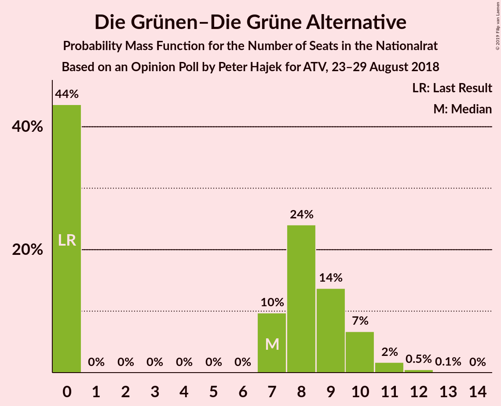
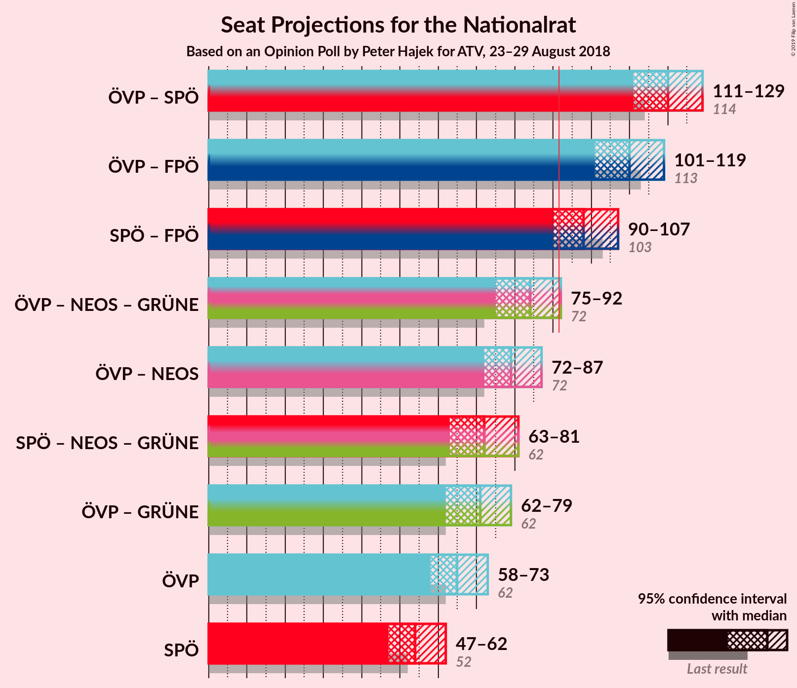
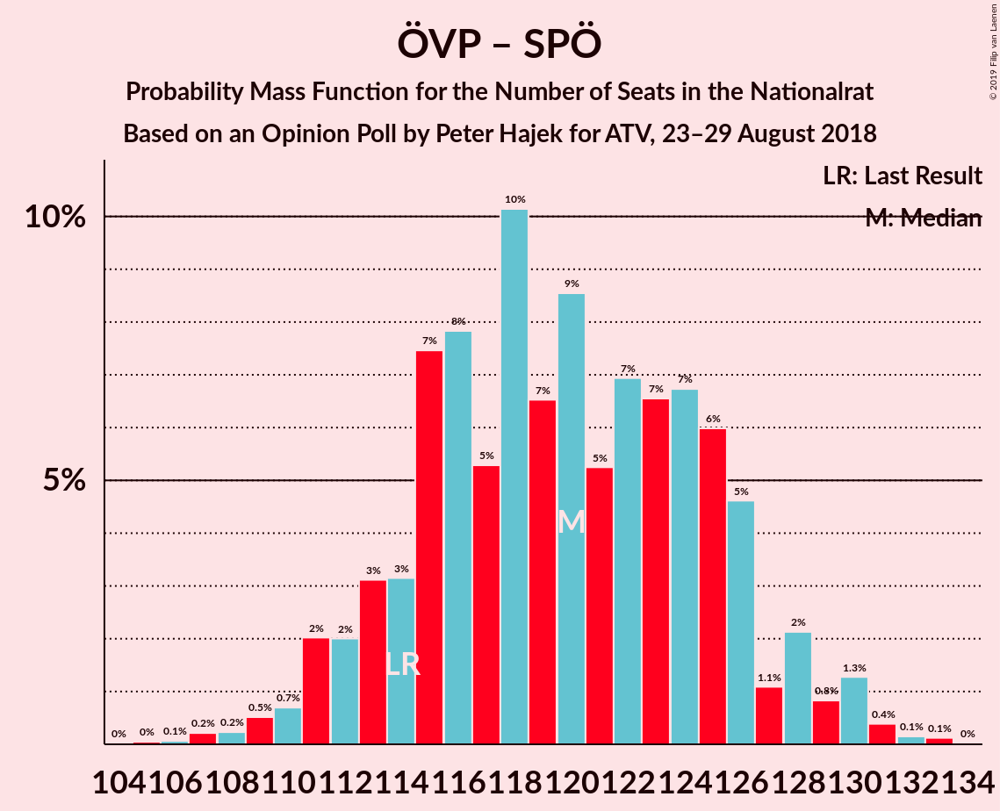

# Opinion Poll by Peter Hajek for ATV, 23–29 August 2018

<a href="#voting-intentions">Voting Intentions</a> | <a href="#seats">Seats</a> | <a href="#coalitions">Coalitions</a> | <a href="#technical-information">Technical Information</a>

## Voting Intentions

### Confidence Intervals

| Party | Last Result | Poll Result | 80% Confidence Interval | 90% Confidence Interval | 95% Confidence Interval | 99% Confidence Interval |
|:-----:|:-----------:|:-----------:|:-----------------------:|:-----------------------:|:-----------------------:|:-----------------------:|
| Österreichische Volkspartei | 31.5% | 34.0% | 31.8–36.4% |31.1–37.0% |30.6–37.6% |29.5–38.7% |
| Sozialdemokratische Partei Österreichs | 26.9% | 28.0% | 25.9–30.3% |25.3–30.9% |24.8–31.4% |23.8–32.5% |
| Freiheitliche Partei Österreichs | 26.0% | 23.0% | 21.0–25.1% |20.5–25.7% |20.0–26.3% |19.1–27.3% |
| NEOS–Das Neue Österreich und Liberales Forum | 5.3% | 7.0% | 5.9–8.4% |5.6–8.8% |5.3–9.1% |4.8–9.9% |
| Die Grünen–Die Grüne Alternative | 3.8% | 4.0% | 3.2–5.1% |3.0–5.4% |2.8–5.7% |2.4–6.3% |
| JETZT–Liste Pilz | 4.4% | 3.0% | 2.3–4.0% |2.1–4.3% |2.0–4.6% |1.7–5.1% |

*Note:* The poll result column reflects the actual value used in the calculations. Published results may vary slightly, and in addition be rounded to fewer digits.

## Seats

### Confidence Intervals

| Party | Last Result | Median | 80% Confidence Interval | 90% Confidence Interval | 95% Confidence Interval | 99% Confidence Interval |
|:-----:|:-----------:|:------:|:-----------------------:|:-----------------------:|:-----------------------:|:-----------------------:|
| <a href="#österreichische-volkspartei">Österreichische Volkspartei</a> | 62 | 66 | 66 |61–70 |59–75 |59–75 |
| <a href="#sozialdemokratische-partei-österreichs">Sozialdemokratische Partei Österreichs</a> | 52 | 53 | 53 |51–53 |51–55 |46–60 |
| <a href="#freiheitliche-partei-österreichs">Freiheitliche Partei Österreichs</a> | 51 | 47 | 47 |45–47 |45–51 |38–53 |
| <a href="#neos–das-neue-österreich-und-liberales-forum">NEOS–Das Neue Österreich und Liberales Forum</a> | 10 | 17 | 14–17 |12–17 |12–17 |9–17 |
| <a href="#die-grünen–die-grüne-alternative">Die Grünen–Die Grüne Alternative</a> | 0 | 0 | 0 |0 |0–8 |0–11 |
| <a href="#jetzt–liste-pilz">JETZT–Liste Pilz</a> | 8 | 0 | 0 |0 |0 |0–9 |

### Österreichische Volkspartei

*For a full overview of the results for this party, see the [Österreichische Volkspartei](party-österreichischevolkspartei.html) page.*

| Number of Seats | Probability | Accumulated | Special Marks |
|:---------------:|:-----------:|:-----------:|:-------------:|
| 55 | 0.2% | 100% |  |
| 56 | 0.1% | 99.8% |  |
| 57 | 0.1% | 99.6% |  |
| 58 | 0% | 99.5% |  |
| 59 | 2% | 99.5% |  |
| 60 | 1.2% | 97% |  |
| 61 | 2% | 96% |  |
| 62 | 0.1% | 95% | Last Result |
| 63 | 0% | 95% |  |
| 64 | 0.6% | 95% |  |
| 65 | 1.1% | 94% |  |
| 66 | 88% | 93% | Median |
| 67 | 0% | 5% |  |
| 68 | 0.1% | 5% |  |
| 69 | 0.1% | 5% |  |
| 70 | 0.2% | 5% |  |
| 71 | 0.1% | 5% |  |
| 72 | 0.4% | 5% |  |
| 73 | 0% | 4% |  |
| 74 | 0% | 4% |  |
| 75 | 4% | 4% |  |
| 76 | 0% | 0% |  |

### Sozialdemokratische Partei Österreichs

*For a full overview of the results for this party, see the [Sozialdemokratische Partei Österreichs](party-sozialdemokratischeparteiösterreichs.html) page.*

| Number of Seats | Probability | Accumulated | Special Marks |
|:---------------:|:-----------:|:-----------:|:-------------:|
| 43 | 0.2% | 100% |  |
| 44 | 0% | 99.8% |  |
| 45 | 0% | 99.8% |  |
| 46 | 1.0% | 99.8% |  |
| 47 | 0% | 98.8% |  |
| 48 | 0% | 98.8% |  |
| 49 | 0.2% | 98.7% |  |
| 50 | 0.5% | 98.6% |  |
| 51 | 4% | 98% |  |
| 52 | 0.1% | 94% | Last Result |
| 53 | 89% | 93% | Median |
| 54 | 0% | 4% |  |
| 55 | 2% | 4% |  |
| 56 | 0.1% | 2% |  |
| 57 | 0% | 2% |  |
| 58 | 0.5% | 2% |  |
| 59 | 0% | 1.4% |  |
| 60 | 1.2% | 1.4% |  |
| 61 | 0% | 0.2% |  |
| 62 | 0% | 0.2% |  |
| 63 | 0.1% | 0.2% |  |
| 64 | 0% | 0.1% |  |
| 65 | 0% | 0.1% |  |
| 66 | 0% | 0.1% |  |
| 67 | 0.1% | 0.1% |  |
| 68 | 0% | 0% |  |

### Freiheitliche Partei Österreichs

*For a full overview of the results for this party, see the [Freiheitliche Partei Österreichs](party-freiheitlicheparteiösterreichs.html) page.*

| Number of Seats | Probability | Accumulated | Special Marks |
|:---------------:|:-----------:|:-----------:|:-------------:|
| 34 | 0.1% | 100% |  |
| 35 | 0% | 99.8% |  |
| 36 | 0.2% | 99.8% |  |
| 37 | 0% | 99.7% |  |
| 38 | 1.2% | 99.7% |  |
| 39 | 0% | 98% |  |
| 40 | 0% | 98% |  |
| 41 | 0% | 98% |  |
| 42 | 0.2% | 98% |  |
| 43 | 0% | 98% |  |
| 44 | 0% | 98% |  |
| 45 | 4% | 98% |  |
| 46 | 0.3% | 94% |  |
| 47 | 90% | 93% | Median |
| 48 | 0% | 3% |  |
| 49 | 0% | 3% |  |
| 50 | 0.5% | 3% |  |
| 51 | 1.4% | 3% | Last Result |
| 52 | 0.3% | 1.5% |  |
| 53 | 0.9% | 1.2% |  |
| 54 | 0% | 0.3% |  |
| 55 | 0.3% | 0.3% |  |
| 56 | 0% | 0% |  |

### NEOS–Das Neue Österreich und Liberales Forum

*For a full overview of the results for this party, see the [NEOS–Das Neue Österreich und Liberales Forum](party-neos–dasneueösterreichundliberalesforum.html) page.*

| Number of Seats | Probability | Accumulated | Special Marks |
|:---------------:|:-----------:|:-----------:|:-------------:|
| 8 | 0.4% | 100% |  |
| 9 | 0.3% | 99.6% |  |
| 10 | 0.1% | 99.3% | Last Result |
| 11 | 1.2% | 99.2% |  |
| 12 | 7% | 98% |  |
| 13 | 0.2% | 91% |  |
| 14 | 2% | 91% |  |
| 15 | 0.6% | 89% |  |
| 16 | 0.3% | 89% |  |
| 17 | 88% | 88% | Median |
| 18 | 0.2% | 0.4% |  |
| 19 | 0% | 0.2% |  |
| 20 | 0.1% | 0.2% |  |
| 21 | 0.1% | 0.1% |  |
| 22 | 0% | 0% |  |

### Die Grünen–Die Grüne Alternative

*For a full overview of the results for this party, see the [Die Grünen–Die Grüne Alternative](party-diegrünen–diegrünealternative.html) page.*

| Number of Seats | Probability | Accumulated | Special Marks |
|:---------------:|:-----------:|:-----------:|:-------------:|
| 0 | 96% | 100% | Last Result, Median |
| 1 | 0% | 4% |  |
| 2 | 0% | 4% |  |
| 3 | 0% | 4% |  |
| 4 | 0% | 4% |  |
| 5 | 0% | 4% |  |
| 6 | 0% | 4% |  |
| 7 | 0% | 4% |  |
| 8 | 3% | 4% |  |
| 9 | 0.5% | 2% |  |
| 10 | 0.1% | 1.3% |  |
| 11 | 1.2% | 1.2% |  |
| 12 | 0% | 0.1% |  |
| 13 | 0% | 0% |  |

### JETZT–Liste Pilz

*For a full overview of the results for this party, see the [JETZT–Liste Pilz](party-jetzt–listepilz.html) page.*

| Number of Seats | Probability | Accumulated | Special Marks |
|:---------------:|:-----------:|:-----------:|:-------------:|
| 0 | 98% | 100% | Median |
| 1 | 0% | 2% |  |
| 2 | 0% | 2% |  |
| 3 | 0% | 2% |  |
| 4 | 0% | 2% |  |
| 5 | 0% | 2% |  |
| 6 | 0% | 2% |  |
| 7 | 0.9% | 2% |  |
| 8 | 0.2% | 2% | Last Result |
| 9 | 1.2% | 1.3% |  |
| 10 | 0.1% | 0.2% |  |
| 11 | 0% | 0% |  |

## Coalitions

### Confidence Intervals

| Coalition | Last Result | Median | Majority? | 80% Confidence Interval | 90% Confidence Interval | 95% Confidence Interval | 99% Confidence Interval |
|:---------:|:-----------:|:------:|:---------:|:-----------------------:|:-----------------------:|:-----------------------:|:-----------------------:|
| Österreichische Volkspartei – Sozialdemokratische Partei Österreichs | 114 | 119 | 100% | 119 | 114–125 | 113–126 | 111–126 |
| Österreichische Volkspartei – Freiheitliche Partei Österreichs | 113 | 113 | 100% | 113 | 112–118 | 106–120 | 98–121 |
| Sozialdemokratische Partei Österreichs – Freiheitliche Partei Österreichs | 103 | 100 | 98% | 100 | 96–100 | 96–102 | 91–111 |
| Österreichische Volkspartei | 62 | 66 | 0% | 66 | 61–70 | 59–75 | 59–75 |
| Sozialdemokratische Partei Österreichs | 52 | 53 | 0% | 53 | 51–53 | 51–55 | 46–60 |

### Österreichische Volkspartei – Sozialdemokratische Partei Österreichs

| Number of Seats | Probability | Accumulated | Special Marks |
|:---------------:|:-----------:|:-----------:|:-------------:|
| 105 | 0.2% | 100% |  |
| 106 | 0% | 99.8% |  |
| 107 | 0% | 99.8% |  |
| 108 | 0.2% | 99.8% |  |
| 109 | 0% | 99.6% |  |
| 110 | 0.1% | 99.6% |  |
| 111 | 1.2% | 99.6% |  |
| 112 | 0.1% | 98% |  |
| 113 | 1.3% | 98% |  |
| 114 | 2% | 97% | Last Result |
| 115 | 0% | 95% |  |
| 116 | 0.2% | 95% |  |
| 117 | 0.1% | 95% |  |
| 118 | 0% | 95% |  |
| 119 | 88% | 95% | Median |
| 120 | 0% | 7% |  |
| 121 | 1.2% | 7% |  |
| 122 | 0.3% | 5% |  |
| 123 | 0% | 5% |  |
| 124 | 0.1% | 5% |  |
| 125 | 0.4% | 5% |  |
| 126 | 4% | 5% |  |
| 127 | 0% | 0.2% |  |
| 128 | 0.2% | 0.2% |  |
| 129 | 0% | 0% |  |

### Österreichische Volkspartei – Freiheitliche Partei Österreichs

| Number of Seats | Probability | Accumulated | Special Marks |
|:---------------:|:-----------:|:-----------:|:-------------:|
| 98 | 1.3% | 100% |  |
| 99 | 0% | 98.7% |  |
| 100 | 0.2% | 98.7% |  |
| 101 | 0% | 98.5% |  |
| 102 | 0% | 98.5% |  |
| 103 | 0.1% | 98% |  |
| 104 | 0.1% | 98% |  |
| 105 | 0% | 98% |  |
| 106 | 2% | 98% |  |
| 107 | 0.3% | 96% |  |
| 108 | 0% | 96% |  |
| 109 | 0.1% | 96% |  |
| 110 | 0.4% | 96% |  |
| 111 | 0% | 96% |  |
| 112 | 1.3% | 95% |  |
| 113 | 88% | 94% | Last Result, Median |
| 114 | 0% | 6% |  |
| 115 | 0% | 6% |  |
| 116 | 0.5% | 6% |  |
| 117 | 0% | 6% |  |
| 118 | 0.9% | 6% |  |
| 119 | 0% | 5% |  |
| 120 | 4% | 5% |  |
| 121 | 0.1% | 0.5% |  |
| 122 | 0.4% | 0.4% |  |
| 123 | 0% | 0% |  |

### Sozialdemokratische Partei Österreichs – Freiheitliche Partei Österreichs

| Number of Seats | Probability | Accumulated | Special Marks |
|:---------------:|:-----------:|:-----------:|:-------------:|
| 85 | 0.1% | 100% |  |
| 86 | 0.1% | 99.8% |  |
| 87 | 0% | 99.7% |  |
| 88 | 0% | 99.7% |  |
| 89 | 0% | 99.7% |  |
| 90 | 0% | 99.7% |  |
| 91 | 1.2% | 99.6% |  |
| 92 | 0% | 98% | Majority |
| 93 | 0% | 98% |  |
| 94 | 0.2% | 98% |  |
| 95 | 0% | 98% |  |
| 96 | 5% | 98% |  |
| 97 | 0% | 94% |  |
| 98 | 0% | 94% |  |
| 99 | 0.9% | 94% |  |
| 100 | 88% | 93% | Median |
| 101 | 0% | 5% |  |
| 102 | 2% | 5% |  |
| 103 | 0.4% | 2% | Last Result |
| 104 | 0.4% | 2% |  |
| 105 | 0.3% | 2% |  |
| 106 | 0% | 1.4% |  |
| 107 | 0.2% | 1.4% |  |
| 108 | 0% | 1.3% |  |
| 109 | 0% | 1.3% |  |
| 110 | 0% | 1.3% |  |
| 111 | 1.2% | 1.3% |  |
| 112 | 0% | 0.1% |  |
| 113 | 0% | 0.1% |  |
| 114 | 0.1% | 0.1% |  |
| 115 | 0% | 0% |  |

### Österreichische Volkspartei

| Number of Seats | Probability | Accumulated | Special Marks |
|:---------------:|:-----------:|:-----------:|:-------------:|
| 55 | 0.2% | 100% |  |
| 56 | 0.1% | 99.8% |  |
| 57 | 0.1% | 99.6% |  |
| 58 | 0% | 99.5% |  |
| 59 | 2% | 99.5% |  |
| 60 | 1.2% | 97% |  |
| 61 | 2% | 96% |  |
| 62 | 0.1% | 95% | Last Result |
| 63 | 0% | 95% |  |
| 64 | 0.6% | 95% |  |
| 65 | 1.1% | 94% |  |
| 66 | 88% | 93% | Median |
| 67 | 0% | 5% |  |
| 68 | 0.1% | 5% |  |
| 69 | 0.1% | 5% |  |
| 70 | 0.2% | 5% |  |
| 71 | 0.1% | 5% |  |
| 72 | 0.4% | 5% |  |
| 73 | 0% | 4% |  |
| 74 | 0% | 4% |  |
| 75 | 4% | 4% |  |
| 76 | 0% | 0% |  |

### Sozialdemokratische Partei Österreichs

| Number of Seats | Probability | Accumulated | Special Marks |
|:---------------:|:-----------:|:-----------:|:-------------:|
| 43 | 0.2% | 100% |  |
| 44 | 0% | 99.8% |  |
| 45 | 0% | 99.8% |  |
| 46 | 1.0% | 99.8% |  |
| 47 | 0% | 98.8% |  |
| 48 | 0% | 98.8% |  |
| 49 | 0.2% | 98.7% |  |
| 50 | 0.5% | 98.6% |  |
| 51 | 4% | 98% |  |
| 52 | 0.1% | 94% | Last Result |
| 53 | 89% | 93% | Median |
| 54 | 0% | 4% |  |
| 55 | 2% | 4% |  |
| 56 | 0.1% | 2% |  |
| 57 | 0% | 2% |  |
| 58 | 0.5% | 2% |  |
| 59 | 0% | 1.4% |  |
| 60 | 1.2% | 1.4% |  |
| 61 | 0% | 0.2% |  |
| 62 | 0% | 0.2% |  |
| 63 | 0.1% | 0.2% |  |
| 64 | 0% | 0.1% |  |
| 65 | 0% | 0.1% |  |
| 66 | 0% | 0.1% |  |
| 67 | 0.1% | 0.1% |  |
| 68 | 0% | 0% |  |

## Technical Information

### Opinion Poll

+ **Polling firm:** Peter Hajek
+ **Commissioner(s):** ATV
+ **Fieldwork period:** 23–29 August 2018

### Calculations

+ **Sample size:** 700
+ **Simulations done:** 1,024
+ **Error estimate:** 2.01%

