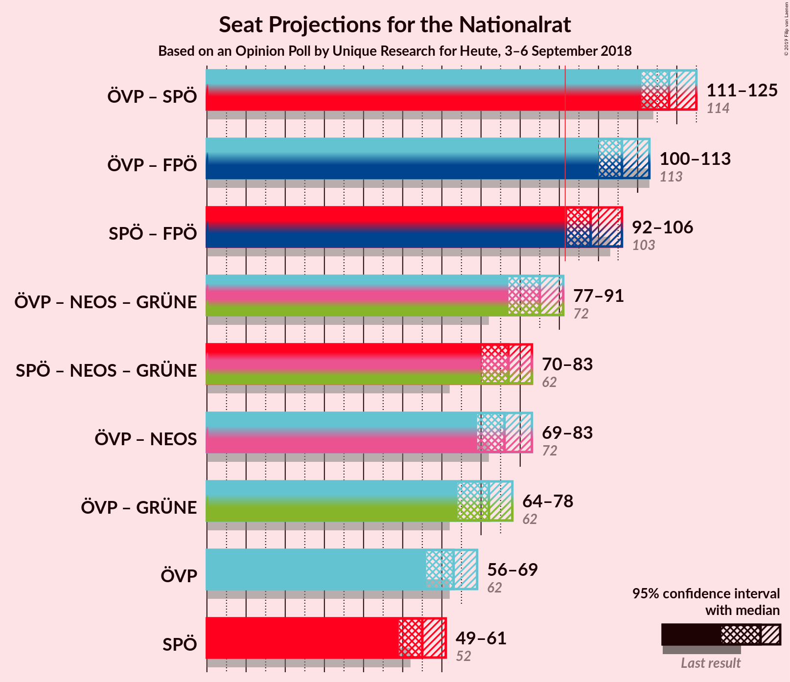

# Opinion Poll by Unique Research for Heute, 3–6 September 2018

<a href="#voting-intentions">Voting Intentions</a> | <a href="#seats">Seats</a> | <a href="#coalitions">Coalitions</a> | <a href="#technical-information">Technical Information</a>

## Voting Intentions

### Confidence Intervals

| Party | Last Result | Poll Result | 80% Confidence Interval | 90% Confidence Interval | 95% Confidence Interval | 99% Confidence Interval |
|:-----:|:-----------:|:-----------:|:-----------------------:|:-----------------------:|:-----------------------:|:-----------------------:|
| Österreichische Volkspartei | 31.5% | 33.0% | 30.9–35.2% |30.3–35.8% |29.8–36.3% |28.8–37.4% |
| Sozialdemokratische Partei Österreichs | 26.9% | 29.0% | 27.0–31.1% |26.4–31.7% |26.0–32.3% |25.0–33.3% |
| Freiheitliche Partei Österreichs | 26.0% | 23.0% | 21.2–25.0% |20.7–25.6% |20.2–26.0% |19.4–27.0% |
| NEOS–Das Neue Österreich und Liberales Forum | 5.3% | 7.0% | 6.0–8.3% |5.7–8.7% |5.4–9.0% |5.0–9.6% |
| Die Grünen–Die Grüne Alternative | 3.8% | 5.0% | 4.1–6.1% |3.9–6.5% |3.7–6.8% |3.3–7.3% |
| JETZT–Liste Pilz | 4.4% | 2.0% | 1.5–2.8% |1.4–3.0% |1.2–3.2% |1.0–3.7% |

*Note:* The poll result column reflects the actual value used in the calculations. Published results may vary slightly, and in addition be rounded to fewer digits.

## Seats

### Confidence Intervals

| Party | Last Result | Median | 80% Confidence Interval | 90% Confidence Interval | 95% Confidence Interval | 99% Confidence Interval |
|:-----:|:-----------:|:------:|:-----------------------:|:-----------------------:|:-----------------------:|:-----------------------:|
| <a href="#österreichische-volkspartei">Österreichische Volkspartei</a> | 62 | 65 | 58–69 |57–69 |56–69 |54–73 |
| <a href="#sozialdemokratische-partei-österreichs">Sozialdemokratische Partei Österreichs</a> | 52 | 53 | 53–63 |53–63 |52–63 |52–63 |
| <a href="#freiheitliche-partei-österreichs">Freiheitliche Partei Österreichs</a> | 51 | 39 | 39–49 |39–49 |38–50 |35–51 |
| <a href="#neos–das-neue-österreich-und-liberales-forum">NEOS–Das Neue Österreich und Liberales Forum</a> | 10 | 12 | 10–14 |10–16 |10–16 |10–16 |
| <a href="#die-grünen–die-grüne-alternative">Die Grünen–Die Grüne Alternative</a> | 0 | 10 | 0–10 |0–11 |0–12 |0–16 |
| <a href="#jetzt–liste-pilz">JETZT–Liste Pilz</a> | 8 | 0 | 0 |0 |0 |0 |

### Österreichische Volkspartei

*For a full overview of the results for this party, see the [Österreichische Volkspartei](party-österreichischevolkspartei.html) page.*

| Number of Seats | Probability | Accumulated | Special Marks |
|:---------------:|:-----------:|:-----------:|:-------------:|
| 53 | 0.1% | 100% |  |
| 54 | 2% | 99.9% |  |
| 55 | 0% | 98% |  |
| 56 | 0.4% | 98% |  |
| 57 | 3% | 97% |  |
| 58 | 9% | 95% |  |
| 59 | 0.1% | 86% |  |
| 60 | 0.6% | 86% |  |
| 61 | 10% | 85% |  |
| 62 | 3% | 75% | Last Result |
| 63 | 1.5% | 72% |  |
| 64 | 2% | 70% |  |
| 65 | 21% | 69% | Median |
| 66 | 0% | 48% |  |
| 67 | 0.1% | 48% |  |
| 68 | 0.3% | 48% |  |
| 69 | 46% | 47% |  |
| 70 | 0% | 1.2% |  |
| 71 | 0% | 1.2% |  |
| 72 | 0% | 1.2% |  |
| 73 | 1.2% | 1.2% |  |
| 74 | 0% | 0% |  |

### Sozialdemokratische Partei Österreichs

*For a full overview of the results for this party, see the [Sozialdemokratische Partei Österreichs](party-sozialdemokratischeparteiösterreichs.html) page.*

| Number of Seats | Probability | Accumulated | Special Marks |
|:---------------:|:-----------:|:-----------:|:-------------:|
| 45 | 0.1% | 100% |  |
| 46 | 0.1% | 99.9% |  |
| 47 | 0% | 99.8% |  |
| 48 | 0% | 99.7% |  |
| 49 | 0% | 99.7% |  |
| 50 | 0% | 99.7% |  |
| 51 | 0% | 99.7% |  |
| 52 | 4% | 99.7% | Last Result |
| 53 | 56% | 96% | Median |
| 54 | 0% | 40% |  |
| 55 | 4% | 40% |  |
| 56 | 0.1% | 36% |  |
| 57 | 0% | 35% |  |
| 58 | 0.2% | 35% |  |
| 59 | 0% | 35% |  |
| 60 | 6% | 35% |  |
| 61 | 9% | 29% |  |
| 62 | 0.1% | 20% |  |
| 63 | 20% | 20% |  |
| 64 | 0% | 0.4% |  |
| 65 | 0% | 0.4% |  |
| 66 | 0% | 0.4% |  |
| 67 | 0.4% | 0.4% |  |
| 68 | 0% | 0% |  |

### Freiheitliche Partei Österreichs

*For a full overview of the results for this party, see the [Freiheitliche Partei Österreichs](party-freiheitlicheparteiösterreichs.html) page.*

| Number of Seats | Probability | Accumulated | Special Marks |
|:---------------:|:-----------:|:-----------:|:-------------:|
| 35 | 1.5% | 100% |  |
| 36 | 0% | 98.5% |  |
| 37 | 0.4% | 98.5% |  |
| 38 | 1.0% | 98% |  |
| 39 | 55% | 97% | Median |
| 40 | 2% | 42% |  |
| 41 | 0.8% | 40% |  |
| 42 | 0% | 39% |  |
| 43 | 20% | 39% |  |
| 44 | 2% | 20% |  |
| 45 | 0.1% | 18% |  |
| 46 | 2% | 18% |  |
| 47 | 0.1% | 16% |  |
| 48 | 3% | 16% |  |
| 49 | 10% | 12% |  |
| 50 | 0.4% | 3% |  |
| 51 | 2% | 2% | Last Result |
| 52 | 0% | 0% |  |

### NEOS–Das Neue Österreich und Liberales Forum

*For a full overview of the results for this party, see the [NEOS–Das Neue Österreich und Liberales Forum](party-neos–dasneueösterreichundliberalesforum.html) page.*

| Number of Seats | Probability | Accumulated | Special Marks |
|:---------------:|:-----------:|:-----------:|:-------------:|
| 8 | 0.2% | 100% |  |
| 9 | 0.1% | 99.8% |  |
| 10 | 13% | 99.6% | Last Result |
| 11 | 6% | 86% |  |
| 12 | 68% | 81% | Median |
| 13 | 3% | 13% |  |
| 14 | 0.8% | 10% |  |
| 15 | 0% | 9% |  |
| 16 | 9% | 9% |  |
| 17 | 0.2% | 0.2% |  |
| 18 | 0% | 0.1% |  |
| 19 | 0% | 0% |  |

### Die Grünen–Die Grüne Alternative

*For a full overview of the results for this party, see the [Die Grünen–Die Grüne Alternative](party-diegrünen–diegrünealternative.html) page.*

| Number of Seats | Probability | Accumulated | Special Marks |
|:---------------:|:-----------:|:-----------:|:-------------:|
| 0 | 21% | 100% | Last Result |
| 1 | 0% | 79% |  |
| 2 | 0% | 79% |  |
| 3 | 0% | 79% |  |
| 4 | 0% | 79% |  |
| 5 | 0% | 79% |  |
| 6 | 0% | 79% |  |
| 7 | 3% | 79% |  |
| 8 | 3% | 77% |  |
| 9 | 10% | 74% |  |
| 10 | 56% | 64% | Median |
| 11 | 4% | 8% |  |
| 12 | 2% | 4% |  |
| 13 | 1.5% | 2% |  |
| 14 | 0.1% | 0.7% |  |
| 15 | 0% | 0.6% |  |
| 16 | 0.6% | 0.6% |  |
| 17 | 0% | 0% |  |

### JETZT–Liste Pilz

*For a full overview of the results for this party, see the [JETZT–Liste Pilz](party-jetzt–listepilz.html) page.*

| Number of Seats | Probability | Accumulated | Special Marks |
|:---------------:|:-----------:|:-----------:|:-------------:|
| 0 | 99.6% | 100% | Median |
| 1 | 0% | 0.4% |  |
| 2 | 0% | 0.4% |  |
| 3 | 0% | 0.4% |  |
| 4 | 0% | 0.4% |  |
| 5 | 0% | 0.4% |  |
| 6 | 0% | 0.4% |  |
| 7 | 0.4% | 0.4% |  |
| 8 | 0% | 0% | Last Result |

## Coalitions

### Confidence Intervals

| Coalition | Last Result | Median | Majority? | 80% Confidence Interval | 90% Confidence Interval | 95% Confidence Interval | 99% Confidence Interval |
|:---------:|:-----------:|:------:|:---------:|:-----------------------:|:-----------------------:|:-----------------------:|:-----------------------:|
| Österreichische Volkspartei – Sozialdemokratische Partei Österreichs | 114 | 122 | 100% | 114–128 | 114–128 | 112–128 | 112–128 |
| Österreichische Volkspartei – Freiheitliche Partei Österreichs | 113 | 108 | 100% | 98–110 | 97–110 | 97–110 | 96–117 |
| Sozialdemokratische Partei Österreichs – Freiheitliche Partei Österreichs | 103 | 98 | 99.4% | 92–106 | 92–106 | 92–106 | 90–107 |
| Österreichische Volkspartei | 62 | 65 | 0% | 58–69 | 57–69 | 56–69 | 54–73 |
| Sozialdemokratische Partei Österreichs | 52 | 53 | 0% | 53–63 | 53–63 | 52–63 | 52–63 |

### Österreichische Volkspartei – Sozialdemokratische Partei Österreichs

| Number of Seats | Probability | Accumulated | Special Marks |
|:---------------:|:-----------:|:-----------:|:-------------:|
| 108 | 0.1% | 100% |  |
| 109 | 0% | 99.9% |  |
| 110 | 0% | 99.9% |  |
| 111 | 0% | 99.9% |  |
| 112 | 3% | 99.9% |  |
| 113 | 0.1% | 97% |  |
| 114 | 15% | 97% | Last Result |
| 115 | 0.1% | 82% |  |
| 116 | 0.4% | 82% |  |
| 117 | 0.4% | 82% |  |
| 118 | 0% | 81% | Median |
| 119 | 9% | 81% |  |
| 120 | 0.8% | 72% |  |
| 121 | 0% | 71% |  |
| 122 | 47% | 71% |  |
| 123 | 1.5% | 25% |  |
| 124 | 2% | 23% |  |
| 125 | 0% | 21% |  |
| 126 | 0.2% | 21% |  |
| 127 | 0% | 21% |  |
| 128 | 21% | 21% |  |
| 129 | 0.1% | 0.1% |  |
| 130 | 0% | 0% |  |

### Österreichische Volkspartei – Freiheitliche Partei Österreichs

| Number of Seats | Probability | Accumulated | Special Marks |
|:---------------:|:-----------:|:-----------:|:-------------:|
| 95 | 0.4% | 100% |  |
| 96 | 0.1% | 99.6% |  |
| 97 | 9% | 99.5% |  |
| 98 | 2% | 91% |  |
| 99 | 0% | 89% |  |
| 100 | 2% | 89% |  |
| 101 | 0% | 87% |  |
| 102 | 0% | 87% |  |
| 103 | 0.4% | 87% |  |
| 104 | 3% | 86% | Median |
| 105 | 0% | 84% |  |
| 106 | 1.3% | 84% |  |
| 107 | 0% | 82% |  |
| 108 | 68% | 82% |  |
| 109 | 0.1% | 14% |  |
| 110 | 13% | 14% |  |
| 111 | 0% | 1.3% |  |
| 112 | 0% | 1.3% |  |
| 113 | 0% | 1.3% | Last Result |
| 114 | 0% | 1.3% |  |
| 115 | 0% | 1.3% |  |
| 116 | 0% | 1.3% |  |
| 117 | 1.2% | 1.3% |  |
| 118 | 0% | 0.1% |  |
| 119 | 0.1% | 0.1% |  |
| 120 | 0% | 0% |  |

### Sozialdemokratische Partei Österreichs – Freiheitliche Partei Österreichs

| Number of Seats | Probability | Accumulated | Special Marks |
|:---------------:|:-----------:|:-----------:|:-------------:|
| 88 | 0.1% | 100% |  |
| 89 | 0% | 99.9% |  |
| 90 | 0.4% | 99.9% |  |
| 91 | 0% | 99.4% |  |
| 92 | 46% | 99.4% | Median, Majority |
| 93 | 0% | 53% |  |
| 94 | 0% | 53% |  |
| 95 | 1.5% | 53% |  |
| 96 | 2% | 52% |  |
| 97 | 0.1% | 50% |  |
| 98 | 0.5% | 50% |  |
| 99 | 1.1% | 50% |  |
| 100 | 14% | 48% |  |
| 101 | 0.2% | 34% |  |
| 102 | 10% | 34% |  |
| 103 | 0% | 25% | Last Result |
| 104 | 0% | 25% |  |
| 105 | 0.4% | 25% |  |
| 106 | 24% | 24% |  |
| 107 | 0.1% | 0.5% |  |
| 108 | 0% | 0.4% |  |
| 109 | 0% | 0.4% |  |
| 110 | 0.4% | 0.4% |  |
| 111 | 0% | 0.1% |  |
| 112 | 0% | 0% |  |

### Österreichische Volkspartei

| Number of Seats | Probability | Accumulated | Special Marks |
|:---------------:|:-----------:|:-----------:|:-------------:|
| 53 | 0.1% | 100% |  |
| 54 | 2% | 99.9% |  |
| 55 | 0% | 98% |  |
| 56 | 0.4% | 98% |  |
| 57 | 3% | 97% |  |
| 58 | 9% | 95% |  |
| 59 | 0.1% | 86% |  |
| 60 | 0.6% | 86% |  |
| 61 | 10% | 85% |  |
| 62 | 3% | 75% | Last Result |
| 63 | 1.5% | 72% |  |
| 64 | 2% | 70% |  |
| 65 | 21% | 69% | Median |
| 66 | 0% | 48% |  |
| 67 | 0.1% | 48% |  |
| 68 | 0.3% | 48% |  |
| 69 | 46% | 47% |  |
| 70 | 0% | 1.2% |  |
| 71 | 0% | 1.2% |  |
| 72 | 0% | 1.2% |  |
| 73 | 1.2% | 1.2% |  |
| 74 | 0% | 0% |  |

### Sozialdemokratische Partei Österreichs

| Number of Seats | Probability | Accumulated | Special Marks |
|:---------------:|:-----------:|:-----------:|:-------------:|
| 45 | 0.1% | 100% |  |
| 46 | 0.1% | 99.9% |  |
| 47 | 0% | 99.8% |  |
| 48 | 0% | 99.7% |  |
| 49 | 0% | 99.7% |  |
| 50 | 0% | 99.7% |  |
| 51 | 0% | 99.7% |  |
| 52 | 4% | 99.7% | Last Result |
| 53 | 56% | 96% | Median |
| 54 | 0% | 40% |  |
| 55 | 4% | 40% |  |
| 56 | 0.1% | 36% |  |
| 57 | 0% | 35% |  |
| 58 | 0.2% | 35% |  |
| 59 | 0% | 35% |  |
| 60 | 6% | 35% |  |
| 61 | 9% | 29% |  |
| 62 | 0.1% | 20% |  |
| 63 | 20% | 20% |  |
| 64 | 0% | 0.4% |  |
| 65 | 0% | 0.4% |  |
| 66 | 0% | 0.4% |  |
| 67 | 0.4% | 0.4% |  |
| 68 | 0% | 0% |  |

## Technical Information

### Opinion Poll

+ **Polling firm:** Unique Research
+ **Commissioner(s):** Heute
+ **Fieldwork period:** 3–6 September 2018

### Calculations

+ **Sample size:** 800
+ **Simulations done:** 1,024
+ **Error estimate:** 3.73%

